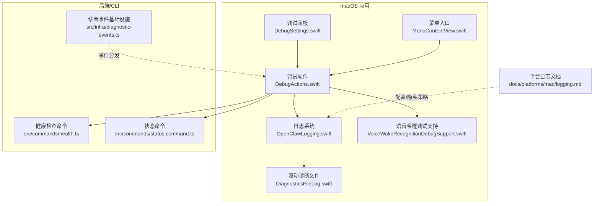
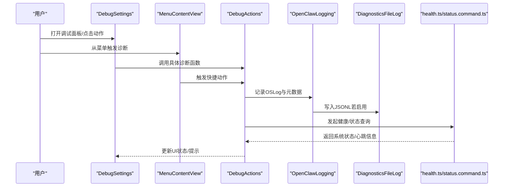
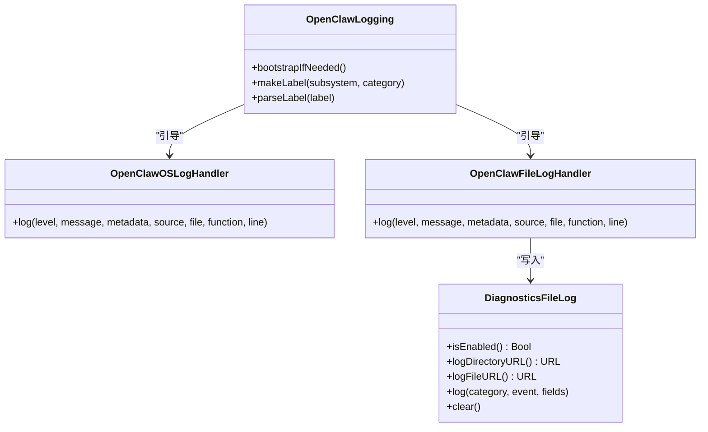
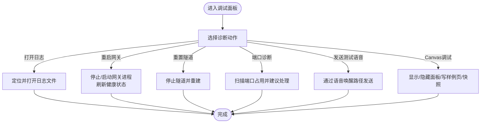
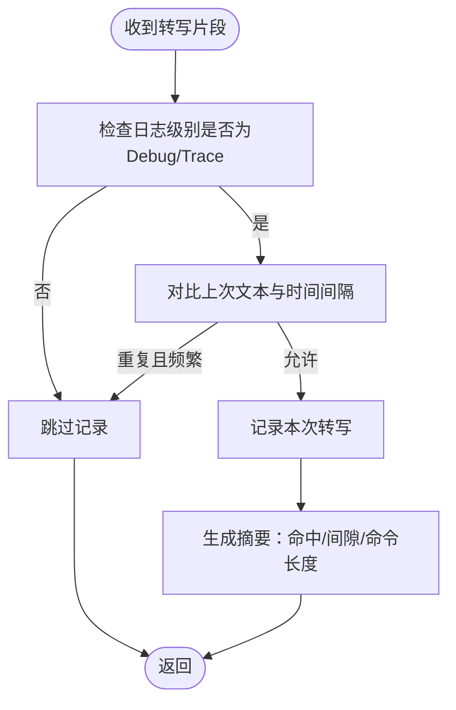
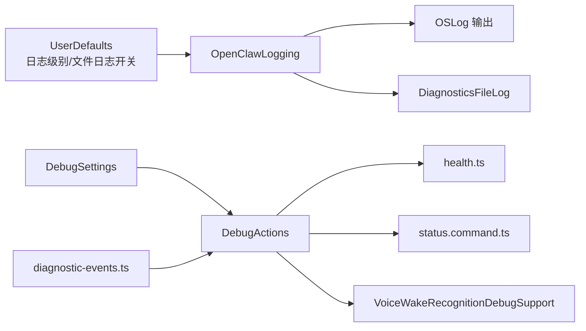

# 调试工具

## 目录
1. [简介](#简介)
2. [项目结构](#项目结构)
3. [核心组件](#核心组件)
4. [架构总览](#架构总览)
5. [详细组件分析](#详细组件分析)
6. [依赖关系分析](#依赖关系分析)
7. [性能考量](#性能考量)
8. [故障排查指南](#故障排查指南)
9. [结论](#结论)
10. [附录](#附录)

## 简介
本文件面向OpenClaw macOS调试工具的技术文档，聚焦应用内置的调试功能与诊断能力，涵盖日志查看、性能监控、错误追踪与系统状态检查等。文档说明调试工具的使用方法、输出格式与分析技巧，并提供常见问题的诊断流程、错误代码解释与解决方案指南；同时介绍调试工具的配置项、过滤规则与导出能力，以及与OpenClaw其他组件的日志集成与数据收集机制。

## 项目结构
OpenClaw在macOS端通过统一日志框架与可选的滚动诊断文件日志实现双通道日志输出，配合“调试面板”提供端到端的诊断入口。关键位置如下：
- 日志与诊断文件：DiagnosticsFileLog.swift、OpenClawLogging.swift
- 调试面板与快捷动作：DebugSettings.swift、DebugActions.swift
- 语音唤醒调试辅助：VoiceWakeRecognitionDebugSupport.swift
- 菜单入口与运行时操作：MenuContentView.swift
- 平台文档：docs/platforms/mac/logging.md
- 健康检查与状态命令：src/commands/health.ts、src/commands/status.command.ts
- 诊断事件基础设施：src/infra/diagnostic-events.ts

图表来源
- [apps/macos/Sources/OpenClaw/DebugSettings.swift](file://apps/macos/Sources/OpenClaw/DebugSettings.swift#L1-L120)
- [apps/macos/Sources/OpenClaw/DebugActions.swift](file://apps/macos/Sources/OpenClaw/DebugActions.swift#L1-L120)
- [apps/macos/Sources/OpenClaw/Logging/OpenClawLogging.swift](file://apps/macos/Sources/OpenClaw/Logging/OpenClawLogging.swift#L1-L120)
- [apps/macos/Sources/OpenClaw/DiagnosticsFileLog.swift](file://apps/macos/Sources/OpenClaw/DiagnosticsFileLog.swift#L1-L80)
- [apps/macos/Sources/OpenClaw/VoiceWakeRecognitionDebugSupport.swift](file://apps/macos/Sources/OpenClaw/VoiceWakeRecognitionDebugSupport.swift#L1-L40)
- [apps/macos/Sources/OpenClaw/MenuContentView.swift](file://apps/macos/Sources/OpenClaw/MenuContentView.swift#L229-L261)
- [docs/platforms/mac/logging.md](file://docs/platforms/mac/logging.md#L1-L58)
- [src/commands/health.ts](file://src/commands/health.ts#L348-L375)
- [src/commands/status.command.ts](file://src/commands/status.command.ts#L318-L358)
- [src/infra/diagnostic-events.ts](file://src/infra/diagnostic-events.ts#L171-L202)

章节来源
- [apps/macos/Sources/OpenClaw/DebugSettings.swift](file://apps/macos/Sources/OpenClaw/DebugSettings.swift#L1-L120)
- [apps/macos/Sources/OpenClaw/DebugActions.swift](file://apps/macos/Sources/OpenClaw/DebugActions.swift#L1-L120)
- [apps/macos/Sources/OpenClaw/Logging/OpenClawLogging.swift](file://apps/macos/Sources/OpenClaw/Logging/OpenClawLogging.swift#L1-L120)
- [apps/macos/Sources/OpenClaw/DiagnosticsFileLog.swift](file://apps/macos/Sources/OpenClaw/DiagnosticsFileLog.swift#L1-L80)
- [docs/platforms/mac/logging.md](file://docs/platforms/mac/logging.md#L1-L58)

## 核心组件
- 统一日志系统（OpenClawLogging.swift）
  - 通过swift-log引导OSLog处理器与文件处理器，统一输出到系统日志与本地JSONL文件。
  - 支持按子系统/类别解析标签，合并元数据并渲染消息。
- 滚动诊断文件（DiagnosticsFileLog.swift）
  - 将记录以JSONL写入用户库日志目录，自动轮转与清理，避免无限增长。
  - 提供清空接口，便于重置诊断环境。
- 调试面板与快捷动作（DebugSettings.swift、DebugActions.swift）
  - 提供“启动器”、“日志查看”、“会话存储”、“快速通知”、“发送测试语音”、“重启网关/隧道”、“端口诊断”、“Canvas调试”等能力。
  - 通过UserDefaults控制日志级别与文件日志开关。
- 语音唤醒调试支持（VoiceWakeRecognitionDebugSupport.swift）
  - 控制高频率中间结果日志节流，提供匹配摘要与文本仅命令识别辅助。
- 菜单入口（MenuContentView.swift）
  - 在应用菜单中暴露“运行健康检查”“发送心跳测试”“重置远程隧道”“切换详细主日志”等常用诊断动作。
- 平台日志文档（docs/platforms/mac/logging.md）
  - 说明启用/禁用统一日志隐私标志、定位诊断文件路径、使用脚本查看日志等。

章节来源
- [apps/macos/Sources/OpenClaw/Logging/OpenClawLogging.swift](file://apps/macos/Sources/OpenClaw/Logging/OpenClawLogging.swift#L57-L120)
- [apps/macos/Sources/OpenClaw/DiagnosticsFileLog.swift](file://apps/macos/Sources/OpenClaw/DiagnosticsFileLog.swift#L3-L20)
- [apps/macos/Sources/OpenClaw/DebugSettings.swift](file://apps/macos/Sources/OpenClaw/DebugSettings.swift#L243-L300)
- [apps/macos/Sources/OpenClaw/DebugActions.swift](file://apps/macos/Sources/OpenClaw/DebugActions.swift#L25-L80)
- [apps/macos/Sources/OpenClaw/VoiceWakeRecognitionDebugSupport.swift](file://apps/macos/Sources/OpenClaw/VoiceWakeRecognitionDebugSupport.swift#L10-L30)
- [apps/macos/Sources/OpenClaw/MenuContentView.swift](file://apps/macos/Sources/OpenClaw/MenuContentView.swift#L229-L261)
- [docs/platforms/mac/logging.md](file://docs/platforms/mac/logging.md#L9-L31)

## 架构总览
OpenClaw macOS调试工具采用“UI入口 + 动作执行 + 日志系统 + 后端命令”的分层设计：
- UI层：调试面板与菜单入口，负责触发动作与展示诊断结果。
- 动作层：封装具体诊断行为（如重启网关、端口诊断、发送测试语音）。
- 日志层：统一输出到OSLog与本地JSONL文件，支持按级别与元数据过滤。
- 命令层：CLI健康检查与状态命令提供更细粒度的系统状态信息。

图表来源
- [apps/macos/Sources/OpenClaw/DebugSettings.swift](file://apps/macos/Sources/OpenClaw/DebugSettings.swift#L476-L550)
- [apps/macos/Sources/OpenClaw/MenuContentView.swift](file://apps/macos/Sources/OpenClaw/MenuContentView.swift#L229-L261)
- [apps/macos/Sources/OpenClaw/DebugActions.swift](file://apps/macos/Sources/OpenClaw/DebugActions.swift#L143-L159)
- [apps/macos/Sources/OpenClaw/Logging/OpenClawLogging.swift](file://apps/macos/Sources/OpenClaw/Logging/OpenClawLogging.swift#L185-L215)
- [apps/macos/Sources/OpenClaw/DiagnosticsFileLog.swift](file://apps/macos/Sources/OpenClaw/DiagnosticsFileLog.swift#L34-L43)
- [src/commands/health.ts](file://src/commands/health.ts#L348-L375)
- [src/commands/status.command.ts](file://src/commands/status.command.ts#L318-L358)

## 详细组件分析

### 组件A：日志系统与滚动诊断文件
- 统一日志系统
  - 引导OSLog处理器与文件处理器，按子系统/类别生成标签，合并元数据，渲染消息。
  - 日志级别由UserDefaults驱动，支持动态调整。
- 滚动诊断文件
  - JSONL格式，每条记录包含时间戳、进程ID、分类、事件与字段。
  - 自动轮转至最多5个备份文件，单文件最大约5MB。
  - 清空时移除当前文件与所有备份，确保干净环境。

图表来源
- [apps/macos/Sources/OpenClaw/Logging/OpenClawLogging.swift](file://apps/macos/Sources/OpenClaw/Logging/OpenClawLogging.swift#L57-L120)
- [apps/macos/Sources/OpenClaw/Logging/OpenClawLogging.swift](file://apps/macos/Sources/OpenClaw/Logging/OpenClawLogging.swift#L185-L215)
- [apps/macos/Sources/OpenClaw/DiagnosticsFileLog.swift](file://apps/macos/Sources/OpenClaw/DiagnosticsFileLog.swift#L3-L20)
- [apps/macos/Sources/OpenClaw/DiagnosticsFileLog.swift](file://apps/macos/Sources/OpenClaw/DiagnosticsFileLog.swift#L59-L91)

章节来源
- [apps/macos/Sources/OpenClaw/Logging/OpenClawLogging.swift](file://apps/macos/Sources/OpenClaw/Logging/OpenClawLogging.swift#L57-L120)
- [apps/macos/Sources/OpenClaw/DiagnosticsFileLog.swift](file://apps/macos/Sources/OpenClaw/DiagnosticsFileLog.swift#L3-L20)
- [docs/platforms/mac/logging.md](file://docs/platforms/mac/logging.md#L9-L31)

### 组件B：调试面板与快捷动作
- 调试面板（DebugSettings）
  - 分区展示：应用信息、网关、日志、端口、路径、快捷动作、Canvas调试、实验性设置。
  - 提供“打开日志”“打开配置文件夹”“打开会话存储”“重启网关/隧道”“端口诊断”“模型目录选择/重载”“Canvas操作”等。
  - 通过UserDefaults控制日志级别与文件日志开关。
- 快捷动作（DebugActions）
  - 打开日志文件、打开配置/会话存储目录。
  - 发送测试通知、发送调试语音（走语音唤醒路径）。
  - 重启网关（本地/远程）、重置SSH隧道、运行健康检查、获取心跳。
  - 端口诊断与进程终止（安全确认）。
  - 切换详细主日志开关并通过系统事件通知后端。

图表来源
- [apps/macos/Sources/OpenClaw/DebugSettings.swift](file://apps/macos/Sources/OpenClaw/DebugSettings.swift#L243-L300)
- [apps/macos/Sources/OpenClaw/DebugSettings.swift](file://apps/macos/Sources/OpenClaw/DebugSettings.swift#L476-L550)
- [apps/macos/Sources/OpenClaw/DebugActions.swift](file://apps/macos/Sources/OpenClaw/DebugActions.swift#L63-L136)

章节来源
- [apps/macos/Sources/OpenClaw/DebugSettings.swift](file://apps/macos/Sources/OpenClaw/DebugSettings.swift#L476-L550)
- [apps/macos/Sources/OpenClaw/DebugActions.swift](file://apps/macos/Sources/OpenClaw/DebugActions.swift#L63-L136)

### 组件C：语音唤醒调试支持
- 文本仅命令匹配与回退：在未启用完整唤醒词识别时，尝试基于纯文本命令进行匹配。
- 日志节流：在调试/跟踪级别下，对高频中间结果进行去抖，避免日志风暴。
- 匹配摘要：输出是否命中、延迟间隙与命令长度等摘要信息，便于快速判断。

图表来源
- [apps/macos/Sources/OpenClaw/VoiceWakeRecognitionDebugSupport.swift](file://apps/macos/Sources/OpenClaw/VoiceWakeRecognitionDebugSupport.swift#L10-L30)
- [apps/macos/Sources/OpenClaw/VoiceWakeRecognitionDebugSupport.swift](file://apps/macos/Sources/OpenClaw/VoiceWakeRecognitionDebugSupport.swift#L32-L62)

章节来源
- [apps/macos/Sources/OpenClaw/VoiceWakeRecognitionDebugSupport.swift](file://apps/macos/Sources/OpenClaw/VoiceWakeRecognitionDebugSupport.swift#L10-L30)
- [apps/macos/Sources/OpenClaw/VoiceWakeRecognitionDebugSupport.swift](file://apps/macos/Sources/OpenClaw/VoiceWakeRecognitionDebugSupport.swift#L32-L62)

### 组件D：菜单入口与运行时操作
- 菜单中提供“运行健康检查”“发送测试心跳”“重置远程隧道”“切换详细主日志”等快捷入口，便于快速复现与验证问题。

章节来源
- [apps/macos/Sources/OpenClaw/MenuContentView.swift](file://apps/macos/Sources/OpenClaw/MenuContentView.swift#L229-L261)

## 依赖关系分析
- 日志系统依赖UserDefaults控制日志级别与文件日志开关，二者共同决定输出内容与持久化范围。
- 调试动作依赖网关连接状态（本地/远程），在不同模式下采取不同的重启/隧道重置策略。
- 诊断事件基础设施提供全局事件分发，用于跨模块的诊断事件传播。

图表来源
- [apps/macos/Sources/OpenClaw/Logging/OpenClawLogging.swift](file://apps/macos/Sources/OpenClaw/Logging/OpenClawLogging.swift#L8-L27)
- [apps/macos/Sources/OpenClaw/DiagnosticsFileLog.swift](file://apps/macos/Sources/OpenClaw/DiagnosticsFileLog.swift#L34-L43)
- [apps/macos/Sources/OpenClaw/DebugSettings.swift](file://apps/macos/Sources/OpenClaw/DebugSettings.swift#L243-L300)
- [apps/macos/Sources/OpenClaw/DebugActions.swift](file://apps/macos/Sources/OpenClaw/DebugActions.swift#L82-L136)
- [src/commands/health.ts](file://src/commands/health.ts#L348-L375)
- [src/commands/status.command.ts](file://src/commands/status.command.ts#L318-L358)
- [src/infra/diagnostic-events.ts](file://src/infra/diagnostic-events.ts#L171-L202)

章节来源
- [apps/macos/Sources/OpenClaw/Logging/OpenClawLogging.swift](file://apps/macos/Sources/OpenClaw/Logging/OpenClawLogging.swift#L8-L27)
- [apps/macos/Sources/OpenClaw/DebugSettings.swift](file://apps/macos/Sources/OpenClaw/DebugSettings.swift#L243-L300)
- [apps/macos/Sources/OpenClaw/DebugActions.swift](file://apps/macos/Sources/OpenClaw/DebugActions.swift#L82-L136)
- [src/infra/diagnostic-events.ts](file://src/infra/diagnostic-events.ts#L171-L202)

## 性能考量
- 日志写入为异步追加，失败时采用“尽力而为”，不阻塞主线程或应用运行。
- 滚动文件大小限制与备份数量控制磁盘占用，避免长期运行导致空间膨胀。
- 语音唤醒中间结果日志节流减少高频噪声，降低I/O与渲染压力。
- 端口诊断与隧道重置为异步任务，避免阻塞UI。

章节来源
- [apps/macos/Sources/OpenClaw/DiagnosticsFileLog.swift](file://apps/macos/Sources/OpenClaw/DiagnosticsFileLog.swift#L59-L67)
- [apps/macos/Sources/OpenClaw/VoiceWakeRecognitionDebugSupport.swift](file://apps/macos/Sources/OpenClaw/VoiceWakeRecognitionDebugSupport.swift#L16-L30)

## 故障排查指南

### 常见问题与诊断流程
- 无法看到详细日志
  - 检查日志级别是否为Debug/Trace；在调试面板中调整“Verbosity”。
  - 若需查看私有数据，参考平台日志文档启用统一日志隐私标志，再复现问题。
- 诊断文件缺失或为空
  - 确认已启用“Write rolling diagnostics log (JSONL)”。
  - 使用“Open folder”打开日志目录，或在调试面板中“Clear”后重试。
- 网关连接异常
  - 本地模式：点击“Restart Gateway”，观察网关状态与日志。
  - 远程模式：先“Reset Remote Tunnel”，再检查端口占用与SSH连通性。
- 端口被占用
  - 使用“Check gateway ports”查看占用者与建议处理；必要时“Kill”非预期进程。
- 语音唤醒无响应
  - 使用“Send debug voice”测试语音唤醒路径；检查无障碍权限与屏幕录制权限。
- 健康检查失败
  - 使用“Run Health Check Now”或“Send Test Heartbeat”获取最近心跳与通道状态。

章节来源
- [apps/macos/Sources/OpenClaw/DebugSettings.swift](file://apps/macos/Sources/OpenClaw/DebugSettings.swift#L243-L300)
- [apps/macos/Sources/OpenClaw/DebugActions.swift](file://apps/macos/Sources/OpenClaw/DebugActions.swift#L82-L159)
- [docs/platforms/mac/logging.md](file://docs/platforms/mac/logging.md#L25-L58)
- [src/commands/health.ts](file://src/commands/health.ts#L348-L375)
- [src/commands/status.command.ts](file://src/commands/status.command.ts#L318-L358)

### 错误代码与含义（示例）
- 健康检查超时
  - 表现：通道探测超时或状态未知。
  - 处理：增加超时时间、检查网络/代理、重试健康检查。
- 隧道重置失败
  - 表现：远程模式下隧道无法建立。
  - 处理：检查目标主机可达性、密钥与凭据、防火墙策略。
- 端口占用
  - 表现：端口被非预期进程占用。
  - 处理：确认预期进程（如网关）是否正常运行；必要时终止非预期进程。

章节来源
- [apps/macos/Sources/OpenClaw/DebugActions.swift](file://apps/macos/Sources/OpenClaw/DebugActions.swift#L117-L136)
- [apps/macos/Sources/OpenClaw/DebugSettings.swift](file://apps/macos/Sources/OpenClaw/DebugSettings.swift#L302-L379)
- [src/commands/health.ts](file://src/commands/health.ts#L348-L375)

### 分析技巧与建议
- 使用“Send Test Heartbeat”与CLI健康命令结合，定位通道与代理问题。
- 对高频中间结果进行节流，关注最终结果与摘要指标（命中/间隙/长度）。
- 在启用私有数据日志后，使用平台提供的日志查看脚本进行筛选与聚合。

章节来源
- [apps/macos/Sources/OpenClaw/DebugActions.swift](file://apps/macos/Sources/OpenClaw/DebugActions.swift#L147-L159)
- [src/commands/health.ts](file://src/commands/health.ts#L348-L375)
- [src/commands/status.command.ts](file://src/commands/status.command.ts#L318-L358)
- [docs/platforms/mac/logging.md](file://docs/platforms/mac/logging.md#L25-L58)

## 结论
OpenClaw macOS调试工具通过统一日志系统与滚动诊断文件，结合调试面板与菜单入口，提供了从日志查看、性能监控、错误追踪到系统状态检查的全链路诊断能力。配合CLI健康命令与诊断事件基础设施，能够快速定位问题根因并指导修复。建议在调试期间开启文件日志与适当日志级别，并在问题复现后及时关闭与清理敏感日志。

## 附录

### 配置选项与过滤规则
- 日志级别（Verbosity）
  - 可在调试面板中选择Trace/Debug/Info/Notice/Warning/Error/Critical。
- 文件日志开关
  - “Write rolling diagnostics log (JSONL)”启用后，日志同时写入OSLog与本地JSONL文件。
- 私有数据日志
  - 通过平台日志文档中的步骤，在系统级为子系统启用私有数据输出。
- 语音唤醒日志节流
  - 在Debug/Trace级别下，对高频中间结果进行时间间隔去抖。

章节来源
- [apps/macos/Sources/OpenClaw/DebugSettings.swift](file://apps/macos/Sources/OpenClaw/DebugSettings.swift#L262-L296)
- [apps/macos/Sources/OpenClaw/Logging/OpenClawLogging.swift](file://apps/macos/Sources/OpenClaw/Logging/OpenClawLogging.swift#L29-L55)
- [apps/macos/Sources/OpenClaw/VoiceWakeRecognitionDebugSupport.swift](file://apps/macos/Sources/OpenClaw/VoiceWakeRecognitionDebugSupport.swift#L16-L30)
- [docs/platforms/mac/logging.md](file://docs/platforms/mac/logging.md#L25-L58)

### 导出与清理
- 导出
  - 使用“Open”按钮直接打开日志文件；或使用平台日志文档中提供的脚本进行筛选与聚合。
- 清理
  - 在调试面板中“Clear”滚动诊断文件；或在日志目录中手动删除旧文件。

章节来源
- [apps/macos/Sources/OpenClaw/DebugSettings.swift](file://apps/macos/Sources/OpenClaw/DebugSettings.swift#L280-L296)
- [apps/macos/Sources/OpenClaw/DiagnosticsFileLog.swift](file://apps/macos/Sources/OpenClaw/DiagnosticsFileLog.swift#L45-L57)
- [docs/platforms/mac/logging.md](file://docs/platforms/mac/logging.md#L9-L18)