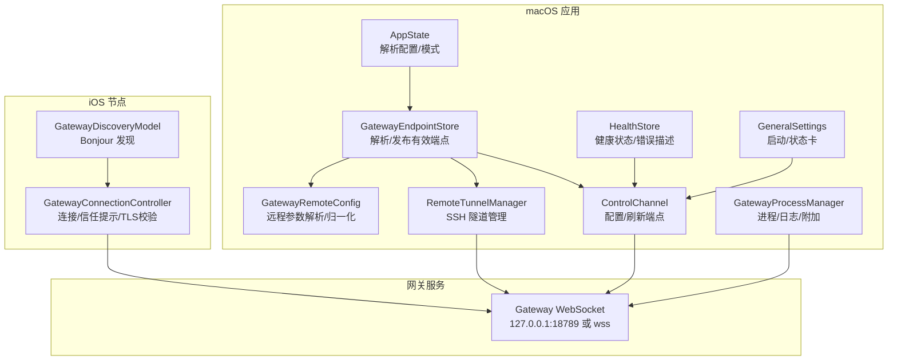
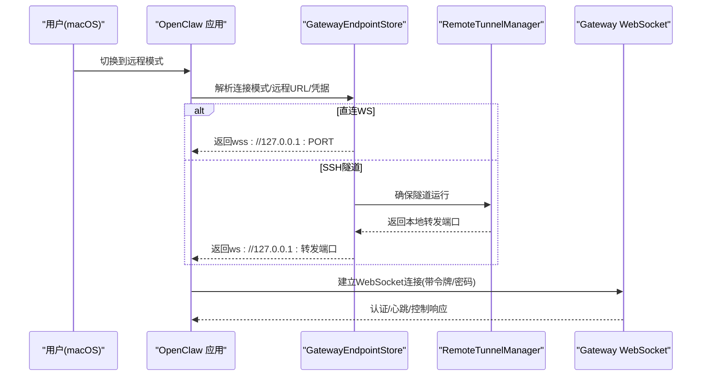
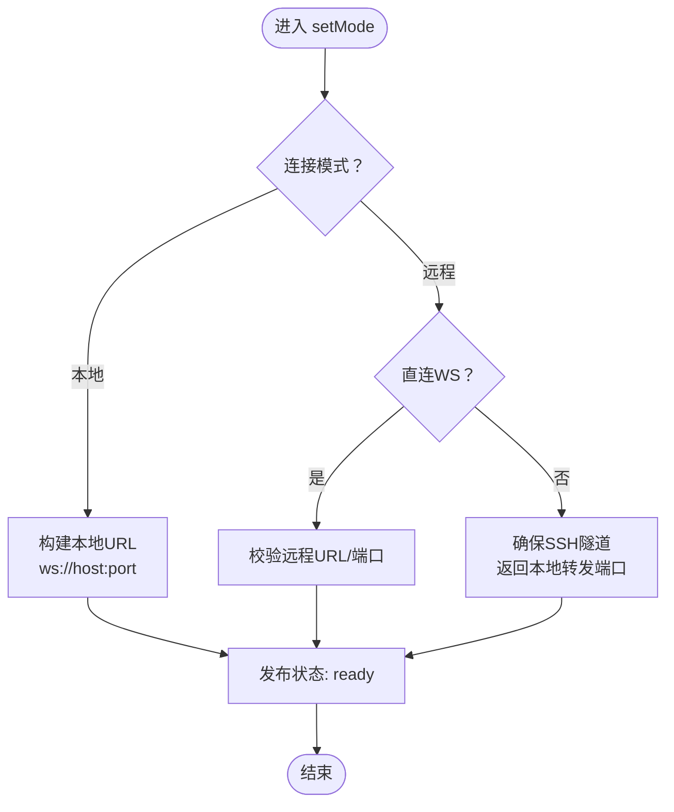
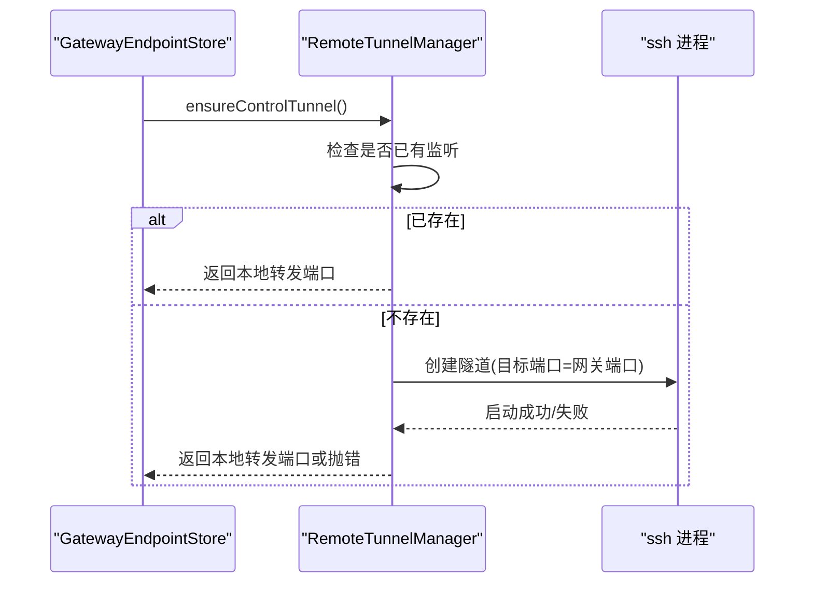
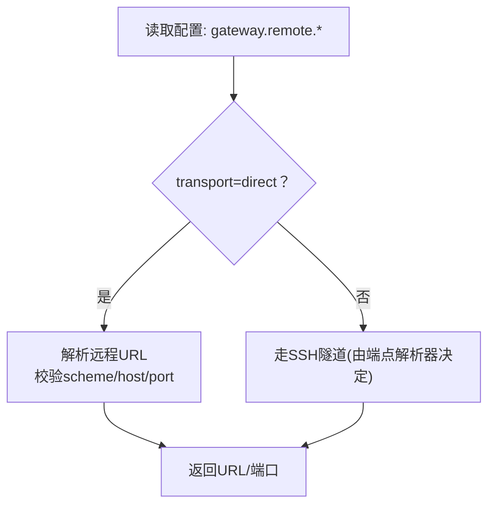
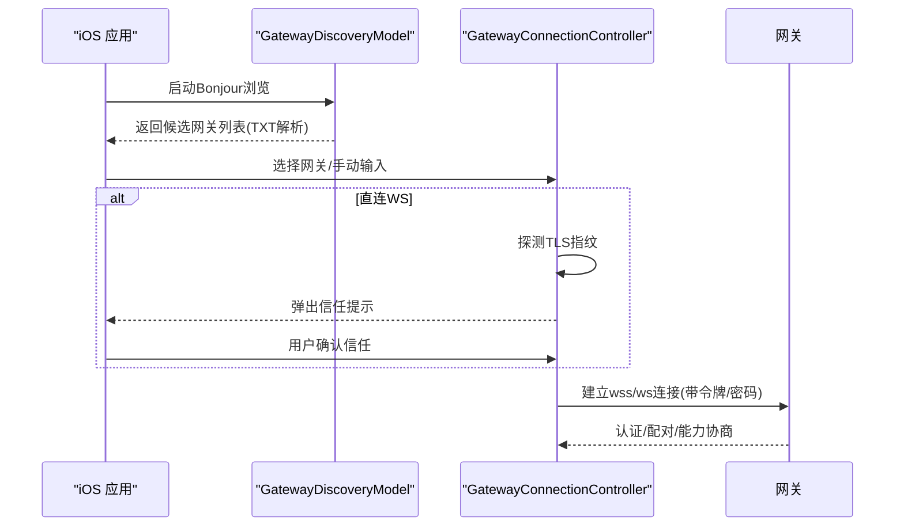
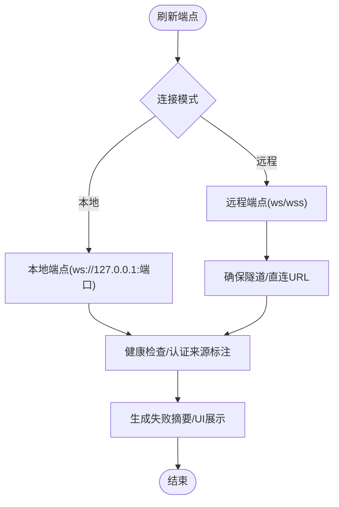
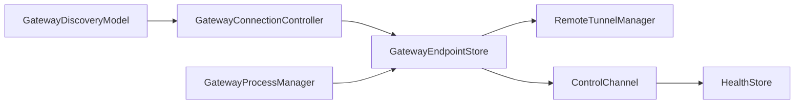

# 远程网关控制

## 目录
1. [简介](#简介)
2. [项目结构](#项目结构)
3. [核心组件](#核心组件)
4. [架构总览](#架构总览)
5. [详细组件分析](#详细组件分析)
6. [依赖关系分析](#依赖关系分析)
7. [性能考虑](#性能考虑)
8. [故障排查指南](#故障排查指南)
9. [结论](#结论)
10. [附录](#附录)

## 简介
本文件面向OpenClaw在macOS上的远程网关控制能力，系统性阐述远程网关的连接、配置与管理流程，覆盖网关发现机制、连接建立、身份认证与安全传输协议；提供配置向导、连接状态监控与故障诊断工具的使用方法；并总结安全策略、权限管理与最佳实践，以及与本地应用的同步机制与数据传输优化建议。

## 项目结构
OpenClaw在macOS端通过菜单栏应用统一管理网关控制：本地模式直接连接本机WebSocket，远程模式通过SSH隧道转发端口，或直接使用wss直连（直连模式）。iOS端负责节点侧的网关发现与TLS信任校验，并自动完成连接与配对。

图表来源
- [apps/macos/Sources/OpenClaw/AppState.swift](file://apps/macos/Sources/OpenClaw/AppState.swift#L295-L494)
- [apps/macos/Sources/OpenClaw/GatewayEndpointStore.swift](file://apps/macos/Sources/OpenClaw/GatewayEndpointStore.swift#L1-L771)
- [apps/macos/Sources/OpenClaw/ControlChannel.swift](file://apps/macos/Sources/OpenClaw/ControlChannel.swift#L88-L116)
- [apps/macos/Sources/OpenClaw/RemoteTunnelManager.swift](file://apps/macos/Sources/OpenClaw/RemoteTunnelManager.swift#L1-L123)
- [apps/macos/Sources/OpenClaw/GatewayRemoteConfig.swift](file://apps/macos/Sources/OpenClaw/GatewayRemoteConfig.swift#L1-L114)
- [apps/macos/Sources/OpenClaw/HealthStore.swift](file://apps/macos/Sources/OpenClaw/HealthStore.swift#L237-L265)
- [apps/macos/Sources/OpenClaw/GatewayProcessManager.swift](file://apps/macos/Sources/OpenClaw/GatewayProcessManager.swift#L171-L201)
- [apps/macos/Sources/OpenClaw/GeneralSettings.swift](file://apps/macos/Sources/OpenClaw/GeneralSettings.swift#L398-L449)
- [apps/ios/Sources/Gateway/GatewayDiscoveryModel.swift](file://apps/ios/Sources/Gateway/GatewayDiscoveryModel.swift#L1-L182)
- [apps/ios/Sources/Gateway/GatewayConnectionController.swift](file://apps/ios/Sources/Gateway/GatewayConnectionController.swift#L1-L800)

章节来源
- [apps/macos/Sources/OpenClaw/AppState.swift](file://apps/macos/Sources/OpenClaw/AppState.swift#L295-L494)
- [apps/macos/Sources/OpenClaw/GatewayEndpointStore.swift](file://apps/macos/Sources/OpenClaw/GatewayEndpointStore.swift#L1-L771)
- [apps/macos/Sources/OpenClaw/ControlChannel.swift](file://apps/macos/Sources/OpenClaw/ControlChannel.swift#L88-L116)
- [apps/macos/Sources/OpenClaw/RemoteTunnelManager.swift](file://apps/macos/Sources/OpenClaw/RemoteTunnelManager.swift#L1-L123)
- [apps/macos/Sources/OpenClaw/GatewayRemoteConfig.swift](file://apps/macos/Sources/OpenClaw/GatewayRemoteConfig.swift#L1-L114)
- [apps/macos/Sources/OpenClaw/HealthStore.swift](file://apps/macos/Sources/OpenClaw/HealthStore.swift#L237-L265)
- [apps/macos/Sources/OpenClaw/GatewayProcessManager.swift](file://apps/macos/Sources/OpenClaw/GatewayProcessManager.swift#L171-L201)
- [apps/macos/Sources/OpenClaw/GeneralSettings.swift](file://apps/macos/Sources/OpenClaw/GeneralSettings.swift#L398-L449)
- [apps/ios/Sources/Gateway/GatewayDiscoveryModel.swift](file://apps/ios/Sources/Gateway/GatewayDiscoveryModel.swift#L1-L182)
- [apps/ios/Sources/Gateway/GatewayConnectionController.swift](file://apps/ios/Sources/Gateway/GatewayConnectionController.swift#L1-L800)

## 核心组件
- 连接模式与配置解析：AppState根据配置文件解析连接模式（本地/远程/未配置），并驱动后续端点解析与隧道管理。
- 端点解析与发布：GatewayEndpointStore统一解析本地/远程端点，支持直连WS与SSH隧道转发两种路径，并对外发布当前可用端点。
- 控制通道：ControlChannel负责在不同模式下刷新端点、执行健康检查与认证来源标注。
- SSH隧道管理：RemoteTunnelManager确保远程模式下的控制端口转发，具备重试退避与监听复用逻辑。
- 远程参数解析：GatewayRemoteConfig负责远程URL、令牌等参数的解析与归一化。
- 健康状态与错误描述：HealthStore提供失败原因的人类可读摘要，辅助UI展示。
- iOS发现与连接：GatewayDiscoveryModel通过Bonjour发现网关；GatewayConnectionController处理服务解析、TLS指纹探测与信任提示。

章节来源
- [apps/macos/Sources/OpenClaw/AppState.swift](file://apps/macos/Sources/OpenClaw/AppState.swift#L295-L494)
- [apps/macos/Sources/OpenClaw/GatewayEndpointStore.swift](file://apps/macos/Sources/OpenClaw/GatewayEndpointStore.swift#L1-L771)
- [apps/macos/Sources/OpenClaw/ControlChannel.swift](file://apps/macos/Sources/OpenClaw/ControlChannel.swift#L88-L116)
- [apps/macos/Sources/OpenClaw/RemoteTunnelManager.swift](file://apps/macos/Sources/OpenClaw/RemoteTunnelManager.swift#L1-L123)
- [apps/macos/Sources/OpenClaw/GatewayRemoteConfig.swift](file://apps/macos/Sources/OpenClaw/GatewayRemoteConfig.swift#L1-L114)
- [apps/macos/Sources/OpenClaw/HealthStore.swift](file://apps/macos/Sources/OpenClaw/HealthStore.swift#L237-L265)
- [apps/ios/Sources/Gateway/GatewayDiscoveryModel.swift](file://apps/ios/Sources/Gateway/GatewayDiscoveryModel.swift#L1-L182)
- [apps/ios/Sources/Gateway/GatewayConnectionController.swift](file://apps/ios/Sources/Gateway/GatewayConnectionController.swift#L1-L800)

## 架构总览
OpenClaw的远程网关控制采用“双路径、多信任层”的设计：
- 直连WS：适用于同一局域网或跨网络但可直达的场景，优先使用wss并进行TLS指纹校验。
- SSH隧道：作为通用回退方案，macOS应用负责建立与复用本地端口转发，随后以ws/wss访问本地回环端口。
- 安全边界：macOS应用与iOS节点均实施严格的TLS信任策略，避免明文直连到非本地主机。

图表来源
- [apps/macos/Sources/OpenClaw/GatewayEndpointStore.swift](file://apps/macos/Sources/OpenClaw/GatewayEndpointStore.swift#L342-L365)
- [apps/macos/Sources/OpenClaw/RemoteTunnelManager.swift](file://apps/macos/Sources/OpenClaw/RemoteTunnelManager.swift#L49-L78)
- [apps/macos/Sources/OpenClaw/ControlChannel.swift](file://apps/macos/Sources/OpenClaw/ControlChannel.swift#L97-L116)

章节来源
- [apps/macos/Sources/OpenClaw/GatewayEndpointStore.swift](file://apps/macos/Sources/OpenClaw/GatewayEndpointStore.swift#L291-L340)
- [apps/macos/Sources/OpenClaw/RemoteTunnelManager.swift](file://apps/macos/Sources/OpenClaw/RemoteTunnelManager.swift#L49-L78)
- [apps/macos/Sources/OpenClaw/ControlChannel.swift](file://apps/macos/Sources/OpenClaw/ControlChannel.swift#L97-L116)

## 详细组件分析

### 组件A：端点解析与发布（GatewayEndpointStore）
- 职责：统一解析本地/远程端点，支持直连WS与SSH隧道；在远程模式下触发隧道确保；订阅者可实时获知状态变化。
- 关键流程：
  - setMode：根据当前连接模式更新状态，若为远程且直连WS则直接返回URL；否则确保隧道并返回本地转发端口。
  - ensureRemoteControlTunnel：在远程模式下解析直连URL或确保隧道，失败时抛出错误并记录日志。
  - maybeFallbackToTailnet：当本地绑定为tailnet且当前URL指向127.0.0.1时，自动回退到tailnet IP。
- 复杂度与性能：状态变更通过AsyncStream广播，避免轮询；隧道复用与端口监听守护降低重复开销。

图表来源
- [apps/macos/Sources/OpenClaw/GatewayEndpointStore.swift](file://apps/macos/Sources/OpenClaw/GatewayEndpointStore.swift#L291-L340)
- [apps/macos/Sources/OpenClaw/GatewayEndpointStore.swift](file://apps/macos/Sources/OpenClaw/GatewayEndpointStore.swift#L342-L365)

章节来源
- [apps/macos/Sources/OpenClaw/GatewayEndpointStore.swift](file://apps/macos/Sources/OpenClaw/GatewayEndpointStore.swift#L1-L771)

### 组件B：SSH隧道管理（RemoteTunnelManager）
- 职责：管理SSH隧道生命周期，包括端口复用检测、进程守护、重启退避与错误恢复。
- 关键流程：
  - controlTunnelPortIfRunning：复用已存在的隧道或检测并重启失效隧道。
  - ensureControlTunnel：创建/复用隧道，返回本地转发端口；失败时记录日志并抛错。
  - 重启退避：防止频繁重启导致资源争用。
- 性能与可靠性：通过端口守护器检测监听状态，避免重复创建；重启后清理状态并记录日志。

图表来源
- [apps/macos/Sources/OpenClaw/RemoteTunnelManager.swift](file://apps/macos/Sources/OpenClaw/RemoteTunnelManager.swift#L14-L78)

章节来源
- [apps/macos/Sources/OpenClaw/RemoteTunnelManager.swift](file://apps/macos/Sources/OpenClaw/RemoteTunnelManager.swift#L1-L123)

### 组件C：远程参数解析（GatewayRemoteConfig）
- 职责：解析远程传输类型（直连/SSH）、远程URL、令牌值；对URL进行归一化（scheme/host/port）。
- 关键点：直连WS仅允许ws://127.0.0.1或wss；默认端口按协议推断；提供默认端口查询。

图表来源
- [apps/macos/Sources/OpenClaw/GatewayRemoteConfig.swift](file://apps/macos/Sources/OpenClaw/GatewayRemoteConfig.swift#L27-L114)

章节来源
- [apps/macos/Sources/OpenClaw/GatewayRemoteConfig.swift](file://apps/macos/Sources/OpenClaw/GatewayRemoteConfig.swift#L1-L114)

### 组件D：iOS网关发现与连接（GatewayDiscoveryModel / GatewayConnectionController）
- 发现机制：通过Bonjour服务类型搜索网关，解析TXT记录中的端口、TLS状态与指纹等信息。
- 连接策略：LAN发现阶段拒绝明文直连，必须先完成TLS指纹探测与信任确认；支持手动输入主机/端口并强制TLS。
- 自动重连：基于存储的上次连接信息与信任指纹，实现安全的自动重连。

图表来源
- [apps/ios/Sources/Gateway/GatewayDiscoveryModel.swift](file://apps/ios/Sources/Gateway/GatewayDiscoveryModel.swift#L51-L100)
- [apps/ios/Sources/Gateway/GatewayConnectionController.swift](file://apps/ios/Sources/Gateway/GatewayConnectionController.swift#L95-L160)
- [apps/ios/Sources/Gateway/GatewayConnectionController.swift](file://apps/ios/Sources/Gateway/GatewayConnectionController.swift#L162-L207)

章节来源
- [apps/ios/Sources/Gateway/GatewayDiscoveryModel.swift](file://apps/ios/Sources/Gateway/GatewayDiscoveryModel.swift#L1-L182)
- [apps/ios/Sources/Gateway/GatewayConnectionController.swift](file://apps/ios/Sources/Gateway/GatewayConnectionController.swift#L1-L800)

### 组件E：控制通道与健康检查（ControlChannel / HealthStore）
- 控制通道：在不同模式下刷新端点，执行健康检查，标注认证来源（共享令牌/设备令牌/密码/无）。
- 健康状态：根据最近错误生成人类可读的失败摘要，辅助UI提示与排障。

图表来源
- [apps/macos/Sources/OpenClaw/ControlChannel.swift](file://apps/macos/Sources/OpenClaw/ControlChannel.swift#L97-L116)
- [apps/macos/Sources/OpenClaw/ControlChannel.swift](file://apps/macos/Sources/OpenClaw/ControlChannel.swift#L300-L330)
- [apps/macos/Sources/OpenClaw/HealthStore.swift](file://apps/macos/Sources/OpenClaw/HealthStore.swift#L237-L265)

章节来源
- [apps/macos/Sources/OpenClaw/ControlChannel.swift](file://apps/macos/Sources/OpenClaw/ControlChannel.swift#L88-L116)
- [apps/macos/Sources/OpenClaw/ControlChannel.swift](file://apps/macos/Sources/OpenClaw/ControlChannel.swift#L296-L330)
- [apps/macos/Sources/OpenClaw/HealthStore.swift](file://apps/macos/Sources/OpenClaw/HealthStore.swift#L237-L265)

## 依赖关系分析
- 组件耦合：
  - GatewayEndpointStore与RemoteTunnelManager强耦合（远程模式下隧道确保）。
  - ControlChannel依赖GatewayEndpointStore提供的端点与凭据。
  - iOS端的GatewayConnectionController依赖GatewayDiscoveryModel提供的候选网关与TLS参数。
- 外部依赖：
  - macOS应用依赖系统SSH与端口守护能力；iOS依赖Bonjour与系统网络框架。
- 安全依赖：
  - TLS指纹存储与校验（macOS/iOS）；远程令牌/密码来源（macOS配置与环境变量）。

图表来源
- [apps/macos/Sources/OpenClaw/GatewayEndpointStore.swift](file://apps/macos/Sources/OpenClaw/GatewayEndpointStore.swift#L1-L771)
- [apps/macos/Sources/OpenClaw/RemoteTunnelManager.swift](file://apps/macos/Sources/OpenClaw/RemoteTunnelManager.swift#L1-L123)
- [apps/macos/Sources/OpenClaw/ControlChannel.swift](file://apps/macos/Sources/OpenClaw/ControlChannel.swift#L88-L116)
- [apps/macos/Sources/OpenClaw/HealthStore.swift](file://apps/macos/Sources/OpenClaw/HealthStore.swift#L237-L265)
- [apps/macos/Sources/OpenClaw/GatewayProcessManager.swift](file://apps/macos/Sources/OpenClaw/GatewayProcessManager.swift#L171-L201)
- [apps/ios/Sources/Gateway/GatewayDiscoveryModel.swift](file://apps/ios/Sources/Gateway/GatewayDiscoveryModel.swift#L1-L182)
- [apps/ios/Sources/Gateway/GatewayConnectionController.swift](file://apps/ios/Sources/Gateway/GatewayConnectionController.swift#L1-L800)

章节来源
- [apps/macos/Sources/OpenClaw/GatewayEndpointStore.swift](file://apps/macos/Sources/OpenClaw/GatewayEndpointStore.swift#L1-L771)
- [apps/macos/Sources/OpenClaw/RemoteTunnelManager.swift](file://apps/macos/Sources/OpenClaw/RemoteTunnelManager.swift#L1-L123)
- [apps/macos/Sources/OpenClaw/ControlChannel.swift](file://apps/macos/Sources/OpenClaw/ControlChannel.swift#L88-L116)
- [apps/macos/Sources/OpenClaw/HealthStore.swift](file://apps/macos/Sources/OpenClaw/HealthStore.swift#L237-L265)
- [apps/macos/Sources/OpenClaw/GatewayProcessManager.swift](file://apps/macos/Sources/OpenClaw/GatewayProcessManager.swift#L171-L201)
- [apps/ios/Sources/Gateway/GatewayDiscoveryModel.swift](file://apps/ios/Sources/Gateway/GatewayDiscoveryModel.swift#L1-L182)
- [apps/ios/Sources/Gateway/GatewayConnectionController.swift](file://apps/ios/Sources/Gateway/GatewayConnectionController.swift#L1-L800)

## 性能考虑
- 隧道复用与端口守护：避免重复创建SSH进程，减少“地址已被占用”冲突。
- 端点状态异步流：订阅者可即时获知状态变化，无需轮询。
- 默认端口推断：直连wss默认443，ws默认18789，减少配置负担。
- 健康检查超时：控制通道健康检查设置合理超时，避免阻塞UI。

[本节为通用指导，不直接分析具体文件]

## 故障排查指南
- 常见症状与命令梯子：
  - 使用状态/健康/日志/医生命令快速定位问题。
  - 网关服务未运行：检查模式、端口冲突、反代代理配置。
  - 控制UI无法连接：核对URL、认证模式、安全上下文（HTTPS/localhost）。
  - 设备认证迁移：遵循挑战-应答流程，确保nonce与签名匹配。
- macOS端：
  - HealthStore提供失败摘要；GatewayProcessManager可读取launchd日志；GeneralSettings显示启动与失败原因。
- iOS端：
  - GatewayDiscoveryModel提供调试日志；GatewayConnectionController在发现阶段拒绝明文直连，需先完成TLS指纹信任。

章节来源
- [docs/gateway/troubleshooting.md](file://docs/gateway/troubleshooting.md#L1-L367)
- [apps/macos/Sources/OpenClaw/HealthStore.swift](file://apps/macos/Sources/OpenClaw/HealthStore.swift#L237-L265)
- [apps/macos/Sources/OpenClaw/GatewayProcessManager.swift](file://apps/macos/Sources/OpenClaw/GatewayProcessManager.swift#L171-L201)
- [apps/macos/Sources/OpenClaw/GeneralSettings.swift](file://apps/macos/Sources/OpenClaw/GeneralSettings.swift#L398-L449)
- [apps/ios/Sources/Gateway/GatewayDiscoveryModel.swift](file://apps/ios/Sources/Gateway/GatewayDiscoveryModel.swift#L152-L158)
- [apps/ios/Sources/Gateway/GatewayConnectionController.swift](file://apps/ios/Sources/Gateway/GatewayConnectionController.swift#L95-L160)

## 结论
OpenClaw的远程网关控制通过“直连WS + SSH隧道”的双路径设计，在保证安全性的同时兼顾易用性。macOS应用负责端点解析、隧道管理与健康监控；iOS应用负责发现与TLS信任；两者配合实现从发现到连接、从认证到会话的完整闭环。遵循本文的安全策略与最佳实践，可显著降低暴露面并提升整体稳定性。

[本节为总结性内容，不直接分析具体文件]

## 附录

### A. 远程连接配置向导（macOS）
- 本地模式：直接连接本机回环端口，适合本机操作与开发调试。
- 远程模式：
  - 直连WS：在配置中指定wss://127.0.0.1:端口或wss://远端域名，启用TLS并校验证书指纹。
  - SSH隧道：在配置中保留transport为空（默认SSH），应用自动建立隧道并转发端口。
- 凭据来源：优先使用环境变量与配置文件，远程模式下可使用gateway.remote.token/password。

章节来源
- [docs/gateway/remote.md](file://docs/gateway/remote.md#L86-L120)
- [apps/macos/Sources/OpenClaw/GatewayRemoteConfig.swift](file://apps/macos/Sources/OpenClaw/GatewayRemoteConfig.swift#L27-L114)
- [apps/macos/Sources/OpenClaw/GatewayEndpointStore.swift](file://apps/macos/Sources/OpenClaw/GatewayEndpointStore.swift#L342-L365)

### B. 网关发现机制与传输选择
- Bonjour/LAN：优先使用直连WS，TXT记录仅作提示，不作为路由依据。
- Tailnet：推荐使用MagicDNS名称或稳定尾网IP。
- 手动/SSH：无直连路径时回退至SSH隧道。

章节来源
- [docs/gateway/discovery.md](file://docs/gateway/discovery.md#L43-L124)
- [apps/ios/Sources/Gateway/GatewayDiscoveryModel.swift](file://apps/ios/Sources/Gateway/GatewayDiscoveryModel.swift#L68-L96)

### C. 身份认证与安全传输
- 认证方式：共享令牌、密码、设备身份（macOS/iOS）。
- 传输安全：ws仅限loopback；wss用于跨网络直连；明文直连LAN发现阶段被拒绝。
- 安全审计：定期运行安全审计，关注暴露面、工具策略、浏览器控制暴露与权限设置。

章节来源
- [docs/gateway/authentication.md](file://docs/gateway/authentication.md#L1-L180)
- [docs/gateway/security/index.md](file://docs/gateway/security/index.md#L145-L800)
- [apps/ios/Sources/Gateway/GatewayConnectionController.swift](file://apps/ios/Sources/Gateway/GatewayConnectionController.swift#L112-L136)

### D. 连接状态监控与UI反馈
- 状态卡片：显示网关状态、最后失败原因、自动启动提示。
- 健康摘要：根据最近错误生成简要说明，便于用户理解与排障。

章节来源
- [apps/macos/Sources/OpenClaw/GeneralSettings.swift](file://apps/macos/Sources/OpenClaw/GeneralSettings.swift#L398-L449)
- [apps/macos/Sources/OpenClaw/HealthStore.swift](file://apps/macos/Sources/OpenClaw/HealthStore.swift#L237-L265)