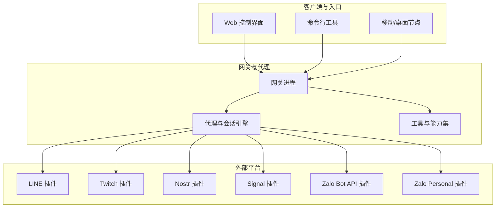
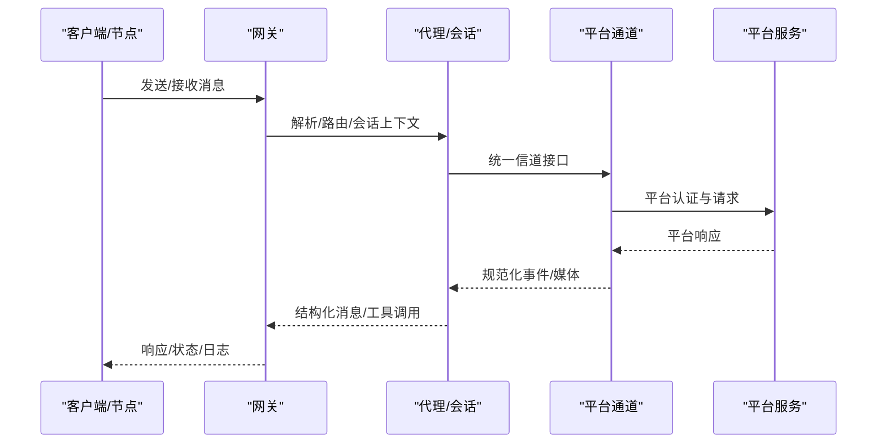
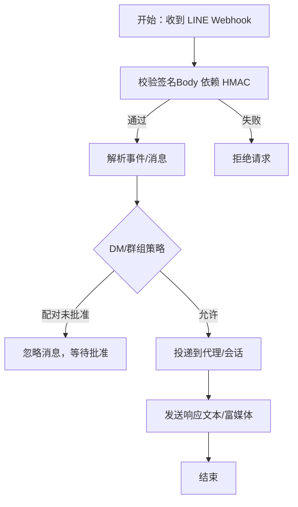
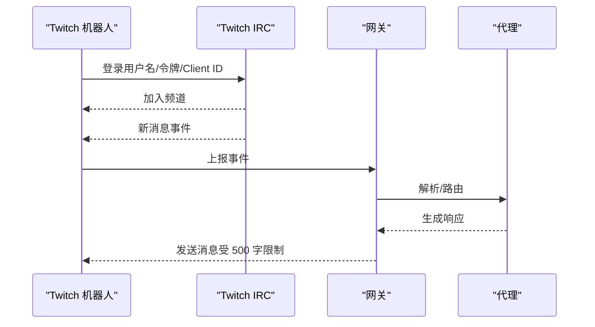
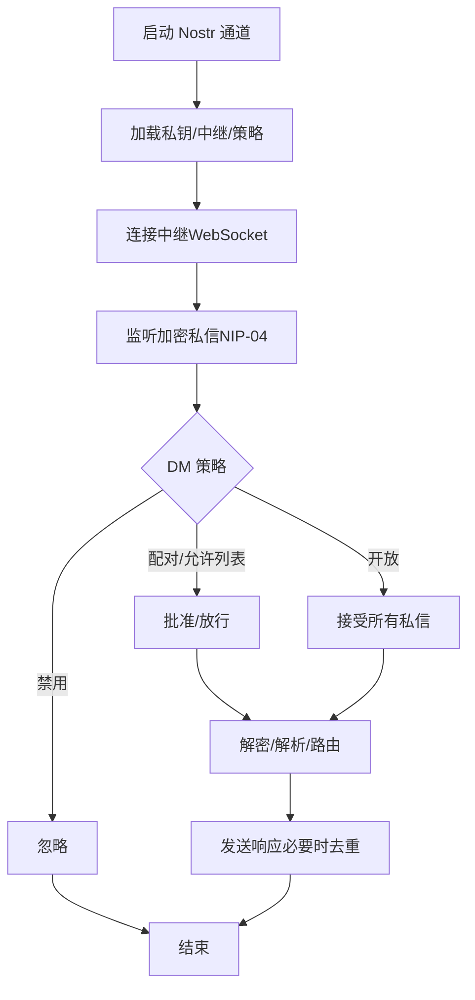
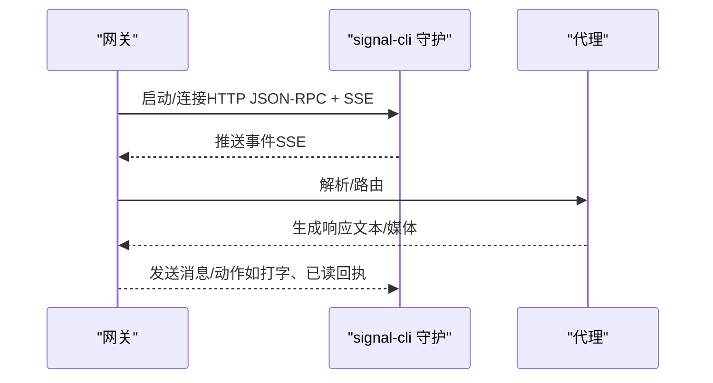
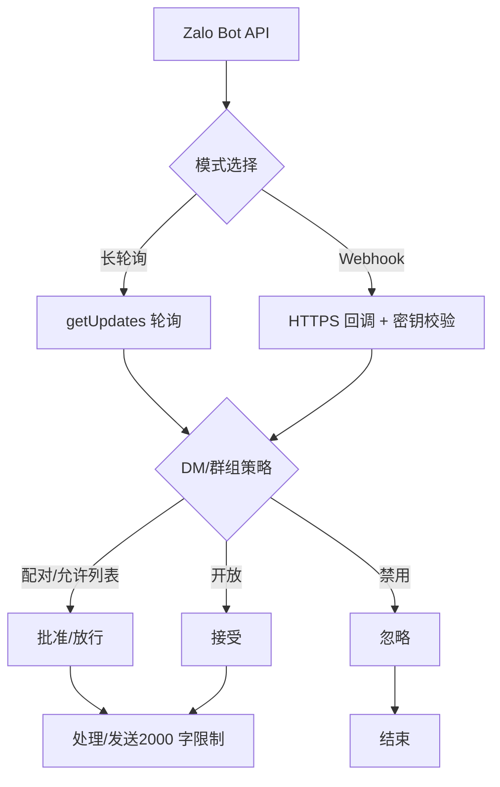
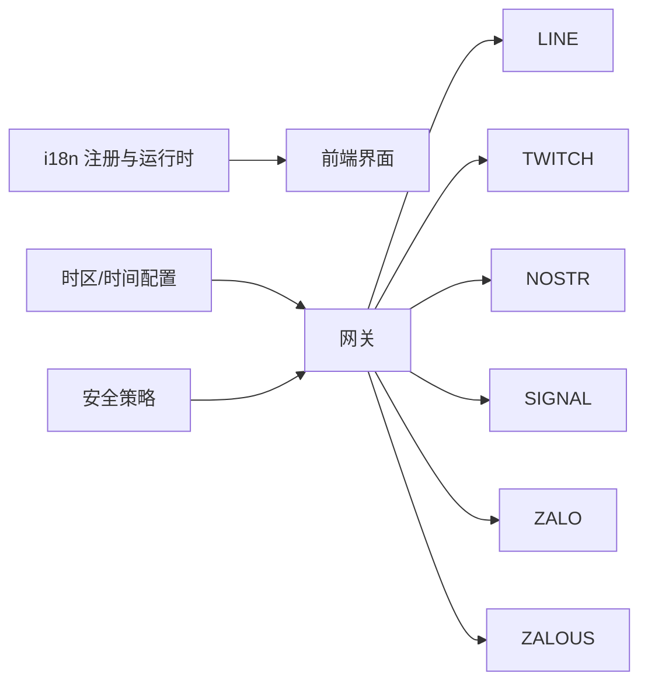

# 国际平台

## 目录
1. [简介](#简介)
2. [项目结构](#项目结构)
3. [核心组件](#核心组件)
4. [架构总览](#架构总览)
5. [详细组件分析](#详细组件分析)
6. [依赖关系分析](#依赖关系分析)
7. [性能考量](#性能考量)
8. [故障排查指南](#故障排查指南)
9. [结论](#结论)
10. [附录](#附录)

## 简介
本文件面向需要在多地区、多文化环境中部署与运营的即时通讯平台，系统性梳理 LINE、Twitch、Nostr、Signal、Zalo（含 Zalo Bot API 与 Zalo Personal）等平台的接入方式、本地化要求、文化适配与隐私保护策略，并给出跨语言支持、时区处理与本地法规遵循的配置指南及部署建议。

## 项目结构
OpenClaw 通过“网关 + 多通道插件”的架构，将不同平台的消息协议统一抽象为内部信道层，再由代理与工具链完成消息路由、会话管理与执行控制。文档与实现中对以下方面有明确支撑：
- 多语言与本地化：前端 i18n 注册表与运行时切换、浏览器语言回退规则
- 时间与时区：消息信封时间格式、用户时区注入、系统提示中的时间格式
- 安全与合规：访问控制、令牌管理、反向代理信任边界、设备身份与远程访问限制
- 平台通道：各平台的认证、入站/出站行为、速率限制与合规要点

图示来源
- [docs/index.md](file://docs/index.md#L61-L69)
- [docs/install/index.md](file://docs/install/index.md#L14-L22)

章节来源
- [docs/index.md](file://docs/index.md#L44-L94)
- [docs/install/index.md](file://docs/install/index.md#L14-L22)

## 核心组件
- 本地化与多语言
  - 前端 i18n 支持：默认英语，支持 zh-CN、zh-TW、pt-BR、de、es；自动根据浏览器语言回退；运行时按需懒加载翻译包
  - 语音唤醒触发词清理与区域标识规范化（macOS）
- 时间与时区
  - 消息信封默认本地时间（分钟级精度），可配置为 UTC 或用户时区；系统提示仅注入用户时区与时间格式
- 安全与合规
  - 网关绑定模式（loopback/lan/tailnet/custom）、共享令牌/密码认证、反向代理信任、设备身份与远程访问限制
  - 访问控制：DM 策略（配对/允许名单/开放/禁用）、群组策略、提及/角色门控
  - 工具策略与沙箱：最小权限原则、严格工具白名单、工作区隔离

章节来源
- [src/i18n/registry.test.ts](file://src/i18n/registry.test.ts#L22-L34)
- [ui/src/i18n/lib/translate.ts](file://ui/src/i18n/lib/translate.ts#L15-L82)
- [ui/src/i18n/lib/types.ts](file://ui/src/i18n/lib/types.ts#L3-L9)
- [apps/macos/Sources/OpenClaw/VoiceWakeHelpers.swift](file://apps/macos/Sources/OpenClaw/VoiceWakeHelpers.swift#L12-L24)
- [docs/concepts/timezone.md](file://docs/concepts/timezone.md#L11-L42)
- [docs/date-time.md](file://docs/date-time.md#L11-L44)
- [docs/gateway/security/index.md](file://docs/gateway/security/index.md#L15-L76)

## 架构总览
下图展示从客户端到各平台通道的整体流程，以及安全与本地化在其中的关键位置：

图示来源
- [docs/index.md](file://docs/index.md#L59-L71)
- [docs/gateway/security/index.md](file://docs/gateway/security/index.md#L145-L172)

## 详细组件分析

### LINE（插件）
- 连接方式：通过 LINE Messaging API 的 Webhook 接收与发送消息，使用 Channel Access Token 与 Channel Secret 进行签名验证
- 功能特性：支持私聊、群聊、媒体、位置、Flex 卡片、模板消息与快速回复；不支持反应与线程
- 配置要点：
  - 最小配置：启用、设置 Channel Access Token 与 Channel Secret、DM 策略（推荐配对）
  - 多账户：支持 accounts 下的独立 Token 与 Webhook 路径
  - 媒体上限：默认 10MB，可通过 mediaMaxMb 调整
- 访问控制：DM 默认配对；支持 allowFrom 允许列表；群组策略支持 allowlist/open/disabled
- 故障排查：Webhook 验证失败（确认 HTTPS 与 Channel Secret 匹配）、媒体下载错误（提高 mediaMaxMb）

图示来源
- [docs/channels/line.md](file://docs/channels/line.md#L51-L54)
- [docs/channels/line.md](file://docs/channels/line.md#L108-L132)

章节来源
- [docs/channels/line.md](file://docs/channels/line.md#L10-L192)

### Twitch（IRC 聊天）
- 连接方式：以机器人账号通过 IRC 连接至指定频道，具备读写权限
- 安全与访问控制：强烈建议设置 allowFrom 或 allowedRoles；默认 requireMention=true
- 配置要点：
  - 最小配置：启用、用户名、访问令牌、Client ID、频道
  - 多账户：channels.twitch.accounts 下分别配置
  - 自动刷新：若使用自建应用，可配置 clientSecret 与 refreshToken 实现自动刷新
- 行为限制：单条消息最大 500 字符（按单词边界自动分块），Markdown 在分块前剥离
- 故障排查：检查令牌作用域、是否加入目标频道、是否开启 allowFrom/allowedRoles

图示来源
- [docs/channels/twitch.md](file://docs/channels/twitch.md#L30-L45)
- [docs/channels/twitch.md](file://docs/channels/twitch.md#L249-L280)

章节来源
- [docs/channels/twitch.md](file://docs/channels/twitch.md#L8-L380)

### Nostr（去中心化私信）
- 运行模式：作为可选插件，默认禁用；通过 NIP-04 加密私信
- 配置要点：
  - 私钥：支持 nsec 或 64 字节十六进制；pubkey 允许列表支持 npub 或十六进制
  - 中继：默认 damus.io 与 nos.lol；建议至少 2-3 个中继提升冗余
  - DM 策略：配对/允许列表/开放/禁用
- 协议支持：NIP-01（基础事件/资料）、NIP-04（加密私信）；计划支持 NIP-17（礼物包裹）与 NIP-44（版本化加密）
- 故障排查：检查私钥有效性、中继可达性（wss://）、enabled 开关、重复响应（多中继导致）

图示来源
- [docs/channels/nostr.md](file://docs/channels/nostr.md#L115-L137)
- [docs/channels/nostr.md](file://docs/channels/nostr.md#L167-L175)

章节来源
- [docs/channels/nostr.md](file://docs/channels/nostr.md#L9-L234)

### Signal（signal-cli 集成）
- 运行模式：通过 signal-cli 的 JSON-RPC + SSE 与网关通信；支持链接现有账号或短信注册专用号码
- 数字模型：网关连接的是 Signal 设备（signal-cli 账号）；建议使用独立机器人号码避免循环
- 配置要点：
  - 最小配置：启用、账号（E.164）、dmPolicy（推荐配对）、allowFrom
  - 多账户：channels.signal.accounts
  - 外部守护：可配置 httpUrl 与 autoStart=false，跳过自动启动
  - 媒体与历史：textChunkLimit、chunkMode、mediaMaxMb、historyLimit
- 访问控制：DM 默认配对；群组策略 open/allowlist/disabled；UUID/手机号允许列表
- 故障排查：daemon 可达性、receiveMode、配对状态、配置校验

图示来源
- [docs/channels/signal.md](file://docs/channels/signal.md#L15-L29)
- [docs/channels/signal.md](file://docs/channels/signal.md#L165-L181)

章节来源
- [docs/channels/signal.md](file://docs/channels/signal.md#L9-L326)

### Zalo（Bot API 与 Personal）
- Zalo Bot API（实验性）：支持私聊；群组处理需显式策略控制，默认 fail-closed 允许列表
  - 配置：botToken、dmPolicy、allowFrom、groupPolicy/groupAllowFrom、webhookUrl/webhookSecret/webhookPath
  - 限制：文本 2000 字分片、媒体默认 5MB、默认阻断流式传输
- Zalo Personal（非官方，实验性）：通过原生 zca-js 在网关内自动化个人账号
  - 配置：enabled、dmPolicy、allowFrom、群组策略与提及门控、多账户映射
  - 限制：文本约 2000 字分片、默认阻断流式传输
- 故障排查：令牌有效性、webhook HTTPS 与密钥长度、轮询与 webhook 互斥

图示来源
- [docs/channels/zalo.md](file://docs/channels/zalo.md#L120-L133)
- [docs/channels/zalouser.md](file://docs/channels/zalouser.md#L68-L72)

章节来源
- [docs/channels/zalo.md](file://docs/channels/zalo.md#L8-L207)
- [docs/channels/zalouser.md](file://docs/channels/zalouser.md#L9-L180)

### 本地化与文化适配
- 多语言支持：前端支持英语、简体中文、繁体中文、葡萄牙语（巴西）、德语、西班牙语；自动根据浏览器语言回退；运行时懒加载翻译
- 文化适配建议：
  - 使用平台原生 UI 与文案时，结合用户时区与时间格式（12/24 小时）
  - 对于不同地区的敏感内容与表达，建议在代理系统提示中注入用户时区与本地习惯
  - 遵循平台本地化规范（如 LINE 的 Flex 卡片、Twitch 的角色权限、Nostr 的中继选择）

章节来源
- [src/i18n/registry.test.ts](file://src/i18n/registry.test.ts#L22-L48)
- [ui/src/i18n/lib/translate.ts](file://ui/src/i18n/lib/translate.ts#L15-L82)
- [ui/src/i18n/lib/types.ts](file://ui/src/i18n/lib/types.ts#L3-L9)
- [apps/macos/Sources/OpenClaw/VoiceWakeHelpers.swift](file://apps/macos/Sources/OpenClaw/VoiceWakeHelpers.swift#L12-L24)

### 时区与日期时间处理
- 消息信封默认主机本地时间（分钟级），可配置为 UTC 或用户时区；系统提示仅注入用户时区与时间格式
- 用户时区与时间格式：通过 agents.defaults.userTimezone 与 agents.defaults.timeFormat 控制
- 工具与连接器：保留原始提供方时间戳并附加标准化字段（UTC 毫秒与 ISO 8601 UTC 字符串）

章节来源
- [docs/concepts/timezone.md](file://docs/concepts/timezone.md#L11-L92)
- [docs/date-time.md](file://docs/date-time.md#L11-L129)

## 依赖关系分析
- 平台通道与网关耦合度低：通过统一信道接口对接，便于扩展与替换
- 安全与本地化横切关注点：贯穿于网关绑定、认证、工具策略、i18n 与时间配置
- 依赖链示意：

图示来源
- [docs/gateway/security/index.md](file://docs/gateway/security/index.md#L145-L172)
- [docs/concepts/timezone.md](file://docs/concepts/timezone.md#L23-L42)
- [src/i18n/registry.test.ts](file://src/i18n/registry.test.ts#L22-L34)

章节来源
- [docs/gateway/security/index.md](file://docs/gateway/security/index.md#L145-L172)
- [docs/concepts/timezone.md](file://docs/concepts/timezone.md#L23-L42)
- [src/i18n/registry.test.ts](file://src/i18n/registry.test.ts#L22-L34)

## 性能考量
- 传输与渲染
  - LINE：媒体默认 10MB，可按需提升；富媒体与模板消息可能增加处理开销
  - Signal：文本默认 4000 字分片，支持按空行分段；媒体默认 8MB
  - Zalo：文本 2000 字分片，媒体默认 5MB；默认阻断流式传输
  - Twitch：单条消息 500 字，按单词边界分块
- 连接与轮询
  - Zalo Bot API 支行长轮询与 webhook，二者互斥；webhook 需 HTTPS 与密钥校验
  - Nostr：多中继冗余带来延迟与重复风险，建议 2-3 个可靠中继
- 工具与沙箱
  - 严格工具策略与工作区隔离可降低资源滥用风险；在高并发场景建议启用沙箱与限流

## 故障排查指南
- 通用诊断步骤
  - 快速状态：openclaw status、openclaw gateway status
  - 日志追踪：openclaw logs --follow
  - 修复与迁移：openclaw doctor、openclaw security audit
- 平台特定问题
  - LINE：确认 HTTPS 与 Channel Secret、Webhook 路径匹配、媒体上限
  - Twitch：检查令牌作用域、频道加入、allowFrom/allowedRoles、自动刷新
  - Nostr：核对私钥格式、中继可达性、enabled 开关、重复响应
  - Signal：daemon 可达性、account/daemon 设置、配对状态、配置校验
  - Zalo：令牌有效、HTTPS webhook、轮询与 webhook 互斥、群组策略

章节来源
- [docs/help/faq.md](file://docs/help/faq.md#L203-L267)
- [docs/channels/line.md](file://docs/channels/line.md#L184-L192)
- [docs/channels/twitch.md](file://docs/channels/twitch.md#L249-L286)
- [docs/channels/nostr.md](file://docs/channels/nostr.md#L203-L222)
- [docs/channels/signal.md](file://docs/channels/signal.md#L251-L286)
- [docs/channels/zalo.md](file://docs/channels/zalo.md#L159-L173)

## 结论
通过统一的网关与多通道插件架构，OpenClaw 能够在多地区、多文化环境中稳定运行。结合严格的访问控制、工具策略与沙箱、完善的本地化与时间配置，以及各平台的认证与合规要点，可在保障隐私与安全的前提下，实现高质量的跨语言与跨地域即时通讯体验。

## 附录
- 部署建议
  - 服务器端：优先使用 loopback 绑定与强令牌；在公网暴露时配合反向代理与可信代理配置
  - 客户端：使用 Tailscale Serve 或 SSH 隧道访问网关；避免在不受信任网络暴露 Control UI
  - 多用户隔离：建议按信任边界拆分网关实例，避免共享主机/配置写权限
- 合规要求
  - 明确 DM 策略与群组策略，启用 allowFrom/allowedRoles 与提及门控
  - 严格工具策略与沙箱，避免高风险工具在未授权场景执行
  - 本地法规遵循：依据地区数据本地化与跨境传输限制调整中继/代理与存储位置

章节来源
- [docs/gateway/security/index.md](file://docs/gateway/security/index.md#L49-L76)
- [docs/gateway/security/index.md](file://docs/gateway/security/index.md#L605-L632)
- [docs/install/index.md](file://docs/install/index.md#L14-L22)