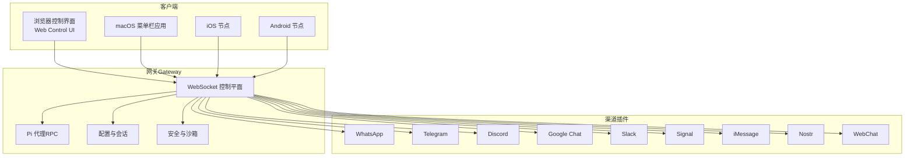
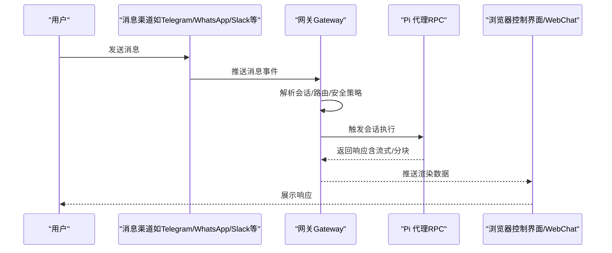
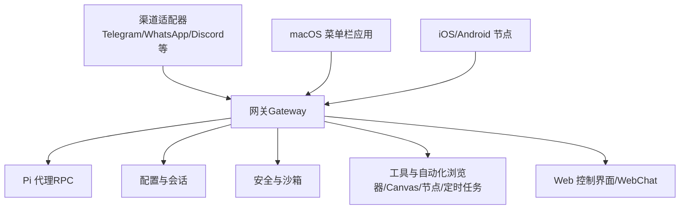

# 平台对比和选择指南

## 目录
1. [简介](#简介)
2. [项目结构](#项目结构)
3. [核心组件](#核心组件)
4. [架构总览](#架构总览)
5. [详细组件分析](#详细组件分析)
6. [依赖关系分析](#依赖关系分析)
7. [性能考量](#性能考量)
8. [故障排除指南](#故障排除指南)
9. [结论](#结论)
10. [附录](#附录)

## 简介
本指南面向希望在本地或私有环境中运行个人AI助手的用户与团队，系统性梳理OpenClaw平台在多渠道消息、媒体处理、群组管理、反应功能、安全与隐私等方面的能力，并结合不同使用场景（个人用户、小团队、企业、开发者社区）给出平台选择建议。同时提供部署难度评估、性能对比与成本考量，以及平台迁移与多平台并行使用的最佳实践。

## 项目结构
OpenClaw是一个以“网关（Gateway）+ 多客户端/节点”的架构为核心的应用，支持跨平台运行与多渠道消息互通。其核心能力包括：
- 单一控制平面（WebSocket）承载会话、路由、工具与事件
- 支持多渠道消息（如WhatsApp、Telegram、Discord、Google Chat、Signal、iMessage、IRC、Microsoft Teams、Matrix、Feishu、LINE、Mattermost、Nextcloud Talk、Nostr、Synology Chat、Tlon、Twitch、Zalo、Zalo Personal、WebChat）
- 媒体与语音能力（图片/音频/视频、转录钩子、设备节点）
- 安全沙箱与权限控制
- 可选的桌面与移动节点（macOS菜单栏应用、iOS/Android节点）

图表来源
- [docs/index.md](file://docs/index.md#L59-L71)
- [docs/channels/index.md](file://docs/channels/index.md#L14-L37)

章节来源
- [README.md](file://README.md#L21-L27)
- [docs/index.md](file://docs/index.md#L44-L71)

## 核心组件
- 网关（Gateway）：单一WS控制平面，负责会话、路由、配置、定时任务、Webhook、远程访问与安全策略。
- 渠道插件：针对不同消息平台的适配器，统一通过网关接入。
- 客户端与节点：浏览器UI、macOS菜单栏应用、iOS/Android节点用于设备级操作与交互。
- 工具与自动化：浏览器控制、Canvas可视化、节点命令、定时任务、Webhook、Gmail Pub/Sub等。
- 安全与合规：默认最小权限、沙箱模式、分组隔离、权限提示与审计。

章节来源
- [README.md](file://README.md#L128-L176)
- [docs/concepts/features.md](file://docs/concepts/features.md#L8-L29)

## 架构总览
下图展示了OpenClaw从消息渠道到网关再到代理与客户端的整体工作流：

图表来源
- [docs/index.md](file://docs/index.md#L59-L71)

章节来源
- [docs/index.md](file://docs/index.md#L59-L71)

## 详细组件分析

### 功能矩阵对比（按维度）
以下为OpenClaw在常见维度上的能力概览（基于仓库文档与实现）：

- 文本支持：所有渠道均支持文本；部分渠道支持富文本（取决于渠道能力与渲染）。
- 媒体能力：图像、音频、文档；部分渠道支持转录钩子与大小限制。
- 群组管理：支持提及激活、回复标签、分组路由与规则。
- 反应功能：部分渠道支持反应（如Signal反应），其他渠道通过消息内容模拟。
- 安全性：默认最小权限、分组隔离、沙箱模式、权限提示与审计。

章节来源
- [docs/channels/index.md](file://docs/channels/index.md#L11-L12)
- [src/commands/channels/capabilities.ts](file://src/commands/channels/capabilities.ts#L76-L118)
- [src/signal/send-reactions.ts](file://src/signal/send-reactions.ts#L143-L190)

### 平台能力与特性
- 多渠道：支持主流IM与企业协作平台，部分为插件扩展。
- 多代理路由：按发送者/工作区/代理隔离会话。
- 媒体与语音：图片/音频/视频处理、转录钩子、设备节点（相机/屏幕录制/通知等）。
- 安全与合规：默认最小权限、可启用沙箱、权限提示、审计与诊断。

章节来源
- [docs/concepts/features.md](file://docs/concepts/features.md#L31-L48)
- [README.md](file://README.md#L128-L176)

### 部署与平台支持
- 运行时：推荐Node 22；Bun不推荐用于网关（存在已知问题）。
- 操作系统：macOS、Linux、Windows（WSL2推荐）。
- 服务安装：通过向导或CLI安装系统服务（macOS LaunchAgent、Linux systemd）。
- 容器化：Docker/Podman/Nix/Ansible等多种部署方式。

章节来源
- [docs/platforms/index.md](file://docs/platforms/index.md#L11-L16)
- [docs/install/index.md](file://docs/install/index.md#L14-L22)
- [scripts/install.sh](file://scripts/install.sh#L1443-L1486)

### 安全模型与审计
- 默认：主会话工具在主机运行；群组/频道会话可启用沙箱。
- 沙箱配置：允许/拒绝列表、Docker绑定/网络/安全配置需谨慎。
- 审计：自动检测危险配置（如host网络、未约束seccomp/AppArmor、容器命名空间加入等）。

章节来源
- [README.md](file://README.md#L332-L338)
- [src/security/audit.test.ts](file://src/security/audit.test.ts#L1027-L1088)
- [src/security/audit-extra.sync.ts](file://src/security/audit-extra.sync.ts#L777-L820)

### 性能与成本
- 性能预算：内置测试脚本对耗时进行基线与回归检查。
- 启动性能：Android基准脚本输出启动时间JSON，便于对比。
- 成本估算：根据模型提供商与用量统计，计算输入/输出/缓存读写成本。

章节来源
- [scripts/test-perf-budget.mjs](file://scripts/test-perf-budget.mjs#L98-L127)
- [apps/android/scripts/perf-startup-benchmark.sh](file://apps/android/scripts/perf-startup-benchmark.sh#L55-L86)
- [src/utils/usage-format.ts](file://src/utils/usage-format.ts#L69-L91)
- [src/agents/vercel-ai-gateway.ts](file://src/agents/vercel-ai-gateway.ts#L39-L97)

### 迁移与多平台并行
- 迁移：复制状态目录与工作区，保留会话、认证、渠道登录与代理状态。
- 注意事项：避免仅复制配置文件、注意权限与所有权、避免profile/state-dir不一致、远程/本地模式差异。
- 多平台并行：可在同一机器上运行多个profile，或在不同主机间迁移。

章节来源
- [docs/install/migrating.md](file://docs/install/migrating.md#L9-L67)
- [docs/install/migrating.md](file://docs/install/migrating.md#L133-L178)

## 依赖关系分析

图表来源
- [docs/index.md](file://docs/index.md#L59-L71)
- [docs/channels/index.md](file://docs/channels/index.md#L14-L37)

章节来源
- [docs/index.md](file://docs/index.md#L59-L71)
- [docs/channels/index.md](file://docs/channels/index.md#L14-L37)

## 性能考量
- 启动与运行时：通过性能预算脚本与Android基准脚本监控耗时，确保回归在可控范围内。
- 用量与成本：根据模型提供商的计费结构与用量统计，估算输入/输出/缓存读写成本。
- 并发与资源：根据本地内存与CPU核数动态分配单元/扩展/网关并发度，避免OOM。

章节来源
- [scripts/test-perf-budget.mjs](file://scripts/test-perf-budget.mjs#L98-L127)
- [apps/android/scripts/perf-startup-benchmark.sh](file://apps/android/scripts/perf-startup-benchmark.sh#L55-L86)
- [src/utils/usage-format.ts](file://src/utils/usage-format.ts#L69-L91)
- [src/agents/pi-embedded-runner/run.ts](file://src/agents/pi-embedded-runner/run.ts#L121-L155)

## 故障排除指南
- 常见问题：安装后openclaw不可用、PATH未包含全局路径、Sharp构建错误。
- 诊断工具：doctor命令修复服务、应用迁移、警告配置不匹配。
- 渠道问题：参考渠道特定的故障排除文档与安全策略（DM配对、白名单）。

章节来源
- [docs/install/index.md](file://docs/install/index.md#L181-L204)
- [docs/install/index.md](file://docs/install/index.md#L163-L171)
- [README.md](file://README.md#L112-L124)

## 结论
OpenClaw以“网关+多客户端/节点”的架构实现了跨平台、跨渠道的个人AI助手体验。其在多渠道消息、媒体处理、群组管理与安全方面具备成熟能力，适合个人用户与小团队自建私有AI助理。对于企业与开发者社区，可通过沙箱与权限控制满足合规要求，并借助多平台并行与迁移能力实现灵活部署与运维。

## 附录

### 不同使用场景的平台推荐
- 个人用户
  - 推荐：Node运行时 + 本地网关 + 浏览器控制界面/WebChat；快速入门可直接使用WebChat。
  - 优势：部署简单、数据本地化、即开即用。
  - 参考：[Getting Started](file://docs/start/getting-started.md#L28-L77)

- 小团队
  - 推荐：Node运行时 + 本地网关 + macOS菜单栏应用 + iOS/Android节点。
  - 优势：设备级能力（相机/屏幕录制/通知）、群组隔离与权限控制。
  - 参考：[Features](file://docs/concepts/features.md#L31-L48)

- 企业
  - 推荐：Node运行时 + 远程网关（Linux实例）+ Tailscale Serve/Funnel + 沙箱模式。
  - 优势：远程访问、安全暴露、最小权限与审计。
  - 参考：[Remote Access](file://README.md#L230-L238)、[Security](file://README.md#L332-L338)

- 开发者社区
  - 推荐：从源码构建 + 插件生态 + 多平台并行（WSL2/Windows/Linux/macOS）。
  - 优势：可扩展性强、工具链完善、多平台兼容。
  - 参考：[Install From Source](file://docs/install/index.md#L107-L139)、[Platforms](file://docs/platforms/index.md#L18-L24)

### 部署难度评估
- Node安装：脚本自动检测并安装Node 22+。
- 服务安装：向导或CLI一键安装系统服务（macOS/Windows需管理员权限）。
- 容器化：Docker/Podman/Nix/Ansible多种方式，适合云/边缘部署。
- 迁移：复制状态目录与工作区，doctor修复与迁移。

章节来源
- [scripts/install.sh](file://scripts/install.sh#L1443-L1486)
- [docs/install/index.md](file://docs/install/index.md#L41-L48)
- [docs/install/index.md](file://docs/install/index.md#L143-L161)
- [docs/install/migrating.md](file://docs/install/migrating.md#L68-L132)

### 性能对比与成本考量
- 性能：通过性能预算与Android基准脚本量化启动与运行时表现。
- 成本：依据模型提供商计费结构与用量统计进行估算。

章节来源
- [scripts/test-perf-budget.mjs](file://scripts/test-perf-budget.mjs#L98-L127)
- [apps/android/scripts/perf-startup-benchmark.sh](file://apps/android/scripts/perf-startup-benchmark.sh#L55-L86)
- [src/utils/usage-format.ts](file://src/utils/usage-format.ts#L69-L91)
- [src/agents/vercel-ai-gateway.ts](file://src/agents/vercel-ai-gateway.ts#L39-L97)

### 平台迁移与多平台并行最佳实践
- 迁移步骤：停止网关、备份状态目录与工作区、在新机安装、复制并校验权限、doctor修复、重启验证。
- 多平台并行：使用profile区分环境，保持state-dir一致性，避免仅复制配置文件。

章节来源
- [docs/install/migrating.md](file://docs/install/migrating.md#L68-L132)
- [docs/install/migrating.md](file://docs/install/migrating.md#L133-L178)