# 支持的即时通讯平台


## 目录
1. [简介](#简介)
2. [项目结构](#项目结构)
3. [核心组件](#核心组件)
4. [架构概览](#架构概览)
5. [详细组件分析](#详细组件分析)
6. [依赖关系分析](#依赖关系分析)
7. [性能考虑](#性能考虑)
8. [故障排除指南](#故障排除指南)
9. [结论](#结论)
10. [附录](#附录)

## 简介

OpenClaw 支持20多种即时通讯平台，为不同需求和使用场景提供灵活的集成方案。从主流的企业级平台（Discord、Slack、Microsoft Teams）到隐私保护的通信工具（Signal、Nostr），从国际化的社交应用（Telegram、WhatsApp）到国内主流IM（飞书、微信企业版、钉钉），OpenClaw都能提供完整的连接和消息处理能力。

每个平台都经过精心设计，确保在保持安全性和隐私性的同时，提供最佳的用户体验。平台支持包括文本消息、多媒体内容、反应功能、群组管理等核心特性，并针对各平台的独特功能进行了优化。

## 项目结构

OpenClaw 的平台支持采用模块化架构，通过插件系统实现对不同即时通讯平台的统一接入：

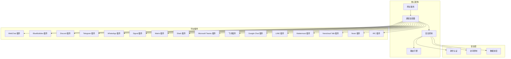

**图表来源**
- [聊天频道索引](file://docs/channels/index.md#L1-L48)

**章节来源**
- [聊天频道索引](file://docs/channels/index.md#L1-L48)

## 核心组件

### 通道适配器架构

OpenClaw 的通道适配器是所有即时通讯平台的统一入口点，负责处理以下核心功能：

- **消息标准化**：将不同平台的消息格式转换为统一的内部表示
- **会话管理**：维护用户对话状态和上下文
- **路由决策**：根据目标和规则确定消息发送路径
- **安全控制**：实施访问控制和身份验证

### 安全控制机制

每个平台都实现了多层次的安全控制：

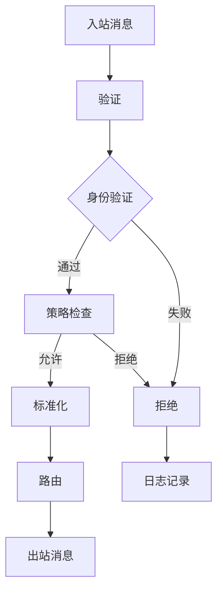

**图表来源**
- [聊天频道索引](file://docs/channels/index.md#L14-L47)

### 多账户支持

OpenClaw 支持多账户配置，允许同时管理多个平台账号：

- **独立配置**：每个账户可以有不同的认证信息和设置
- **资源隔离**：账户间的数据和会话完全隔离
- **灵活切换**：支持动态切换和管理不同账户

**章节来源**
- [聊天频道索引](file://docs/channels/index.md#L14-L47)

## 架构概览

OpenClaw 的即时通讯平台支持架构采用分层设计，确保了系统的可扩展性和维护性：

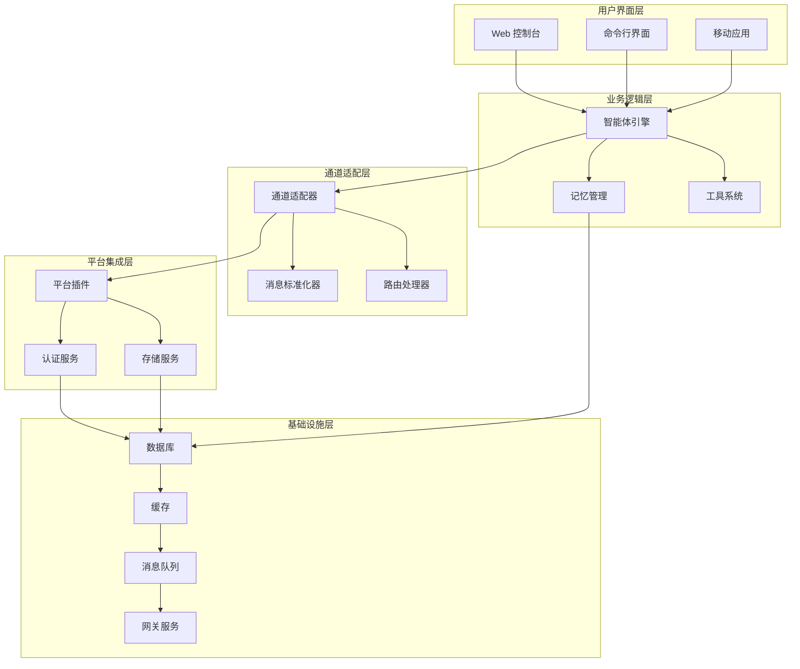

**图表来源**
- [聊天频道索引](file://docs/channels/index.md#L1-L48)

## 详细组件分析

### WhatsApp 集成

#### 配置要求
- **认证方式**：基于 Baileys 的 WhatsApp Web 会话
- **部署模式**：推荐专用号码，避免与个人号码混淆
- **安全设置**：默认配对模式，支持允许列表和禁用模式

#### 核心功能
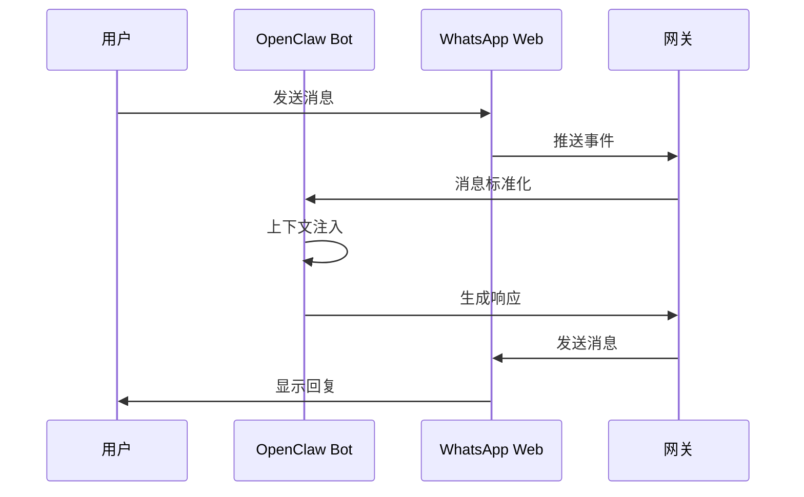

**图表来源**
- [WhatsApp 频道](file://docs/channels/whatsapp.md#L126-L133)

#### 特殊功能支持
- **群组管理**：支持群组成员管理和消息过滤
- **媒体支持**：图片、视频、音频、文档完整支持
- **反应功能**：实时反应和ack反应
- **历史上下文**：支持群组历史消息注入

**章节来源**
- [WhatsApp 频道](file://docs/channels/whatsapp.md#L1-L446)

### Telegram 集成

#### 配置要求
- **认证方式**：Bot Token（无需配对）
- **部署模式**：支持长轮询和Webhook两种模式
- **权限设置**：通过BotFather配置机器人权限

#### 核心功能
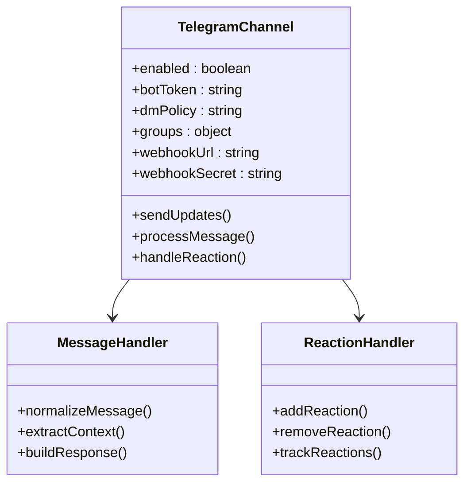

**图表来源**
- [Telegram 频道](file://docs/channels/telegram.md#L222-L231)

#### 特殊功能支持
- **论坛主题**：支持Telegram论坛的子主题路由
- **内联按钮**：支持交互式按钮和表单
- **富文本**：支持HTML格式和链接预览
- **语音消息**：支持语音消息和视频消息

**章节来源**
- [Telegram 频道](file://docs/channels/telegram.md#L1-L948)

### Discord 集成

#### 配置要求
- **认证方式**：Discord Bot Token + 应用密钥
- **权限配置**：需要启用特权网关意图
- **服务器设置**：需要添加机器人到服务器

#### 核心功能
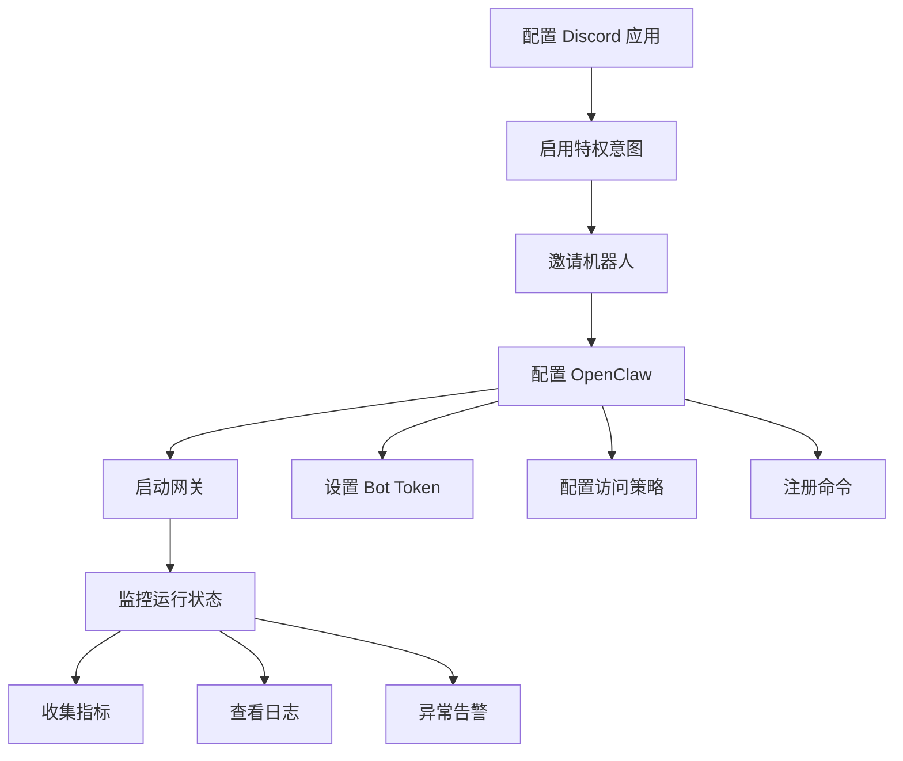

**图表来源**
- [Discord 频道](file://docs/channels/discord.md#L24-L167)

#### 特殊功能支持
- **组件容器**：支持复杂的交互式组件
- **线程绑定**：支持线程级别的会话绑定
- **角色路由**：支持基于角色的智能路由
- **持久化会话**：支持ACF会话绑定

**章节来源**
- [Discord 频道](file://docs/channels/discord.md#L1-L1223)

### Slack 集成

#### 配置要求
- **认证方式**：Socket Mode 或 HTTP Events API
- **权限范围**：需要完整的bot权限范围
- **事件订阅**：需要订阅相关事件类型

#### 核心功能
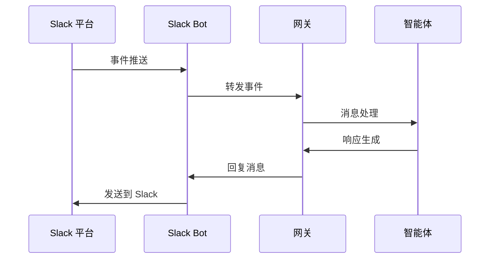

**图表来源**
- [Slack 频道](file://docs/channels/slack.md#L299-L305)

#### 特殊功能支持
- **原生流式传输**：支持Slack的AI应用API流式传输
- **块级流式传输**：支持分块流式传输
- **交互式按钮**：支持块动作和模态交互
- **助手状态**：支持助手线程状态更新

**章节来源**
- [Slack 频道](file://docs/channels/slack.md#L1-L555)

### iMessage 集成

#### 配置要求
- **系统要求**：macOS环境 + imsg CLI
- **权限设置**：需要自动化权限和全盘访问权限
- **部署模式**：支持本地和远程Mac部署

#### 核心功能
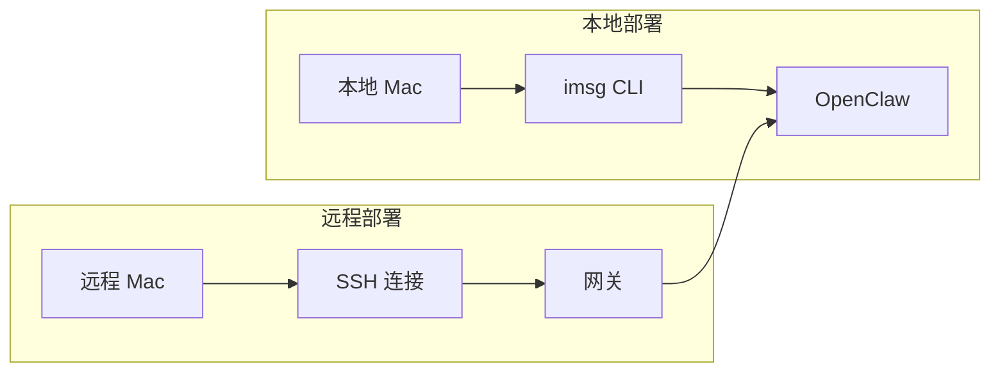

**图表来源**
- [iMessage 频道](file://docs/channels/imessage.md#L31-L115)

#### 特殊功能支持
- **附件处理**：支持图片、视频、文件附件
- **远程同步**：支持SCP附件同步
- **多账户**：支持多个iMessage账户
- **会话隔离**：支持群组会话隔离

**章节来源**
- [iMessage 频道](file://docs/channels/imessage.md#L1-L368)

### 其他平台支持

#### IRC 集成
- **协议支持**：标准IRC协议，支持TLS连接
- **访问控制**：支持用户名、主机名匹配
- **频道管理**：支持公共频道和私有频道

#### 飞书集成
- **WebSocket**：使用长连接接收事件
- **权限管理**：支持应用级和用户级权限
- **消息类型**：支持富文本、图片、文件

#### Google Chat 集成
- **服务账号**：使用服务账号进行认证
- **Webhook**：支持HTTP webhook接收消息
- **域管理**：支持Google Workspace域管理

#### LINE 集成
- **插件模式**：作为独立插件安装
- **消息类型**：支持文本、图片、模板消息
- **快速回复**：支持快速回复按钮

#### Matrix 集成
- **去中心化**：支持任意Matrix服务器
- **端到端加密**：支持E2EE加密
- **线程支持**：支持消息线程

#### Mattermost 集成
- **插件模式**：支持WebSocket事件监听
- **交互按钮**：支持内联按钮和表单
- **多账户**：支持多个Mattermost实例

#### Microsoft Teams 集成
- **Azure Bot**：使用Azure Bot Framework
- **RSC权限**：支持资源特定权限
- **文件共享**：支持SharePoint文件共享

#### Nextcloud Talk 集成
- **Webhook**：使用webhook接收消息
- **反应支持**：支持消息反应
- **房间管理**：支持聊天室管理

#### Nostr 集成
- **去中心化**：基于Nostr协议
- **加密通信**：支持NIP-04加密
- **中继网络**：支持多个中继节点

**章节来源**
- [聊天频道索引](file://docs/channels/index.md#L14-L37)

## 依赖关系分析

OpenClaw 的平台支持系统具有清晰的依赖关系：

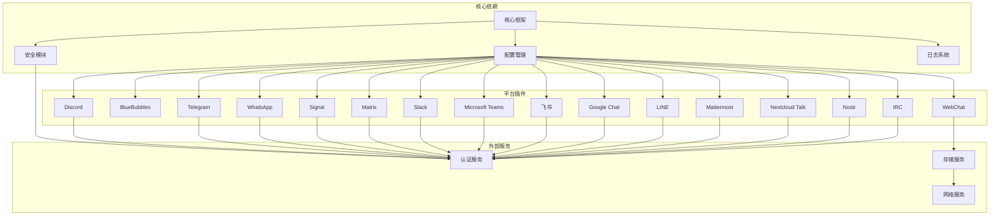

**图表来源**
- [聊天频道索引](file://docs/channels/index.md#L1-L48)

### 平台选择矩阵

| 平台 | 企业级 | 隐私保护 | 社交应用 | 国内适用 | 部署复杂度 |
|------|--------|----------|----------|----------|------------|
| WhatsApp | ✓ | ✓ | ✓ | ✓ | 中等 |
| Telegram | ✓ | ✓ | ✓ | ✗ | 简单 |
| Discord | ✓ | ✓ | ✓ | ✗ | 简单 |
| Slack | ✓ | ✓ | ✗ | ✓ | 中等 |
| iMessage | ✓ | ✓ | ✗ | ✓ | 高 |
| IRC | ✓ | ✓ | ✗ | ✗ | 简单 |
| 飞书 | ✓ | ✓ | ✗ | ✓ | 中等 |
| Google Chat | ✓ | ✓ | ✗ | ✓ | 中等 |
| LINE | ✓ | ✓ | ✓ | ✓ | 简单 |
| Matrix | ✓ | ✓ | ✓ | ✗ | 中等 |
| Mattermost | ✓ | ✓ | ✗ | ✓ | 中等 |
| Microsoft Teams | ✓ | ✓ | ✗ | ✓ | 高 |
| Nextcloud Talk | ✓ | ✓ | ✗ | ✓ | 中等 |
| Nostr | ✓ | ✓ | ✓ | ✗ | 中等 |
| Signal | ✓ | ✓ | ✓ | ✗ | 高 |

**章节来源**
- [聊天频道索引](file://docs/channels/index.md#L14-L37)

## 性能考虑

### 启动时间优化

不同平台的启动时间存在显著差异：

- **简单平台**（Telegram、Discord、Slack）：1-3秒
- **中等平台**（WhatsApp、飞书、Google Chat）：5-15秒  
- **复杂平台**（iMessage、Microsoft Teams、Signal）：30-120秒

### 内存使用优化

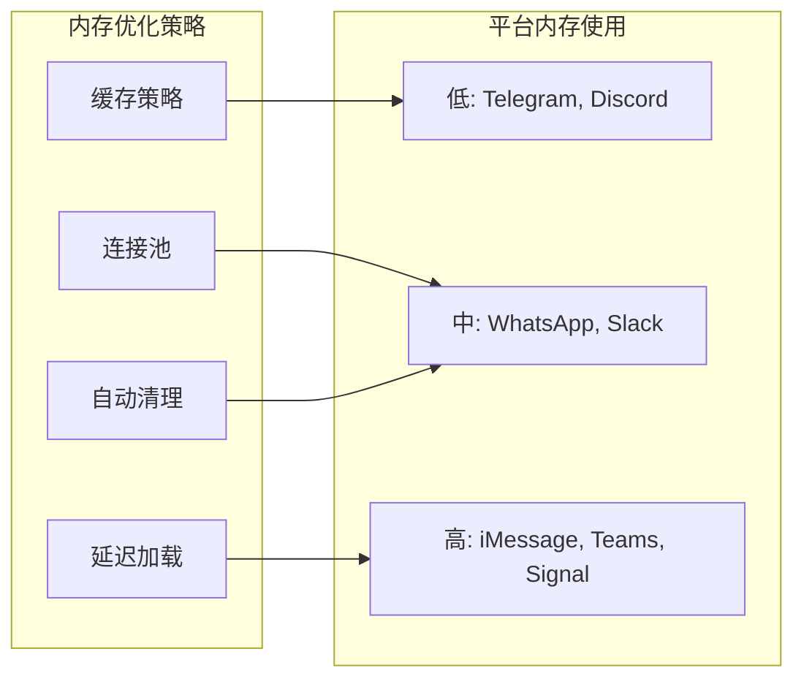

### 扩展性考虑

- **水平扩展**：支持多实例部署
- **垂直扩展**：支持增加资源分配
- **负载均衡**：支持请求分发
- **故障转移**：支持自动故障恢复

## 故障排除指南

### 常见问题诊断

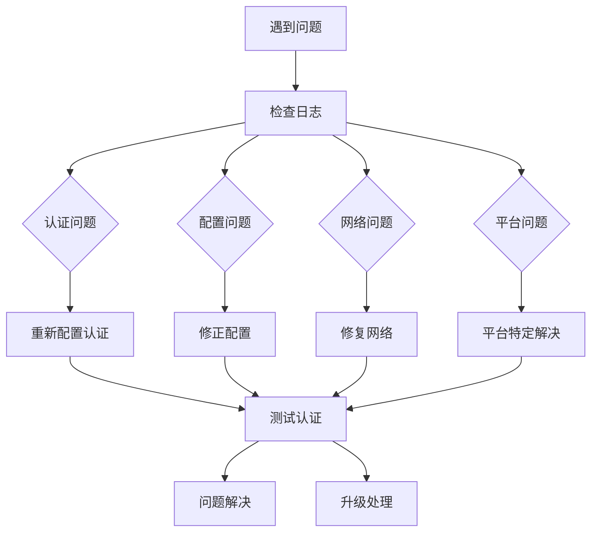

### 平台特定故障排除

#### WhatsApp 故障排除
- **连接问题**：检查QR码登录状态
- **消息丢失**：检查历史消息注入
- **媒体问题**：检查存储空间和权限

#### Telegram 故障排除  
- **权限问题**：检查Bot权限和隐私模式
- **Webhook问题**：检查域名和SSL证书
- **按钮问题**：检查回调URL和签名

#### Discord 故障排除
- **意图问题**：检查特权意图是否启用
- **权限问题**：检查机器人权限
- **线程问题**：检查线程绑定配置

**章节来源**
- [聊天频道索引](file://docs/channels/index.md#L39-L47)

## 结论

OpenClaw 的即时通讯平台支持系统提供了企业级的通信解决方案，具有以下优势：

### 技术优势
- **统一架构**：通过插件系统实现平台无关性
- **安全可靠**：多层安全控制和访问管理
- **高性能**：优化的连接管理和资源利用
- **可扩展**：支持水平和垂直扩展

### 平台覆盖
- **全球化**：支持国际主流平台
- **本土化**：深度集成国内主要平台
- **隐私保护**：支持隐私优先的通信工具
- **企业级**：满足企业级安全和合规要求

### 最佳实践建议

#### 新项目选择
- **企业团队协作**：Discord、Slack、Microsoft Teams
- **国际团队沟通**：Telegram、WhatsApp、Discord
- **国内团队协作**：飞书、钉钉、企业微信
- **隐私优先**：Signal、Matrix、Nostr

#### 部署建议
- **生产环境**：使用专用号码或账号
- **安全配置**：启用配对模式和允许列表
- **监控告警**：建立完善的监控体系
- **备份策略**：定期备份配置和数据

## 附录

### 配置模板

#### 基础配置模板
```json
{
  "channels": {
    "whatsapp": {
      "enabled": true,
      "dmPolicy": "pairing",
      "allowFrom": []
    },
    "telegram": {
      "enabled": true,
      "botToken": "",
      "dmPolicy": "pairing"
    }
  }
}
```

#### 高级配置模板
```json
{
  "channels": {
    "whatsapp": {
      "enabled": true,
      "dmPolicy": "allowlist",
      "groupPolicy": "allowlist",
      "accounts": {
        "work": {
          "enabled": true,
          "authDir": "~/.openclaw/credentials/whatsapp/work"
        }
      }
    }
  }
}
```

### 常用命令

#### 平台管理命令
```bash
# 查看平台状态
openclaw channels status

# 添加新平台
openclaw channels add

# 配置平台
openclaw channels configure

# 查看平台日志
openclaw logs --follow
```

#### 故障排除命令
```bash
# 检查配置
openclaw doctor

# 查看详细状态
openclaw channels status --probe

# 重启平台
openclaw channels restart
```