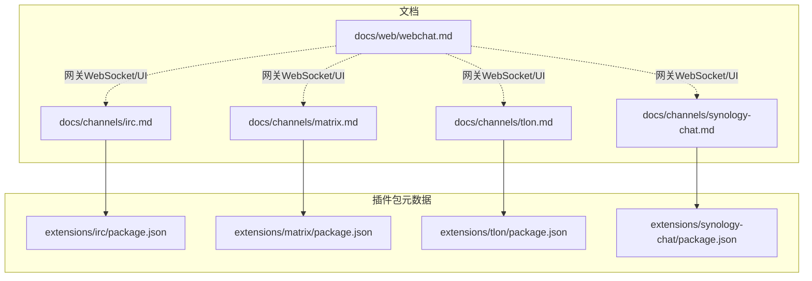
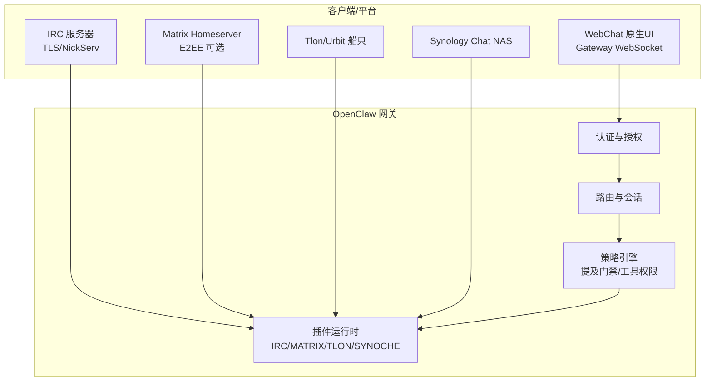
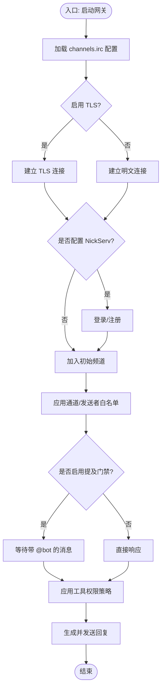
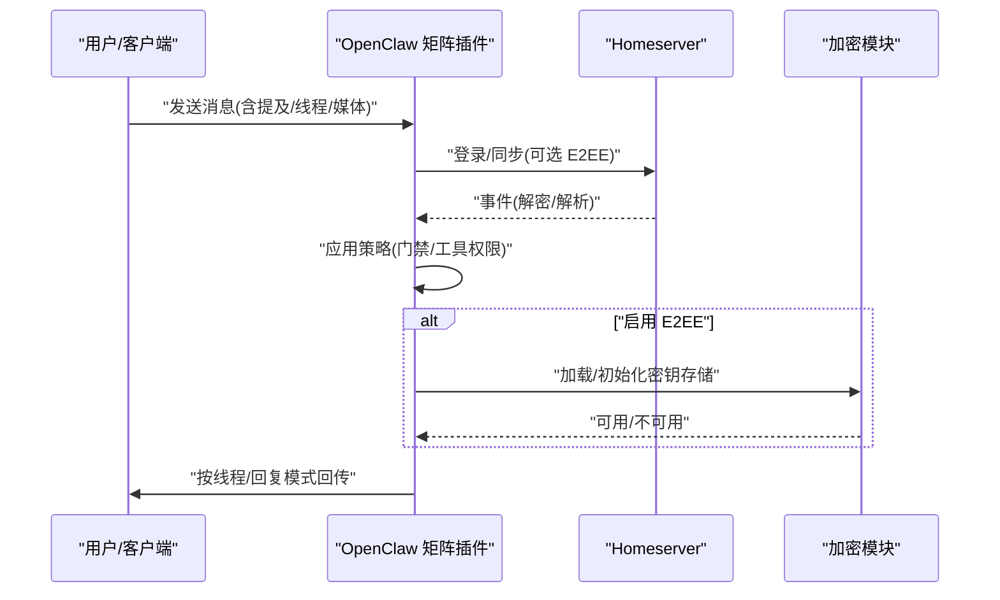
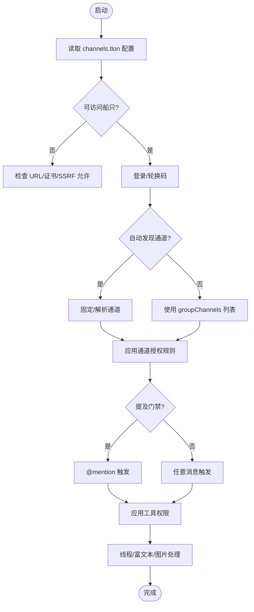
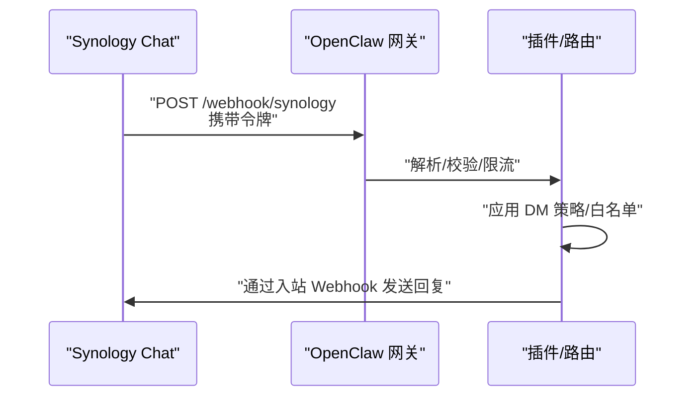
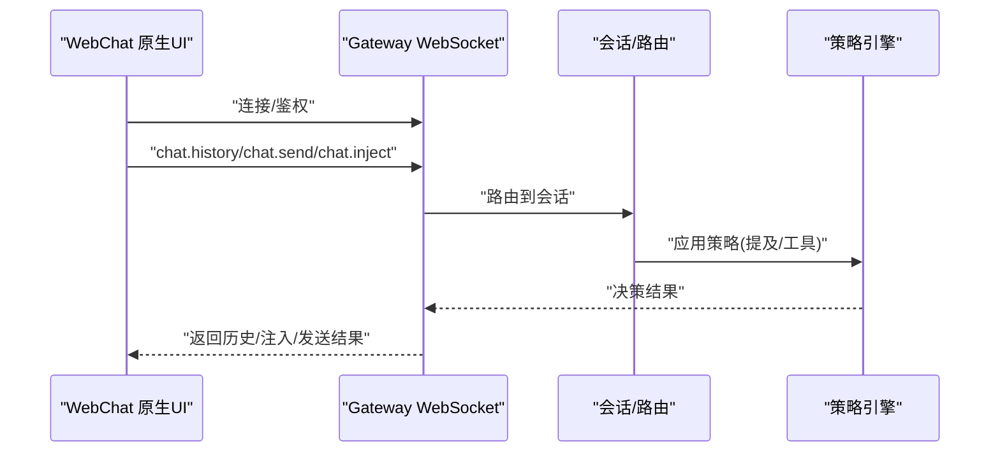
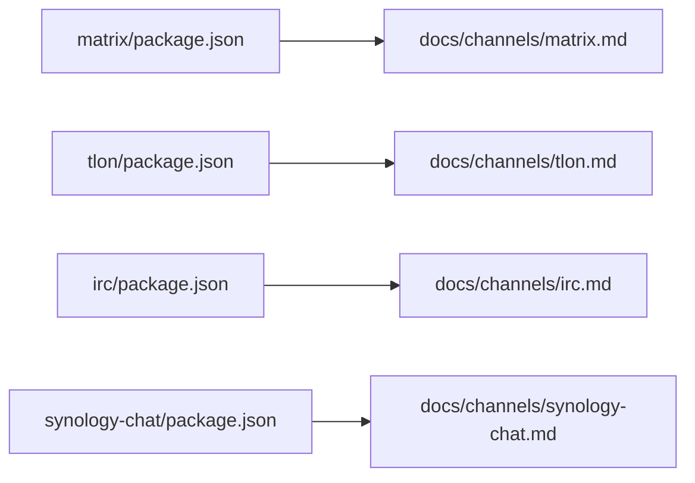

# 特殊用途平台

## 目录
1. [简介](#简介)
2. [项目结构](#项目结构)
3. [核心组件](#核心组件)
4. [架构总览](#架构总览)
5. [详细组件分析](#详细组件分析)
6. [依赖关系分析](#依赖关系分析)
7. [性能考虑](#性能考虑)
8. [故障排查指南](#故障排查指南)
9. [结论](#结论)
10. [附录](#附录)

## 简介
本文件面向需要在专业与特殊用途场景中部署即时通讯平台的技术团队与开发者，系统梳理并对比以下平台：IRC、Matrix、Tlon（Urbit）、Synology Chat、WebChat。内容涵盖技术特性、适用场景、接入复杂度、高级配置、自定义扩展与性能调优，并提供可操作的部署与维护建议。

## 项目结构
围绕“特殊用途平台”的文档与插件实现，主要分布在如下位置：
- 平台文档：docs/channels 下的各平台独立文档
- 插件元数据：extensions/*/package.json 中声明插件 ID、安装方式与依赖
- WebChat 文档：docs/web/webchat.md 提供网关 WebSocket UI 的使用与行为说明

图表来源
- [docs/channels/irc.md](file://docs/channels/irc.md#L1-L242)
- [docs/channels/matrix.md](file://docs/channels/matrix.md#L1-L304)
- [docs/channels/tlon.md](file://docs/channels/tlon.md#L1-L277)
- [docs/channels/synology-chat.md](file://docs/channels/synology-chat.md#L1-L129)
- [docs/web/webchat.md](file://docs/web/webchat.md#L1-L62)
- [extensions/irc/package.json](file://extensions/irc/package.json#L1-L15)
- [extensions/matrix/package.json](file://extensions/matrix/package.json#L1-L42)
- [extensions/tlon/package.json](file://extensions/tlon/package.json#L1-L40)
- [extensions/synology-chat/package.json](file://extensions/synology-chat/package.json#L1-L29)

章节来源
- [docs/channels/irc.md](file://docs/channels/irc.md#L1-L242)
- [docs/channels/matrix.md](file://docs/channels/matrix.md#L1-L304)
- [docs/channels/tlon.md](file://docs/channels/tlon.md#L1-L277)
- [docs/channels/synology-chat.md](file://docs/channels/synology-chat.md#L1-L129)
- [docs/web/webchat.md](file://docs/web/webchat.md#L1-L62)
- [extensions/irc/package.json](file://extensions/irc/package.json#L1-L15)
- [extensions/matrix/package.json](file://extensions/matrix/package.json#L1-L42)
- [extensions/tlon/package.json](file://extensions/tlon/package.json#L1-L40)
- [extensions/synology-chat/package.json](file://extensions/synology-chat/package.json#L1-L29)

## 核心组件
- IRC 插件：作为扩展插件，通过 channels.irc 配置连接任意 IRC 服务器，支持 TLS、NickServ 认证、提及门禁、通道与发送者白名单、工具权限分层等。
- Matrix 插件：以用户身份接入任意 Homeserver，支持 DM、房间、线程、媒体、反应、投票、位置、端到端加密（需安装加密模块），多账号管理，路由模型清晰。
- Tlon 插件：对接 Urbit 的 Tlon 客户端，支持 DM、群组提及回复、线程、富文本转换、图片上传，具备所有者审批流与自动接受邀请等安全控制。
- Synology Chat 插件：基于 Webhook 的 DM 渠道，支持出站/入站 Webhook、令牌校验、速率限制、多账号、用户 ID 白名单等。
- WebChat：macOS/iOS 原生聊天 UI 通过网关 WebSocket 与后端交互，遵循统一会话与路由规则，支持注入消息、历史拉取与远程隧道。

章节来源
- [docs/channels/irc.md](file://docs/channels/irc.md#L10-L127)
- [docs/channels/matrix.md](file://docs/channels/matrix.md#L8-L171)
- [docs/channels/tlon.md](file://docs/channels/tlon.md#L8-L196)
- [docs/channels/synology-chat.md](file://docs/channels/synology-chat.md#L9-L121)
- [docs/web/webchat.md](file://docs/web/webchat.md#L8-L61)

## 架构总览
下图展示 OpenClaw 与各平台的交互关系：平台侧通过各自协议/接口（IRC/TLS、Matrix/Homeserver、Tlon/Urbit、Synology Chat/Webhook、WebChat/WS）接入；OpenClaw 在网关侧统一进行认证、路由、会话管理与策略执行。

图表来源
- [docs/channels/irc.md](file://docs/channels/irc.md#L10-L44)
- [docs/channels/matrix.md](file://docs/channels/matrix.md#L10-L137)
- [docs/channels/tlon.md](file://docs/channels/tlon.md#L10-L164)
- [docs/channels/synology-chat.md](file://docs/channels/synology-chat.md#L11-L77)
- [docs/web/webchat.md](file://docs/web/webchat.md#L10-L32)

## 详细组件分析

### IRC 组件分析
- 技术特点
  - 支持 TLS 连接与 NickServ 登录/注册
  - 通道与 DM 分别的访问控制策略
  - 提及门禁默认开启，可通过 requireMention 关闭
  - 工具权限按通道与发送者分层（toolsBySender）
- 适用场景
  - 开放社区频道与私有 IRC 网络
  - 需要稳定提及触发与细粒度权限控制的运维/开发协作
- 集成复杂度
  - 中等：需配置服务器、端口、TLS、昵称、初始频道列表
  - 高级：提及门禁、通道白名单、发送者白名单、工具权限矩阵
- 配置要点
  - channels.irc.host/port/tls/nick/channels
  - dmPolicy/groupPolicy/requireMention/allowFrom/groupAllowFrom
  - nickserv.enable/register/registerEmail
  - 环境变量覆盖（IRC_*）

图表来源
- [docs/channels/irc.md](file://docs/channels/irc.md#L18-L126)

章节来源
- [docs/channels/irc.md](file://docs/channels/irc.md#L10-L242)
- [extensions/irc/package.json](file://extensions/irc/package.json#L1-L15)

### Matrix 组件分析
- 技术特点
  - 用户态接入任意 Homeserver，支持 DM/房间/线程/媒体/反应/投票/位置/原生命令
  - E2EE 可选，依赖加密模块；首次连接请求设备验证
  - 多账号并行启动，账户级凭据与策略隔离
  - 房间自动加入与白名单控制
- 适用场景
  - 去中心化、隐私优先的企业/社区协作
  - 需要端到端加密与丰富多媒体能力的组织
- 集成复杂度
  - 中高：需准备 Homeserver、访问令牌或用户名+密码；可选 E2EE 与加密模块
  - 高级：多账号、线程回复模式、回复目标模式、媒体大小限制、自动加入白名单
- 配置要点
  - homeserver、accessToken 或 userId+password
  - dm.policy、groupPolicy、groupAllowFrom、groups.*
  - encryption、threadReplies、replyToMode、mediaMaxMb、autoJoin/autoJoinAllowlist
  - accounts.* 覆盖顶层设置

图表来源
- [docs/channels/matrix.md](file://docs/channels/matrix.md#L40-L137)

章节来源
- [docs/channels/matrix.md](file://docs/channels/matrix.md#L1-L304)
- [extensions/matrix/package.json](file://extensions/matrix/package.json#L1-L42)

### Tlon 组件分析
- 技术特点
  - 直连 Urbit 船只，支持 DM、群组提及回复、线程、富文本转换、图片上传
  - 默认提及门禁，群组授权可按通道细化
  - 所有者审批系统：所有者自动授权，未授权来源触发通知
  - 自动接受 DM/群组邀请可选
- 适用场景
  - 去中心化社交/协作网络（Urbit 生态）
  - 强隐私、强所有权的组织或社区
- 集成复杂度
  - 中：需获取船名、URL、登录码；可选允许内网（SSRF 风险）
  - 高级：通道自动发现/固定、通道授权规则、所有者审批、自动接受邀请
- 配置要点
  - ship/url/code/allowPrivateNetwork
  - dmAllowlist、autoAcceptDmInvites、autoAcceptGroupInvites
  - autoDiscoverChannels、groupChannels、defaultAuthorizedShips、authorization.channelRules
  - ownerShip 用于审批流

图表来源
- [docs/channels/tlon.md](file://docs/channels/tlon.md#L35-L196)

章节来源
- [docs/channels/tlon.md](file://docs/channels/tlon.md#L1-L277)
- [extensions/tlon/package.json](file://extensions/tlon/package.json#L1-L40)

### Synology Chat 组件分析
- 技术特点
  - 基于 Webhook 的 DM 渠道：入站通过外部 Webhook，出站通过内部 Webhook
  - 出站令牌校验与每用户速率限制
  - 多账号支持，每账号可独立令牌、入站 URL、路径与 DM 策略
  - 数字用户 ID 作为目标标识
- 适用场景
  - 使用 Synology NAS 的企业/家庭内部协作
  - 需要与现有 NAS 生态集成的自动化场景
- 集成复杂度
  - 低到中：NAS 端创建入/出站 Webhook，配置令牌与路径；OpenClaw 端配置 token/incomingUrl/webhookPath/dmPolicy/allowedUserIds
  - 高级：多账号、速率限制、SSL 安全选项
- 配置要点
  - token、incomingUrl、webhookPath、dmPolicy、allowedUserIds、rateLimitPerMinute、allowInsecureSsl
  - accounts.* 覆盖顶层设置

图表来源
- [docs/channels/synology-chat.md](file://docs/channels/synology-chat.md#L27-L98)

章节来源
- [docs/channels/synology-chat.md](file://docs/channels/synology-chat.md#L1-L129)
- [extensions/synology-chat/package.json](file://extensions/synology-chat/package.json#L1-L29)

### WebChat 组件分析
- 技术特点
  - 原生 UI 直连网关 WebSocket，复用统一会话与路由规则
  - 历史拉取受稳定性约束（截断/省略/替换占位）
  - 支持 chat.inject 注入助手备注，支持远程隧道
  - 控制 UI 的工具目录动态获取，遵循策略优先级
- 适用场景
  - 开发调试、本地联调、远程运维
- 配置要点
  - 网关端：gateway.port/bind、gateway.auth.*、gateway.remote.*
  - 会话：session.*

图表来源
- [docs/web/webchat.md](file://docs/web/webchat.md#L18-L61)

章节来源
- [docs/web/webchat.md](file://docs/web/webchat.md#L1-L62)

## 依赖关系分析
- 插件元数据
  - IRC/MATRIX/TLON/SYNOCHE 插件均通过 openclaw.openclaw.channel 字段声明渠道 ID、标签、文档路径与安装方式
  - Matrix 与 Tlon 显式声明了根依赖镜像白名单，确保发布一致性
- 文档与插件映射
  - 各平台文档与对应 package.json 的 docsPath 对齐，便于从 UI 快速跳转

图表来源
- [extensions/matrix/package.json](file://extensions/matrix/package.json#L14-L41)
- [extensions/tlon/package.json](file://extensions/tlon/package.json#L12-L39)
- [extensions/irc/package.json](file://extensions/irc/package.json#L9-L14)
- [extensions/synology-chat/package.json](file://extensions/synology-chat/package.json#L9-L28)

章节来源
- [extensions/matrix/package.json](file://extensions/matrix/package.json#L1-L42)
- [extensions/tlon/package.json](file://extensions/tlon/package.json#L1-L40)
- [extensions/irc/package.json](file://extensions/irc/package.json#L1-L15)
- [extensions/synology-chat/package.json](file://extensions/synology-chat/package.json#L1-L29)

## 性能考虑
- IRC
  - 合理设置 channels.irc.channels 初始列表，避免过多 JOIN 导致瞬时压力
  - 在公共频道关闭 requireMention 可减少消息过滤成本，但需配合工具权限收紧
- Matrix
  - E2EE 首次连接与验证会增加启动开销；加密模块缺失会导致降级与日志警告
  - 合理设置 initialSyncLimit、mediaMaxMb 与 chunkMode，平衡吞吐与稳定性
  - 多账号串行启动避免并发模块导入竞争
- Tlon
  - 自动发现通道可能带来额外同步开销；必要时固定 groupChannels
  - 富文本转换与图片上传会增加 CPU/IO；建议在高并发场景限制媒体尺寸
- Synology Chat
  - 出站 Webhook 与入站令牌校验存在网络往返；合理设置 rateLimitPerMinute
  - allowInsecureSsl 仅在确信证书可信时开启，避免额外握手开销
- WebChat
  - chat.history 有截断策略；对长文本与重元数据场景建议分页或裁剪
  - 远程隧道（SSH/Tailscale）会引入链路延迟，应结合网关资源评估并发

## 故障排查指南
- 通用步骤
  - 检查状态与日志：status、gateway status、logs --follow、doctor、channels status --probe
  - 针对平台的常见问题
    - IRC：确认 channels.irc.groups 与提及门禁；核对 TLS 证书与主机/端口
    - Matrix：确认加密模块可用性与设备验证；核对 homeserver 与访问令牌
    - Tlon：确认 ship URL 可达；如为内网需 allowPrivateNetwork；核对登录码轮换
    - Synology Chat：核对 token、incomingUrl、webhookPath；检查 DM 策略与用户白名单
- 平台专用命令
  - Matrix：pairing list matrix
  - Synology Chat：pairing list synology-chat

章节来源
- [docs/channels/irc.md](file://docs/channels/irc.md#L237-L242)
- [docs/channels/matrix.md](file://docs/channels/matrix.md#L248-L272)
- [docs/channels/tlon.md](file://docs/channels/tlon.md#L232-L249)
- [docs/channels/synology-chat.md](file://docs/channels/synology-chat.md#L123-L129)

## 结论
- IRC 适合传统 IRC 场景与强调提及门禁的协作；配置灵活但需注意提及与工具权限的组合
- Matrix 适合去中心化与隐私优先的组织；E2EE 与多账号能力较强，但需关注加密模块与同步策略
- Tlon 适合 Urbit 生态内的去中心化协作；富文本与图片能力完善，授权与审批机制明确
- Synology Chat 适合与 NAS 生态深度集成的内部场景；Webhook 方案简单可靠，注意令牌与速率限制
- WebChat 为开发者与运维提供了统一的本地/远程调试界面，与网关策略保持一致

## 附录
- 部署与维护建议
  - 采用最小权限原则：先以 allowlist/open disabled 策略上线，逐步放开
  - 为每个平台单独维护凭证与策略，避免跨平台混淆
  - 对高风险工具（fs/runtime/gateway/nodes/cron/browser）在公共频道默认拒绝
  - 定期轮换令牌与登录码，监控日志中的认证与授权失败
  - 在生产环境启用 TLS/E2EE，严格控制内网暴露范围
  - 使用多账号隔离不同业务域（如告警、助手、通知），并分别配置 autoJoin 与线程策略