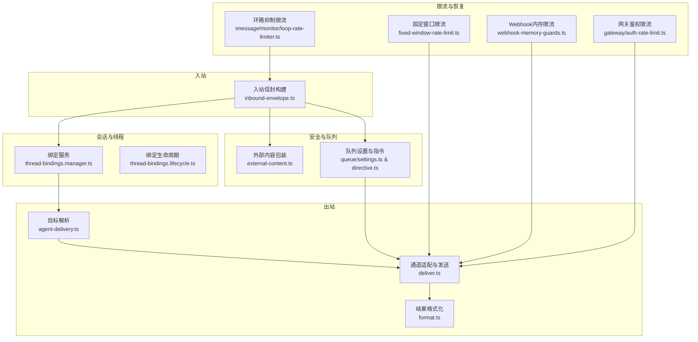
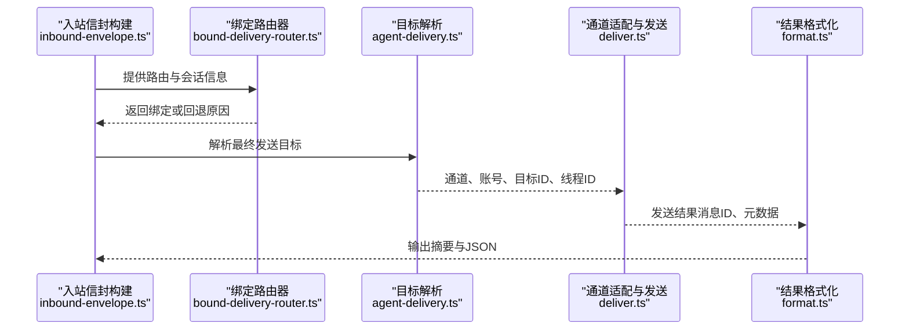
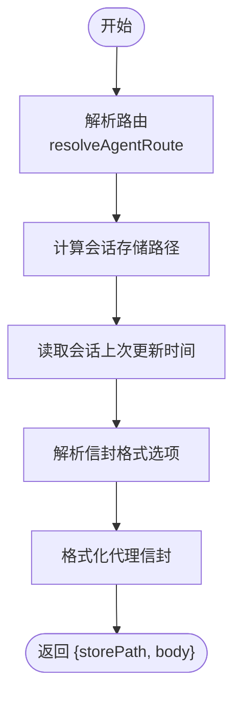
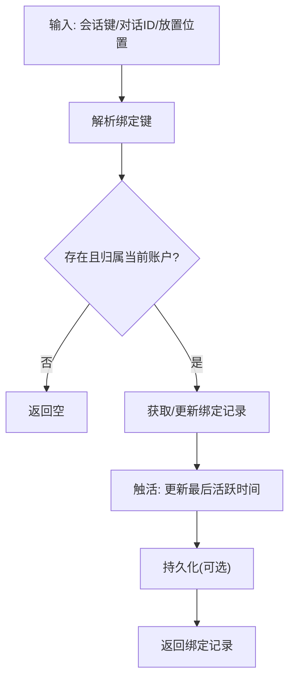
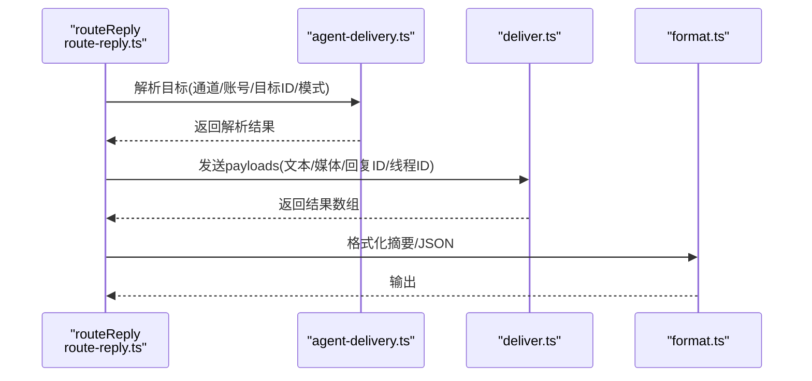
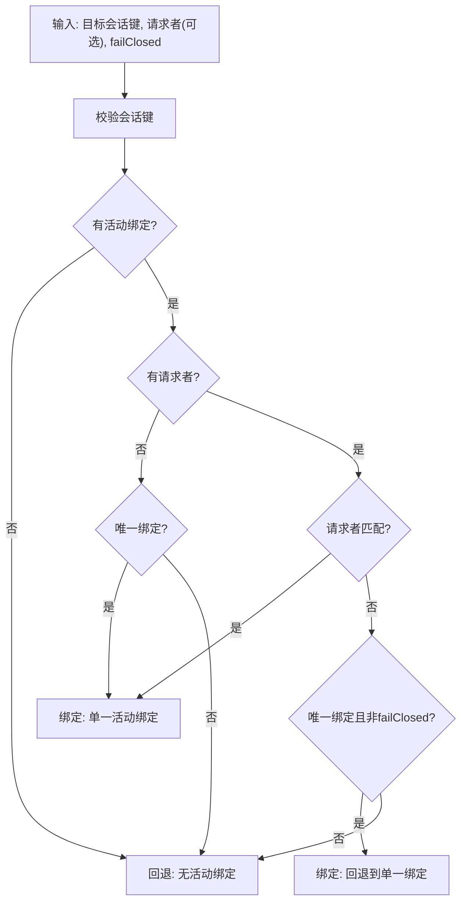
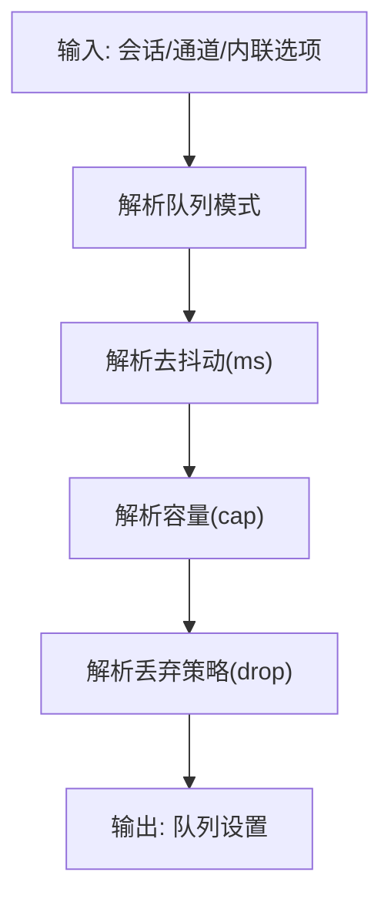
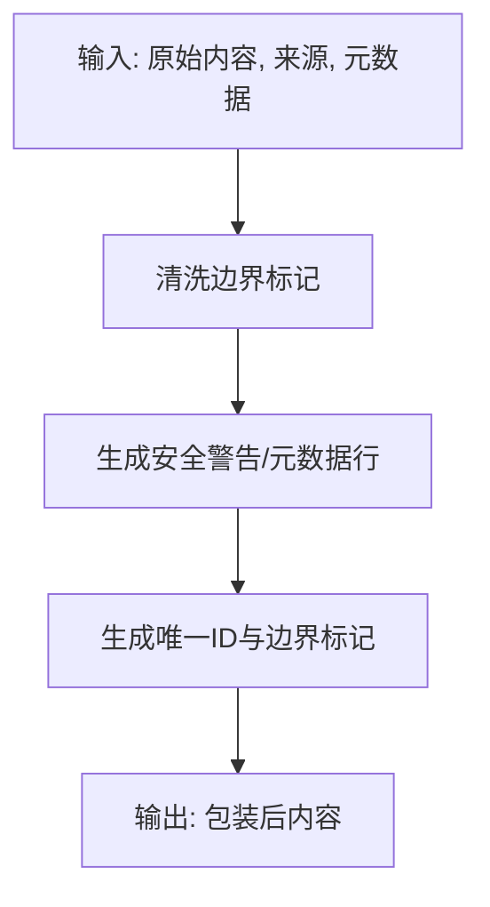
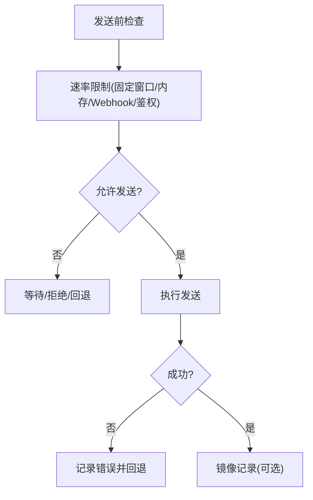
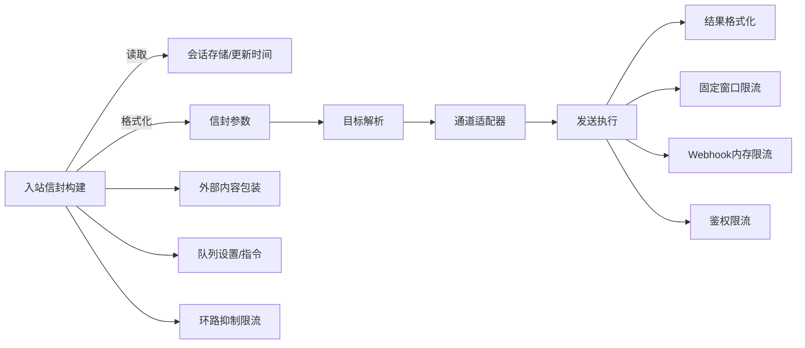

# 消息路由和处理

## 目录
1. [简介](#简介)
2. [项目结构](#项目结构)
3. [核心组件](#核心组件)
4. [架构总览](#架构总览)
5. [详细组件分析](#详细组件分析)
6. [依赖关系分析](#依赖关系分析)
7. [性能考量](#性能考量)
8. [故障排除指南](#故障排除指南)
9. [结论](#结论)
10. [附录](#附录)

## 简介
本文件面向OpenClaw的消息路由与处理机制，系统性阐述入站消息解析、出站消息发送、消息路由策略、会话管理、目标解析、线程绑定、去抖动策略、跨通道转发规则、优先级与负载均衡、格式转换与内容过滤、安全检查与错误恢复，以及性能优化与监控指标建议。文档以代码为依据，辅以图示帮助理解。

## 项目结构
OpenClaw围绕“入站信封构建”“会话与线程绑定”“出站路由与发送”三大主线组织消息处理流水线，并通过插件化适配多通道（Discord、Telegram、Slack等）。关键模块包括：
- 入站：信封构建与路由解析
- 会话与线程：绑定服务与生命周期管理
- 出站：目标解析、通道适配器、分块与发送、结果格式化
- 安全：外部内容包装与标记清理
- 队列与限流：去抖动、容量控制、丢弃策略、速率限制
- 错误恢复：回退策略、镜像记录、失败报告

**图表来源**
- [src/plugin-sdk/inbound-envelope.ts](file://src/plugin-sdk/inbound-envelope.ts#L1-L143)
- [src/discord/monitor/thread-bindings.manager.ts](file://src/discord/monitor/thread-bindings.manager.ts#L161-L639)
- [src/discord/monitor/thread-bindings.lifecycle.ts](file://src/discord/monitor/thread-bindings.lifecycle.ts#L237-L272)
- [src/infra/outbound/agent-delivery.ts](file://src/infra/outbound/agent-delivery.ts#L139-L179)
- [src/infra/outbound/deliver.ts](file://src/infra/outbound/deliver.ts#L94-L568)
- [src/infra/outbound/format.ts](file://src/infra/outbound/format.ts#L44-L85)
- [src/security/external-content.ts](file://src/security/external-content.ts#L239-L346)
- [src/auto-reply/reply/queue/settings.ts](file://src/auto-reply/reply/queue/settings.ts#L32-L68)
- [src/auto-reply/reply/queue/directive.ts](file://src/auto-reply/reply/queue/directive.ts#L1-L122)
- [src/infra/fixed-window-rate-limit.ts](file://src/infra/fixed-window-rate-limit.ts#L1-L48)
- [src/plugin-sdk/webhook-memory-guards.ts](file://src/plugin-sdk/webhook-memory-guards.ts#L51-L92)
- [src/gateway/auth-rate-limit.ts](file://src/gateway/auth-rate-limit.ts#L115-L167)
- [src/imessage/monitor/loop-rate-limiter.ts](file://src/imessage/monitor/loop-rate-limiter.ts#L1-L44)

**章节来源**
- [src/plugin-sdk/inbound-envelope.ts](file://src/plugin-sdk/inbound-envelope.ts#L1-L143)
- [src/discord/monitor/thread-bindings.manager.ts](file://src/discord/monitor/thread-bindings.manager.ts#L161-L639)
- [src/infra/outbound/deliver.ts](file://src/infra/outbound/deliver.ts#L94-L568)

## 核心组件
- 入站信封构建：将原始消息封装为代理可消费的载体，注入会话时间戳、通道元数据与格式化选项。
- 绑定路由器：根据目标会话键与请求者上下文选择最佳绑定，支持严格匹配与回退模式。
- 出站发送：按通道适配器执行文本/媒体分块、并发与重试、镜像记录与结果汇总。
- 外部内容安全：对外部来源内容进行边界包装、标记清理与可疑模式检测。
- 队列与去抖动：基于配置与会话粒度的去抖动、容量与丢弃策略。
- 限流与恢复：固定窗口、Webhook内存、鉴权限流与环路抑制，保障稳定性与防滥用。
- 结果格式化：统一输出发送摘要与JSON元数据，便于监控与排障。

**章节来源**
- [src/infra/outbound/bound-delivery-router.ts](file://src/infra/outbound/bound-delivery-router.ts#L55-L132)
- [src/auto-reply/reply/route-reply.ts](file://src/auto-reply/reply/route-reply.ts#L72-L176)
- [src/security/external-content.ts](file://src/security/external-content.ts#L239-L346)
- [src/auto-reply/reply/queue/settings.ts](file://src/auto-reply/reply/queue/settings.ts#L32-L68)

## 架构总览
下图展示从入站到出站的关键交互路径与职责划分。

**图表来源**
- [src/plugin-sdk/inbound-envelope.ts](file://src/plugin-sdk/inbound-envelope.ts#L57-L93)
- [src/infra/outbound/bound-delivery-router.ts](file://src/infra/outbound/bound-delivery-router.ts#L55-L132)
- [src/infra/outbound/agent-delivery.ts](file://src/infra/outbound/agent-delivery.ts#L139-L179)
- [src/infra/outbound/deliver.ts](file://src/infra/outbound/deliver.ts#L531-L568)
- [src/infra/outbound/format.ts](file://src/infra/outbound/format.ts#L44-L85)

## 详细组件分析

### 入站消息解析与信封构建
- 路由解析：根据配置、通道、账户与对端标识解析目标代理与会话键。
- 会话时间戳：读取会话更新时间，用于时间相关语义与排序。
- 格式化选项：按通道与配置生成代理可识别的信封参数。
- 信封生成：将原始消息体与上下文拼装为最终入站载体。

**图表来源**
- [src/plugin-sdk/inbound-envelope.ts](file://src/plugin-sdk/inbound-envelope.ts#L27-L55)

**章节来源**
- [src/plugin-sdk/inbound-envelope.ts](file://src/plugin-sdk/inbound-envelope.ts#L27-L55)

### 会话管理与线程绑定
- 绑定管理器：按账户维度维护线程绑定表，支持查询、触活、解绑、持久化。
- 生命周期：空闲超时、最大存活时间、定期清扫；支持动态调整超时。
- 绑定创建：根据目标会话键、线程/频道ID、放置位置（父/子）创建绑定并生成介绍文本。
- 触活与解绑：按绑定ID或会话键批量触活或解绑，支持带原因标记。

**图表来源**
- [src/discord/monitor/thread-bindings.manager.ts](file://src/discord/monitor/thread-bindings.manager.ts#L195-L239)
- [src/discord/monitor/thread-bindings.lifecycle.ts](file://src/discord/monitor/thread-bindings.lifecycle.ts#L243-L272)

**章节来源**
- [src/discord/monitor/thread-bindings.manager.ts](file://src/discord/monitor/thread-bindings.manager.ts#L161-L639)
- [src/discord/monitor/thread-bindings.lifecycle.ts](file://src/discord/monitor/thread-bindings.lifecycle.ts#L237-L272)
- [src/auto-reply/reply/commands-subagents/action-focus.ts](file://src/auto-reply/reply/commands-subagents/action-focus.ts#L137-L184)

### 出站消息发送机制
- 目标解析：根据通道、账号、显式目标与模式（显式/隐式）解析最终发送目标。
- 通道适配：按通道加载适配器，确定分块策略、文本限制、是否支持媒体。
- 分块与发送：按通道能力拆分文本/Markdown，分别发送文本与媒体，支持回复ID与线程ID。
- 结果汇总：收集每步发送结果，生成摘要与JSON元数据。

**图表来源**
- [src/auto-reply/reply/route-reply.ts](file://src/auto-reply/reply/route-reply.ts#L72-L176)
- [src/infra/outbound/agent-delivery.ts](file://src/infra/outbound/agent-delivery.ts#L139-L179)
- [src/infra/outbound/deliver.ts](file://src/infra/outbound/deliver.ts#L531-L568)
- [src/infra/outbound/format.ts](file://src/infra/outbound/format.ts#L44-L85)

**章节来源**
- [src/auto-reply/reply/route-reply.ts](file://src/auto-reply/reply/route-reply.ts#L72-L176)
- [src/infra/outbound/agent-delivery.ts](file://src/infra/outbound/agent-delivery.ts#L139-L179)
- [src/infra/outbound/deliver.ts](file://src/infra/outbound/deliver.ts#L94-L568)
- [src/infra/outbound/format.ts](file://src/infra/outbound/format.ts#L44-L85)

### 消息路由策略与目的地选择
- 绑定路由器：优先严格匹配请求者（通道+账号+对话），否则单绑定回退，多绑定则回退。
- 内部通道处理：内部消息通道（如Webchat）在特定场景下需要特殊处理或回退。
- 插件注册：出站通道通过插件注册解析，确保适配器可用。

**图表来源**
- [src/infra/outbound/bound-delivery-router.ts](file://src/infra/outbound/bound-delivery-router.ts#L55-L132)

**章节来源**
- [src/infra/outbound/bound-delivery-router.ts](file://src/infra/outbound/bound-delivery-router.ts#L55-L132)
- [src/commands/agent/delivery.ts](file://src/commands/agent/delivery.ts#L96-L117)

### 去抖动与队列策略
- 配置解析：按会话、通道、插件与全局配置解析队列模式、去抖动、容量与丢弃策略。
- 指令解析：支持在指令中覆盖去抖动、容量与丢弃策略。
- 默认值与归一化：对数值进行裁剪与默认化，保证健壮性。

**图表来源**
- [src/auto-reply/reply/queue/settings.ts](file://src/auto-reply/reply/queue/settings.ts#L32-L68)
- [src/auto-reply/reply/queue/directive.ts](file://src/auto-reply/reply/queue/directive.ts#L1-L122)

**章节来源**
- [src/auto-reply/reply/queue/settings.ts](file://src/auto-reply/reply/queue/settings.ts#L32-L68)
- [src/auto-reply/reply/queue/directive.ts](file://src/auto-reply/reply/queue/directive.ts#L1-L122)

### 消息格式转换与内容过滤
- 外部内容包装：为邮件、Webhook、Web搜索/抓取等来源内容添加安全边界与警告，防止提示注入。
- 标记清理：对伪造边界标记进行清洗，避免被LLM信任。
- 可疑模式检测：检测多种提示注入特征，用于监控与审计。
- Prompt构建：组合上下文与包装后的内容，形成安全提示。

**图表来源**
- [src/security/external-content.ts](file://src/security/external-content.ts#L239-L346)

**章节来源**
- [src/security/external-content.ts](file://src/security/external-content.ts#L1-L346)

### 安全检查与错误恢复
- 速率限制：固定窗口限流、Webhook内存限流、鉴权限流、环路抑制限流，防止滥用与放大效应。
- 错误恢复：出站失败返回错误信息；内部通道路由受限；镜像记录可选开启，便于回溯。

**图表来源**
- [src/infra/fixed-window-rate-limit.ts](file://src/infra/fixed-window-rate-limit.ts#L1-L48)
- [src/plugin-sdk/webhook-memory-guards.ts](file://src/plugin-sdk/webhook-memory-guards.ts#L51-L92)
- [src/gateway/auth-rate-limit.ts](file://src/gateway/auth-rate-limit.ts#L115-L167)
- [src/imessage/monitor/loop-rate-limiter.ts](file://src/imessage/monitor/loop-rate-limiter.ts#L1-L44)
- [src/auto-reply/reply/route-reply.ts](file://src/auto-reply/reply/route-reply.ts#L169-L176)

**章节来源**
- [src/infra/fixed-window-rate-limit.ts](file://src/infra/fixed-window-rate-limit.ts#L1-L48)
- [src/plugin-sdk/webhook-memory-guards.ts](file://src/plugin-sdk/webhook-memory-guards.ts#L51-L92)
- [src/gateway/auth-rate-limit.ts](file://src/gateway/auth-rate-limit.ts#L115-L167)
- [src/imessage/monitor/loop-rate-limiter.ts](file://src/imessage/monitor/loop-rate-limiter.ts#L1-L44)
- [src/auto-reply/reply/route-reply.ts](file://src/auto-reply/reply/route-reply.ts#L169-L176)

## 依赖关系分析
- 入站依赖：会话存储路径解析、会话更新时间读取、信封格式化函数。
- 出站依赖：通道适配器加载、目标解析、分块策略、镜像记录。
- 安全依赖：外部内容包装器、可疑模式检测、边界标记清洗。
- 限流依赖：固定窗口、内存键空间、鉴权作用域、环路窗口。

**图表来源**
- [src/plugin-sdk/inbound-envelope.ts](file://src/plugin-sdk/inbound-envelope.ts#L27-L55)
- [src/infra/outbound/agent-delivery.ts](file://src/infra/outbound/agent-delivery.ts#L139-L179)
- [src/infra/outbound/deliver.ts](file://src/infra/outbound/deliver.ts#L94-L568)
- [src/infra/outbound/format.ts](file://src/infra/outbound/format.ts#L44-L85)
- [src/security/external-content.ts](file://src/security/external-content.ts#L239-L346)
- [src/auto-reply/reply/queue/settings.ts](file://src/auto-reply/reply/queue/settings.ts#L32-L68)
- [src/infra/fixed-window-rate-limit.ts](file://src/infra/fixed-window-rate-limit.ts#L1-L48)
- [src/plugin-sdk/webhook-memory-guards.ts](file://src/plugin-sdk/webhook-memory-guards.ts#L51-L92)
- [src/gateway/auth-rate-limit.ts](file://src/gateway/auth-rate-limit.ts#L115-L167)
- [src/imessage/monitor/loop-rate-limiter.ts](file://src/imessage/monitor/loop-rate-limiter.ts#L1-L44)

**章节来源**
- [src/plugin-sdk/inbound-envelope.ts](file://src/plugin-sdk/inbound-envelope.ts#L27-L55)
- [src/infra/outbound/agent-delivery.ts](file://src/infra/outbound/agent-delivery.ts#L139-L179)
- [src/infra/outbound/deliver.ts](file://src/infra/outbound/deliver.ts#L94-L568)
- [src/infra/outbound/format.ts](file://src/infra/outbound/format.ts#L44-L85)
- [src/security/external-content.ts](file://src/security/external-content.ts#L239-L346)
- [src/auto-reply/reply/queue/settings.ts](file://src/auto-reply/reply/queue/settings.ts#L32-L68)
- [src/infra/fixed-window-rate-limit.ts](file://src/infra/fixed-window-rate-limit.ts#L1-L48)
- [src/plugin-sdk/webhook-memory-guards.ts](file://src/plugin-sdk/webhook-memory-guards.ts#L51-L92)
- [src/gateway/auth-rate-limit.ts](file://src/gateway/auth-rate-limit.ts#L115-L167)
- [src/imessage/monitor/loop-rate-limiter.ts](file://src/imessage/monitor/loop-rate-limiter.ts#L1-L44)

## 性能考量
- 分块与并发：按通道能力与限制进行文本/Markdown分块，减少单次发送失败影响范围。
- 镜像记录：在会话中镜像发送内容，便于回放与审计，但需评估磁盘与写入开销。
- 限流策略：合理设置固定窗口与内存限流阈值，避免突发流量导致拥塞。
- 去抖动与容量：适度的去抖动与容量上限可降低重复与放大风险，提升吞吐稳定性。
- 监控指标建议：
  - 发送成功率、平均/95分位耗时、失败率与错误类型分布
  - 限流触发次数与重试比例
  - 队列长度、去抖动触发次数、容量溢出与丢弃数量
  - 外部内容可疑模式检测次数与命中率
  - 绑定触活频率与过期回收率

[本节为通用性能指导，不直接分析具体文件]

## 故障排除指南
- 出站失败：检查通道适配器是否加载、目标解析是否正确、镜像记录是否启用、错误信息是否包含通道/账号/目标ID。
- 绑定异常：确认会话键有效、请求者匹配、绑定状态为激活、未过期；必要时手动解绑或调整超时。
- 去抖动与队列：核对队列模式、去抖动、容量与丢弃策略配置，避免因过短去抖动导致延迟放大。
- 外部内容：若出现提示注入迹象，确认包装与边界标记清洗逻辑生效，可疑模式检测日志是否命中。
- 限流问题：检查固定窗口、内存限流、鉴权限流与环路抑制配置，避免误伤正常流量。

**章节来源**
- [src/auto-reply/reply/route-reply.ts](file://src/auto-reply/reply/route-reply.ts#L169-L176)
- [src/discord/monitor/thread-bindings.manager.ts](file://src/discord/monitor/thread-bindings.manager.ts#L593-L639)
- [src/auto-reply/reply/queue/settings.ts](file://src/auto-reply/reply/queue/settings.ts#L32-L68)
- [src/security/external-content.ts](file://src/security/external-content.ts#L37-L45)
- [src/infra/fixed-window-rate-limit.ts](file://src/infra/fixed-window-rate-limit.ts#L23-L47)

## 结论
OpenClaw通过“入站信封构建—会话与线程绑定—出站目标解析—通道适配发送—结果格式化”的闭环，实现了跨通道、多会话、高安全性的消息路由与处理。结合去抖动、队列策略、多维限流与安全包装，系统在复杂场景下保持稳定与可控。建议在生产环境中持续监控关键指标，动态调优限流与队列参数，并完善绑定生命周期管理与错误恢复策略。

[本节为总结性内容，不直接分析具体文件]

## 附录
- 关键流程参考路径
  - 入站信封构建：[src/plugin-sdk/inbound-envelope.ts](file://src/plugin-sdk/inbound-envelope.ts#L27-L55)
  - 绑定路由器：[src/infra/outbound/bound-delivery-router.ts](file://src/infra/outbound/bound-delivery-router.ts#L55-L132)
  - 出站发送：[src/auto-reply/reply/route-reply.ts](file://src/auto-reply/reply/route-reply.ts#L72-L176)
  - 目标解析：[src/infra/outbound/agent-delivery.ts](file://src/infra/outbound/agent-delivery.ts#L139-L179)
  - 结果格式化：[src/infra/outbound/format.ts](file://src/infra/outbound/format.ts#L44-L85)
  - 外部内容包装：[src/security/external-content.ts](file://src/security/external-content.ts#L239-L346)
  - 队列设置与指令：[src/auto-reply/reply/queue/settings.ts](file://src/auto-reply/reply/queue/settings.ts#L32-L68)、[src/auto-reply/reply/queue/directive.ts](file://src/auto-reply/reply/queue/directive.ts#L1-L122)
  - 限流与恢复：[src/infra/fixed-window-rate-limit.ts](file://src/infra/fixed-window-rate-limit.ts#L1-L48)、[src/plugin-sdk/webhook-memory-guards.ts](file://src/plugin-sdk/webhook-memory-guards.ts#L51-L92)、[src/gateway/auth-rate-limit.ts](file://src/gateway/auth-rate-limit.ts#L115-L167)、[src/imessage/monitor/loop-rate-limiter.ts](file://src/imessage/monitor/loop-rate-limiter.ts#L1-L44)

[本节为索引性内容，不直接分析具体文件]