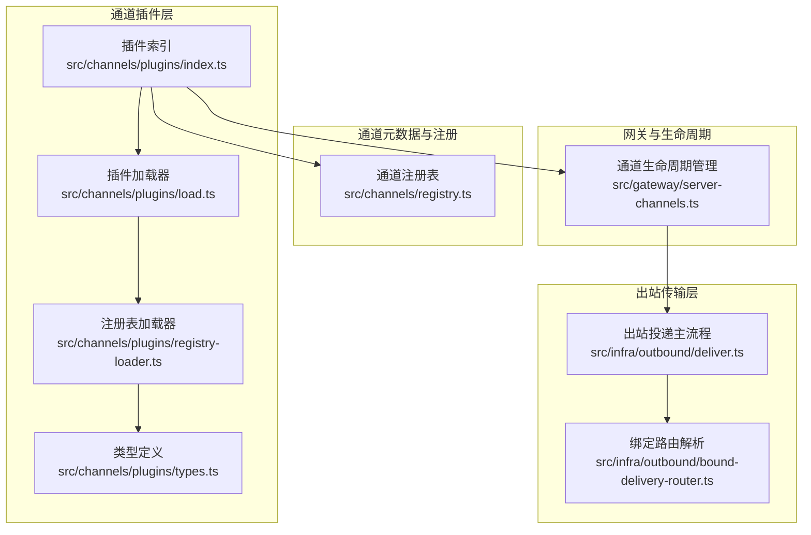
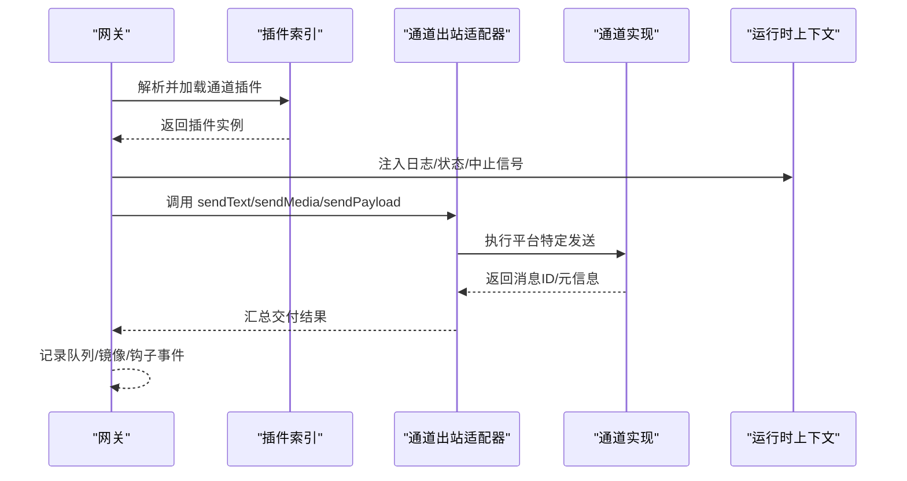
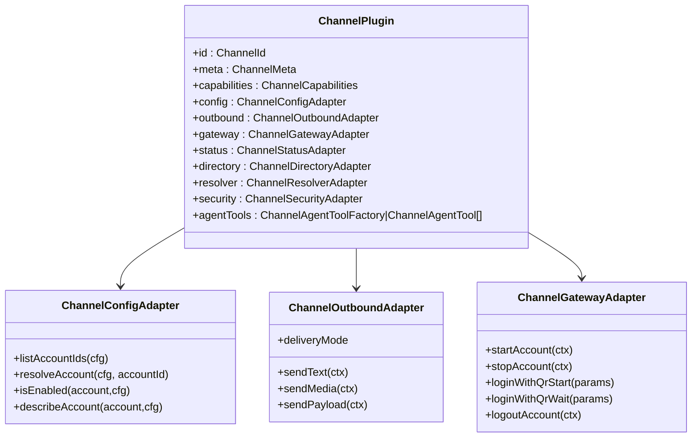
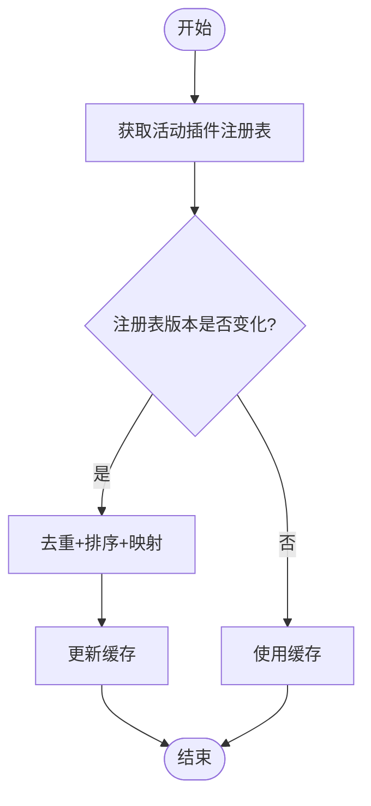
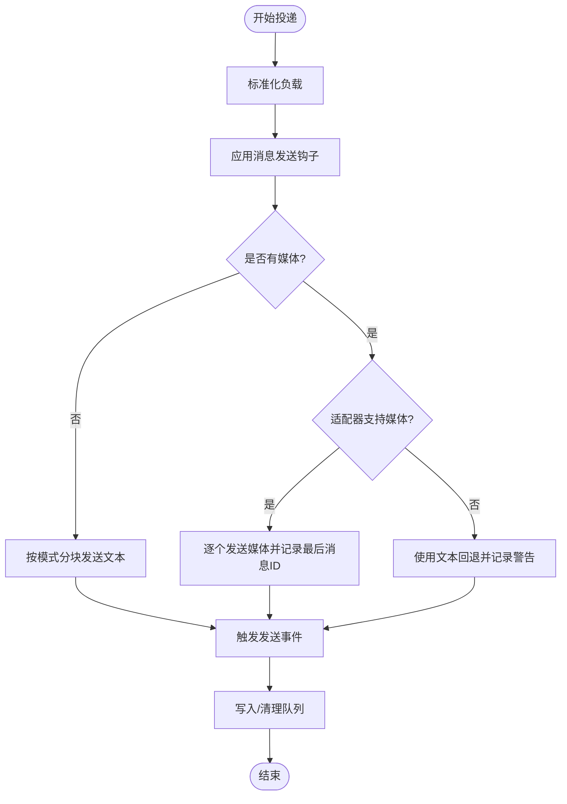
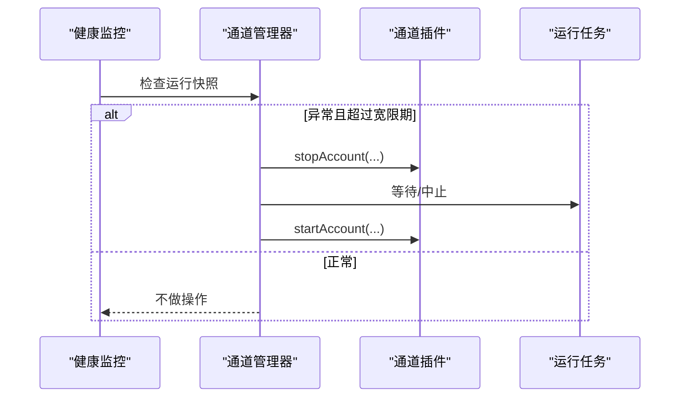
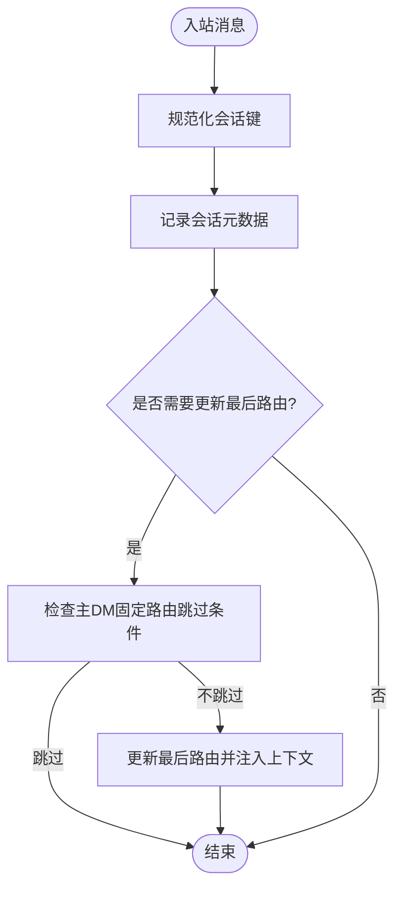
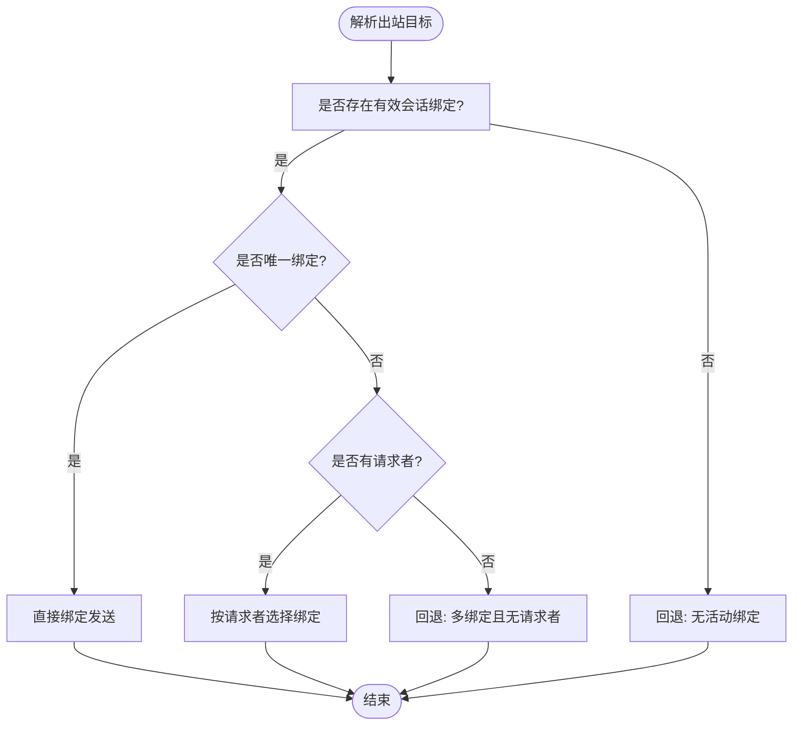
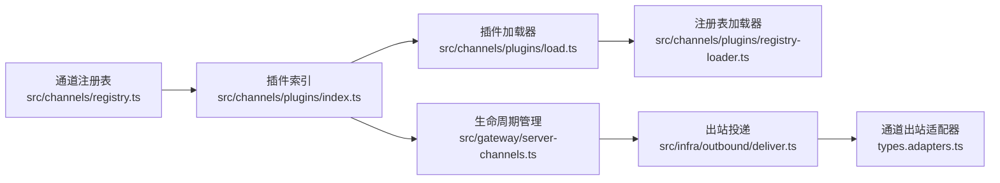

# 通道适配器架构

## 目录
1. [引言](#引言)
2. [项目结构](#项目结构)
3. [核心组件](#核心组件)
4. [架构总览](#架构总览)
5. [详细组件分析](#详细组件分析)
6. [依赖关系分析](#依赖关系分析)
7. [性能考量](#性能考量)
8. [故障排查指南](#故障排查指南)
9. [结论](#结论)
10. [附录：通道适配器开发指南](#附录通道适配器开发指南)

## 引言
本文件系统性阐述 OpenClaw 通道适配器架构，聚焦于统一消息处理接口、平台抽象层、适配器注册机制、通道生命周期管理、会话状态维护、消息路由策略与错误处理机制，并给出通道间消息格式标准化、认证方式统一化与 API 差异抽象化的实践路径，以及扩展新通道的开发流程与测试策略。

## 项目结构
OpenClaw 将“通道”抽象为可插拔的插件单元，通过统一的适配器接口对接不同即时通讯平台（如 Telegram、WhatsApp、Discord 等）。通道插件在运行时由插件注册表加载，通道 ID 统一归一化，消息出站通过“适配器 + 插件”的组合完成，生命周期由网关服务器集中管理。

**图表来源**
- [src/channels/plugins/index.ts](file://src/channels/plugins/index.ts#L74-L90)
- [src/channels/plugins/load.ts](file://src/channels/plugins/load.ts#L1-L8)
- [src/channels/plugins/registry-loader.ts](file://src/channels/plugins/registry-loader.ts#L1-L35)
- [src/channels/plugins/types.ts](file://src/channels/plugins/types.ts#L1-L66)
- [src/channels/registry.ts](file://src/channels/registry.ts#L135-L160)
- [src/infra/outbound/deliver.ts](file://src/infra/outbound/deliver.ts#L139-L147)
- [src/infra/outbound/bound-delivery-router.ts](file://src/infra/outbound/bound-delivery-router.ts#L55-L91)
- [src/gateway/server-channels.ts](file://src/gateway/server-channels.ts#L307-L372)

**章节来源**
- [src/channels/plugins/index.ts](file://src/channels/plugins/index.ts#L1-L118)
- [src/channels/registry.ts](file://src/channels/registry.ts#L1-L201)
- [src/infra/outbound/deliver.ts](file://src/infra/outbound/deliver.ts#L1-L829)
- [src/gateway/server-channels.ts](file://src/gateway/server-channels.ts#L307-L372)

## 核心组件
- 通道插件契约与适配器集合：定义统一的配置、认证、目录、消息发送、心跳、安全等适配器接口，确保不同平台以一致方式接入。
- 插件注册与加载：通过注册表版本缓存、按顺序排序、ID 映射，提供稳定的插件发现与加载能力。
- 出站投递管线：将多段回复负载标准化、分块、钩子拦截、媒体落盘与发送，支持最佳努力与失败重试。
- 生命周期管理：启动、停止、重启、健康监控，统一注入运行时上下文与日志句柄。
- 会话与路由：基于会话键与线程绑定，维护入站/出站路由、线程策略与会话新鲜度判定。

**章节来源**
- [src/channels/plugins/types.adapters.ts](file://src/channels/plugins/types.adapters.ts#L24-L384)
- [src/channels/plugins/types.core.ts](file://src/channels/plugins/types.core.ts#L1-L391)
- [src/channels/plugins/types.plugin.ts](file://src/channels/plugins/types.plugin.ts#L49-L86)
- [src/channels/plugins/index.ts](file://src/channels/plugins/index.ts#L42-L90)
- [src/infra/outbound/deliver.ts](file://src/infra/outbound/deliver.ts#L470-L800)
- [src/gateway/server-channels.ts](file://src/gateway/server-channels.ts#L307-L372)
- [src/channels/session.ts](file://src/channels/session.ts#L1-L82)

## 架构总览
通道适配器采用“插件 + 适配器”的双层抽象：插件负责声明能力与适配器集合；适配器定义跨平台统一接口。消息从网关进入，经会话与路由决策后，交由通道插件的出站适配器执行具体发送逻辑；生命周期由网关统一编排。

**图表来源**
- [src/gateway/server-channels.ts](file://src/gateway/server-channels.ts#L307-L372)
- [src/infra/outbound/deliver.ts](file://src/infra/outbound/deliver.ts#L139-L202)
- [src/channels/plugins/types.adapters.ts](file://src/channels/plugins/types.adapters.ts#L108-L125)

**章节来源**
- [src/gateway/server-channels.ts](file://src/gateway/server-channels.ts#L307-L372)
- [src/infra/outbound/deliver.ts](file://src/infra/outbound/deliver.ts#L470-L800)

## 详细组件分析

### 组件A：通道插件与适配器接口体系
- 插件契约：包含元数据、能力、默认参数、适配器集合、代理工具工厂等，作为通道能力的声明面。
- 核心适配器：
  - 配置与账户：列出账号、解析账号、启用/删除、描述快照、默认目标解析等。
  - 出站适配器：统一 sendText/sendMedia/sendPayload/sendPoll，支持分块器与文本限制。
  - 网关适配器：启动/停止账号、二维码登录、登出。
  - 安全与目录：DM 策略、目录查询、解析目标。
  - 其他：命令、心跳、提及、线程、流式、消息动作等。
- 类型与职责边界清晰，便于扩展与测试替身注入。

**图表来源**
- [src/channels/plugins/types.plugin.ts](file://src/channels/plugins/types.plugin.ts#L49-L86)
- [src/channels/plugins/types.adapters.ts](file://src/channels/plugins/types.adapters.ts#L52-L289)
- [src/channels/plugins/types.core.ts](file://src/channels/plugins/types.core.ts#L19-L391)

**章节来源**
- [src/channels/plugins/types.plugin.ts](file://src/channels/plugins/types.plugin.ts#L1-L86)
- [src/channels/plugins/types.adapters.ts](file://src/channels/plugins/types.adapters.ts#L1-L384)
- [src/channels/plugins/types.core.ts](file://src/channels/plugins/types.core.ts#L1-L391)

### 组件B：插件注册与加载机制
- 缓存策略：基于注册表版本号缓存插件列表与映射，避免重复构建。
- 排序规则：依据预设顺序与自定义 order 字段稳定排序。
- 规范化 ID：统一通道 ID，支持别名映射与外部插件识别。

**图表来源**
- [src/channels/plugins/index.ts](file://src/channels/plugins/index.ts#L42-L72)

**章节来源**
- [src/channels/plugins/index.ts](file://src/channels/plugins/index.ts#L1-L118)
- [src/channels/registry.ts](file://src/channels/registry.ts#L135-L183)

### 组件C：出站投递与消息分块
- 负载标准化：对回复负载进行规范化，剔除空文本且无媒体/通道数据的无效负载。
- 分块与模式：根据通道特性选择分块模式（长度/段落/换行），并考虑平台限制（如 Telegram 文本上限）。
- 媒体处理：支持多 URL 顺序发送，回退到纯文本，或在不支持媒体时抛出明确错误。
- 钩子与镜像：消息发送前可被“message_sending”钩子修改或取消；成功后触发“message_sent”钩子与内部消息事件。
- 队列与重试：写前队列、确认/失败清理、中止检测，保证幂等与可观测性。

**图表来源**
- [src/infra/outbound/deliver.ts](file://src/infra/outbound/deliver.ts#L300-L328)
- [src/infra/outbound/deliver.ts](file://src/infra/outbound/deliver.ts#L470-L800)
- [src/infra/outbound/outbound.test.ts](file://src/infra/outbound/outbound.test.ts#L164-L204)

**章节来源**
- [src/infra/outbound/deliver.ts](file://src/infra/outbound/deliver.ts#L470-L800)
- [src/infra/outbound/outbound.test.ts](file://src/infra/outbound/outbound.test.ts#L164-L204)

### 组件D：通道生命周期管理与健康监控
- 启停控制：按通道与账号维度启停，支持显式账号过滤、中止信号、任务等待与运行时状态更新。
- 健康重启：健康监控在“宽限期”后对异常通道执行停止再启动，避免误判。
- 上下文注入：启动时注入运行时环境、日志、状态读写器与中止信号。

**图表来源**
- [src/gateway/server-channels.ts](file://src/gateway/server-channels.ts#L307-L372)

**章节来源**
- [src/gateway/server-channels.ts](file://src/gateway/server-channels.ts#L307-L372)

### 组件E：会话状态维护与消息路由
- 会话键规范化：入站记录时对会话键进行小写与空白处理，避免键冲突。
- 最后路由更新：支持主 DM 固定路由跳过策略，避免错误覆盖。
- 会话新鲜度与复位策略：结合会话配置、群组/线程标识与通道复位策略，决定是否复位会话。
- 复活/重启场景：重启哨兵合并交付上下文与公告目标，解析隐式目标并回退到系统事件。

**图表来源**
- [src/channels/session.ts](file://src/channels/session.ts#L41-L82)
- [src/auto-reply/reply/session.ts](file://src/auto-reply/reply/session.ts#L318-L358)
- [src/gateway/server-restart-sentinel.ts](file://src/gateway/server-restart-sentinel.ts#L34-L71)

**章节来源**
- [src/channels/session.ts](file://src/channels/session.ts#L1-L82)
- [src/auto-reply/reply/session.ts](file://src/auto-reply/reply/session.ts#L318-L358)
- [src/gateway/server-restart-sentinel.ts](file://src/gateway/server-restart-sentinel.ts#L34-L71)

### 组件F：消息路由策略与目标解析
- 绑定路由：根据会话绑定服务解析目标，支持单绑定直发、多绑定回退、请求者驱动的选择。
- 网关内消息选择：当目标通道为内部通道时，动态解析可用通道并回填计划。
- 命令层路由：命令层同样尊重通道插件解析，必要时回退到调度器。

**图表来源**
- [src/infra/outbound/bound-delivery-router.ts](file://src/infra/outbound/bound-delivery-router.ts#L55-L91)
- [src/gateway/server-methods/agent.ts](file://src/gateway/server-methods/agent.ts#L593-L628)
- [src/commands/agent/delivery.ts](file://src/commands/agent/delivery.ts#L96-L117)

**章节来源**
- [src/infra/outbound/bound-delivery-router.ts](file://src/infra/outbound/bound-delivery-router.ts#L55-L91)
- [src/gateway/server-methods/agent.ts](file://src/gateway/server-methods/agent.ts#L593-L628)
- [src/commands/agent/delivery.ts](file://src/commands/agent/delivery.ts#L96-L117)

## 依赖关系分析
- 插件层依赖：插件索引依赖注册表版本与通道元数据；加载器依赖注册表加载器；注册表加载器依赖活动注册表。
- 出站层依赖：出站投递依赖通道插件的出站适配器；适配器通过通道 ID 与配置解析具体行为。
- 网关层依赖：生命周期管理依赖插件配置与运行时环境；路由依赖会话绑定服务与通道插件。

**图表来源**
- [src/channels/registry.ts](file://src/channels/registry.ts#L135-L183)
- [src/channels/plugins/index.ts](file://src/channels/plugins/index.ts#L42-L90)
- [src/channels/plugins/load.ts](file://src/channels/plugins/load.ts#L1-L8)
- [src/channels/plugins/registry-loader.ts](file://src/channels/plugins/registry-loader.ts#L1-L35)
- [src/gateway/server-channels.ts](file://src/gateway/server-channels.ts#L307-L372)
- [src/infra/outbound/deliver.ts](file://src/infra/outbound/deliver.ts#L139-L147)

**章节来源**
- [src/channels/plugins/index.ts](file://src/channels/plugins/index.ts#L1-L118)
- [src/infra/outbound/deliver.ts](file://src/infra/outbound/deliver.ts#L139-L147)

## 性能考量
- 分块与限流：根据通道能力与配置选择分块模式与文本上限，减少单次发送失败与重试成本。
- 媒体处理：优先本地根目录与缓存，避免重复下载；对不支持媒体的通道使用文本回退，降低复杂度。
- 队列与幂等：写前队列与确认/失败清理，配合中止检测，提升吞吐与稳定性。
- 会话新鲜度：合理设置会话复位策略，避免频繁重建上下文导致的抖动。

## 故障排查指南
- 出站失败与重试：检查队列条目中的重试次数、最后尝试时间与错误信息；关注“部分失败”场景下的清理逻辑。
- 中止与超时：确认 AbortSignal 是否被正确传递至适配器与底层发送函数。
- 会话路由异常：核对会话键规范化、主 DM 固定路由跳过条件与最后路由更新上下文。
- 健康重启：确认健康监控宽限期设置与异常判定逻辑，避免误重启。

**章节来源**
- [src/infra/outbound/outbound.test.ts](file://src/infra/outbound/outbound.test.ts#L164-L204)
- [src/infra/outbound/deliver.ts](file://src/infra/outbound/deliver.ts#L516-L528)
- [src/channels/session.ts](file://src/channels/session.ts#L26-L39)

## 结论
OpenClaw 的通道适配器架构通过“插件 + 适配器”的契约设计，实现了跨平台的一致性与可扩展性。统一的出站投递管线、生命周期管理与会话路由策略，确保了消息在多通道间的可靠流转与可观测性。遵循本文档的开发与测试规范，可快速扩展新的通道并保持系统的稳定性与性能。

## 附录：通道适配器开发指南

### 接口定义与实现规范
- 插件契约：在通道实现文件中导出 ChannelPlugin 实例，填充 id、meta、capabilities 与所需适配器集合。
- 配置与账户：实现 listAccountIds/resolveAccount/describeAccount 等，确保账号启用/禁用与配置校验。
- 出站适配器：至少实现 sendText；若支持媒体，需实现 sendMedia 或 sendPayload；可选配置分块器与文本限制。
- 网关适配器：实现 startAccount/stopAccount；如支持二维码登录/登出，实现相应方法。
- 安全与目录：实现 DM 策略与目录查询；解析目标可选实现。
- 线程与提及：根据平台能力实现线程策略与提及剥离逻辑。

**章节来源**
- [src/channels/plugins/types.plugin.ts](file://src/channels/plugins/types.plugin.ts#L49-L86)
- [src/channels/plugins/types.adapters.ts](file://src/channels/plugins/types.adapters.ts#L52-L384)
- [src/channels/plugins/types.core.ts](file://src/channels/plugins/types.core.ts#L19-L391)

### 开发流程（扩展新通道）
- 在通道注册表中登记通道 ID、元数据与别名。
- 实现 ChannelPlugin 并导出到插件入口。
- 提供最小可用的出站适配器（sendText）与必要的配置适配器。
- 在网关侧验证生命周期管理（启动/停止/重启）、健康监控与日志输出。
- 进行端到端消息收发与会话路由测试。

**章节来源**
- [src/channels/registry.ts](file://src/channels/registry.ts#L27-L121)
- [src/gateway/server-channels.ts](file://src/gateway/server-channels.ts#L307-L372)

### 测试策略
- 单元测试：针对适配器的关键分支（分块、媒体回退、错误路径）编写断言。
- 集成测试：模拟出站投递队列、钩子事件与会话路由，覆盖多通道场景。
- 行为测试：验证健康监控重启、会话快照与重启哨兵合并上下文的行为。

**章节来源**
- [src/infra/outbound/outbound.test.ts](file://src/infra/outbound/outbound.test.ts#L164-L204)
- [src/gateway/server-channels.ts](file://src/gateway/server-channels.ts#L307-L372)