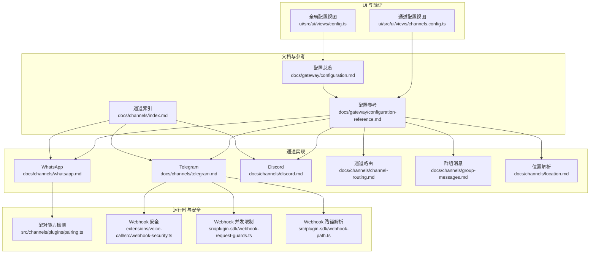
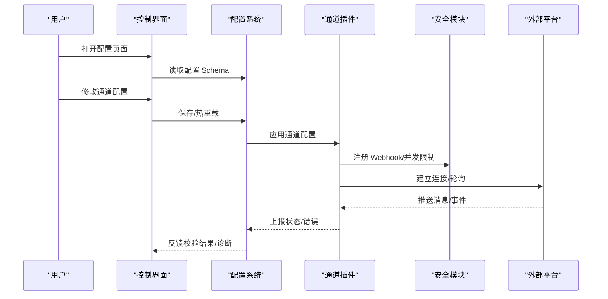
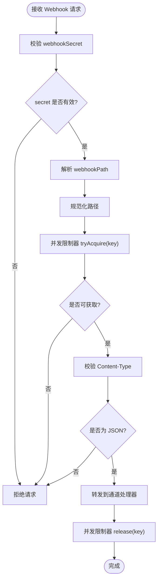
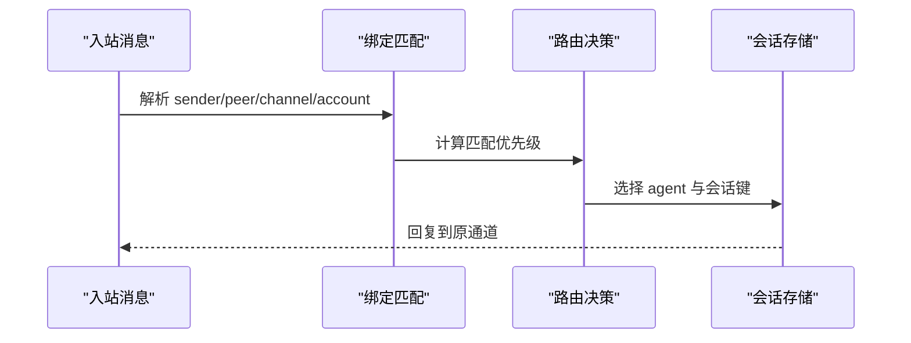
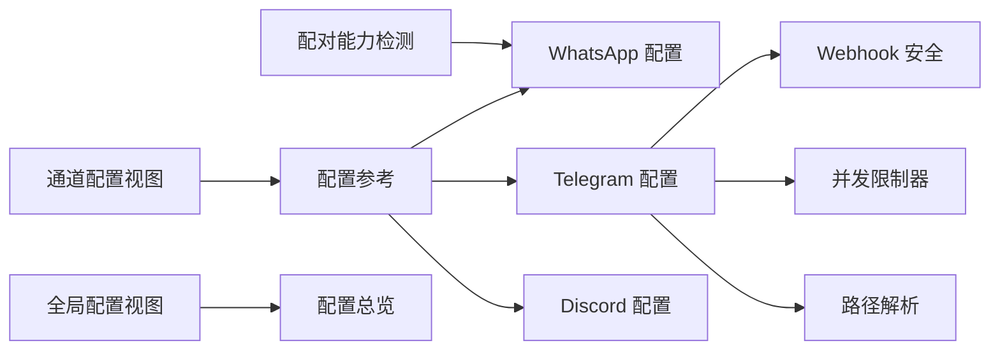

# 通道配置指南

## 目录
1. [简介](#简介)
2. [项目结构](#项目结构)
3. [核心组件](#核心组件)
4. [架构总览](#架构总览)
5. [详细组件分析](#详细组件分析)
6. [依赖关系分析](#依赖关系分析)
7. [性能考量](#性能考量)
8. [故障排查指南](#故障排查指南)
9. [结论](#结论)
10. [附录](#附录)

## 简介
本指南面向需要在 OpenClaw 中配置与管理“通道（Channel）”的用户与运维人员，覆盖从 API 密钥、Webhook、权限策略到环境变量、路由规则、群组消息处理与位置服务等全链路配置。文档同时阐述通道能力检测、动态配置更新与配置验证机制，并提供配置模板、最佳实践与常见问题解决方案，以及配置迁移与版本兼容性建议。

## 项目结构
OpenClaw 的通道配置主要分布在以下区域：
- 文档层：各通道的独立配置说明与通用配置参考
- 运行时层：通道插件、Webhook 安全校验、配额限制与路径解析
- UI 层：控制界面的配置表单渲染与热重载
- 秘钥与环境：SecretRef、环境变量注入与替换

**图表来源**
- [docs/channels/index.md](file://docs/channels/index.md#L1-L48)
- [docs/gateway/configuration.md](file://docs/gateway/configuration.md#L1-L547)
- [docs/gateway/configuration-reference.md](file://docs/gateway/configuration-reference.md#L1-L800)
- [docs/channels/whatsapp.md](file://docs/channels/whatsapp.md#L1-L446)
- [docs/channels/telegram.md](file://docs/channels/telegram.md#L1-L800)
- [docs/channels/discord.md](file://docs/channels/discord.md#L1-L800)
- [docs/channels/channel-routing.md](file://docs/channels/channel-routing.md#L1-L135)
- [docs/channels/group-messages.md](file://docs/channels/group-messages.md#L1-L85)
- [docs/channels/location.md](file://docs/channels/location.md#L1-L57)
- [src/channels/plugins/pairing.ts](file://src/channels/plugins/pairing.ts#L1-L49)
- [extensions/voice-call/src/webhook-security.ts](file://extensions/voice-call/src/webhook-security.ts#L130-L165)
- [src/plugin-sdk/webhook-request-guards.ts](file://src/plugin-sdk/webhook-request-guards.ts#L84-L137)
- [src/plugin-sdk/webhook-path.ts](file://src/plugin-sdk/webhook-path.ts#L1-L31)
- [ui/src/ui/views/channels.config.ts](file://ui/src/ui/views/channels.config.ts#L1-L155)
- [ui/src/ui/views/config.ts](file://ui/src/ui/views/config.ts#L405-L420)

**章节来源**
- [docs/channels/index.md](file://docs/channels/index.md#L1-L48)
- [docs/gateway/configuration.md](file://docs/gateway/configuration.md#L1-L547)

## 核心组件
- 通道配置模型：每个通道在配置参考中定义了独立的配置块（如 channels.telegram、channels.whatsapp），并支持 DM 与群组访问策略、媒体大小限制、流式预览、动作开关、多账户等。
- 动态配置更新：支持热重载与 RPC 更新，部分字段即时生效，关键变更自动重启或手动重启。
- 配置验证：严格 JSON5 + Schema 校验，未知键、类型错误或非法值会导致启动失败；提供诊断命令与修复建议。
- Webhook 安全与并发：提供并发限制器、内容类型校验、URL 重建白名单与代理信任配置。
- UI 表单渲染：基于配置 Schema 渲染表单，支持原始 JSON 编辑与保存/重载操作。
- 通道能力检测：通过插件声明的 pairing 能力进行通道可用性检测。

**章节来源**
- [docs/gateway/configuration.md](file://docs/gateway/configuration.md#L61-L73)
- [docs/gateway/configuration-reference.md](file://docs/gateway/configuration-reference.md#L18-L91)
- [src/plugin-sdk/webhook-request-guards.ts](file://src/plugin-sdk/webhook-request-guards.ts#L84-L137)
- [src/plugin-sdk/webhook-path.ts](file://src/plugin-sdk/webhook-path.ts#L1-L31)
- [ui/src/ui/views/channels.config.ts](file://ui/src/ui/views/channels.config.ts#L118-L155)
- [src/channels/plugins/pairing.ts](file://src/channels/plugins/pairing.ts#L11-L29)

## 架构总览
下图展示了通道配置在系统中的交互关系：配置文件与 UI 生成 Schema，通道插件读取配置并通过 Webhook 或长轮询接入平台；安全模块负责并发与 URL 重建；配对能力用于首次接入与授权。

**图表来源**
- [ui/src/ui/views/config.ts](file://ui/src/ui/views/config.ts#L405-L420)
- [docs/gateway/configuration.md](file://docs/gateway/configuration.md#L349-L387)
- [src/plugin-sdk/webhook-request-guards.ts](file://src/plugin-sdk/webhook-request-guards.ts#L84-L137)
- [src/plugin-sdk/webhook-path.ts](file://src/plugin-sdk/webhook-path.ts#L13-L31)

## 详细组件分析

### 通道配置模板与参数说明
- 通用通道模式
  - DM 策略与允许列表：dmPolicy（pairing/allowlist/open/disabled）、allowFrom
  - 群组策略与允许列表：groupPolicy（allowlist/open/disabled）、groupAllowFrom、groups
  - 历史与上下文：historyLimit、dmHistoryLimit、dms.&lt;id&gt;.historyLimit
  - 媒体与文本：mediaMaxMb、textChunkLimit、chunkMode
  - 流式预览与动作：streaming、actions.&lt;action&gt;、replyToMode、linkPreview
  - 多账户：accounts.&lt;id&gt;、defaultAccount
  - Webhook：webhookUrl、webhookSecret、webhookPath、webhookHost、webhookPort
  - 环境变量与 SecretRef：env、channels.&lt;provider&gt;.tokenRef 等

- 典型通道示例
  - Telegram：令牌、隐私模式、命令菜单、内联按钮、论坛主题、投票、贴纸、反应通知、Webhook
  - WhatsApp：自聊天保护、读回执、媒体优化、分片发送、Ack 反应
  - Discord：意图权限、服务器/角色路由、线程绑定、组件容器、Slash 命令、反应通知、配置写入

**章节来源**
- [docs/gateway/configuration-reference.md](file://docs/gateway/configuration-reference.md#L92-L125)
- [docs/gateway/configuration-reference.md](file://docs/gateway/configuration-reference.md#L152-L204)
- [docs/gateway/configuration-reference.md](file://docs/gateway/configuration-reference.md#L214-L304)
- [docs/channels/telegram.md](file://docs/channels/telegram.md#L24-L791)
- [docs/channels/whatsapp.md](file://docs/channels/whatsapp.md#L24-L373)
- [docs/channels/discord.md](file://docs/channels/discord.md#L24-L800)

### API 密钥与环境变量配置
- 环境变量优先级
  - 从父进程继承 + 当前目录 .env + ~/.openclaw/.env
  - 支持 Shell 导入（可选）与字符串内变量替换（$&#123;VAR&#125;）
- SecretRef 机制
  - channels.&lt;provider&gt;.tokenRef、channels.&lt;provider&gt;.serviceAccountRef 等
  - 支持 env/file/exec 提供者，凭证路径见参考页
- 示例
  - Telegram botToken 使用 SecretRef
  - Slack signingSecret 使用 SecretRef
  - 工具搜索 API Key 使用 SecretRef

**章节来源**
- [docs/gateway/configuration.md](file://docs/gateway/configuration.md#L449-L539)
- [src/secrets/runtime.test.ts](file://src/secrets/runtime.test.ts#L88-L132)

### Webhook 配置与安全
- Webhook 模式
  - Telegram：webhookUrl、webhookSecret、webhookPath、webhookHost、webhookPort
  - 启动校验：缺少 secret 将拒绝启动
- 安全与并发
  - 并发限制器：按 key 控制最大并发与跟踪数量
  - 内容类型校验：仅接受 application/json 或 +json 后缀
  - URL 重建白名单：受 allowedHosts/trustForwardingHeaders/trustedProxyIPs 保护
- 路径解析
  - 规范化路径，去除多余斜杠，支持从 webhookUrl 推导默认路径

**图表来源**
- [src/telegram/webhook.test.ts](file://src/telegram/webhook.test.ts#L377-L413)
- [src/plugin-sdk/webhook-request-guards.ts](file://src/plugin-sdk/webhook-request-guards.ts#L84-L137)
- [src/plugin-sdk/webhook-path.ts](file://src/plugin-sdk/webhook-path.ts#L1-L31)
- [extensions/voice-call/src/webhook-security.ts](file://extensions/voice-call/src/webhook-security.ts#L130-L165)

**章节来源**
- [src/telegram/webhook.test.ts](file://src/telegram/webhook.test.ts#L377-L413)
- [src/plugin-sdk/webhook-request-guards.ts](file://src/plugin-sdk/webhook-request-guards.ts#L84-L137)
- [src/plugin-sdk/webhook-path.ts](file://src/plugin-sdk/webhook-path.ts#L1-L31)
- [extensions/voice-call/src/webhook-security.ts](file://extensions/voice-call/src/webhook-security.ts#L130-L165)

### 权限分配与通道路由规则
- DM 与群组访问策略
  - DM 策略：pairing（默认）、allowlist、open、disabled
  - 群组策略：allowlist（默认）、open、disabled
  - 允许列表：allowFrom、groupAllowFrom、channels.&lt;provider&gt;.groups
- 会话键与路由
  - 直达消息：agent:&lt;agentId&gt;:&lt;mainKey&gt;
  - 群组/频道：agent:&lt;agentId&gt;:&lt;channel&gt;:group:&lt;id&gt; 或 agent:&lt;agentId&gt;:&lt;channel&gt;:channel:&lt;id&gt;
  - 线程/主题：附加 :thread:&lt;threadId&gt; 或 :topic:&lt;topicId&gt;
- 绑定与广播
  - bindings[]：按 peer/guild/team/account/channel 匹配路由到 agent
  - broadcast：同一入口触发多个 agent 并行执行

**图表来源**
- [docs/channels/channel-routing.md](file://docs/channels/channel-routing.md#L58-L74)
- [docs/channels/channel-routing.md](file://docs/channels/channel-routing.md#L24-L44)

**章节来源**
- [docs/gateway/configuration-reference.md](file://docs/gateway/configuration-reference.md#L22-L43)
- [docs/channels/channel-routing.md](file://docs/channels/channel-routing.md#L14-L74)

### 群组消息处理与提及门控
- 默认要求提及（元数据提及或正则模式）
- 支持 per-agent mentionPatterns 与 per-channel requireMention
- WhatsApp 自聊天保护：当自身号码在 allowFrom 时跳过读回执与自触发
- Telegram/Slack/Discord/iMessage 共享 mentionPatterns 配置

**章节来源**
- [docs/gateway/configuration-reference.md](file://docs/gateway/configuration-reference.md#L655-L720)
- [docs/channels/group-messages.md](file://docs/channels/group-messages.md#L14-L64)
- [docs/channels/whatsapp.md](file://docs/channels/whatsapp.md#L202-L210)

### 位置服务配置
- 支持通道：Telegram（位置点/场所/实时共享）、WhatsApp（位置消息/实时位置）、Matrix（geo_uri）
- 结构化上下文字段：LocationLat/Lng/Accuracy/Name/Address/Source/IsLive
- 文本格式：友好展示，带精度与备注

**章节来源**
- [docs/channels/location.md](file://docs/channels/location.md#L1-L57)

### 通道能力检测与配对
- 配对能力检测：通过插件声明的 pairing 字段识别支持配对的通道
- 解析与校验：normalizeChannelId + 列表过滤，确保输入合法

**章节来源**
- [src/channels/plugins/pairing.ts](file://src/channels/plugins/pairing.ts#L11-L49)

### 动态配置更新与验证机制
- 热重载模式
  - hybrid（默认）：安全变更即时应用，关键变更自动重启
  - hot：仅热应用，不安全变更提示重启
  - restart：每次变更均重启
  - off：禁用监听
- RPC 更新
  - config.apply：整包替换并重启
  - config.patch：部分合并更新
  - 速率限制：每设备/IP 每 60 秒最多 3 次
- 验证与诊断
  - 严格 Schema 校验，未知键/类型错误/非法值导致启动失败
  - doctor 命令输出具体问题，支持 --fix 自动修复

**章节来源**
- [docs/gateway/configuration.md](file://docs/gateway/configuration.md#L349-L447)
- [docs/gateway/configuration.md](file://docs/gateway/configuration.md#L61-L73)

### UI 表单渲染与保存流程
- 基于 Schema 渲染通道配置表单，支持原始 JSON 编辑
- 保存/重载按钮与禁用状态控制
- 全局配置视图分析 Schema 并列出可用区段

**章节来源**
- [ui/src/ui/views/channels.config.ts](file://ui/src/ui/views/channels.config.ts#L118-L155)
- [ui/src/ui/views/config.ts](file://ui/src/ui/views/config.ts#L405-L420)

## 依赖关系分析
- 通道配置依赖配置参考与通道文档，运行时依赖插件与安全模块
- UI 依赖配置 Schema 与通道视图组件
- Webhook 依赖并发限制器与 URL 安全重建策略

**图表来源**
- [docs/gateway/configuration-reference.md](file://docs/gateway/configuration-reference.md#L92-L204)
- [docs/channels/telegram.md](file://docs/channels/telegram.md#L704-L721)
- [src/plugin-sdk/webhook-request-guards.ts](file://src/plugin-sdk/webhook-request-guards.ts#L84-L137)
- [src/plugin-sdk/webhook-path.ts](file://src/plugin-sdk/webhook-path.ts#L1-L31)
- [src/channels/plugins/pairing.ts](file://src/channels/plugins/pairing.ts#L11-L29)
- [ui/src/ui/views/channels.config.ts](file://ui/src/ui/views/channels.config.ts#L118-L155)
- [ui/src/ui/views/config.ts](file://ui/src/ui/views/config.ts#L405-L420)

**章节来源**
- [docs/gateway/configuration-reference.md](file://docs/gateway/configuration-reference.md#L1-L800)
- [src/plugin-sdk/webhook-request-guards.ts](file://src/plugin-sdk/webhook-request-guards.ts#L84-L137)
- [src/plugin-sdk/webhook-path.ts](file://src/plugin-sdk/webhook-path.ts#L1-L31)
- [src/channels/plugins/pairing.ts](file://src/channels/plugins/pairing.ts#L11-L29)
- [ui/src/ui/views/channels.config.ts](file://ui/src/ui/views/channels.config.ts#L118-L155)
- [ui/src/ui/views/config.ts](file://ui/src/ui/views/config.ts#L405-L420)

## 性能考量
- 热重载与 RPC 更新的速率限制避免突发压力
- Webhook 并发限制器防止过载，建议根据平台吞吐量调整
- 文本分片与媒体压缩减少传输与渲染成本
- 会话隔离与线程绑定降低跨通道上下文污染

[本节为通用指导，无需特定文件引用]

## 故障排查指南
- 启动失败：使用 doctor 检查配置错误，按提示修复
- Webhook 不工作：检查 secret、Content-Type、路径与代理信任配置
- 通道无法配对：确认通道支持 pairing，检查配对码有效期与允许列表
- 群组消息未响应：核对 requireMention、mentionPatterns、sender 允许列表与群组 allowlist
- 历史上下文缺失：调整 historyLimit 或 dmHistoryLimit，注意 0 表示禁用

**章节来源**
- [docs/gateway/configuration.md](file://docs/gateway/configuration.md#L61-L73)
- [src/telegram/webhook.test.ts](file://src/telegram/webhook.test.ts#L407-L413)
- [src/channels/plugins/pairing.ts](file://src/channels/plugins/pairing.ts#L23-L29)
- [docs/gateway/configuration-reference.md](file://docs/gateway/configuration-reference.md#L655-L720)

## 结论
通过本文档，您可以在 OpenClaw 中完成从基础通道接入到高级路由、权限与安全配置的全栈部署。建议优先采用 SecretRef 管理敏感信息，结合 Webhook 与并发限制器保障高可用，利用动态配置更新与严格验证机制提升运维效率与稳定性。

[本节为总结，无需特定文件引用]

## 附录

### 配置模板速查
- 最小化配置（示例）
  - 设置 agents.defaults.workspace 与 channels.&lt;provider&gt;.allowFrom
- Telegram 快速上手
  - 设置 botToken、dmPolicy、群组 requireMention
- WhatsApp 快速上手
  - 设置 dmPolicy、allowFrom、groupPolicy、groupAllowFrom
- Discord 快速上手
  - 设置 token、意图权限、服务器/频道 allowlist

**章节来源**
- [docs/gateway/configuration.md](file://docs/gateway/configuration.md#L26-L104)
- [docs/channels/telegram.md](file://docs/channels/telegram.md#L24-L69)
- [docs/channels/whatsapp.md](file://docs/channels/whatsapp.md#L24-L76)
- [docs/channels/discord.md](file://docs/channels/discord.md#L24-L167)

### 最佳实践
- 使用 SecretRef 管理令牌与密钥，避免明文写入配置
- 为不同环境准备独立 .env 文件，结合 $include 组织大型配置
- 启用热重载 hybrid 模式，关键变更自动重启
- 为 Telegram/Slack/Discord 等启用 Webhook 并配置安全白名单
- 为群组开启 mention gating，结合 per-agent mentionPatterns

**章节来源**
- [docs/gateway/configuration.md](file://docs/gateway/configuration.md#L449-L539)
- [docs/gateway/configuration-reference.md](file://docs/gateway/configuration-reference.md#L270-L304)
- [docs/channels/telegram.md](file://docs/channels/telegram.md#L704-L721)
- [docs/channels/discord.md](file://docs/channels/discord.md#L539-L548)

### 常见问题与解决方案
- 通道未启动：检查配置语法与必需字段（如 Telegram 的 webhookSecret）
- 配对失败：确认通道支持 pairing，核对允许列表与配对码
- 群组消息被忽略：检查 groupPolicy、allowFrom、requireMention 与 mentionPatterns
- Webhook 401/403：校验 secret、Content-Type、allowedHosts 与代理信任

**章节来源**
- [src/telegram/webhook.test.ts](file://src/telegram/webhook.test.ts#L407-L413)
- [src/plugin-sdk/webhook-request-guards.ts](file://src/plugin-sdk/webhook-request-guards.ts#L84-L137)
- [extensions/voice-call/src/webhook-security.ts](file://extensions/voice-call/src/webhook-security.ts#L130-L165)

### 配置迁移与版本兼容
- 使用 $include 将大配置拆分为多文件，保持后向兼容
- 升级时运行 doctor --fix 自动修复形状不一致与路径迁移
- 对于已弃用字段，参考配置参考中的迁移说明

**章节来源**
- [docs/gateway/configuration.md](file://docs/gateway/configuration.md#L325-L347)
- [docs/gateway/configuration-reference.md](file://docs/gateway/configuration-reference.md#L619-L684)