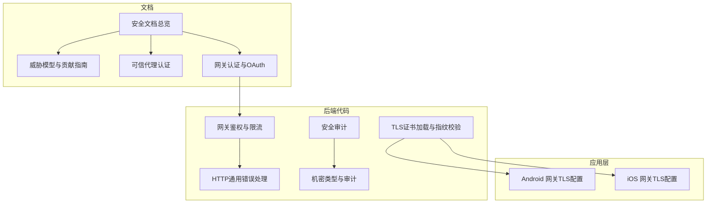
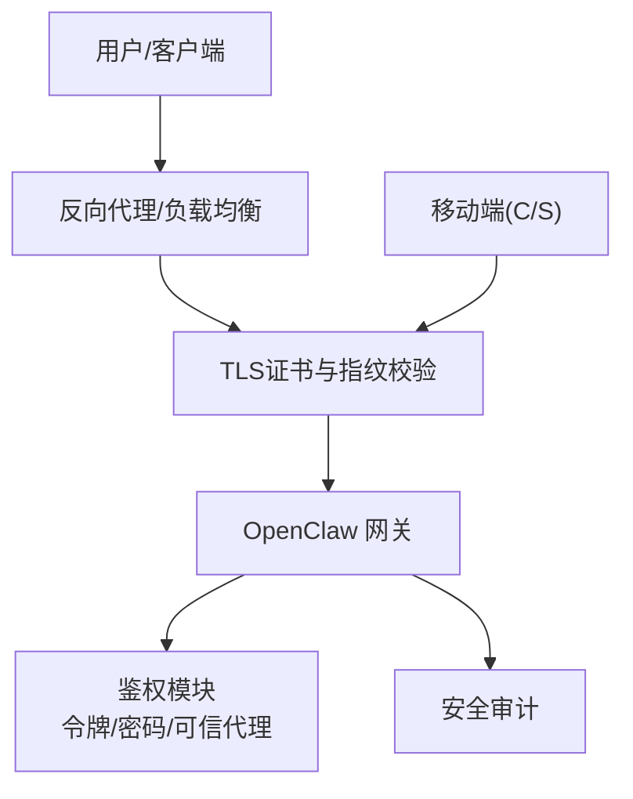
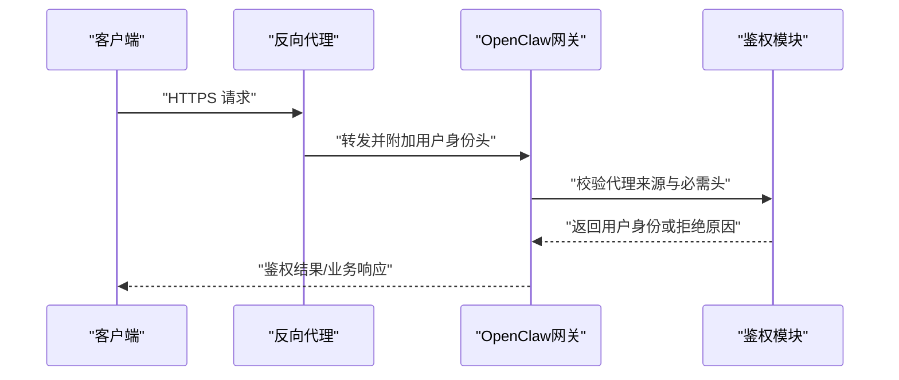
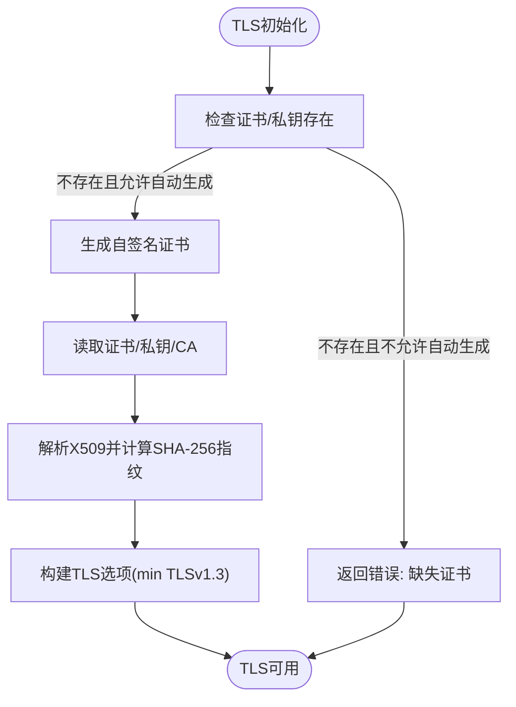
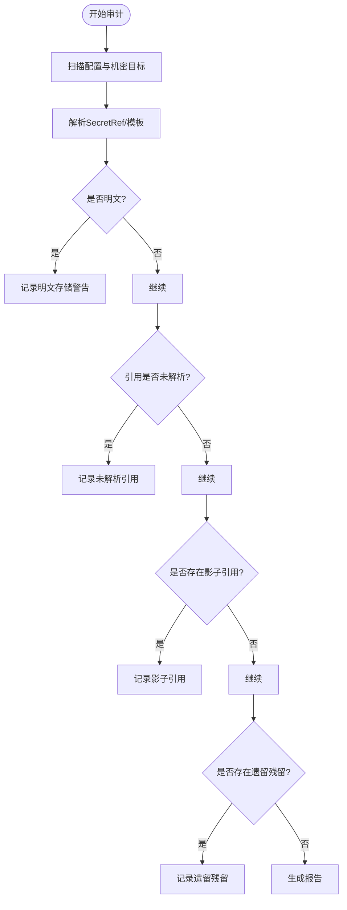
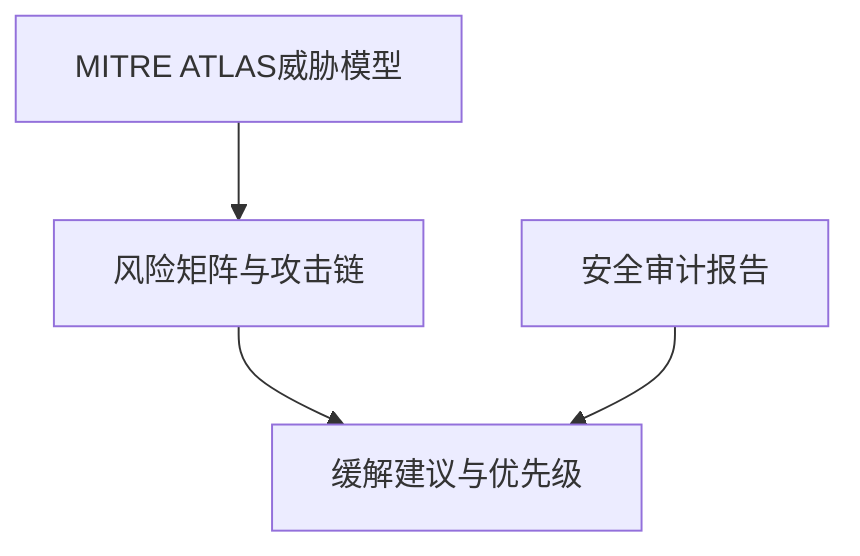
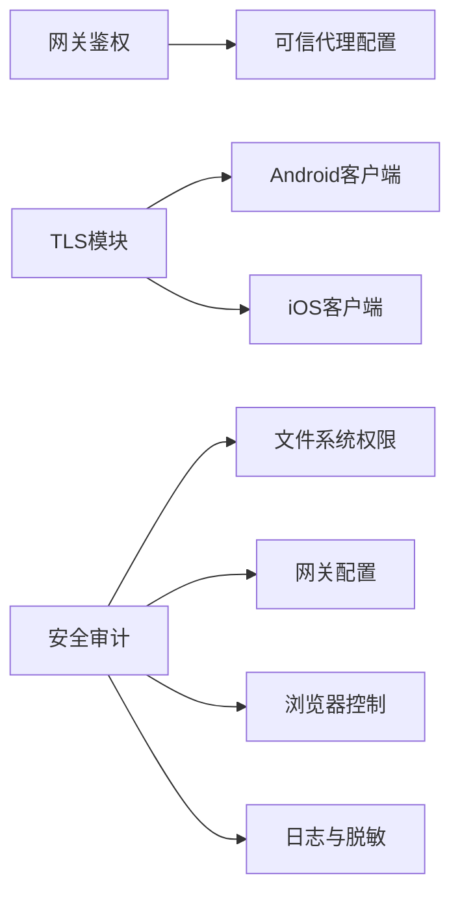

# 安全加固

## 目录
1. [简介](#简介)
2. [项目结构](#项目结构)
3. [核心组件](#核心组件)
4. [架构总览](#架构总览)
5. [详细组件分析](#详细组件分析)
6. [依赖关系分析](#依赖关系分析)
7. [性能考量](#性能考量)
8. [故障排查指南](#故障排查指南)
9. [结论](#结论)
10. [附录](#附录)

## 简介
本指南面向OpenClaw安全运维团队，提供从身份认证与授权、网络安全配置到敏感数据保护、威胁建模与风险评估的系统化安全加固方案。内容覆盖API密钥管理、OAuth流程、角色权限控制、防火墙与反向代理、TLS证书与指纹校验、密钥与凭据管理、访问审计与合规检查、漏洞扫描与渗透测试等关键实践，并给出可操作的实施步骤与排障建议。

## 项目结构
围绕安全主题，OpenClaw在多个层次提供了能力与文档：
- 文档层：安全与信任、威胁模型、可信代理认证、网关认证等
- 代码层：安全审计、TLS证书加载与指纹校验、网关鉴权、HTTP通用错误与限流、OAuth回调、机密类型与审计
- 应用层：移动端对TLS指纹校验与TOFU策略的支持

图示来源
- [安全文档总览](file://docs/security/README.md#L1-L18)
- [威胁模型与贡献指南](file://docs/security/THREAT-MODEL-ATLAS.md#L1-L604)
- [可信代理认证](file://docs/gateway/trusted-proxy-auth.md#L30-L330)
- [网关认证与OAuth](file://docs/gateway/authentication.md#L1-L56)
- [安全审计](file://src/security/audit.ts#L1131-L1156)
- [TLS证书加载与指纹校验](file://src/infra/tls/gateway.ts#L81-L150)
- [网关鉴权与限流](file://src/gateway/auth.ts#L331-L372)
- [HTTP通用错误处理](file://src/gateway/http-common.ts#L36-L71)
- [机密类型与审计](file://src/config/types.secrets.ts#L1-L225)
- [Android 网关TLS配置](file://apps/android/app/src/main/java/ai/openclaw/app/gateway/GatewayTls.kt#L35-L66)
- [iOS 网关TLS配置](file://apps/ios/Sources/Gateway/GatewayConnectionController.swift#L496-L523)

章节来源
- [安全文档总览](file://docs/security/README.md#L1-L18)
- [威胁模型与贡献指南](file://docs/security/THREAT-MODEL-ATLAS.md#L1-L604)

## 核心组件
- 身份认证与授权
  - API密钥与Bearer Token：适用于长生命周期网关与订阅型令牌
  - OAuth流程：通过本地回调接收授权码，完成用户身份获取与凭证持久化
  - 可信代理模式：由反向代理负责用户认证，网关仅校验代理与用户头信息
- 网络安全
  - TLS证书加载与指纹校验：自签名证书生成、证书链读取、SHA-256指纹计算与校验
  - 移动端TLS策略：指纹严格匹配、TOFU首次信任存储
  - 反向代理与Origin限制：受控的allowedOrigins、禁用Host头回退
- 敏感数据保护
  - 机密类型与解析：env/file/exec三种来源，模板与默认提供者
  - 机密审计：明文存储检测、未解析引用、影子引用、遗留残留
  - 日志脱敏：敏感信息红化配置
- 威胁建模与风险评估
  - MITRE ATLAS框架下的威胁矩阵、攻击链与缓解建议
  - 安全审计报告：暴露面、文件系统权限、网关绑定与鉴权、浏览器控制、日志与执行环境等

章节来源
- [网关认证与OAuth](file://docs/gateway/authentication.md#L1-L56)
- [可信代理认证](file://docs/gateway/trusted-proxy-auth.md#L30-L330)
- [TLS证书加载与指纹校验](file://src/infra/tls/gateway.ts#L81-L150)
- [Android 网关TLS配置](file://apps/android/app/src/main/java/ai/openclaw/app/gateway/GatewayTls.kt#L35-L66)
- [iOS 网关TLS配置](file://apps/ios/Sources/Gateway/GatewayConnectionController.swift#L496-L523)
- [OAuth回调处理](file://extensions/google-gemini-cli-auth/oauth.ts#L305-L344)
- [HTTP通用错误处理](file://src/gateway/http-common.ts#L36-L71)
- [机密类型与审计](file://src/config/types.secrets.ts#L1-L225)
- [机密审计与报告](file://src/secrets/audit.ts#L39-L253)
- [威胁模型与贡献指南](file://docs/security/THREAT-MODEL-ATLAS.md#L1-L604)

## 架构总览
下图展示OpenClaw安全加固的关键交互：客户端/反向代理经TLS到达网关，网关根据配置进行鉴权（令牌、密码、可信代理），随后进入会话隔离与工具调用沙箱；移动端通过指纹校验确保与网关的TLS一致性。

图示来源
- [TLS证书加载与指纹校验](file://src/infra/tls/gateway.ts#L81-L150)
- [可信代理认证](file://docs/gateway/trusted-proxy-auth.md#L30-L330)
- [网关鉴权与限流](file://src/gateway/auth.ts#L331-L372)
- [安全审计](file://src/security/audit.ts#L1131-L1156)
- [Android 网关TLS配置](file://apps/android/app/src/main/java/ai/openclaw/app/gateway/GatewayTls.kt#L35-L66)
- [iOS 网关TLS配置](file://apps/ios/Sources/Gateway/GatewayConnectionController.swift#L496-L523)

## 详细组件分析

### 组件A：身份认证与授权机制
- API密钥与Bearer Token
  - 长生命周期网关优先采用API密钥；订阅场景可使用setup-token
  - 建议将密钥存放在守护进程可读的环境文件中，避免手动维护
- OAuth流程
  - 本地回调端口监听，校验state与错误参数，提取授权码并完成交换
  - 回调路径与参数需严格校验，防止中间人与参数注入
- 可信代理认证
  - 由代理终止TLS并进行用户认证，网关仅校验请求来源与必需头
  - 必须严格限制trustedProxies、设置userHeader与可选allowUsers白名单

图示来源
- [可信代理认证](file://docs/gateway/trusted-proxy-auth.md#L30-L330)
- [网关鉴权与限流](file://src/gateway/auth.ts#L331-L372)
- [OAuth回调处理](file://extensions/google-gemini-cli-auth/oauth.ts#L305-L344)

章节来源
- [网关认证与OAuth](file://docs/gateway/authentication.md#L1-L56)
- [可信代理认证](file://docs/gateway/trusted-proxy-auth.md#L30-L330)
- [OAuth回调处理](file://extensions/google-gemini-cli-auth/oauth.ts#L305-L344)
- [HTTP通用错误处理](file://src/gateway/http-common.ts#L36-L71)

### 组件B：网络安全配置
- TLS证书管理
  - 自动生成自签名证书、读取证书/私钥/CA、计算SHA-256指纹
  - 最低TLS版本限制为TLSv1.3，缺失证书时明确报错
- 移动端TLS策略
  - 严格指纹匹配；允许TOFU时首次连接写入指纹
  - 未满足指纹且不允许TOFU时拒绝连接
- 反向代理与Origin限制
  - 非loopback绑定需显式allowedOrigins，禁用Host头回退
  - 允许真实IP回退需谨慎，仅在代理可靠覆写X-Real-IP时启用

图示来源
- [TLS证书加载与指纹校验](file://src/infra/tls/gateway.ts#L81-L150)
- [Android 网关TLS配置](file://apps/android/app/src/main/java/ai/openclaw/app/gateway/GatewayTls.kt#L35-L66)
- [iOS 网关TLS配置](file://apps/ios/Sources/Gateway/GatewayConnectionController.swift#L496-L523)

章节来源
- [TLS证书加载与指纹校验](file://src/infra/tls/gateway.ts#L81-L150)
- [Android 网关TLS配置](file://apps/android/app/src/main/java/ai/openclaw/app/gateway/GatewayTls.kt#L35-L66)
- [iOS 网关TLS配置](file://apps/ios/Sources/Gateway/GatewayConnectionController.swift#L496-L523)

### 组件C：敏感数据保护策略
- 机密类型与解析
  - 支持env/file/exec三种来源，模板语法与默认提供者
  - 强制提供者别名与ID格式校验，避免误用
- 机密审计
  - 明文存储检测、未解析引用、影子引用、遗留残留统计与报告
  - 提供findings汇总与严重性分级
- 日志脱敏
  - 通过logging.redactSensitive控制敏感信息红化

图示来源
- [机密审计与报告](file://src/secrets/audit.ts#L39-L253)
- [密钥与机密管理类型定义](file://src/config/types.secrets.ts#L1-L225)

章节来源
- [机密审计与报告](file://src/secrets/audit.ts#L39-L253)
- [密钥与机密管理类型定义](file://src/config/types.secrets.ts#L1-L225)

### 组件D：威胁模型与安全风险评估
- MITRE ATLAS框架下的威胁矩阵与攻击链
  - 关注提示注入、供应链、凭证窃取、远程命令执行、资源耗尽等高危场景
  - 提供缓解建议与优先级排序
- 安全审计报告
  - 暴露面、文件系统权限、网关绑定与鉴权、浏览器控制、日志与执行环境等维度
  - 输出严重性统计与修复建议

图示来源
- [威胁模型与贡献指南](file://docs/security/THREAT-MODEL-ATLAS.md#L1-L604)
- [安全审计](file://src/security/audit.ts#L1131-L1156)

章节来源
- [威胁模型与贡献指南](file://docs/security/THREAT-MODEL-ATLAS.md#L1-L604)
- [安全审计](file://src/security/audit.ts#L1131-L1156)

## 依赖关系分析
- 组件耦合
  - 网关鉴权依赖可信代理配置与环境变量解析
  - TLS模块被移动端与网关共同依赖
  - 安全审计贯穿配置、文件系统、网关、浏览器控制、日志与执行环境
- 外部依赖
  - 反向代理（Pomerium/Caddy/Nginx/OAuth2-Proxy/Traefik）与网关的集成
  - 移动端对证书指纹的严格校验

图示来源
- [网关鉴权与限流](file://src/gateway/auth.ts#L331-L372)
- [可信代理认证](file://docs/gateway/trusted-proxy-auth.md#L30-L330)
- [TLS证书加载与指纹校验](file://src/infra/tls/gateway.ts#L81-L150)
- [安全审计](file://src/security/audit.ts#L1131-L1156)

章节来源
- [网关鉴权与限流](file://src/gateway/http-common.ts#L36-L71)
- [可信代理认证](file://docs/gateway/trusted-proxy-auth.md#L30-L330)
- [安全审计](file://src/security/audit.ts#L1131-L1156)

## 性能考量
- 鉴权与限流
  - 对非loopback绑定建议配置速率限制，降低暴力破解成本
  - 受信代理模式减少网关侧认证开销，但需确保代理可靠性
- TLS握手
  - 使用TLSv1.3与合理的证书缓存策略，降低握手延迟
- 审计扫描
  - 深度审计包含网关探测，应设置超时以避免阻塞

## 故障排查指南
- 网关无法鉴权
  - 检查gateway.bind与auth配置，确认令牌/密码/可信代理设置
  - 若启用trusted-proxy，验证trustedProxies、userHeader与allowUsers
- TLS连接失败
  - 确认证书/私钥/CA路径存在且可读，检查SHA-256指纹
  - 移动端若首次连接，确认TOFU策略与指纹存储
- OAuth回调异常
  - 校验state参数、回调路径与错误字段，确保本地端口可达
- 安全审计告警
  - 关注文件系统权限、allowedOrigins、Host头回退、X-Real-IP回退等高危项
  - 参考审计报告中的修复建议逐项整改

章节来源
- [HTTP通用错误处理](file://src/gateway/http-common.ts#L36-L71)
- [可信代理认证](file://docs/gateway/trusted-proxy-auth.md#L30-L330)
- [TLS证书加载与指纹校验](file://src/infra/tls/gateway.ts#L81-L150)
- [OAuth回调处理](file://extensions/google-gemini-cli-auth/oauth.ts#L305-L344)
- [安全审计命令输出](file://src/commands/status.command.ts#L473-L508)

## 结论
通过完善的认证授权（API密钥、OAuth、可信代理）、严格的网络安全（TLS、反向代理、Origin限制）、敏感数据保护（机密类型与审计、日志脱敏）以及基于MITRE ATLAS的威胁建模与安全审计，OpenClaw能够形成端到端的安全加固体系。建议在生产部署中遵循最小暴露面原则，启用速率限制与受信代理，强化移动端TLS指纹策略，并持续开展安全审计与漏洞扫描。

## 附录
- 安全合规检查清单
  - 文件系统权限：状态目录与配置文件仅限所有者读写
  - 网关绑定：非loopback需配置令牌/密码或可信代理
  - 反向代理：仅允许代理IP，设置userHeader与allowUsers
  - TLS：启用TLSv1.3，校验证书与指纹，禁用Host头回退
  - 机密管理：避免明文存储，启用SecretRef解析与审计
- 漏洞扫描与渗透测试
  - 使用安全基线工具识别硬编码密钥与敏感词
  - 执行渗透测试验证鉴权边界与代理配置有效性
- 应急响应
  - 发现凭证泄露立即轮换令牌与密钥
  - 审计日志留存与溯源，快速定位受影响范围

章节来源
- [安全基线与漏洞扫描](file://.secrets.baseline)
- [安全策略与范围](file://SECURITY.md#L48-L130)
- [威胁模型与贡献指南](file://docs/security/THREAT-MODEL-ATLAS.md#L1-L604)