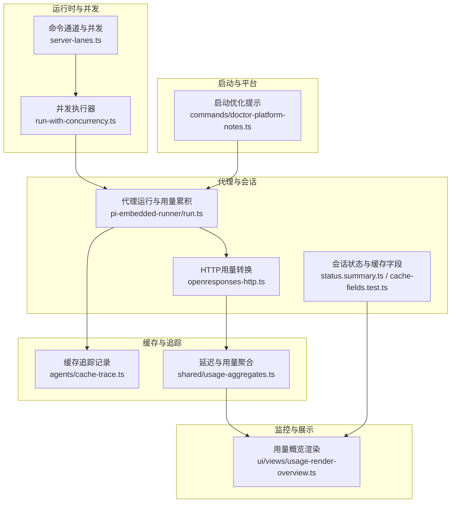
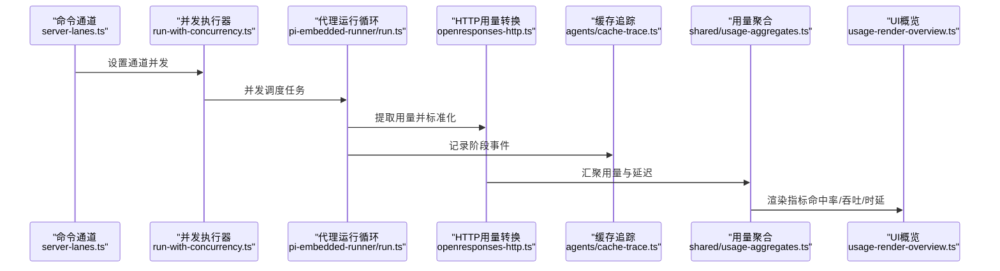
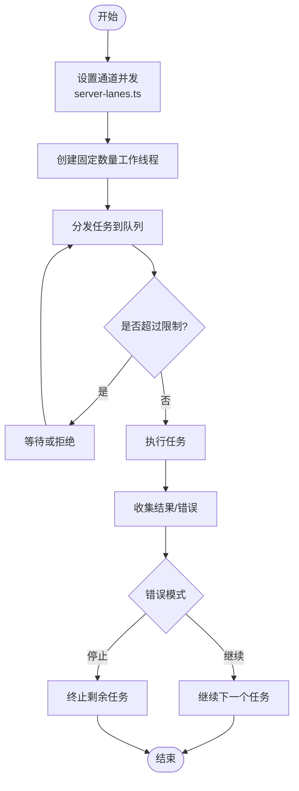
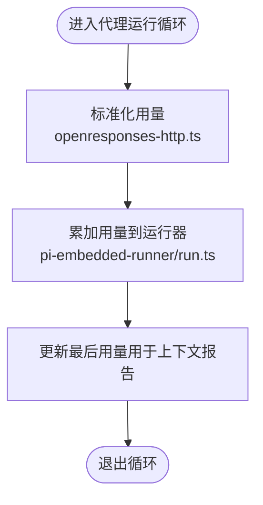
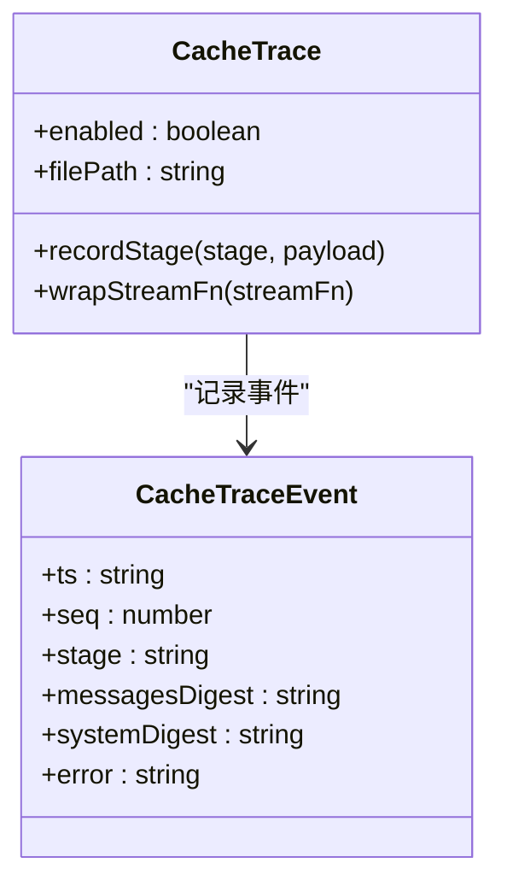
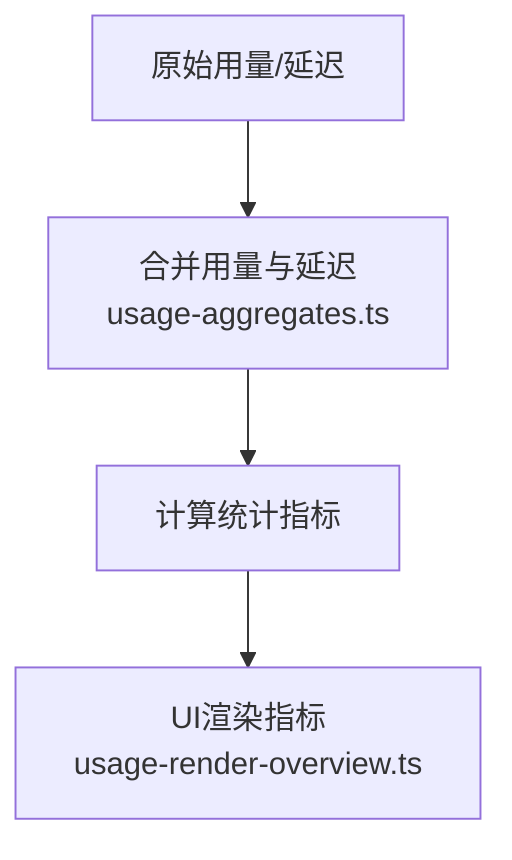
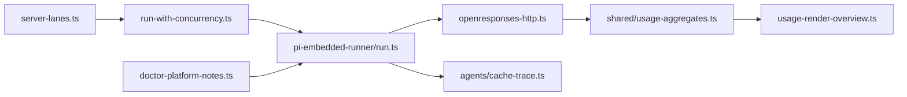

# 性能优化

## 目录
1. [简介](#简介)
2. [项目结构](#项目结构)
3. [核心组件](#核心组件)
4. [架构总览](#架构总览)
5. [详细组件分析](#详细组件分析)
6. [依赖关系分析](#依赖关系分析)
7. [性能考量](#性能考量)
8. [故障排查指南](#故障排查指南)
9. [结论](#结论)
10. [附录](#附录)

## 简介
本指南面向OpenClaw运维与平台工程团队，聚焦系统性能优化的可操作实践，覆盖以下方面：
- 系统性能监控指标：响应时间、吞吐量、资源利用率、错误率、缓存命中率等
- 内存管理与缓存策略：会话清理、模型缓存、工具调用结果缓存、诊断级缓存追踪
- 网络性能优化：连接池配置、超时设置、负载均衡（概念性建议）
- 并发处理优化：线程池/并发控制、异步处理、资源限制
- 数据库与磁盘I/O优化：会话存储缓存、编译缓存、启动优化
- CPU使用率优化：运行时环境与启动参数调优

本指南以仓库中实际实现为依据，结合可视化图示帮助读者快速定位优化切入点。

## 项目结构
OpenClaw在多语言与多平台环境下运行，性能优化涉及如下关键路径：
- 运行时与并发控制：并发执行、命令队列与通道
- 代理与会话：上下文与令牌统计、缓存字段、状态汇总
- 缓存与追踪：缓存命中/写入统计、缓存追踪日志
- 监控与聚合：延迟与每日用量聚合、UI展示指标
- 启动与平台优化：启动优化提示、编译缓存位置与自重生

**图表来源**
- [src/gateway/server-lanes.ts](file://src/gateway/server-lanes.ts#L1-L11)
- [src/utils/run-with-concurrency.ts](file://src/utils/run-with-concurrency.ts#L1-L49)
- [src/agents/pi-embedded-runner/run.ts](file://src/agents/pi-embedded-runner/run.ts#L121-L177)
- [src/gateway/openresponses-http.ts](file://src/gateway/openresponses-http.ts#L147-L187)
- [src/agents/cache-trace.ts](file://src/agents/cache-trace.ts#L178-L261)
- [src/shared/usage-aggregates.ts](file://src/shared/usage-aggregates.ts#L32-L110)
- [ui/src/ui/views/usage-render-overview.ts](file://ui/src/ui/views/usage-render-overview.ts#L380-L406)
- [src/commands/doctor-platform-notes.ts](file://src/commands/doctor-platform-notes.ts#L159-L222)

**章节来源**
- [src/gateway/server-lanes.ts](file://src/gateway/server-lanes.ts#L1-L11)
- [src/utils/run-with-concurrency.ts](file://src/utils/run-with-concurrency.ts#L1-L49)
- [src/agents/pi-embedded-runner/run.ts](file://src/agents/pi-embedded-runner/run.ts#L121-L177)
- [src/gateway/openresponses-http.ts](file://src/gateway/openresponses-http.ts#L147-L187)
- [src/agents/cache-trace.ts](file://src/agents/cache-trace.ts#L178-L261)
- [src/shared/usage-aggregates.ts](file://src/shared/usage-aggregates.ts#L32-L110)
- [ui/src/ui/views/usage-render-overview.ts](file://ui/src/ui/views/usage-render-overview.ts#L380-L406)
- [src/commands/doctor-platform-notes.ts](file://src/commands/doctor-platform-notes.ts#L159-L222)

## 核心组件
- 命令通道与并发控制：通过通道维度设置最大并发，隔离Cron、主代理与子代理任务，避免相互争抢资源。
- 并发执行器：统一的任务并发调度器，支持错误模式（继续/停止）、错误回调与结果收集。
- 代理运行与用量累积：在代理运行循环中累积输入/输出/缓存读写/总计用量，并维护最近一次用量用于上下文报告。
- HTTP用量转换：从结果元数据提取用量并标准化为输入/输出/总计。
- 缓存追踪：按阶段记录会话、消息指纹、系统提示摘要等，支持文件队列写入与可选包含内容。
- 延迟与用量聚合：合并每日延迟与用量，计算平均/最小/最大/p95等指标。
- 会话状态与缓存字段：会话条目支持cacheRead/cacheWrite字段，测试覆盖合并与清空逻辑。
- UI用量概览：计算缓存命中率、错误率、吞吐量、平均时延等指标并格式化展示。
- 启动优化提示：针对低内存/ARM主机给出编译缓存与自重生相关建议。

**章节来源**
- [src/gateway/server-lanes.ts](file://src/gateway/server-lanes.ts#L6-L10)
- [src/utils/run-with-concurrency.ts](file://src/utils/run-with-concurrency.ts#L3-L48)
- [src/agents/pi-embedded-runner/run.ts](file://src/agents/pi-embedded-runner/run.ts#L121-L177)
- [src/gateway/openresponses-http.ts](file://src/gateway/openresponses-http.ts#L147-L187)
- [src/agents/cache-trace.ts](file://src/agents/cache-trace.ts#L178-L261)
- [src/shared/usage-aggregates.ts](file://src/shared/usage-aggregates.ts#L32-L110)
- [src/config/sessions/cache-fields.test.ts](file://src/config/sessions/cache-fields.test.ts#L6-L68)
- [ui/src/ui/views/usage-render-overview.ts](file://ui/src/ui/views/usage-render-overview.ts#L380-L406)
- [src/commands/doctor-platform-notes.ts](file://src/commands/doctor-platform-notes.ts#L159-L222)

## 架构总览
下图展示从并发调度到用量采集、缓存追踪与监控聚合的关键链路：

**图表来源**
- [src/gateway/server-lanes.ts](file://src/gateway/server-lanes.ts#L6-L10)
- [src/utils/run-with-concurrency.ts](file://src/utils/run-with-concurrency.ts#L3-L48)
- [src/agents/pi-embedded-runner/run.ts](file://src/agents/pi-embedded-runner/run.ts#L121-L177)
- [src/gateway/openresponses-http.ts](file://src/gateway/openresponses-http.ts#L147-L187)
- [src/agents/cache-trace.ts](file://src/agents/cache-trace.ts#L178-L261)
- [src/shared/usage-aggregates.ts](file://src/shared/usage-aggregates.ts#L32-L110)
- [ui/src/ui/views/usage-render-overview.ts](file://ui/src/ui/views/usage-render-overview.ts#L380-L406)

## 详细组件分析

### 组件A：并发执行与通道并发控制
- 设计要点
  - 通道维度隔离：Cron、主代理、子代理分别设置并发上限，避免互相影响。
  - 并发执行器：支持限流、错误模式（继续/停止）、错误回调与结果收集。
- 性能影响
  - 合理设置通道并发可提升吞吐；过高会导致资源争抢与抖动。
  - 错误模式“停止”可在出现严重异常时快速止损。
- 实施建议
  - 根据CPU核数与I/O瓶颈调整各通道并发。
  - 对高风险任务启用“停止”模式，防止连锁失败。

**图表来源**
- [src/gateway/server-lanes.ts](file://src/gateway/server-lanes.ts#L6-L10)
- [src/utils/run-with-concurrency.ts](file://src/utils/run-with-concurrency.ts#L3-L48)

**章节来源**
- [src/gateway/server-lanes.ts](file://src/gateway/server-lanes.ts#L6-L10)
- [src/utils/run-with-concurrency.ts](file://src/utils/run-with-concurrency.ts#L3-L48)

### 组件B：代理运行与用量累积
- 设计要点
  - 在运行循环中累积用量（输入/输出/缓存读/缓存写/总计），并保留最后一次用量用于上下文大小报告。
  - 将用量标准化为HTTP接口可用格式。
- 性能影响
  - 减少重复计算上下文大小，避免多次工具往返导致的过度估算。
  - 用量标准化便于跨后端统一统计。
- 实施建议
  - 结合缓存命中率与上下文剩余空间动态调整思考深度与上下文长度。

**图表来源**
- [src/gateway/openresponses-http.ts](file://src/gateway/openresponses-http.ts#L147-L187)
- [src/agents/pi-embedded-runner/run.ts](file://src/agents/pi-embedded-runner/run.ts#L121-L177)

**章节来源**
- [src/gateway/openresponses-http.ts](file://src/gateway/openresponses-http.ts#L147-L187)
- [src/agents/pi-embedded-runner/run.ts](file://src/agents/pi-embedded-runner/run.ts#L121-L177)

### 组件C：缓存追踪与诊断
- 设计要点
  - 支持按阶段记录会话加载、消息摘要、系统提示摘要、选项与错误等。
  - 可选择包含消息体、提示词与系统提示，支持文件队列写入。
- 性能影响
  - 仅在诊断开启时生效，避免生产环境开销。
  - 通过消息指纹与摘要降低日志体积。
- 实施建议
  - 低内存/ARM主机上谨慎开启包含消息体的日志，优先使用摘要。

**图表来源**
- [src/agents/cache-trace.ts](file://src/agents/cache-trace.ts#L178-L261)

**章节来源**
- [src/agents/cache-trace.ts](file://src/agents/cache-trace.ts#L178-L261)

### 组件D：用量聚合与监控指标
- 设计要点
  - 合并延迟与每日用量，计算平均/最小/最大/p95等指标。
  - UI侧计算缓存命中率、错误率、吞吐量、平均时延等。
- 性能影响
  - 聚合指标有助于识别尾部延迟与成本热点。
  - 命中率与错误率是优化缓存与稳定性的重要信号。
- 实施建议
  - 定期审查p95与平均时延，定位异常波动。
  - 关注缓存命中率下降趋势，检查缓存键一致性与过期策略。

**图表来源**
- [src/shared/usage-aggregates.ts](file://src/shared/usage-aggregates.ts#L32-L110)
- [ui/src/ui/views/usage-render-overview.ts](file://ui/src/ui/views/usage-render-overview.ts#L380-L406)

**章节来源**
- [src/shared/usage-aggregates.ts](file://src/shared/usage-aggregates.ts#L32-L110)
- [ui/src/ui/views/usage-render-overview.ts](file://ui/src/ui/views/usage-render-overview.ts#L380-L406)

### 组件E：会话缓存字段与状态汇总
- 设计要点
  - 会话条目支持cacheRead/cacheWrite字段，测试覆盖合并与清空逻辑。
  - 状态汇总对会话进行年龄、上下文余量、令牌总量等计算。
- 性能影响
  - 明确的缓存字段有助于区分“新写入”与“缓存读取”，提高命中率统计准确性。
  - 上下文余量与令牌总量可用于动态节流。
- 实施建议
  - 在会话清理策略中考虑cacheRead/cacheWrite，避免误删有效缓存。

**章节来源**
- [src/config/sessions/cache-fields.test.ts](file://src/config/sessions/cache-fields.test.ts#L6-L68)
- [src/commands/status.summary.ts](file://src/commands/status.summary.ts#L122-L190)

### 组件F：启动优化与平台适配
- 设计要点
  - 针对Linux ARM与低内存主机给出NODE_COMPILE_CACHE与OPENCLAW_NO_RESPAWN建议。
  - 指出临时目录编译缓存可能导致重启后失效。
- 性能影响
  - 合理的编译缓存位置与自重生策略可显著缩短启动时间。
- 实施建议
  - 在低内存/ARM设备上将NODE_COMPILE_CACHE指向持久化路径，并设置OPENCLAW_NO_RESPAWN=1。

**章节来源**
- [src/commands/doctor-platform-notes.ts](file://src/commands/doctor-platform-notes.ts#L159-L222)

## 依赖关系分析
- 组件耦合
  - server-lanes与run-with-concurrency共同决定并发执行边界。
  - pi-embedded-runner与openresponses-http形成用量采集闭环。
  - cache-trace作为诊断组件独立于主流程，仅在启用时产生开销。
  - usage-aggregates与UI构成监控闭环。
- 外部依赖
  - 文件系统（会话存储、缓存追踪文件）。
  - 进程环境变量（编译缓存、自重生开关）。

**图表来源**
- [src/gateway/server-lanes.ts](file://src/gateway/server-lanes.ts#L6-L10)
- [src/utils/run-with-concurrency.ts](file://src/utils/run-with-concurrency.ts#L3-L48)
- [src/agents/pi-embedded-runner/run.ts](file://src/agents/pi-embedded-runner/run.ts#L121-L177)
- [src/gateway/openresponses-http.ts](file://src/gateway/openresponses-http.ts#L147-L187)
- [src/agents/cache-trace.ts](file://src/agents/cache-trace.ts#L178-L261)
- [src/shared/usage-aggregates.ts](file://src/shared/usage-aggregates.ts#L32-L110)
- [ui/src/ui/views/usage-render-overview.ts](file://ui/src/ui/views/usage-render-overview.ts#L380-L406)
- [src/commands/doctor-platform-notes.ts](file://src/commands/doctor-platform-notes.ts#L159-L222)

**章节来源**
- [src/gateway/server-lanes.ts](file://src/gateway/server-lanes.ts#L6-L10)
- [src/utils/run-with-concurrency.ts](file://src/utils/run-with-concurrency.ts#L3-L48)
- [src/agents/pi-embedded-runner/run.ts](file://src/agents/pi-embedded-runner/run.ts#L121-L177)
- [src/gateway/openresponses-http.ts](file://src/gateway/openresponses-http.ts#L147-L187)
- [src/agents/cache-trace.ts](file://src/agents/cache-trace.ts#L178-L261)
- [src/shared/usage-aggregates.ts](file://src/shared/usage-aggregates.ts#L32-L110)
- [ui/src/ui/views/usage-render-overview.ts](file://ui/src/ui/views/usage-render-overview.ts#L380-L406)
- [src/commands/doctor-platform-notes.ts](file://src/commands/doctor-platform-notes.ts#L159-L222)

## 性能考量
- 响应时间
  - 关注p95与平均时延，结合failover错误分类（如超时、过载）定位瓶颈。
  - 通过并发控制与通道隔离减少尾延迟放大。
- 吞吐量
  - 通过并发执行器与通道并发设置提升吞吐；结合UI中的吞吐指标校准。
  - 用量标准化确保不同后端的吞吐对比一致。
- 资源利用率
  - 利用会话上下文余量与令牌总量动态调节思考深度，避免过度占用CPU/内存。
  - 启动优化提示改善冷启动，间接提升整体资源利用效率。
- 缓存策略
  - 使用cacheRead/cacheWrite字段区分命中与新写入，提高命中率统计精度。
  - 诊断级缓存追踪仅在需要时开启，避免生产环境额外IO。
- 网络性能（概念性建议）
  - 连接池：根据并发与后端QPS设置池大小，避免频繁建连。
  - 超时：请求超时与重试策略需与通道并发匹配，防止级联阻塞。
  - 负载均衡：多实例部署时按会话键哈希路由，保证缓存局部性。
- 并发与异步
  - 通道并发与任务并发双层控制，避免全局无界并发。
  - 异步处理中注意错误传播与资源回收。
- 数据库与磁盘I/O
  - 会话存储采用写透缓存与进程内缓存，减少磁盘读取次数。
  - 编译缓存持久化至非临时目录，提升启动速度与稳定性。
- CPU使用率
  - 自重生关闭可减少额外启动开销；编译缓存持久化降低CPU热身成本。

[本节为通用性能指导，不直接分析具体文件]

## 故障排查指南
- 常见错误与分类
  - 超时类错误（如ETIMEDOUT、ESOCKETTIMEDOUT等）通常归因于网络或上游服务不稳定。
  - 过载类错误（如503/504）提示后端压力过大，需降低并发或扩容。
  - 格式类错误（如400）提示请求格式问题，需检查参数与序列化。
- 排查步骤
  - 查看failover错误描述与原因，结合通道并发与网络状况定位根因。
  - 开启缓存追踪（诊断模式）获取阶段事件，确认缓存键与消息摘要。
  - 检查会话状态与上下文余量，评估是否因上下文耗尽导致失败。
  - 审视启动优化提示，确认编译缓存与自重生配置是否合理。

**章节来源**
- [src/agents/failover-error.ts](file://src/agents/failover-error.ts#L151-L209)
- [src/agents/cache-trace.ts](file://src/agents/cache-trace.ts#L178-L261)
- [src/commands/status.summary.ts](file://src/commands/status.summary.ts#L122-L190)
- [src/commands/doctor-platform-notes.ts](file://src/commands/doctor-platform-notes.ts#L159-L222)

## 结论
OpenClaw在并发控制、用量采集、缓存追踪与监控聚合方面提供了完善的基础设施。运维优化应围绕以下主线展开：
- 以通道并发与任务并发双层控制保障系统稳定与吞吐；
- 以用量标准化与聚合指标驱动缓存与上下文优化；
- 以诊断级缓存追踪与启动优化提示降低生产风险；
- 结合failover错误分类与会话状态，快速定位并修复瓶颈。

[本节为总结性内容，不直接分析具体文件]

## 附录
- 关键环境变量与配置项
  - NODE_COMPILE_CACHE：编译缓存路径（建议持久化）
  - OPENCLAW_NO_RESPAWN：自重生开关（建议在低内存主机设为1）
  - OPENCLAW_CACHE_TRACE：启用缓存追踪
  - OPENCLAW_CACHE_TRACE_FILE：缓存追踪文件路径
  - OPENCLAW_CACHE_TRACE_MESSAGES/SYSTEM/PROMPT：是否包含对应内容
- 会话缓存字段
  - cacheRead：缓存读取量
  - cacheWrite：缓存写入量
  - 合并与清空行为由测试覆盖，确保统计准确性

**章节来源**
- [src/commands/doctor-platform-notes.ts](file://src/commands/doctor-platform-notes.ts#L183-L218)
- [src/agents/cache-trace.ts](file://src/agents/cache-trace.ts#L79-L101)
- [src/config/sessions/cache-fields.test.ts](file://src/config/sessions/cache-fields.test.ts#L6-L68)