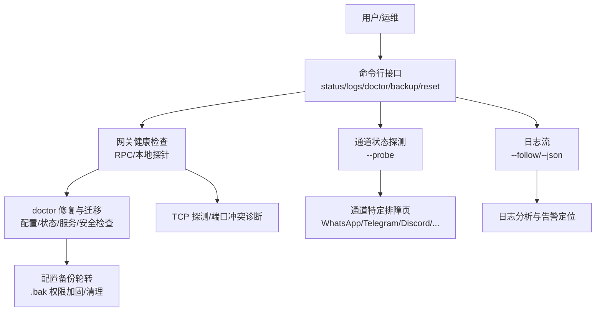
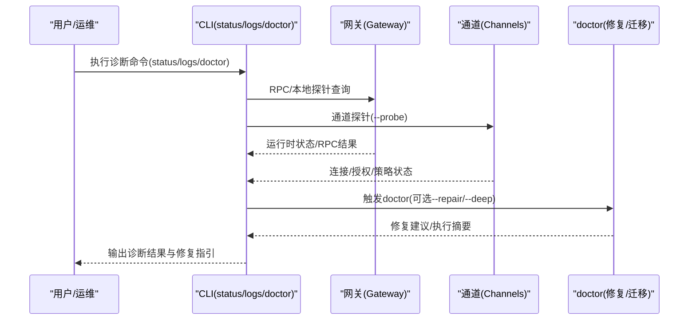
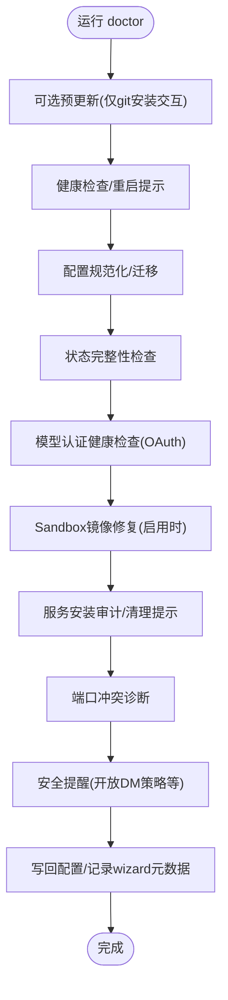
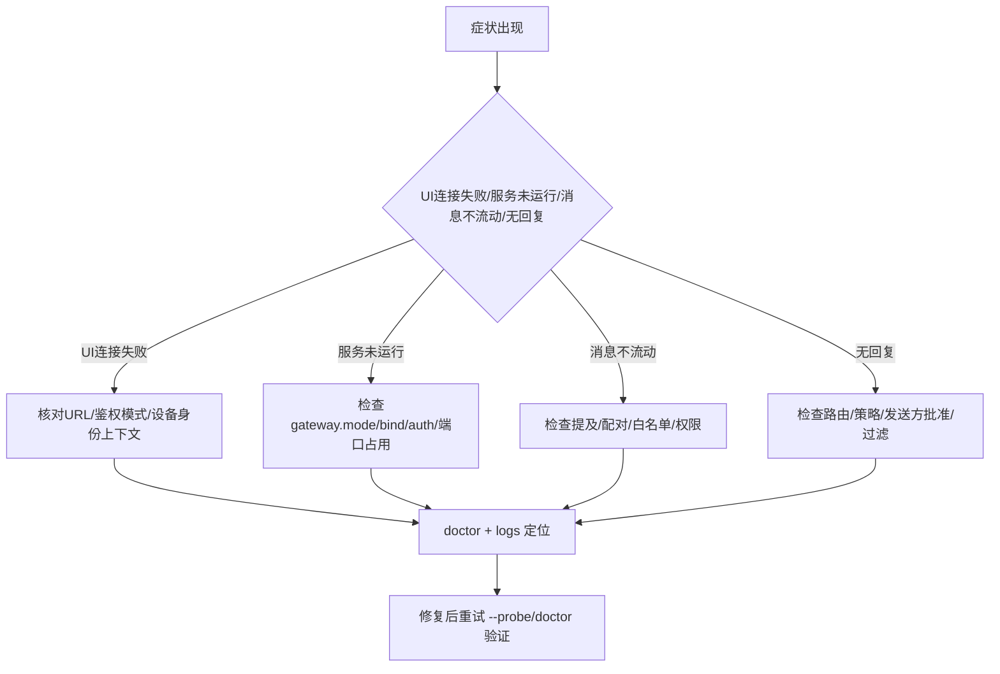
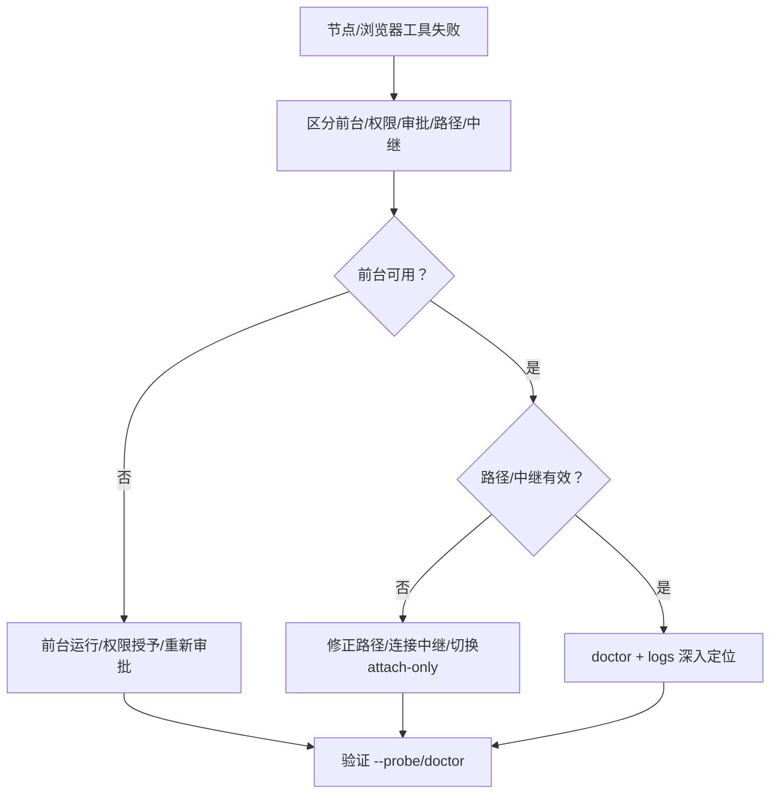
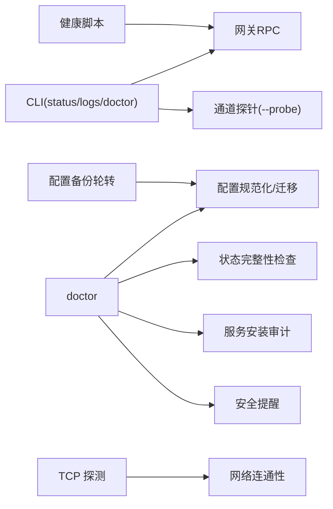

# 故障排除

## 目录
1. [简介](#简介)
2. [项目结构](#项目结构)
3. [核心组件](#核心组件)
4. [架构总览](#架构总览)
5. [详细组件分析](#详细组件分析)
6. [依赖关系分析](#依赖关系分析)
7. [性能考量](#性能考量)
8. [故障排除指南](#故障排除指南)
9. [结论](#结论)
10. [附录](#附录)

## 简介
本指南面向OpenClaw用户与运维人员，提供系统性的故障诊断与解决流程，覆盖网关连接失败、通道认证错误、代理响应异常、自动化任务未触发、节点工具调用失败、浏览器工具异常等常见问题。文档以“症状识别—根因分析—修复路径—验证确认”的闭环方法组织，并配套doctor命令、日志分析、网络连通性测试等诊断工具使用说明，以及紧急情况下的快速恢复方案（服务重启、配置回滚、临时降级）。

## 项目结构
OpenClaw的故障排除能力由多处文档与代码共同构成：
- 文档侧：帮助入口、网关/通道/节点/自动化等专项排障页，以及doctor命令参考页
- CLI侧：status、logs、doctor、backup、reset等命令用于诊断与恢复
- 运行时侧：状态目录完整性检查、配置备份轮转、TCP探测、健康检查脚本等

图表来源
- [docs/help/troubleshooting.md](file://docs/help/troubleshooting.md#L13-L25)
- [docs/gateway/troubleshooting.md](file://docs/gateway/troubleshooting.md#L14-L24)
- [docs/gateway/doctor.md](file://docs/gateway/doctor.md#L59-L84)
- [src/config/backup-rotation.ts](file://src/config/backup-rotation.ts#L115-L125)
- [apps/ios/Sources/Gateway/TCPProbe.swift](file://apps/ios/Sources/Gateway/TCPProbe.swift#L6-L41)

章节来源
- [docs/help/troubleshooting.md](file://docs/help/troubleshooting.md#L1-L298)
- [docs/gateway/troubleshooting.md](file://docs/gateway/troubleshooting.md#L1-L367)

## 核心组件
- 命令行诊断工具
  - status：概览网关、通道、会话与使用快照，支持深探针与全量输出
  - logs：远程尾随网关日志，支持JSON与本地时间显示
  - doctor：健康检查、配置迁移与修复、服务与安全检查、状态完整性校验
  - backup/reset：备份归档与重置，保障紧急回滚与最小化恢复
- 运行时诊断能力
  - 配置备份轮转：维护固定数量的.bak备份，权限加固与孤儿文件清理
  - TCP探测：对指定主机端口进行异步TCP连接探测，辅助网络连通性判断
  - 健康脚本：容器化环境中的启动等待与健康检查流程

章节来源
- [docs/cli/status.md](file://docs/cli/status.md#L9-L29)
- [docs/cli/logs.md](file://docs/cli/logs.md#L9-L29)
- [docs/cli/doctor.md](file://docs/cli/doctor.md#L9-L46)
- [docs/gateway/doctor.md](file://docs/gateway/doctor.md#L59-L84)
- [src/config/backup-rotation.ts](file://src/config/backup-rotation.ts#L16-L125)
- [apps/ios/Sources/Gateway/TCPProbe.swift](file://apps/ios/Sources/Gateway/TCPProbe.swift#L6-L41)
- [scripts/docker/install-sh-e2e/run.sh](file://scripts/docker/install-sh-e2e/run.sh#L451-L458)

## 架构总览
下图展示从用户发起诊断到关键修复动作的交互路径，强调doctor作为中枢协调器的角色。

图表来源
- [docs/help/troubleshooting.md](file://docs/help/troubleshooting.md#L13-L25)
- [docs/gateway/troubleshooting.md](file://docs/gateway/troubleshooting.md#L14-L24)
- [docs/gateway/doctor.md](file://docs/gateway/doctor.md#L14-L52)

## 详细组件分析

### doctor 命令与修复流程
- 能力范围：配置规范化、历史状态迁移、通道状态警告、服务安装审计、端口冲突诊断、sandbox镜像修复、安全提醒、模型认证健康检查等
- 交互模式：支持非交互(--non-interactive)、自动修复(--repair/--yes/--force)、深度扫描(--deep)
- 安全与权限：生成/校验网关令牌、严格处理SecretRef、权限加固与提示
- 服务治理：检测遗留服务、systemd/launchd/schtasks审计与修复

图表来源
- [docs/gateway/doctor.md](file://docs/gateway/doctor.md#L59-L84)
- [docs/gateway/doctor.md](file://docs/gateway/doctor.md#L113-L131)
- [docs/gateway/doctor.md](file://docs/gateway/doctor.md#L181-L212)
- [docs/gateway/doctor.md](file://docs/gateway/doctor.md#L231-L243)
- [docs/gateway/doctor.md](file://docs/gateway/doctor.md#L254-L274)
- [docs/gateway/doctor.md](file://docs/gateway/doctor.md#L285-L291)
- [docs/gateway/doctor.md](file://docs/gateway/doctor.md#L304-L318)
- [docs/gateway/doctor.md](file://docs/gateway/doctor.md#L319-L322)

章节来源
- [docs/cli/doctor.md](file://docs/cli/doctor.md#L9-L46)
- [docs/gateway/doctor.md](file://docs/gateway/doctor.md#L14-L52)

### 网关连接与通道认证排障
- 命令阶梯：status → gateway status → logs --follow → doctor → channels status --probe
- 健康信号：网关运行中且RPC探活成功；doctor无阻塞性问题；通道探活显示connected/ready
- 常见症状与定位
  - 控制面板/控制UI无法连接：URL/鉴权模式/设备身份上下文不匹配；nonce/signature相关错误
  - 服务未运行/启动即停：gateway.mode/local设置、绑定地址与鉴权缺失、端口占用
  - 消息不流动：提及要求、配对/白名单、频道权限缺失
  - 无回复：路由/策略、发送方待批准、过滤/允许列表
- 通道特定签名：Discord群组忽略消息、Telegram发送失败与DNS/IPv6/代理、WhatsApp断线重登

图表来源
- [docs/help/troubleshooting.md](file://docs/help/troubleshooting.md#L13-L25)
- [docs/gateway/troubleshooting.md](file://docs/gateway/troubleshooting.md#L14-L31)
- [docs/gateway/troubleshooting.md](file://docs/gateway/troubleshooting.md#L91-L137)
- [docs/gateway/troubleshooting.md](file://docs/gateway/troubleshooting.md#L139-L167)
- [docs/gateway/troubleshooting.md](file://docs/gateway/troubleshooting.md#L169-L198)
- [docs/gateway/troubleshooting.md](file://docs/gateway/troubleshooting.md#L61-L90)
- [docs/channels/troubleshooting.md](file://docs/channels/troubleshooting.md#L31-L54)

章节来源
- [docs/help/troubleshooting.md](file://docs/help/troubleshooting.md#L68-L298)
- [docs/gateway/troubleshooting.md](file://docs/gateway/troubleshooting.md#L1-L367)
- [docs/channels/troubleshooting.md](file://docs/channels/troubleshooting.md#L1-L118)

### 节点工具与浏览器工具排障
- 节点工具失败：前台限制、系统权限缺失、执行审批/白名单拒绝
- 浏览器工具失败：CDP端口启动失败、可执行路径无效、扩展中继未连接、attach-only不可达
- 快速恢复循环：重配对/前台/权限/执行审批

图表来源
- [docs/nodes/troubleshooting.md](file://docs/nodes/troubleshooting.md#L37-L49)
- [docs/nodes/troubleshooting.md](file://docs/nodes/troubleshooting.md#L79-L91)
- [docs/nodes/troubleshooting.md](file://docs/nodes/troubleshooting.md#L92-L107)
- [docs/gateway/troubleshooting.md](file://docs/gateway/troubleshooting.md#L263-L293)

章节来源
- [docs/nodes/troubleshooting.md](file://docs/nodes/troubleshooting.md#L1-L115)
- [docs/gateway/troubleshooting.md](file://docs/gateway/troubleshooting.md#L263-L293)

### 自动化与心跳排障
- 关注点：调度器启用与下次唤醒、作业历史状态、静默时段/并发限制/目标账户有效性
- 常见签名：调度器禁用、心跳被跳过(静默时段/请求在途/告警关闭)、未知账户ID

章节来源
- [docs/gateway/troubleshooting.md](file://docs/gateway/troubleshooting.md#L200-L235)

## 依赖关系分析
- CLI命令依赖网关RPC与通道探针，doctor在健康检查基础上叠加配置/状态/服务/安全检查
- 配置备份轮转在doctor写回配置前后执行，确保.bak权限与轮转一致性
- TCP探测与健康脚本用于网络连通性与启动等待，支撑UI与自动化场景

图表来源
- [docs/gateway/doctor.md](file://docs/gateway/doctor.md#L59-L84)
- [src/config/backup-rotation.ts](file://src/config/backup-rotation.ts#L115-L125)
- [apps/ios/Sources/Gateway/TCPProbe.swift](file://apps/ios/Sources/Gateway/TCPProbe.swift#L6-L41)
- [scripts/docker/install-sh-e2e/run.sh](file://scripts/docker/install-sh-e2e/run.sh#L451-L458)

章节来源
- [src/config/backup-rotation.ts](file://src/config/backup-rotation.ts#L16-L125)
- [apps/ios/Sources/Gateway/TCPProbe.swift](file://apps/ios/Sources/Gateway/TCPProbe.swift#L6-L41)
- [scripts/docker/install-sh-e2e/run.sh](file://scripts/docker/install-sh-e2e/run.sh#L451-L458)

## 性能考量
- 备份体积与压缩耗时受工作区规模影响，可通过仅备份配置或禁用工作区备份降低开销
- doctor在非交互模式下跳过需要人工确认的修复步骤，减少等待时间
- 日志尾随与JSON输出便于工具链集成，但需注意I/O与带宽占用

章节来源
- [docs/cli/backup.md](file://docs/cli/backup.md#L63-L77)
- [docs/gateway/doctor.md](file://docs/gateway/doctor.md#L40-L44)
- [docs/cli/logs.md](file://docs/cli/logs.md#L17-L29)

## 故障排除指南

### 系统性诊断流程
- 第一步：快速三板斧
  - 运行 status、gateway status、logs --follow，观察运行态与日志连续性
  - 执行 doctor，查看阻塞性问题与修复建议
  - 使用 channels status --probe 检查通道连接/就绪状态
- 第二步：症状归类与专项排查
  - 参考帮助入口决策树，按“无回复/控制UI连接失败/网关未运行/通道消息不流动/自动化未触发/节点工具失败/浏览器工具失败”分类
  - 对应专项排障页执行针对性命令与检查
- 第三步：根因定位与修复
  - 结合doctor输出、日志关键词与通道特定签名，定位配置/鉴权/权限/策略/网络等问题
  - 应用修复：doctor --repair、调整配置、补充权限、重配对/重审批
- 第四步：验证与回归
  - 重复第一步的关键命令，确认症状消除
  - 对自动化场景，检查cron/heartbeat运行历史

章节来源
- [docs/help/troubleshooting.md](file://docs/help/troubleshooting.md#L13-L25)
- [docs/help/troubleshooting.md](file://docs/help/troubleshooting.md#L68-L88)
- [docs/gateway/troubleshooting.md](file://docs/gateway/troubleshooting.md#L14-L31)

### 常见问题与解决步骤

- 网关连接失败/控制UI无法连接
  - 检查URL/鉴权模式/设备身份上下文；若出现nonce/signature相关错误，确保客户端完成挑战式设备鉴权流程
  - 若为远程模式，确认gateway.remote.url正确，或切换为本地模式
  - 使用doctor进行服务与鉴权检查，必要时生成网关令牌

- 通道认证错误/权限缺失
  - 检查提及要求、配对/白名单、频道权限范围
  - 通道特定：WhatsApp断线重登、Telegram DNS/IPv6/代理、Discord群组requireMention、Slack应用/机器人令牌与scope

- 代理响应异常/消息不流动
  - 核对路由/策略、发送方批准状态、过滤/允许列表
  - 使用doctor与logs定位具体错误码与上下文

- 自动化任务未触发/未送达
  - 检查调度器启用与下次唤醒、作业历史状态、静默时段/并发限制/目标账户有效性
  - 通过cron status/list/runs与logs定位原因

- 节点工具失败（相机/画布/屏幕/系统执行）
  - 前台限制、系统权限缺失、执行审批/白名单拒绝
  - 重配对/前台/权限/执行审批，必要时调整策略

- 浏览器工具失败
  - CDP端口启动失败、可执行路径无效、扩展中继未连接、attach-only不可达
  - 修正路径/连接中继/切换attach-only

- 升级后功能异常
  - 检查gateway.mode、gateway.remote.url、gateway.auth.mode与bind/auth约束
  - 设备身份/配对状态变更导致的pending状态
  - 必要时强制重装服务元数据并重启

章节来源
- [docs/gateway/troubleshooting.md](file://docs/gateway/troubleshooting.md#L91-L137)
- [docs/gateway/troubleshooting.md](file://docs/gateway/troubleshooting.md#L139-L167)
- [docs/gateway/troubleshooting.md](file://docs/gateway/troubleshooting.md#L169-L198)
- [docs/gateway/troubleshooting.md](file://docs/gateway/troubleshooting.md#L200-L235)
- [docs/nodes/troubleshooting.md](file://docs/nodes/troubleshooting.md#L37-L49)
- [docs/nodes/troubleshooting.md](file://docs/nodes/troubleshooting.md#L79-L91)
- [docs/gateway/troubleshooting.md](file://docs/gateway/troubleshooting.md#L263-L293)
- [docs/channels/troubleshooting.md](file://docs/channels/troubleshooting.md#L31-L54)
- [docs/gateway/troubleshooting.md](file://docs/gateway/troubleshooting.md#L294-L360)

### 诊断工具使用

- doctor
  - 基本用法：openclaw doctor；非交互：openclaw doctor --non-interactive；自动修复：openclaw doctor --repair/--yes/--force；深度扫描：openclaw doctor --deep
  - 注意事项：TTY交互与headless行为差异；--fix会备份并移除未知配置键；可检测并修复sandbox、cron旧格式、状态目录完整性等

- logs
  - openclaw logs --follow/--json/--limit/--local-time；用于远程查看与工具链解析

- status
  - openclaw status；openclaw status --all；openclaw status --deep；openclaw status --usage；用于概览与深探针

- backup/reset
  - openclaw backup create/--verify/--only-config/--no-include-workspace；openclaw reset/--dry-run/--scope/--yes/--non-interactive
  - 重要：reset前务必先备份，避免不可逆的数据丢失

章节来源
- [docs/cli/doctor.md](file://docs/cli/doctor.md#L9-L46)
- [docs/gateway/doctor.md](file://docs/gateway/doctor.md#L14-L52)
- [docs/cli/logs.md](file://docs/cli/logs.md#L9-L29)
- [docs/cli/status.md](file://docs/cli/status.md#L9-L29)
- [docs/cli/backup.md](file://docs/cli/backup.md#L9-L77)
- [docs/cli/reset.md](file://docs/cli/reset.md#L9-L21)

### 紧急恢复方案
- 服务重启
  - doctor触发健康检查与重启提示；必要时手动重启服务或进程
- 配置回滚
  - 利用.bak轮转备份进行回滚；doctor写回配置前会维护轮转与权限
- 临时降级
  - 降低通道策略（如放宽提及/允许列表）、关闭高风险策略（如开放DM），待问题解决后再恢复
- 重装服务元数据
  - 在升级后配置/运行态不一致时，执行gateway install --force并重启

章节来源
- [src/config/backup-rotation.ts](file://src/config/backup-rotation.ts#L115-L125)
- [docs/gateway/doctor.md](file://docs/gateway/doctor.md#L285-L291)
- [docs/gateway/troubleshooting.md](file://docs/gateway/troubleshooting.md#L355-L360)

### 问题报告模板与社区支持
- 问题报告模板
  - 环境信息：OpenClaw版本、操作系统、安装方式（源码/包管理器/Docker/Podman）
  - 复现步骤：最小化复现命令与顺序
  - 期望行为与实际行为
  - 诊断输出：status --all、gateway status、logs --follow --limit 500 的关键片段
  - doctor输出与doctor --deep结果
  - 通道探针：channels status --probe
  - 其他：浏览器/节点相关附加信息
- 社区支持渠道
  - Discord支持：加入OpenClaw社区，在#help获取帮助与引导

章节来源
- [.github/ISSUE_TEMPLATE/config.yml](file://.github/ISSUE_TEMPLATE/config.yml#L1-L8)

## 结论
通过“命令阶梯+症状归类+专项排障+doctor修复+验证确认”的闭环流程，大多数OpenClaw故障可在短时间内定位并修复。建议在日常运维中定期运行doctor与status，保持配置与状态整洁；在升级或大规模变更前先行备份，以便快速回滚。遇到疑难问题时，结合日志与通道特定签名，配合社区支持渠道，通常能高效获得解决方案。

## 附录

### 诊断命令速查
- 快速三板斧：status → gateway status → logs --follow → doctor → channels status --probe
- 日志：openclaw logs --follow/--json/--limit/--local-time
- 诊断：openclaw status --all/--deep；openclaw doctor --repair/--deep
- 备份/重置：openclaw backup create/--verify/--only-config；openclaw reset/--dry-run/--scope

章节来源
- [docs/help/troubleshooting.md](file://docs/help/troubleshooting.md#L13-L25)
- [docs/cli/logs.md](file://docs/cli/logs.md#L17-L29)
- [docs/cli/status.md](file://docs/cli/status.md#L13-L29)
- [docs/cli/doctor.md](file://docs/cli/doctor.md#L18-L24)
- [docs/cli/backup.md](file://docs/cli/backup.md#L13-L21)
- [docs/cli/reset.md](file://docs/cli/reset.md#L13-L18)

### 网络连通性测试
- TCP探测：对网关监听地址与端口进行异步TCP连接探测，辅助判断端口可达性与超时
- 健康脚本：容器化环境等待网关健康，避免误判

章节来源
- [apps/ios/Sources/Gateway/TCPProbe.swift](file://apps/ios/Sources/Gateway/TCPProbe.swift#L6-L41)
- [scripts/docker/install-sh-e2e/run.sh](file://scripts/docker/install-sh-e2e/run.sh#L451-L458)

### 开发调试提示
- Node + tsx “__name is not a function”崩溃：当前开发脚本建议使用Bun或tsc watch+编译产物运行，避免tsx在Node 25路径下的名称保留问题

章节来源
- [docs/debug/node-issue.md](file://docs/debug/node-issue.md#L11-L22)
- [docs/debug/node-issue.md](file://docs/debug/node-issue.md#L61-L73)