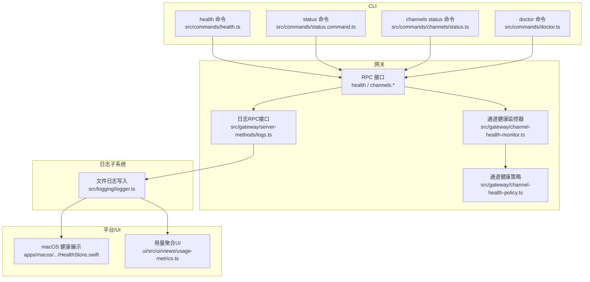
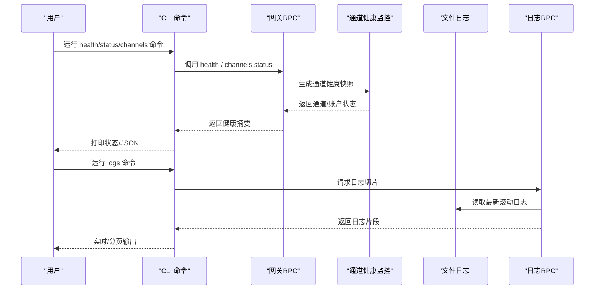
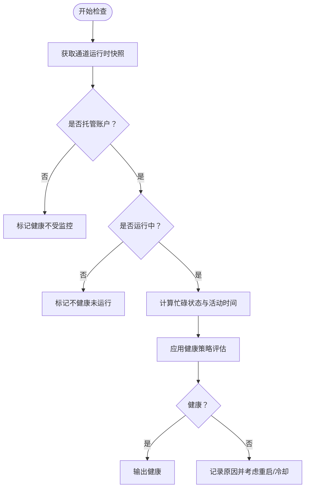
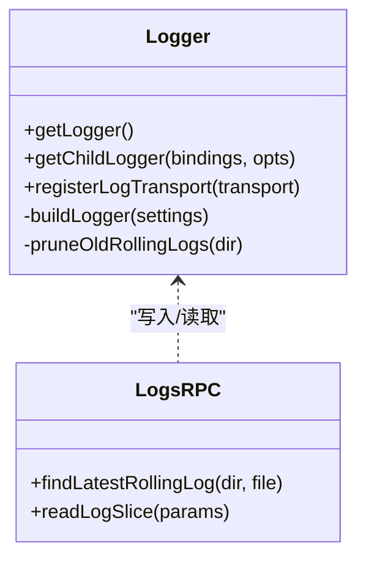
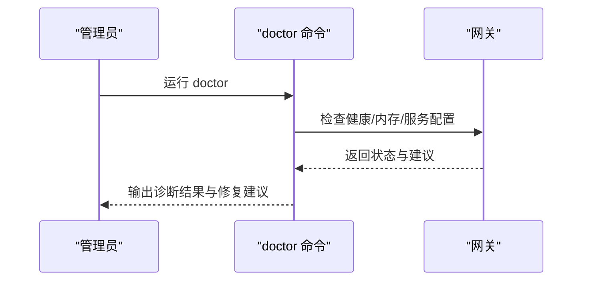
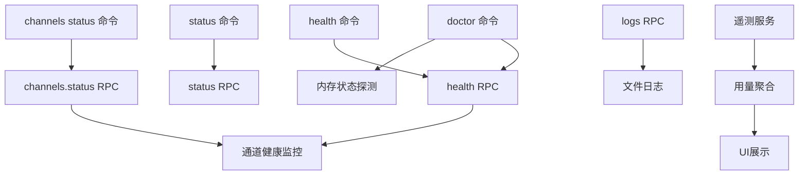

# 监控和日志

## 目录
1. [简介](#简介)
2. [项目结构](#项目结构)
3. [核心组件](#核心组件)
4. [架构总览](#架构总览)
5. [详细组件分析](#详细组件分析)
6. [依赖关系分析](#依赖关系分析)
7. [性能考量](#性能考量)
8. [故障排查指南](#故障排查指南)
9. [结论](#结论)
10. [附录](#附录)

## 简介
本运维指南面向OpenClaw的监控与日志体系，覆盖以下主题：
- 健康检查机制：网关可达性、通道连接状态、代理运行状况、通道健康评分与重启策略
- 日志系统：配置项、输出格式、滚动与清理策略、远程查看
- 性能监控：内存、CPU、网络延迟等指标采集与聚合
- 诊断工具：doctor命令、健康检查端点、调试模式
- 高级监控：告警配置、日志聚合、远程监控集成

## 项目结构
围绕监控与日志的关键目录与文件：
- 日志子系统：src/logging（文件日志、控制台格式化、外部传输）
- 网关RPC日志接口：src/gateway/server-methods/logs.ts（日志切片读取、最近日志定位）
- CLI健康与状态：src/commands/health.ts、src/commands/status.command.ts、src/commands/channels/status.ts
- 通道健康监测：src/gateway/channel-health-monitor.ts、src/gateway/channel-health-policy.ts
- 平台侧健康展示：apps/macos/Sources/OpenClaw/HealthStore.swift
- 文档参考：docs/gateway/logging.md、docs/cli/logs.md、docs/gateway/health.md、docs/cli/health.md
- 性能与遥测：extensions/diagnostics-otel/src/service.ts、src/shared/usage-aggregates.ts、ui/src/ui/views/usage-metrics.ts
- 告警与失败通知：src/cli/cron-cli/register.cron-edit.ts
- 配置校验与会话维护：src/config/logging-max-file-bytes.test.ts、src/config/sessions/store-maintenance.ts
- 测试与契约：src/gateway/server.channels.test.ts

**图表来源**
- [src/commands/health.ts](file://src/commands/health.ts#L525-L546)
- [src/commands/status.command.ts](file://src/commands/status.command.ts#L318-L358)
- [src/commands/channels/status.ts](file://src/commands/channels/status.ts#L279-L322)
- [src/gateway/channel-health-monitor.ts](file://src/gateway/channel-health-monitor.ts#L76-L111)
- [src/gateway/channel-health-policy.ts](file://src/gateway/channel-health-policy.ts#L57-L81)
- [src/gateway/server-methods/logs.ts](file://src/gateway/server-methods/logs.ts#L38-L79)
- [src/logging/logger.ts](file://src/logging/logger.ts#L126-L184)
- [apps/macos/Sources/OpenClaw/HealthStore.swift](file://apps/macos/Sources/OpenClaw/HealthStore.swift#L147-L163)
- [ui/src/ui/views/usage-metrics.ts](file://ui/src/ui/views/usage-metrics.ts#L407-L431)

**章节来源**
- [src/logging/logger.ts](file://src/logging/logger.ts#L1-L348)
- [src/gateway/server-methods/logs.ts](file://src/gateway/server-methods/logs.ts#L38-L79)
- [docs/gateway/logging.md](file://docs/gateway/logging.md#L1-L114)
- [docs/cli/logs.md](file://docs/cli/logs.md#L1-L29)
- [docs/gateway/health.md](file://docs/gateway/health.md#L1-L36)
- [docs/cli/health.md](file://docs/cli/health.md#L1-L22)
- [src/commands/health.ts](file://src/commands/health.ts#L525-L546)
- [src/commands/status.command.ts](file://src/commands/status.command.ts#L318-L358)
- [src/commands/channels/status.ts](file://src/commands/channels/status.ts#L279-L322)
- [src/gateway/channel-health-monitor.ts](file://src/gateway/channel-health-monitor.ts#L76-L111)
- [src/gateway/channel-health-policy.ts](file://src/gateway/channel-health-policy.ts#L57-L81)
- [apps/macos/Sources/OpenClaw/HealthStore.swift](file://apps/macos/Sources/OpenClaw/HealthStore.swift#L147-L163)
- [src/commands/doctor.ts](file://src/commands/doctor.ts#L316-L327)
- [extensions/diagnostics-otel/src/service.ts](file://extensions/diagnostics-otel/src/service.ts#L170-L203)
- [src/shared/usage-aggregates.ts](file://src/shared/usage-aggregates.ts#L32-L109)
- [ui/src/ui/views/usage-metrics.ts](file://ui/src/ui/views/usage-metrics.ts#L407-L431)
- [src/cli/cron-cli/register.cron-edit.ts](file://src/cli/cron-cli/register.cron-edit.ts#L301-L335)
- [src/config/logging-max-file-bytes.test.ts](file://src/config/logging-max-file-bytes.test.ts#L1-L25)
- [src/config/sessions/store-maintenance.ts](file://src/config/sessions/store-maintenance.ts#L38-L78)
- [src/gateway/server.channels.test.ts](file://src/gateway/server.channels.test.ts#L105-L142)

## 核心组件
- 文件日志与滚动：基于时间的滚动文件名、大小上限、过期清理；支持外部传输注入
- 网关日志RPC：按游标与限制读取日志切片，支持本地时间显示
- 健康检查RPC：返回通道与代理状态快照，支持深度探测
- 通道健康监控：周期性检查、冷却与重启次数限制、启动宽限期
- 诊断工具doctor：综合检查网关健康、内存状态、服务配置、安全与工作区建议
- 性能与遥测：计数器与直方图指标（令牌、成本、时延、消息队列等），UI聚合展示
- 告警配置：失败告警参数（触发阈值、频道、收件人、冷却、模式、账号）

**章节来源**
- [src/logging/logger.ts](file://src/logging/logger.ts#L15-L106)
- [src/gateway/server-methods/logs.ts](file://src/gateway/server-methods/logs.ts#L53-L79)
- [src/commands/health.ts](file://src/commands/health.ts#L525-L546)
- [src/gateway/channel-health-monitor.ts](file://src/gateway/channel-health-monitor.ts#L76-L111)
- [src/commands/doctor.ts](file://src/commands/doctor.ts#L316-L327)
- [extensions/diagnostics-otel/src/service.ts](file://extensions/diagnostics-otel/src/service.ts#L170-L203)
- [src/cli/cron-cli/register.cron-edit.ts](file://src/cli/cron-cli/register.cron-edit.ts#L301-L335)

## 架构总览
下图展示了从CLI到网关RPC、再到日志与健康监控的整体流程。

**图表来源**
- [src/commands/health.ts](file://src/commands/health.ts#L525-L546)
- [src/commands/status.command.ts](file://src/commands/status.command.ts#L318-L358)
- [src/commands/channels/status.ts](file://src/commands/channels/status.ts#L279-L322)
- [src/gateway/channel-health-monitor.ts](file://src/gateway/channel-health-monitor.ts#L76-L111)
- [src/gateway/server-methods/logs.ts](file://src/gateway/server-methods/logs.ts#L38-L79)
- [src/logging/logger.ts](file://src/logging/logger.ts#L126-L184)

## 详细组件分析

### 健康检查机制
- 网关健康端点：CLI通过RPC调用获取健康快照，支持深度探测与超时控制
- 通道健康监控：周期性抓取运行时快照，评估忙碌/活跃度、启动与活动时间、重启冷却与小时限流
- 通道健康策略：根据账户托管状态、运行中标志、活跃运行数、最后活动时间等判定健康
- macOS健康展示：对通道探针进行超时与错误解析，给出可读描述

**图表来源**
- [src/gateway/channel-health-monitor.ts](file://src/gateway/channel-health-monitor.ts#L99-L111)
- [src/gateway/channel-health-policy.ts](file://src/gateway/channel-health-policy.ts#L57-L81)
- [apps/macos/Sources/OpenClaw/HealthStore.swift](file://apps/macos/Sources/OpenClaw/HealthStore.swift#L147-L163)

**章节来源**
- [src/commands/health.ts](file://src/commands/health.ts#L525-L546)
- [src/commands/status.command.ts](file://src/commands/status.command.ts#L318-L358)
- [src/gateway/channel-health-monitor.ts](file://src/gateway/channel-health-monitor.ts#L76-L111)
- [src/gateway/channel-health-policy.ts](file://src/gateway/channel-health-policy.ts#L57-L81)
- [apps/macos/Sources/OpenClaw/HealthStore.swift](file://apps/macos/Sources/OpenClaw/HealthStore.swift#L147-L163)

### 日志系统
- 文件日志：默认滚动文件位于临时目录，按日期命名；支持最大文件字节上限与过期清理
- 控制台与WS日志：独立的日志级别与样式；WS在非verbose模式下仅打印慢调用/错误
- 日志RPC：按游标与限制读取日志切片，支持本地时间显示
- 配置与校验：支持maxFileBytes正数校验；会话存储维护包含旋转字节与保留期

**图表来源**
- [src/logging/logger.ts](file://src/logging/logger.ts#L126-L184)
- [src/logging/logger.ts](file://src/logging/logger.ts#L323-L347)
- [src/gateway/server-methods/logs.ts](file://src/gateway/server-methods/logs.ts#L38-L79)

**章节来源**
- [src/logging/logger.ts](file://src/logging/logger.ts#L15-L106)
- [src/logging/logger.ts](file://src/logging/logger.ts#L126-L184)
- [src/logging/logger.ts](file://src/logging/logger.ts#L323-L347)
- [src/gateway/server-methods/logs.ts](file://src/gateway/server-methods/logs.ts#L38-L79)
- [docs/gateway/logging.md](file://docs/gateway/logging.md#L1-L114)
- [docs/cli/logs.md](file://docs/cli/logs.md#L1-L29)
- [src/config/logging-max-file-bytes.test.ts](file://src/config/logging-max-file-bytes.test.ts#L1-L25)
- [src/config/sessions/store-maintenance.ts](file://src/config/sessions/store-maintenance.ts#L38-L78)

### 性能监控与指标
- 遥测指标：令牌计数、成本计数、运行时长直方图、上下文大小直方图、Webhook接收/错误/时延、消息队列/处理计数
- 用量聚合：按渠道、模型、代理、每日维度合并统计与延迟
- UI展示：前端聚合用量数据，支持按提供商/模型排序

**图表来源**
- [extensions/diagnostics-otel/src/service.ts](file://extensions/diagnostics-otel/src/service.ts#L170-L203)
- [src/shared/usage-aggregates.ts](file://src/shared/usage-aggregates.ts#L32-L109)
- [ui/src/ui/views/usage-metrics.ts](file://ui/src/ui/views/usage-metrics.ts#L407-L431)

**章节来源**
- [extensions/diagnostics-otel/src/service.ts](file://extensions/diagnostics-otel/src/service.ts#L170-L203)
- [src/shared/usage-aggregates.ts](file://src/shared/usage-aggregates.ts#L32-L109)
- [ui/src/ui/views/usage-metrics.ts](file://ui/src/ui/views/usage-metrics.ts#L407-L431)

### 诊断工具与健康端点
- doctor命令：综合检查网关健康、内存状态、服务配置、安全与工作区建议；可交互或非交互模式
- 健康端点：CLI health调用网关health RPC，返回通道/代理/会话摘要；支持JSON输出
- 深度诊断：channels.status支持探测模式，status命令在深/全模式下输出心跳与会话详情

**图表来源**
- [src/commands/doctor.ts](file://src/commands/doctor.ts#L316-L327)
- [src/commands/health.ts](file://src/commands/health.ts#L525-L546)
- [src/commands/status.command.ts](file://src/commands/status.command.ts#L318-L358)

**章节来源**
- [src/commands/doctor.ts](file://src/commands/doctor.ts#L316-L327)
- [src/commands/health.ts](file://src/commands/health.ts#L525-L546)
- [src/commands/status.command.ts](file://src/commands/status.command.ts#L318-L358)
- [docs/gateway/health.md](file://docs/gateway/health.md#L1-L36)
- [docs/cli/health.md](file://docs/cli/health.md#L1-L22)

### 告警与远程监控
- 失败告警配置：支持触发阈值、频道、收件人、冷却时间、模式（公告/回发）、账号等参数
- 远程日志：CLI logs通过RPC远程查看网关滚动日志，支持follow与本地时间
- 健康快照：channels.status在探测模式下返回通道配置/连接/探针信息

**章节来源**
- [src/cli/cron-cli/register.cron-edit.ts](file://src/cli/cron-cli/register.cron-edit.ts#L301-L335)
- [docs/cli/logs.md](file://docs/cli/logs.md#L1-L29)
- [src/gateway/server-methods/logs.ts](file://src/gateway/server-methods/logs.ts#L38-L79)
- [src/gateway/server.channels.test.ts](file://src/gateway/server.channels.test.ts#L105-L142)

## 依赖关系分析
- CLI命令依赖网关RPC以获取健康与状态；日志RPC依赖文件日志写入
- 通道健康监控依赖通道管理器快照与策略评估
- 遥测服务与用量聚合相互协作，UI消费聚合结果
- doctor命令依赖网关健康探测与内存状态探测

**图表来源**
- [src/commands/health.ts](file://src/commands/health.ts#L525-L546)
- [src/commands/status.command.ts](file://src/commands/status.command.ts#L318-L358)
- [src/commands/channels/status.ts](file://src/commands/channels/status.ts#L279-L322)
- [src/gateway/channel-health-monitor.ts](file://src/gateway/channel-health-monitor.ts#L76-L111)
- [src/gateway/server-methods/logs.ts](file://src/gateway/server-methods/logs.ts#L38-L79)
- [src/commands/doctor.ts](file://src/commands/doctor.ts#L316-L327)
- [extensions/diagnostics-otel/src/service.ts](file://extensions/diagnostics-otel/src/service.ts#L170-L203)
- [src/shared/usage-aggregates.ts](file://src/shared/usage-aggregates.ts#L32-L109)
- [ui/src/ui/views/usage-metrics.ts](file://ui/src/ui/views/usage-metrics.ts#L407-L431)

**章节来源**
- [src/commands/health.ts](file://src/commands/health.ts#L525-L546)
- [src/commands/status.command.ts](file://src/commands/status.command.ts#L318-L358)
- [src/commands/channels/status.ts](file://src/commands/channels/status.ts#L279-L322)
- [src/gateway/channel-health-monitor.ts](file://src/gateway/channel-health-monitor.ts#L76-L111)
- [src/gateway/server-methods/logs.ts](file://src/gateway/server-methods/logs.ts#L38-L79)
- [src/commands/doctor.ts](file://src/commands/doctor.ts#L316-L327)
- [extensions/diagnostics-otel/src/service.ts](file://extensions/diagnostics-otel/src/service.ts#L170-L203)
- [src/shared/usage-aggregates.ts](file://src/shared/usage-aggregates.ts#L32-L109)
- [ui/src/ui/views/usage-metrics.ts](file://ui/src/ui/views/usage-metrics.ts#L407-L431)

## 性能考量
- 日志写入：当达到文件大小上限时抑制写入并输出警告，避免磁盘写阻塞
- 滚动与清理：按24小时清理过期滚动日志，减少磁盘占用
- 通道健康监控：引入启动宽限期、冷却周期与每小时重启上限，防止抖动
- 遥测开销：指标计数与直方图仅在启用时产生，避免不必要的性能损耗
- CLI超时：健康与状态命令支持超时参数，避免长时间阻塞

**章节来源**
- [src/logging/logger.ts](file://src/logging/logger.ts#L149-L184)
- [src/logging/logger.ts](file://src/logging/logger.ts#L323-L347)
- [src/gateway/channel-health-monitor.ts](file://src/gateway/channel-health-monitor.ts#L76-L111)
- [extensions/diagnostics-otel/src/service.ts](file://extensions/diagnostics-otel/src/service.ts#L170-L203)
- [src/commands/health.ts](file://src/commands/health.ts#L525-L546)

## 故障排查指南
- 快速诊断
  - 使用status与health命令获取网关可达性、心跳、会话与通道摘要
  - 在深模式下启用通道探针，观察连接/运行/最近收发时间
- 日志查看
  - 通过logs命令远程查看滚动日志，结合--follow与--local-time
  - 关注网关WebSocket日志中的慢调用与错误
- 通道问题
  - 检查通道配置、令牌来源、探针结果与最近活动时间
  - 若出现“已登出/409–515”，执行通道登出与重新登录流程
- 网关健康
  - doctor命令自动检查内存状态、服务配置与工作区建议
  - 如需生成网关令牌，可在doctor引导下完成配置
- 告警与回发
  - 通过cron编辑命令配置失败告警的阈值、频道、收件人、冷却与模式

**章节来源**
- [docs/gateway/health.md](file://docs/gateway/health.md#L1-L36)
- [docs/cli/health.md](file://docs/cli/health.md#L1-L22)
- [docs/cli/logs.md](file://docs/cli/logs.md#L1-L29)
- [src/commands/health.ts](file://src/commands/health.ts#L525-L546)
- [src/commands/channels/status.ts](file://src/commands/channels/status.ts#L279-L322)
- [src/commands/doctor.ts](file://src/commands/doctor.ts#L316-L327)
- [src/cli/cron-cli/register.cron-edit.ts](file://src/cli/cron-cli/register.cron-edit.ts#L301-L335)

## 结论
OpenClaw提供了完善的监控与日志基础设施：通过CLI与网关RPC实现健康与状态可视化，借助滚动日志与远程查看保障可观测性，配合通道健康监控与doctor诊断工具形成闭环。结合遥测指标与UI聚合，可有效支撑性能分析与告警配置，满足生产环境的运维需求。

## 附录
- 配置参考
  - 日志级别与文件路径：参见文档与配置校验测试
  - 会话存储维护：旋转字节与归档保留期解析逻辑
- 测试契约
  - 通道状态RPC在关闭探针时不应包含探针字段
  - 日志RPC返回空文件时应返回默认行为

**章节来源**
- [docs/gateway/logging.md](file://docs/gateway/logging.md#L1-L114)
- [src/config/logging-max-file-bytes.test.ts](file://src/config/logging-max-file-bytes.test.ts#L1-L25)
- [src/config/sessions/store-maintenance.ts](file://src/config/sessions/store-maintenance.ts#L38-L78)
- [src/gateway/server.channels.test.ts](file://src/gateway/server.channels.test.ts#L105-L142)