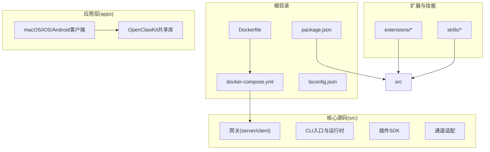
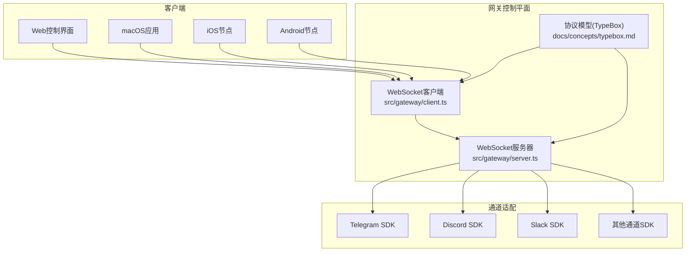
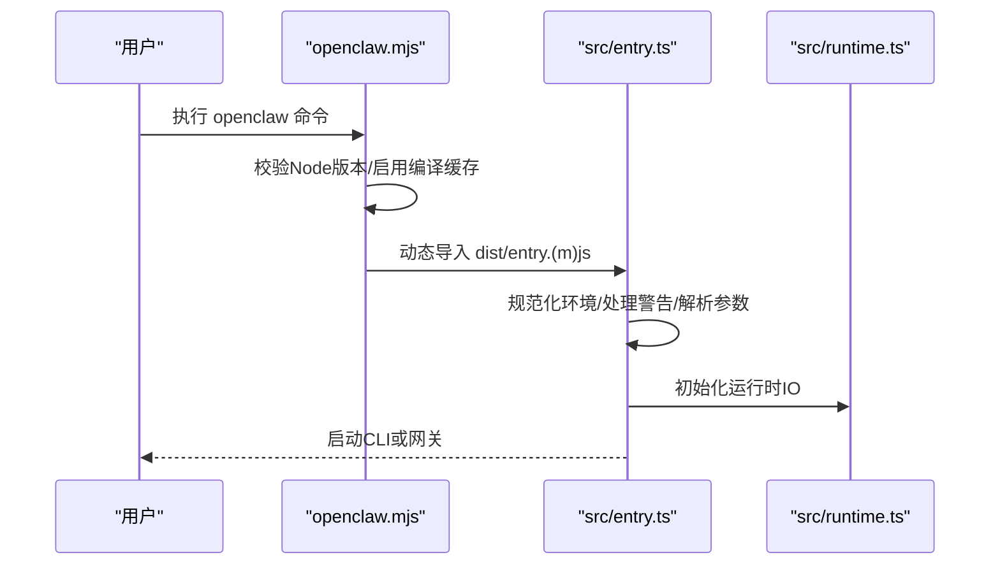
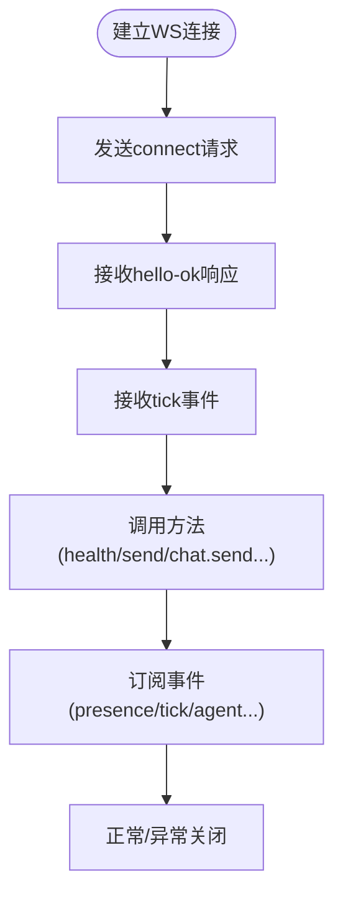
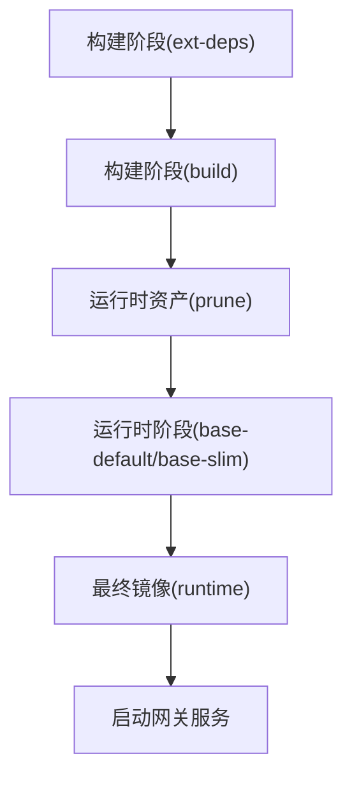
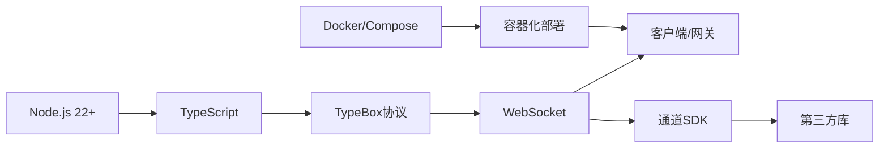

# 技术栈

## 目录
1. [简介](#简介)
2. [项目结构](#项目结构)
3. [核心组件](#核心组件)
4. [架构总览](#架构总览)
5. [详细组件分析](#详细组件分析)
6. [依赖关系分析](#依赖关系分析)
7. [性能考量](#性能考量)
8. [故障排查指南](#故障排查指南)
9. [结论](#结论)
10. [附录](#附录)

## 简介
本技术栈文档面向OpenClaw项目，系统性梳理其核心技术与框架选型，重点覆盖以下方面：
- 运行时与语言：Node.js 22+ 作为主运行时，TypeScript 作为主要开发语言，配合编译缓存与快速启动策略。
- 协议与通信：以WebSocket为核心的网关控制平面，使用统一的TypeBox协议模型，确保跨平台一致性。
- 容器化与部署：基于Docker多阶段构建与Compose编排，提供安全、可复现的运行环境。
- 开发工具链：pnpm工作区、TypeScript编译、测试（Vitest）、脚本工具链与持续集成支持。
- 第三方库与依赖：涵盖消息通道SDK、HTTP服务、WebSocket、日志、类型校验与构建工具等。

## 项目结构
OpenClaw采用多模块仓库组织方式，核心目录与职责概览：
- 根目录：包管理、Docker镜像构建、脚本与文档入口
- src：核心业务逻辑（网关、CLI、通道适配、插件SDK等）
- extensions：可插拔扩展生态
- skills：技能与工具集合
- apps：跨平台客户端（macOS/iOS/Android）与共享库
- docs：官方文档与安装指南
- scripts：构建、测试、发布与运维脚本

图表来源
- [package.json](file://package.json#L1-L458)
- [Dockerfile](file://Dockerfile#L1-L231)
- [docker-compose.yml](file://docker-compose.yml#L1-L77)

章节来源
- [README.md](file://README.md#L1-L560)
- [package.json](file://package.json#L1-L458)

## 核心组件
- Node.js运行时与版本要求
  - 最低版本：Node.js 22.12+，通过启动脚本进行严格校验，不满足则提示使用nvm切换。
  - 启动流程：wrapper(openclaw.mjs) → entry(src/entry.ts) → CLI/网关运行时。
  - 编译缓存：启用模块编译缓存以提升启动速度。
- TypeScript语言与构建
  - 目标：ES2023，模块解析：NodeNext；严格模式；路径映射；声明输出。
  - 构建：tsdown驱动的TypeScript构建流水线，生成dist产物供Node直接运行。
- WebSocket网关协议
  - 控制平面：单点WS连接承载方法调用、事件订阅与心跳。
  - 协议模型：TypeBox定义请求/响应/事件帧，跨平台生成Swift代码。
- 容器化与部署
  - 多阶段Dockerfile：分离构建与运行时，最小化镜像体积。
  - Compose编排：网关服务+CLI服务，健康检查与端口暴露。
- 插件与扩展生态
  - 插件SDK：统一导出路径与类型定义，便于第三方扩展接入。
  - 扩展：按需预装依赖，支持动态加载与版本同步。

章节来源
- [openclaw.mjs](file://openclaw.mjs#L1-L90)
- [src/entry.ts](file://src/entry.ts#L1-L195)
- [src/runtime.ts](file://src/runtime.ts#L1-L54)
- [tsconfig.json](file://tsconfig.json#L1-L29)
- [docs/concepts/typebox.md](file://docs/concepts/typebox.md#L1-L41)

## 架构总览
OpenClaw采用“网关控制平面 + 多通道适配 + 跨平台客户端”的分层架构。WebSocket是所有客户端与网关交互的唯一协议面，TypeBox确保协议一致性与跨平台生成能力。

图表来源
- [src/gateway/client.ts](file://src/gateway/client.ts#L38-L84)
- [src/gateway/server.ts](file://src/gateway/server.ts#L1-L4)
- [docs/concepts/typebox.md](file://docs/concepts/typebox.md#L1-L41)

## 详细组件分析

### 组件A：Node.js运行时与启动流程
- 版本校验与引导
  - openclaw.mjs负责Node版本校验与编译缓存启用，并尝试加载entry产物。
  - src/entry.ts进一步规范化环境、处理实验性警告抑制、解析CLI参数并执行。
- 运行时IO
  - src/runtime.ts封装日志、错误输出与退出行为，支持测试场景下的非退出运行包装。

图表来源
- [openclaw.mjs](file://openclaw.mjs#L1-L90)
- [src/entry.ts](file://src/entry.ts#L1-L195)
- [src/runtime.ts](file://src/runtime.ts#L1-L54)

章节来源
- [openclaw.mjs](file://openclaw.mjs#L1-L90)
- [src/entry.ts](file://src/entry.ts#L1-L195)
- [src/runtime.ts](file://src/runtime.ts#L1-L54)

### 组件B：WebSocket网关协议与实现
- 协议模型
  - 使用TypeBox定义请求/响应/事件帧，确保跨平台一致的协议语义。
- 客户端与服务器
  - 客户端选项丰富，支持令牌、设备身份、权限、命令集、TLS指纹等。
  - 服务器提供启动与关闭原因截断、测试辅助函数等。
- 测试与验证
  - 提供等待WS打开的测试辅助，确保端到端连通性验证。

图表来源
- [docs/concepts/typebox.md](file://docs/concepts/typebox.md#L20-L41)
- [src/gateway/client.ts](file://src/gateway/client.ts#L38-L84)
- [src/gateway/server.ts](file://src/gateway/server.ts#L1-L4)
- [src/gateway/test-helpers.server.ts](file://src/gateway/test-helpers.server.ts#L342-L367)

章节来源
- [docs/concepts/typebox.md](file://docs/concepts/typebox.md#L1-L41)
- [src/gateway/client.ts](file://src/gateway/client.ts#L38-L84)
- [src/gateway/server.ts](file://src/gateway/server.ts#L1-L4)
- [src/gateway/test-helpers.server.ts](file://src/gateway/test-helpers.server.ts#L320-L367)

### 组件C：容器化与部署(Docker)
- 多阶段构建
  - 分离扩展依赖收集、构建与运行时资产裁剪，最终仅保留生产所需文件。
  - 支持Slim变体与默认变体，标签固定以保证可复现性。
- 运行时特性
  - 非root用户运行、健康检查、可选安装Chromium与Docker CLI、APT包注入。
  - 通过环境变量与构建参数灵活定制浏览器与沙箱能力。
- Compose编排
  - 网关服务与CLI服务共享网络命名空间，健康检查与端口映射清晰。

图表来源
- [Dockerfile](file://Dockerfile#L1-L231)
- [docker-compose.yml](file://docker-compose.yml#L1-L77)
- [docs/install/docker.md](file://docs/install/docker.md#L1-L844)

章节来源
- [Dockerfile](file://Dockerfile#L1-L231)
- [docker-compose.yml](file://docker-compose.yml#L1-L77)
- [docs/install/docker.md](file://docs/install/docker.md#L1-L844)

### 组件D：开发工具链与测试
- 包管理与脚本
  - pnpm工作区与包管理器锁定，提供构建、测试、格式化、检查、文档生成等脚本。
- TypeScript与类型
  - 严格类型检查、路径别名、声明输出；插件SDK导出多入口。
- 测试框架
  - Vitest用于单元、集成、端到端与通道测试，支持覆盖率与并发执行。
- 开发体验
  - tsdown驱动的TypeScript执行与热重载脚本，提升迭代效率。

章节来源
- [package.json](file://package.json#L217-L334)
- [tsconfig.json](file://tsconfig.json#L20-L28)
- [scripts/run-node.mjs](file://scripts/run-node.mjs#L1-L31)

## 依赖关系分析
- 运行时与语言
  - Node.js 22+：启动校验与模块编译缓存。
  - TypeScript：严格类型、路径映射、声明输出。
- 协议与通信
  - WebSocket：统一的客户端/服务器实现，配合TypeBox协议模型。
- 第三方库与SDK
  - 通道SDK：Telegram、Discord、Slack、Signal、Matrix、Mattermost等。
  - 工具与媒体：Playwright、Sharp、OpusScript、SQLite向量扩展等。
  - 类型与校验：TypeBox、Zod、AJV等。
- 开发与运维
  - Express、Undici、ws、Chokidar、Croner等。
  - Docker与Compose：容器化与编排。

图表来源
- [package.json](file://package.json#L335-L411)
- [Dockerfile](file://Dockerfile#L1-L231)

章节来源
- [package.json](file://package.json#L335-L411)

## 性能考量
- 启动与编译
  - 启用模块编译缓存，减少重复编译开销。
  - tsdown执行器与watch模式，缩短开发循环时间。
- 运行时优化
  - Docker Slim镜像与非root运行降低资源占用与攻击面。
  - 可选预装浏览器与APT包，避免容器内首次安装延迟。
- 协议与序列化
  - WebSocket长连接与事件驱动，降低轮询成本。
  - TypeBox生成的协议模型具备高效校验与跨平台互操作性。

## 故障排查指南
- 版本不兼容
  - 现象：启动时报Node版本过低。
  - 处理：使用nvm切换至Node 22.12+。
- WebSocket连接问题
  - 现象：连接超时或被策略拒绝。
  - 处理：确认绑定模式(lan/loopback)、认证令牌、端口映射与防火墙设置。
- Docker权限与存储
  - 现象：挂载目录权限不足或容器内无法写入。
  - 处理：确保宿主机目录归属UID 1000，必要时调整卷权限或使用命名卷持久化。
- 健康检查失败
  - 现象：容器被标记为unhealthy。
  - 处理：检查网关日志、通道连接状态与外部依赖可用性。

章节来源
- [openclaw.mjs](file://openclaw.mjs#L21-L36)
- [src/gateway/test-helpers.server.ts](file://src/gateway/test-helpers.server.ts#L342-L367)
- [docs/install/docker.md](file://docs/install/docker.md#L392-L404)
- [docker-compose.yml](file://docker-compose.yml#L38-L49)

## 结论
OpenClaw的技术栈围绕“Node.js + TypeScript + WebSocket + Docker”形成高内聚、强一致的运行与开发体系。通过TypeBox协议模型确保跨平台一致性，借助Docker实现可复现与安全的部署，结合丰富的第三方SDK与测试工具链，支撑从个人助理到多通道网关的复杂场景。

## 附录
- 学习资源与最佳实践
  - Node.js：官方文档与版本发布说明
  - TypeScript：严格模式与路径映射配置
  - WebSocket：MDN文档与事件驱动设计
  - Docker：多阶段构建与安全基线
  - Vitest：单元与集成测试策略
- 相关文件索引
  - 启动与运行时：openclaw.mjs、src/entry.ts、src/runtime.ts
  - 协议与通信：docs/concepts/typebox.md、src/gateway/client.ts、src/gateway/server.ts
  - 容器化：Dockerfile、docker-compose.yml、docs/install/docker.md
  - 构建与测试：package.json、tsconfig.json、scripts/run-node.mjs