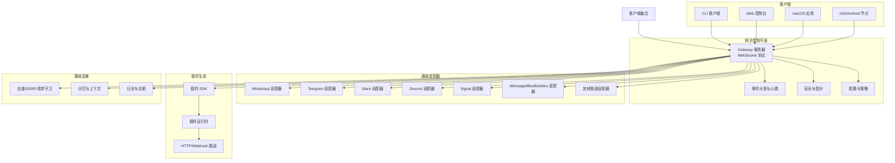
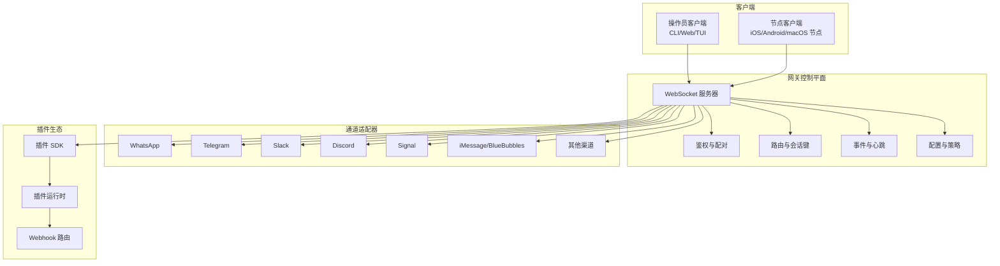
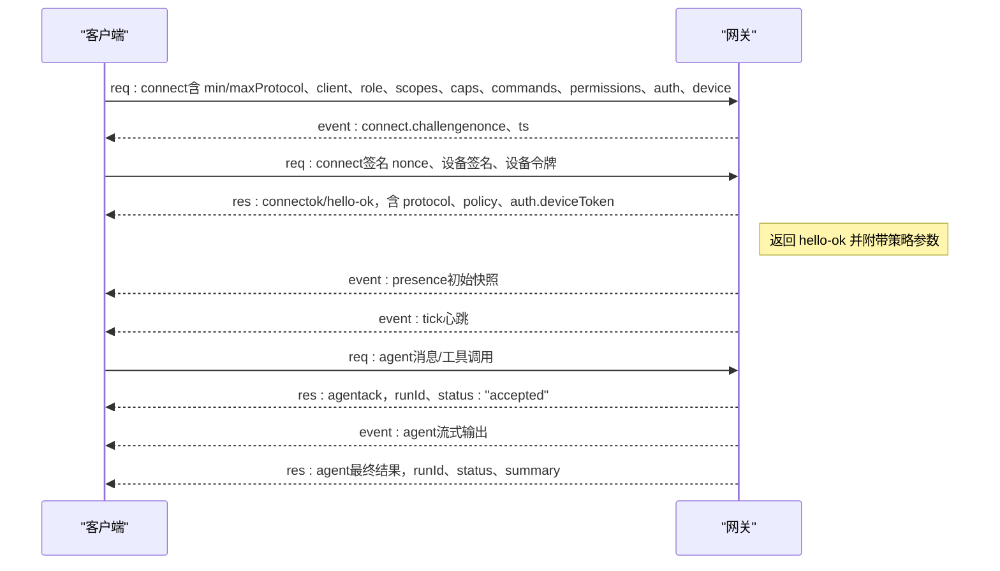
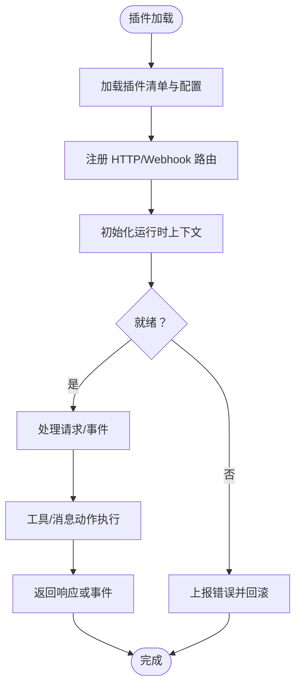
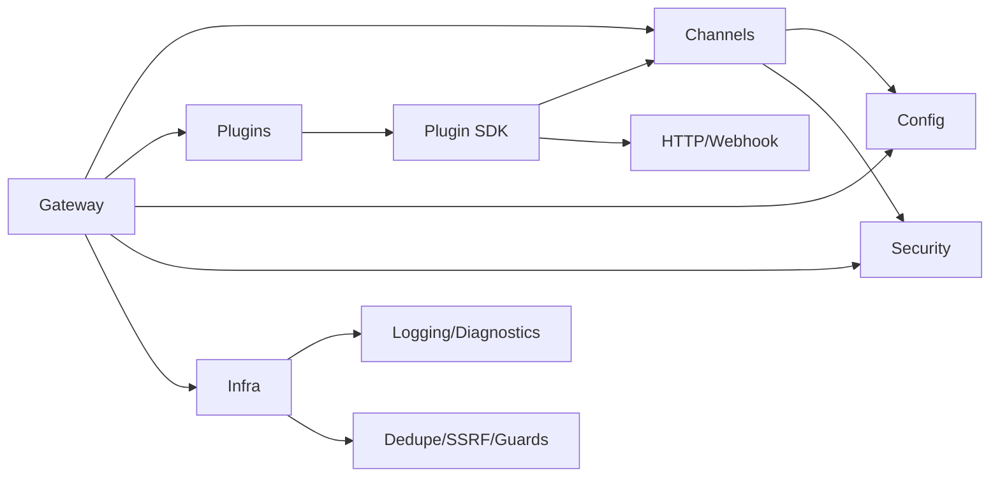

# 架构概览

## 目录
1. [引言](#引言)
2. [项目结构](#项目结构)
3. [核心组件](#核心组件)
4. [架构总览](#架构总览)
5. [详细组件分析](#详细组件分析)
6. [依赖关系分析](#依赖关系分析)
7. [性能考量](#性能考量)
8. [故障排查指南](#故障排查指南)
9. [结论](#结论)
10. [附录](#附录)

## 引言
本文件面向开发者与架构师，系统性阐述 OpenClaw 的整体架构设计与实现思路。OpenClaw 以“网关控制平面 + 多客户端 + 插件生态”为核心，通过统一的 WebSocket 协议承载控制、事件与节点能力，实现跨平台（macOS/iOS/Android/Linux/Windows）与多渠道（WhatsApp/Telegram/Slack/Discord/Google Chat/Signal/iMessage/BlueBubbles/IRC/Microsoft Teams/Matrix/Feishu/LINE/Mattermost/Nextcloud Talk/Nostr/Synology Chat/Tlon/Twitch/Zalo/Zalo Personal/WebChat 等）的统一接入与编排。

OpenClaw 的关键特征：
- 单一网关作为控制平面：集中管理会话、通道、工具、事件与健康状态。
- 统一 WebSocket 协议：所有客户端（CLI、Web 控制台、macOS 应用、iOS/Android 节点、无头节点）均通过 WS 连接网关，声明角色与权限。
- 插件与通道适配器：通过标准化插件接口与通道适配器，实现对多渠道消息面的解耦与扩展。
- 安全与信任：设备身份、配对、签名挑战、令牌与沙箱策略共同构成安全基线。
- 可观测与可运维：心跳、健康检查、诊断事件、日志与远程暴露（Tailscale/SSH 隧道）。

## 项目结构
OpenClaw 采用模块化分层组织，核心目录与职责概览如下：
- src/gateway：网关服务端实现（WebSocket 服务器、方法路由、事件分发、鉴权与配对、健康与心跳）
- src/agents：智能体循环、工作区、提示词注入、工具调用与流式输出
- src/channels：通道适配器与消息路由（WhatsApp/Telegram/Slack/Discord/Signal/iMessage/BlueBubbles 等）
- src/plugins：插件运行时与 SDK（插件生命周期、HTTP 路由注册、Webhook、工具与消息动作）
- src/plugin-sdk：插件开发 API（类型定义、工具构建、通道适配器接口、状态与配置辅助）
- src/shared：共享工具与常量（绑定地址解析、时间格式化、类型工具）
- src/infra：基础设施（去重缓存、SSRF 保护、HTTP 请求守卫、诊断事件、临时路径、WS 工具）
- src/memory：记忆与上下文存储（向量/文本索引、会话压缩与检索）
- src/context-engine：上下文组装与压缩引擎
- src/routing：会话键与路由策略（按账户/群组/发送者进行隔离与路由）
- src/config：配置模型与校验（Zod/TypeBox）、分组策略、允许列表与密钥解析
- src/security：安全策略（DM 策略、命令授权、提及门控、提及策略）
- src/utils：通用工具函数（字符串、正则、时间、数值处理）
- src/cli/web/tui/daemon：用户交互与守护进程（CLI 命令、Web 控制台、TUI、守护进程）
- src/node-host/browser/media/tts/cron/hooks：节点宿主与媒体管线（屏幕录制、相机、语音、定时任务、钩子）
- 文档 docs/concepts/architecture.md 与 docs/gateway/protocol.md：协议与架构参考

图表来源
- [docs/concepts/architecture.md](file://docs/concepts/architecture.md#L12-L26)
- [docs/gateway/protocol.md](file://docs/gateway/protocol.md#L10-L16)
- [src/gateway/server.ts](file://src/gateway/server.ts#L1-L4)
- [src/plugin-sdk/index.ts](file://src/plugin-sdk/index.ts#L1-L120)
- [src/plugins/index.ts](file://src/plugins/index.ts#L1-L120)
- [src/channels/index.ts](file://src/channels/index.ts#L1-L120)
- [src/infra/index.ts](file://src/infra/index.ts#L1-L120)
- [src/memory/index.ts](file://src/memory/index.ts#L1-L120)
- [src/logging/index.ts](file://src/logging/index.ts#L1-L120)

章节来源
- [README.md](file://README.md#L185-L212)
- [docs/concepts/architecture.md](file://docs/concepts/architecture.md#L12-L26)

## 核心组件
- 网关控制平面（Gateway）
  - WebSocket 服务器：统一接入、握手、鉴权、配对、事件推送与请求响应
  - 方法路由：对齐 TypeBox 模型生成的 JSON Schema，支持请求/响应/事件三类帧
  - 健康与心跳：周期性事件与健康快照，便于远程暴露与可观测
- AI 代理系统（Agents）
  - 智能体循环、工作区与提示词注入、工具调用与流式输出
  - 支持多代理路由与会话隔离，结合上下文引擎与记忆模块
- 通道适配器（Channels）
  - 面向多渠道的消息适配器，负责入站消息解析、出站发送、群组路由、提及门控与策略执行
  - 提供账户解析、目标规范化、状态问题收集与探测
- 插件架构（Plugins）
  - 插件 SDK 定义通道适配器、消息动作、工具工厂、HTTP/Webhook 路由
  - 插件运行时负责生命周期管理、幂等去重、并发队列与错误传播
- 安全与信任（Security）
  - 设备身份与签名挑战、配对令牌、作用域与权限矩阵、DM 策略与命令授权
- 基础设施（Infra）
  - 去重缓存、SSRF 限制、HTTP 请求守卫、诊断事件、临时路径与网络工具
- 记忆与上下文（Memory/Context Engine）
  - 上下文组装、压缩与检索，支持向量/文本索引与会话修剪
- 配置与路由（Config/Routing）
  - 类型安全的配置模型、分组策略、允许列表匹配与会话键解析
- 客户端与节点（CLI/Web/TUI/Node Host）
  - CLI 命令、Web 控制台、TUI、macOS/iOS/Android 节点宿主与媒体管线

章节来源
- [docs/concepts/architecture.md](file://docs/concepts/architecture.md#L27-L58)
- [docs/gateway/protocol.md](file://docs/gateway/protocol.md#L10-L16)
- [src/plugin-sdk/index.ts](file://src/plugin-sdk/index.ts#L1-L120)
- [src/agents/index.ts](file://src/agents/index.ts#L1-L120)
- [src/channels/index.ts](file://src/channels/index.ts#L1-L120)
- [src/plugins/index.ts](file://src/plugins/index.ts#L1-L120)
- [src/infra/index.ts](file://src/infra/index.ts#L1-L120)
- [src/memory/index.ts](file://src/memory/index.ts#L1-L120)
- [src/context-engine/index.ts](file://src/context-engine/index.ts#L1-L120)
- [src/routing/index.ts](file://src/routing/index.ts#L1-L120)
- [src/config/index.ts](file://src/config/index.ts#L1-L120)
- [src/security/index.ts](file://src/security/index.ts#L1-L120)
- [src/utils/index.ts](file://src/utils/index.ts#L1-L120)
- [src/cli/index.ts](file://src/cli/index.ts#L1-L120)
- [src/web/index.ts](file://src/web/index.ts#L1-L120)
- [src/node-host/index.ts](file://src/node-host/index.ts#L1-L120)
- [src/browser/index.ts](file://src/browser/index.ts#L1-L120)
- [src/media/index.ts](file://src/media/index.ts#L1-L120)
- [src/tts/index.ts](file://src/tts/index.ts#L1-L120)
- [src/cron/index.ts](file://src/cron/index.ts#L1-L120)
- [src/hooks/index.ts](file://src/hooks/index.ts#L1-L120)
- [src/daemon/index.ts](file://src/daemon/index.ts#L1-L120)
- [src/terminal/index.ts](file://src/terminal/index.ts#L1-L120)
- [src/tui/index.ts](file://src/tui/index.ts#L1-L120)
- [src/i18n/index.ts](file://src/i18n/index.ts#L1-L120)
- [src/markdown/index.ts](file://src/markdown/index.ts#L1-L120)
- [src/logging/index.ts](file://src/logging/index.ts#L1-L120)

## 架构总览
OpenClaw 的系统架构围绕“单一网关控制平面 + 多客户端 + 插件生态”的模式展开。所有客户端通过 WebSocket 与网关建立长连接，声明角色（operator/node）、作用域与能力，网关据此授予访问权限并推送事件。通道适配器负责将不同渠道的消息面抽象为统一的数据结构，插件生态提供扩展能力与 HTTP/Webhook 入口。安全体系贯穿从设备身份到命令授权的全链路。

图表来源
- [docs/concepts/architecture.md](file://docs/concepts/architecture.md#L12-L26)
- [docs/gateway/protocol.md](file://docs/gateway/protocol.md#L10-L16)
- [src/gateway/server.ts](file://src/gateway/server.ts#L1-L4)
- [src/channels/index.ts](file://src/channels/index.ts#L1-L120)
- [src/plugin-sdk/index.ts](file://src/plugin-sdk/index.ts#L1-L120)
- [src/plugins/index.ts](file://src/plugins/index.ts#L1-L120)

章节来源
- [README.md](file://README.md#L185-L212)
- [docs/concepts/architecture.md](file://docs/concepts/architecture.md#L12-L26)
- [docs/gateway/protocol.md](file://docs/gateway/protocol.md#L10-L16)

## 详细组件分析

### 网关控制平面（Gateway）
- WebSocket 协议与握手
  - 首帧必须为 connect；服务端先下发 connect.challenge，客户端需使用签名后的 nonce 完成握手
  - 支持设备令牌与角色/作用域声明，握手后返回 hello-ok 并附带策略参数（如 tickIntervalMs）
- 请求/响应/事件帧
  - 请求：&#123;type:"req", id, method, params&#125; → &#123;type:"res", id, ok, payload|error&#125;
  - 事件：&#123;type:"event", event, payload, seq?, stateVersion?&#125;
  - 幂等键用于副作用方法的安全重试
- 事件与心跳
  - 推送 agent、chat、presence、health、heartbeat、cron 等事件
  - presence 与 tick 用于 UI 展示与状态同步
- 安全与配对
  - 设备身份与签名挑战；本地连接可自动批准；所有连接需签名 challenge
  - 支持 OPENCLAW_GATEWAY_TOKEN 或 --token 的全局认证
- 远程访问
  - Tailscale Serve/Funnel 或 SSH 隧道；可启用 TLS 与证书指纹校验

图表来源
- [docs/gateway/protocol.md](file://docs/gateway/protocol.md#L22-L90)
- [docs/concepts/architecture.md](file://docs/concepts/architecture.md#L59-L78)

章节来源
- [docs/gateway/protocol.md](file://docs/gateway/protocol.md#L17-L91)
- [docs/concepts/architecture.md](file://docs/concepts/architecture.md#L59-L78)

### AI 代理系统（Agents）
- 工作区与提示词注入：支持 AGENTS.md、SOUL.md、TOOLS.md 注入，形成稳定的系统提示
- 工具调用与流式输出：支持 block 流式与工具流式，结合会话上下文与记忆
- 多代理路由：按账户/群组/发送者隔离，支持会话键解析与路由策略
- 会话管理：支持会话历史查询、会话间消息传递与会话修剪

章节来源
- [src/agents/index.ts](file://src/agents/index.ts#L1-L120)
- [src/context-engine/index.ts](file://src/context-engine/index.ts#L1-L120)
- [src/memory/index.ts](file://src/memory/index.ts#L1-L120)
- [src/routing/index.ts](file://src/routing/index.ts#L1-L120)

### 通道适配器（Channels）
- 渠道抽象：统一入站消息解析、出站发送、群组路由、提及门控与策略执行
- 账户与目标：账户解析、目标规范化、允许列表匹配与状态问题收集
- 典型适配器：WhatsApp（Baileys）、Telegram（grammY）、Slack（Bolt）、Discord（discord.js）、Signal（signal-cli）、iMessage/BlueBubbles、IRC、Teams、Matrix、Feishu、LINE、Mattermost、Nextcloud Talk、Nostr、Synology Chat、Tlon、Twitch、Zalo/Zalo Personal、WebChat
- 群组路由：支持提及门控、回复标签、分块与路由规则

章节来源
- [src/channels/index.ts](file://src/channels/index.ts#L1-L120)
- [README.md](file://README.md#L149-L155)

### 插件架构（Plugins）
- 插件 SDK：定义通道适配器、消息动作、工具工厂、HTTP/Webhook 路由与类型约束
- 插件运行时：生命周期管理、幂等去重、并发队列、错误传播与会话上下文
- Webhook：注册与鉴权、请求体限制、并发限流与异常追踪
- 工具与消息动作：通过 SDK 统一构建与分发，支持 core 与 plugin 来源

图表来源
- [src/plugin-sdk/index.ts](file://src/plugin-sdk/index.ts#L1-L120)
- [src/plugins/index.ts](file://src/plugins/index.ts#L1-L120)
- [src/infra/index.ts](file://src/infra/index.ts#L420-L455)

章节来源
- [src/plugin-sdk/index.ts](file://src/plugin-sdk/index.ts#L1-L120)
- [src/plugins/index.ts](file://src/plugins/index.ts#L1-L120)
- [src/infra/index.ts](file://src/infra/index.ts#L420-L455)

### 安全与信任（Security）
- 设备身份与配对：设备指纹、公钥签名、挑战签名、设备令牌轮换与撤销
- 作用域与权限：operator.read/write/admin/approvals/pairing；node 的 caps/commands/permissions
- DM 策略与命令授权：基于允许列表与策略的直接私信访问控制与命令级门控
- SSRF 与请求守卫：主机白名单、HTTPS 限制、请求体大小限制与速率限制

章节来源
- [docs/gateway/protocol.md](file://docs/gateway/protocol.md#L200-L222)
- [src/security/index.ts](file://src/security/index.ts#L1-L120)
- [src/infra/index.ts](file://src/infra/index.ts#L420-L455)

### 基础设施（Infra）
- 去重缓存：短时去重表，保障幂等
- SSRF 与请求守卫：主机白名单、HTTPS 限制、请求体大小限制与速率限制
- 诊断事件：心跳、队列、会话、使用量、Webhook 异常等事件
- 临时路径与网络工具：跨平台临时文件与网络辅助

章节来源
- [src/infra/index.ts](file://src/infra/index.ts#L1-L120)

### 记忆与上下文（Memory/Context Engine）
- 上下文组装与压缩：根据会话与历史构建上下文，支持压缩与摘要
- 记忆存储：向量/文本索引，支持检索与会话修剪

章节来源
- [src/context-engine/index.ts](file://src/context-engine/index.ts#L1-L120)
- [src/memory/index.ts](file://src/memory/index.ts#L1-L120)

### 配置与路由（Config/Routing）
- 类型安全配置：Zod/TypeBox 模型，涵盖渠道配置、分组策略、允许列表与密钥
- 会话键与路由：按账户/群组/发送者解析会话键，支持路由策略与访问决策

章节来源
- [src/config/index.ts](file://src/config/index.ts#L1-L120)
- [src/routing/index.ts](file://src/routing/index.ts#L1-L120)

### 客户端与节点（CLI/Web/TUI/Node Host）
- CLI：gateway、agent、send、wizard、doctor 等命令
- Web 控制台：通过网关 WS 获取聊天历史与发送消息
- TUI：终端界面
- 节点宿主：macOS/iOS/Android 节点，提供摄像头、屏幕录制、Canvas、位置等能力

章节来源
- [src/cli/index.ts](file://src/cli/index.ts#L1-L120)
- [src/web/index.ts](file://src/web/index.ts#L1-L120)
- [src/tui/index.ts](file://src/tui/index.ts#L1-L120)
- [src/node-host/index.ts](file://src/node-host/index.ts#L1-L120)

## 依赖关系分析
OpenClaw 的模块间依赖遵循“低耦合、高内聚”的原则，通过清晰的边界与接口实现解耦：
- 网关控制平面依赖通道适配器与插件运行时，但不直接依赖具体渠道实现细节
- 插件 SDK 为通道适配器与工具提供统一接口，降低扩展成本
- 安全与基础设施模块被广泛复用，确保一致的安全策略与可观测性
- 配置与路由模块为通道与安全策略提供输入，形成闭环

图表来源
- [src/gateway/server.ts](file://src/gateway/server.ts#L1-L4)
- [src/channels/index.ts](file://src/channels/index.ts#L1-L120)
- [src/plugins/index.ts](file://src/plugins/index.ts#L1-L120)
- [src/plugin-sdk/index.ts](file://src/plugin-sdk/index.ts#L1-L120)
- [src/infra/index.ts](file://src/infra/index.ts#L1-L120)
- [src/config/index.ts](file://src/config/index.ts#L1-L120)
- [src/security/index.ts](file://src/security/index.ts#L1-L120)
- [src/logging/index.ts](file://src/logging/index.ts#L1-L120)

章节来源
- [src/gateway/server.ts](file://src/gateway/server.ts#L1-L4)
- [src/plugin-sdk/index.ts](file://src/plugin-sdk/index.ts#L1-L120)
- [src/plugins/index.ts](file://src/plugins/index.ts#L1-L120)
- [src/channels/index.ts](file://src/channels/index.ts#L1-L120)
- [src/infra/index.ts](file://src/infra/index.ts#L1-L120)
- [src/config/index.ts](file://src/config/index.ts#L1-L120)
- [src/security/index.ts](file://src/security/index.ts#L1-L120)
- [src/logging/index.ts](file://src/logging/index.ts#L1-L120)

## 性能考量
- WebSocket 长连接与事件驱动：减少轮询开销，提升实时性
- 幂等去重与并发队列：避免重复执行与资源争用
- 分组策略与会话隔离：降低上下文膨胀与计算复杂度
- 媒体管线与临时文件：合理设置大小上限与生命周期，避免磁盘与内存压力
- 远程暴露与 TLS：在远程场景启用 TLS 与指纹校验，兼顾安全性与性能

## 故障排查指南
- 连接失败
  - 检查 OPENCLAW_GATEWAY_TOKEN 是否正确；确认 connect.challenge 已收到且 nonce 正确签名
  - 校验设备签名版本与 payload（v3 绑定 platform 与 deviceFamily）
- 权限不足
  - 确认角色与作用域声明是否满足方法要求；operator.admin 才能执行持久化配置写入
- Webhook 异常
  - 检查请求体大小限制、速率限制与异常追踪；核对鉴权与路由注册
- 媒体与节点能力
  - 确认节点 capabilities/commands/permissions 与实际设备能力一致；必要时更新配对与权限

章节来源
- [docs/gateway/protocol.md](file://docs/gateway/protocol.md#L200-L255)
- [src/infra/index.ts](file://src/infra/index.ts#L420-L455)

## 结论
OpenClaw 通过“单一网关 + 统一协议 + 插件生态 + 通道适配器”的架构，实现了跨平台、多渠道的统一接入与编排。该设计在保证安全与可观测的前提下，提供了良好的扩展性与可维护性。开发者可通过插件 SDK 快速扩展新渠道与工具，同时利用通道适配器与路由策略实现精细化的会话与权限管理。

## 附录
- 开发与运行
  - 使用 Node ≥22，推荐 pnpm；通过 openclaw onboard 安装守护进程
  - 网关默认端口 18789，支持 Tailscale Serve/Funnel 或 SSH 隧道远程访问
- 文档与参考
  - 架构与协议参考：docs/concepts/architecture.md、docs/gateway/protocol.md
  - 通道与渠道：README.md 中的多渠道列表与文档链接

章节来源
- [README.md](file://README.md#L50-L120)
- [docs/concepts/architecture.md](file://docs/concepts/architecture.md#L117-L140)
- [docs/gateway/protocol.md](file://docs/gateway/protocol.md#L117-L140)