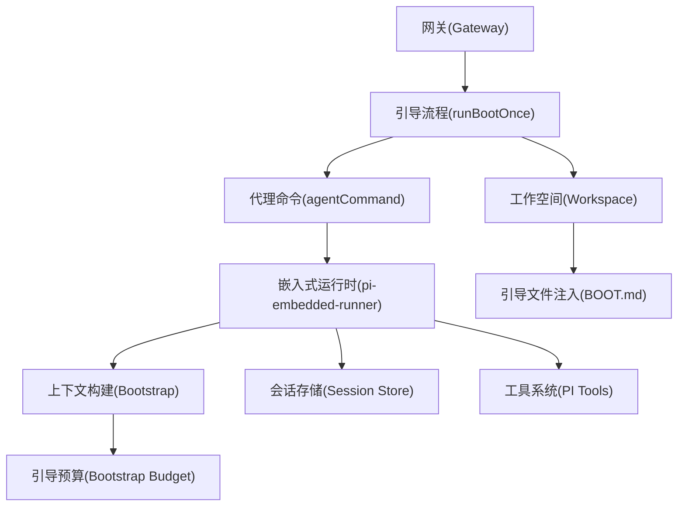
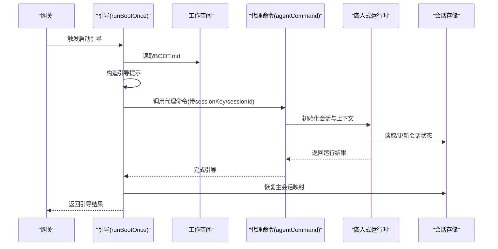
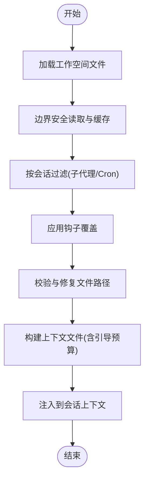
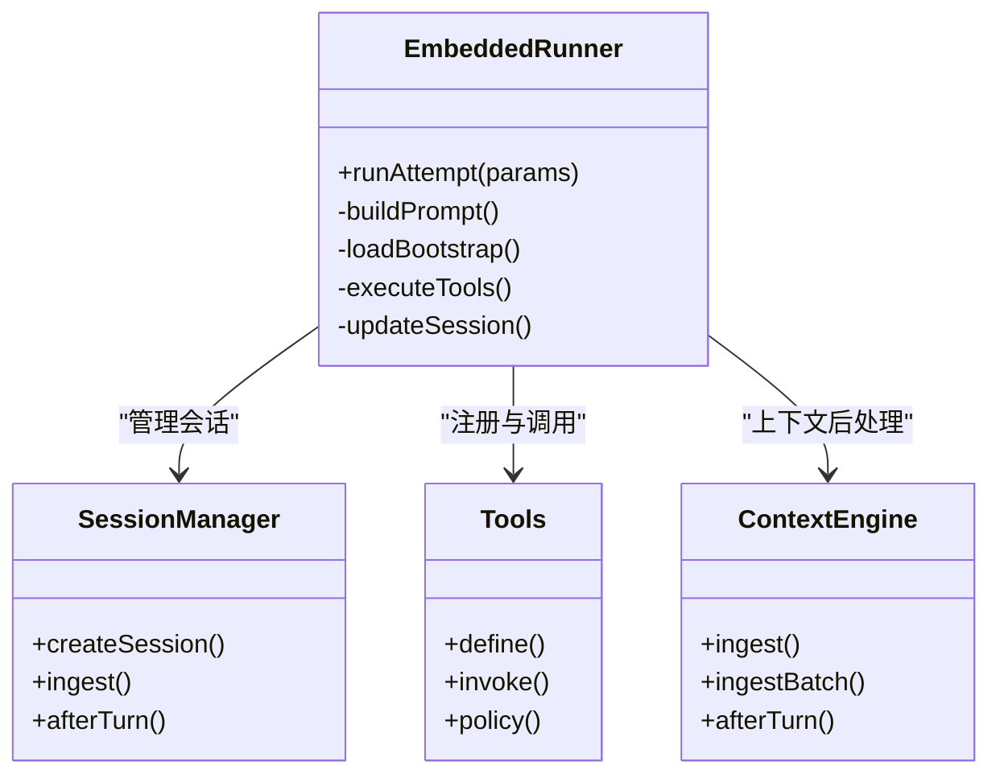
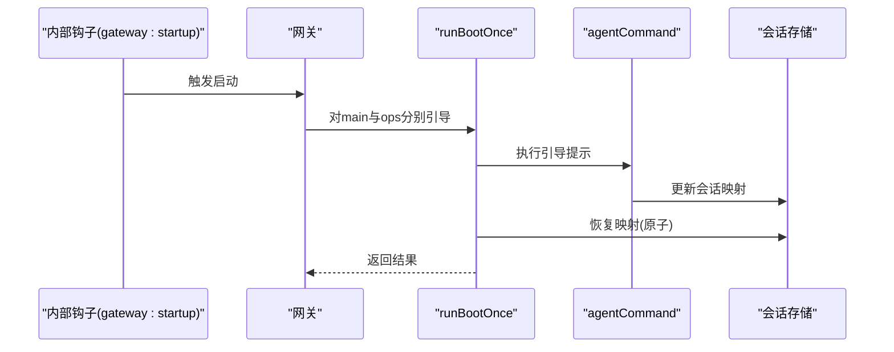
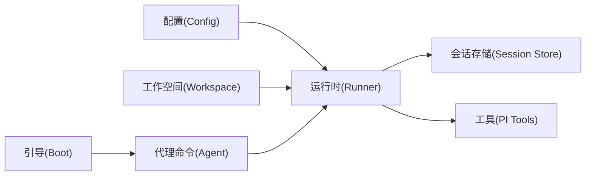

# 代理架构设计

## 目录
1. [引言](#引言)
2. [项目结构](#项目结构)
3. [核心组件](#核心组件)
4. [架构总览](#架构总览)
5. [详细组件分析](#详细组件分析)
6. [依赖关系分析](#依赖关系分析)
7. [性能考量](#性能考量)
8. [故障排查指南](#故障排查指南)
9. [结论](#结论)
10. [附录](#附录)

## 引言
本文件面向OpenClaw代理架构设计，聚焦“嵌入式pi-mono运行时、工作空间契约与会话引导机制”。文档从代理运行时（pi-mono）集成、工作空间目录结构与引导文件注入、核心工具系统、多轮对话与上下文窗口管理、会话状态存储与生命周期、配置选项与身份管理、思考模式实现等方面进行系统化阐述，并提供架构图与配置示例路径，帮助开发者与运维人员快速理解并正确使用该架构。

## 项目结构
OpenClaw采用分层模块化组织，核心围绕以下子系统：
- 网关启动与引导：负责在网关启动时执行工作空间引导脚本（BOOT.md），并确保主会话映射一致性
- 代理运行时：基于pi-mono的嵌入式运行时，承载会话循环、工具调用与上下文注入
- 工作空间：统一的工作目录，存放引导文件、记忆文件与可选技能/画布资源
- 会话管理：集中化的会话状态存储与维护策略，支持多轮对话与上下文压缩
- 配置系统：类型化配置与运行时快照，支撑代理行为与模型选择

**图表来源**
- [src/gateway/boot.ts](file://src/gateway/boot.ts#L138-L203)
- [src/agents/workspace.ts](file://src/agents/workspace.ts#L498-L555)
- [src/agents/bootstrap-files.ts](file://src/agents/bootstrap-files.ts#L64-L118)
- [src/agents/pi-embedded-runner/run/attempt.ts](file://src/agents/pi-embedded-runner/run/attempt.ts#L1-L200)

**章节来源**
- [src/gateway/boot.ts](file://src/gateway/boot.ts#L1-L204)
- [src/agents/workspace.ts](file://src/agents/workspace.ts#L1-L656)
- [src/agents/bootstrap-files.ts](file://src/agents/bootstrap-files.ts#L1-L119)
- [src/agents/pi-embedded-runner/run/attempt.ts](file://src/agents/pi-embedded-runner/run/attempt.ts#L1-L200)

## 核心组件
- 嵌入式运行时（pi-mono）：承载会话循环、消息历史、工具调用与上下文注入，提供错误分类、图像处理、转写与消息去重等辅助能力
- 工作空间（Workspace）：单一工作目录，作为工具与上下文的默认cwd；支持模板化引导文件与Git备份
- 引导文件注入（Bootstrap）：在新会话首次运行时，将标准引导文件注入到上下文中，支持轻量模式与钩子覆盖
- 会话存储（Session Store）：集中式会话状态文件，记录会话键、模型、令牌用量与元数据，支持维护策略与清理
- 配置系统（Config）：类型化配置与运行时快照，支持验证、迁移与插件扩展

**章节来源**
- [src/agents/pi-embedded-helpers.ts](file://src/agents/pi-embedded-helpers.ts#L1-L73)
- [docs/concepts/agent-workspace.md](file://docs/concepts/agent-workspace.md#L1-L237)
- [docs/concepts/agent.md](file://docs/concepts/agent.md#L1-L39)
- [docs/concepts/session.md](file://docs/concepts/session.md#L1-L311)
- [src/config/config.ts](file://src/config/config.ts#L1-L28)
- [src/config/types.ts](file://src/config/types.ts#L1-L36)

## 架构总览
下图展示从网关启动到代理运行的关键交互：网关读取工作空间中的BOOT.md，构造引导提示并调用代理命令；代理运行时在会话中构建上下文（含引导文件与系统提示），执行工具调用与消息生成，并更新会话存储。

**图表来源**
- [src/gateway/boot.ts](file://src/gateway/boot.ts#L138-L203)
- [src/agents/pi-embedded-runner/run/attempt.ts](file://src/agents/pi-embedded-runner/run/attempt.ts#L1-L200)

**章节来源**
- [src/gateway/boot.ts](file://src/gateway/boot.ts#L138-L203)
- [src/hooks/bundled/boot-md/handler.gateway-startup.integration.test.ts](file://src/hooks/bundled/boot-md/handler.gateway-startup.integration.test.ts#L43-L60)

## 详细组件分析

### 组件A：工作空间与引导文件注入
- 工作空间默认位置与覆盖方式、Git初始化与备份策略
- 标准引导文件清单（AGENTS/SOUL/TOOLS/IDENTITY/USER/HEARTBEAT/BOOTSTRAP/MEMORY）
- 文件读取边界保护与缓存、模板加载与缺失文件处理
- 引导文件按会话过滤（子代理/Cron仅保留最小集）、钩子覆盖与诊断
- 引导预算统计与截断报告，避免上下文膨胀

**图表来源**
- [src/agents/workspace.ts](file://src/agents/workspace.ts#L498-L555)
- [src/agents/bootstrap-files.ts](file://src/agents/bootstrap-files.ts#L64-L118)
- [src/agents/bootstrap-budget.ts](file://src/agents/bootstrap-budget.ts#L124-L162)

**章节来源**
- [src/agents/workspace.ts](file://src/agents/workspace.ts#L1-L656)
- [src/agents/bootstrap-files.ts](file://src/agents/bootstrap-files.ts#L1-L119)
- [src/agents/bootstrap-budget.ts](file://src/agents/bootstrap-budget.ts#L124-L162)
- [docs/concepts/agent-workspace.md](file://docs/concepts/agent-workspace.md#L64-L125)
- [docs/concepts/agent.md](file://docs/concepts/agent.md#L12-L39)

### 组件B：嵌入式运行时与会话循环
- 运行时初始化：会话管理器、资源加载器、工具定义、系统提示构建
- 上下文构建：引导文件注入、历史限制、图像检测与裁剪、转写提示
- 错误处理与降级：超时、限流、计费、模型不可用等分类与提示
- 工具调用：工具名称归一化、权限策略、结果配对修复、CloudCodeAssist兼容
- 会话后处理：上下文引擎afterTurn/ingest、历史修剪、空闲刷新

**图表来源**
- [src/agents/pi-embedded-runner/run/attempt.ts](file://src/agents/pi-embedded-runner/run/attempt.ts#L1-L200)
- [src/agents/pi-embedded-helpers.ts](file://src/agents/pi-embedded-helpers.ts#L1-L73)

**章节来源**
- [src/agents/pi-embedded-runner/run/attempt.ts](file://src/agents/pi-embedded-runner/run/attempt.ts#L1-L200)
- [src/agents/pi-embedded-helpers.ts](file://src/agents/pi-embedded-helpers.ts#L1-L73)

### 组件C：会话引导与生命周期
- 引导流程：读取BOOT.md、构造提示、调用代理命令、恢复主会话映射
- 生命周期：每日/空闲重置策略、重置触发词、隔离策略（DM Scope）
- 存储：sessions.json、JSONL转录、维护策略（裁剪、轮换、磁盘配额）
- 测试验证：启动钩子触发两次不同agentId的工作空间引导

**图表来源**
- [src/hooks/bundled/boot-md/handler.gateway-startup.integration.test.ts](file://src/hooks/bundled/boot-md/handler.gateway-startup.integration.test.ts#L43-L60)
- [src/gateway/boot.ts](file://src/gateway/boot.ts#L138-L203)

**章节来源**
- [src/gateway/boot.ts](file://src/gateway/boot.ts#L138-L203)
- [src/gateway/boot.test.ts](file://src/gateway/boot.test.ts#L20-L175)
- [docs/concepts/session.md](file://docs/concepts/session.md#L1-L311)

### 组件D：配置系统与类型
- 配置入口：加载、验证、迁移、运行时快照与热更新
- 类型分布：代理默认、通道、模型、沙箱、工具、内存等子类型
- 与运行时耦合：模型选择、工具策略、系统提示参数、思维级别等

**章节来源**
- [src/config/config.ts](file://src/config/config.ts#L1-L28)
- [src/config/types.ts](file://src/config/types.ts#L1-L36)

## 依赖关系分析
- 运行时对工作空间的依赖：通过引导文件构建上下文，受会话键影响（子代理/Cron最小集）
- 运行时对会话存储的依赖：读取/更新会话状态、令牌用量、模型与上下文令牌
- 引导流程对代理命令的依赖：以无交付模式运行，仅用于状态校验与映射恢复
- 配置系统对运行时的影响：模型、工具策略、系统提示与思维级别等

**图表来源**
- [src/agents/pi-embedded-runner/run/attempt.ts](file://src/agents/pi-embedded-runner/run/attempt.ts#L1-L200)
- [src/gateway/boot.ts](file://src/gateway/boot.ts#L138-L203)

**章节来源**
- [src/agents/pi-embedded-runner/run/attempt.ts](file://src/agents/pi-embedded-runner/run/attempt.ts#L1-L200)
- [src/gateway/boot.ts](file://src/gateway/boot.ts#L138-L203)

## 性能考量
- 引导预算控制：通过单文件与总量上限限制，避免上下文膨胀
- 会话维护策略：裁剪、轮换与磁盘配额，降低大存储写入延迟
- 历史修剪与预压缩：在LLM调用前清理旧工具结果，减少上下文开销
- 图像与转写处理：限制大小与数量，避免传输与解析成本过高

[本节为通用指导，无需列出具体文件来源]

## 故障排查指南
- 引导失败：检查BOOT.md是否存在、内容是否为空、代理命令返回错误
- 会话映射异常：确认引导前后会话映射恢复是否成功
- 会话存储损坏：使用维护命令清理或重建，必要时删除指定键或JSONL
- 上下文截断：调整引导预算参数或精简引导文件

**章节来源**
- [src/gateway/boot.ts](file://src/gateway/boot.ts#L138-L203)
- [src/gateway/boot.test.ts](file://src/gateway/boot.test.ts#L151-L175)
- [docs/concepts/session.md](file://docs/concepts/session.md#L74-L120)

## 结论
OpenClaw通过“嵌入式pi-mono运行时 + 工作空间契约 + 会话引导机制”的组合，实现了可审计、可维护、可扩展的代理运行体系。工作空间作为单一可信根，配合严格的引导文件注入与预算控制，确保上下文可控；集中式会话存储与维护策略保障长期运行稳定性；配置系统与类型化接口为运行时行为提供了清晰的边界与扩展点。

[本节为总结性内容，无需列出具体文件来源]

## 附录

### A. 代理运行时与pi-mono集成要点
- 使用pi-coding-agent的SessionManager与DefaultResourceLoader
- 通过subscribeEmbeddedPiSession订阅会话事件流
- 支持Google/Gemini/Anthropic等提供商的转写与图像处理适配
- 提供错误分类与降级策略，增强鲁棒性

**章节来源**
- [src/agents/pi-embedded-runner/run/attempt.ts](file://src/agents/pi-embedded-runner/run/attempt.ts#L1-L200)
- [docs/zh-CN/pi.md](file://docs/zh-CN/pi.md#L531-L539)

### B. 工作空间目录结构与引导文件
- 默认位置与覆盖方式、Git初始化与备份建议
- 标准引导文件清单与用途说明
- 缺失文件处理与模板化种子

**章节来源**
- [docs/concepts/agent-workspace.md](file://docs/concepts/agent-workspace.md#L24-L125)
- [docs/concepts/agent.md](file://docs/concepts/agent.md#L12-L39)

### C. 多轮对话、上下文窗口与会话状态
- DM隔离策略（dmScope）与跨通道合并
- 会话键映射规则与重置策略
- 维护策略与磁盘配额设置示例

**章节来源**
- [docs/concepts/session.md](file://docs/concepts/session.md#L10-L311)

### D. 代理配置选项与身份管理
- 代理默认模型解析与优先级
- 身份文件解析与摘要构建
- 会话模式切换（思考级别）与远程网关同步

**章节来源**
- [src/commands/agents.config.ts](file://src/commands/agents.config.ts#L50-L97)
- [src/acp/translator.set-session-mode.test.ts](file://src/acp/translator.set-session-mode.test.ts#L43-L61)

### E. 思考模式与系统提示
- 思维级别降级策略与用户提示
- 系统提示参数构建与覆盖
- Google提供商工具与Schema适配

**章节来源**
- [src/agents/pi-embedded-helpers.ts](file://src/agents/pi-embedded-helpers.ts#L62-L62)
- [src/agents/pi-embedded-runner/run/attempt.ts](file://src/agents/pi-embedded-runner/run/attempt.ts#L1-L200)