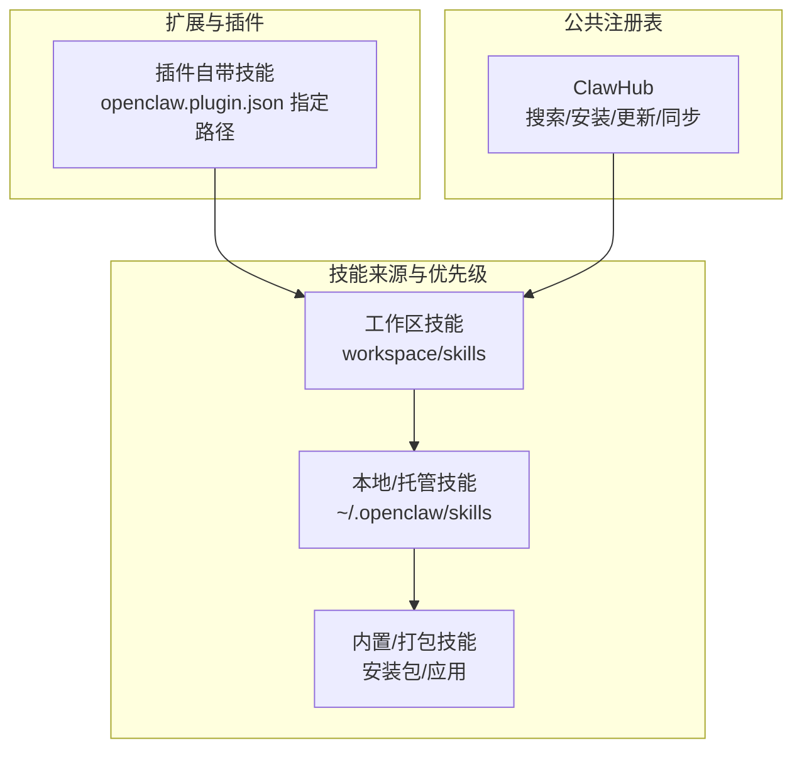
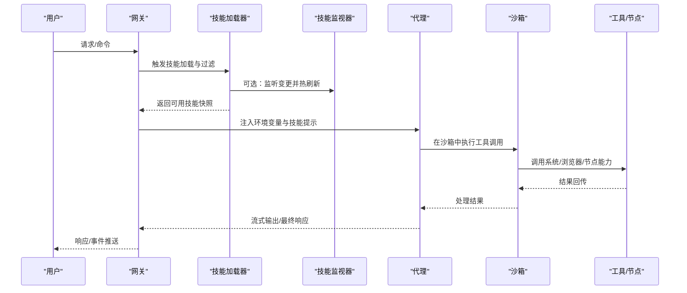
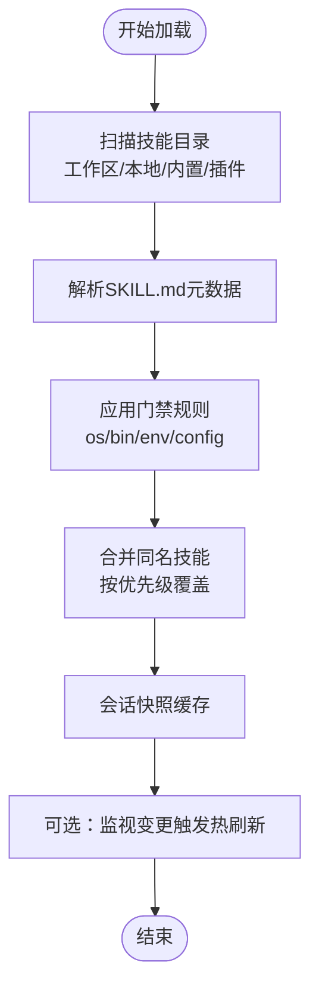
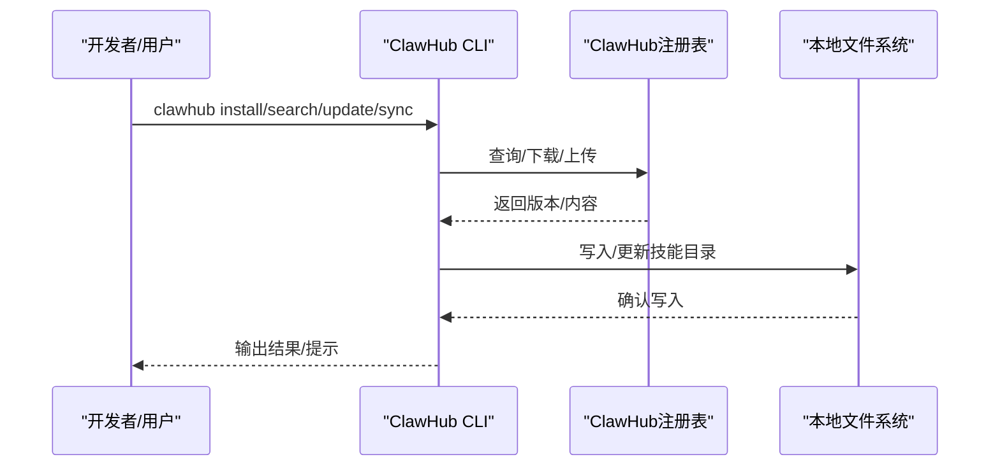
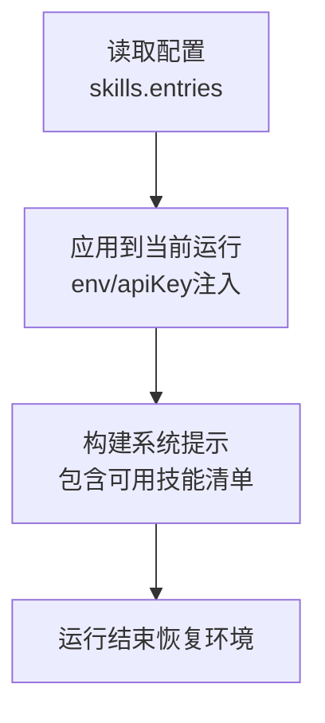
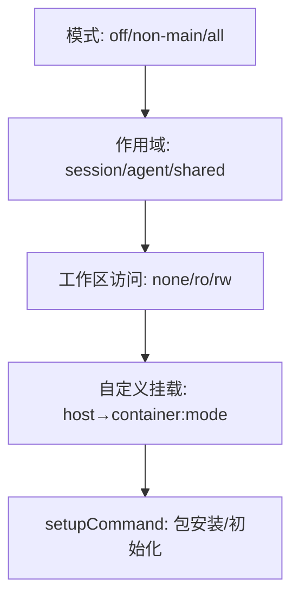
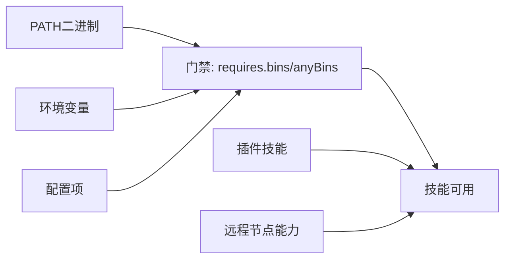

# 技能平台

## 目录
1. [简介](#简介)
2. [项目结构](#项目结构)
3. [核心组件](#核心组件)
4. [架构总览](#架构总览)
5. [详细组件分析](#详细组件分析)
6. [依赖关系分析](#依赖关系分析)
7. [性能考量](#性能考量)
8. [故障排查指南](#故障排查指南)
9. [结论](#结论)
10. [附录](#附录)

## 简介
本文件面向OpenClaw技能平台，系统化阐述技能的加载机制、目录结构与冲突解决策略；详解安装、更新与卸载流程（含验证、依赖管理与版本控制）；覆盖配置管理、执行环境与沙箱隔离；解释技能与工具的关系、生命周期管理与性能监控；并提供开发框架、测试工具与发布流程，以及最佳实践与常见问题解决方案。

## 项目结构
OpenClaw采用“工作区 + 技能”的组织方式：技能以目录形式存在，每个技能通过SKILL.md定义元数据与使用说明。技能来源分为三类，按优先级覆盖：
- 工作区技能：位于工作区目录下，优先级最高
- 本地/托管技能：位于用户主目录下的技能目录
- 内置/打包技能：随安装包或应用内置分发

此外，插件可自带技能目录，参与同一套加载与优先级规则；ClawHub作为公共注册表，支持搜索、安装、更新与同步。

图表来源
- [docs/tools/skills.md](file://docs/tools/skills.md#L13-L48)

章节来源
- [docs/tools/skills.md](file://docs/tools/skills.md#L13-L48)
- [docs/tools/clawhub.md](file://docs/tools/clawhub.md#L16-L72)

## 核心组件
- 技能加载器：扫描多源技能目录，解析SKILL.md元数据，按条件过滤与合并，生成“可用技能列表”，并在会话开始时快照缓存，后续轮次复用。
- 条件与门禁：基于metadata.openclaw字段进行运行时筛选，如操作系统、二进制依赖、环境变量、配置项等；支持“始终包含”与“安装器描述”。
- 配置与注入：通过配置文件对技能进行启用/禁用、环境变量注入与密钥绑定；注入作用域限定于单次代理运行周期。
- 安全与隔离：默认在主机上执行工具；可启用沙箱模式，按会话/代理/共享粒度隔离；支持浏览器沙箱与自定义镜像。
- 生命周期与版本：ClawHub提供版本化存储与语义化版本；安装/更新/删除遵循锁文件与内容哈希比对；支持强制覆盖与并发上传。
- 开发与测试：提供技能模板与脚手架，支持本地调试与快速迭代；CLI提供技能检查与状态查看。

章节来源
- [docs/tools/skills.md](file://docs/tools/skills.md#L106-L187)
- [docs/tools/skills-config.md](file://docs/tools/skills-config.md#L13-L78)
- [docs/gateway/sandboxing.md](file://docs/gateway/sandboxing.md#L39-L116)
- [docs/tools/clawhub.md](file://docs/tools/clawhub.md#L222-L258)

## 架构总览
技能系统围绕“加载-过滤-注入-执行-监控”闭环构建，与网关协议、节点能力、工具策略协同工作。

图表来源
- [docs/concepts/architecture.md](file://docs/concepts/architecture.md#L59-L78)
- [docs/tools/skills.md](file://docs/tools/skills.md#L242-L256)
- [docs/gateway/sandboxing.md](file://docs/gateway/sandboxing.md#L19-L38)

## 详细组件分析

### 组件A：技能加载与优先级
- 加载顺序：工作区技能 > 本地/托管技能 > 内置技能；插件自带技能参与同一优先级体系。
- 过滤策略：基于metadata.openclaw的门禁规则（操作系统、二进制、环境变量、配置项），支持“始终包含”。
- 快照与热刷新：会话开始时缓存可用技能列表；监视器可按需触发热刷新。
- 远程节点：当远程macOS节点允许system.run且具备所需二进制时，可将其视为可用技能来源。

图表来源
- [docs/tools/skills.md](file://docs/tools/skills.md#L13-L48)
- [docs/tools/skills.md](file://docs/tools/skills.md#L106-L187)
- [docs/tools/skills.md](file://docs/tools/skills.md#L242-L256)

章节来源
- [docs/tools/skills.md](file://docs/tools/skills.md#L13-L48)
- [docs/tools/skills.md](file://docs/tools/skills.md#L106-L187)
- [docs/tools/skills.md](file://docs/tools/skills.md#L242-L256)

### 组件B：安装、更新与卸载（含ClawHub）
- 安装：ClawHub CLI将技能包下载到工作区或指定目录，遵循工作区优先级。
- 更新：支持按技能或全部更新；比较本地内容哈希与已发布版本，必要时提示覆盖。
- 同步：扫描本地技能并上传新版本或变更；支持并发与标签管理。
- 卸载：删除本地技能目录，下次加载不再可见。

图表来源
- [docs/tools/clawhub.md](file://docs/tools/clawhub.md#L118-L221)
- [docs/tools/clawhub.md](file://docs/tools/clawhub.md#L230-L258)

章节来源
- [docs/tools/clawhub.md](file://docs/tools/clawhub.md#L118-L221)
- [docs/tools/clawhub.md](file://docs/tools/clawhub.md#L230-L258)

### 组件C：配置管理与环境注入
- 全局配置：skills.entries用于启用/禁用技能、注入环境变量与密钥；支持SecretRef对象。
- 注入范围：仅在单次代理运行期间生效，结束后恢复原环境。
- 沙箱差异：沙箱容器不继承宿主进程环境，需通过沙箱镜像或配置注入。

图表来源
- [docs/tools/skills-config.md](file://docs/tools/skills-config.md#L13-L78)
- [docs/tools/skills.md](file://docs/tools/skills.md#L230-L241)
- [docs/gateway/sandboxing.md](file://docs/gateway/sandboxing.md#L67-L76)

章节来源
- [docs/tools/skills-config.md](file://docs/tools/skills-config.md#L13-L78)
- [docs/tools/skills.md](file://docs/tools/skills.md#L230-L241)
- [docs/gateway/sandboxing.md](file://docs/gateway/sandboxing.md#L67-L76)

### 组件D：沙箱隔离与工具策略
- 模式：off/non-main/all；非主会话默认沙箱化。
- 作用域：session/agent/shared；共享容器可降低资源占用。
- 工作区访问：none/ro/rw；镜像内可映射技能至/skills。
- 自定义挂载：受安全限制，禁止危险路径；建议只读挂载敏感数据。
- 设置命令：setupCommand在容器创建后一次性执行，需网络与可写根FS。

图表来源
- [docs/gateway/sandboxing.md](file://docs/gateway/sandboxing.md#L39-L116)
- [docs/gateway/sandboxing.md](file://docs/gateway/sandboxing.md#L199-L217)

章节来源
- [docs/gateway/sandboxing.md](file://docs/gateway/sandboxing.md#L39-L116)
- [docs/gateway/sandboxing.md](file://docs/gateway/sandboxing.md#L199-L217)

### 组件E：技能与工具的关系、生命周期与性能监控
- 关系：技能通过SKILL.md向模型暴露工具调用意图与上下文；工具在沙箱或主机执行。
- 生命周期：从创建、开发、测试到发布与维护；ClawHub提供版本与变更记录。
- 性能：技能列表注入提示词具有确定性开销；可通过减少技能数量与精简描述降低token成本。

章节来源
- [docs/tools/skills.md](file://docs/tools/skills.md#L269-L286)
- [docs/tools/creating-skills.md](file://docs/tools/creating-skills.md#L13-L59)
- [docs/tools/clawhub.md](file://docs/tools/clawhub.md#L224-L233)

### 组件F：开发框架、测试工具与发布流程
- 模板与脚手架：提供init_skill.py与package_skill.py，规范技能目录结构与校验。
- 测试：本地Agent测试与迭代；结合ClawHub同步备份。
- 发布：通过publish/sync命令上传版本、设置标签与变更日志。

章节来源
- [skills/skill-creator/SKILL.md](file://skills/skill-creator/SKILL.md#L263-L373)
- [docs/tools/clawhub.md](file://docs/tools/clawhub.md#L163-L186)

## 依赖关系分析
- 技能依赖：二进制依赖（PATH）、环境变量、配置项；可在metadata.openclaw中声明。
- 插件技能：通过openclaw.plugin.json声明技能目录，参与统一加载与优先级。
- 远程节点：当macOS节点允许system.run且具备所需二进制时，可作为技能来源之一。

图表来源
- [docs/tools/skills.md](file://docs/tools/skills.md#L106-L187)
- [docs/tools/skills.md](file://docs/tools/skills.md#L41-L48)

章节来源
- [docs/tools/skills.md](file://docs/tools/skills.md#L106-L187)
- [docs/tools/skills.md](file://docs/tools/skills.md#L41-L48)

## 性能考量
- 提示词开销：技能列表注入提示词具有固定与线性两部分开销；建议控制技能数量与描述长度。
- 监视器抖动：watchDebounceMs可降低频繁刷新带来的开销。
- 沙箱启动成本：容器创建与setupCommand执行可能带来延迟；合理选择作用域与镜像。

章节来源
- [docs/tools/skills.md](file://docs/tools/skills.md#L269-L286)
- [docs/tools/skills-config.md](file://docs/tools/skills-config.md#L17-L21)
- [docs/gateway/sandboxing.md](file://docs/gateway/sandboxing.md#L199-L217)

## 故障排查指南
- 缺少二进制/环境变量/配置项：使用openclaw skills check查看缺失项；根据metadata.openclaw.install补充安装器或手动安装。
- 沙箱环境变量缺失：通过agents.defaults.sandbox.docker.env或自定义镜像注入。
- 远程节点不可用：确认节点在线与system.run权限；离线后技能仍可见但调用失败。
- Elevated模式：检查工具策略与允许名单；仅在沙箱场景下影响执行位置与审批行为。
- ClawHub同步冲突：对比内容哈希决定是否覆盖；必要时使用--force。

章节来源
- [docs/cli/skills.md](file://docs/cli/skills.md#L19-L27)
- [docs/tools/skills.md](file://docs/tools/skills.md#L106-L187)
- [docs/gateway/sandboxing.md](file://docs/gateway/sandboxing.md#L215-L216)
- [docs/tools/elevated.md](file://docs/tools/elevated.md#L45-L58)
- [docs/tools/clawhub.md](file://docs/tools/clawhub.md#L230-L233)

## 结论
OpenClaw技能平台通过清晰的加载优先级、严格的门禁过滤、灵活的配置注入与沙箱隔离，实现了可扩展、可审计、可演进的技能生态。配合ClawHub的版本化与协作能力，开发者可以高效地创建、测试、发布与维护技能，并在保证安全的前提下最大化工具链的可用性与性能。

## 附录
- 示例技能参考：
  - Canvas：节点画布展示与调试要点
  - Summarize：外部CLI依赖与安装器描述
  - 技能创建器：模板与脚手架流程
  - Lobster：多步骤工作流与审批机制
  - ACP路由器：外部编码Harness路由与直接驱动

章节来源
- [skills/canvas/SKILL.md](file://skills/canvas/SKILL.md#L1-L199)
- [skills/summarize/SKILL.md](file://skills/summarize/SKILL.md#L1-L88)
- [skills/skill-creator/SKILL.md](file://skills/skill-creator/SKILL.md#L1-L373)
- [extensions/lobster/SKILL.md](file://extensions/lobster/SKILL.md#L1-L98)
- [extensions/acpx/skills/acp-router/SKILL.md](file://extensions/acpx/skills/acp-router/SKILL.md#L1-L220)