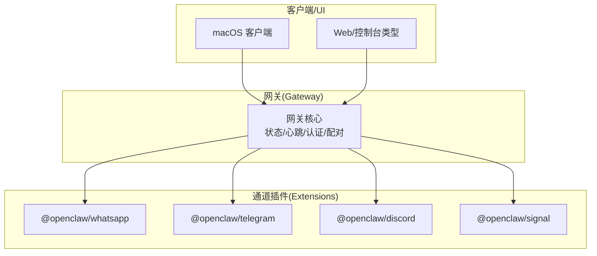
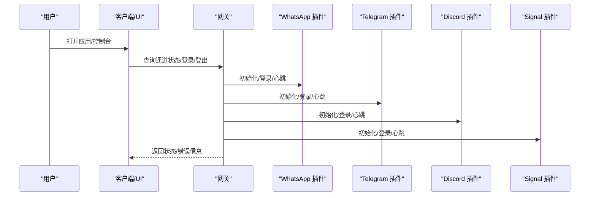
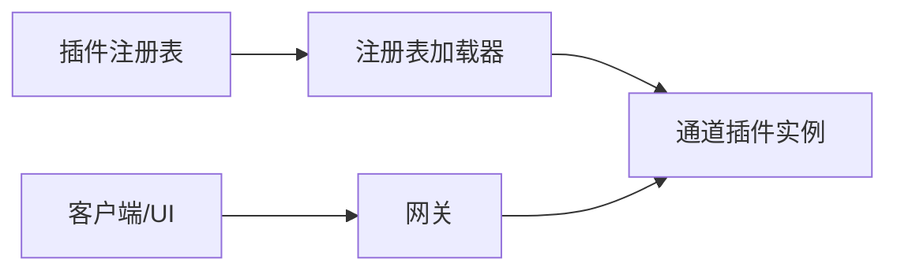

# 主流即时通讯平台

## 目录
1. [简介](#简介)
2. [项目结构](#项目结构)
3. [核心组件](#核心组件)
4. [架构总览](#架构总览)
5. [详细组件分析](#详细组件分析)
6. [依赖关系分析](#依赖关系分析)
7. [性能考量](#性能考量)
8. [故障排查指南](#故障排查指南)
9. [结论](#结论)
10. [附录](#附录)

## 简介
本文件面向在 OpenClaw 中集成主流即时通讯平台的工程与产品团队，聚焦 WhatsApp、Telegram、Discord、Signal 四大平台的接入方式与最佳实践。内容涵盖认证流程、API 使用方法、配置参数、消息格式差异、媒体处理能力、群组管理、平台选择与迁移建议，并提供可操作的配置参考与排障清单。

## 项目结构
OpenClaw 通过“网关 + 插件”架构统一接入多通道。各平台以插件形式注册到运行时，由网关负责状态、心跳、认证、配对与消息路由。文档与插件包位于 docs 与 extensions 目录，核心通道插件接口定义在 src/channels/plugins 下。

图表来源
- [extensions/whatsapp/package.json](file://extensions/whatsapp/package.json#L1-L13)
- [extensions/telegram/package.json](file://extensions/telegram/package.json#L1-L13)
- [extensions/discord/package.json](file://extensions/discord/package.json#L1-L12)
- [extensions/signal/package.json](file://extensions/signal/package.json#L1-L13)
- [src/channels/plugins/types.plugin.ts](file://src/channels/plugins/types.plugin.ts#L49-L85)

章节来源
- [docs/channels/index.md](file://docs/channels/index.md#L1-L48)
- [extensions/whatsapp/package.json](file://extensions/whatsapp/package.json#L1-L13)
- [extensions/telegram/package.json](file://extensions/telegram/package.json#L1-L13)
- [extensions/discord/package.json](file://extensions/discord/package.json#L1-L12)
- [extensions/signal/package.json](file://extensions/signal/package.json#L1-L13)

## 核心组件
- 通道插件契约与加载
  - 通道插件通过统一契约暴露配置、认证、配对、安全、消息、线程、动作、心跳等适配器，网关按需调用。
  - 插件加载器基于运行时注册表解析并缓存插件实例，避免重复初始化。
- 平台特性抽象
  - 各平台在插件中实现自身能力边界（如 Telegram 的长轮询/Webhook、Discord 的交互组件、Signal 的 signal-cli 外部进程等）。
- 客户端与状态展示
  - macOS 客户端与 UI 类型定义提供通道状态探测、登录/登出、错误信息等前端体验。

章节来源
- [src/channels/plugins/types.plugin.ts](file://src/channels/plugins/types.plugin.ts#L49-L85)
- [src/channels/plugins/load.ts](file://src/channels/plugins/load.ts#L1-L8)
- [src/channels/plugins/registry-loader.ts](file://src/channels/plugins/registry-loader.ts#L1-L35)
- [apps/macos/Sources/OpenClaw/ChannelsStore+Lifecycle.swift](file://apps/macos/Sources/OpenClaw/ChannelsStore+Lifecycle.swift#L121-L163)
- [ui/src/ui/types.ts](file://ui/src/ui/types.ts#L74-L138)

## 架构总览
下图展示了 OpenClaw 与四大通道的交互关系：网关负责生命周期与策略，通道插件封装平台差异，客户端用于登录、登出与状态探测。

图表来源
- [apps/macos/Sources/OpenClaw/ChannelsStore+Lifecycle.swift](file://apps/macos/Sources/OpenClaw/ChannelsStore+Lifecycle.swift#L121-L163)
- [ui/src/ui/types.ts](file://ui/src/ui/types.ts#L74-L138)
- [src/channels/plugins/load.ts](file://src/channels/plugins/load.ts#L1-L8)

## 详细组件分析

### WhatsApp 集成
- 认证与配对
  - 通过二维码登录链接设备会话；支持多账号；默认 DM 策略为“配对”，可切换为白名单/开放/禁用。
  - 自聊天保护：当自聊号码在允许列表中时，跳过已读回执、避免自触发提及。
- 消息与上下文
  - 文本分片：默认按长度切分，支持按换行优先；媒体占位符标准化；群组上下文缓冲与注入标记。
  - 媒体：支持图片/视频/音频/文档；语音备注强制编码；首张媒体可带标题；自动优化尺寸与质量。
- 群组与提及
  - 群组允许列表 + 发送者白名单；默认需要被提及才激活；会话级命令可切换激活模式。
- 配置要点
  - 关键字段：dmPolicy、allowFrom、groupPolicy、groupAllowFrom、groups、textChunkLimit、chunkMode、mediaMaxMb、sendReadReceipts、ackReaction、accounts.*、configWrites、debounceMs、web.*、session.dmScope、historyLimit 等。
- 最佳实践
  - 建议使用独立号码；个人号回环保护；合理设置历史上下文与分片策略；谨慎开启“开放”策略。
- 常见问题
  - 未链接/断连：重新登录/检查重连参数；无活动监听：确保网关运行且账户已链接；群消息被忽略：核对策略、提及与重复键。

章节来源
- [docs/channels/whatsapp.md](file://docs/channels/whatsapp.md#L1-L446)
- [docs/gateway/configuration-reference.md](file://docs/gateway/configuration-reference.md#L92-L151)

### Telegram 集成
- 认证与配对
  - 通过 BotFather 获取 Token；默认 DM 策略为“配对”；支持白名单/开放/禁用；群组默认“允许列表”，可设为“开放”。
  - 提及行为：默认需要被提及；可通过会话级命令或持久化配置调整。
- 功能特性
  - 流式预览：支持部分文本实时编辑；支持命令菜单注册；内联按钮作用域可配置；论坛主题支持；回复线程标签；音频/视频/贴纸处理；反应通知级别；长轮询/可选 Webhook。
  - 工具与动作：消息发送、删除、编辑、反应、贴图搜索、话题创建等；可按账户/通道开关。
- 配置要点
  - 关键字段：enabled、botToken、dmPolicy、allowFrom、groups.*、groupPolicy、groupAllowFrom、customCommands、replyToMode、linkPreview、streaming、actions.*、reactionNotifications、mediaMaxMb、retry.*、webhookUrl、webhookSecret、historyLimit、dmHistoryLimit 等。
- 最佳实践
  - 关闭隐私模式或提升为管理员以接收全量群消息；使用论坛主题隔离话题；谨慎开启“开放”策略；合理设置流式预览与链接预览。
- 常见问题
  - 非提及群消息无响应：关闭隐私模式或允许管理员；命令注册失败：检查出口网络可达性；长轮询并发：结合全局并发设置。

章节来源
- [docs/channels/telegram.md](file://docs/channels/telegram.md#L1-L948)
- [docs/gateway/configuration-reference.md](file://docs/gateway/configuration-reference.md#L152-L203)

### Discord 集成
- 认证与配对
  - 开发者门户创建应用与机器人，启用特权意图；邀请机器人至服务器；默认 DM 策略为“配对”；支持白名单/开放/禁用。
- 功能特性
  - 服务器/频道/私聊路由；论坛/媒体频道仅接受主题帖；交互组件容器（按钮/选择/模态）；线程绑定会话；持久化 ACP 绑定；反应通知；ACK 反应；配置写入。
- 配置要点
  - 关键字段：enabled、token、dmPolicy、allowFrom、groupPolicy、guilds.*、channels.*、roles/users 允许列表、requireMention、ignoreOtherMentions、replyToMode、streaming、historyLimit、dmHistoryLimit、threadBindings.*、actions.*、reactionNotifications、configWrites 等。
- 最佳实践
  - 启用 Message Content Intent；为角色/用户允许列表提供稳定 ID；使用线程绑定提升子代理/ACP 工作区稳定性；谨慎开启“开放”策略。
- 常见问题
  - 无权限：检查机器人权限与意图；非提及不响应：调整 requireMention；线程绑定不可用：确认通道与全局配置。

章节来源
- [docs/channels/discord.md](file://docs/channels/discord.md#L1-L1223)
- [docs/gateway/configuration-reference.md](file://docs/gateway/configuration-reference.md#L1-L200)

### Signal 集成
- 认证与配对
  - 通过 signal-cli 外部进程对接；支持 QR 链接或短信注册；默认 DM 策略为“配对”；支持白名单/开放/禁用。
- 行为与媒体
  - 单向路由：回复总是回到同一号码或群组；DM 共享主会话；群组隔离；Typing 指示与可选已读回执；媒体下载与大小限制；文本分片与换行优先。
- 配置要点
  - 关键字段：enabled、account、cliPath、httpUrl、autoStart、startupTimeoutMs、receiveMode、ignoreAttachments、ignoreStories、sendReadReceipts、dmPolicy、allowFrom、groupPolicy、groupAllowFrom、historyLimit、dmHistoryLimit、textChunkLimit、chunkMode、mediaMaxMb、actions.reactions、reactionLevel 等。
- 最佳实践
  - 使用独立机器人号码；保持 signal-cli 更新；谨慎开启“开放”策略；必要时使用外部守护进程模式。
- 常见问题
  - 无法接收/发送：检查 daemon 可达性与账户设置；DM 被忽略：确认配对状态；群消息被阻：检查发送者/提及策略。

章节来源
- [docs/channels/signal.md](file://docs/channels/signal.md#L1-L326)
- [docs/gateway/configuration-reference.md](file://docs/gateway/configuration-reference.md#L1-L200)

### 平台对比与选择指南
- 快速上手
  - Telegram 最简单（只需 Token），WhatsApp 需 QR 登录且状态较多，Discord 需开发者门户与意图，Signal 需 signal-cli 与号码。
- 群组与话题
  - Telegram 支持论坛主题；Discord 支持线程绑定与 ACP 绑定；WhatsApp/Discord 支持群组隔离；Signal 支持群组隔离。
- 媒体与流式
  - Telegram/Signal 支持贴纸/媒体；Discord 支持丰富交互组件；WhatsApp 支持语音备注与媒体优化。
- 安全与策略
  - 四平台均支持 DM/群组策略与配对；建议默认“配对”或“白名单”，谨慎使用“开放”。

章节来源
- [docs/channels/index.md](file://docs/channels/index.md#L1-L48)
- [docs/channels/telegram.md](file://docs/channels/telegram.md#L1-L948)
- [docs/channels/discord.md](file://docs/channels/discord.md#L1-L1223)
- [docs/channels/whatsapp.md](file://docs/channels/whatsapp.md#L1-L446)
- [docs/channels/signal.md](file://docs/channels/signal.md#L1-L326)

## 依赖关系分析
通道插件通过统一契约与网关交互，运行时从注册表加载插件并缓存，避免重复初始化。客户端与 UI 通过 RPC 调用网关进行登录/登出与状态探测。

图表来源
- [src/channels/plugins/registry-loader.ts](file://src/channels/plugins/registry-loader.ts#L1-L35)
- [src/channels/plugins/load.ts](file://src/channels/plugins/load.ts#L1-L8)
- [src/channels/plugins/types.plugin.ts](file://src/channels/plugins/types.plugin.ts#L49-L85)

章节来源
- [src/channels/plugins/registry-loader.ts](file://src/channels/plugins/registry-loader.ts#L1-L35)
- [src/channels/plugins/load.ts](file://src/channels/plugins/load.ts#L1-L8)
- [src/channels/plugins/types.plugin.ts](file://src/channels/plugins/types.plugin.ts#L49-L85)

## 性能考量
- 分片与限流
  - 文本分片与换行优先可减少截断；媒体大小限制与自动优化降低传输成本。
- 并发与队列
  - Telegram 长轮询与全局并发设置；Discord 流式预览与块模式可平衡延迟与吞吐。
- 连接与重试
  - 各平台心跳与重连参数；Webhook/长轮询选择影响延迟与资源占用。
- 历史上下文
  - 合理设置历史上下文上限，避免会话膨胀。

## 故障排查指南
- 通用步骤
  - 查看状态与日志；运行诊断命令；检查网络与代理；核对令牌/意图/权限。
- 平台特定
  - WhatsApp：未链接/断连/无监听；群消息被忽略；Bun 兼容性提示。
  - Telegram：隐私模式/管理员；命令注册失败；长轮询并发。
  - Discord：意图/权限；非提及不响应；线程绑定。
  - Signal：daemon 可达性；配对状态；媒体下载与大小限制。

章节来源
- [docs/channels/whatsapp.md](file://docs/channels/whatsapp.md#L374-L424)
- [docs/channels/telegram.md](file://docs/channels/telegram.md#L793-L800)
- [docs/channels/discord.md](file://docs/channels/discord.md#L1-L1223)
- [docs/channels/signal.md](file://docs/channels/signal.md#L251-L286)

## 结论
OpenClaw 通过统一通道插件契约与网关，将 WhatsApp、Telegram、Discord、Signal 的差异抽象为一致的配置与行为模型。建议根据团队需求与合规要求选择平台：快速上手选 Telegram，企业协作选 Discord，隐私优先选 Signal，生态丰富选 WhatsApp。遵循策略与分片、媒体优化、历史上下文与流式预览的最佳实践，可获得稳定高效的跨平台消息体验。

## 附录
- 配置参考
  - 通道通用策略与字段：参见配置参考中的“DM 与群组访问”、“通道默认值与心跳”等章节。
- 客户端与状态
  - macOS 客户端提供通道登出与状态探测；UI 类型定义包含各通道状态结构。

章节来源
- [docs/gateway/configuration-reference.md](file://docs/gateway/configuration-reference.md#L18-L91)
- [apps/macos/Sources/OpenClaw/ChannelsStore+Lifecycle.swift](file://apps/macos/Sources/OpenClaw/ChannelsStore+Lifecycle.swift#L121-L163)
- [ui/src/ui/types.ts](file://ui/src/ui/types.ts#L74-L138)
- [src/gateway/server.channels.test.ts](file://src/gateway/server.channels.test.ts#L43-L98)