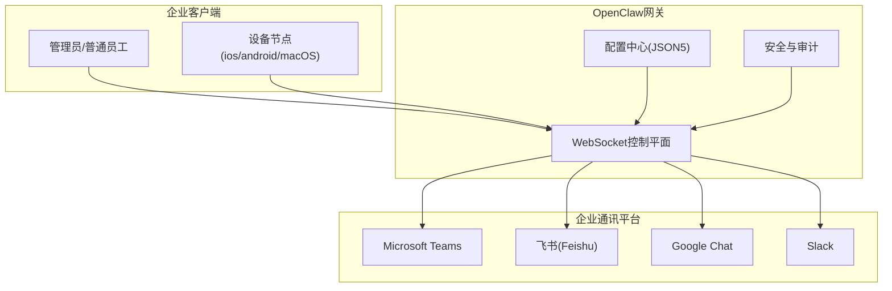
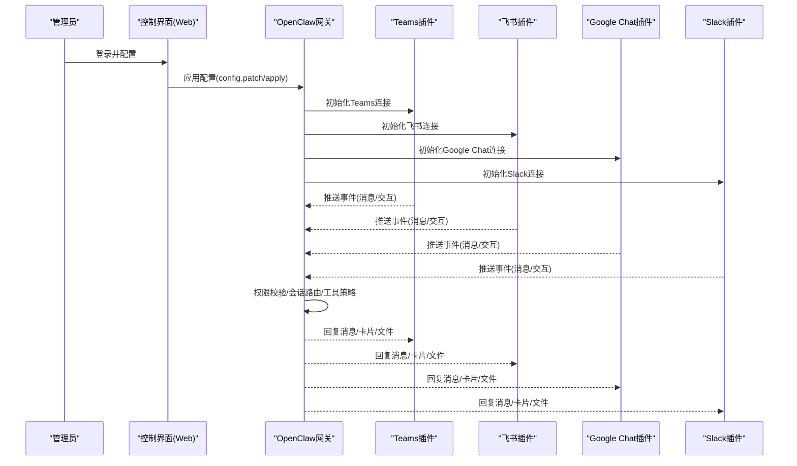
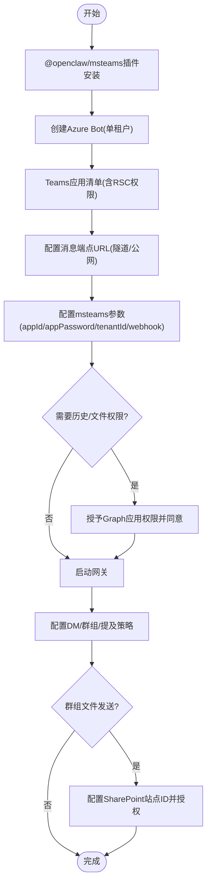
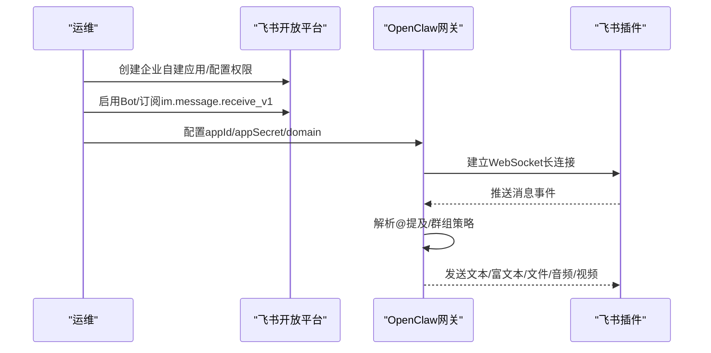
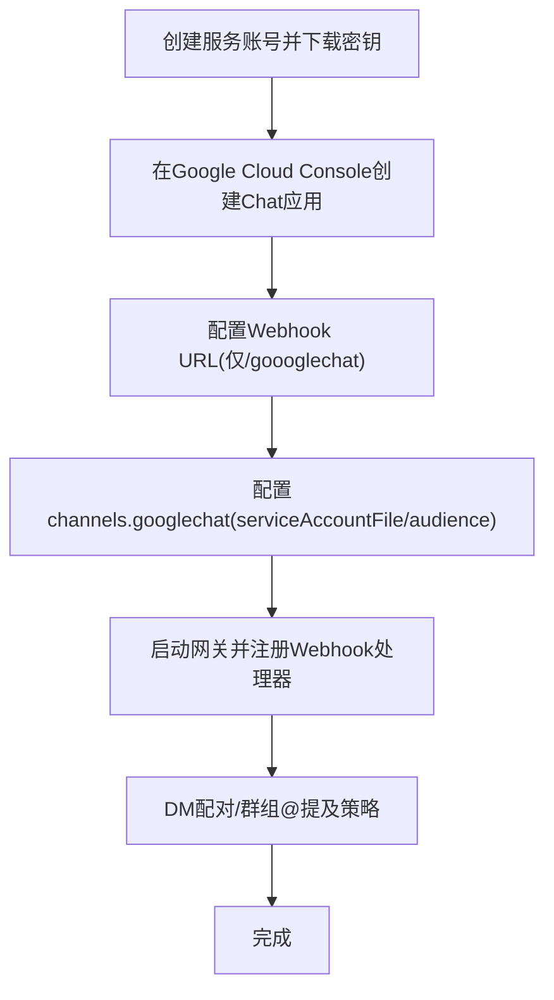
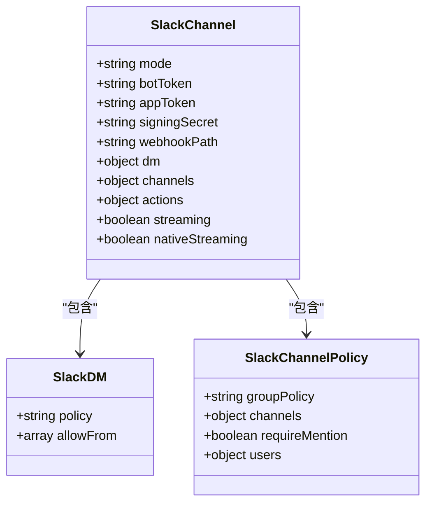
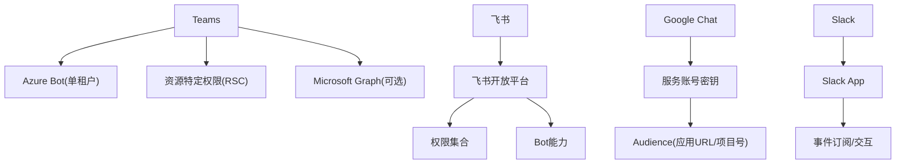

# 企业级通讯平台

## 目录
1. [简介](#简介)
2. [项目结构](#项目结构)
3. [核心组件](#核心组件)
4. [架构总览](#架构总览)
5. [详细组件分析](#详细组件分析)
6. [依赖关系分析](#依赖关系分析)
7. [性能考虑](#性能考虑)
8. [故障排除指南](#故障排除指南)
9. [结论](#结论)
10. [附录](#附录)

## 简介
本文件面向企业级部署场景，系统性阐述OpenClaw在Microsoft Teams、飞书（Feishu）、Google Chat、Slack等企业级平台的集成方式，覆盖认证机制、权限管理、合规要求、消息路由、安全策略与审计日志，并提供组织架构映射、部门权限控制与跨团队协作能力的企业部署指南与安全配置建议。

## 项目结构
OpenClaw以“网关（Gateway）+ 多通道插件”的架构运行，支持在本地或远程服务器上部署，通过统一的WebSocket控制平面连接各类聊天平台。企业用户可通过插件化扩展接入Teams、飞书、Google Chat、Slack等平台，并结合配置中心实现细粒度的访问控制、会话隔离与工具策略。

图表来源
- [README.md](file://README.md#L185-L202)
- [docs/index.md](file://docs/index.md#L59-L71)

章节来源
- [README.md](file://README.md#L21-L27)
- [docs/index.md](file://docs/index.md#L59-L71)

## 核心组件
- 网关（Gateway）：统一的控制平面，负责会话管理、路由、事件处理与对外服务暴露。
- 渠道插件：针对各平台的消息收发、鉴权、媒体处理与权限控制。
- 配置中心：基于JSON5的严格校验配置，支持热重载与分片组织。
- 安全与审计：令牌管理、配对流程、访问控制、日志与合规。

章节来源
- [docs/gateway/configuration.md](file://docs/gateway/configuration.md#L10-L24)
- [docs/gateway/authentication.md](file://docs/gateway/authentication.md#L9-L20)

## 架构总览
下图展示企业环境下OpenClaw如何通过网关对接多平台，实现消息路由、权限控制与安全策略落地。

图表来源
- [docs/channels/msteams.md](file://docs/channels/msteams.md#L142-L150)
- [docs/channels/feishu.md](file://docs/channels/feishu.md#L290-L296)
- [docs/channels/googlechat.md](file://docs/channels/googlechat.md#L139-L153)
- [docs/channels/slack.md](file://docs/channels/slack.md#L12-L22)

## 详细组件分析

### Microsoft Teams 集成
- 插件化部署：Teams作为独立插件安装，便于与核心版本解耦更新。
- 认证与暴露：需创建Azure Bot（单租户），配置消息端点（本地开发可用隧道或生产使用公网URL）。
- 权限与许可：支持资源特定权限（RSC）实现实时监听；若需历史消息与文件下载，需申请Microsoft Graph应用权限并授予管理员同意。
- 访问控制：支持DM配对策略、群组允许列表、提及要求、按团队/频道覆盖。
- 文件发送：个人DM可使用内置文件许可卡；群组/频道需配置SharePoint站点ID并通过Graph上传后分享链接。
- 会话与回复样式：支持线程式与帖子式两种UI风格，需按实际频道配置replyStyle避免回复错位。
- 故障排除：常见问题包括图片不显示（缺少Graph权限）、无响应（需@提及或配置允许）、清单版本不一致、Webhook 401等。

图表来源
- [docs/channels/msteams.md](file://docs/channels/msteams.md#L16-L38)
- [docs/channels/msteams.md](file://docs/channels/msteams.md#L151-L193)
- [docs/channels/msteams.md](file://docs/channels/msteams.md#L293-L416)
- [docs/channels/msteams.md](file://docs/channels/msteams.md#L531-L597)

章节来源
- [docs/channels/msteams.md](file://docs/channels/msteams.md#L1-L777)

### 飞书（Feishu）集成
- 插件状态：当前版本已随核心发布，无需单独安装。
- 连接模式：推荐WebSocket长连接（无需公网URL），也可使用Webhook模式并设置验证令牌。
- 应用创建：在飞书开放平台创建企业自建应用，配置权限、启用Bot能力、订阅事件（im.message.receive_v1）。
- 访问控制：DM默认配对策略；群组支持开放/允许列表/禁用三种策略，可按群组开启/关闭@提及。
- 多账号与流式输出：支持多账号切换、消息分块限制、媒体大小限制、卡片流式输出。
- 身份与ID：群组ID（oc_xxx）、用户Open ID（ou_xxx），可通过日志或API调试器查询。

图表来源
- [docs/channels/feishu.md](file://docs/channels/feishu.md#L70-L162)
- [docs/channels/feishu.md](file://docs/channels/feishu.md#L164-L263)
- [docs/channels/feishu.md](file://docs/channels/feishu.md#L290-L326)

章节来源
- [docs/channels/feishu.md](file://docs/channels/feishu.md#L1-L652)

### Google Chat 集成
- 模式：支持HTTP Webhook（需公网HTTPS端点）。
- 认证：使用服务账号密钥文件，配置Audience类型与值（应用URL或项目编号）。
- 公网暴露：推荐仅暴露/goooglechat路径，私有仪表盘通过Tailscale Serve保护。
- 访问控制：DM默认配对；群组空间默认需要@提及；支持按空间细化策略与用户白名单。
- 目标标识：用户使用users/&lt;userId&gt;，空间使用spaces/&lt;spaceId&gt;；邮箱仅在特殊模式下用于允许列表匹配。

图表来源
- [docs/channels/googlechat.md](file://docs/channels/googlechat.md#L12-L51)
- [docs/channels/googlechat.md](file://docs/channels/googlechat.md#L64-L131)
- [docs/channels/googlechat.md](file://docs/channels/googlechat.md#L139-L153)

章节来源
- [docs/channels/googlechat.md](file://docs/channels/googlechat.md#L1-L262)

### Slack 集成
- 模式：Socket Mode（默认）与HTTP Events API均可使用。
- 认证：Socket Mode需App Token与Bot Token；HTTP模式需Bot Token与Signing Secret。
- 访问控制：DM策略（配对/允许列表/开放/禁用）；群组策略（开放/允许列表/禁用）；支持按频道细化。
- 命令与交互：原生Slack命令或单命令模式；支持交互式块与视图。
- 流式输出：支持Slack原生流式预览（partial/block/progress）。
- 事件映射：编辑/删除/反应/成员变更/话题变更等事件映射为系统事件。

图表来源
- [docs/channels/slack.md](file://docs/channels/slack.md#L12-L22)
- [docs/channels/slack.md](file://docs/channels/slack.md#L136-L205)
- [docs/channels/slack.md](file://docs/channels/slack.md#L284-L328)
- [docs/channels/slack.md](file://docs/channels/slack.md#L492-L532)

章节来源
- [docs/channels/slack.md](file://docs/channels/slack.md#L1-L555)

### 企业认证机制与模型凭据
- 支持API Key与OAuth两种模型认证方式；长期运行建议使用API Key。
- Anthropic订阅支持setup-token流程，但存在使用范围限制，建议优先使用API Key。
- 凭据轮换：支持多Key轮询与速率限制重试策略；可通过会话或代理维度指定认证档案。
- 凭据存储：支持SecretRef（env/file/exec）与onboarding向导写入守护进程环境。

章节来源
- [docs/gateway/authentication.md](file://docs/gateway/authentication.md#L11-L27)
- [docs/gateway/authentication.md](file://docs/gateway/authentication.md#L58-L92)
- [docs/gateway/authentication.md](file://docs/gateway/authentication.md#L123-L139)
- [docs/gateway/authentication.md](file://docs/gateway/authentication.md#L140-L159)

### 权限管理与合规要求
- DM策略：配对（默认）、允许列表、开放、禁用；建议在企业环境中默认配对并逐步放行。
- 群组策略：开放/允许列表/禁用；可按团队/频道细化提及要求与用户白名单。
- 工具策略：支持按渠道/发送者粒度的工具允许/拒绝/附加允许，避免越权操作。
- 数据最小化：媒体大小限制、历史记录限制、附件下载白名单与鉴权头策略。
- 合规审计：所有入站消息视为不受信任输入；建议开启日志与审计，保留会话与钩子运行记录。

章节来源
- [docs/gateway/configuration.md](file://docs/gateway/configuration.md#L135-L176)
- [docs/gateway/configuration.md](file://docs/gateway/configuration.md#L206-L226)
- [docs/gateway/configuration.md](file://docs/gateway/configuration.md#L270-L302)

### 组织架构映射与跨团队协作
- 多代理路由：通过绑定规则将不同渠道/用户映射到不同代理工作区，实现组织级隔离。
- 会话与线程：支持按用户/群组/频道/线程维度的会话绑定与重置策略，确保跨团队协作时上下文清晰。
- 工具与技能：按代理维度配置工具与技能集，满足不同部门/角色的合规与能力需求。

章节来源
- [docs/gateway/configuration.md](file://docs/gateway/configuration.md#L303-L323)
- [docs/gateway/configuration.md](file://docs/gateway/configuration.md#L178-L204)

## 依赖关系分析
- 平台依赖：Teams需Azure Bot与Teams应用清单；飞书需开放平台应用与事件订阅；Google Chat需服务账号与Chat应用；Slack需App与事件订阅。
- 网络依赖：Teams/Google Chat需公网端点或隧道；飞书/Slack可选Socket Mode或HTTP Events API。
- 权限依赖：Teams文件与历史需Graph权限；飞书需完整权限集合；Google Chat需服务账号与Audience配置；Slack需Bot/事件订阅/交互权限。

图表来源
- [docs/channels/msteams.md](file://docs/channels/msteams.md#L151-L193)
- [docs/channels/feishu.md](file://docs/channels/feishu.md#L70-L162)
- [docs/channels/googlechat.md](file://docs/channels/googlechat.md#L12-L51)
- [docs/channels/slack.md](file://docs/channels/slack.md#L24-L121)

章节来源
- [docs/channels/msteams.md](file://docs/channels/msteams.md#L151-L193)
- [docs/channels/feishu.md](file://docs/channels/feishu.md#L70-L162)
- [docs/channels/googlechat.md](file://docs/channels/googlechat.md#L12-L51)
- [docs/channels/slack.md](file://docs/channels/slack.md#L24-L121)

## 性能考虑
- 传输模式选择：Teams/Google Chat需公网端点，可能引入网络延迟；飞书/Slack可选Socket Mode减少延迟。
- 媒体处理：合理设置媒体大小上限与分块策略，避免大文件阻塞。
- 流式输出：Slack原生流式预览可提升用户体验，但需确保线程可用与权限满足。
- 会话绑定：按需启用线程绑定与重置策略，平衡上下文连续性与资源占用。

## 故障排除指南
- Teams
  - 图片不显示：检查Graph权限与管理员同意；重新安装应用并完全退出Teams刷新缓存。
  - 无响应：确认@提及策略、群组允许列表与版本一致性。
  - Webhook 401：预期行为，需正确配置Azure JWT或使用Azure Web Chat测试。
- 飞书
  - 无消息：确认应用已发布、事件订阅包含im.message.receive_v1、启用长连接、权限完整且网关运行。
  - App Secret泄露：重置密钥并更新配置后重启网关。
- Google Chat
  - 405方法不允许：检查channels.googlechat配置是否存在、插件是否启用、网关是否重启。
  - 公网暴露：仅暴露/goooglechat路径，仪表盘通过Tailscale Serve保护。
- Slack
  - 通道无回复：检查groupPolicy、频道允许列表、requireMention与用户白名单。
  - Socket模式未连接：验证Bot/App Token与Socket Mode开关。
  - HTTP模式未接收事件：核对Signing Secret、Webhook路径与请求URL一致性。

章节来源
- [docs/channels/msteams.md](file://docs/channels/msteams.md#L745-L777)
- [docs/channels/feishu.md](file://docs/channels/feishu.md#L450-L480)
- [docs/channels/googlechat.md](file://docs/channels/googlechat.md#L209-L262)
- [docs/channels/slack.md](file://docs/channels/slack.md#L433-L490)

## 结论
OpenClaw通过统一网关与插件化架构，为企业提供了在Teams、飞书、Google Chat、Slack等主流企业平台上的标准化集成路径。结合严格的访问控制、工具策略与合规审计，可在保障安全的前提下实现组织级的跨团队协作与自动化能力。建议在生产部署中优先采用API Key认证、最小权限原则与严格的媒体/历史访问策略，并通过隧道或受控端口暴露公网接口，确保数据与通信安全。

## 附录
- 快速参考
  - Teams：安装插件、创建Azure Bot、配置消息端点、授予Graph权限（如需）、配置msteams参数。
  - 飞书：创建企业自建应用、启用Bot、订阅事件、配置appId/appSecret/domain。
  - Google Chat：创建服务账号、配置Chat应用、仅暴露/goooglechat路径、配置Audience。
  - Slack：Socket Mode或HTTP Events API、配置App Token/Bot Token/Signing Secret、订阅事件。
- 安全最佳实践
  - 使用API Key而非易过期的订阅Token。
  - 严格限制工具与技能范围，按代理维度隔离。
  - 开启日志与审计，定期审查会话与钩子运行记录。
  - 仅在必要时授予Graph/应用权限，遵循最小权限原则。