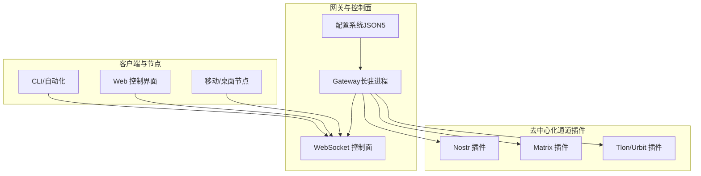
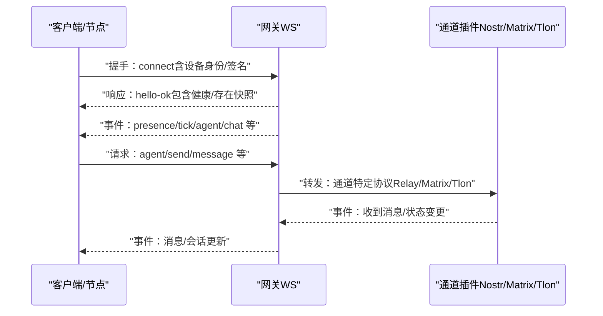
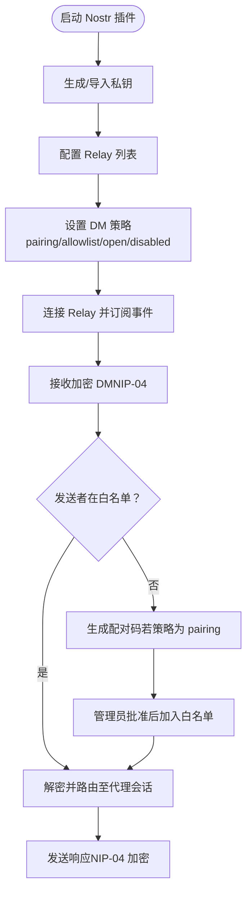
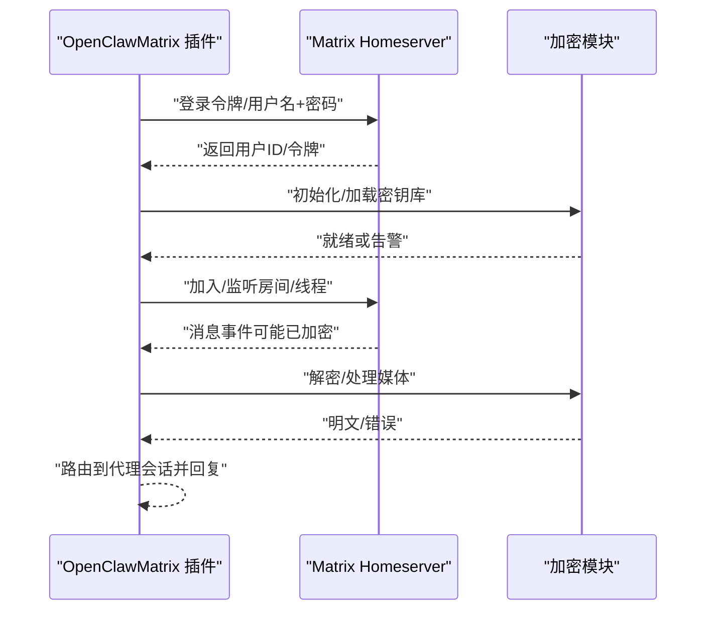
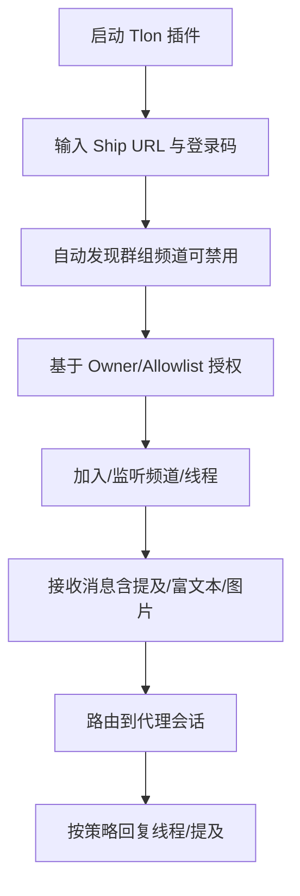
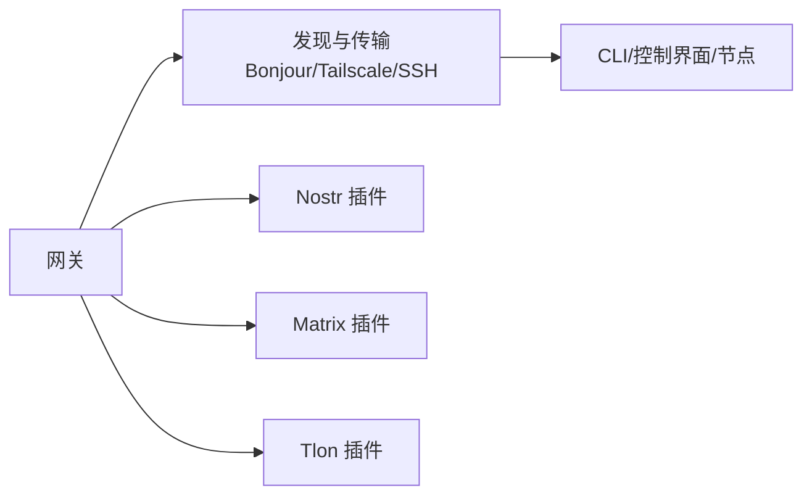

# 去中心化通讯平台

## 目录
1. [简介](#简介)
2. [项目结构](#项目结构)
3. [核心组件](#核心组件)
4. [架构总览](#架构总览)
5. [详细组件分析](#详细组件分析)
6. [依赖关系分析](#依赖关系分析)
7. [性能考量](#性能考量)
8. [故障排除指南](#故障排除指南)
9. [结论](#结论)
10. [附录](#附录)

## 简介
本文件面向在 OpenClaw 中集成去中心化通讯平台（Nostr、Matrix、Tlon/Urbit）的工程与运维读者，系统阐述以下主题：
- 平台集成方式：如何安装与配置各通道插件，以及与网关控制面的协作关系
- 去中心化身份与访问控制：基于密钥对、公钥白名单、配对码与授权策略
- 分布式网络与隐私保护：Relay/Mesh 拓扑、端到端加密、设备信任与会话隔离
- 消息传播与节点发现：Relay 转发、群组/线程路由、跨网络发现与传输选择
- 私有网络搭建与安全策略：容器化部署、绑定模式、TLS 与认证、防火墙与 SSRF 防护
- 部署与排障：Docker 容器化、本地/远程绑定、常见问题定位流程

## 项目结构
OpenClaw 将“网关（Gateway）+ 控制面（WebSocket）+ 多通道插件（Channels）”作为统一架构。去中心化平台通过插件形式接入，由网关负责：
- 统一的控制平面（WS）
- 通道连接与消息编解码
- 访问控制与会话管理
- 设备配对与鉴权

图表来源
- [docs/concepts/architecture.md](file://docs/concepts/architecture.md#L12-L52)
- [docs/gateway/network-model.md](file://docs/gateway/network-model.md#L8-L21)

章节来源
- [docs/concepts/architecture.md](file://docs/concepts/architecture.md#L12-L52)
- [docs/gateway/network-model.md](file://docs/gateway/network-model.md#L8-L21)

## 核心组件
- 网关（Gateway）：单一长驻进程，承载通道连接、控制面事件与会话状态；默认绑定回环地址，支持 LAN/Tailnet/SSH 远程访问。
- 控制面（WebSocket）：统一的请求/响应与事件推送协议，设备首次连接需完成配对与签名挑战。
- 通道插件（Channels）：以插件形式提供，分别对接 Nostr、Matrix、Tlon/Urbit，遵循统一的 DM/群组/线程/媒体/富文本能力模型。
- 配置系统（Configuration）：JSON5 结构，严格校验，支持热重载与分片 include。

章节来源
- [docs/concepts/architecture.md](file://docs/concepts/architecture.md#L27-L52)
- [docs/gateway/configuration.md](file://docs/gateway/configuration.md#L12-L25)

## 架构总览
下图展示从客户端到网关再到各去中心化通道的端到端交互路径，以及节点发现与传输选择策略。

图表来源
- [docs/concepts/architecture.md](file://docs/concepts/architecture.md#L59-L89)
- [docs/gateway/discovery.md](file://docs/gateway/discovery.md#L100-L124)

章节来源
- [docs/concepts/architecture.md](file://docs/concepts/architecture.md#L59-L89)
- [docs/gateway/discovery.md](file://docs/gateway/discovery.md#L100-L124)

## 详细组件分析

### Nostr 通道集成
- 安装与启用：通过插件安装命令按需安装；支持本地开发路径与稳定版本下载。
- 密钥与身份：使用私钥生成与导入，支持 nsec/hex 格式；公钥用于 DM 白名单匹配。
- Relay 与消息传播：可配置多个 wss://Relay；建议 2–3 个以平衡冗余与延迟；本地 Relay 便于测试。
- 访问控制：支持配对码（pairing）、允许列表（allowlist）、公开（open）与禁用（disabled）策略；允许列表仅接受完整 npub/hex 公钥。
- 协议支持：NIP-01（资料）、NIP-04（加密 DM），计划支持 NIP-17（gift-wrap）、NIP-44（版本化加密）。
- 安全与限制：私钥不落盘；生产环境建议 allowlist；当前 MVP 不支持群聊与媒体附件。

图表来源
- [docs/channels/nostr.md](file://docs/channels/nostr.md#L15-L83)
- [docs/channels/nostr.md](file://docs/channels/nostr.md#L115-L137)
- [docs/channels/nostr.md](file://docs/channels/nostr.md#L167-L175)

章节来源
- [docs/channels/nostr.md](file://docs/channels/nostr.md#L15-L83)
- [docs/channels/nostr.md](file://docs/channels/nostr.md#L115-L137)
- [docs/channels/nostr.md](file://docs/channels/nostr.md#L167-L175)

### Matrix 通道集成
- 插件化：作为独立插件安装，支持直接 DM、房间、线程、媒体、反应、投票、位置与端到端加密。
- 凭证与登录：支持访问令牌或用户名+密码登录；令牌自动存储于网关凭据目录；支持多账户。
- E2EE：启用后自动加载 Rust 加密模块，首次连接请求设备验证；加密房间消息自动解密；失败时记录警告。
- 房间与线程：默认房间策略为允许列表且需提及；支持 per-room 允许列表与提及开关；线程回复策略可配置。
- 安全与多账户：每账户独立加密存储；切换令牌/设备将创建新存储并要求重新验证。

图表来源
- [docs/channels/matrix.md](file://docs/channels/matrix.md#L39-L93)
- [docs/channels/matrix.md](file://docs/channels/matrix.md#L111-L137)
- [docs/channels/matrix.md](file://docs/channels/matrix.md#L180-L233)

章节来源
- [docs/channels/matrix.md](file://docs/channels/matrix.md#L39-L93)
- [docs/channels/matrix.md](file://docs/channels/matrix.md#L111-L137)
- [docs/channels/matrix.md](file://docs/channels/matrix.md#L180-L233)

### Tlon/Urbit 通道集成
- 插件化：作为独立插件安装，支持 DM、群组提及、线程回复、富文本与图片上传。
- 登录与 Ship：需要 Urbit Ship URL 与登录码；支持私网/内网 Ship 的 SSRF 开放选项（谨慎启用）。
- 自动发现与手动 Pin：默认自动发现群组频道，也可手动固定频道；支持邀请自动接受策略。
- 授权体系：Owner Ship 可自动授权并接收审批通知；支持 per-channel 授权规则。
- 能力矩阵：DM/群组/线程/富文本/图片上传；反应与投票暂未支持。

图表来源
- [docs/channels/tlon.md](file://docs/channels/tlon.md#L35-L57)
- [docs/channels/tlon.md](file://docs/channels/tlon.md#L85-L109)
- [docs/channels/tlon.md](file://docs/channels/tlon.md#L111-L146)

章节来源
- [docs/channels/tlon.md](file://docs/channels/tlon.md#L35-L57)
- [docs/channels/tlon.md](file://docs/channels/tlon.md#L85-L109)
- [docs/channels/tlon.md](file://docs/channels/tlon.md#L111-L146)

## 依赖关系分析
- 通道插件与网关：所有通道均通过网关的控制面进行连接与消息编排；通道配置位于 channels.&lt;provider&gt; 下，遵循统一的 DM/群组策略。
- 发现与传输：网关负责服务广告（Bonjour/Tailscale），客户端优先直连，否则回退 SSH；传输选择遵循“直连优先、SSH 回退”的策略。
- 安全与信任：设备配对与签名挑战由网关集中管理；TLS 与认证在非回环绑定场景中尤为重要；SSRF 保护在 Tlon 插件中体现为私网 URL 的显式允许。

图表来源
- [docs/gateway/discovery.md](file://docs/gateway/discovery.md#L43-L124)
- [docs/gateway/configuration.md](file://docs/gateway/configuration.md#L74-L105)

章节来源
- [docs/gateway/discovery.md](file://docs/gateway/discovery.md#L43-L124)
- [docs/gateway/configuration.md](file://docs/gateway/configuration.md#L74-L105)

## 性能考量
- Relay 与 Mesh：Nostr 建议 2–3 个 Relay 以提升可用性，避免过多 Relay 带来的延迟与重复。
- E2EE 成本：Matrix 启用加密会引入解密与密钥管理开销；加密模块缺失时会降级为明文处理并记录告警。
- 会话与线程：合理设置线程绑定与会话重置策略，避免长时间会话导致内存与状态膨胀。
- 容器化与资源：Docker 部署时注意 CPU/内存/文件句柄限制，必要时调整沙箱容器参数与 DNS/网络策略。

## 故障排除指南
- 通用诊断步骤（Matrix）：
  - 使用状态/网关状态/日志/医生命令快速定位；
  - 若 DM 被忽略，检查 DM 策略与配对状态；
  - 若加密房间无法解密，确认加密模块是否加载与设备是否已验证。
- Nostr 常见问题：
  - 无法接收消息：核对私钥格式与 Relay 可达性；确认启用状态与事件 ID 去重；
  - 无法发送响应：检查 Relay 写入权限、出站连通性与限流；
  - 重复回复：多 Relay 场景属预期，事件 ID 去重确保首条触发响应。
- Tlon 常见问题：
  - DM/群组被忽略：检查允许列表与 Owner Ship 授权；
  - 连接错误：确认 Ship URL 可达；私网 Ship 需开启允许私网选项；
  - 认证错误：登录码轮换频繁，需及时更新。
- 网络与绑定：
  - 非回环绑定需启用网关认证与 TLS（可选指纹）；
  - Bonjour/Tailscale 无法跨网段时，回退 SSH 或使用稳定的尾云域名/IP；
  - Docker 部署时注意端口发布与健康探针，确保容器健康状态。

章节来源
- [docs/channels/matrix.md](file://docs/channels/matrix.md#L248-L273)
- [docs/channels/nostr.md](file://docs/channels/nostr.md#L203-L234)
- [docs/channels/tlon.md](file://docs/channels/tlon.md#L232-L249)
- [docs/gateway/discovery.md](file://docs/gateway/discovery.md#L32-L42)
- [docs/install/docker.md](file://docs/install/docker.md#L469-L495)

## 结论
OpenClaw 通过“网关 + 控制面 + 插件化通道”的架构，为 Nostr、Matrix、Tlon 等去中心化平台提供了统一的接入与治理能力。在去中心化身份、分布式网络与隐私保护方面，项目强调：
- 以密钥对与白名单为核心的访问控制；
- 通过 Relay/Mesh 与端到端加密保障消息传播与机密性；
- 通过设备配对、签名挑战与 TLS/认证强化信任链；
- 通过容器化与沙箱策略降低运行风险。

建议在生产环境中：
- 采用 allowlist 策略与严格的设备/会话隔离；
- 在非回环绑定场景启用网关认证与 TLS；
- 对私网/内网服务谨慎开放 SSRF 保护；
- 使用 Docker 与健康探针保障高可用。

## 附录

### 去中心化身份验证与访问控制
- Nostr：私钥生成与导入、公钥白名单、配对码策略；
- Matrix：访问令牌/用户名密码登录、设备验证与加密存储；
- Tlon：Ship 登录码、Owner/Allowlist 授权、频道规则。

章节来源
- [docs/channels/nostr.md](file://docs/channels/nostr.md#L43-L83)
- [docs/channels/matrix.md](file://docs/channels/matrix.md#L69-L93)
- [docs/channels/tlon.md](file://docs/channels/tlon.md#L35-L57)

### 分布式网络与隐私保护
- Nostr：Relay 选择与冗余、NIP-04 加密、事件 ID 去重；
- Matrix：E2EE 解密、加密房间媒体、设备验证；
- Tlon：私网 Ship SSRF 开放选项、富文本与图片上传。

章节来源
- [docs/channels/nostr.md](file://docs/channels/nostr.md#L145-L175)
- [docs/channels/matrix.md](file://docs/channels/matrix.md#L111-L137)
- [docs/channels/tlon.md](file://docs/channels/tlon.md#L59-L84)

### 私有网络搭建与安全策略
- 绑定模式：回环优先，LAN/Tailnet/SSH 可选；
- TLS 与认证：非回环绑定建议启用认证与可选 TLS 指纹；
- Docker：健康探针、端口发布、卷挂载与权限；
- SSRF 与私网：Tlon 插件对私网 URL 的显式允许需谨慎评估。

章节来源
- [docs/gateway/network-model.md](file://docs/gateway/network-model.md#L11-L21)
- [docs/gateway/discovery.md](file://docs/gateway/discovery.md#L86-L108)
- [docs/install/docker.md](file://docs/install/docker.md#L26-L34)
- [docs/channels/tlon.md](file://docs/channels/tlon.md#L59-L84)

### 去中心化部署指南
- Docker 容器化：一键脚本构建镜像、引导向导、启动网关、生成令牌；
- 通道配置：通过 CLI 添加/登录各通道；
- 健康检查：/healthz 与 /readyz 探针；
- 多账户与多代理：按通道文档配置 accounts 与 bindings。

章节来源
- [docs/install/docker.md](file://docs/install/docker.md#L35-L84)
- [docs/gateway/configuration.md](file://docs/gateway/configuration.md#L74-L105)