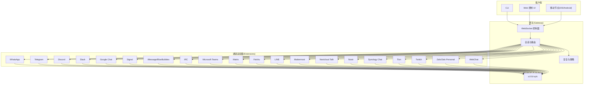
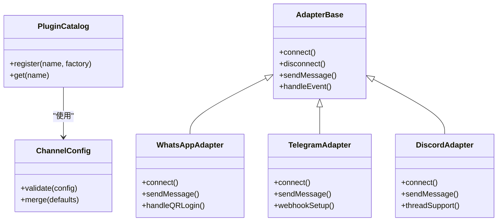
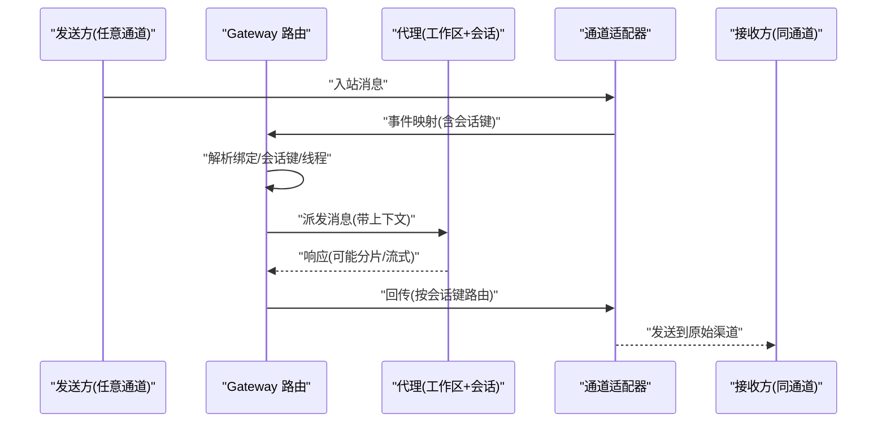
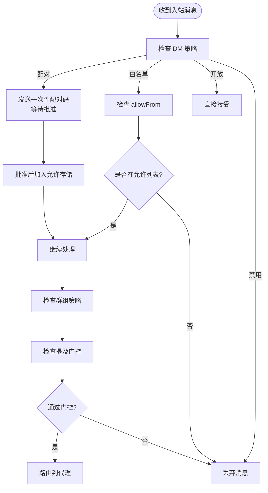
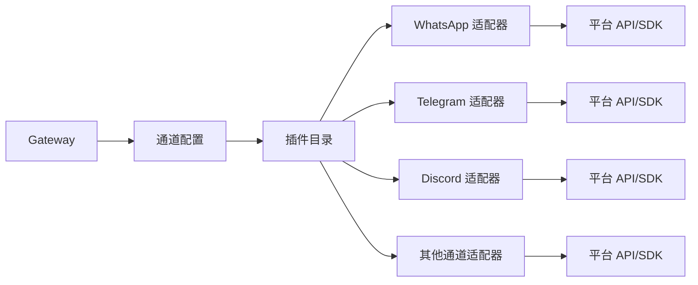

# 多渠道消息集成系统

## 目录
1. [简介](#简介)
2. [项目结构](#项目结构)
3. [核心组件](#核心组件)
4. [架构总览](#架构总览)
5. [详细组件分析](#详细组件分析)
6. [依赖关系分析](#依赖关系分析)
7. [性能考量](#性能考量)
8. [故障排除指南](#故障排除指南)
9. [结论](#结论)
10. [附录](#附录)

## 简介
OpenClaw 是一个自托管的多渠道消息网关，将 WhatsApp、Telegram、Discord、Slack、Google Chat、Signal、iMessage、BlueBubbles、IRC、Microsoft Teams、Matrix、Feishu、LINE、Mattermost、Nextcloud Talk、Nostr、Synology Chat、Tlon、Twitch、Zalo、Zalo Personal 和 WebChat 等即时通讯平台统一接入到一个控制平面（Gateway）。Gateway 作为单一控制平面，负责会话管理、路由、事件分发与工具调用，并提供 WebSocket 控制面、HTTP API、Web 控制界面以及移动端节点支持。

该系统强调本地优先、安全可控、多代理路由与跨平台一致性，支持 DM 配对策略、群组提及门控、回复标签、媒体处理与流式传输等高级能力。

## 项目结构
OpenClaw 的代码库采用模块化组织，核心目录与职责如下：
- docs：官方文档，涵盖运行手册、配置参考、通道指南与故障排除
- src：核心运行时实现，包括网关、通道适配器、路由、会话、安全与工具
- extensions：各即时通讯平台的插件适配器（扩展）
- skills：可选技能与工具集合
- apps：配套应用（macOS、iOS、Android）与共享组件
- scripts：安装、构建与运维脚本

```mermaid
graph TB
subgraph "文档"
D1["docs/index.md"]
D2["docs/gateway/index.md"]
D3["docs/channels/index.md"]
end
subgraph "核心运行时(src)"
S1["src/gateway/index.ts"]
S2["src/channels/*"]
S3["src/channels/plugins/*"]
end
subgraph "扩展(extensions)"
E1["extensions/whatsapp/index.ts"]
E2["extensions/telegram/index.ts"]
E3["extensions/discord/index.ts"]
E4["extensions/signal/index.ts"]
E5["extensions/imessage/index.ts"]
E6["extensions/googlechat/index.ts"]
E7["extensions/mattermost/index.ts"]
E8["extensions/msteams/index.ts"]
E9["extensions/irc/index.ts"]
E10["extensions/line/index.ts"]
E11["extensions/matrix/index.ts"]
E12["extensions/feishu/index.ts"]
E13["extensions/nextcloud-talk/index.ts"]
E14["extensions/nostr/index.ts"]
E15["extensions/synology-chat/index.ts"]
E16["extensions/tlon/index.ts"]
E17["extensions/twitch/index.ts"]
E18["extensions/zalo/index.ts"]
E19["extensions/zalouser/index.ts"]
E20["extensions/bluebubbles/index.ts"]
end
D1 --> S1
D2 --> S1
D3 --> S2
S1 --> S2
S2 --> S3
S2 --> E1
S2 --> E2
S2 --> E3
S2 --> E4
S2 --> E5
S2 --> E6
S2 --> E7
S2 --> E8
S2 --> E9
S2 --> E10
S2 --> E11
S2 --> E12
S2 --> E13
S2 --> E14
S2 --> E15
S2 --> E16
S2 --> E17
S2 --> E18
S2 --> E19
S2 --> E20
```

**图表来源**
- [docs/index.md](file://docs/index.md#L1-L193)
- [docs/gateway/index.md](file://docs/gateway/index.md#L1-L262)
- [docs/channels/index.md](file://docs/channels/index.md#L1-L48)
- [src/gateway/index.ts](file://src/gateway/index.ts)
- [src/channels/channel-config.ts](file://src/channels/channel-config.ts)
- [src/channels/plugins/catalog.ts](file://src/channels/plugins/catalog.ts)
- [extensions/whatsapp/index.ts](file://extensions/whatsapp/index.ts)
- [extensions/telegram/index.ts](file://extensions/telegram/index.ts)
- [extensions/discord/index.ts](file://extensions/discord/index.ts)
- [extensions/signal/index.ts](file://extensions/signal/index.ts)
- [extensions/imessage/index.ts](file://extensions/imessage/index.ts)
- [extensions/googlechat/index.ts](file://extensions/googlechat/index.ts)
- [extensions/mattermost/index.ts](file://extensions/mattermost/index.ts)
- [extensions/msteams/index.ts](file://extensions/msteams/index.ts)
- [extensions/irc/index.ts](file://extensions/irc/index.ts)
- [extensions/line/index.ts](file://extensions/line/index.ts)
- [extensions/matrix/index.ts](file://extensions/matrix/index.ts)
- [extensions/feishu/index.ts](file://extensions/feishu/index.ts)
- [extensions/nextcloud-talk/index.ts](file://extensions/nextcloud-talk/index.ts)
- [extensions/nostr/index.ts](file://extensions/nostr/index.ts)
- [extensions/synology-chat/index.ts](file://extensions/synology-chat/index.ts)
- [extensions/tlon/index.ts](file://extensions/tlon/index.ts)
- [extensions/twitch/index.ts](file://extensions/twitch/index.ts)
- [extensions/zalo/index.ts](file://extensions/zalo/index.ts)
- [extensions/zalouser/index.ts](file://extensions/zalouser/index.ts)
- [extensions/bluebubbles/index.ts](file://extensions/bluebubbles/index.ts)

**章节来源**
- [README.md](file://README.md#L21-L560)
- [docs/index.md](file://docs/index.md#L1-L193)
- [docs/gateway/index.md](file://docs/gateway/index.md#L1-L262)
- [docs/channels/index.md](file://docs/channels/index.md#L1-L48)

## 核心组件
- 网关（Gateway）：单一控制平面，提供 WebSocket 控制面、HTTP API、Web 控制界面与远程访问能力；负责会话、路由、事件与工具调用的编排。
- 通道适配器（Channel Adapters）：针对不同即时通讯平台的插件实现，负责认证、消息收发、群组管理、媒体处理与事件映射。
- 路由与会话（Routing & Sessions）：基于绑定规则与会话键的确定性路由，确保消息回送到来源渠道；支持主会话共享、按账户/频道隔离与线程绑定。
- 安全与访问控制（Security & Access Control）：DM 策略（配对/白名单/开放/禁用）、群组允许列表、提及门控与命令门控，结合沙箱与工具策略保障安全。
- 配置与热重载（Configuration & Hot Reload）：JSON5 配置、Schema 校验、环境变量与密钥引用、RPC 写入与热重载模式。

**章节来源**
- [docs/gateway/index.md](file://docs/gateway/index.md#L68-L262)
- [docs/gateway/configuration.md](file://docs/gateway/configuration.md#L1-L547)
- [docs/channels/channel-routing.md](file://docs/channels/channel-routing.md#L1-L135)
- [src/gateway/index.ts](file://src/gateway/index.ts)
- [src/channels/channel-config.ts](file://src/channels/channel-config.ts)
- [src/channels/plugins/catalog.ts](file://src/channels/plugins/catalog.ts)

## 架构总览
下图展示了从客户端到各通道适配器的消息路径与回传机制，以及 Gateway 的控制面角色。

**图表来源**
- [README.md](file://README.md#L185-L202)
- [docs/index.md](file://docs/index.md#L59-L70)
- [docs/gateway/index.md](file://docs/gateway/index.md#L68-L124)
- [docs/channels/index.md](file://docs/channels/index.md#L14-L38)
- [extensions/whatsapp/index.ts](file://extensions/whatsapp/index.ts)
- [extensions/telegram/index.ts](file://extensions/telegram/index.ts)
- [extensions/discord/index.ts](file://extensions/discord/index.ts)
- [extensions/signal/index.ts](file://extensions/signal/index.ts)
- [extensions/imessage/index.ts](file://extensions/imessage/index.ts)
- [extensions/googlechat/index.ts](file://extensions/googlechat/index.ts)
- [extensions/mattermost/index.ts](file://extensions/mattermost/index.ts)
- [extensions/msteams/index.ts](file://extensions/msteams/index.ts)
- [extensions/irc/index.ts](file://extensions/irc/index.ts)
- [extensions/line/index.ts](file://extensions/line/index.ts)
- [extensions/matrix/index.ts](file://extensions/matrix/index.ts)
- [extensions/feishu/index.ts](file://extensions/feishu/index.ts)
- [extensions/nextcloud-talk/index.ts](file://extensions/nextcloud-talk/index.ts)
- [extensions/nostr/index.ts](file://extensions/nostr/index.ts)
- [extensions/synology-chat/index.ts](file://extensions/synology-chat/index.ts)
- [extensions/tlon/index.ts](file://extensions/tlon/index.ts)
- [extensions/twitch/index.ts](file://extensions/twitch/index.ts)
- [extensions/zalo/index.ts](file://extensions/zalo/index.ts)
- [extensions/zalouser/index.ts](file://extensions/zalouser/index.ts)
- [extensions/bluebubbles/index.ts](file://extensions/bluebubbles/index.ts)

## 详细组件分析

### 渠道适配器架构
- 插件目录与注册：通道适配器以独立扩展形式存在，通过插件目录进行注册与发现，支持按需安装与启用。
- 配置与模式：每个通道拥有独立的配置模式与校验，支持令牌、Webhook、服务账号等多种认证方式。
- 事件映射与消息路由：适配器负责将平台原生事件映射为统一的消息模型，并交由 Gateway 进行路由与会话管理。

**图表来源**
- [src/channels/plugins/catalog.ts](file://src/channels/plugins/catalog.ts)
- [src/channels/plugins/config-schema.ts](file://src/channels/plugins/config-schema.ts)
- [src/channels/plugins/config-helpers.ts](file://src/channels/plugins/config-helpers.ts)
- [extensions/whatsapp/index.ts](file://extensions/whatsapp/index.ts)
- [extensions/telegram/index.ts](file://extensions/telegram/index.ts)
- [extensions/discord/index.ts](file://extensions/discord/index.ts)

**章节来源**
- [docs/channels/index.md](file://docs/channels/index.md#L14-L38)
- [src/channels/plugins/catalog.ts](file://src/channels/plugins/catalog.ts)
- [src/channels/plugins/config-schema.ts](file://src/channels/plugins/config-schema.ts)
- [src/channels/plugins/config-helpers.ts](file://src/channels/plugins/config-helpers.ts)
- [extensions/whatsapp/index.ts](file://extensions/whatsapp/index.ts)
- [extensions/telegram/index.ts](file://extensions/telegram/index.ts)
- [extensions/discord/index.ts](file://extensions/discord/index.ts)

### 消息路由机制
- 会话键与路由规则：根据消息来源（DM/群组/频道/线程）生成确定性的会话键，确保回复回到同一渠道；支持主会话共享与按账户/频道隔离。
- 绑定与广播：通过绑定规则将特定来源（如团队、服务器、群组、用户）映射到指定代理；支持广播组在满足条件时并行运行多个代理。
- 回复上下文：在入站回复中保留 ReplyToId/Body/Sender 并在正文追加“回复至...”块，保持跨渠道一致性。

**图表来源**
- [docs/channels/channel-routing.md](file://docs/channels/channel-routing.md#L58-L135)
- [src/channels/dock.ts](file://src/channels/dock.ts)
- [src/channels/conversation-label.ts](file://src/channels/conversation-label.ts)

**章节来源**
- [docs/channels/channel-routing.md](file://docs/channels/channel-routing.md#L1-L135)
- [src/channels/dock.ts](file://src/channels/dock.ts)
- [src/channels/conversation-label.ts](file://src/channels/conversation-label.ts)

### 认证流程与访问控制
- DM 策略：支持配对（Pairing）、白名单（Allowlist）、开放（Open）与禁用（Disabled），默认为配对策略以提升安全性。
- 群组策略：通过 groupPolicy 与 groupAllowFrom 控制群组访问；可设置 requireMention 实现提及门控。
- 命令门控：支持对特定命令的门控策略，结合 allowFrom 与 allowlist-match 实现细粒度控制。

**图表来源**
- [docs/gateway/configuration.md](file://docs/gateway/configuration.md#L135-L177)
- [src/channels/allow-from.ts](file://src/channels/allow-from.ts)
- [src/channels/allowlist-match.ts](file://src/channels/allowlist-match.ts)
- [src/channels/command-gating.ts](file://src/channels/command-gating.ts)
- [src/channels/plugins/allowlist-match.ts](file://src/channels/plugins/allowlist-match.ts)

**章节来源**
- [docs/gateway/configuration.md](file://docs/gateway/configuration.md#L135-L177)
- [src/channels/allow-from.ts](file://src/channels/allow-from.ts)
- [src/channels/allowlist-match.ts](file://src/channels/allowlist-match.ts)
- [src/channels/command-gating.ts](file://src/channels/command-gating.ts)
- [src/channels/plugins/allowlist-match.ts](file://src/channels/plugins/allowlist-match.ts)

### 会话管理与跨平台一致性
- 会话键规范：DM 使用主会话键；群组/频道使用带渠道标识的键；线程/话题在键中嵌入线程序列，确保上下文一致。
- 主 DM 路由固定：当 dmScope 为主会话且存在唯一所有者时，非所有者的 DM 不覆盖 lastRoute，避免会话被意外重定向。
- 存储位置：会话存储位于状态目录下的 agents/&lt;agentId&gt;/sessions，支持模板化路径覆盖。

**章节来源**
- [docs/channels/channel-routing.md](file://docs/channels/channel-routing.md#L24-L126)
- [src/channels/account-snapshot-fields.ts](file://src/channels/account-snapshot-fields.ts)

### 高级功能：群组消息路由、提及门控、回复标签与媒体处理
- 群组消息路由：通过 group-mentions 与 allowlist-match 实现按群组的提及门控与路由。
- 回复标签：在入站消息中保留 ReplyTo 信息并在输出中追加回复块，保证上下文可追溯。
- 媒体处理：媒体管道支持图片/音频/视频的转录钩子、尺寸限制与临时文件生命周期管理，确保资源可控与性能稳定。

**章节来源**
- [src/channels/plugins/group-mentions.ts](file://src/channels/plugins/group-mentions.ts)
- [src/channels/ack-reactions.ts](file://src/channels/ack-reactions.ts)
- [src/channels/draft-stream-controls.ts](file://src/channels/draft-stream-controls.ts)
- [src/channels/chat-type.ts](file://src/channels/chat-type.ts)

## 依赖关系分析
- 低耦合高内聚：通道适配器通过插件目录与统一配置接口解耦，新增通道仅需实现适配器接口与配置模式。
- 直接依赖：Gateway 对通道适配器的依赖通过插件目录与配置加载；路由与会话模块对适配器的依赖为事件驱动的单向调用。
- 外部依赖：各通道适配器依赖对应平台的 SDK 或 API（如 Baileys、grammY、discord.js、Bolt 等），Gateway 通过抽象层屏蔽差异。

**图表来源**
- [src/gateway/index.ts](file://src/gateway/index.ts)
- [src/channels/plugins/catalog.ts](file://src/channels/plugins/catalog.ts)
- [src/channels/channel-config.ts](file://src/channels/channel-config.ts)
- [extensions/whatsapp/index.ts](file://extensions/whatsapp/index.ts)
- [extensions/telegram/index.ts](file://extensions/telegram/index.ts)
- [extensions/discord/index.ts](file://extensions/discord/index.ts)

**章节来源**
- [src/gateway/index.ts](file://src/gateway/index.ts)
- [src/channels/plugins/catalog.ts](file://src/channels/plugins/catalog.ts)
- [src/channels/channel-config.ts](file://src/channels/channel-config.ts)

## 性能考量
- 流式与分片：支持响应流式输出与分片传输，降低端到端延迟并提升用户体验。
- 会话隔离与并发：通过会话键隔离上下文，结合线程绑定与超时策略控制并发与资源占用。
- 媒体优化：图像降采样、大小上限与临时文件清理减少磁盘与网络压力。
- 热重载与最小停机：大部分配置变更支持热重载，关键变更自动重启，Hybrid 模式在安全与可用性间取得平衡。

[本节为通用指导，不直接分析具体文件]

## 故障排除指南
- 端口冲突与绑定：若端口被占用或非 loopback 绑定未配置认证，Gateway 将拒绝启动；可通过强制重启或调整绑定模式解决。
- 配置校验失败：未知键、类型错误或值无效会导致 Gateway 拒绝启动；使用 doctor 诊断并修复，或使用 doctor --fix 自动修复。
- 远程访问：Tailscale Serve/Funnel 提供安全暴露，SSH 隧道为备选方案；注意即使通过隧道也必须携带正确的认证凭据。
- 通道就绪检查：使用 channels status --probe 检查各通道连接状态与认证有效性。

**章节来源**
- [docs/gateway/index.md](file://docs/gateway/index.md#L235-L244)
- [docs/gateway/configuration.md](file://docs/gateway/configuration.md#L61-L73)
- [docs/gateway/index.md](file://docs/gateway/index.md#L108-L124)

## 结论
OpenClaw 的多渠道消息集成系统通过统一的网关协议与插件化的通道适配器，实现了对 20+ 即时通讯平台的一致接入与管理。其确定性路由、会话隔离、安全策略与流式传输等特性，既保证了跨平台一致性，又兼顾了性能与可维护性。配合完善的配置体系与故障排除流程，用户可以在本地或远端环境中稳定地部署与运营该系统。

[本节为总结性内容，不直接分析具体文件]

## 附录

### 配置示例与最佳实践
- 最小配置：设置 agents.defaults.workspace 与 channels.&lt;provider&gt;.allowFrom，快速锁定 DM 访问范围。
- 模型与工具：在 agents.defaults 中设置 primary/fallback 模型与别名；结合沙箱与工具策略提升安全性。
- 群组提及门控：在 agents.list 与 channels.&lt;provider&gt;.groups 中配置 mentionPatterns 与 requireMention。
- 会话与重置：根据使用场景选择 dmScope 与 threadBindings；合理设置 reset 策略避免上下文膨胀。
- 多代理路由：通过 bindings 将不同来源映射到不同代理，实现工作区隔离与权限控制。
- 环境变量与密钥引用：使用 env 与 SecretRef 管理敏感信息，避免硬编码。

**章节来源**
- [docs/gateway/configuration.md](file://docs/gateway/configuration.md#L26-L347)
- [docs/gateway/configuration.md](file://docs/gateway/configuration.md#L449-L539)

### 典型通道配置要点
- WhatsApp：需要 QR 登录与凭证存储；建议开启配对 DM 策略并设置 allowFrom。
- Telegram：设置 botToken；可选 webhookUrl 与 webhookSecret；支持群组提及门控。
- Discord：设置 token；可选 commands 与 guilds；支持线程与论坛主题。
- Slack：设置 botToken 与 appToken；支持团队匹配与角色匹配。
- Google Chat：使用服务账号与 HTTP webhook。
- Signal：依赖 signal-cli；需正确配置设备与号码。
- iMessage/BlueBubbles：推荐 BlueBubbles；配置 serverUrl 与密码及 webhook。
- 其他通道：IRC、Matrix、Feishu、LINE、Mattermost、Nextcloud Talk、Nostr、Synology Chat、Tlon、Twitch、Zalo/Zalo Personal、WebChat 等均通过各自扩展实现，遵循统一配置模式。

**章节来源**
- [README.md](file://README.md#L340-L432)
- [docs/channels/index.md](file://docs/channels/index.md#L14-L38)
- [extensions/whatsapp/index.ts](file://extensions/whatsapp/index.ts)
- [extensions/telegram/index.ts](file://extensions/telegram/index.ts)
- [extensions/discord/index.ts](file://extensions/discord/index.ts)
- [extensions/signal/index.ts](file://extensions/signal/index.ts)
- [extensions/imessage/index.ts](file://extensions/imessage/index.ts)
- [extensions/googlechat/index.ts](file://extensions/googlechat/index.ts)
- [extensions/mattermost/index.ts](file://extensions/mattermost/index.ts)
- [extensions/msteams/index.ts](file://extensions/msteams/index.ts)
- [extensions/irc/index.ts](file://extensions/irc/index.ts)
- [extensions/line/index.ts](file://extensions/line/index.ts)
- [extensions/matrix/index.ts](file://extensions/matrix/index.ts)
- [extensions/feishu/index.ts](file://extensions/feishu/index.ts)
- [extensions/nextcloud-talk/index.ts](file://extensions/nextcloud-talk/index.ts)
- [extensions/nostr/index.ts](file://extensions/nostr/index.ts)
- [extensions/synology-chat/index.ts](file://extensions/synology-chat/index.ts)
- [extensions/tlon/index.ts](file://extensions/tlon/index.ts)
- [extensions/twitch/index.ts](file://extensions/twitch/index.ts)
- [extensions/zalo/index.ts](file://extensions/zalo/index.ts)
- [extensions/zalouser/index.ts](file://extensions/zalouser/index.ts)
- [extensions/bluebubbles/index.ts](file://extensions/bluebubbles/index.ts)