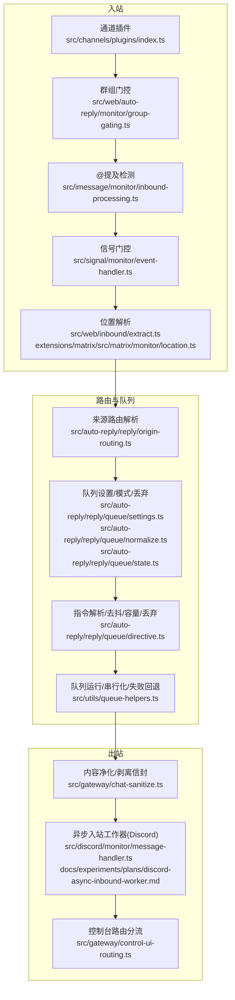
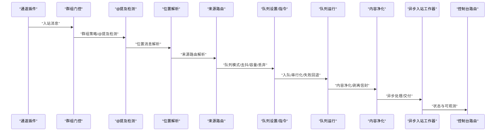
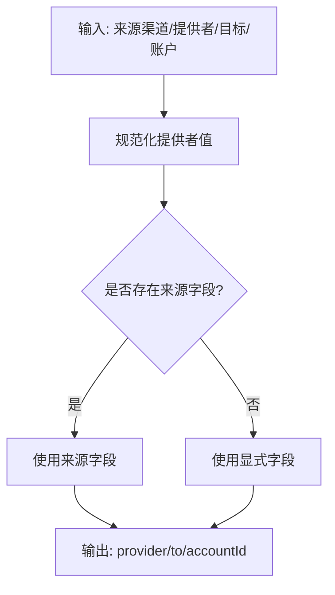
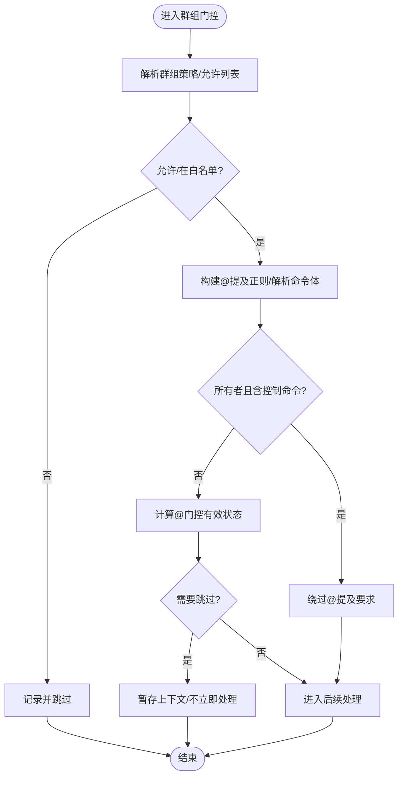
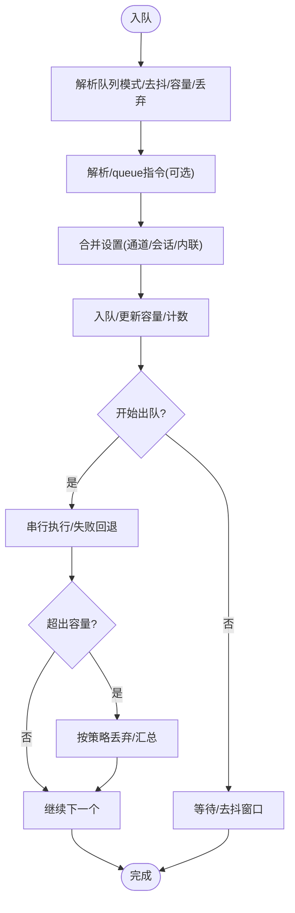
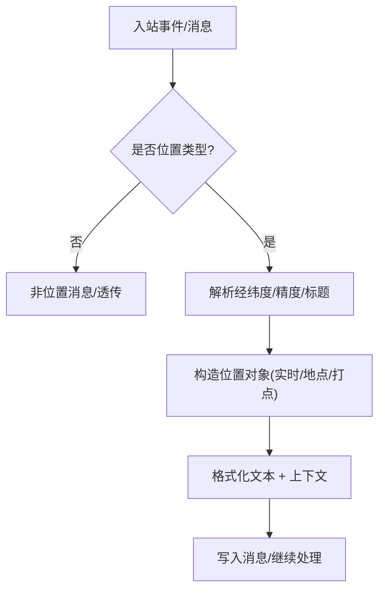
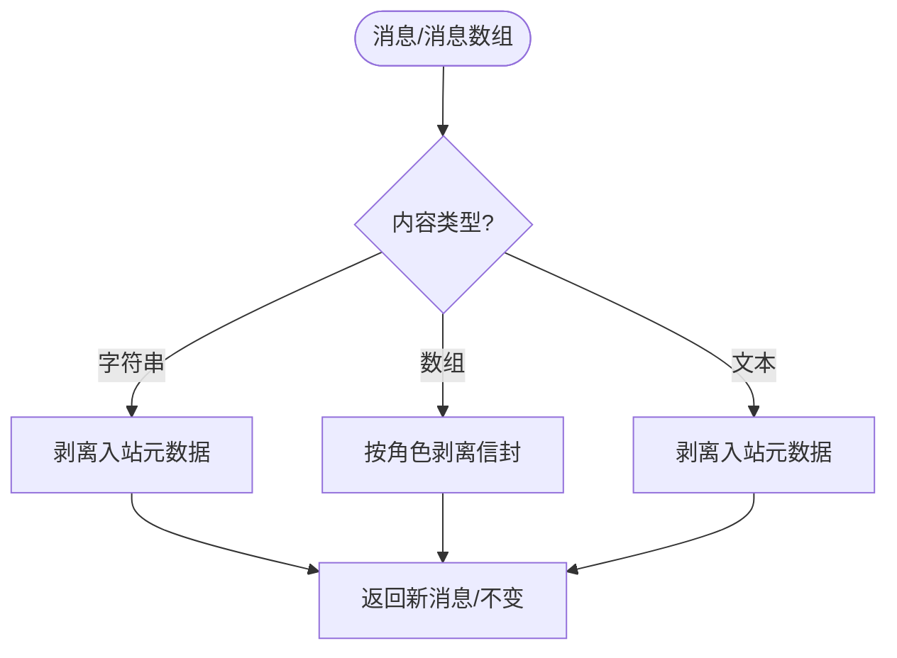
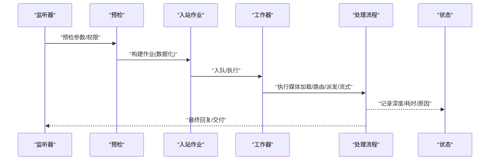
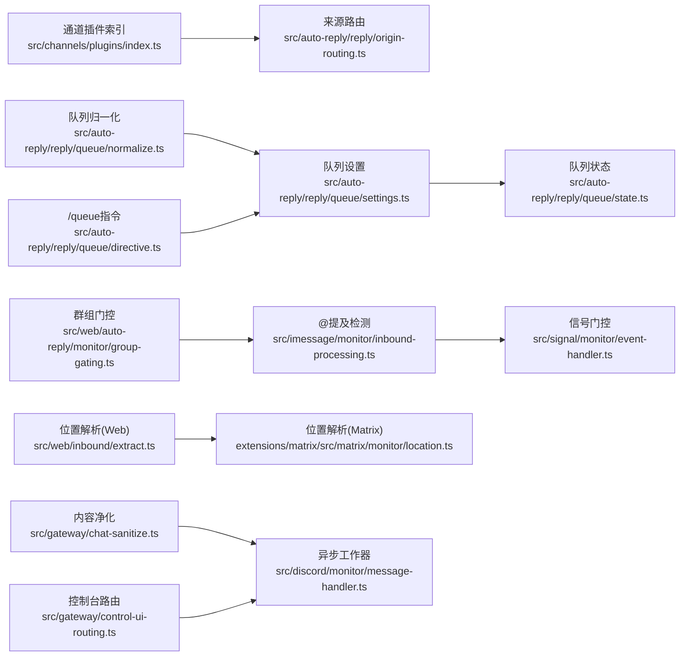

# 消息路由和处理

## 目录
1. [简介](#简介)
2. [项目结构](#项目结构)
3. [核心组件](#核心组件)
4. [架构总览](#架构总览)
5. [详细组件分析](#详细组件分析)
6. [依赖关系分析](#依赖关系分析)
7. [性能考量](#性能考量)
8. [故障排查指南](#故障排查指南)
9. [结论](#结论)
10. [附录：消息路由配置指南](#附录消息路由配置指南)

## 简介
本文件面向 OpenClaw 的消息路由与处理系统，系统性阐述消息在不同渠道之间的路由机制、优先级与负载均衡策略；群组消息处理、@提及门控、回复标签与位置信息处理；消息格式转换、内容过滤与安全检查；消息队列管理、批量与异步处理策略，并提供可操作的配置指南与性能优化建议。

## 项目结构
OpenClaw 将“通道插件”作为消息来源与分发的边界，结合“自动回复/队列/门控/提取/清理”等处理管线，形成从入站到出站的闭环。关键模块包括：
- 渠道插件注册与选择：通过通道插件索引与排序，确保路由与优先级可控
- 入站消息预处理：去噪、提及检测、群组门控、位置信息解析
- 队列与批处理：收集、去抖、容量与丢弃策略、跨通道隔离
- 出站发送与回退：失败重试、序列化与并发控制
- 安全与内容净化：去除外层信封、消息提示、敏感元数据
- 异步与可观测：Discord 异步入站工作器与状态监控

图表来源
- [src/channels/plugins/index.ts](file://src/channels/plugins/index.ts#L74-L90)
- [src/web/auto-reply/monitor/group-gating.ts](file://src/web/auto-reply/monitor/group-gating.ts#L82-L156)
- [src/imessage/monitor/inbound-processing.ts](file://src/imessage/monitor/inbound-processing.ts#L252-L267)
- [src/signal/monitor/event-handler.ts](file://src/signal/monitor/event-handler.ts#L613-L653)
- [src/web/inbound/extract.ts](file://src/web/inbound/extract.ts#L245-L289)
- [extensions/matrix/src/matrix/monitor/location.ts](file://extensions/matrix/src/matrix/monitor/location.ts#L67-L100)
- [src/auto-reply/reply/origin-routing.ts](file://src/auto-reply/reply/origin-routing.ts#L8-L30)
- [src/auto-reply/reply/queue/settings.ts](file://src/auto-reply/reply/queue/settings.ts#L32-L68)
- [src/auto-reply/reply/queue/normalize.ts](file://src/auto-reply/reply/queue/normalize.ts#L3-L44)
- [src/auto-reply/reply/queue/state.ts](file://src/auto-reply/reply/queue/state.ts#L31-L64)
- [src/auto-reply/reply/queue/directive.ts](file://src/auto-reply/reply/queue/directive.ts#L124-L176)
- [src/utils/queue-helpers.ts](file://src/utils/queue-helpers.ts#L135-L175)
- [src/gateway/chat-sanitize.ts](file://src/gateway/chat-sanitize.ts#L82-L124)
- [src/discord/monitor/message-handler.ts](file://src/discord/monitor/message-handler.ts#L1-L31)
- [docs/experiments/plans/discord-async-inbound-worker.md](file://docs/experiments/plans/discord-async-inbound-worker.md#L47-L250)
- [src/gateway/control-ui-routing.ts](file://src/gateway/control-ui-routing.ts#L11-L51)

章节来源
- [src/channels/plugins/index.ts](file://src/channels/plugins/index.ts#L74-L90)
- [src/auto-reply/reply/origin-routing.ts](file://src/auto-reply/reply/origin-routing.ts#L8-L30)
- [src/auto-reply/reply/queue/settings.ts](file://src/auto-reply/reply/queue/settings.ts#L32-L68)
- [src/auto-reply/reply/queue/normalize.ts](file://src/auto-reply/reply/queue/normalize.ts#L3-L44)
- [src/auto-reply/reply/queue/state.ts](file://src/auto-reply/reply/queue/state.ts#L31-L64)
- [src/auto-reply/reply/queue/directive.ts](file://src/auto-reply/reply/queue/directive.ts#L124-L176)
- [src/utils/queue-helpers.ts](file://src/utils/queue-helpers.ts#L135-L175)
- [src/web/auto-reply/monitor/group-gating.ts](file://src/web/auto-reply/monitor/group-gating.ts#L82-L156)
- [src/imessage/monitor/inbound-processing.ts](file://src/imessage/monitor/inbound-processing.ts#L252-L267)
- [src/signal/monitor/event-handler.ts](file://src/signal/monitor/event-handler.ts#L613-L653)
- [src/web/inbound/extract.ts](file://src/web/inbound/extract.ts#L245-L289)
- [extensions/matrix/src/matrix/monitor/location.ts](file://extensions/matrix/src/matrix/monitor/location.ts#L67-L100)
- [src/gateway/chat-sanitize.ts](file://src/gateway/chat-sanitize.ts#L82-L124)
- [src/discord/monitor/message-handler.ts](file://src/discord/monitor/message-handler.ts#L1-L31)
- [docs/experiments/plans/discord-async-inbound-worker.md](file://docs/experiments/plans/discord-async-inbound-worker.md#L47-L250)
- [src/gateway/control-ui-routing.ts](file://src/gateway/control-ui-routing.ts#L11-L51)

## 核心组件
- 渠道插件与路由
  - 通道插件注册与排序，保证路由顺序与优先级
  - 来源路由解析：提供者、目标与账户 ID 的归一化
- 队列与批处理
  - 队列模式（收集/中断/引导/跟进/引导+积压）、去抖、容量与丢弃策略
  - 命令行/正文指令解析，支持覆盖会话/通道级别设置
  - 队列运行与串行化、跨通道隔离、失败后继续
- 群组与门控
  - 群组策略、允许列表、@提及检测与隐式提及、控制命令绕过
  - 不同渠道的门控实现（如 iMessage、Signal）
- 位置信息处理
  - Web 入站与 Matrix 插件的位置解析与上下文构造
  - Android 节点侧位置获取与错误码
- 内容净化与安全
  - 去除入站元数据、消息提示、用户信封，保持内容干净
- 异步与可观测
  - Discord 入站异步工作器与状态监控，避免监听器超时导致的“无回复”问题

章节来源
- [src/channels/plugins/index.ts](file://src/channels/plugins/index.ts#L74-L90)
- [src/auto-reply/reply/origin-routing.ts](file://src/auto-reply/reply/origin-routing.ts#L8-L30)
- [src/auto-reply/reply/queue/settings.ts](file://src/auto-reply/reply/queue/settings.ts#L32-L68)
- [src/auto-reply/reply/queue/normalize.ts](file://src/auto-reply/reply/queue/normalize.ts#L3-L44)
- [src/auto-reply/reply/queue/state.ts](file://src/auto-reply/reply/queue/state.ts#L31-L64)
- [src/auto-reply/reply/queue/directive.ts](file://src/auto-reply/reply/queue/directive.ts#L124-L176)
- [src/utils/queue-helpers.ts](file://src/utils/queue-helpers.ts#L135-L175)
- [src/web/auto-reply/monitor/group-gating.ts](file://src/web/auto-reply/monitor/group-gating.ts#L82-L156)
- [src/imessage/monitor/inbound-processing.ts](file://src/imessage/monitor/inbound-processing.ts#L252-L267)
- [src/signal/monitor/event-handler.ts](file://src/signal/monitor/event-handler.ts#L613-L653)
- [src/web/inbound/extract.ts](file://src/web/inbound/extract.ts#L245-L289)
- [extensions/matrix/src/matrix/monitor/location.ts](file://extensions/matrix/src/matrix/monitor/location.ts#L67-L100)
- [apps/android/app/src/main/java/ai/openclaw/app/node/LocationHandler.kt](file://apps/android/app/src/main/java/ai/openclaw/app/node/LocationHandler.kt#L61-L100)
- [src/gateway/chat-sanitize.ts](file://src/gateway/chat-sanitize.ts#L82-L124)
- [src/discord/monitor/message-handler.ts](file://src/discord/monitor/message-handler.ts#L1-L31)
- [docs/experiments/plans/discord-async-inbound-worker.md](file://docs/experiments/plans/discord-async-inbound-worker.md#L47-L250)
- [src/gateway/control-ui-routing.ts](file://src/gateway/control-ui-routing.ts#L11-L51)

## 架构总览
下图展示从入站到出站的关键路径与交互：

图表来源
- [src/channels/plugins/index.ts](file://src/channels/plugins/index.ts#L74-L90)
- [src/web/auto-reply/monitor/group-gating.ts](file://src/web/auto-reply/monitor/group-gating.ts#L82-L156)
- [src/imessage/monitor/inbound-processing.ts](file://src/imessage/monitor/inbound-processing.ts#L252-L267)
- [src/signal/monitor/event-handler.ts](file://src/signal/monitor/event-handler.ts#L613-L653)
- [src/web/inbound/extract.ts](file://src/web/inbound/extract.ts#L245-L289)
- [extensions/matrix/src/matrix/monitor/location.ts](file://extensions/matrix/src/matrix/monitor/location.ts#L67-L100)
- [src/auto-reply/reply/origin-routing.ts](file://src/auto-reply/reply/origin-routing.ts#L8-L30)
- [src/auto-reply/reply/queue/settings.ts](file://src/auto-reply/reply/queue/settings.ts#L32-L68)
- [src/auto-reply/reply/queue/directive.ts](file://src/auto-reply/reply/queue/directive.ts#L124-L176)
- [src/utils/queue-helpers.ts](file://src/utils/queue-helpers.ts#L135-L175)
- [src/gateway/chat-sanitize.ts](file://src/gateway/chat-sanitize.ts#L82-L124)
- [src/discord/monitor/message-handler.ts](file://src/discord/monitor/message-handler.ts#L1-L31)
- [src/gateway/control-ui-routing.ts](file://src/gateway/control-ui-routing.ts#L11-L51)

## 详细组件分析

### 组件A：消息来源与渠道路由
- 作用：统一来源提供者、目标与账户 ID，确保跨渠道一致性
- 关键点：
  - 提供者值规范化与优先级合并
  - to/target 与 originatingTo 的回退策略
  - 账户 ID 的来源归并

图表来源
- [src/auto-reply/reply/origin-routing.ts](file://src/auto-reply/reply/origin-routing.ts#L8-L30)

章节来源
- [src/auto-reply/reply/origin-routing.ts](file://src/auto-reply/reply/origin-routing.ts#L8-L30)

### 组件B：群组消息与@提及门控
- 作用：在群组场景中，基于策略与提及规则决定是否处理或暂存消息
- 关键点：
  - 允许列表与群组策略
  - @提及正则构建与匹配
  - 隐式提及（回复到自身）与所有者绕过
  - 控制命令授权与“跳过”决策

图表来源
- [src/web/auto-reply/monitor/group-gating.ts](file://src/web/auto-reply/monitor/group-gating.ts#L82-L156)
- [src/imessage/monitor/inbound-processing.ts](file://src/imessage/monitor/inbound-processing.ts#L252-L267)
- [src/signal/monitor/event-handler.ts](file://src/signal/monitor/event-handler.ts#L613-L653)

章节来源
- [src/web/auto-reply/monitor/group-gating.ts](file://src/web/auto-reply/monitor/group-gating.ts#L82-L156)
- [src/imessage/monitor/inbound-processing.ts](file://src/imessage/monitor/inbound-processing.ts#L252-L267)
- [src/signal/monitor/event-handler.ts](file://src/signal/monitor/event-handler.ts#L613-L653)

### 组件C：消息队列与批处理
- 作用：对入站消息进行收集、去抖、限容与丢弃策略，支持跨通道隔离与失败回退
- 关键点：
  - 队列模式与丢弃策略归一化
  - 通道/会话/内联选项的设置解析
  - 指令解析（/queue）覆盖默认行为
  - 运行时串行化与跨通道隔离

图表来源
- [src/auto-reply/reply/queue/settings.ts](file://src/auto-reply/reply/queue/settings.ts#L32-L68)
- [src/auto-reply/reply/queue/normalize.ts](file://src/auto-reply/reply/queue/normalize.ts#L3-L44)
- [src/auto-reply/reply/queue/state.ts](file://src/auto-reply/reply/queue/state.ts#L31-L64)
- [src/auto-reply/reply/queue/directive.ts](file://src/auto-reply/reply/queue/directive.ts#L124-L176)
- [src/utils/queue-helpers.ts](file://src/utils/queue-helpers.ts#L135-L175)
- [extensions/matrix/src/matrix/send-queue.test.ts](file://extensions/matrix/src/matrix/send-queue.test.ts#L54-L95)

章节来源
- [src/auto-reply/reply/queue/settings.ts](file://src/auto-reply/reply/queue/settings.ts#L32-L68)
- [src/auto-reply/reply/queue/normalize.ts](file://src/auto-reply/reply/queue/normalize.ts#L3-L44)
- [src/auto-reply/reply/queue/state.ts](file://src/auto-reply/reply/queue/state.ts#L31-L64)
- [src/auto-reply/reply/queue/directive.ts](file://src/auto-reply/reply/queue/directive.ts#L124-L176)
- [src/utils/queue-helpers.ts](file://src/utils/queue-helpers.ts#L135-L175)
- [extensions/matrix/src/matrix/send-queue.test.ts](file://extensions/matrix/src/matrix/send-queue.test.ts#L54-L95)

### 组件D：位置信息处理
- 作用：解析入站位置消息，生成文本与上下文，支持实时/地点/打点
- 关键点：
  - Web 入站：解析 liveLocationMessage/locationMessage
  - Matrix 插件：解析 geo_uri 并构造上下文
  - Android 节点：位置获取与错误码

图表来源
- [src/web/inbound/extract.ts](file://src/web/inbound/extract.ts#L245-L289)
- [extensions/matrix/src/matrix/monitor/location.ts](file://extensions/matrix/src/matrix/monitor/location.ts#L67-L100)
- [apps/android/app/src/main/java/ai/openclaw/app/node/LocationHandler.kt](file://apps/android/app/src/main/java/ai/openclaw/app/node/LocationHandler.kt#L61-L100)

章节来源
- [src/web/inbound/extract.ts](file://src/web/inbound/extract.ts#L245-L289)
- [extensions/matrix/src/matrix/monitor/location.ts](file://extensions/matrix/src/matrix/monitor/location.ts#L67-L100)
- [apps/android/app/src/main/java/ai/openclaw/app/node/LocationHandler.kt](file://apps/android/app/src/main/java/ai/openclaw/app/node/LocationHandler.kt#L61-L100)

### 组件E：内容净化与安全检查
- 作用：剥离入站消息中的元数据与提示，确保下游处理的安全与一致性
- 关键点：
  - 字符串/数组/文本三种内容形态的剥离
  - 可选剥离用户信封与消息 ID 提示
  - 批量消息的映射与变更追踪

图表来源
- [src/gateway/chat-sanitize.ts](file://src/gateway/chat-sanitize.ts#L82-L124)

章节来源
- [src/gateway/chat-sanitize.ts](file://src/gateway/chat-sanitize.ts#L82-L124)

### 组件F：异步入站处理（以 Discord 为例）
- 作用：将长耗时处理移出监听器边界，避免超时与“无回复”
- 关键点：
  - 监听器超时与中止边界
  - 预检/处理/交付分离
  - 工作器队列与状态监控
  - 逐步拆分与持久化（计划）

图表来源
- [src/discord/monitor/message-handler.ts](file://src/discord/monitor/message-handler.ts#L1-L31)
- [docs/experiments/plans/discord-async-inbound-worker.md](file://docs/experiments/plans/discord-async-inbound-worker.md#L47-L250)

章节来源
- [src/discord/monitor/message-handler.ts](file://src/discord/monitor/message-handler.ts#L1-L31)
- [docs/experiments/plans/discord-async-inbound-worker.md](file://docs/experiments/plans/discord-async-inbound-worker.md#L47-L250)

## 依赖关系分析
- 渠道插件注册与排序依赖通道顺序常量与插件元数据，确保路由优先级稳定
- 队列设置依赖通道/会话/内联三路来源，支持细粒度覆盖
- 门控与位置解析分别依赖配置与正则，耦合度低、扩展性强
- 异步工作器与状态监控解耦监听器与处理逻辑，提升稳定性

图表来源
- [src/channels/plugins/index.ts](file://src/channels/plugins/index.ts#L74-L90)
- [src/auto-reply/reply/origin-routing.ts](file://src/auto-reply/reply/origin-routing.ts#L8-L30)
- [src/auto-reply/reply/queue/settings.ts](file://src/auto-reply/reply/queue/settings.ts#L32-L68)
- [src/auto-reply/reply/queue/normalize.ts](file://src/auto-reply/reply/queue/normalize.ts#L3-L44)
- [src/auto-reply/reply/queue/state.ts](file://src/auto-reply/reply/queue/state.ts#L31-L64)
- [src/auto-reply/reply/queue/directive.ts](file://src/auto-reply/reply/queue/directive.ts#L124-L176)
- [src/web/auto-reply/monitor/group-gating.ts](file://src/web/auto-reply/monitor/group-gating.ts#L82-L156)
- [src/imessage/monitor/inbound-processing.ts](file://src/imessage/monitor/inbound-processing.ts#L252-L267)
- [src/signal/monitor/event-handler.ts](file://src/signal/monitor/event-handler.ts#L613-L653)
- [src/web/inbound/extract.ts](file://src/web/inbound/extract.ts#L245-L289)
- [extensions/matrix/src/matrix/monitor/location.ts](file://extensions/matrix/src/matrix/monitor/location.ts#L67-L100)
- [src/gateway/chat-sanitize.ts](file://src/gateway/chat-sanitize.ts#L82-L124)
- [src/discord/monitor/message-handler.ts](file://src/discord/monitor/message-handler.ts#L1-L31)
- [src/gateway/control-ui-routing.ts](file://src/gateway/control-ui-routing.ts#L11-L51)

章节来源
- [src/channels/plugins/index.ts](file://src/channels/plugins/index.ts#L74-L90)
- [src/auto-reply/reply/queue/settings.ts](file://src/auto-reply/reply/queue/settings.ts#L32-L68)
- [src/auto-reply/reply/queue/normalize.ts](file://src/auto-reply/reply/queue/normalize.ts#L3-L44)
- [src/auto-reply/reply/queue/state.ts](file://src/auto-reply/reply/queue/state.ts#L31-L64)
- [src/auto-reply/reply/queue/directive.ts](file://src/auto-reply/reply/queue/directive.ts#L124-L176)
- [src/web/auto-reply/monitor/group-gating.ts](file://src/web/auto-reply/monitor/group-gating.ts#L82-L156)
- [src/imessage/monitor/inbound-processing.ts](file://src/imessage/monitor/inbound-processing.ts#L252-L267)
- [src/signal/monitor/event-handler.ts](file://src/signal/monitor/event-handler.ts#L613-L653)
- [src/web/inbound/extract.ts](file://src/web/inbound/extract.ts#L245-L289)
- [extensions/matrix/src/matrix/monitor/location.ts](file://extensions/matrix/src/matrix/monitor/location.ts#L67-L100)
- [src/gateway/chat-sanitize.ts](file://src/gateway/chat-sanitize.ts#L82-L124)
- [src/discord/monitor/message-handler.ts](file://src/discord/monitor/message-handler.ts#L1-L31)
- [src/gateway/control-ui-routing.ts](file://src/gateway/control-ui-routing.ts#L11-L51)

## 性能考量
- 去抖与容量
  - 合理设置去抖窗口与队列容量，避免风暴式消息导致内存与吞吐压力
  - 对跨通道消息强制串行化，减少并发冲突与速率限制风险
- 丢弃策略
  - 在高负载下采用“旧消息丢弃/最新消息保留/摘要聚合”策略，平衡时效与成本
- 异步化
  - 将长耗时步骤（媒体下载、路由、流式回复）移至工作器，降低监听器超时概率
- 观测与告警
  - 记录队列深度、执行耗时、取消/超时原因，便于定位瓶颈
- 资源自适应
  - 测试环境可根据主机负载动态调整并行度，生产环境建议固定配额并留有余量

## 故障排查指南
- 群组消息未被处理
  - 检查群组策略与允许列表
  - 确认@提及检测是否开启，隐式提及是否满足条件
  - 若为控制命令，确认所有者身份与授权
- 位置消息未识别
  - Web：确认 liveLocationMessage/locationMessage 字段存在且经纬度有效
  - Matrix：确认 geo_uri 格式正确，解析后经纬度合法
  - Android：关注 LOCATION_TIMEOUT/LOCATION_UNAVAILABLE 错误码
- 队列异常
  - 查看去抖窗口是否过短导致频繁清空
  - 检查容量与丢弃策略是否符合预期
  - 观察跨通道隔离是否导致串行化过长
- 内容异常
  - 使用内容净化工具确认是否残留元数据或提示
- 异步处理失败
  - 查看工作器日志与状态监控，确认超时/取消原因

章节来源
- [src/web/auto-reply/monitor/group-gating.ts](file://src/web/auto-reply/monitor/group-gating.ts#L82-L156)
- [src/web/inbound/extract.ts](file://src/web/inbound/extract.ts#L245-L289)
- [extensions/matrix/src/matrix/monitor/location.ts](file://extensions/matrix/src/matrix/monitor/location.ts#L67-L100)
- [apps/android/app/src/main/java/ai/openclaw/app/node/LocationHandler.kt](file://apps/android/app/src/main/java/ai/openclaw/app/node/LocationHandler.kt#L61-L100)
- [src/auto-reply/reply/queue/state.ts](file://src/auto-reply/reply/queue/state.ts#L31-L64)
- [src/gateway/chat-sanitize.ts](file://src/gateway/chat-sanitize.ts#L82-L124)
- [src/discord/monitor/message-handler.ts](file://src/discord/monitor/message-handler.ts#L1-L31)

## 结论
OpenClaw 的消息路由与处理体系以“通道插件”为入口，结合“群组门控、@提及检测、位置解析、队列与批处理、内容净化、异步工作器与可观测”六大能力，形成高可靠、可扩展、可治理的消息处理链路。通过精细化的队列策略、跨通道隔离与异步化，系统在复杂多渠道环境下仍能保持稳定的吞吐与响应质量。

## 附录：消息路由配置指南
- 渠道优先级与排序
  - 通过通道插件元数据与顺序常量控制路由优先级
- 队列模式与策略
  - 支持 collect/steer/interrupt/followup/steer-backlog 等模式
  - 去抖窗口、容量与丢弃策略可通过通道/会话/内联覆盖
  - 使用 /queue 指令在消息体内临时覆盖默认设置
- 群组与@门控
  - 开启 requireMention 或隐式提及，结合允许列表与所有者绕过
- 位置信息
  - Web/Mobile/Matrix 端需确保位置字段完整与格式正确
- 异步与可观测
  - 将长耗时步骤放入工作器，启用状态监控与日志追踪

章节来源
- [src/channels/plugins/index.ts](file://src/channels/plugins/index.ts#L74-L90)
- [src/auto-reply/reply/queue/settings.ts](file://src/auto-reply/reply/queue/settings.ts#L32-L68)
- [src/auto-reply/reply/queue/directive.ts](file://src/auto-reply/reply/queue/directive.ts#L124-L176)
- [src/web/auto-reply/monitor/group-gating.ts](file://src/web/auto-reply/monitor/group-gating.ts#L82-L156)
- [src/web/inbound/extract.ts](file://src/web/inbound/extract.ts#L245-L289)
- [extensions/matrix/src/matrix/monitor/location.ts](file://extensions/matrix/src/matrix/monitor/location.ts#L67-L100)
- [src/discord/monitor/message-handler.ts](file://src/discord/monitor/message-handler.ts#L1-L31)