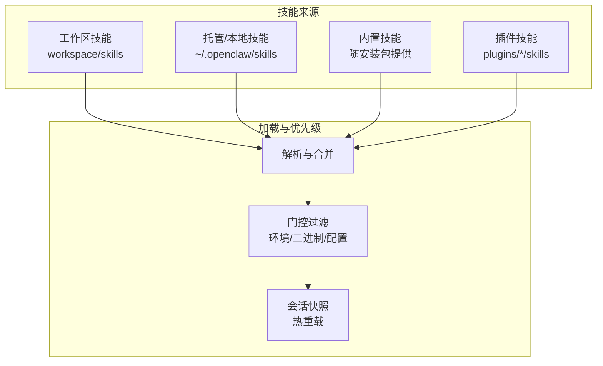
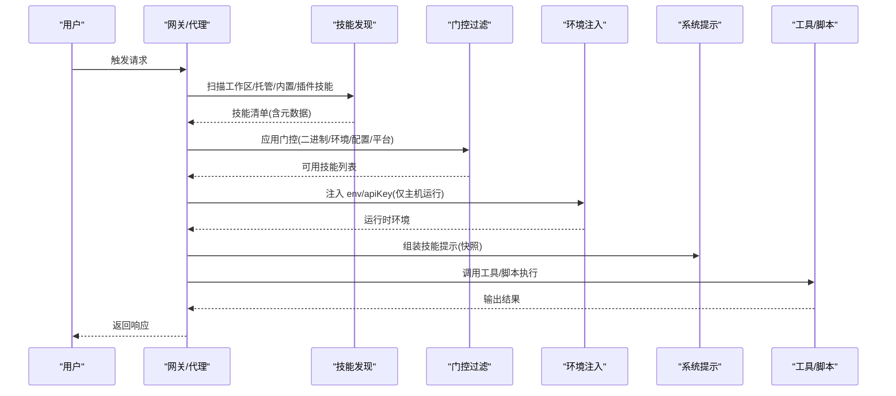
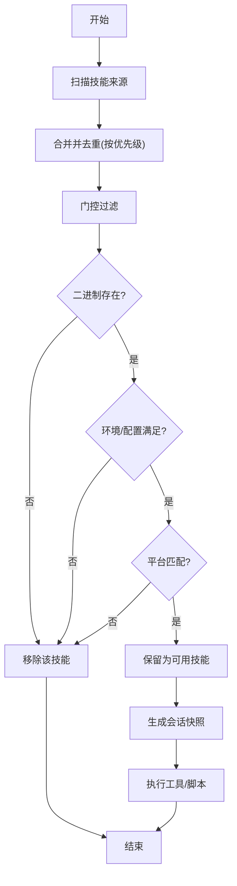

# 技能开发

## 目录
1. [简介](#简介)
2. [项目结构](#项目结构)
3. [核心组件](#核心组件)
4. [架构总览](#架构总览)
5. [详细组件分析](#详细组件分析)
6. [依赖关系分析](#依赖关系分析)
7. [性能考量](#性能考量)
8. [故障排查指南](#故障排查指南)
9. [结论](#结论)
10. [附录](#附录)

## 简介
本指南面向希望在 OpenClaw 中创建与扩展“技能”的开发者，系统讲解如何编写 SKILL.md 文件、理解 YAML 前言元数据、掌握技能加载规则与门控机制，并通过真实示例演示文件操作、系统集成与 API 调用等常见模式。同时提供调试技巧、测试方法与最佳实践，帮助你高效构建高质量、可维护的技能。

## 项目结构
OpenClaw 的技能主要由两类来源构成：
- 工作区技能：位于工作区目录下的 skills 子目录，优先级最高，适合按代理定制或临时覆盖。
- 托管/内置技能：位于用户主目录下的托管目录，以及随安装包内置的技能，优先级较低，可被工作区技能覆盖。
- 插件技能：部分插件可在其配置中声明 skills 目录，启用后参与统一的技能加载与优先级规则。

图表来源
- [docs/tools/skills.md](file://docs/tools/skills.md#L13-L48)

章节来源
- [docs/tools/skills.md](file://docs/tools/skills.md#L13-L48)

## 核心组件
- SKILL.md：技能的核心描述文件，包含 YAML 前言元数据与 Markdown 指令正文。前言必须包含 name 与 description；metadata.openclaw 可用于门控与安装器配置。
- 元数据字段与门控：
  - 必需字段：name、description
  - 可选字段：homepage、user-invocable、disable-model-invocation、command-dispatch、command-tool、command-arg-mode 等
  - 门控字段：metadata.openclaw.requires.&#123;bins,anyBins,env,config&#125;、os、always、emoji、install 等
- 配置覆盖：通过 ~/.openclaw/openclaw.json 的 skills.entries.&lt;key&gt; 注入 env/apiKey、开关 enabled、自定义 config 字段等。
- 加载与刷新：支持额外扫描目录、文件监视与热重载，会话开始时生成技能快照，后续回合复用。

章节来源
- [docs/tools/creating-skills.md](file://docs/tools/creating-skills.md#L27-L48)
- [docs/tools/skills.md](file://docs/tools/skills.md#L78-L137)
- [docs/tools/skills-config.md](file://docs/tools/skills-config.md#L13-L77)

## 架构总览
下图展示了从发现到执行技能的关键流程：扫描与合并 → 门控过滤 → 注入环境 → 生成提示 → 执行工具。

图表来源
- [docs/tools/skills.md](file://docs/tools/skills.md#L106-L147)
- [docs/tools/skills.md](file://docs/tools/skills.md#L230-L246)

章节来源
- [docs/tools/skills.md](file://docs/tools/skills.md#L106-L147)
- [docs/tools/skills.md](file://docs/tools/skills.md#L230-L246)

## 详细组件分析

### SKILL.md 编写规范与元数据
- 结构组成
  - YAML 前言：至少包含 name 与 description；可选 metadata.openclaw 定义门控与安装器。
  - 正文：Markdown 指令，仅在触发时加载。
- 元数据关键点
  - 单行 YAML 前言键值；metadata 为单行 JSON 对象。
  - 支持 homepage、user-invocable、disable-model-invocation、command-dispatch、command-tool、command-arg-mode 等。
  - 使用 &#123;baseDir&#125; 引用技能根路径，便于脚本与资源定位。
- 最佳实践
  - 在 description 中明确触发条件与使用场景，避免在正文重复“何时使用”。
  - 将长篇参考材料放入 references/* 并在正文引用，保持 SKILL.md 精简。

章节来源
- [docs/tools/creating-skills.md](file://docs/tools/creating-skills.md#L27-L48)
- [docs/tools/skills.md](file://docs/tools/skills.md#L78-L105)

### 技能清单与优先级
- 来源与优先级：工作区技能 > 托管/本地技能 > 内置技能；可通过 skills.load.extraDirs 添加额外扫描目录（最低优先级）。
- 多代理设置：每个代理有独立工作区，工作区技能仅对该代理可见；共享技能对同一机器所有代理可见。
- 插件技能：在 openclaw.plugin.json 中声明 skills 目录，启用后参与统一加载与门控。

章节来源
- [docs/tools/skills.md](file://docs/tools/skills.md#L13-L48)
- [extensions/feishu/openclaw.plugin.json](file://extensions/feishu/openclaw.plugin.json#L4-L4)

### 门控机制与加载规则
- 门控字段（metadata.openclaw）
  - always：无条件包含
  - os：限定平台列表
  - requires.bins/anyBins：PATH 中存在二进制或任一二进制
  - requires.env：环境变量存在或可在配置中提供
  - requires.config：openclaw.json 中对应路径为真值
  - install：安装器规格（brew/node/go/uv/download），用于 UI 安装
  - primaryEnv：与 skills.entries.&lt;key&gt;.apiKey 关联
- 沙箱注意事项
  - 二进制探测在宿主进行；若沙箱化，需在容器内也安装对应二进制并通过 sandbox 配置注入环境。
- 热重载与会话快照
  - 默认监视技能目录，变更后在下一回合应用；会话开始时缓存可用技能列表，减少提示开销。

章节来源
- [docs/tools/skills.md](file://docs/tools/skills.md#L106-L187)
- [docs/tools/skills.md](file://docs/tools/skills.md#L242-L253)

### 配置覆盖与环境注入
- 覆盖项
  - enabled：禁用内置/托管技能
  - env：仅在进程未设置时注入
  - apiKey：便捷绑定 primaryEnv
  - config：自定义技能参数
- 注入时机
  - 每次代理运行开始时应用；结束后恢复原环境
- 沙箱差异
  - 沙箱运行不继承宿主 env；需通过 agents.defaults.sandbox.docker.env 或自定义镜像注入

章节来源
- [docs/tools/skills.md](file://docs/tools/skills.md#L189-L241)
- [docs/tools/skills-config.md](file://docs/tools/skills-config.md#L13-L77)

### 示例：文件操作类技能（model-usage）
- 典型特征
  - 依赖本地二进制（codexbar）
  - 通过脚本处理成本日志并输出摘要
  - 使用 metadata.openclaw.os 限制平台，metadata.openclaw.requires 门控二进制
- 实践要点
  - 在 SKILL.md 中提供脚本调用示例与输入输出说明
  - 通过 openclaw.json 的 skills.entries.&lt;key&gt;.env/apiKey 注入密钥

章节来源
- [skills/model-usage/SKILL.md](file://skills/model-usage/SKILL.md#L1-L70)

### 示例：系统集成类技能（tmux）
- 典型特征
  - 依赖系统工具 tmux，通过命令行控制会话、发送按键、抓取面板输出
  - 使用 metadata.openclaw.os 与 requires.bins 门控
- 实践要点
  - 明确适用场景与不适用场景，避免与 exec 工具混淆
  - 提供常用命令与 Claude Code 场景模式

章节来源
- [skills/tmux/SKILL.md](file://skills/tmux/SKILL.md#L1-L154)

### 示例：API 调用类技能（nano-banana-pro）
- 典型特征
  - 通过外部 CLI（uv run）调用图像生成脚本
  - 通过 metadata.openclaw.requires 门控二进制与环境变量，提供安装器规格
  - 支持多种分辨率与宽高比参数
- 实践要点
  - 在 SKILL.md 中给出多条调用示例，覆盖生成、编辑与批量合成
  - 说明密钥来源与配置覆盖方式

章节来源
- [skills/nano-banana-pro/SKILL.md](file://skills/nano-banana-pro/SKILL.md#L1-L66)

### 示例：CLI 工具类技能（summarize）
- 典型特征
  - 通过外部 CLI（summarize）处理 URL、本地文件与 YouTube 链接
  - 提供丰富的模型与密钥配置说明
- 实践要点
  - 在 SKILL.md 中列出触发短语与快速开始示例
  - 说明可选配置文件与服务令牌

章节来源
- [skills/summarize/SKILL.md](file://skills/summarize/SKILL.md#L1-L88)

### 示例：工作流/审批类技能（lobster）
- 典型特征
  - 通过多步骤流水线与审批节点实现可重复自动化
  - 以 JSON 协议返回结构化结果，支持 resume 恢复
- 实践要点
  - 在 SKILL.md 中明确何时使用与不适用场景
  - 提供 run/resume 请求样例与输出结构说明

章节来源
- [extensions/lobster/SKILL.md](file://extensions/lobster/SKILL.md#L1-L98)

### 插件技能集成
- 插件声明
  - 在 openclaw.plugin.json 中通过 skills 字段声明相对路径，启用后自动参与技能加载
- 示例
  - 飞书插件：声明 skills 目录
  - 海狸插件：提供工作流工具能力

章节来源
- [extensions/feishu/openclaw.plugin.json](file://extensions/feishu/openclaw.plugin.json#L4-L4)
- [extensions/lobster/openclaw.plugin.json](file://extensions/lobster/openclaw.plugin.json#L1-L11)

## 依赖关系分析
- 技能发现与合并
  - 来自工作区、托管、内置与插件的技能统一扫描与合并，遵循优先级规则
- 门控链路
  - 二进制探测（PATH）、环境变量/配置检查、平台过滤、always 强制包含
- 执行链路
  - 环境注入（宿主持有）→ 系统提示组装（技能快照）→ 工具/脚本执行

图表来源
- [docs/tools/skills.md](file://docs/tools/skills.md#L106-L147)
- [docs/tools/skills.md](file://docs/tools/skills.md#L242-L253)

章节来源
- [docs/tools/skills.md](file://docs/tools/skills.md#L106-L147)
- [docs/tools/skills.md](file://docs/tools/skills.md#L242-L253)

## 性能考量
- 技能提示开销
  - 会话开始时将可用技能列表注入系统提示，字符数与 XML 转义相关
  - 基础开销与每技能附加长度共同决定 token 影响
- 优化建议
  - 控制 SKILL.md 长度，将细节放入 references
  - 合理使用 metadata.openclaw.os 与 requires 降低无效技能数量
  - 利用会话快照减少重复计算

章节来源
- [docs/tools/skills.md](file://docs/tools/skills.md#L269-L286)

## 故障排查指南
- 常见问题
  - 技能未出现：确认名称与描述是否正确；检查门控（二进制/环境/配置/平台）；确认优先级与覆盖
  - 无法执行：检查 PATH 是否包含所需二进制；沙箱运行时确认容器内已安装；核对密钥与配置覆盖
  - 触发异常：确认 description 中的触发条件是否清晰；必要时调整 user-invocable/disable-model-invocation
- 调试步骤
  - 使用 openclaw agent --message "use my new skill" 进行本地验证
  - 开启 skills.load.watch 并观察变更生效时机
  - 查看 ~/.openclaw/openclaw.json 的 skills.entries.&lt;key&gt; 配置是否符合预期

章节来源
- [docs/tools/creating-skills.md](file://docs/tools/creating-skills.md#L50-L58)
- [docs/tools/skills.md](file://docs/tools/skills.md#L254-L267)
- [docs/tools/skills-config.md](file://docs/tools/skills-config.md#L13-L77)

## 结论
通过规范化的 SKILL.md 编写、严谨的元数据与门控设计，以及合理的配置覆盖与环境注入策略，你可以构建出安全、可靠且高效的 OpenClaw 技能。结合本文提供的示例与最佳实践，建议优先从简单文件操作或系统集成类技能入手，逐步过渡到 API 调用与复杂工作流场景。

## 附录

### A. 元数据字段速查
- 必填
  - name：技能名称
  - description：触发条件与使用场景
- 可选
  - homepage：展示网站链接
  - user-invocable：是否暴露为用户斜杠命令
  - disable-model-invocation：是否排除在模型提示之外但仍允许用户调用
  - command-dispatch：tool（直接分发到工具）
  - command-tool：当 command-dispatch=tool 时指定工具名
  - command-arg-mode：raw（将原始参数字符串传递给工具）

章节来源
- [docs/tools/skills.md](file://docs/tools/skills.md#L95-L104)

### B. 门控字段速查
- metadata.openclaw
  - always：无条件包含
  - emoji：macOS 技能界面表情
  - homepage：macOS 技能界面网站
  - os：平台列表（darwin/linux/win32）
  - requires.bins/anyBins：PATH 二进制要求
  - requires.env：环境变量或配置提供
  - requires.config：openclaw.json 路径为真
  - primaryEnv：与 skills.entries.&lt;key&gt;.apiKey 关联
  - install：安装器规格数组

章节来源
- [docs/tools/skills.md](file://docs/tools/skills.md#L125-L137)

### C. 配置覆盖速查
- skills.entries.&lt;key&gt;
  - enabled：禁用内置/托管技能
  - env：仅在未设置时注入
  - apiKey：便捷绑定 primaryEnv
  - config：自定义技能参数

章节来源
- [docs/tools/skills-config.md](file://docs/tools/skills-config.md#L26-L59)