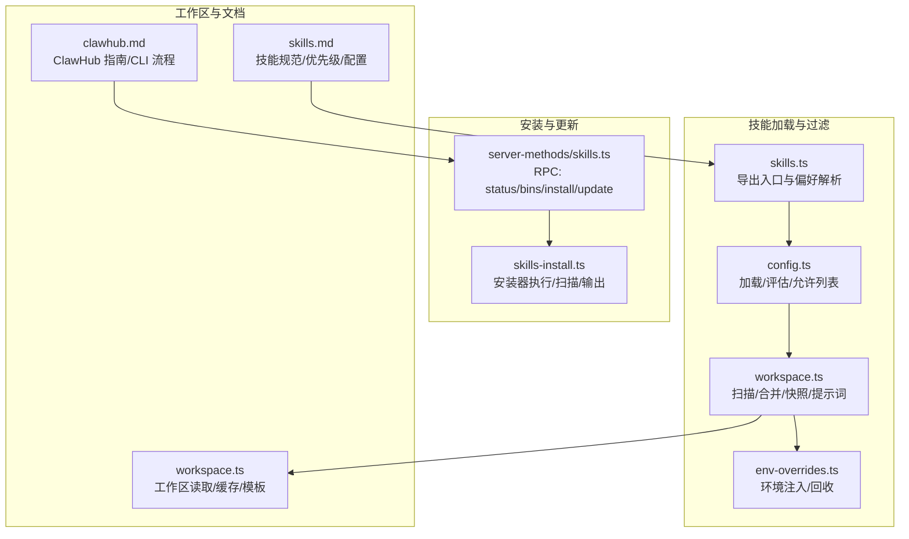
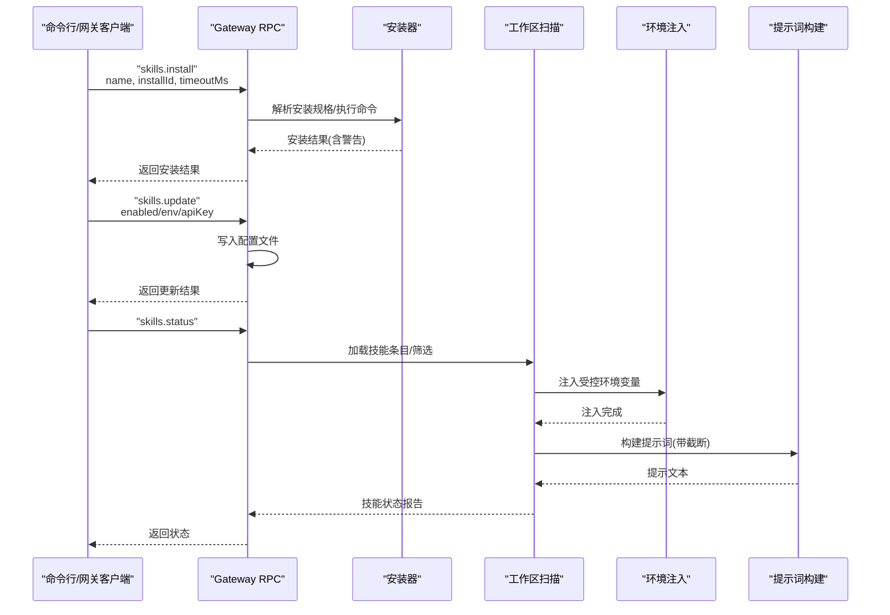
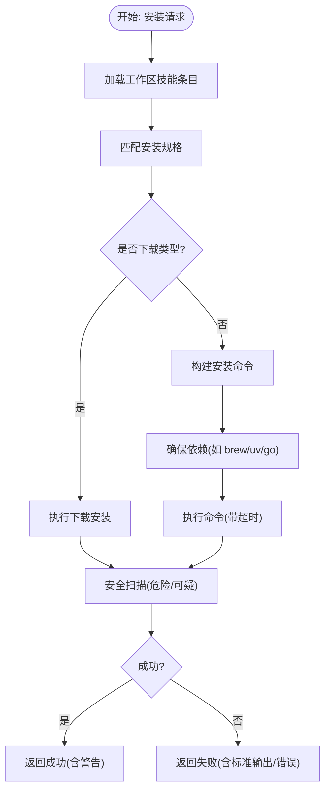
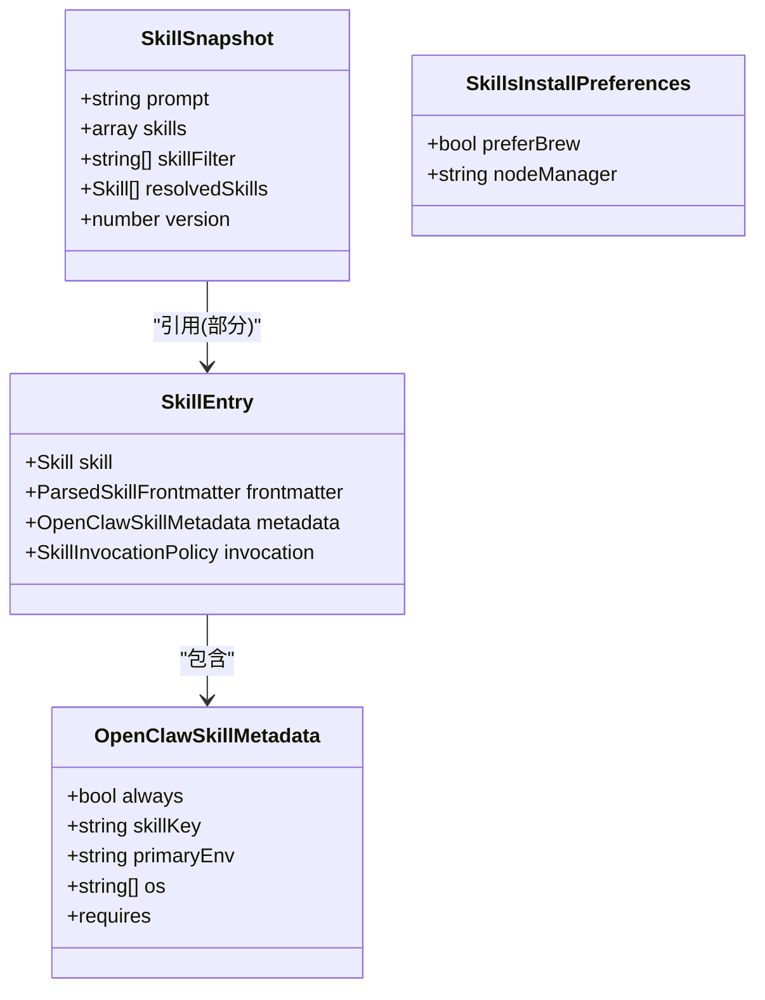
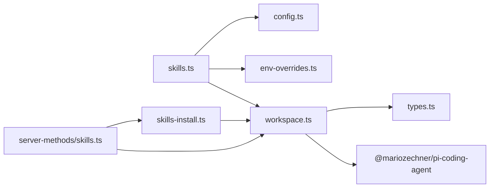

# 技能管理

## 目录
1. [简介](#简介)
2. [项目结构](#项目结构)
3. [核心组件](#核心组件)
4. [架构总览](#架构总览)
5. [详细组件分析](#详细组件分析)
6. [依赖关系分析](#依赖关系分析)
7. [性能考量](#性能考量)
8. [故障排除指南](#故障排除指南)
9. [结论](#结论)
10. [附录](#附录)

## 简介
本文件系统化阐述 OpenClaw 的“技能管理”能力，覆盖以下主题：
- 技能来源与优先级：工作区技能最高、托管技能次之、捆绑技能最低；额外目录与插件技能参与合并与优先级判定
- 安装、更新、卸载与同步流程：包含 ClawHub 集成、本地技能存储与工作区技能管理
- 多代理与共享机制：每代理工作区隔离，共享技能位于用户目录
- 技能配置管理：启用/禁用、环境变量注入、API 密钥管理、自定义配置
- 技能监视器与自动刷新：会话快照复用、热重载与性能优化
- 令牌成本估算与提示词构建
- 故障排除与常见问题

## 项目结构
围绕技能管理的关键代码与文档分布如下：
- 核心逻辑位于 src/agents/skills* 与 src/agents/skills-install.ts
- 网关 RPC 接口在 src/gateway/server-methods/skills.ts
- 工作区读取与引导在 src/agents/workspace.ts
- 文档在 docs/tools/skills.md 与 docs/tools/clawhub.md

图表来源
- [src/agents/skills.ts](file://src/agents/skills.ts#L1-L47)
- [src/agents/skills/config.ts](file://src/agents/skills/config.ts#L1-L104)
- [src/agents/skills/workspace.ts](file://src/agents/skills/workspace.ts#L1-L800)
- [src/agents/skills/env-overrides.ts](file://src/agents/skills/env-overrides.ts#L1-L263)
- [src/agents/skills-install.ts](file://src/agents/skills-install.ts#L1-L471)
- [src/gateway/server-methods/skills.ts](file://src/gateway/server-methods/skills.ts#L1-L205)
- [src/agents/workspace.ts](file://src/agents/workspace.ts#L1-L656)
- [docs/tools/skills.md](file://docs/tools/skills.md#L1-L303)
- [docs/tools/clawhub.md](file://docs/tools/clawhub.md#L1-L258)

章节来源
- [src/agents/skills.ts](file://src/agents/skills.ts#L1-L47)
- [src/agents/skills/config.ts](file://src/agents/skills/config.ts#L1-L104)
- [src/agents/skills/workspace.ts](file://src/agents/skills/workspace.ts#L1-L800)
- [src/agents/skills/env-overrides.ts](file://src/agents/skills/env-overrides.ts#L1-L263)
- [src/agents/skills-install.ts](file://src/agents/skills-install.ts#L1-L471)
- [src/gateway/server-methods/skills.ts](file://src/gateway/server-methods/skills.ts#L1-L205)
- [src/agents/workspace.ts](file://src/agents/workspace.ts#L1-L656)
- [docs/tools/skills.md](file://docs/tools/skills.md#L1-L303)
- [docs/tools/clawhub.md](file://docs/tools/clawhub.md#L1-L258)

## 核心组件
- 技能加载与合并：从多个来源扫描、去重、按优先级合并，生成技能条目与元数据
- 运行时筛选：基于平台、二进制、环境变量、配置路径进行动态门控
- 提示词构建：将可被模型调用的技能压缩为提示块，支持字符与数量限制
- 环境注入：在运行时注入受控的环境变量，避免泄漏到子进程
- 安装与更新：通过安装器或下载方式安装依赖，支持安全扫描与失败回退
- 网关 RPC：提供状态查询、二进制收集、安装、更新等接口
- 工作区与模板：工作区引导、文件缓存、边界安全读取

章节来源
- [src/agents/skills/workspace.ts](file://src/agents/skills/workspace.ts#L292-L527)
- [src/agents/skills/config.ts](file://src/agents/skills/config.ts#L71-L103)
- [src/agents/skills/env-overrides.ts](file://src/agents/skills/env-overrides.ts#L213-L234)
- [src/agents/skills-install.ts](file://src/agents/skills-install.ts#L392-L470)
- [src/gateway/server-methods/skills.ts](file://src/gateway/server-methods/skills.ts#L57-L204)
- [src/agents/workspace.ts](file://src/agents/workspace.ts#L48-L88)

## 架构总览
下图展示从“安装/更新/同步”到“运行时加载与注入”的端到端流程。

图表来源
- [src/gateway/server-methods/skills.ts](file://src/gateway/server-methods/skills.ts#L57-L204)
- [src/agents/skills-install.ts](file://src/agents/skills-install.ts#L392-L470)
- [src/agents/skills/workspace.ts](file://src/agents/skills/workspace.ts#L567-L638)
- [src/agents/skills/env-overrides.ts](file://src/agents/skills/env-overrides.ts#L213-L234)

## 详细组件分析

### 技能来源与优先级
- 来源与顺序（高到低）：
  - 额外目录（extraDirs）与插件技能目录
  - 捆绑技能（bundled）
  - 托管技能（~/.openclaw/skills）
  - 个人代理技能（~/.agents/skills）
  - 项目代理技能（&lt;workspace&gt;/.agents/skills）
  - 工作区技能（&lt;workspace&gt;/skills）
- 同名冲突时，后写入覆盖先写入；工作区技能优先级最高
- 可通过配置 skills.allowBundled 对捆绑技能做白名单放行

章节来源
- [docs/tools/skills.md](file://docs/tools/skills.md#L13-L40)
- [src/agents/skills/workspace.ts](file://src/agents/skills/workspace.ts#L445-L527)
- [src/agents/skills/config.ts](file://src/agents/skills/config.ts#L56-L69)

### 技能安装与更新（ClawHub 集成）
- 安装流程要点：
  - 通过 RPC skills.install 触发，解析安装规格（brew/node/go/uv/download）
  - 自动处理依赖（如 brew 安装 uv、apt 安装 go）
  - 安全扫描：对技能目录进行扫描，记录危险/可疑模式并作为警告返回
  - 超时控制与错误格式化
- 更新流程要点：
  - 通过 RPC skills.update 修改 openclaw.json 中的 skills.entries
  - 支持 enabled、env、apiKey 字段更新
- ClawHub 集成：
  - 默认安装到当前工作目录的 skills 或回退到工作区
  - 下次会话生效；也可通过同步工具将其他工作区技能复制到目标工作区

图表来源
- [src/agents/skills-install.ts](file://src/agents/skills-install.ts#L392-L470)
- [src/gateway/server-methods/skills.ts](file://src/gateway/server-methods/skills.ts#L114-L145)

章节来源
- [src/agents/skills-install.ts](file://src/agents/skills-install.ts#L1-L471)
- [src/gateway/server-methods/skills.ts](file://src/gateway/server-methods/skills.ts#L114-L145)
- [docs/tools/clawhub.md](file://docs/tools/clawhub.md#L67-L73)

### 技能同步（跨工作区）
- 将一个工作区的所有已选技能复制到目标工作区的 skills 目录
- 使用序列化锁避免并发冲突
- 目标目录名去重，保证不覆盖同名技能

章节来源
- [src/agents/skills/workspace.ts](file://src/agents/skills/workspace.ts#L710-L766)

### 运行时加载、筛选与提示词
- 加载与合并：
  - 从多个根目录扫描，支持嵌套 skills 子目录探测
  - 严格校验真实路径在根目录内，防止逃逸
  - 限制每个来源最大候选数与加载数，避免性能问题
- 筛选：
  - 基于平台、二进制、环境变量、配置路径进行动态门控
  - 支持按名称过滤与最小化会话加载
- 提示词构建：
  - 将技能信息压缩为 XML 片段，注入系统提示
  - 支持按数量与字符上限截断，记录截断原因
  - 路径使用波浪号缩写减少 token 开销

章节来源
- [src/agents/skills/workspace.ts](file://src/agents/skills/workspace.ts#L292-L527)
- [src/agents/skills/workspace.ts](file://src/agents/skills/workspace.ts#L567-L638)
- [src/agents/skills/config.ts](file://src/agents/skills/config.ts#L71-L103)

### 环境变量注入与安全
- 注入范围：
  - 仅在单次运行期间注入，结束后恢复原环境
  - 仅当变量未被外部设置时才注入
- 安全策略：
  - 屏蔽高危键（如 OpenSSL 配置）
  - 对敏感键白名单放行（primaryEnv 与 requires.env）
  - 校验值合法性（空字节等）
- 注入跟踪：
  - 维护活动注入表，避免泄漏到子进程

章节来源
- [src/agents/skills/env-overrides.ts](file://src/agents/skills/env-overrides.ts#L1-L263)
- [docs/tools/skills.md](file://docs/tools/skills.md#L230-L241)

### 多代理与共享机制
- 每个代理拥有独立工作区，工作区技能仅该代理可见
- 共享技能位于用户目录 ~/.openclaw/skills，所有代理可见
- 插件可通过 openclaw.plugin.json 声明 skills 目录，参与优先级合并
- 额外目录可通过 skills.load.extraDirs 配置，最低优先级

章节来源
- [docs/tools/skills.md](file://docs/tools/skills.md#L28-L40)
- [src/agents/skills/workspace.ts](file://src/agents/skills/workspace.ts#L445-L457)

### 技能监视器与自动刷新
- 默认监视技能目录，当 SKILL.md 发生变更时提升技能快照
- 会话启动时快照缓存，同一会话内复用；新会话生效最新变化
- 远程节点可用时，macOS-only 技能在满足条件时可被识别为可用

章节来源
- [docs/tools/skills.md](file://docs/tools/skills.md#L242-L253)
- [src/agents/skills/workspace.ts](file://src/agents/skills/workspace.ts#L567-L638)

### 令牌成本与性能优化
- 提示词开销：
  - 至少包含技能列表时，基础开销约 195 字符
  - 每个技能约 97 字符 + 名称/描述/位置字段的 XML 转义长度
- 性能优化：
  - 会话快照复用
  - 截断策略：先按数量再二分搜索字符上限
  - 路径缩写（~）降低 token 数量
  - 严格候选与加载上限，避免扫描膨胀

章节来源
- [docs/tools/skills.md](file://docs/tools/skills.md#L269-L286)
- [src/agents/skills/workspace.ts](file://src/agents/skills/workspace.ts#L529-L565)
- [src/agents/skills/workspace.ts](file://src/agents/skills/workspace.ts#L46-L54)

### 数据模型与类型

图表来源
- [src/agents/skills/types.ts](file://src/agents/skills/types.ts#L1-L90)

章节来源
- [src/agents/skills/types.ts](file://src/agents/skills/types.ts#L1-L90)

## 依赖关系分析
- 入口导出：src/agents/skills.ts 汇聚配置、环境注入、工作区快照与安装偏好
- 运行时依赖：
  - workspace.ts 依赖 @mariozechner/pi-coding-agent 进行技能解析
  - env-overrides.ts 依赖安全与沙箱工具进行环境校验
  - skills-install.ts 依赖 brew/uv/go 安装器与安全扫描
- 网关层：server-methods/skills.ts 作为 RPC 入口，协调安装、更新与状态查询

图表来源
- [src/agents/skills.ts](file://src/agents/skills.ts#L1-L47)
- [src/agents/skills/workspace.ts](file://src/agents/skills/workspace.ts#L1-L32)
- [src/agents/skills-install.ts](file://src/agents/skills-install.ts#L1-L17)
- [src/gateway/server-methods/skills.ts](file://src/gateway/server-methods/skills.ts#L1-L25)

章节来源
- [src/agents/skills.ts](file://src/agents/skills.ts#L1-L47)
- [src/agents/skills/workspace.ts](file://src/agents/skills/workspace.ts#L1-L32)
- [src/agents/skills-install.ts](file://src/agents/skills-install.ts#L1-L17)
- [src/gateway/server-methods/skills.ts](file://src/gateway/server-methods/skills.ts#L1-L25)

## 性能考量
- 快照复用：会话启动时构建技能快照，后续回合直接复用
- 截断策略：先按数量截断，再二分搜索字符上限，避免提示过长
- 候选限制：限制每个根目录候选数与来源加载数，防止扫描膨胀
- 路径缩写：将绝对路径替换为 ~ 前缀，降低 token 成本
- 安装超时：统一超时窗口，避免长时间阻塞

章节来源
- [docs/tools/skills.md](file://docs/tools/skills.md#L242-L253)
- [src/agents/skills/workspace.ts](file://src/agents/skills/workspace.ts#L529-L565)
- [src/agents/skills/workspace.ts](file://src/agents/skills/workspace.ts#L139-L149)
- [src/agents/skills/workspace.ts](file://src/agents/skills/workspace.ts#L46-L54)

## 故障排除指南
- 安装失败
  - brew 缺失：根据平台提示安装 Homebrew 或使用系统包管理器
  - uv/go 依赖：优先尝试 brew 安装；Linux 上可尝试 apt 安装 go
  - 命令不可用：检查 PATH 与权限
  - 下载安装：确认网络可达与目标归档格式正确
- 安全扫描告警
  - 出现“危险代码模式”或“可疑模式”警告时，建议暂停使用并审计
  - 可使用深度审计命令进一步排查
- 环境变量注入失败
  - 检查是否已被外部设置（注入仅在未设置时生效）
  - 核对键名是否在允许列表（primaryEnv 与 requires.env）
  - 避免使用高危键（系统已屏蔽）
- 提示词过大
  - 使用 openclaw skills check 审计技能数量与字符上限
  - 调整 skills.limits 或减少技能数量
- 远程节点技能不可用
  - 确认远程节点具备所需二进制并通过 system.run 可探测
  - 节点离线时技能仍可见但可能无法执行

章节来源
- [src/agents/skills-install.ts](file://src/agents/skills-install.ts#L247-L367)
- [src/agents/skills-install.ts](file://src/agents/skills-install.ts#L58-L85)
- [src/agents/skills/env-overrides.ts](file://src/agents/skills/env-overrides.ts#L86-L134)
- [src/agents/skills/workspace.ts](file://src/agents/skills/workspace.ts#L627-L637)
- [docs/tools/skills.md](file://docs/tools/skills.md#L248-L253)

## 结论
OpenClaw 的技能管理以“可组合、可门控、可追踪”为核心设计：
- 来源与优先级清晰，工作区技能最高，便于用户覆盖
- 安装与更新通过标准化安装器与安全扫描保障质量
- 运行时注入与快照复用兼顾安全性与性能
- 多代理共享与远程节点能力满足复杂部署场景
建议在生产环境中配合安全扫描与限额配置，持续监控技能列表规模与令牌开销。

## 附录
- 相关文档
  - 技能规范与优先级：[Skills](file://docs/tools/skills.md#L1-L303)
  - ClawHub 使用指南：[ClawHub](file://docs/tools/clawhub.md#L1-L258)
- 关键实现参考
  - 技能加载与合并：[workspace.ts](file://src/agents/skills/workspace.ts#L292-L527)
  - 运行时筛选与提示词：[workspace.ts](file://src/agents/skills/workspace.ts#L567-L638)
  - 环境注入与回收：[env-overrides.ts](file://src/agents/skills/env-overrides.ts#L213-L234)
  - 安装器与扫描：[skills-install.ts](file://src/agents/skills-install.ts#L392-L470)
  - 网关 RPC：[server-methods/skills.ts](file://src/gateway/server-methods/skills.ts#L57-L204)