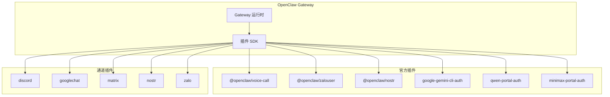
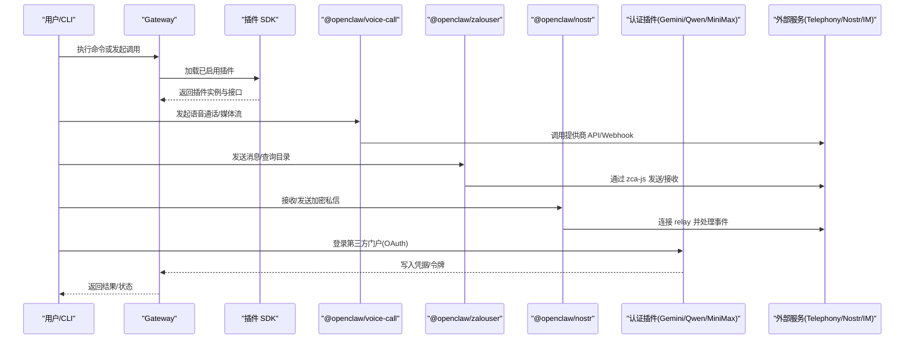
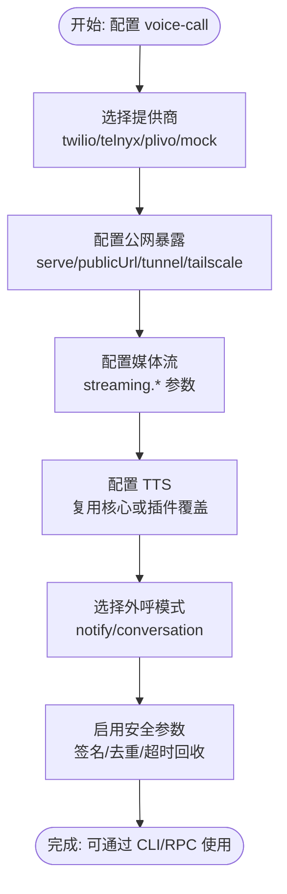
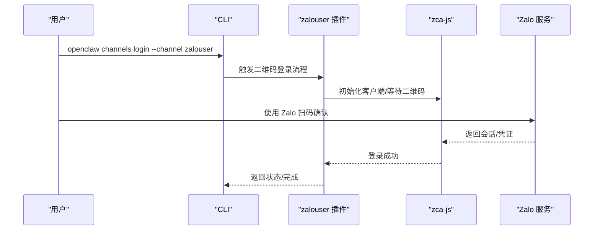
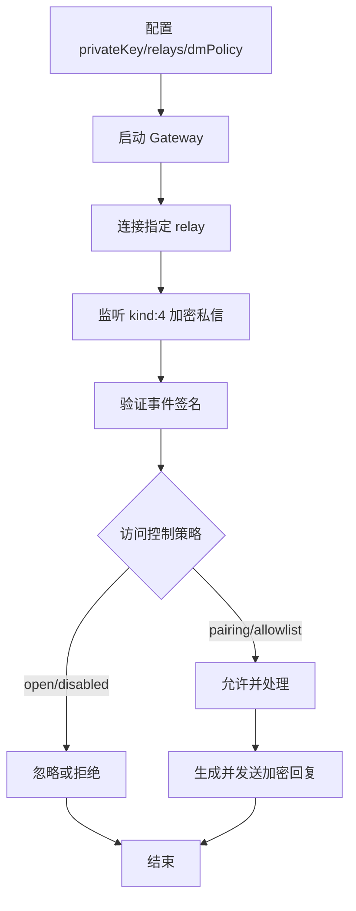
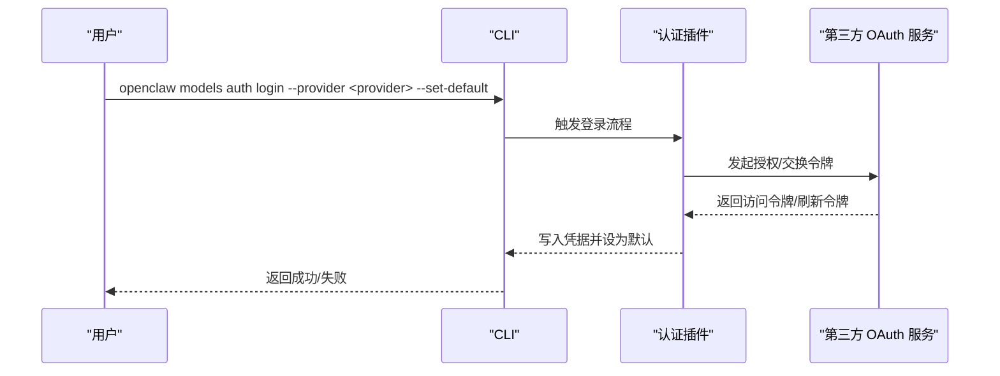
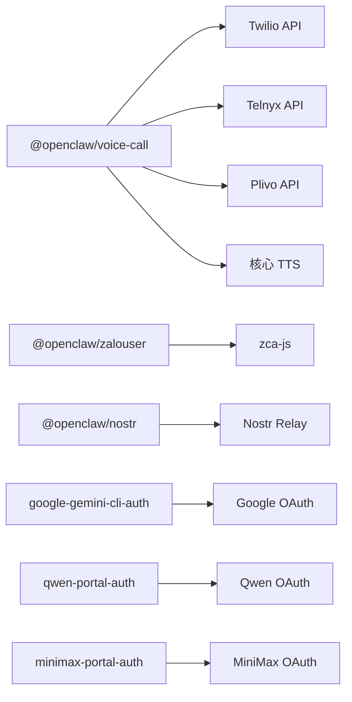

# 官方插件

## 目录
1. [简介](#简介)
2. [项目结构](#项目结构)
3. [核心组件](#核心组件)
4. [架构总览](#架构总览)
5. [详细组件分析](#详细组件分析)
6. [依赖分析](#依赖分析)
7. [性能考虑](#性能考虑)
8. [故障排除指南](#故障排除指南)
9. [结论](#结论)
10. [附录](#附录)

## 简介
本文件系统性梳理 OpenClaw 官方插件集合，覆盖语音通话、即时通讯与去中心化通信、提供商认证等关键能力，并对 Microsoft Teams、Google Chat、Discord 等通道插件的集成方式进行说明。文档同时提供技术实现要点、配置选项、最佳实践、性能优化与故障排除建议，帮助用户在生产环境中稳定、安全地使用这些插件。

## 项目结构
OpenClaw 插件以“扩展（extensions）”形式组织，每个官方插件位于独立目录中，包含插件入口、清单文件、README 使用说明与可选的测试/示例代码。核心插件包括：
- 语音通话：@openclaw/voice-call
- Zalo 个人账号：@openclaw/zalouser
- Nostr 私信：@openclaw/nostr
- 认证类：Google Gemini CLI OAuth、Qwen 门户认证、MiniMax 门户认证

此外，通道插件（如 Discord、Google Chat、Matrix 等）通过各自 openclaw.plugin.json 清单注册到 OpenClaw Gateway，遵循统一的插件 SDK 规范。

图表来源
- [src/plugin-sdk/README.md](file://src/plugin-sdk/README.md)
- [src/plugins/README.md](file://src/plugins/README.md)
- [extensions/voice-call/README.md](file://extensions/voice-call/README.md)
- [extensions/zalouser/README.md](file://extensions/zalouser/README.md)
- [extensions/nostr/README.md](file://extensions/nostr/README.md)
- [extensions/google-gemini-cli-auth/README.md](file://extensions/google-gemini-cli-auth/README.md)
- [extensions/qwen-portal-auth/README.md](file://extensions/qwen-portal-auth/README.md)
- [extensions/minimax-portal-auth/README.md](file://extensions/minimax-portal-auth/README.md)

章节来源
- [src/plugin-sdk/README.md](file://src/plugin-sdk/README.md)
- [src/plugins/README.md](file://src/plugins/README.md)

## 核心组件
- 语音通话插件：支持 Twilio、Telnyx、Plivo 等提供商，提供外呼、媒体流、TTS 集成、Webhook 验签与去重、超时回收等能力。
- Zalo 个人账号插件：基于 zca-js 的原生集成，支持二维码登录、多账号、DM/群组策略、目录查询与代理工具。
- Nostr 私信插件：基于 NIP-04 的加密私信通道，支持多种访问控制模式与本地 relay 测试。
- 认证插件：提供 Google Gemini CLI、Qwen、MiniMax 等第三方门户的 OAuth 登录与凭据管理。
- 通道插件：Discord、Google Chat、Matrix 等通过 openclaw.plugin.json 注册，遵循统一的配置与生命周期管理。

章节来源
- [extensions/voice-call/README.md](file://extensions/voice-call/README.md)
- [extensions/zalouser/README.md](file://extensions/zalouser/README.md)
- [extensions/nostr/README.md](file://extensions/nostr/README.md)
- [extensions/google-gemini-cli-auth/README.md](file://extensions/google-gemini-cli-auth/README.md)
- [extensions/qwen-portal-auth/README.md](file://extensions/qwen-portal-auth/README.md)
- [extensions/minimax-portal-auth/README.md](file://extensions/minimax-portal-auth/README.md)

## 架构总览
下图展示 OpenClaw Gateway 如何加载与运行官方插件，以及认证与通道插件的典型交互路径。

图表来源
- [src/plugin-sdk/README.md](file://src/plugin-sdk/README.md)
- [extensions/voice-call/README.md](file://extensions/voice-call/README.md)
- [extensions/zalouser/README.md](file://extensions/zalouser/README.md)
- [extensions/nostr/README.md](file://extensions/nostr/README.md)
- [extensions/google-gemini-cli-auth/README.md](file://extensions/google-gemini-cli-auth/README.md)
- [extensions/qwen-portal-auth/README.md](file://extensions/qwen-portal-auth/README.md)
- [extensions/minimax-portal-auth/README.md](file://extensions/minimax-portal-auth/README.md)

## 详细组件分析

### 语音通话插件 (@openclaw/voice-call)
- 功能特性
  - 多提供商支持：Twilio（Programmable Voice + 媒体流）、Telnyx（Call Control v2）、Plivo（Voice API/XML/GetInput 语音）
  - 外呼模式：通知式（notify）与对话式（conversation），默认通知式
  - 媒体流：WebSocket 媒体流，支持预启动超时、并发连接上限、按源 IP 限流
  - 安全：Webhook 签名验证、重复回调防护、转写令牌防重放
  - TTS：可复用核心 messages.tts 配置，或在插件内覆盖；Edge TTS 不适用于电语音频
  - CLI/Gateway RPC：提供 call/continue/speak/end/status/tail/expose 等命令与 RPC
- 配置要点
  - provider、fromNumber、toNumber
  - 各提供商密钥：twilio.accountSid/authToken、telnyx.apiKey/connectionId/publicKey、plivo.authId/authToken
  - serve.port/path、publicUrl/tunnel/tailscale 公网暴露
  - outbound.defaultMode
  - streaming.enabled/streamPath/preStartTimeoutMs/maxPendingConnections/maxConnections
  - staleCallReaperSeconds（未终止回调的通话回收）
  - tts 覆盖（同核心 messages.tts 结构）
- 最佳实践
  - 生产环境建议设置合理的 staleCallReaperSeconds，高于最大通话时长
  - Telnyx 必须提供 publicKey 或允许跳过验签（仅限开发）
  - ngrok 免费版回环绕过仅用于本地开发场景
  - 媒体流需 ws 与 OpenAI Realtime API 密钥配合
- 兼容性与依赖
  - 需要公网可达的 webhook URL（Twilio/Telnyx/Plivo）
  - 与核心 TTS 子系统深度集成

图表来源
- [extensions/voice-call/README.md](file://extensions/voice-call/README.md)

章节来源
- [extensions/voice-call/README.md](file://extensions/voice-call/README.md)
- [docs/plugins/voice-call.md](file://docs/plugins/voice-call.md)
- [docs/cli/plugins.md](file://docs/cli/plugins.md)
- [docs/gateway/configuration-reference.md](file://docs/gateway/configuration-reference.md)

### Zalo 个人账号插件 (@openclaw/zalouser)
- 功能特性
  - 原生集成：基于 zca-js，无需外部 CLI
  - 登录：二维码登录，支持多账号
  - 通道：DM/群组策略（pairing/allowlist/open/disabled）
  - 工具：注册 zalouser 代理工具，支持 send/image/link/friends/groups/me/status 等动作
  - 目录：查询自身信息、联系人、群组及成员
- 配置要点
  - channels.zalouser.enabled、dmPolicy
  - 多账号：defaultAccount、accounts.&lt;name&gt;.profile/enabled
- 最佳实践
  - 使用 pairing 模式降低风险
  - 允许列表/名称解析问题时使用数值 ID
  - 登录失败时执行 logout 再 login
- 兼容性与依赖
  - 需要 Zalo 移动端扫码登录
  - 与核心通道子系统集成

图表来源
- [extensions/zalouser/README.md](file://extensions/zalouser/README.md)

章节来源
- [extensions/zalouser/README.md](file://extensions/zalouser/README.md)
- [docs/plugins/zalouser.md](file://docs/plugins/zalouser.md)
- [docs/channels/zalo.md](file://docs/channels/zalo.md)

### Nostr 私信插件 (@openclaw/nostr)
- 功能特性
  - 基于 NIP-04 的加密私信通道
  - 支持 relay 列表配置与本地 relay 测试
  - 访问控制：pairing、allowlist、open、disabled
- 配置要点
  - privateKey（nsec 或 hex）、relays、dmPolicy、allowFrom、enabled、name
- 最佳实践
  - 生产环境建议 allowlist
  - 私钥通过环境变量注入，避免记录日志
  - relay 使用 wss://，确保连通性与可用性
- 兼容性与依赖
  - 与 Nostr 生态（Damus、Amethyst 等）互通
  - 事件签名验证后处理

图表来源
- [extensions/nostr/README.md](file://extensions/nostr/README.md)
- [docs/channels/nostr.md](file://docs/channels/nostr.md)

章节来源
- [extensions/nostr/README.md](file://extensions/nostr/README.md)
- [docs/channels/nostr.md](file://docs/channels/nostr.md)

### 提供商认证插件
- Google Gemini CLI OAuth（@openclaw/google-gemini-cli-auth）
  - 用途：从已安装的 Gemini CLI 自动提取凭据进行 OAuth 登录
  - 注意：非官方集成，使用需谨慎
  - CLI：openclaw models auth login --provider google-gemini-cli --set-default
- Qwen 门户认证（@openclaw/qwen-portal-auth）
  - 用途：免费级门户 OAuth，设备码登录流程
  - CLI：openclaw models auth login --provider qwen-portal --set-default
- MiniMax 门户认证（@openclaw/minimax-portal-auth）
  - 用途：MiniMax OAuth，用户码登录流程，区分全球/中国区端点
  - CLI：openclaw models auth login --provider minimax-portal --set-default

图表来源
- [extensions/google-gemini-cli-auth/README.md](file://extensions/google-gemini-cli-auth/README.md)
- [extensions/qwen-portal-auth/README.md](file://extensions/qwen-portal-auth/README.md)
- [extensions/minimax-portal-auth/README.md](file://extensions/minimax-portal-auth/README.md)
- [docs/concepts/oauth.md](file://docs/concepts/oauth.md)
- [docs/cli/models.md](file://docs/cli/models.md)

章节来源
- [extensions/google-gemini-cli-auth/README.md](file://extensions/google-gemini-cli-auth/README.md)
- [extensions/qwen-portal-auth/README.md](file://extensions/qwen-portal-auth/README.md)
- [extensions/minimax-portal-auth/README.md](file://extensions/minimax-portal-auth/README.md)
- [docs/concepts/oauth.md](file://docs/concepts/oauth.md)
- [docs/cli/models.md](file://docs/cli/models.md)

### 通道插件集成（Microsoft Teams、Google Chat、Discord 等）
- 集成方式
  - 通道插件通过 openclaw.plugin.json 清单注册，遵循统一的插件 SDK 生命周期
  - 配置项通常包含 enabled、认证凭据、策略（如 DM/群组策略）等
  - 通过 CLI 命令启用、登录、发送消息、查看状态等
- 示例参考
  - Discord：openclaw.plugins.install @openclaw/discord，配置并启用
  - Google Chat：openclaw.plugins.install @openclaw/googlechat，配置并启用
  - Matrix：openclaw.plugins.install @openclaw/matrix，配置并启用
- 最佳实践
  - 优先使用官方文档中的配置模板
  - 对外暴露 webhook/回调地址时确保安全与可达
  - 在生产环境启用更严格的访问控制与速率限制

章节来源
- [docs/channels/discord.md](file://docs/channels/discord.md)
- [docs/channels/googlechat.md](file://docs/channels/googlechat.md)
- [docs/channels/matrix.md](file://docs/channels/matrix.md)
- [docs/cli/plugins.md](file://docs/cli/plugins.md)
- [docs/cli/message.md](file://docs/cli/message.md)
- [extensions/discord/package.json](file://extensions/discord/package.json)
- [extensions/googlechat/package.json](file://extensions/googlechat/package.json)
- [extensions/matrix/package.json](file://extensions/matrix/package.json)
- [extensions/nostr/package.json](file://extensions/nostr/package.json)
- [extensions/zalo/package.json](file://extensions/zalo/package.json)

## 依赖分析
- 组件耦合
  - 语音通话插件与 Telephony 提供商、媒体流服务、TTS 子系统强耦合
  - Zalo 插件与 zca-js 库耦合，通道层依赖 Gateway 的通道抽象
  - Nostr 插件与 relay 生态耦合，事件处理依赖签名验证
  - 认证插件与各门户 OAuth 协议耦合，依赖 CLI/浏览器交互
- 外部依赖
  - 语音通话：Twilio/Telnyx/Plivo API、Webhook 签名库、媒体流服务
  - Zalo：zca-js、Zalo 移动端
  - Nostr：WebSocket relay、事件签名库
  - 认证：各门户 OAuth 端点、浏览器/CLI 凭据提取
- 循环依赖
  - 插件间无直接循环依赖；通过 Gateway SDK 解耦

图表来源
- [extensions/voice-call/README.md](file://extensions/voice-call/README.md)
- [extensions/zalouser/README.md](file://extensions/zalouser/README.md)
- [extensions/nostr/README.md](file://extensions/nostr/README.md)
- [extensions/google-gemini-cli-auth/README.md](file://extensions/google-gemini-cli-auth/README.md)
- [extensions/qwen-portal-auth/README.md](file://extensions/qwen-portal-auth/README.md)
- [extensions/minimax-portal-auth/README.md](file://extensions/minimax-portal-auth/README.md)

章节来源
- [extensions/voice-call/README.md](file://extensions/voice-call/README.md)
- [extensions/zalouser/README.md](file://extensions/zalouser/README.md)
- [extensions/nostr/README.md](file://extensions/nostr/README.md)
- [extensions/google-gemini-cli-auth/README.md](file://extensions/google-gemini-cli-auth/README.md)
- [extensions/qwen-portal-auth/README.md](file://extensions/qwen-portal-auth/README.md)
- [extensions/minimax-portal-auth/README.md](file://extensions/minimax-portal-auth/README.md)

## 性能考虑
- 语音通话
  - 合理设置 streaming.maxPendingConnections、maxConnections 与 preStartTimeoutMs，避免资源耗尽
  - 将 staleCallReaperSeconds 设为略大于最大通话时长，防止僵尸会话占用资源
  - 使用公网暴露时选择低延迟、高可用的隧道/反向代理
- Zalo
  - 使用 allowlist/pairing 控制消息来源，减少无效请求
  - 多账号场景下注意并发与限速，避免触发风控
- Nostr
  - 本地 relay 测试以降低外部依赖风险；生产使用 wss:// 并监控连通性
  - 合理设置 relays 数量与重连策略，避免风暴式订阅
- 认证
  - 缓存与自动刷新令牌，避免频繁交互导致的用户体验下降
  - 对敏感凭据使用环境变量，避免磁盘持久化明文

## 故障排除指南
- 语音通话
  - webhook 签名失败：检查提供商公钥配置与签名算法一致性
  - 无法建立媒体流：确认 ws 地址与 OpenAI Realtime API 密钥正确
  - 回收机制不生效：调整 staleCallReaperSeconds 与 maxDurationSeconds 关系
- Zalo
  - 登录未持久化：执行 logout 后重新 login
  - 名称解析失败：改用数值 ID 或精确名称
- Nostr
  - 无法接收消息：核对 privateKey、relays、enabled
  - 无法发送：检查 relay 可达性与速率限制
- 认证
  - 登录失败：确认 CLI 是否安装、凭据是否被正确提取
  - 令牌失效：重新登录或检查刷新逻辑

章节来源
- [extensions/voice-call/README.md](file://extensions/voice-call/README.md)
- [extensions/zalouser/README.md](file://extensions/zalouser/README.md)
- [extensions/nostr/README.md](file://extensions/nostr/README.md)
- [extensions/google-gemini-cli-auth/README.md](file://extensions/google-gemini-cli-auth/README.md)
- [extensions/qwen-portal-auth/README.md](file://extensions/qwen-portal-auth/README.md)
- [extensions/minimax-portal-auth/README.md](file://extensions/minimax-portal-auth/README.md)

## 结论
OpenClaw 官方插件体系围绕“统一 SDK、模块化扩展、可插拔通道与认证”的设计思想构建。通过规范的配置、严格的认证与安全策略、完善的 CLI/Gateway RPC 接口，用户可以在多平台、多提供商环境下稳定地扩展机器人能力。建议在生产部署中优先采用更严格的安全与访问控制策略，并结合监控与告警完善运维体系。

## 附录
- 相关文档索引
  - 插件开发与 SDK：[src/plugin-sdk/README.md](file://src/plugin-sdk/README.md)
  - 插件目录与清单：[src/plugins/README.md](file://src/plugins/README.md)
  - 语音通话插件文档：[docs/plugins/voice-call.md](file://docs/plugins/voice-call.md)
  - Zalo 插件文档：[docs/plugins/zalouser.md](file://docs/plugins/zalouser.md)
  - 通道文档：Discord、Google Chat、Matrix、Nostr、Zalo
  - OAuth 概念：[docs/concepts/oauth.md](file://docs/concepts/oauth.md)
  - Gateway 配置参考：[docs/gateway/configuration-reference.md](file://docs/gateway/configuration-reference.md)
  - CLI 插件与消息命令：[docs/cli/plugins.md](file://docs/cli/plugins.md)、[docs/cli/message.md](file://docs/cli/message.md)
  - 插件工具文档：[docs/tools/plugin.md](file://docs/tools/plugin.md)