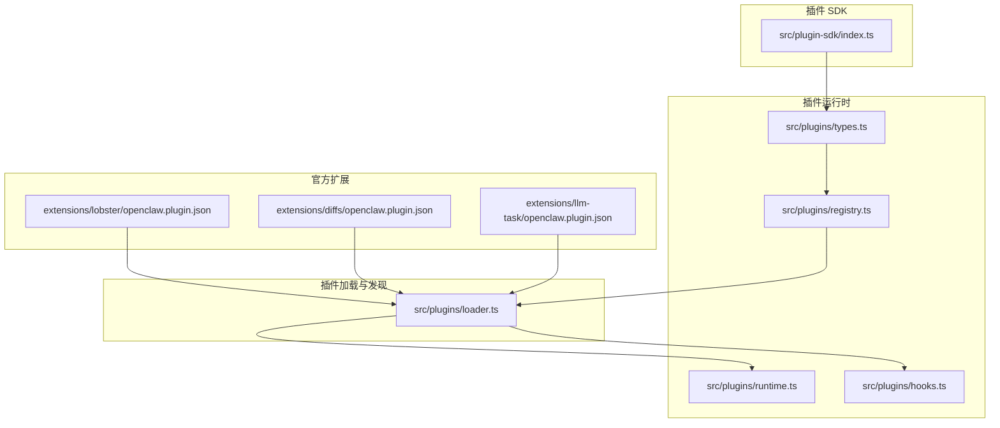
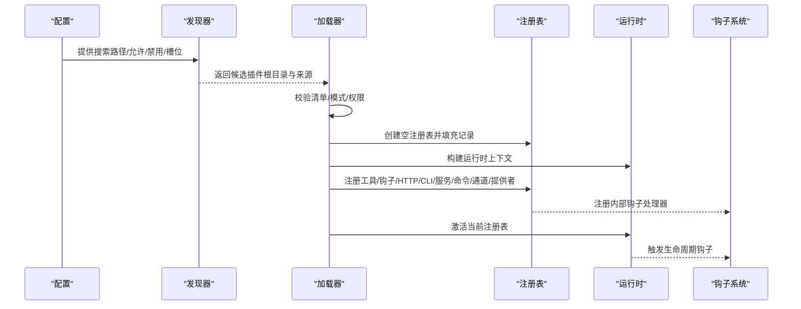
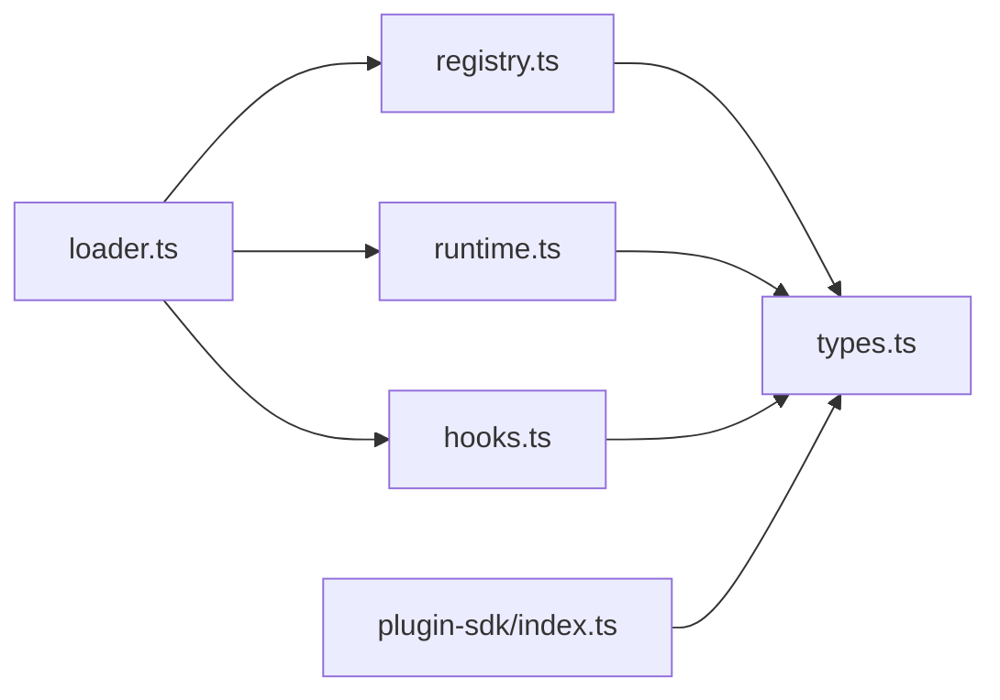

# 插件工具

## 目录
1. [简介](#简介)
2. [项目结构](#项目结构)
3. [核心组件](#核心组件)
4. [架构总览](#架构总览)
5. [组件详解](#组件详解)
6. [依赖关系分析](#依赖关系分析)
7. [性能考量](#性能考量)
8. [故障排查指南](#故障排查指南)
9. [结论](#结论)
10. [附录](#附录)

## 简介
本文件系统性阐述 OpenClaw 插件工具体系：插件 SDK 的使用方法、工具注册机制、生命周期管理、第三方插件安装与配置、官方插件功能、开发指南、与核心工具系统的集成以及安全机制。目标是帮助开发者快速理解并构建高质量的插件。

## 项目结构
OpenClaw 插件系统由“插件 SDK + 插件运行时 + 插件加载器 + 插件清单与配置”四部分组成，并通过官方扩展提供具体能力（如 Lobster 工作流、LLM Task 结构化任务、Diffs 差异查看等）。

图表来源
- [src/plugin-sdk/index.ts](file://src/plugin-sdk/index.ts#L1-L812)
- [src/plugins/types.ts](file://src/plugins/types.ts#L1-L893)
- [src/plugins/registry.ts](file://src/plugins/registry.ts#L1-L625)
- [src/plugins/runtime.ts](file://src/plugins/runtime.ts#L1-L49)
- [src/plugins/loader.ts](file://src/plugins/loader.ts#L1-L200)
- [src/plugins/hooks.ts](file://src/plugins/hooks.ts#L184-L224)
- [extensions/lobster/openclaw.plugin.json](file://extensions/lobster/openclaw.plugin.json#L1-L11)
- [extensions/diffs/openclaw.plugin.json](file://extensions/diffs/openclaw.plugin.json#L1-L183)
- [extensions/llm-task/openclaw.plugin.json](file://extensions/llm-task/openclaw.plugin.json#L1-L22)

章节来源
- [docs/tools/plugin.md](file://docs/tools/plugin.md#L1-L963)
- [docs/plugins/manifest.md](file://docs/plugins/manifest.md#L1-L76)
- [docs/refactor/plugin-sdk.md](file://docs/refactor/plugin-sdk.md#L1-L215)

## 核心组件
- 插件 SDK：提供稳定、可发布的类型与工具集，避免插件直接导入核心源码。
- 插件运行时：通过 OpenClawPluginApi.runtime 暴露受控的核心能力，确保插件不直接访问 src/**。
- 插件注册表：集中管理工具、钩子、HTTP 路由、CLI 命令、服务、通道、提供者等注册项。
- 插件加载器：负责扫描、发现、校验、实例化插件模块与清单，建立活跃注册表并激活。
- 插件钩子：支持事件驱动的生命周期钩子与类型化钩子，实现对提示构造、消息发送、工具调用等阶段的干预。
- 官方扩展：提供 Lobster 工作流、LLM Task 结构化任务、Diffs 差异查看等能力。

章节来源
- [src/plugin-sdk/index.ts](file://src/plugin-sdk/index.ts#L1-L812)
- [src/plugins/types.ts](file://src/plugins/types.ts#L263-L306)
- [src/plugins/registry.ts](file://src/plugins/registry.ts#L129-L142)
- [src/plugins/loader.ts](file://src/plugins/loader.ts#L35-L45)
- [src/plugins/hooks.ts](file://src/plugins/hooks.ts#L184-L224)

## 架构总览
下图展示插件从“发现/加载”到“注册/激活”的整体流程，以及与核心运行时的交互。

图表来源
- [src/plugins/loader.ts](file://src/plugins/loader.ts#L1-L200)
- [src/plugins/registry.ts](file://src/plugins/registry.ts#L168-L183)
- [src/plugins/runtime.ts](file://src/plugins/runtime.ts#L25-L49)
- [src/plugins/hooks.ts](file://src/plugins/hooks.ts#L184-L224)

章节来源
- [docs/tools/plugin.md](file://docs/tools/plugin.md#L228-L304)
- [src/plugins/loader.ts](file://src/plugins/loader.ts#L706-L820)

## 组件详解

### 插件 SDK 与运行时
- SDK 职责：提供类型、配置辅助、认证适配、工具参数解析、媒体处理、状态与日志等通用能力；不包含运行时状态与副作用。
- 运行时职责：通过 OpenClawPluginApi.runtime 暴露受控核心能力（文本分块、回复派发、路由、配对、媒体抓取/保存、提及匹配、组策略、防抖、命令授权等），确保插件只能经由运行时访问核心行为。
- 版本与兼容：SDK 采用语义化版本，运行时随核心版本迭代；插件声明所需运行时范围，CI/检查确保兼容。

章节来源
- [docs/refactor/plugin-sdk.md](file://docs/refactor/plugin-sdk.md#L21-L50)
- [docs/refactor/plugin-sdk.md](file://docs/refactor/plugin-sdk.md#L40-L145)
- [docs/refactor/plugin-sdk.md](file://docs/refactor/plugin-sdk.md#L188-L193)
- [src/plugin-sdk/index.ts](file://src/plugin-sdk/index.ts#L1-L812)
- [src/plugins/types.ts](file://src/plugins/types.ts#L263-L306)

### 插件注册表与 API
- 注册表结构：集中存储插件记录、工具、钩子、HTTP 路由、CLI、服务、命令、通道、提供者及诊断信息。
- API 能力：registerTool/registerHook/registerHttpRoute/registerChannel/registerProvider/registerGatewayMethod/registerCli/registerService/registerCommand/registerContextEngine/on 等。
- 类型化钩子：支持按钩子名注册处理器，带优先级与策略（如禁止提示注入）。

章节来源
- [src/plugins/registry.ts](file://src/plugins/registry.ts#L129-L142)
- [src/plugins/registry.ts](file://src/plugins/registry.ts#L519-L566)
- [src/plugins/types.ts](file://src/plugins/types.ts#L263-L306)

### 插件加载与生命周期
- 发现顺序：配置路径 → 工作区扩展 → 全局扩展 → 内置扩展（默认启用例外）。
- 加载流程：扫描候选 → 校验清单与模式 → 解析配置 → 实例化模块 → 注册项 → 缓存与激活 → 触发钩子。
- 生命周期：加载后激活注册表；运行期通过钩子系统触发事件；支持服务启动/停止；支持命令注册与执行。

章节来源
- [docs/tools/plugin.md](file://docs/tools/plugin.md#L228-L277)
- [src/plugins/loader.ts](file://src/plugins/loader.ts#L706-L820)
- [src/plugins/runtime.ts](file://src/plugins/runtime.ts#L25-L49)

### 插件清单与配置
- 清单要求：每个插件必须在根目录提供 openclaw.plugin.json，包含 id、configSchema 等；configSchema 必须为 JSON Schema，用于严格配置校验。
- 配置规则：plugins.entries.&lt;id&gt;、plugins.allow、plugins.deny、plugins.slots.* 只能引用“可发现”的插件 id；禁用插件保留配置并告警。
- UI 提示：可在清单中提供 uiHints，用于 UI 表单标签、占位与敏感字段标记。

章节来源
- [docs/plugins/manifest.md](file://docs/plugins/manifest.md#L1-L76)
- [docs/tools/plugin.md](file://docs/tools/plugin.md#L384-L392)
- [docs/tools/plugin.md](file://docs/tools/plugin.md#L427-L459)

### 官方插件能力

#### Lobster 工作流工具
- 功能概述：面向确定性多步工作流，内置审批门与可恢复状态；可与 LLM Task 结合在工作流中插入结构化 JSON 步骤。
- 使用要点：作为可选插件工具，默认未启用；需在 agents.tools.allow 或 alsoAllow 中显式允许；与 llm-task 协作时，通过 openclaw.invoke 调用。
- 安全与限制：本地子进程、无网络调用、无凭据管理、沙箱感知禁用、强超时与输出上限。

章节来源
- [docs/tools/lobster.md](file://docs/tools/lobster.md#L1-L341)
- [extensions/lobster/openclaw.plugin.json](file://extensions/lobster/openclaw.plugin.json#L1-L11)

#### LLM Task 结构化任务工具
- 功能概述：运行纯 JSON 的 LLM 任务，返回结构化输出（可选 JSON Schema 验证）；适合工作流引擎（如 Lobster）直接调用。
- 使用要点：作为可选插件工具，需启用并加入允许列表；支持 provider/model/authProfile/temperature/maxTokens/timeoutMs 等参数与可选 schema 验证。
- 安全建议：纯 JSON 模式、无工具暴露、建议在副作用步骤前设置审批。

章节来源
- [docs/tools/llm-task.md](file://docs/tools/llm-task.md#L1-L118)
- [extensions/llm-task/openclaw.plugin.json](file://extensions/llm-task/openclaw.plugin.json#L1-L22)
- [extensions/llm-task/src/llm-task-tool.ts](file://extensions/llm-task/src/llm-task-tool.ts#L73-L99)

#### Diffs 差异查看工具
- 功能概述：只读差异查看与文件渲染，支持主题、布局、字体、缩放、质量、最大宽度等配置；可配置是否允许远程查看器。
- 使用要点：清单中提供丰富的 uiHints 与 configSchema；支持 skills 目录加载技能。

章节来源
- [extensions/diffs/openclaw.plugin.json](file://extensions/diffs/openclaw.plugin.json#L1-L183)

### 插件开发指南

#### API 接口与事件处理
- 工具注册：registerTool 支持工厂函数或直接工具对象，可声明名称、别名与可选标志。
- 钩子注册：registerHook 与 api.on 分别支持内部钩子与类型化钩子；类型化钩子支持优先级与策略（如禁止提示注入）。
- HTTP 路由：registerHttpRoute 支持 exact/prefix 匹配与 auth（gateway/plugin）声明；冲突检测与替换策略。
- CLI 命令：registerCli 注册命令注册器；registerCommand 注册插件自有命令。
- 服务：registerService 注册后台服务（含 start/stop）。
- 通道与提供者：registerChannel/registerProvider 用于扩展消息通道与模型认证。
- 网关方法：registerGatewayMethod 注册网关 RPC 方法。

章节来源
- [src/plugins/registry.ts](file://src/plugins/registry.ts#L193-L218)
- [src/plugins/registry.ts](file://src/plugins/registry.ts#L220-L288)
- [src/plugins/registry.ts](file://src/plugins/registry.ts#L318-L400)
- [src/plugins/registry.ts](file://src/plugins/registry.ts#L459-L472)
- [src/plugins/registry.ts](file://src/plugins/registry.ts#L474-L485)
- [src/plugins/registry.ts](file://src/plugins/registry.ts#L487-L517)
- [src/plugins/registry.ts](file://src/plugins/registry.ts#L519-L566)
- [src/plugins/types.ts](file://src/plugins/types.ts#L263-L306)

#### 错误管理与诊断
- 加载期错误：缺失清单、非法路径、导出缺失、注册异常等均记录诊断并阻断加载。
- 运行期错误：钩子处理器失败时可捕获或抛出，取决于 catchErrors 选项；HTTP 路由重叠与 auth 冲突会被拒绝。
- 诊断输出：registry.diagnostics 与日志记录，便于 Doctor 与排障。

章节来源
- [src/plugins/loader.ts](file://src/plugins/loader.ts#L751-L820)
- [src/plugins/registry.ts](file://src/plugins/registry.ts#L318-L400)
- [src/plugins/hooks.ts](file://src/plugins/hooks.ts#L184-L197)

#### 与核心工具系统的集成
- 运行时注入：通过 api.runtime 访问核心能力，避免直接导入 src/**。
- 网关集成：registerGatewayMethod 与 registerHttpRoute 将插件能力暴露给网关。
- 钩子集成：api.on 与 registerHook 将插件逻辑嵌入代理生命周期。
- 通道与提供者：registerChannel/registerProvider 使插件成为“内置通道/提供者”。

章节来源
- [docs/refactor/plugin-sdk.md](file://docs/refactor/plugin-sdk.md#L40-L145)
- [src/plugins/types.ts](file://src/plugins/types.ts#L263-L306)
- [src/plugins/registry.ts](file://src/plugins/registry.ts#L290-L310)

### 安全机制
- 路径安全：候选路径在发现前进行边界检查，拒绝越界、世界可写、可疑所有权等风险路径。
- 清单与模式：配置校验不执行插件代码，仅基于清单与 JSON Schema。
- 缓存与重用：插件发现与清单元数据短缓存减少启动/重载开销，可通过环境变量禁用或调整窗口。
- 信任与追踪：未安装/未加载路径来源的非内置插件发出警告，便于固定信任（plugins.allow）或安装追踪（plugins.installs）。

章节来源
- [docs/tools/plugin.md](file://docs/tools/plugin.md#L262-L270)
- [docs/tools/plugin.md](file://docs/tools/plugin.md#L219-L227)

## 依赖关系分析

图表来源
- [src/plugins/loader.ts](file://src/plugins/loader.ts#L1-L200)
- [src/plugins/registry.ts](file://src/plugins/registry.ts#L1-L625)
- [src/plugins/runtime.ts](file://src/plugins/runtime.ts#L1-L49)
- [src/plugins/hooks.ts](file://src/plugins/hooks.ts#L184-L224)
- [src/plugin-sdk/index.ts](file://src/plugin-sdk/index.ts#L1-L812)
- [src/plugins/types.ts](file://src/plugins/types.ts#L1-L893)

章节来源
- [src/plugins/loader.ts](file://src/plugins/loader.ts#L1-L200)
- [src/plugins/registry.ts](file://src/plugins/registry.ts#L1-L625)

## 性能考量
- 缓存策略：插件发现与清单元数据短缓存，显著降低启动/重载抖动；可通过环境变量禁用或调整缓存窗口。
- 并行钩子：事件驱动的钩子处理器并行执行，提升吞吐；注意错误聚合与日志记录。
- 路由冲突检测：在注册阶段即阻止 exact/prefix 冲突与 auth 不一致重叠，避免运行期开销。
- 服务与命令：后台服务与 CLI 命令按需初始化，避免不必要的资源占用。

章节来源
- [docs/tools/plugin.md](file://docs/tools/plugin.md#L219-L227)
- [src/plugins/hooks.ts](file://src/plugins/hooks.ts#L203-L224)
- [src/plugins/registry.ts](file://src/plugins/registry.ts#L318-L400)

## 故障排查指南
- 清单/模式错误：检查 openclaw.plugin.json 是否存在、id 与 configSchema 是否合法；参考清单规范与 JSON Schema 要求。
- 配置无效：确认 plugins.entries.&lt;id&gt;、plugins.allow/deny、plugins.slots.* 引用的是“可发现”的插件 id；禁用插件保留配置并告警。
- 加载失败：查看日志与 registry.diagnostics，定位缺失导出、注册异常、路径越界等问题。
- 钩子问题：核对钩子名称合法性、策略（如 allowPromptInjection）、优先级与处理器签名；注意 legacy 钩子的兼容转换。
- HTTP 路由冲突：确保 exact/prefix 与 auth 一致且不重叠；必要时使用 replaceExisting 仅允许同插件覆盖自身。

章节来源
- [docs/plugins/manifest.md](file://docs/plugins/manifest.md#L53-L63)
- [docs/tools/plugin.md](file://docs/tools/plugin.md#L384-L392)
- [src/plugins/loader.ts](file://src/plugins/loader.ts#L751-L820)
- [src/plugins/registry.ts](file://src/plugins/registry.ts#L519-L566)

## 结论
OpenClaw 插件工具体系通过“SDK + 运行时 + 注册表 + 加载器 + 钩子系统”的组合，实现了安全、可控、可扩展的插件生态。官方扩展（Lobster、LLM Task、Diffs）展示了从工作流编排到结构化任务再到差异查看的完整能力闭环。开发者可基于 SDK 与运行时安全地扩展通道、提供者、工具与服务，并通过严格的清单与配置校验保障系统稳定性与安全性。

## 附录

### 插件清单字段速查
- id（必需）：插件标识
- name/description：显示名与描述
- version：版本（信息）
- kind：插件种类（如 memory/context-engine）
- channels/providers：声明注册的通道/提供者 id
- skills：相对根目录的技能目录数组
- configSchema（必需）：JSON Schema
- uiHints：UI 提示（label/help/tags/advanced/sensitive/placeholder）

章节来源
- [docs/plugins/manifest.md](file://docs/plugins/manifest.md#L18-L46)

### 常用 API 一览
- registerTool/registerHook/registerHttpRoute/registerChannel/registerProvider/registerGatewayMethod/registerCli/registerService/registerCommand/registerContextEngine/on
- 运行时能力：api.runtime 下的通道、日志、状态、媒体、路由、配对、分组、去抖、命令授权等

章节来源
- [src/plugins/types.ts](file://src/plugins/types.ts#L263-L306)
- [src/plugin-sdk/index.ts](file://src/plugin-sdk/index.ts#L1-L812)