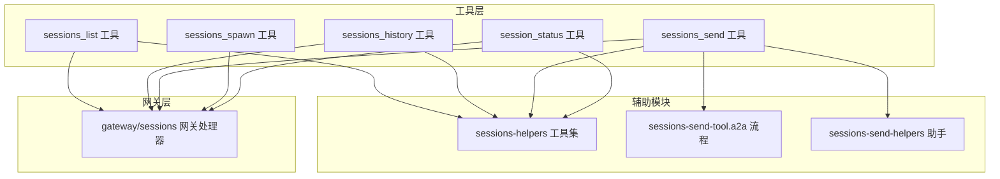
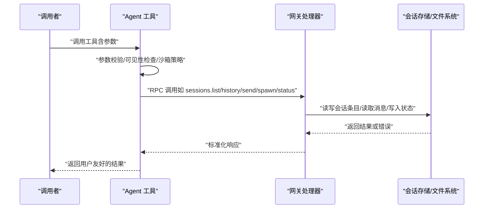
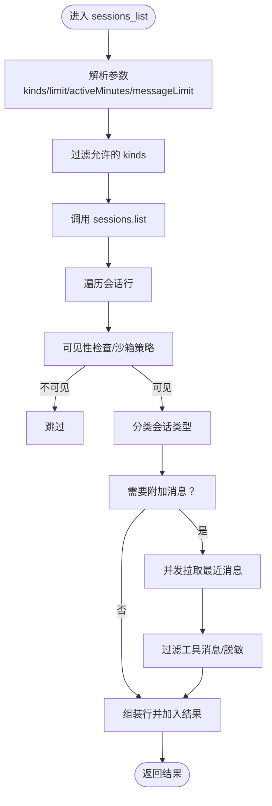
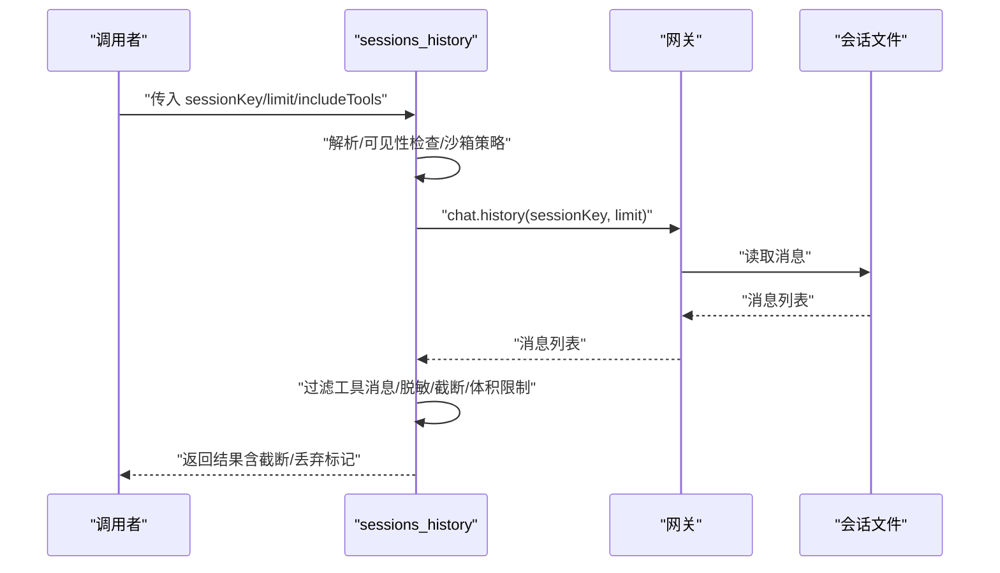
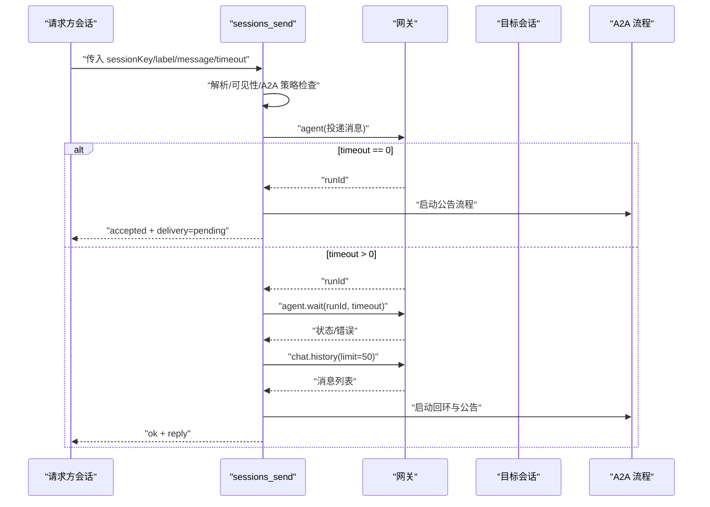
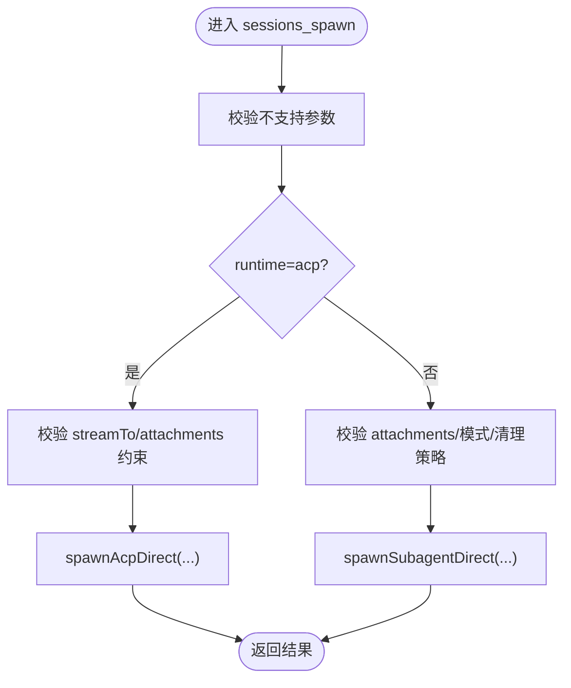
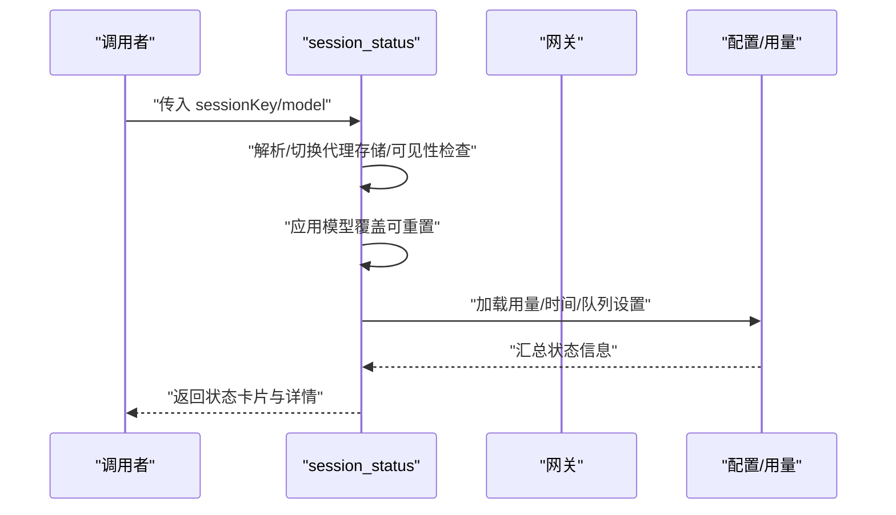
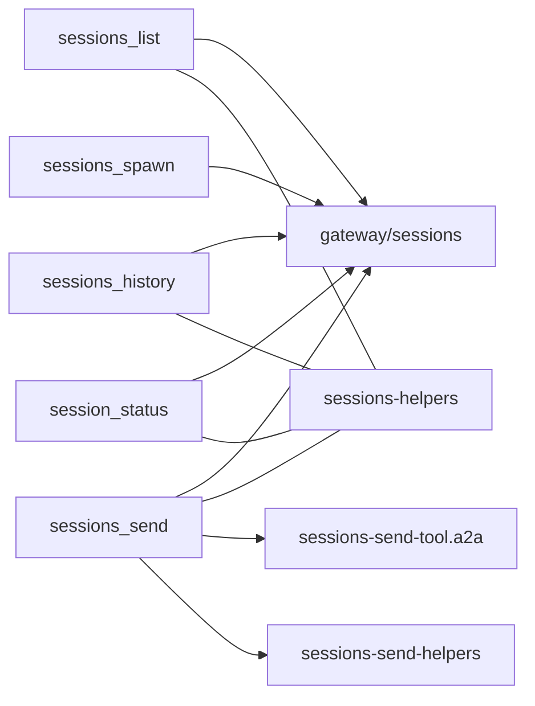

# 会话管理工具

## 目录
1. [简介](#简介)
2. [项目结构](#项目结构)
3. [核心组件](#核心组件)
4. [架构总览](#架构总览)
5. [详细组件分析](#详细组件分析)
6. [依赖关系分析](#依赖关系分析)
7. [性能考量](#性能考量)
8. [故障排查指南](#故障排查指南)
9. [结论](#结论)
10. [附录：工具调用示例与最佳实践](#附录工具调用示例与最佳实践)

## 简介
本文件系统性梳理 OpenClaw 的会话管理工具体系，围绕以下五个核心工具展开：sessions_list（会话列表）、sessions_history（会话历史）、sessions_send（会话间通信）、sessions_spawn（会话派生/任务创建）、session_status（会话状态）。文档从架构、数据流、处理逻辑、参数约束、错误处理到性能优化与最佳实践进行逐层解析，帮助开发者与使用者高效、安全地使用这些工具。

## 项目结构
会话管理工具位于 agents 子模块的 tools 目录中，配套的网关侧实现位于 gateway/server-methods。工具通过统一的网关 RPC 调用与后端会话存储交互，同时在执行前进行可见性与跨代理策略校验。

图表来源
- [src/agents/tools/sessions-list-tool.ts](file://src/agents/tools/sessions-list-tool.ts#L1-L259)
- [src/agents/tools/sessions-history-tool.ts](file://src/agents/tools/sessions-history-tool.ts#L1-L271)
- [src/agents/tools/sessions-send-tool.ts](file://src/agents/tools/sessions-send-tool.ts#L1-L362)
- [src/agents/tools/sessions-spawn-tool.ts](file://src/agents/tools/sessions-spawn-tool.ts#L1-L198)
- [src/agents/tools/session-status-tool.ts](file://src/agents/tools/session-status-tool.ts#L1-L399)
- [src/agents/tools/sessions-helpers.ts](file://src/agents/tools/sessions-helpers.ts#L1-L172)
- [src/agents/tools/sessions-send-tool.a2a.ts](file://src/agents/tools/sessions-send-tool.a2a.ts#L1-L150)
- [src/agents/tools/sessions-send-helpers.ts](file://src/agents/tools/sessions-send-helpers.ts#L1-L167)
- [src/gateway/server-methods/sessions.ts](file://src/gateway/server-methods/sessions.ts#L331-L755)

章节来源
- [src/agents/tools/sessions-list-tool.ts](file://src/agents/tools/sessions-list-tool.ts#L1-L259)
- [src/agents/tools/sessions-history-tool.ts](file://src/agents/tools/sessions-history-tool.ts#L1-L271)
- [src/agents/tools/sessions-send-tool.ts](file://src/agents/tools/sessions-send-tool.ts#L1-L362)
- [src/agents/tools/sessions-spawn-tool.ts](file://src/agents/tools/sessions-spawn-tool.ts#L1-L198)
- [src/agents/tools/session-status-tool.ts](file://src/agents/tools/session-status-tool.ts#L1-L399)
- [src/agents/tools/sessions-helpers.ts](file://src/agents/tools/sessions-helpers.ts#L1-L172)
- [src/agents/tools/sessions-send-tool.a2a.ts](file://src/agents/tools/sessions-send-tool.a2a.ts#L1-L150)
- [src/agents/tools/sessions-send-helpers.ts](file://src/agents/tools/sessions-send-helpers.ts#L1-L167)
- [src/gateway/server-methods/sessions.ts](file://src/gateway/server-methods/sessions.ts#L331-L755)

## 核心组件
- 会话列表工具（sessions_list）
  - 支持 kinds 过滤、limit 数量限制、activeMinutes 活跃时间、messageLimit 历史消息限制等参数；内部对消息进行脱敏与截断，避免敏感信息泄露。
- 会话历史工具（sessions_history）
  - 支持 sessionKey、limit、includeTools 等参数；对返回内容进行敏感信息脱敏、长度与体积限制，保障输出安全可控。
- 会话间通信（sessions_send）
  - 支持 sessionKey 或 label 定位目标会话，支持 timeoutSeconds 超时控制；内置 A2A（Agent-to-Agent）回环与公告流程，支持轮询回合数限制。
- 会话派生（sessions_spawn）
  - 支持 task、label、runtime（subagent/acp）、agentId、model、thinking、cwd、runTimeoutSeconds、thread、mode、cleanup、sandbox、streamTo、attachments 等复杂参数；对不支持的参数进行显式拒绝。
- 会话状态（session_status）
  - 支持 sessionKey 默认当前会话、model 模型覆盖等选项；可按需设置会话级模型覆盖并持久化，同时汇总用量、时间、队列等状态信息。

章节来源
- [src/agents/tools/sessions-list-tool.ts](file://src/agents/tools/sessions-list-tool.ts#L26-L88)
- [src/agents/tools/sessions-history-tool.ts](file://src/agents/tools/sessions-history-tool.ts#L20-L24)
- [src/agents/tools/sessions-send-tool.ts](file://src/agents/tools/sessions-send-tool.ts#L27-L33)
- [src/agents/tools/sessions-spawn-tool.ts](file://src/agents/tools/sessions-spawn-tool.ts#L23-L60)
- [src/agents/tools/session-status-tool.ts](file://src/agents/tools/session-status-tool.ts#L45-L48)

## 架构总览
下图展示工具到网关再到会话存储的数据流与职责边界：

图表来源
- [src/agents/tools/sessions-list-tool.ts](file://src/agents/tools/sessions-list-tool.ts#L79-L88)
- [src/agents/tools/sessions-history-tool.ts](file://src/agents/tools/sessions-history-tool.ts#L240-L243)
- [src/agents/tools/sessions-send-tool.ts](file://src/agents/tools/sessions-send-tool.ts#L283-L300)
- [src/agents/tools/sessions-spawn-tool.ts](file://src/agents/tools/sessions-spawn-tool.ts#L138-L158)
- [src/agents/tools/session-status-tool.ts](file://src/agents/tools/session-status-tool.ts#L185-L195)
- [src/gateway/server-methods/sessions.ts](file://src/gateway/server-methods/sessions.ts#L331-L755)

## 详细组件分析

### 会话列表工具（sessions_list）
- 功能要点
  - 支持 kinds 类型过滤（main/group/cron/hook/node/other），自动归类并过滤。
  - limit 控制返回会话数量上限；activeMinutes 限定活跃时间窗口。
  - messageLimit 控制附加最近消息拉取数量（最大 20），并发拉取以提升性能。
  - 可见性与沙箱策略：根据 requester 与 alias 决定是否仅限 spawned 会话可见。
- 数据与处理
  - 调用网关 sessions.list 获取基础会话列表，随后按需批量拉取最近消息（chat.history），并对工具消息进行过滤与脱敏。
- 参数与行为
  - kinds：字符串数组，允许值受白名单限制。
  - limit：正整数，未提供则不限制。
  - activeMinutes：正整数，未提供则不限制。
  - messageLimit：非负整数，实际取值不超过 20。
- 错误与边界
  - 对空键、未知键、不可见会话进行跳过或拒绝。
  - 并发拉取消息时采用最多 4 个并发，避免阻塞。

图表来源
- [src/agents/tools/sessions-list-tool.ts](file://src/agents/tools/sessions-list-tool.ts#L65-L88)
- [src/agents/tools/sessions-list-tool.ts](file://src/agents/tools/sessions-list-tool.ts#L228-L250)
- [src/agents/tools/sessions-helpers.ts](file://src/agents/tools/sessions-helpers.ts#L38-L101)

章节来源
- [src/agents/tools/sessions-list-tool.ts](file://src/agents/tools/sessions-list-tool.ts#L26-L88)
- [src/agents/tools/sessions-list-tool.ts](file://src/agents/tools/sessions-list-tool.ts#L102-L127)
- [src/agents/tools/sessions-list-tool.ts](file://src/agents/tools/sessions-list-tool.ts#L228-L250)
- [src/agents/tools/sessions-helpers.ts](file://src/agents/tools/sessions-helpers.ts#L38-L101)

### 会话历史工具（sessions_history）
- 功能要点
  - 通过 sessionKey 拉取指定会话的历史消息，支持 limit 限制与 includeTools 开关。
  - 对内容进行敏感信息脱敏、文本截断、媒体数据省略与大小限制，确保输出安全。
- 处理流程
  - 解析与校验 sessionKey，进行可见性与沙箱策略检查。
  - 调用 chat.history 获取消息，按需过滤工具消息，再进行内容裁剪与体积限制。
  - 最终返回会话键、消息列表、截断/丢弃标记与字节统计。
- 参数与行为
  - sessionKey：必填。
  - limit：正整数，未提供则不限制。
  - includeTools：布尔，默认 false。
- 安全与体积控制
  - 单条消息内容与 thinking 内容进行截断与脱敏。
  - 整体 JSON 字节数限制在 80KB，必要时进行硬上限裁剪。

图表来源
- [src/agents/tools/sessions-history-tool.ts](file://src/agents/tools/sessions-history-tool.ts#L178-L268)
- [src/gateway/server-methods/sessions.ts](file://src/gateway/server-methods/sessions.ts#L630-L651)

章节来源
- [src/agents/tools/sessions-history-tool.ts](file://src/agents/tools/sessions-history-tool.ts#L20-L24)
- [src/agents/tools/sessions-history-tool.ts](file://src/agents/tools/sessions-history-tool.ts#L235-L245)
- [src/agents/tools/sessions-history-tool.ts](file://src/agents/tools/sessions-history-tool.ts#L249-L258)
- [src/gateway/server-methods/sessions.ts](file://src/gateway/server-methods/sessions.ts#L630-L651)

### 会话间通信（sessions_send）
- 功能要点
  - 支持通过 sessionKey 或 label 定位目标会话；当使用 label 时，可结合 agentId 与沙箱策略进行解析。
  - 支持 timeoutSeconds 超时控制：timeout=0 表示异步接受并立即返回，否则等待 agent.wait 并提取最后一条助手回复。
  - 内置 A2A 回环与公告流程：在目标会话生成一轮回复后，按策略在目标渠道进行公告。
- 关键流程
  - 解析 sessionKey 或 label -> 可见性检查 -> 发送消息（agent）-> 等待完成（agent.wait）-> 拉取最新消息 -> 启动 A2A 公告流程。
  - A2A 流程支持多轮 ping-pong（由配置决定最大回合），并在最终阶段生成公告文案并投递。
- 参数与行为
  - sessionKey：可选。
  - label：可选，与 sessionKey 二选一。
  - agentId：可选，用于 label 解析时限定代理。
  - message：必填。
  - timeoutSeconds：非负数，默认 30；0 表示异步接受。
- 安全与可见性
  - 沙箱模式下 label 解析受限于 spawned 上下文。
  - A2A 策略受 tools.agentToAgent 配置控制。

图表来源
- [src/agents/tools/sessions-send-tool.ts](file://src/agents/tools/sessions-send-tool.ts#L46-L151)
- [src/agents/tools/sessions-send-tool.ts](file://src/agents/tools/sessions-send-tool.ts#L282-L358)
- [src/agents/tools/sessions-send-tool.a2a.ts](file://src/agents/tools/sessions-send-tool.a2a.ts#L18-L120)
- [src/agents/tools/sessions-send-helpers.ts](file://src/agents/tools/sessions-send-helpers.ts#L158-L167)

章节来源
- [src/agents/tools/sessions-send-tool.ts](file://src/agents/tools/sessions-send-tool.ts#L27-L33)
- [src/agents/tools/sessions-send-tool.ts](file://src/agents/tools/sessions-send-tool.ts#L66-L72)
- [src/agents/tools/sessions-send-tool.ts](file://src/agents/tools/sessions-send-tool.ts#L191-L196)
- [src/agents/tools/sessions-send-tool.a2a.ts](file://src/agents/tools/sessions-send-tool.a2a.ts#L18-L120)
- [src/agents/tools/sessions-send-helpers.ts](file://src/agents/tools/sessions-send-helpers.ts#L158-L167)

### 会话派生（sessions_spawn）
- 功能要点
  - 支持两种运行时：subagent（子代理）与 acp（应用控制平面）。
  - 支持多种模式：run（一次性）、session（持久/线程绑定）。
  - 支持模型覆盖、思考模式、工作目录、运行超时、线程绑定、清理策略、沙箱策略、流式传输目标等。
  - 支持内联附件（最多 50 项），并提供挂载路径提示。
- 参数与行为
  - task：必填。
  - label/runtime/agentId/model/thinking/cwd/runTimeoutSeconds/timeoutSeconds/thread/mode/cleanup/sandbox/streamTo/attachments/attachAs：可选。
  - 不支持的参数（如 target/transport/channel/to/threadId/replyTo 等）会被拒绝。
- 运行时差异
  - runtime=acp：不支持 attachments；支持 streamTo（仅 parent）。
  - runtime=subagent：支持 attachments 与清理策略、期望完成消息等。

图表来源
- [src/agents/tools/sessions-spawn-tool.ts](file://src/agents/tools/sessions-spawn-tool.ts#L82-L89)
- [src/agents/tools/sessions-spawn-tool.ts](file://src/agents/tools/sessions-spawn-tool.ts#L123-L128)
- [src/agents/tools/sessions-spawn-tool.ts](file://src/agents/tools/sessions-spawn-tool.ts#L138-L158)
- [src/agents/tools/sessions-spawn-tool.ts](file://src/agents/tools/sessions-spawn-tool.ts#L161-L192)

章节来源
- [src/agents/tools/sessions-spawn-tool.ts](file://src/agents/tools/sessions-spawn-tool.ts#L23-L60)
- [src/agents/tools/sessions-spawn-tool.ts](file://src/agents/tools/sessions-spawn-tool.ts#L82-L89)
- [src/agents/tools/sessions-spawn-tool.ts](file://src/agents/tools/sessions-spawn-tool.ts#L123-L128)
- [src/agents/tools/sessions-spawn-tool.ts](file://src/agents/tools/sessions-spawn-tool.ts#L138-L158)
- [src/agents/tools/sessions-spawn-tool.ts](file://src/agents/tools/sessions-spawn-tool.ts#L161-L192)

### 会话状态（session_status）
- 功能要点
  - 默认使用当前会话作为 sessionKey；也可通过参数指定。
  - 支持 model 参数进行会话级模型覆盖（支持 default 重置）。
  - 综合用量、时间、队列深度、去抖/封顶/丢弃策略等信息生成状态卡片。
- 处理流程
  - 解析 sessionKey（支持别名、主会话、sessionId 等），必要时切换代理存储。
  - 应用模型覆盖（若提供），并持久化更新。
  - 加载用量摘要、时间、群组激活模式、队列设置等，构建状态文本。
- 安全与可见性
  - 跨代理访问受 tools.agentToAgent 策略控制。

图表来源
- [src/agents/tools/session-status-tool.ts](file://src/agents/tools/session-status-tool.ts#L185-L295)
- [src/agents/tools/session-status-tool.ts](file://src/agents/tools/session-status-tool.ts#L297-L395)

章节来源
- [src/agents/tools/session-status-tool.ts](file://src/agents/tools/session-status-tool.ts#L45-L48)
- [src/agents/tools/session-status-tool.ts](file://src/agents/tools/session-status-tool.ts#L215-L254)
- [src/agents/tools/session-status-tool.ts](file://src/agents/tools/session-status-tool.ts#L264-L295)
- [src/agents/tools/session-status-tool.ts](file://src/agents/tools/session-status-tool.ts#L357-L395)

## 依赖关系分析
- 工具到网关
  - sessions_list 依赖 sessions.list 与 chat.history。
  - sessions_history 依赖 chat.history。
  - sessions_send 依赖 agent、agent.wait、chat.history。
  - sessions_spawn 依赖 ACP 或子代理派生接口。
  - session_status 依赖会话存储与用量摘要。
- 可见性与策略
  - 所有工具均通过 sessions-helpers 提供的可见性守卫与沙箱策略进行访问控制。
  - A2A 策略由 tools.agentToAgent 配置驱动。

图表来源
- [src/agents/tools/sessions-list-tool.ts](file://src/agents/tools/sessions-list-tool.ts#L79-L88)
- [src/agents/tools/sessions-history-tool.ts](file://src/agents/tools/sessions-history-tool.ts#L240-L243)
- [src/agents/tools/sessions-send-tool.ts](file://src/agents/tools/sessions-send-tool.ts#L283-L300)
- [src/agents/tools/sessions-spawn-tool.ts](file://src/agents/tools/sessions-spawn-tool.ts#L138-L158)
- [src/agents/tools/session-status-tool.ts](file://src/agents/tools/session-status-tool.ts#L185-L195)
- [src/agents/tools/sessions-helpers.ts](file://src/agents/tools/sessions-helpers.ts#L1-L29)
- [src/agents/tools/sessions-send-tool.a2a.ts](file://src/agents/tools/sessions-send-tool.a2a.ts#L1-L150)
- [src/agents/tools/sessions-send-helpers.ts](file://src/agents/tools/sessions-send-helpers.ts#L1-L167)

章节来源
- [src/agents/tools/sessions-helpers.ts](file://src/agents/tools/sessions-helpers.ts#L1-L29)
- [src/agents/tools/sessions-send-helpers.ts](file://src/agents/tools/sessions-send-helpers.ts#L1-L167)

## 性能考量
- 并发拉取
  - sessions_list 在需要附加最近消息时，最多使用 4 个并发 worker 拉取消息，避免阻塞。
- 体积与截断
  - sessions_history 对单条消息内容、thinking 内容进行截断与脱敏，并限制整体 JSON 字节数（80KB）。
- 超时与等待
  - sessions_send 在 timeout=0 时采用异步接受模式，减少等待；其他情况通过 agent.wait 控制最长等待时间。
- 存储与清理
  - 网关侧提供 sessions.compact 与维护清理流程，避免磁盘占用膨胀。

章节来源
- [src/agents/tools/sessions-list-tool.ts](file://src/agents/tools/sessions-list-tool.ts#L228-L250)
- [src/agents/tools/sessions-history-tool.ts](file://src/agents/tools/sessions-history-tool.ts#L249-L258)
- [src/agents/tools/sessions-send-tool.ts](file://src/agents/tools/sessions-send-tool.ts#L191-L196)
- [src/gateway/server-methods/sessions.ts](file://src/gateway/server-methods/sessions.ts#L652-L752)

## 故障排查指南
- sessions_list
  - 若返回为空，检查 kinds 是否正确、limit/activeMinutes 是否过于严格、messageLimit 是否超过 20。
  - 沙箱模式下可能因 restrictToSpawned 导致不可见。
- sessions_history
  - 若内容被截断或丢弃，检查 includeTools 与 limit 设置；确认消息体过大触发硬上限裁剪。
  - 确保 sessionKey 正确且具有可见性。
- sessions_send
  - 若 timeout=0 返回 pending，请确认后续 A2A 公告流程是否正常执行。
  - 若 timeout>0 返回 timeout/error，请检查目标会话是否可用、模型是否匹配、通道权限是否足够。
  - 使用 label 时，确认沙箱策略与 A2A 策略配置。
- sessions_spawn
  - 若提示不支持某些参数，请移除或改用其他工具（如 message/sessions_send）。
  - runtime=acp 时不支持 attachments；runtime=subagent 时请确认清理策略与挂载路径。
- session_status
  - 若跨代理访问失败，请检查 tools.agentToAgent.enabled 与 allow 列表。
  - 若模型覆盖无效，请确认模型别名与允许集合。

章节来源
- [src/agents/tools/sessions-list-tool.ts](file://src/agents/tools/sessions-list-tool.ts#L65-L88)
- [src/agents/tools/sessions-history-tool.ts](file://src/agents/tools/sessions-history-tool.ts#L249-L258)
- [src/agents/tools/sessions-send-tool.ts](file://src/agents/tools/sessions-send-tool.ts#L122-L134)
- [src/agents/tools/sessions-spawn-tool.ts](file://src/agents/tools/sessions-spawn-tool.ts#L82-L89)
- [src/agents/tools/session-status-tool.ts](file://src/agents/tools/session-status-tool.ts#L205-L213)

## 结论
OpenClaw 的会话管理工具以“安全、可控、可观测”为核心设计原则：通过严格的可见性与 A2A 策略、消息脱敏与体积限制、并发优化与超时控制，确保在复杂场景下的稳定性与安全性。建议在生产环境中优先启用沙箱策略与 A2A 白名单，合理设置超时与消息限制，并定期清理会话存储以维持系统健康。

## 附录：工具调用示例与最佳实践
- 会话列表（sessions_list）
  - 示例：按类型过滤、限制数量、显示最近消息
  - 最佳实践：合理设置 messageLimit（≤20），在沙箱模式下配合 spawned 上下文使用。
- 会话历史（sessions_history）
  - 示例：拉取最近 N 条消息，排除工具消息
  - 最佳实践：开启 includeTools 仅在调试时使用；注意 80KB 体积上限。
- 会话间通信（sessions_send）
  - 示例：向目标会话发送消息，设置超时；或异步接受
  - 最佳实践：timeout=0 适合后台投递；timeout>0 适合需要即时回复的场景；A2A 回环回合数受配置限制。
- 会话派生（sessions_spawn）
  - 示例：创建一次性任务（mode=run）或持久会话（mode=session），选择 runtime（subagent/acp）
  - 最佳实践：runtime=acp 时不要携带附件；runtime=subagent 时明确清理策略与挂载路径。
- 会话状态（session_status）
  - 示例：查看当前会话状态，或设置模型覆盖
  - 最佳实践：跨代理访问需配置 A2A 策略；模型覆盖仅影响当前会话，可使用 default 重置。

章节来源
- [docs/cli/sessions.md](file://docs/cli/sessions.md#L1-L105)