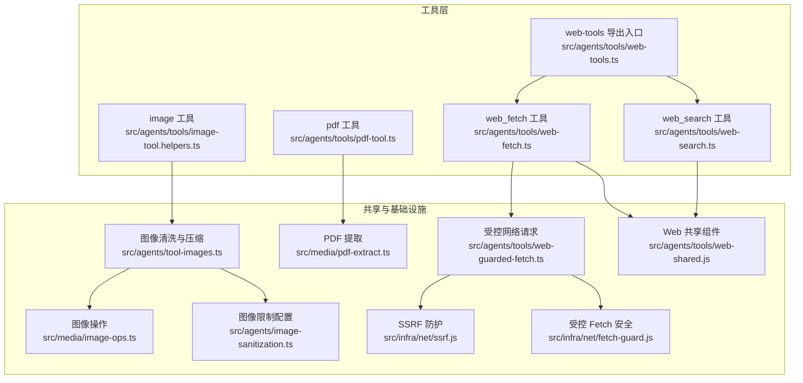
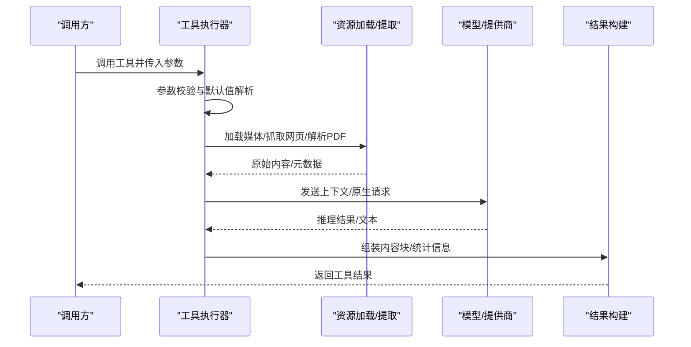
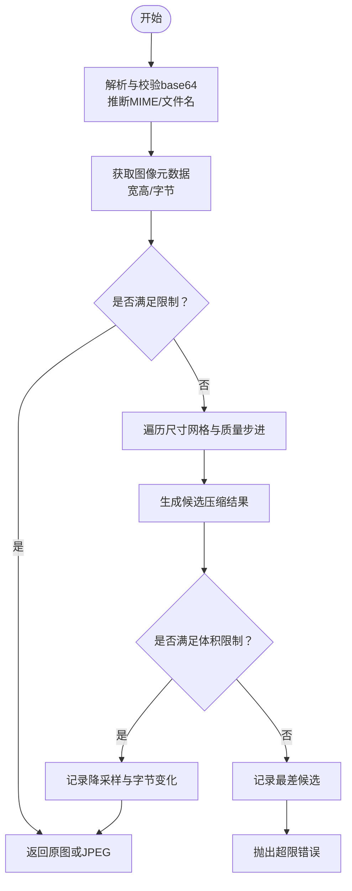
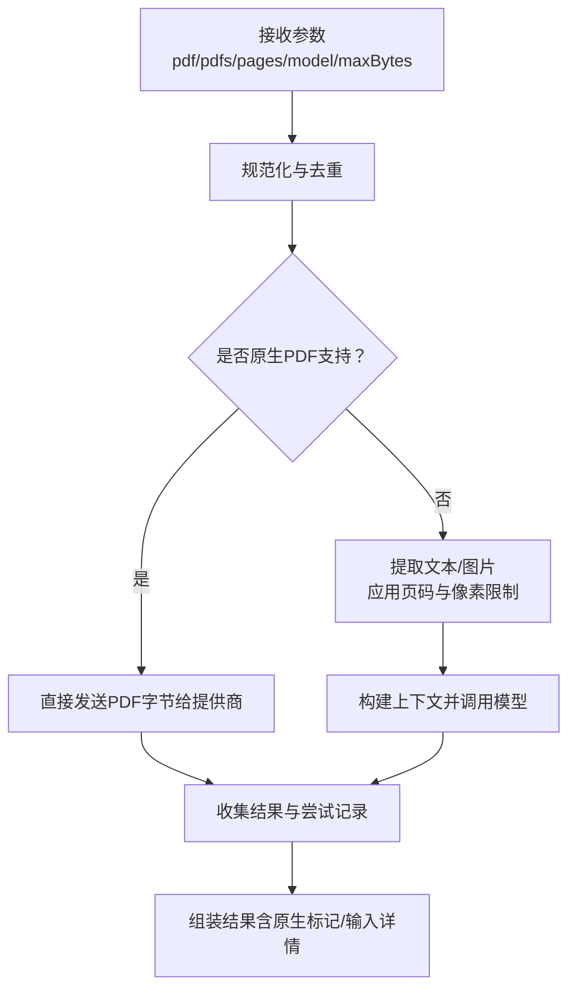
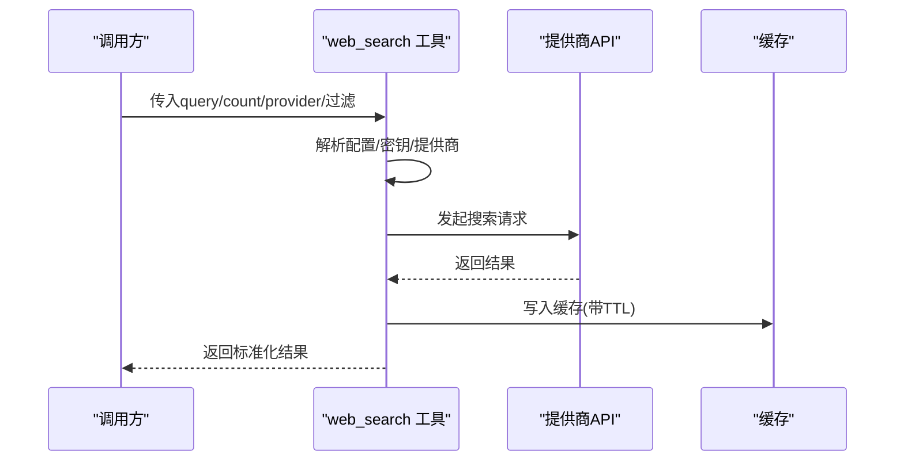
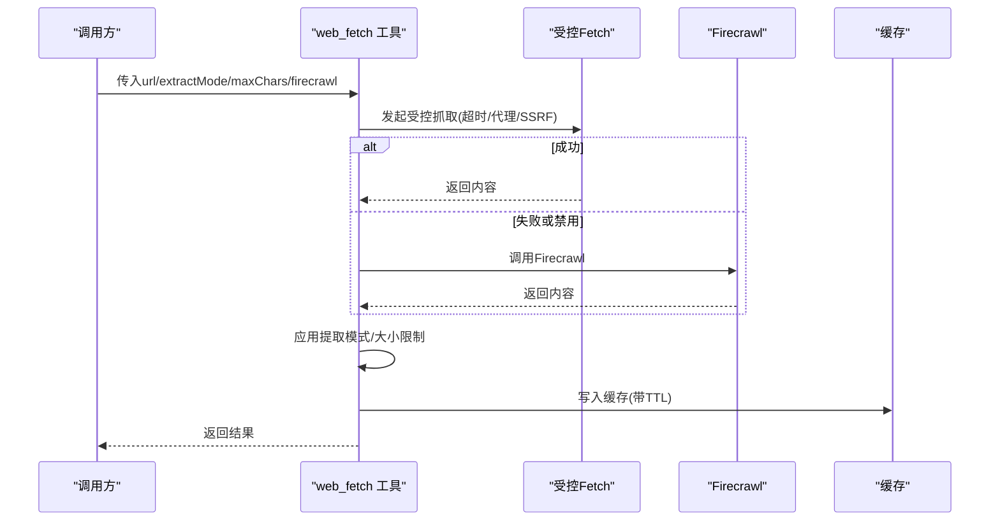
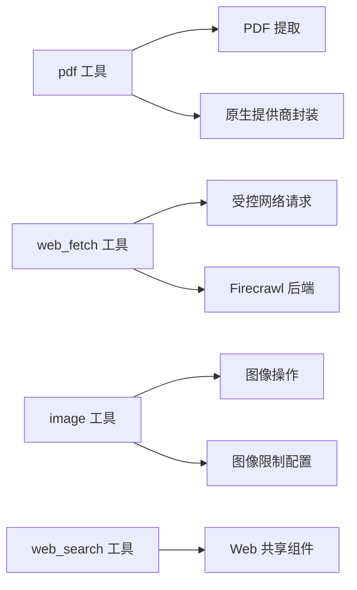

# 实用工具

## 目录
1. [简介](#简介)
2. [项目结构](#项目结构)
3. [核心组件](#核心组件)
4. [架构总览](#架构总览)
5. [详细组件分析](#详细组件分析)
6. [依赖关系分析](#依赖关系分析)
7. [性能考量](#性能考量)
8. [故障排查指南](#故障排查指南)
9. [结论](#结论)
10. [附录](#附录)

## 简介
本文件面向OpenClaw的实用工具系统，聚焦以下工具的能力与使用方式：image（图像分析）、pdf（PDF文档分析）、web_search（网络搜索）、web_fetch（网页抓取）、firecrawl（反爬虫降级与替代）。文档从系统架构、数据流、处理逻辑、集成点、错误处理与性能优化等维度进行深入说明，并提供可操作的调用示例、配置要点与最佳实践。

## 项目结构
实用工具主要位于 agents/tools 目录下，围绕“媒体理解”“网络抓取/搜索”两大能力域组织代码；同时通过共享helpers与基础设施模块实现跨工具复用与安全策略落地。

图表来源
- [src/agents/tools/web-tools.ts](file://src/agents/tools/web-tools.ts#L1-L3)
- [src/agents/tools/pdf-tool.ts](file://src/agents/tools/pdf-tool.ts#L1-L50)
- [src/agents/tools/web-search.ts](file://src/agents/tools/web-search.ts#L1-L50)
- [src/agents/tools/web-fetch.ts](file://src/agents/tools/web-fetch.ts#L1-L50)
- [src/agents/tool-images.ts](file://src/agents/tool-images.ts#L1-L30)
- [src/media/pdf-extract.ts](file://src/media/pdf-extract.ts#L1-L50)
- [src/media/image-ops.ts](file://src/media/image-ops.ts#L1-L50)
- [src/agents/tools/web-guarded-fetch.ts](file://src/agents/tools/web-guarded-fetch.ts#L1-L35)
- [src/agents/tools/web-shared.js](file://src/agents/tools/web-shared.js#L1-L50)
- [src/infra/net/ssrf.js](file://src/infra/net/ssrf.js#L1-L35)
- [src/infra/net/fetch-guard.js](file://src/infra/net/fetch-guard.js#L1-L35)

章节来源
- [src/agents/tools/web-tools.ts](file://src/agents/tools/web-tools.ts#L1-L3)
- [src/agents/tools/pdf-tool.ts](file://src/agents/tools/pdf-tool.ts#L1-L50)
- [src/agents/tools/web-search.ts](file://src/agents/tools/web-search.ts#L1-L50)
- [src/agents/tools/web-fetch.ts](file://src/agents/tools/web-fetch.ts#L1-L50)
- [src/agents/tool-images.ts](file://src/agents/tool-images.ts#L1-L30)

## 核心组件
- image 工具：支持对图像进行清洗、尺寸与体积限制、自动降采样与重编码，适配多模型输入约束，保障在多平台消息通道中的稳定性。
- pdf 工具：支持单/多PDF分析，优先原生PDF输入（Anthropic/Gemini），否则回退到文本/图片提取后统一上下文提问，内置页码范围解析与令牌上限控制。
- web_search 工具：支持多提供商（Brave/Gemini/Grok/Kimi/Perplexity），参数化查询、过滤与计数，具备缓存与超时控制，提供运行时提供商选择与密钥来源解析。
- web_fetch 工具：支持URL抓取，提取模式（markdown/text）、响应大小限制、缓存、Cloudflare Markdown偏好头、Firecrawl降级与替代方案。
- firecrawl 工具：作为web_fetch的可选降级/替代后端，提供对比脚本与测试用例，便于评估与切换。

章节来源
- [src/agents/tools/pdf-tool.ts](file://src/agents/tools/pdf-tool.ts#L334-L356)
- [src/agents/tools/web-search.ts](file://src/agents/tools/web-search.ts#L153-L283)
- [src/agents/tools/web-fetch.ts](file://src/agents/tools/web-fetch.ts#L1-L120)
- [src/agents/tools/web-tools.ts](file://src/agents/tools/web-tools.ts#L1-L3)

## 架构总览
实用工具遵循“参数校验—资源加载—内容提取/推理—结果构建”的通用流程；网络类工具通过受控Fetch与SSRF防护确保安全；图像类工具通过清洗与压缩满足模型输入约束。

图表来源
- [src/agents/tools/pdf-tool.ts](file://src/agents/tools/pdf-tool.ts#L357-L556)
- [src/agents/tools/web-fetch.ts](file://src/agents/tools/web-fetch.ts#L1-L120)
- [src/agents/tools/web-search.ts](file://src/agents/tools/web-search.ts#L1874-L1889)

## 详细组件分析

### image 工具：图像分析与清洗
- 功能概述
  - 对工具输出中的图像内容进行清洗与压缩，确保尺寸不超过最大边长、体积不超过阈值。
  - 自动推断MIME类型与文件名，记录降采样与字节缩减情况，失败时抛出明确错误。
- 关键参数与行为
  - 输入：图像base64数据、MIME类型、可选文件名/媒体路径提示。
  - 限制：最大边长、最大字节数（来自图像限制配置）。
  - 输出：标准化后的JPEG base64与元信息，必要时记录警告日志。
- 处理流程
  - 解析与校验base64，推断MIME与文件名。
  - 计算像素与字节，按网格与质量步进尝试压缩，直至满足体积限制。
  - 若仍不满足，记录最差候选并抛出超出限制的错误。
- 性能与可靠性
  - 通过预置网格与质量步进平衡体积与质量。
  - 在多图场景中避免重复计算，提升整体吞吐。

图表来源
- [src/agents/tool-images.ts](file://src/agents/tool-images.ts#L148-L267)
- [src/agents/tool-images.ts](file://src/agents/tool-images.ts#L269-L335)

章节来源
- [src/agents/tool-images.ts](file://src/agents/tool-images.ts#L1-L363)
- [src/agents/image-sanitization.ts](file://src/agents/image-sanitization.ts#L1-L50)
- [src/media/image-ops.ts](file://src/media/image-ops.ts#L1-L50)
- [src/agents/tools/image-tool.helpers.ts](file://src/agents/tools/image-tool.helpers.ts#L1-L89)

### pdf 工具：PDF文档分析
- 功能概述
  - 支持单个或多个PDF（最多10个）分析，优先原生PDF输入（Anthropic/Gemini），否则回退到文本/图片提取后统一上下文提问。
  - 支持页码范围解析、最大页数与像素限制、最大令牌数控制。
- 关键参数与行为
  - prompt：分析指令（默认提示词）。
  - pdf/pdfs：单个或数组路径/URL，去重与校验。
  - pages：页码范围字符串（如"1-5,7"），解析为1基数组。
  - model：模型覆盖。
  - maxBytesMb：单文档大小限制（默认10MB，可按代理默认覆盖）。
- 处理流程
  - 解析与去重pdf输入，校验scheme与沙箱限制。
  - 逐个加载并校验MIME/类型，转为base64与文件名。
  - 解析页码范围，提取文本与图片（含最小文本长度与最大像素限制）。
  - 选择模型：优先PDF原生支持的提供商，否则构建上下文并调用模型完成分析。
  - 结果组装：包含原生/非原生标记与输入详情。

图表来源
- [src/agents/tools/pdf-tool.ts](file://src/agents/tools/pdf-tool.ts#L357-L556)
- [src/agents/tools/pdf-tool.helpers.ts](file://src/agents/tools/pdf-tool.helpers.ts#L28-L56)
- [src/media/pdf-extract.ts](file://src/media/pdf-extract.ts#L1-L50)

章节来源
- [src/agents/tools/pdf-tool.ts](file://src/agents/tools/pdf-tool.ts#L334-L556)
- [src/agents/tools/pdf-tool.helpers.ts](file://src/agents/tools/pdf-tool.helpers.ts#L1-L110)
- [src/media/pdf-extract.ts](file://src/media/pdf-extract.ts#L1-L50)

### web_search 工具：网络搜索
- 功能概述
  - 支持Brave/Gemini/Grok/Kimi/Perplexity多家提供商，参数化查询、计数、过滤（国家/语言/时间新鲜度/日期区间）。
  - 提供缓存、超时、可信端点访问与外部内容包装，支持运行时提供商选择与密钥来源解析。
- 关键参数与行为
  - query：查询关键词。
  - count：返回结果数量（1-10）。
  - provider：提供商选择（自动检测可用密钥）。
  - 过滤：country/language/freshness/date_after/date_before。
  - 运行时：selectedProvider/providerConfigured/perplexityTransport。
- 处理流程
  - 解析配置与启用状态，确定提供商与密钥来源。
  - 构造查询参数与过滤条件，调用对应提供商API。
  - 缓存结果（带TTL），返回标准化payload与外部内容标记。

图表来源
- [src/agents/tools/web-search.ts](file://src/agents/tools/web-search.ts#L1874-L1889)
- [src/agents/tools/web-search.ts](file://src/agents/tools/web-search.ts#L533-L670)
- [src/agents/tools/web-shared.js](file://src/agents/tools/web-shared.js#L1-L50)

章节来源
- [src/agents/tools/web-search.ts](file://src/agents/tools/web-search.ts#L153-L283)
- [src/agents/tools/web-search.ts](file://src/agents/tools/web-search.ts#L533-L670)
- [src/commands/onboard-search.ts](file://src/commands/onboard-search.ts#L295-L321)

### web_fetch 工具：网页抓取
- 功能概述
  - 抓取指定URL，支持提取模式（markdown/text）、响应大小限制、缓存、Cloudflare Markdown偏好头、Firecrawl降级与替代。
- 关键参数与行为
  - url：目标URL。
  - extractMode：提取模式（markdown/text）。
  - maxChars：字符限制（由maxResponseBytes换算）。
  - cacheTtlMinutes：缓存TTL。
  - firecrawl.enabled：是否启用Firecrawl。
  - SSRF/代理/超时：通过受控Fetch与SSRF策略保障安全与可控性。
- 处理流程
  - 解析配置与默认值，构造受控Fetch请求（含超时与代理策略）。
  - 尝试基础抓取，若失败或禁用则回退至Firecrawl。
  - 应用提取模式与大小限制，记录tokens与调试信息，写入缓存。

图表来源
- [src/agents/tools/web-fetch.ts](file://src/agents/tools/web-fetch.ts#L1-L120)
- [src/agents/tools/web-guarded-fetch.ts](file://src/agents/tools/web-guarded-fetch.ts#L1-L35)
- [src/agents/tools/web-fetch.test-harness.ts](file://src/agents/tools/web-fetch.test-harness.ts#L23-L49)
- [src/agents/tools/web-fetch.cf-markdown.test.ts](file://src/agents/tools/web-fetch.cf-markdown.test.ts#L38-L137)

章节来源
- [src/agents/tools/web-fetch.ts](file://src/agents/tools/web-fetch.ts#L1-L120)
- [src/agents/tools/web-guarded-fetch.ts](file://src/agents/tools/web-guarded-fetch.ts#L1-L35)
- [src/agents/tools/web-fetch.test-harness.ts](file://src/agents/tools/web-fetch.test-harness.ts#L1-L49)
- [src/agents/tools/web-fetch.cf-markdown.test.ts](file://src/agents/tools/web-fetch.cf-markdown.test.ts#L1-L137)
- [src/agents/tools/web-tools.fetch.test.ts](file://src/agents/tools/web-tools.fetch.test.ts#L1-L121)

### firecrawl 工具：反机器人降级与替代
- 功能概述
  - 作为web_fetch的可选降级/替代后端，用于应对目标站点的反爬虫策略。
  - 提供对比脚本与测试用例，便于评估不同提取策略的效果。
- 使用建议
  - 当基础抓取失败或受限时启用firecrawl。
  - 通过运行时开关与密钥来源控制其激活与诊断。
- 对比与测试
  - 提供对比脚本以评估不同提取策略的差异。
  - 测试用例覆盖Cloudflare Markdown偏好头、tokens日志等细节。

章节来源
- [scripts/firecrawl-compare.ts](file://scripts/firecrawl-compare.ts#L27-L66)
- [src/agents/tools/web-fetch.cf-markdown.test.ts](file://src/agents/tools/web-fetch.cf-markdown.test.ts#L97-L137)
- [src/agents/tools/web-tools.fetch.test.ts](file://src/agents/tools/web-tools.fetch.test.ts#L34-L54)

## 依赖关系分析
- 组件耦合
  - pdf工具依赖PDF提取模块与原生提供商封装，回退路径依赖图像/文本提取与模型完成函数。
  - web_fetch依赖受控网络请求与SSRF防护，可选依赖Firecrawl后端。
  - image工具依赖图像操作与清洗模块，确保输出符合模型输入约束。
- 外部依赖与集成点
  - 模型提供商（Anthropic/Gemini/OpenAI等）通过统一的模型发现与密钥解析接口接入。
  - 网络工具通过可信端点与受控Fetch策略对接外部服务。
- 循环依赖
  - 工具层通过helpers与共享模块解耦，未见循环依赖迹象。

图表来源
- [src/agents/tools/pdf-tool.ts](file://src/agents/tools/pdf-tool.ts#L1-L50)
- [src/media/pdf-extract.ts](file://src/media/pdf-extract.ts#L1-L50)
- [src/agents/tools/pdf-native-providers.ts](file://src/agents/tools/pdf-native-providers.ts#L1-L50)
- [src/agents/tools/web-fetch.ts](file://src/agents/tools/web-fetch.ts#L1-L50)
- [src/agents/tools/web-guarded-fetch.ts](file://src/agents/tools/web-guarded-fetch.ts#L1-L35)
- [src/agents/tool-images.ts](file://src/agents/tool-images.ts#L1-L30)
- [src/media/image-ops.ts](file://src/media/image-ops.ts#L1-L50)
- [src/agents/image-sanitization.ts](file://src/agents/image-sanitization.ts#L1-L50)
- [src/agents/tools/web-search.ts](file://src/agents/tools/web-search.ts#L1-L50)
- [src/agents/tools/web-shared.js](file://src/agents/tools/web-shared.js#L1-L50)

章节来源
- [src/agents/tools/pdf-tool.ts](file://src/agents/tools/pdf-tool.ts#L1-L50)
- [src/agents/tools/web-fetch.ts](file://src/agents/tools/web-fetch.ts#L1-L50)
- [src/agents/tool-images.ts](file://src/agents/tool-images.ts#L1-L30)
- [src/agents/tools/web-search.ts](file://src/agents/tools/web-search.ts#L1-L50)

## 性能考量
- 图像处理
  - 通过网格与质量步进减少不必要的多次压缩，优先满足体积限制后再记录日志。
  - 在多图场景中避免重复元数据读取，降低I/O开销。
- PDF分析
  - 原生PDF输入优先，减少文本/图片提取成本；合理设置最大页数与像素上限，控制内存占用。
  - 令牌上限与模型最大值取较小者，避免无效请求。
- 网络抓取
  - 受控Fetch设置超时与代理策略，结合缓存减少重复请求。
  - Firecrawl作为降级路径，仅在必要时启用，避免额外延迟。
- 搜索
  - 提供商自动检测与缓存，减少无效请求与API调用次数。

## 故障排查指南
- API密钥缺失
  - web_search需要相应提供商的API密钥，可通过配置或环境变量提供；工具会返回明确的错误与文档链接。
- URL与格式问题
  - pdf工具对URL scheme进行严格校验，不支持的引用会被拒绝；web_fetch对URL进行基本合法性检查。
- 超限与降采样
  - image工具在无法满足体积限制时抛出错误；可通过增大限制或优化图像源解决。
- 缓存与超时
  - web_search/web_fetch均支持缓存与超时配置，检查TTL与网络状况有助于定位问题。
- SSRF与代理
  - 受控Fetch与SSRF策略确保请求安全，若出现连接异常，检查代理与DNS解析策略。

章节来源
- [src/agents/tools/web-search.ts](file://src/agents/tools/web-search.ts#L564-L602)
- [src/agents/tools/pdf-tool.ts](file://src/agents/tools/pdf-tool.ts#L437-L447)
- [src/agents/tools/web-guarded-fetch.ts](file://src/agents/tools/web-guarded-fetch.ts#L24-L35)
- [src/commands/onboard-search.ts](file://src/commands/onboard-search.ts#L295-L321)

## 结论
OpenClaw的实用工具体系在保证安全性与可维护性的前提下，提供了强大的媒体理解与网络抓取能力。通过统一的参数规范、受控网络请求、图像清洗与压缩、以及原生PDF与Firecrawl降级策略，工具能够在复杂环境中稳定工作。建议在生产使用中结合缓存、令牌上限与大小限制策略，持续监控与优化性能与成本。

## 附录
- 工具调用示例（路径参考）
  - image工具：参见图像清洗与压缩实现路径
    - [src/agents/tool-images.ts](file://src/agents/tool-images.ts#L269-L335)
  - pdf工具：参见参数定义与执行流程
    - [src/agents/tools/pdf-tool.ts](file://src/agents/tools/pdf-tool.ts#L334-L556)
  - web_search工具：参见参数Schema与执行流程
    - [src/agents/tools/web-search.ts](file://src/agents/tools/web-search.ts#L153-L283)
    - [src/agents/tools/web-search.ts](file://src/agents/tools/web-search.ts#L1874-L1889)
  - web_fetch工具：参见抓取与降级逻辑
    - [src/agents/tools/web-fetch.ts](file://src/agents/tools/web-fetch.ts#L1-L120)
    - [src/agents/tools/web-fetch.test-harness.ts](file://src/agents/tools/web-fetch.test-harness.ts#L23-L49)
  - firecrawl对比与测试
    - [scripts/firecrawl-compare.ts](file://scripts/firecrawl-compare.ts#L27-L66)
    - [src/agents/tools/web-fetch.cf-markdown.test.ts](file://src/agents/tools/web-fetch.cf-markdown.test.ts#L38-L137)
    - [src/agents/tools/web-tools.fetch.test.ts](file://src/agents/tools/web-tools.fetch.test.ts#L1-L121)