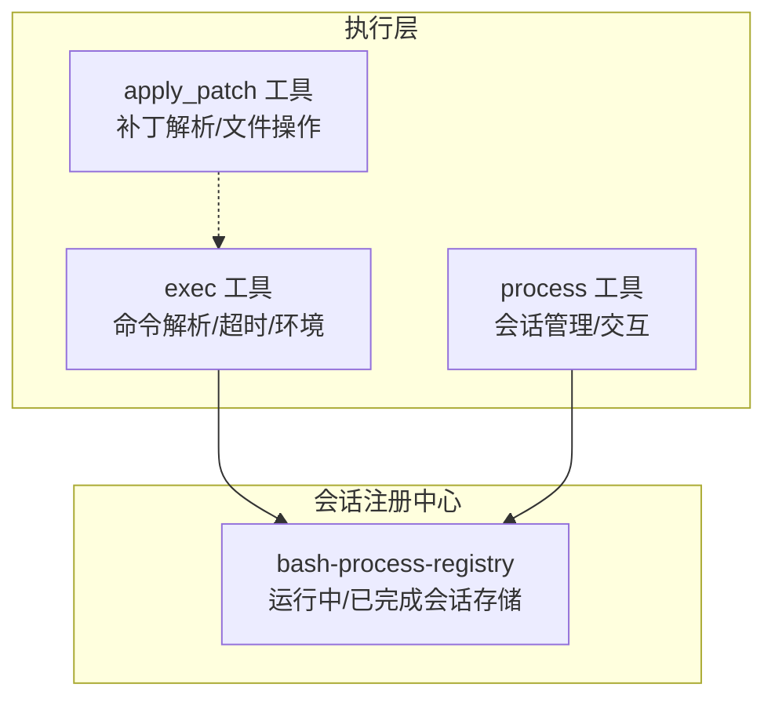
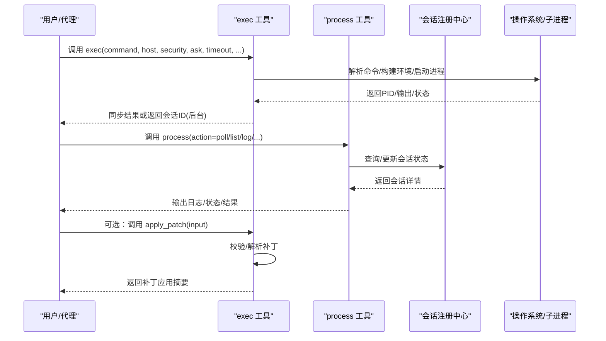
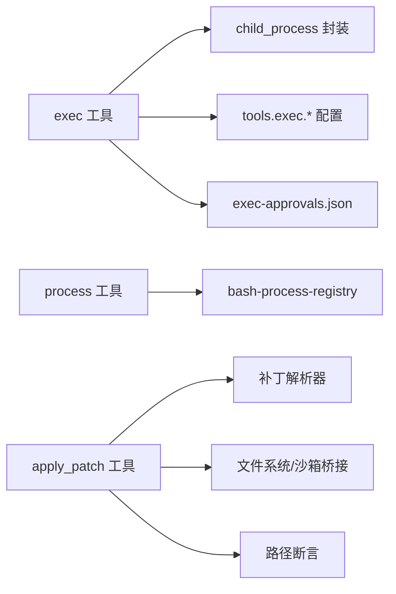

# 执行工具

## 目录
1. [简介](#简介)
2. [项目结构](#项目结构)
3. [核心组件](#核心组件)
4. [架构总览](#架构总览)
5. [详细组件分析](#详细组件分析)
6. [依赖关系分析](#依赖关系分析)
7. [性能考量](#性能考量)
8. [故障排除指南](#故障排除指南)
9. [结论](#结论)

## 简介
本文件面向OpenClaw的执行工具体系，围绕以下三个关键工具展开：exec、process、apply_patch。内容涵盖：
- exec工具的shell命令执行能力与参数策略（host主机选择、security安全策略、ask询问模式、elevated提权、timeout/yieldMs等）
- process工具的后台会话管理（list、poll、log、write、send-keys、submit、paste、kill、clear、remove）
- apply_patch补丁应用工具的多文件结构化补丁编辑能力与工作区约束
并提供调用示例、错误处理与故障排除建议，以及安全限制、沙箱策略与执行策略说明。

## 项目结构
OpenClaw将“执行工具”的实现分布在多个模块中：
- 命令执行与子进程运行：src/process/exec.ts
- 后台会话管理与工具接口：src/agents/bash-tools.process.ts、src/agents/bash-process-registry.ts
- 结构化补丁应用：src/agents/apply-patch.ts
- 文档与策略参考：docs/tools/exec.md、docs/tools/apply-patch.md、docs/tools/exec-approvals.md、docs/gateway/background-process.md

图表来源
- [src/process/exec.ts](file://src/process/exec.ts#L108-L343)
- [src/agents/bash-tools.process.ts](file://src/agents/bash-tools.process.ts#L119-L179)
- [src/agents/bash-process-registry.ts](file://src/agents/bash-process-registry.ts#L82-L176)

章节来源
- [src/process/exec.ts](file://src/process/exec.ts#L1-L344)
- [src/agents/apply-patch.ts](file://src/agents/apply-patch.ts#L1-L583)
- [src/agents/bash-tools.process.ts](file://src/agents/bash-tools.process.ts#L52-L179)
- [src/agents/bash-process-registry.ts](file://src/agents/bash-process-registry.ts#L82-L176)
- [docs/tools/exec.md](file://docs/tools/exec.md#L1-L205)
- [docs/tools/apply-patch.md](file://docs/tools/apply-patch.md#L1-L52)
- [docs/tools/exec-approvals.md](file://docs/tools/exec-approvals.md#L1-L379)
- [docs/gateway/background-process.md](file://docs/gateway/background-process.md#L64-L98)

## 核心组件
- exec工具：负责在指定host上执行shell命令，支持前台与后台模式、超时控制、TTY支持、环境变量注入、Windows兼容性与安全策略校验。
- process工具：对后台会话进行生命周期管理，包括列出、轮询、查看日志、写入输入、发送按键、提交、粘贴文本、终止、清理与移除。
- apply_patch工具：以结构化补丁格式批量对多文件进行增删改，并可限定在工作区范围内执行，支持沙箱路径校验与中止信号。

章节来源
- [docs/tools/exec.md](file://docs/tools/exec.md#L9-L120)
- [docs/tools/apply-patch.md](file://docs/tools/apply-patch.md#L9-L52)
- [src/agents/bash-tools.process.ts](file://src/agents/bash-tools.process.ts#L119-L179)
- [src/agents/apply-patch.ts](file://src/agents/apply-patch.ts#L85-L123)

## 架构总览
下图展示exec、process与apply_patch三者之间的协作关系及数据流：

图表来源
- [src/process/exec.ts](file://src/process/exec.ts#L108-L343)
- [src/agents/bash-tools.process.ts](file://src/agents/bash-tools.process.ts#L119-L179)
- [src/agents/bash-process-registry.ts](file://src/agents/bash-process-registry.ts#L82-L176)
- [src/agents/apply-patch.ts](file://src/agents/apply-patch.ts#L125-L189)

## 详细组件分析

### exec 工具：shell命令执行与策略
- 功能要点
  - 支持前台与后台执行；若禁用process则exec同步执行并忽略yieldMs/background
  - 主机选择：sandbox、gateway、node；默认sandbox
  - 安全策略：deny（拒绝）、allowlist（仅允许白名单）、full（放行）
  - 询问模式：off（不提示）、on-miss（未命中时提示）、always（每次均提示）
  - 提权模式：elevated=true时强制security=full
  - 超时控制：timeout秒级超时；yieldMs用于自动转后台
  - TTY支持：pty布尔值，适用于需要伪终端的TTY类CLI
  - 环境变量：env覆盖；host=gateway时拒绝PATH与loader注入以防止劫持
  - 路径处理：不同host下的PATH合并/前置策略不同
  - 配置项：tools.exec.*（如notifyOnExit、approvalRunningNoticeMs、pathPrepend、safeBins等）

- 关键实现点
  - 命令执行：runExec/runCommandWithTimeout封装execFile/spawn，统一超时与输出收集
  - Windows兼容：resolveNpmArgvForWindows、resolveCommand、buildCmdExeCommandLine、escapeForCmdExe
  - 环境注入：resolveCommandEnv合并env并标记OPENCLAW_SHELL=exec
  - 终止原因：timeout/no-output-timeout/signal/exit

- 参数与行为对照
  - host：sandbox（容器内登录shell）、gateway（网关主机）、node（节点主机）
  - security：deny/allowlist/full；allowlist模式下仅允许已解析二进制路径匹配
  - ask：off/on-miss/always；配合exec-approvals.json本地策略
  - elevated：true时强制security=full，跳过批准流程
  - timeout/yieldMs：前者硬超时，后者自动转后台
  - pty：启用伪终端，适合交互式CLI
  - env：host=gateway/node时对PATH/加载器变量有严格限制

- 示例与用法
  - 前台执行：参见文档中的“Foreground”示例
  - 后台+轮询：参见文档中的“Background + poll”示例
  - 发送按键/提交/粘贴：参见文档中的“Send keys/Submit/Paste”示例
  - apply_patch启用：参见文档中的“apply_patch（实验）”示例

- 安全与策略
  - 沙箱默认关闭：若sandbox开启且host=sandbox被请求，需显式启用沙箱或使用gateway并经批准
  - PATH策略：gateway合并登录shell PATH但拒绝env.PATH覆盖；sandbox通过内部机制前置PATH；node仅接受非阻断env覆盖
  - 安全二进制（safeBins）：stdin-only过滤器，需明确目录信任与argv策略
  - 允许列表：仅允许已解析二进制路径，链式与重定向受限

章节来源
- [docs/tools/exec.md](file://docs/tools/exec.md#L15-L148)
- [src/process/exec.ts](file://src/process/exec.ts#L108-L343)
- [docs/tools/exec-approvals.md](file://docs/tools/exec-approvals.md#L83-L217)

### process 工具：后台会话管理
- 功能要点
  - 列表：仅显示内存中持久化的后台会话
  - 轮询：等待任务完成，支持最大轮询时间上限
  - 日志：基于行偏移/长度分页获取最近输出
  - 写入：向会话stdin写入数据
  - 发送按键：send-keys（支持键序列、十六进制、字面量）
  - 提交/粘贴：submit发送回车；paste支持括号包装
  - 终止/清理/移除：kill、clear、remove；remove会尝试取消或终止并清理资源

- 关键实现点
  - 会话模型：ProcessSession包含命令、PID、输出缓冲、退出状态等
  - 注册中心：runningSessions/finishedSessions，支持挂起输出清空、退出标记、FD清理
  - 作用域隔离：按agent作用域管理，互不可见
  - 轮询与日志：offset/limit分页，缺省返回最后200行并带分页提示

- 示例与用法
  - 后台任务+轮询：参见文档中的“Run a long task and poll later”
  - 立即后台：参见文档中的“Start immediately in background”
  - 写入输入：参见文档中的“Send stdin”

- 故障排除
  - 会话丢失：进程重启后会话不会持久化
  - 日志记录：需主动调用process poll/log并将结果记录到聊天历史
  - 权限与作用域：仅能看到本agent启动的会话

章节来源
- [src/agents/bash-tools.process.ts](file://src/agents/bash-tools.process.ts#L52-L179)
- [src/agents/bash-process-registry.ts](file://src/agents/bash-process-registry.ts#L82-L176)
- [docs/gateway/background-process.md](file://docs/gateway/background-process.md#L64-L98)

### apply_patch 工具：结构化多文件补丁编辑
- 功能要点
  - 输入格式：以“Begin Patch/End Patch”包裹的多文件补丁，支持新增、删除、更新与移动
  - 路径策略：默认仅限工作区（workspaceOnly=true），可选放宽至允许跨工作区
  - 沙箱集成：在沙箱环境中通过桥接读写，严格校验路径逃逸
  - 中止支持：支持AbortSignal，便于外部取消
  - 摘要输出：返回添加/修改/删除的文件清单

- 关键实现点
  - 补丁解析：parsePatchText/checkPatchBoundariesLenient/parseOneHunk/parseUpdateFileChunk
  - 文件操作：resolvePatchFileOps根据是否沙箱选择不同实现（bridge或本地FS）
  - 路径解析：resolvePatchPath结合workspaceOnly与沙箱断言，确保安全
  - 更新应用：applyUpdateHunk将补丁块应用到目标文件，支持EOF-only插入与文件移动

- 示例与用法
  - 单文件更新：参见文档中的“Example”示例
  - 多文件/多块：参见文档中的“Parameters/Notes”说明

- 安全与策略
  - 默认工作区限制：避免越界写入
  - 沙箱路径断言：在沙箱中强制路径在校验范围内
  - 实验特性：需显式启用tools.exec.applyPatch.enabled

章节来源
- [docs/tools/apply-patch.md](file://docs/tools/apply-patch.md#L9-L52)
- [src/agents/apply-patch.ts](file://src/agents/apply-patch.ts#L125-L327)

## 依赖关系分析
- exec依赖
  - 运行时：Node child_process（execFile/spawn）、环境注入、Windows兼容解析
  - 策略：tools.exec.*配置、exec-approvals.json、安全策略与提权
- process依赖
  - 会话注册中心：bash-process-registry维护运行中/已完成会话
  - 作用域：按agent隔离，避免跨会话访问
- apply_patch依赖
  - 补丁解析器：parsePatchText/parseOneHunk
  - 文件操作：本地FS或沙箱桥接
  - 路径断言：workspaceOnly与沙箱路径校验

图表来源
- [src/process/exec.ts](file://src/process/exec.ts#L108-L343)
- [src/agents/bash-tools.process.ts](file://src/agents/bash-tools.process.ts#L119-L179)
- [src/agents/bash-process-registry.ts](file://src/agents/bash-process-registry.ts#L82-L176)
- [src/agents/apply-patch.ts](file://src/agents/apply-patch.ts#L125-L327)

章节来源
- [src/process/exec.ts](file://src/process/exec.ts#L108-L343)
- [src/agents/bash-tools.process.ts](file://src/agents/bash-tools.process.ts#L119-L179)
- [src/agents/bash-process-registry.ts](file://src/agents/bash-process-registry.ts#L82-L176)
- [src/agents/apply-patch.ts](file://src/agents/apply-patch.ts#L125-L327)

## 性能考量
- 超时与无输出超时：合理设置timeoutMs与noOutputTimeoutMs，避免长时间占用资源
- 输出缓冲与分页：process log使用offset/limit分页，避免一次性拉取大量输出
- 会话清理：markExited中销毁stdio流与事件监听，释放FD与内存
- Windows兼容：通过resolveNpmArgvForWindows避免直接spawn .cmd/.bat导致的EINVAL

章节来源
- [src/process/exec.ts](file://src/process/exec.ts#L220-L343)
- [src/agents/bash-process-registry.ts](file://src/agents/bash-process-registry.ts#L144-L176)

## 故障排除指南
- exec常见问题
  - Windows命令注入风险：不要在argv中传入未经转义的用户输入；必要时使用显式shell-wrapper argv
  - PATH异常：gateway拒绝env.PATH覆盖；sandbox通过内部机制前置PATH；node仅接受非阻断env覆盖
  - 沙箱失败：若sandbox关闭且host=sandbox被请求，exec会失败而非静默运行
  - 提权与批准：elevated=true时security=full生效；否则需遵循exec-approvals.json与ask策略
- process常见问题
  - 会话不可见：仅能看到本agent启动的会话
  - 日志未记录：需调用process poll/log并将结果记录到聊天历史
  - 会话丢失：进程重启后会话不会持久化
- apply_patch常见问题
  - 路径逃逸：默认workspaceOnly=true，越界路径会被拒绝；可显式设置workspaceOnly=false放宽
  - 沙箱越界：在沙箱中必须满足路径断言；可通过toRelativeSandboxPath与assertSandboxPath保证
  - 中止无效：需正确传递AbortSignal并在工具内部检查中断状态

章节来源
- [docs/tools/exec.md](file://docs/tools/exec.md#L30-L148)
- [docs/tools/exec-approvals.md](file://docs/tools/exec-approvals.md#L1-L379)
- [docs/gateway/background-process.md](file://docs/gateway/background-process.md#L64-L98)
- [src/agents/apply-patch.ts](file://src/agents/apply-patch.ts#L242-L327)

## 结论
exec、process、apply_patch共同构成OpenClaw的执行工具体系：exec负责命令执行与策略控制，process提供后台会话生命周期管理，apply_patch提供结构化多文件变更能力。通过严格的host/security/ask/elevated策略与沙箱路径断言，系统在开放自动化能力的同时保障了安全性与可控性。建议在生产环境中优先采用allowlist模式与明确的safeBins策略，并结合批准提示与会话分页日志，提升可观测性与可审计性。