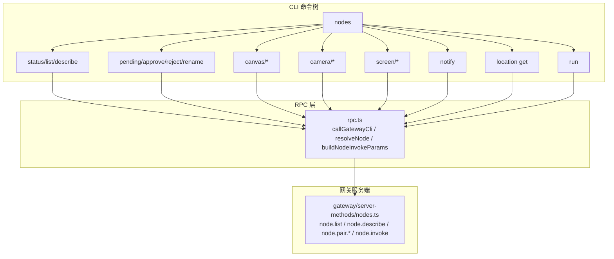
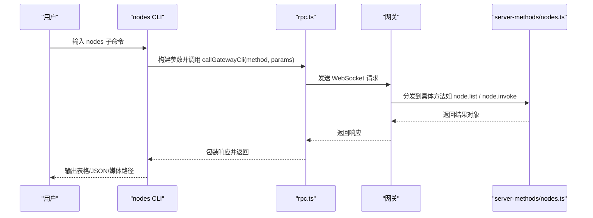
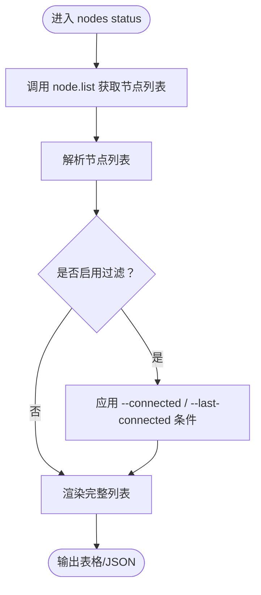
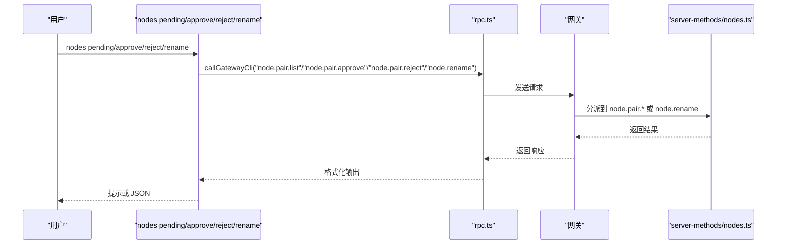
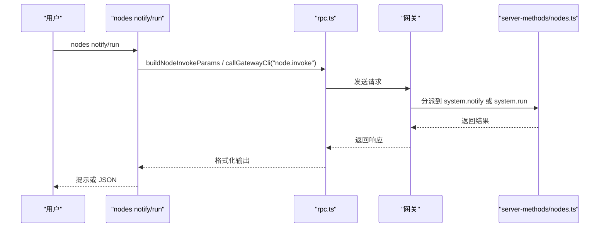
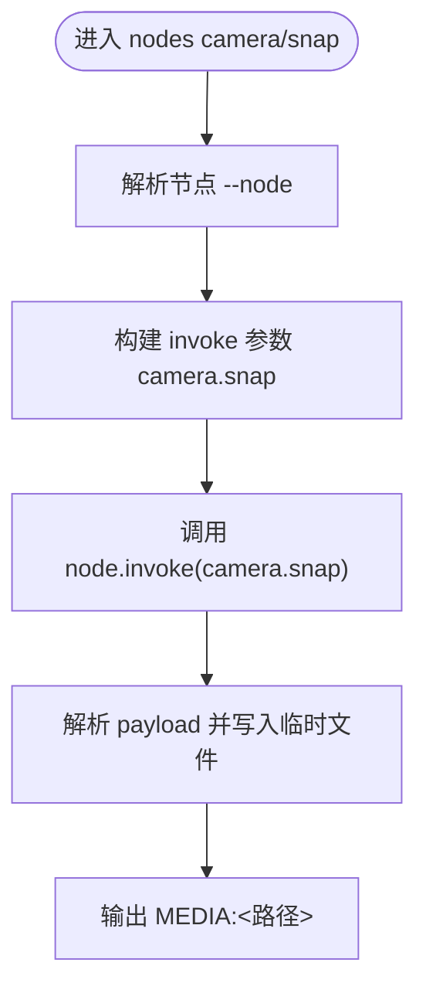
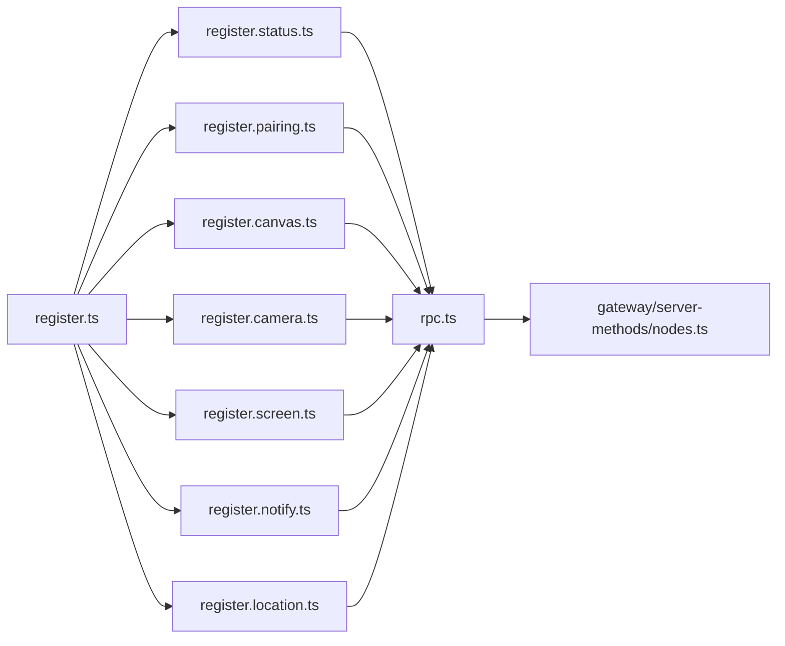

# 节点管理工具

## 目录
1. [简介](#简介)
2. [项目结构](#项目结构)
3. [核心组件](#核心组件)
4. [架构总览](#架构总览)
5. [详细组件分析](#详细组件分析)
6. [依赖关系分析](#依赖关系分析)
7. [性能考量](#性能考量)
8. [故障排查指南](#故障排查指南)
9. [结论](#结论)
10. [附录](#附录)

## 简介
本文件面向 OpenClaw 的“节点管理工具”（nodes 工具）系统，系统化阐述其功能与使用方法，覆盖以下方面：
- 节点发现与目标定位：status 状态查询、describe 描述信息获取
- 配对管理：pending 待批准、approve 批准、reject 拒绝、rename 重命名
- 通知与远程执行：notify 系统通知、run 远程命令执行
- 媒体捕获：camera_list 摄像头列表、camera_snap 拍照、camera_clip 录制视频、screen_record 屏幕录制
- 位置信息与设备管理：location_get 位置获取、notifications_list/notifications_action 通知列表与操作、device_status/info/permissions/health 设备状态与信息
- 工具调用示例、参数配置与跨平台兼容性说明

该工具通过 CLI 子命令与网关（Gateway）进行交互，将高层操作映射到节点能力（如 canvas.*、camera.*、device.*、notifications.*、system.*），并支持 JSON 输出与可选的超时控制。

## 项目结构
nodes 工具由一组 CLI 子命令组成，统一挂载在主程序的 nodes 命令下，并按功能拆分为多个注册模块：
- 状态与描述：nodes status/list/describe
- 配对管理：nodes pending/approve/reject/rename
- 媒体：nodes canvas/*、nodes camera/*、nodes screen/*
- 通知：nodes notify
- 位置：nodes location get
- 远程执行：nodes run（基于 system.run）

图表来源
- [src/cli/nodes-cli/register.ts](file://src/cli/nodes-cli/register.ts#L15-L39)
- [src/cli/nodes-cli/rpc.ts](file://src/cli/nodes-cli/rpc.ts#L16-L38)
- [src/gateway/server-methods/nodes.ts](file://src/gateway/server-methods/nodes.ts#L599-L644)

章节来源
- [src/cli/nodes-cli/register.ts](file://src/cli/nodes-cli/register.ts#L15-L39)
- [docs/cli/nodes.md](file://docs/cli/nodes.md#L9-L38)

## 核心组件
- 命令注册器：将各子功能注册到 nodes 命令树，统一注入通用选项（--url、--token、--timeout、--json）
- RPC 客户端：封装与网关通信的通用逻辑，包含超时、进度提示、错误处理与节点解析
- 网关方法：提供节点列表、描述、配对、调用等 RPC 方法
- 文档参考：CLI 参考与节点概念文档，定义行为与示例

章节来源
- [src/cli/nodes-cli/rpc.ts](file://src/cli/nodes-cli/rpc.ts#L9-L38)
- [src/gateway/server-methods/nodes.ts](file://src/gateway/server-methods/nodes.ts#L599-L644)
- [docs/cli/nodes.md](file://docs/cli/nodes.md#L1-L76)
- [docs/nodes/index.md](file://docs/nodes/index.md#L1-L373)

## 架构总览
nodes 工具的调用链路如下：
- 用户输入 nodes 子命令
- CLI 解析参数并调用 rpc.ts 中的 callGatewayCli
- rpc.ts 将请求转发至网关（WebSocket）
- 网关根据方法名分派到 server-methods/nodes.ts 中的对应处理器
- 处理器返回结果，CLI 格式化输出或写入媒体文件

图表来源
- [src/cli/nodes-cli/rpc.ts](file://src/cli/nodes-cli/rpc.ts#L16-L38)
- [src/gateway/server-methods/nodes.ts](file://src/gateway/server-methods/nodes.ts#L599-L644)

## 详细组件分析

### 状态与描述：nodes status/list/describe
- nodes status
  - 功能：列出已知节点，显示连接状态、能力集合、版本与权限等
  - 支持过滤：仅显示已连接节点、仅显示最近连接的节点
  - 输出：统计行 + 表格；支持 --json 输出原始数据
- nodes list
  - 功能：展示待批准与已配对节点，支持相同过滤条件
  - 输出：待批准表 + 已配对表；支持 --json
- nodes describe
  - 功能：获取单个节点的能力与支持的调用命令
  - 输出：节点元信息 + 命令清单；支持 --json

图表来源
- [src/cli/nodes-cli/register.status.ts](file://src/cli/nodes-cli/register.status.ts#L100-L212)
- [src/cli/nodes-cli/rpc.ts](file://src/cli/nodes-cli/rpc.ts#L16-L38)

章节来源
- [src/cli/nodes-cli/register.status.ts](file://src/cli/nodes-cli/register.status.ts#L100-L212)
- [src/cli/nodes-cli/register.status.ts](file://src/cli/nodes-cli/register.status.ts#L297-L409)
- [src/cli/nodes-cli/rpc.ts](file://src/cli/nodes-cli/rpc.ts#L79-L96)
- [docs/cli/nodes.md](file://docs/cli/nodes.md#L25-L38)

### 配对管理：nodes pending/approve/reject/rename
- nodes pending
  - 功能：列出待批准的节点配对请求
  - 输出：表格；支持 --json
- nodes approve &lt;requestId&gt;
  - 功能：批准指定的配对请求
  - 输出：JSON 结果
- nodes reject &lt;requestId&gt;
  - 功能：拒绝指定的配对请求
  - 输出：JSON 结果
- nodes rename --node &lt;id|name|ip> --name &lt;displayName&gt;
  - 功能：为已配对节点设置显示名称（网关侧覆盖）
  - 输出：成功提示或 JSON

图表来源
- [src/cli/nodes-cli/register.pairing.ts](file://src/cli/nodes-cli/register.pairing.ts#L9-L100)
- [src/cli/nodes-cli/rpc.ts](file://src/cli/nodes-cli/rpc.ts#L16-L38)
- [src/gateway/server-methods/nodes.ts](file://src/gateway/server-methods/nodes.ts#L599-L644)

章节来源
- [src/cli/nodes-cli/register.pairing.ts](file://src/cli/nodes-cli/register.pairing.ts#L9-L100)
- [docs/nodes/index.md](file://docs/nodes/index.md#L24-L44)

### 通知与远程执行：nodes notify/run
- nodes notify
  - 功能：向节点发送本地通知（macOS 节点）
  - 关键参数：--title、--body、--sound、--priority、--delivery、--invoke-timeout
  - 输出：成功提示或 JSON
- nodes run
  - 功能：在节点上执行系统命令（依赖节点暴露 system.run）
  - 默认行为：读取 tools.exec.* 配置与代理工具的 exec 审批流程
  - 关键参数：--node、--raw、--cwd、--env、--command-timeout、--invoke-timeout、--needs-screen-recording、--agent、--ask、--security
  - 输出：命令标准输出/错误与退出码（JSON）

图表来源
- [src/cli/nodes-cli/register.notify.ts](file://src/cli/nodes-cli/register.notify.ts#L8-L57)
- [src/cli/nodes-cli/register.invoke.ts](file://src/cli/nodes-cli/register.invoke.ts)
- [src/cli/nodes-cli/rpc.ts](file://src/cli/nodes-cli/rpc.ts#L40-L57)
- [src/gateway/server-methods/nodes.ts](file://src/gateway/server-methods/nodes.ts#L599-L644)

章节来源
- [src/cli/nodes-cli/register.notify.ts](file://src/cli/nodes-cli/register.notify.ts#L8-L57)
- [src/cli/nodes-cli/register.invoke.ts](file://src/cli/nodes-cli/register.invoke.ts)
- [docs/nodes/index.md](file://docs/nodes/index.md#L290-L316)
- [docs/cli/nodes.md](file://docs/cli/nodes.md#L40-L76)

### 媒体捕获：camera/canvas/screen/location
- nodes canvas snapshot
  - 功能：抓取画布快照，输出 MEDIA:&lt;路径>
  - 参数：--format、--max-width、--quality、--invoke-timeout
- nodes canvas present/hide/navigate/eval
  - 功能：控制画布显示、导航与脚本执行
- nodes camera list/snap/clip
  - 功能：列出摄像头、拍照（支持 front/back/both）、录制短片（限制时长）
  - 参数：--facing、--device-id、--max-width、--quality、--delay-ms、--duration、--no-audio、--invoke-timeout
- nodes screen record
  - 功能：录制屏幕（多屏选择、帧率、音频开关）
  - 参数：--screen、--duration、--fps、--no-audio、--out、--invoke-timeout
- nodes location get
  - 功能：从节点获取位置信息
  - 参数：--max-age、--accuracy、--location-timeout、--invoke-timeout

图表来源
- [src/cli/nodes-cli/register.camera.ts](file://src/cli/nodes-cli/register.camera.ts#L108-L188)
- [src/cli/nodes-cli/rpc.ts](file://src/cli/nodes-cli/rpc.ts#L40-L57)

章节来源
- [src/cli/nodes-cli/register.canvas.ts](file://src/cli/nodes-cli/register.canvas.ts#L28-L246)
- [src/cli/nodes-cli/register.camera.ts](file://src/cli/nodes-cli/register.camera.ts#L34-L263)
- [src/cli/nodes-cli/register.screen.ts](file://src/cli/nodes-cli/register.screen.ts#L14-L83)
- [src/cli/nodes-cli/register.location.ts](file://src/cli/nodes-cli/register.location.ts#L8-L82)
- [docs/nodes/index.md](file://docs/nodes/index.md#L157-L232)

### 设备与通知：device/*、notifications/*
- 设备管理
  - 命令族：device.status、device.info、device.permissions、device.health
  - 使用方式：通过 nodes invoke 调用相应命令
- 通知管理
  - 命令族：notifications.list、notifications.actions
  - 使用方式：通过 nodes invoke 调用相应命令
- 位置信息
  - 命令：location.get（见上节）

章节来源
- [docs/nodes/index.md](file://docs/nodes/index.md#L265-L290)

## 依赖关系分析
- 命令注册器集中挂载所有子命令，统一注入通用选项
- RPC 层负责：
  - 统一超时与客户端标识
  - 节点解析（优先 node.list，回退 node.pair.list）
  - 构造 node.invoke 参数（含幂等键）
- 网关层提供：
  - 节点生命周期与状态查询
  - 节点能力描述
  - 配对请求的审批与重命名
  - 节点命令调用入口

图表来源
- [src/cli/nodes-cli/register.ts](file://src/cli/nodes-cli/register.ts#L15-L39)
- [src/cli/nodes-cli/rpc.ts](file://src/cli/nodes-cli/rpc.ts#L1-L97)
- [src/gateway/server-methods/nodes.ts](file://src/gateway/server-methods/nodes.ts#L599-L644)

章节来源
- [src/cli/nodes-cli/register.ts](file://src/cli/nodes-cli/register.ts#L15-L39)
- [src/cli/nodes-cli/rpc.ts](file://src/cli/nodes-cli/rpc.ts#L1-L97)

## 性能考量
- 超时控制
  - 各命令默认超时不同，建议根据任务类型调整 --invoke-timeout 与 --timeout
  - 示例：camera.clip 默认较长超时以适应拍摄与编码时间
- 输出格式
  - 使用 --json 可减少终端渲染开销，便于自动化处理
- 过滤策略
  - 在大量节点场景下，优先使用 --connected 与 --last-connected 减少渲染与网络负载

## 故障排查指南
- 未授权/签名问题
  - 若出现桥接客户端未授权提示，可参考提示中的签名或开发模式建议
- 节点不可达
  - 使用 nodes status 确认节点连接状态；必要时使用 --connected 或 --last-connected 进行筛选
- 命令无响应
  - 调整 --invoke-timeout 或 --timeout；检查节点是否处于前台（部分命令需前台）
- 权限不足
  - 摄像头/录音/屏幕录制等命令可能需要系统权限；确认节点侧权限状态

章节来源
- [src/cli/nodes-cli/rpc.ts](file://src/cli/nodes-cli/rpc.ts#L59-L73)
- [docs/nodes/index.md](file://docs/nodes/index.md#L211-L231)

## 结论
nodes 工具提供了从节点发现、配对管理到媒体捕获与远程执行的完整能力集。通过统一的 CLI 接口与 RPC 抽象，用户可以便捷地管理多平台节点并调用其能力。建议结合 --json 与超时参数优化自动化流程，并在权限与前台状态受限场景下合理选择命令与参数。

## 附录

### 常用命令与参数速查
- 列表与状态
  - openclaw nodes status [--connected] [--last-connected &lt;duration&gt;] [--json]
  - openclaw nodes list [--connected] [--last-connected &lt;duration&gt;] [--json]
  - openclaw nodes describe --node &lt;id|name|ip> [--json]
- 配对管理
  - openclaw nodes pending [--json]
  - openclaw nodes approve &lt;requestId&gt; [--json]
  - openclaw nodes reject &lt;requestId&gt; [--json]
  - openclaw nodes rename --node &lt;id|name|ip> --name &lt;displayName&gt; [--json]
- 通知与执行
  - openclaw nodes notify --node &lt;id|name|ip> [--title &lt;text&gt;] [--body &lt;text&gt;] [--sound &lt;name&gt;] [--priority &lt;passive|active|timeSensitive>] [--delivery &lt;system|overlay|auto>] [--invoke-timeout &lt;ms&gt;]
  - openclaw nodes run --node &lt;id|name|ip> [--raw &lt;command&gt;] [--cwd &lt;path&gt;] [--env &lt;key=val>] [--command-timeout &lt;ms&gt;] [--invoke-timeout &lt;ms&gt;] [--needs-screen-recording] [--agent &lt;id&gt;] [--ask &lt;off|on-miss|always>] [--security &lt;deny|allowlist|full>]
- 媒体捕获
  - openclaw nodes canvas snapshot --node &lt;id|name|ip> [--format png|jpg|jpeg] [--max-width &lt;px&gt;] [--quality &lt;0-1&gt;] [--invoke-timeout &lt;ms&gt;]
  - openclaw nodes canvas present --node &lt;id|name|ip> [--target &lt;urlOrPath&gt;] [--x &lt;px&gt;] [--y &lt;px&gt;] [--width &lt;px&gt;] [--height &lt;px&gt;] [--invoke-timeout &lt;ms&gt;]
  - openclaw nodes canvas hide --node &lt;id|name|ip> [--invoke-timeout &lt;ms&gt;]
  - openclaw nodes canvas navigate &lt;url&gt; --node &lt;id|name|ip> [--invoke-timeout &lt;ms&gt;]
  - openclaw nodes canvas eval [--js &lt;code&gt;] &lt;js&gt; --node &lt;id|name|ip> [--invoke-timeout &lt;ms&gt;]
  - openclaw nodes camera list --node &lt;id|name|ip> [--json]
  - openclaw nodes camera snap --node &lt;id|name|ip> [--facing front|back|both] [--device-id &lt;id&gt;] [--max-width &lt;px&gt;] [--quality &lt;0-1&gt;] [--delay-ms &lt;ms&gt;] [--invoke-timeout &lt;ms&gt;]
  - openclaw nodes camera clip --node &lt;id|name|ip> [--facing front|back] [--device-id &lt;id&gt;] [--duration &lt;ms|10s|1m>] [--no-audio] [--invoke-timeout &lt;ms&gt;]
  - openclaw nodes screen record --node &lt;id|name|ip> [--screen &lt;index&gt;] [--duration &lt;ms|10s>] [--fps &lt;fps&gt;] [--no-audio] [--out &lt;path&gt;] [--invoke-timeout &lt;ms&gt;]
  - openclaw nodes location get --node &lt;id|name|ip> [--max-age &lt;ms&gt;] [--accuracy coarse|balanced|precise] [--location-timeout &lt;ms&gt;] [--invoke-timeout &lt;ms&gt;]

章节来源
- [docs/cli/nodes.md](file://docs/cli/nodes.md#L25-L76)
- [docs/nodes/index.md](file://docs/nodes/index.md#L157-L316)