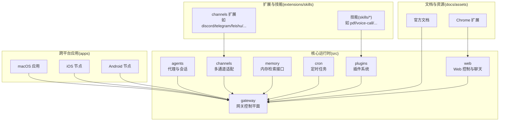
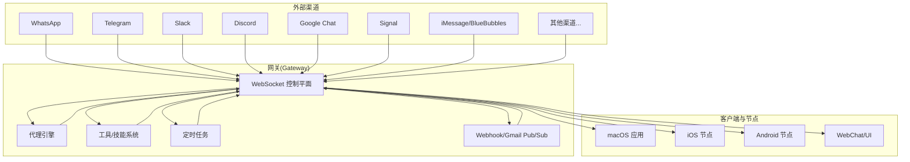
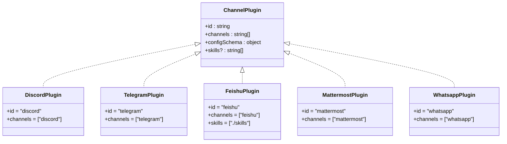
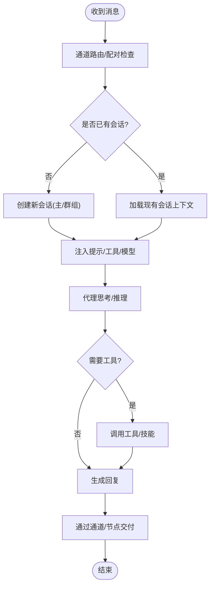
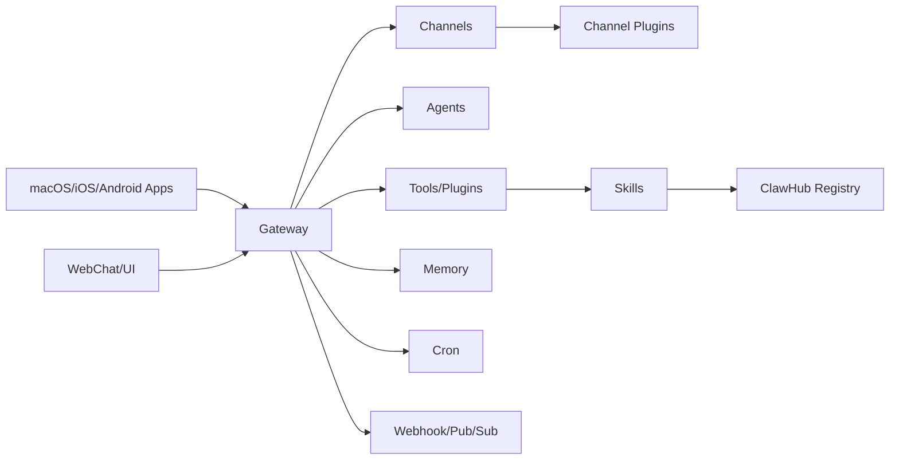

# 核心功能

## 目录
1. [简介](#简介)
2. [项目结构](#项目结构)
3. [核心组件](#核心组件)
4. [架构总览](#架构总览)
5. [详细组件分析](#详细组件分析)
6. [依赖关系分析](#依赖关系分析)
7. [性能考量](#性能考量)
8. [故障排查指南](#故障排查指南)
9. [结论](#结论)
10. [附录](#附录)

## 简介
OpenClaw 是一个可在本地设备上运行的个人 AI 助手，支持多渠道消息集成、AI 代理平台、跨平台应用与节点、工具与技能系统、自动化与集成能力。其核心设计理念是“本地优先、安全默认、能力可扩展”，通过统一的网关控制平面（Gateway）协调会话、通道、工具与事件，并提供 CLI、Web 控制界面以及 macOS/iOS/Android 节点应用。

- 多渠道消息集成：覆盖 WhatsApp、Telegram、Slack、Discord、Google Chat、Signal、iMessage/BlueBubbles、IRC、Microsoft Teams、Matrix、Feishu、LINE、Mattermost、Nextcloud Talk、Nostr、Synology Chat、Tlon、Twitch、Zalo、Zalo Personal、WebChat 等。
- AI 代理平台：支持多代理路由、会话模型、媒体处理流水线、存在性与输入指示、重试策略与流式输出。
- 跨平台应用与节点：macOS 菜单栏应用、iOS/Android 节点、Canvas 画布与语音唤醒/通话模式。
- 工具与技能系统：浏览器控制、Canvas、节点、定时任务、会话间通信、ClawHub 技能注册表。
- 自动化与集成：Webhook、Gmail Pub/Sub、Tailscale 远程暴露、SSH 隧道、远程网关控制。

章节来源
- [README.md](file://README.md#L21-L27)
- [README.md](file://README.md#L126-L177)

## 项目结构
OpenClaw 的代码组织以功能域与平台为中心，核心目录与职责如下：
- src：核心运行时与子系统（agents、gateway、channels、cli、cron、memory、media、plugins、web 等）
- extensions：按通道/能力拆分的插件包，每个插件包含 openclaw.plugin.json 描述其通道/技能/配置
- skills：技能仓库，提供可安装/管理的技能清单与说明
- apps：跨平台应用（macOS、iOS、Android）与共享库
- docs：官方文档与指引
- assets：Chrome 扩展资源
- scripts：构建、测试、打包与运维脚本

图表来源
- [README.md](file://README.md#L141-L184)

章节来源
- [README.md](file://README.md#L141-L184)
- [AGENTS.md](file://AGENTS.md#L42-L54)

## 核心组件
- 网关控制平面（Gateway）：WebSocket 单一控制平面，承载会话、存在性、配置、定时器、Webhook、Canvas 主机与控制 UI。
- 代理与会话（Agents & Sessions）：支持主会话与群组隔离、激活/队列模式、回复策略、会话修剪与使用追踪。
- 多通道适配（Channels）：内置与扩展通道插件，统一路由、允许列表、配对策略与命令门控。
- 工具与技能（Tools & Skills）：浏览器控制、Canvas、节点、Cron、会话间通信；ClawHub 注册表与技能安装门控。
- 跨平台节点（Nodes）：Canvas、相机抓拍/录制、屏幕录制、位置获取、通知；macOS 上的 system.run/system.notify。
- 自动化与集成（Automation）：Webhook、Gmail Pub/Sub、Tailscale Serve/Funnel、SSH 隧道、远程网关控制。

章节来源
- [README.md](file://README.md#L141-L184)
- [VISION.md](file://VISION.md#L41-L84)

## 架构总览
OpenClaw 的工作流从多消息渠道进入，经由网关统一接入，再由代理执行推理与工具调用，最终通过通道或节点返回结果。跨平台应用与 Web 表面提供控制与调试能力。

图表来源
- [README.md](file://README.md#L185-L202)

章节来源
- [README.md](file://README.md#L185-L202)

## 详细组件分析

### 多渠道消息集成系统
- 设计理念：以“通道插件”为核心，统一路由、配对、允许列表与命令门控；核心保持轻量，能力通过扩展加载。
- 技术实现：
  - 每个通道以独立插件形式存在，包含 openclaw.plugin.json 描述通道类型与配置模式。
  - 通道插件在网关中注册，接收/发送消息，支持群组路由、提及门控、回复标签与分片路由。
  - 支持多种协议与服务端（如 Baileys、grammY、discord.js、Chat API、signal-cli 等），并提供 OAuth/令牌配置示例。
- 典型通道插件清单（节选）：
  - Discord：channels: ["discord"]
  - Telegram：channels: ["telegram"]
  - Feishu：channels: ["feishu"]，并包含技能目录
  - Mattermost：channels: ["mattermost"]
  - WhatsApp：channels: ["whatsapp"]

图表来源
- [extensions/discord/openclaw.plugin.json](file://extensions/discord/openclaw.plugin.json#L1-L10)
- [extensions/telegram/openclaw.plugin.json](file://extensions/telegram/openclaw.plugin.json#L1-L10)
- [extensions/feishu/openclaw.plugin.json](file://extensions/feishu/openclaw.plugin.json#L1-L11)
- [extensions/mattermost/openclaw.plugin.json](file://extensions/mattermost/openclaw.plugin.json#L1-L10)
- [extensions/whatsapp/openclaw.plugin.json](file://extensions/whatsapp/openclaw.plugin.json#L1-L10)

章节来源
- [README.md](file://README.md#L151-L155)
- [extensions/discord/openclaw.plugin.json](file://extensions/discord/openclaw.plugin.json#L1-L10)
- [extensions/telegram/openclaw.plugin.json](file://extensions/telegram/openclaw.plugin.json#L1-L10)
- [extensions/feishu/openclaw.plugin.json](file://extensions/feishu/openclaw.plugin.json#L1-L11)
- [extensions/mattermost/openclaw.plugin.json](file://extensions/mattermost/openclaw.plugin.json#L1-L10)
- [extensions/whatsapp/openclaw.plugin.json](file://extensions/whatsapp/openclaw.plugin.json#L1-L10)

### AI 代理平台
- 设计理念：以“会话为中心”的代理循环，支持多代理路由、存在性、打字指示、使用追踪与模型回退。
- 技术实现：
  - 代理工作区与默认注入提示（AGENTS.md、SOUL.md、TOOLS.md）。
  - 会话模型：main 会话用于直接对话，群组隔离、激活模式、队列模式、回复策略。
  - 媒体流水线：图像/音频/视频处理、转录钩子、大小限制与临时文件生命周期。
  - 安全与权限：沙箱模式、非 main 会话的容器化执行、工具白名单/黑名单。
- 关键参考：
  - 代理循环、存在性、队列、RPC 适配器、类型校验等概念文档。

图表来源
- [README.md](file://README.md#L450-L457)

章节来源
- [README.md](file://README.md#L141-L150)
- [README.md](file://README.md#L171-L177)
- [README.md](file://README.md#L450-L457)

### 跨平台应用与节点
- 设计理念：在本地设备上运行，通过网关 WebSocket 提供节点能力与权限映射。
- 技术实现：
  - macOS 应用：菜单栏控制、语音唤醒/按住说话叠加层、WebChat、调试工具、远程网关控制。
  - iOS/Android 节点：配对后作为节点运行，支持 Canvas、相机、屏幕录制、位置获取、通知等。
  - 权限模型：macOS TCC 与主机提升权限分离；会话级开关与持久化。
- 参考：
  - 节点描述、macOS 权限与 Elevated 访问说明。

章节来源
- [README.md](file://README.md#L240-L254)
- [README.md](file://README.md#L283-L311)

### 工具与技能系统
- 设计理念：核心保持精简，能力通过插件与技能扩展；ClawHub 提供技能注册与自动发现。
- 技术实现：
  - 工具：浏览器控制、Canvas、节点、Cron、会话间通信工具集。
  - 技能：技能仓库位于 skills/*，支持安装门控与 UI 展示；ClawHub 注册表。
  - 插件：npm 包分发与本地开发加载；内存插件单一激活槽位。
- 参考：
  - 技能配置、模板与注册表说明。

章节来源
- [README.md](file://README.md#L163-L170)
- [VISION.md](file://VISION.md#L52-L84)
- [AGENTS.md](file://AGENTS.md#L42-L54)

### 自动化与集成能力
- 设计理念：通过 Webhook、Gmail Pub/Sub、Tailscale 与 SSH 隧道实现外部触发与远程访问。
- 技术实现：
  - Webhook：外部事件驱动网关动作。
  - Gmail Pub/Sub：邮件事件触发自动化。
  - Tailscale：Serve/Funnel 将网关仪表盘与 WS 暴露到内网/公网，支持密码认证与尾风清理。
  - SSH 隧道：远程网关控制与设备节点联动。
- 参考：
  - 自动化指南与远程访问文档。

章节来源
- [README.md](file://README.md#L213-L239)
- [README.md](file://README.md#L415-L432)

## 依赖关系分析
- 组件耦合：
  - channels 依赖 gateway 的路由与会话管理。
  - agents 依赖 memory、tools、plugins 提供的能力。
  - web 与 apps 通过 gateway 的 WebSocket 接口交互。
- 插件生态：
  - 通道插件通过 openclaw.plugin.json 声明通道类型与配置模式，被 gateway 动态加载。
  - 技能通过 skills/* 与插件系统协同，ClawHub 提供注册与发现。
- 外部依赖：
  - 各通道适配器（Baileys、grammY、discord.js、Chat API、signal-cli 等）。
  - Tailscale、SSH、Docker（沙箱）等基础设施。

图表来源
- [README.md](file://README.md#L141-L184)
- [extensions/discord/openclaw.plugin.json](file://extensions/discord/openclaw.plugin.json#L1-L10)
- [extensions/telegram/openclaw.plugin.json](file://extensions/telegram/openclaw.plugin.json#L1-L10)
- [extensions/feishu/openclaw.plugin.json](file://extensions/feishu/openclaw.plugin.json#L1-L11)

章节来源
- [README.md](file://README.md#L141-L184)

## 性能考量
- 本地优先与低延迟：网关运行在本地，通道与工具在主机执行，减少网络往返。
- 沙箱与隔离：非主会话可启用容器沙箱，平衡安全性与性能。
- 流式输出与分片：支持流式响应与消息分片，降低长文本传输开销。
- 媒体处理：图像/音频/视频处理带宽与存储限制，建议合理设置大小上限与生命周期。
- 并发与队列：队列模式与激活策略避免并发冲突，提高吞吐。

## 故障排查指南
- 常见问题定位：
  - 渠道连接失败：检查令牌/凭据、允许列表与配对状态。
  - 网关健康：使用 doctor 命令检查配置与安全风险。
  - 远程访问：确认 Tailscale Serve/Funnel 配置与认证方式。
  - 模型与回退：核对模型配置与回退策略。
- 参考：
  - 运维与故障排查文档索引。

章节来源
- [README.md](file://README.md#L442-L450)
- [README.md](file://README.md#L433-L441)

## 结论
OpenClaw 以“本地优先、安全默认、能力可扩展”为核心，通过统一网关控制平面整合多渠道消息、AI 代理、工具与技能系统，并提供跨平台应用与自动化集成能力。其模块化设计与插件生态使平台既能满足个人用户的易用性需求，又能支撑企业级的安全与可运维性要求。

## 附录

### 功能对比表（OpenClaw vs 典型 AI 助手）
- 多渠道消息集成：OpenClaw 内置/扩展覆盖广泛消息渠道，支持群组路由与配对策略；多数平台仅聚焦少数渠道。
- 本地运行与隐私：OpenClaw 强调本地运行与最小化数据外泄；多数平台依赖云端。
- 跨平台节点：OpenClaw 提供 macOS/iOS/Android 节点与 Canvas、语音唤醒等原生能力；多数平台缺乏设备侧原生能力。
- 工具与技能：OpenClaw 以插件与技能系统扩展能力，ClawHub 提供注册与发现；多数平台工具生态较弱。
- 自动化与集成：OpenClaw 支持 Webhook、Gmail Pub/Sub、Tailscale/SSH 远程访问；多数平台自动化能力有限。
- 安全与权限：OpenClaw 提供沙箱、非主会话隔离、权限映射与 Elevated 访问控制；多数平台安全边界不清晰。

### 使用场景示例
- 多账号统一管理：通过网关同时接入多个消息渠道，统一由一个代理进行回复与自动化处理。
- 本地自动化：结合 Cron 与 Webhook，实现定时任务与外部事件驱动的工作流。
- 设备侧操作：通过 iOS/Android 节点执行相机、屏幕录制、位置获取与通知等本地操作。
- 技能扩展：在 ClawHub 中搜索并安装所需技能，快速增强代理能力。