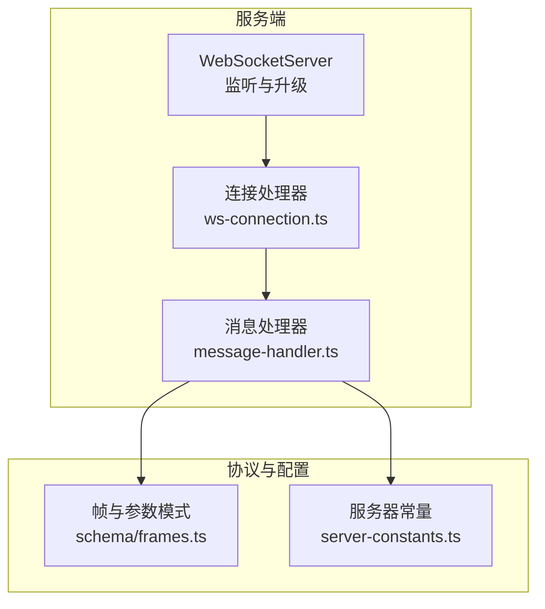
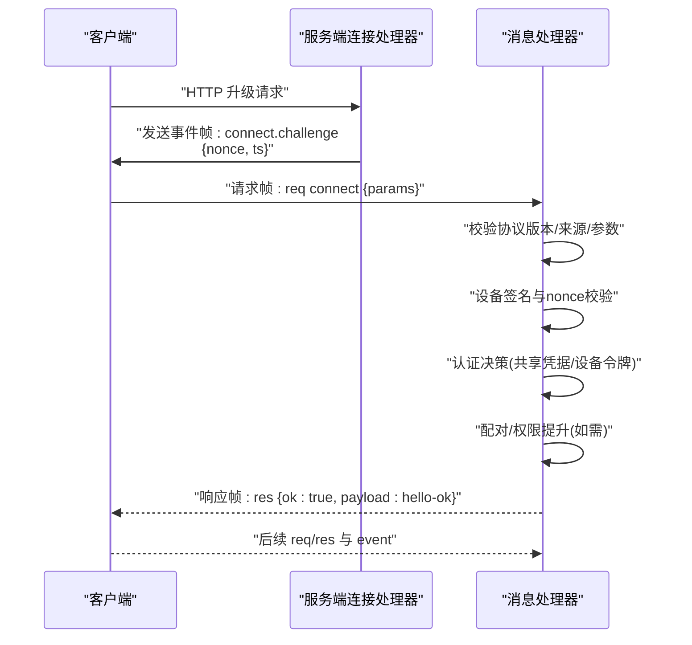
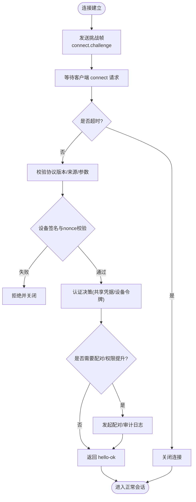
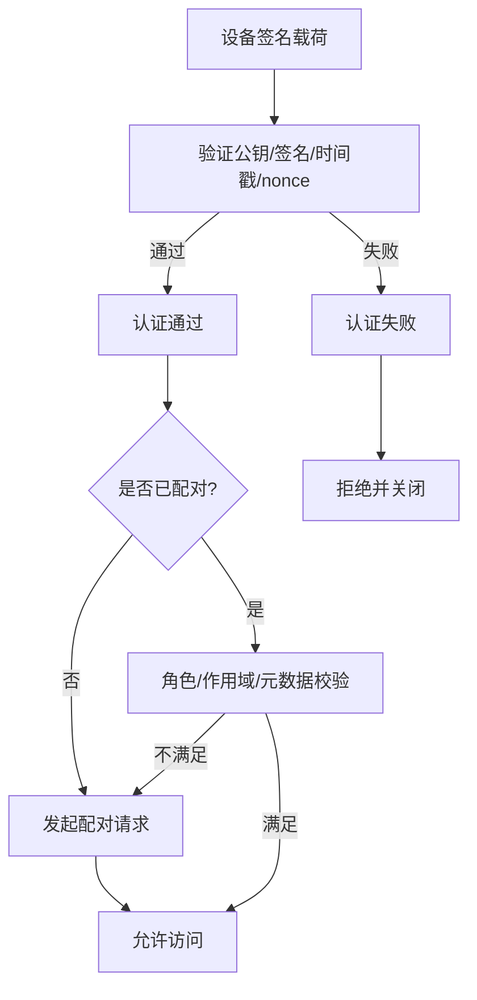
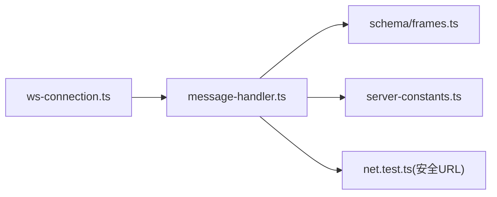

# WebSocket传输层

## 目录
1. [简介](#简介)
2. [项目结构](#项目结构)
3. [核心组件](#核心组件)
4. [架构总览](#架构总览)
5. [详细组件分析](#详细组件分析)
6. [依赖关系分析](#依赖关系分析)
7. [性能考量](#性能考量)
8. [故障排查指南](#故障排查指南)
9. [结论](#结论)
10. [附录](#附录)

## 简介
本文件系统性阐述 OpenClaw 的 WebSocket 传输层，覆盖连接建立、握手与挑战-响应、身份验证、帧格式与 JSON 载荷规范、连接超时与重连策略、错误处理与安全策略，并提供调试方法与性能优化建议。目标读者包括需要集成或维护 WebSocket 通道的开发者与运维人员。

## 项目结构
WebSocket 传输层由服务端监听器、消息处理器、协议模式与常量配置构成：
- 服务端连接入口：负责接收升级请求、发送挑战帧、启动握手计时器、转发消息到处理器
- 消息处理器：解析首包、校验协议版本、执行浏览器来源检查、进行设备与共享凭据认证、处理配对与权限提升、返回 hello-ok 帧
- 协议模式：定义帧类型（req/res/event）、连接参数、响应错误结构、hello-ok 结构等
- 常量配置：握手超时、最大负载、缓冲上限、心跳间隔等

图表来源
- [src/gateway/server/ws-connection.ts](file://src/gateway/server/ws-connection.ts#L115-L319)
- [src/gateway/server/ws-connection/message-handler.ts](file://src/gateway/server/ws-connection/message-handler.ts#L236-L316)
- [src/gateway/protocol/schema/frames.ts](file://src/gateway/protocol/schema/frames.ts#L20-L164)
- [src/gateway/server-constants.ts](file://src/gateway/server-constants.ts#L23-L37)

章节来源
- [src/gateway/server/ws-connection.ts](file://src/gateway/server/ws-connection.ts#L115-L319)
- [src/gateway/server/ws-connection/message-handler.ts](file://src/gateway/server/ws-connection/message-handler.ts#L236-L316)
- [src/gateway/protocol/schema/frames.ts](file://src/gateway/protocol/schema/frames.ts#L20-L164)
- [src/gateway/server-constants.ts](file://src/gateway/server-constants.ts#L23-L37)

## 核心组件
- 连接处理器（ws-connection.ts）
  - 发送“connect.challenge”事件帧，携带随机 nonce 与时间戳
  - 启动握手超时定时器，默认 10 秒
  - 注册消息处理回调，转发到消息处理器
  - 统一记录关闭原因、最后帧元数据与统计信息
- 消息处理器（message-handler.ts）
  - 首包必须为请求帧，method 必须为 connect，参数通过 Ajv 校验
  - 协议版本协商：min/max 必须与服务端版本兼容
  - 浏览器来源检查（Origin/Host），支持受控回退
  - 设备签名验证与 nonce 校验，确保挑战-响应一致性
  - 共享凭据（token/password）与设备令牌认证决策
  - 设备配对请求与权限提升审计（角色/范围/元数据）
  - 返回 hello-ok 帧，包含协议版本、特性列表、快照、策略与可选设备令牌
- 协议模式（schema/frames.ts）
  - RequestFrame：type=req、id、method、params
  - ResponseFrame：type=res、id、ok、payload 或 error
  - EventFrame：type=event、event、payload、seq、stateVersion
  - ConnectParams：客户端标识、版本、平台、模式、角色/作用域、设备签名、认证凭据等
  - HelloOk：协议版本、服务器信息、特性、快照、画布主机地址、策略、可选认证令牌
- 常量配置（server-constants.ts）
  - 握手超时默认 10 秒，测试环境可通过环境变量覆盖
  - 最大帧负载 25MB，每连接发送缓冲上限 50MB
  - 心跳间隔 30 秒，健康刷新间隔 60 秒

章节来源
- [src/gateway/server/ws-connection.ts](file://src/gateway/server/ws-connection.ts#L141-L179)
- [src/gateway/server/ws-connection.ts](file://src/gateway/server/ws-connection.ts#L267-L277)
- [src/gateway/server/ws-connection/message-handler.ts](file://src/gateway/server/ws-connection/message-handler.ts#L363-L434)
- [src/gateway/server/ws-connection/message-handler.ts](file://src/gateway/server/ws-connection/message-handler.ts#L462-L478)
- [src/gateway/server/ws-connection/message-handler.ts](file://src/gateway/server/ws-connection/message-handler.ts#L502-L532)
- [src/gateway/server/ws-connection/message-handler.ts](file://src/gateway/server/ws-connection/message-handler.ts#L695-L724)
- [src/gateway/server/ws-connection/message-handler.ts](file://src/gateway/server/ws-connection/message-handler.ts#L1031-L1054)
- [src/gateway/protocol/schema/frames.ts](file://src/gateway/protocol/schema/frames.ts#L125-L155)
- [src/gateway/protocol/schema/frames.ts](file://src/gateway/protocol/schema/frames.ts#L20-L69)
- [src/gateway/protocol/schema/frames.ts](file://src/gateway/protocol/schema/frames.ts#L71-L112)
- [src/gateway/server-constants.ts](file://src/gateway/server-constants.ts#L23-L37)

## 架构总览
WebSocket 传输层在服务端由“连接处理器 + 消息处理器”协作完成握手与后续请求处理；客户端在首次连接时需发送 connect 请求并响应服务端挑战，随后进入正常请求/响应与事件推送模式。

图表来源
- [src/gateway/server/ws-connection.ts](file://src/gateway/server/ws-connection.ts#L174-L179)
- [src/gateway/server/ws-connection/message-handler.ts](file://src/gateway/server/ws-connection/message-handler.ts#L394-L434)
- [src/gateway/server/ws-connection/message-handler.ts](file://src/gateway/server/ws-connection/message-handler.ts#L462-L478)
- [src/gateway/server/ws-connection/message-handler.ts](file://src/gateway/server/ws-connection/message-handler.ts#L695-L724)
- [src/gateway/server/ws-connection/message-handler.ts](file://src/gateway/server/ws-connection/message-handler.ts#L1056-L1131)

## 详细组件分析

### 连接建立与握手流程
- 服务端在收到升级请求后立即发送“connect.challenge”事件帧，包含随机 nonce 与当前时间戳
- 客户端需在握手超时前发送 connect 请求，否则服务端关闭连接
- 首包必须是合法的请求帧且 method=connect，参数通过 Ajv 校验
- 协议版本必须与服务端版本兼容，否则拒绝并关闭
- 若启用浏览器来源检查，需满足允许的 Origin/Host 规则
- 设备签名与 nonce 校验通过后，方可进入认证阶段

图表来源
- [src/gateway/server/ws-connection.ts](file://src/gateway/server/ws-connection.ts#L174-L179)
- [src/gateway/server/ws-connection.ts](file://src/gateway/server/ws-connection.ts#L267-L277)
- [src/gateway/server/ws-connection/message-handler.ts](file://src/gateway/server/ws-connection/message-handler.ts#L394-L434)
- [src/gateway/server/ws-connection/message-handler.ts](file://src/gateway/server/ws-connection/message-handler.ts#L462-L478)
- [src/gateway/server/ws-connection/message-handler.ts](file://src/gateway/server/ws-connection/message-handler.ts#L502-L532)
- [src/gateway/server/ws-connection/message-handler.ts](file://src/gateway/server/ws-connection/message-handler.ts#L695-L724)
- [src/gateway/server/ws-connection/message-handler.ts](file://src/gateway/server/ws-connection/message-handler.ts#L1056-L1131)

章节来源
- [src/gateway/server/ws-connection.ts](file://src/gateway/server/ws-connection.ts#L174-L179)
- [src/gateway/server/ws-connection.ts](file://src/gateway/server/ws-connection.ts#L267-L277)
- [src/gateway/server/ws-connection/message-handler.ts](file://src/gateway/server/ws-connection/message-handler.ts#L394-L434)
- [src/gateway/server/ws-connection/message-handler.ts](file://src/gateway/server/ws-connection/message-handler.ts#L462-L478)
- [src/gateway/server/ws-connection/message-handler.ts](file://src/gateway/server/ws-connection/message-handler.ts#L502-L532)
- [src/gateway/server/ws-connection/message-handler.ts](file://src/gateway/server/ws-connection/message-handler.ts#L695-L724)
- [src/gateway/server/ws-connection/message-handler.ts](file://src/gateway/server/ws-connection/message-handler.ts#L1056-L1131)

### 文本帧格式与 JSON 载荷规范
- 请求帧（req）
  - 字段：type="req"、id（非空字符串）、method（非空字符串）、params（可选）
  - 示例路径：[请求帧模式](file://src/gateway/protocol/schema/frames.ts#L125-L133)
- 响应帧（res）
  - 字段：type="res"、id、ok（布尔）、payload（可选）、error（可选，含 code/message/details/retryable/retryAfterMs）
  - 示例路径：[响应帧模式](file://src/gateway/protocol/schema/frames.ts#L135-L144)
- 事件帧（event）
  - 字段：type="event"、event（非空字符串）、payload（可选）、seq（可选）、stateVersion（可选）
  - 示例路径：[事件帧模式](file://src/gateway/protocol/schema/frames.ts#L146-L155)
- 连接参数（connect）
  - 字段：minProtocol、maxProtocol、client（id/displayName/version/platform/deviceFamily/modelIdentifier/mode/instanceId）、caps/commands/permissions/pathEnv/role/scopes/device/auth/locale/userAgent
  - 示例路径：[连接参数模式](file://src/gateway/protocol/schema/frames.ts#L20-L69)
- hello-ok
  - 字段：type="hello-ok"、protocol、server(version/connId)、features(methods/events)、snapshot、canvasHostUrl、auth(deviceToken/role/scopes/issuedAtMs)、policy(maxPayload/maxBufferedBytes/tickIntervalMs)
  - 示例路径：[hello-ok 模式](file://src/gateway/protocol/schema/frames.ts#L71-L112)

章节来源
- [src/gateway/protocol/schema/frames.ts](file://src/gateway/protocol/schema/frames.ts#L125-L155)
- [src/gateway/protocol/schema/frames.ts](file://src/gateway/protocol/schema/frames.ts#L20-L69)
- [src/gateway/protocol/schema/frames.ts](file://src/gateway/protocol/schema/frames.ts#L71-L112)

### 挑战-响应机制与身份验证
- 挑战-响应
  - 服务端生成随机 nonce 并随 connect.challenge 发送
  - 客户端需在 hello-ok 中使用相同 nonce，否则拒绝
  - 时间戳用于辅助校验（服务端记录 ts）
- 设备身份验证
  - 使用设备公钥派生 ID 并与设备 ID 匹配
  - 校验签名有效期（容忍一定偏差）
  - 校验签名所用载荷版本（v2/v3），并验证签名
- 共享凭据认证
  - 支持 token/password 两种共享凭据
  - 认证结果决定是否允许访问与角色/作用域绑定
- 来源与代理安全
  - 浏览器来源检查（Origin/Host），支持受控回退
  - 受信任代理检测，避免伪造 X-Forwarded-* 导致本地化误判
- 配对与权限提升
  - 未配对设备需发起配对请求，静默配对仅限特定场景
  - 角色/作用域/客户端元数据升级需审计与二次确认

图表来源
- [src/gateway/server/ws-connection.ts](file://src/gateway/server/ws-connection.ts#L174-L179)
- [src/gateway/server/ws-connection/message-handler.ts](file://src/gateway/server/ws-connection/message-handler.ts#L682-L724)
- [src/gateway/server/ws-connection/message-handler.ts](file://src/gateway/server/ws-connection/message-handler.ts#L808-L868)
- [src/gateway/server/ws-connection/message-handler.ts](file://src/gateway/server/ws-connection/message-handler.ts#L915-L951)

章节来源
- [src/gateway/server/ws-connection.ts](file://src/gateway/server/ws-connection.ts#L174-L179)
- [src/gateway/server/ws-connection/message-handler.ts](file://src/gateway/server/ws-connection/message-handler.ts#L682-L724)
- [src/gateway/server/ws-connection/message-handler.ts](file://src/gateway/server/ws-connection/message-handler.ts#L808-L868)
- [src/gateway/server/ws-connection/message-handler.ts](file://src/gateway/server/ws-connection/message-handler.ts#L915-L951)

### 连接超时、重连策略与错误处理
- 握手超时
  - 默认 10 秒，可通过测试环境变量覆盖
  - 超时后服务端标记握手失败并关闭连接
- 重连策略
  - 建议客户端在断开后指数退避重连，避免风暴
  - 重连时携带最新 connect 参数与设备令牌（若存在）
- 错误处理
  - 非法握手：返回 res 并关闭（码 1008）
  - 协议不匹配：返回 INVALID_REQUEST 并关闭（码 1002）
  - 重复未授权调用：触发洪水防护，可能关闭连接（码 1008）
  - 解析异常：记录并关闭（若尚未握手）

章节来源
- [src/gateway/server-constants.ts](file://src/gateway/server-constants.ts#L23-L32)
- [src/gateway/server/ws-connection.ts](file://src/gateway/server/ws-connection.ts#L267-L277)
- [src/gateway/server/ws-connection/message-handler.ts](file://src/gateway/server/ws-connection/message-handler.ts#L402-L433)
- [src/gateway/server/ws-connection/message-handler.ts](file://src/gateway/server/ws-connection/message-handler.ts#L464-L478)
- [src/gateway/server/ws-connection/message-handler.ts](file://src/gateway/server/ws-connection/message-handler.ts#L1156-L1182)

### 安全考虑
- 传输安全
  - 仅允许 wss:// 或本地回环 ws://；私有/公网 ws:// 默认拒绝
  - 通过 isSecureWebSocketUrl 判断，避免明文传输敏感信息
- 来源控制
  - 浏览器来源检查，支持受控 Host 头回退
  - 代理头仅在可信代理时生效，防止绕过
- 设备与令牌
  - 设备签名与时间戳校验，nonce 强制一致
  - 设备令牌轮换与审计，避免长期有效令牌滥用
- 防御措施
  - 未授权请求洪水防护，抑制日志与可能的关闭
  - 严格的 Ajv 参数校验，拒绝额外字段

章节来源
- [src/gateway/net.test.ts](file://src/gateway/net.test.ts#L408-L432)
- [src/gateway/server/ws-connection/message-handler.ts](file://src/gateway/server/ws-connection/message-handler.ts#L502-L532)
- [src/gateway/server/ws-connection/message-handler.ts](file://src/gateway/server/ws-connection/message-handler.ts#L682-L724)
- [src/gateway/server/ws-connection/message-handler.ts](file://src/gateway/server/ws-connection/message-handler.ts#L1156-L1182)

### 调试方法
- 日志与指标
  - 连接生命周期日志：open/close、connect/hello-ok、req/res、parse-error
  - 关闭原因、握手状态、最后帧元数据、来源/Host/User-Agent 等上下文
- 单元测试辅助
  - macOS 测试支持：构造 hello-ok 与请求 ID 提取工具
  - Swift 测试：构造 connect.challenge 事件帧数据
- 常见问题定位
  - 首包非法：检查 type/method/id/params 是否符合模式
  - 协议不匹配：核对 minProtocol/maxProtocol 与服务端版本
  - 设备签名失败：核对 nonce、签名、时间戳、公钥格式
  - 未授权：检查共享凭据、设备令牌、角色/作用域与配对状态

章节来源
- [apps/macos/Tests/OpenClawIPCTests/GatewayWebSocketTestSupport.swift](file://apps/macos/Tests/OpenClawIPCTests/GatewayWebSocketTestSupport.swift#L31-L71)
- [apps/shared/OpenClawKit/Tests/OpenClawKitTests/GatewayNodeSessionTests.swift](file://apps/shared/OpenClawKit/Tests/OpenClawKitTests/GatewayNodeSessionTests.swift#L95-L102)

## 依赖关系分析
- 连接处理器依赖消息处理器与协议模式
- 消息处理器依赖认证决策、配对与权限模块、来源检查、代理解析、健康快照
- 常量配置贯穿握手超时、负载限制、心跳策略

图表来源
- [src/gateway/server/ws-connection.ts](file://src/gateway/server/ws-connection.ts#L279-L316)
- [src/gateway/server/ws-connection/message-handler.ts](file://src/gateway/server/ws-connection/message-handler.ts#L236-L316)
- [src/gateway/protocol/schema/frames.ts](file://src/gateway/protocol/schema/frames.ts#L20-L164)
- [src/gateway/server-constants.ts](file://src/gateway/server-constants.ts#L23-L37)
- [src/gateway/net.test.ts](file://src/gateway/net.test.ts#L408-L432)

章节来源
- [src/gateway/server/ws-connection.ts](file://src/gateway/server/ws-connection.ts#L279-L316)
- [src/gateway/server/ws-connection/message-handler.ts](file://src/gateway/server/ws-connection/message-handler.ts#L236-L316)
- [src/gateway/protocol/schema/frames.ts](file://src/gateway/protocol/schema/frames.ts#L20-L164)
- [src/gateway/server-constants.ts](file://src/gateway/server-constants.ts#L23-L37)
- [src/gateway/net.test.ts](file://src/gateway/net.test.ts#L408-L432)

## 性能考量
- 负载与缓冲
  - 单帧最大 25MB，每连接发送缓冲上限 50MB，避免高分辨率画布快照被中断
- 心跳与健康
  - 心跳间隔 30 秒，健康刷新 60 秒，平衡实时性与资源占用
- 代理与来源检查
  - 受信任代理检测减少误判，避免不必要的本地化处理
- 审计与配对
  - 权限提升审计与静默配对策略降低交互成本，同时保障安全

章节来源
- [src/gateway/server-constants.ts](file://src/gateway/server-constants.ts#L3-L7)
- [src/gateway/server-constants.ts](file://src/gateway/server-constants.ts#L33-L37)
- [src/gateway/server/ws-connection/message-handler.ts](file://src/gateway/server/ws-connection/message-handler.ts#L811-L817)

## 故障排查指南
- 握手失败
  - 首包非法：检查 Ajv 校验错误详情
  - 协议不匹配：调整 min/maxProtocol
  - 来源不允许：配置 allowedOrigins 或 Host 回退
- 设备认证失败
  - nonce 不一致或缺失：确保 challenge 响应正确
  - 签名过期或无效：检查时间戳与签名算法
- 未授权访问
  - 共享凭据错误：核对 token/password
  - 设备令牌无效：重新签发或轮换
- 重复未授权请求
  - 观察洪水防护日志，降低请求频率
- 连接频繁断开
  - 检查握手超时设置与网络稳定性
  - 客户端采用指数退避重连策略

章节来源
- [src/gateway/server/ws-connection/message-handler.ts](file://src/gateway/server/ws-connection/message-handler.ts#L402-L433)
- [src/gateway/server/ws-connection/message-handler.ts](file://src/gateway/server/ws-connection/message-handler.ts#L464-L478)
- [src/gateway/server/ws-connection/message-handler.ts](file://src/gateway/server/ws-connection/message-handler.ts#L502-L532)
- [src/gateway/server/ws-connection/message-handler.ts](file://src/gateway/server/ws-connection/message-handler.ts#L682-L724)
- [src/gateway/server/ws-connection/message-handler.ts](file://src/gateway/server/ws-connection/message-handler.ts#L1156-L1182)
- [src/gateway/server-constants.ts](file://src/gateway/server-constants.ts#L23-L32)

## 结论
OpenClaw 的 WebSocket 传输层通过严格的握手与挑战-响应、多层认证与来源检查、细粒度的配对与权限提升，以及完善的错误处理与安全策略，构建了安全可靠的双向通信通道。配合合理的超时与缓冲配置、心跳与健康刷新机制，可在保证安全性的同时兼顾性能与可用性。建议客户端遵循本文规范，按需实现指数退避重连与审计日志上报，以获得最佳体验。

## 附录
- 安全 URL 规则（ws/wss）
  - wss:// 总是允许
  - ws:// 仅允许回环地址（127.0.0.1/localhost/[::1]），私有/公网地址默认拒绝
  - 示例路径：[安全 URL 测试用例](file://src/gateway/net.test.ts#L408-L432)

章节来源
- [src/gateway/net.test.ts](file://src/gateway/net.test.ts#L408-L432)