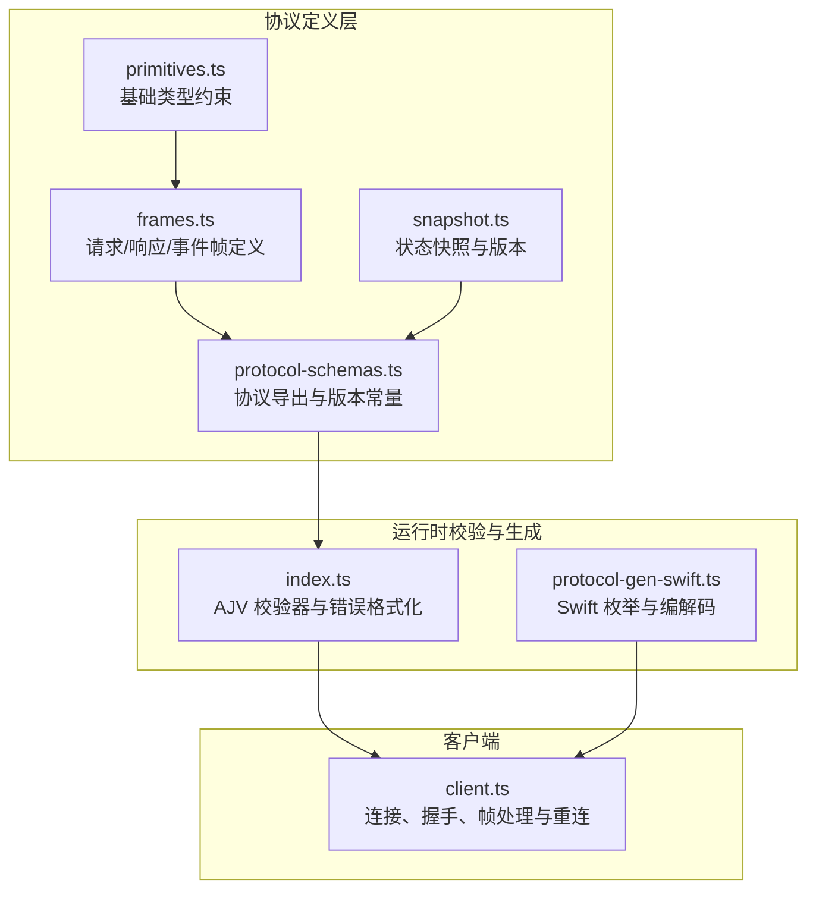
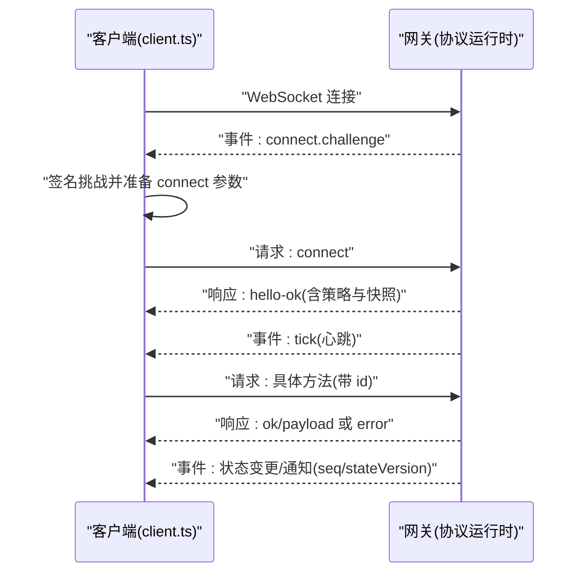
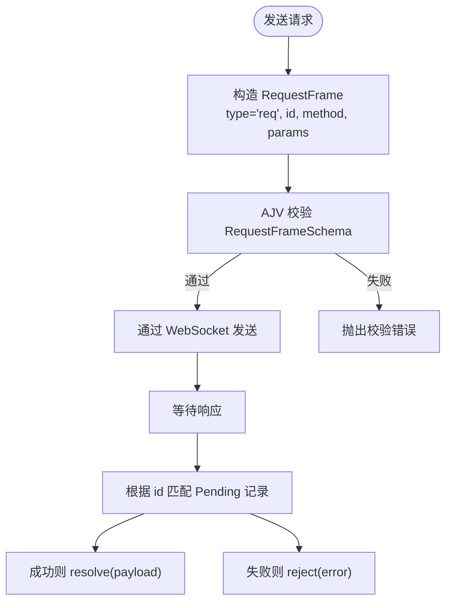
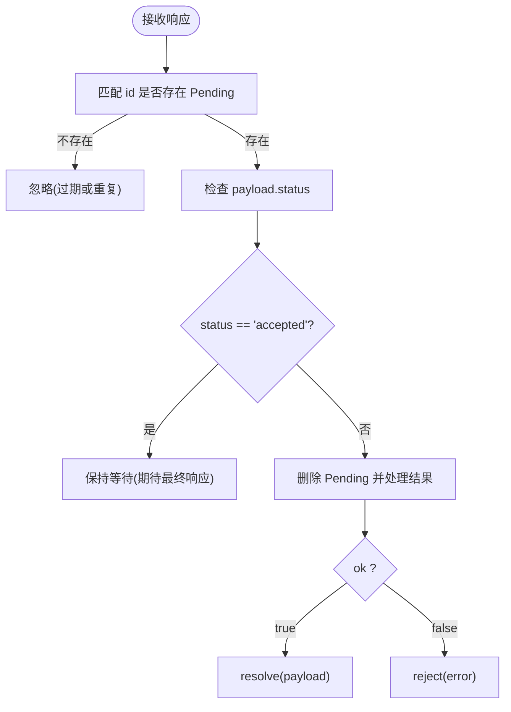
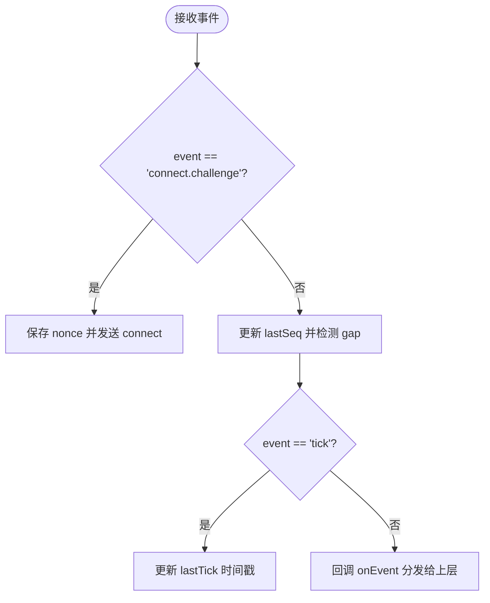
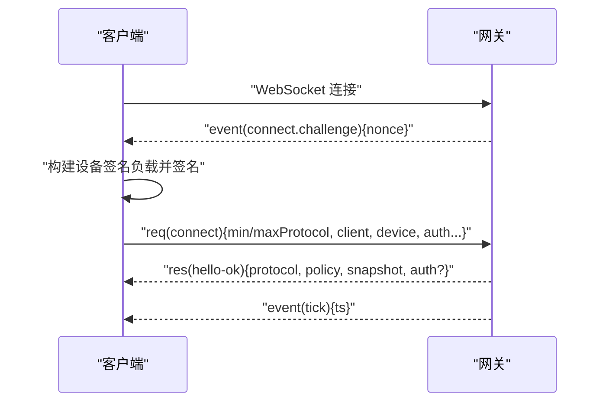
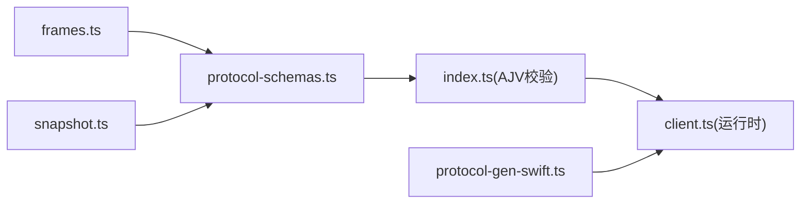

# 消息帧格式

## 目录
1. [简介](#简介)
2. [项目结构](#项目结构)
3. [核心组件](#核心组件)
4. [架构总览](#架构总览)
5. [详细组件分析](#详细组件分析)
6. [依赖关系分析](#依赖关系分析)
7. [性能考量](#性能考量)
8. [故障排查指南](#故障排查指南)
9. [结论](#结论)

## 简介
本文件系统化阐述 OpenClaw 网关的 WebSocket 协议消息帧格式，覆盖三类消息：请求(Request)、响应(Response)与事件(Event)。文档从字段定义、数据格式、使用场景出发，深入解析消息 ID 管理、幂等性键与序列号机制，并结合握手流程、错误处理与状态版本管理，给出消息路由与分发的实现要点与最佳实践。

## 项目结构
OpenClaw 的消息协议由 TypeScript 定义并通过 TypeBox Schema 驱动类型生成与校验，Swift 侧通过代码生成工具同步协议结构，客户端在运行时对帧进行解析与处理。

图表来源
- [frames.ts](file://src/gateway/protocol/schema/frames.ts#L125-L163)
- [protocol-schemas.ts](file://src/gateway/protocol/schema/protocol-schemas.ts#L162-L302)
- [snapshot.ts](file://src/gateway/protocol/schema/snapshot.ts#L38-L72)
- [primitives.ts](file://src/gateway/protocol/schema/primitives.ts#L1-L40)
- [index.ts](file://src/gateway/protocol/index.ts#L253-L458)
- [protocol-gen-swift.ts](file://scripts/protocol-gen-swift.ts#L158-L201)
- [client.ts](file://src/gateway/client.ts#L86-L531)

章节来源
- [frames.ts](file://src/gateway/protocol/schema/frames.ts#L1-L164)
- [protocol-schemas.ts](file://src/gateway/protocol/schema/protocol-schemas.ts#L1-L302)
- [index.ts](file://src/gateway/protocol/index.ts#L1-L673)
- [client.ts](file://src/gateway/client.ts#L1-L531)

## 核心组件
- 请求帧(RequestFrame)
  - 字段：type 固定为 "req"；id 唯一标识一次 RPC 调用；method 方法名；params 可选参数。
  - 使用场景：客户端向网关发起方法调用，如 connect、agent.send、sessions.list 等。
- 响应帧(ResponseFrame)
  - 字段：type 固定为 "res"；id 与请求帧 id 对应；ok 表示是否成功；payload 成功返回体；error 失败错误对象（可选）。
  - 使用场景：网关对请求的确认或错误反馈，支持“受理中”与最终结果的区分。
- 事件帧(EventFrame)
  - 字段：type 固定为 "event"；event 事件名；payload 事件载荷；seq 可选序列号；stateVersion 可选状态版本。
  - 使用场景：网关主动推送状态变化、心跳、设备挑战、系统通知等。

章节来源
- [frames.ts](file://src/gateway/protocol/schema/frames.ts#L125-L163)
- [protocol.md](file://docs/gateway/protocol.md#L127-L134)

## 架构总览
下图展示客户端与网关之间的消息交互路径，包括握手、认证、事件流与请求-响应链路。

图表来源
- [protocol.md](file://docs/gateway/protocol.md#L22-L126)
- [client.ts](file://src/gateway/client.ts#L360-L411)
- [frames.ts](file://src/gateway/protocol/schema/frames.ts#L125-L163)

## 详细组件分析

### 请求帧(RequestFrame)
- 结构与约束
  - type: "req"
  - id: 非空字符串，用于请求-响应匹配与去重
  - method: 非空字符串，方法名
  - params: 可选任意 JSON
- 幂等性与去重
  - 文档明确“副作用方法需使用幂等性键”，但未在该文件中直接给出幂等性键字段定义；通常在具体方法参数中携带幂等性键字段以确保重复提交不产生副作用。
- 使用场景
  - 发起握手(connect)、查询状态、会话管理、节点能力调用、工具与技能目录获取等。

图表来源
- [frames.ts](file://src/gateway/protocol/schema/frames.ts#L125-L133)
- [index.ts](file://src/gateway/protocol/index.ts#L259-L262)
- [client.ts](file://src/gateway/client.ts#L504-L529)

章节来源
- [frames.ts](file://src/gateway/protocol/schema/frames.ts#L125-L133)
- [protocol.md](file://docs/gateway/protocol.md#L133-L134)
- [index.ts](file://src/gateway/protocol/index.ts#L259-L262)
- [client.ts](file://src/gateway/client.ts#L504-L529)

### 响应帧(ResponseFrame)
- 结构与约束
  - type: "res"
  - id: 必须与对应请求 id 一致
  - ok: 布尔值
  - payload: 成功时返回体
  - error: 失败时错误对象，包含 code、message、details、retryable、retryAfterMs 等
- 终结语义
  - 当 payload.status 为 "accepted" 时，表示“已受理但非最终结果”，客户端需继续等待最终响应；否则视为终结响应。
- 错误处理
  - 客户端收到 error 时，将错误对象映射为 JavaScript Error 并拒绝 Promise；服务端通过 errorShape 提供统一错误结构。

图表来源
- [frames.ts](file://src/gateway/protocol/schema/frames.ts#L135-L144)
- [client.ts](file://src/gateway/client.ts#L390-L407)
- [index.ts](file://src/gateway/protocol/index.ts#L114-L123)

章节来源
- [frames.ts](file://src/gateway/protocol/schema/frames.ts#L135-L144)
- [client.ts](file://src/gateway/client.ts#L390-L407)
- [index.ts](file://src/gateway/protocol/index.ts#L114-L123)

### 事件帧(EventFrame)
- 结构与约束
  - type: "event"
  - event: 非空字符串，事件名
  - payload: 事件载荷
  - seq: 可选整数，单调递增序列号，用于检测丢包与乱序
  - stateVersion: 可选状态版本，配合快照使用
- 关键事件
  - connect.challenge：首次连接挑战，要求客户端签名并回传 nonce
  - tick：心跳事件，客户端据此维护心跳监控
- 序列号与状态版本
  - 客户端维护 lastSeq，若 seq > lastSeq + 1 则触发 gap 回调；stateVersion 与快照中的版本计数配合，用于状态一致性判断。

图表来源
- [frames.ts](file://src/gateway/protocol/schema/frames.ts#L146-L155)
- [client.ts](file://src/gateway/client.ts#L360-L389)
- [snapshot.ts](file://src/gateway/protocol/schema/snapshot.ts#L38-L44)

章节来源
- [frames.ts](file://src/gateway/protocol/schema/frames.ts#L146-L155)
- [client.ts](file://src/gateway/client.ts#L360-L389)
- [snapshot.ts](file://src/gateway/protocol/schema/snapshot.ts#L38-L44)

### 握手与连接流程
- 传输与握手
  - WebSocket 文本帧(JSON)，首个帧必须是 connect 请求
  - 网关先下发 connect.challenge，客户端签名后发送 connect 请求
  - 成功后返回 hello-ok，包含协议版本、策略与快照
- 设备身份与认证
  - 客户端在 connect.params.device 中提供设备指纹、公钥、签名与签名时间戳
  - 支持共享令牌、设备令牌与密码认证；设备令牌可在 hello-ok 中返回并持久化

图表来源
- [protocol.md](file://docs/gateway/protocol.md#L22-L126)
- [client.ts](file://src/gateway/client.ts#L235-L358)

章节来源
- [protocol.md](file://docs/gateway/protocol.md#L22-L126)
- [client.ts](file://src/gateway/client.ts#L235-L358)

### 消息 ID 管理与幂等性键
- 消息 ID
  - 客户端每次请求生成唯一 UUID 作为 id，服务端通过 id 将响应与请求关联
- 幂等性键
  - 文档明确副作用方法需使用幂等性键；该键通常作为方法参数的一部分，用于服务端去重与幂等执行
- 序列号与状态版本
  - 事件帧的 seq 用于顺序一致性检测；stateVersion 与快照版本配合，用于状态同步与一致性校验

章节来源
- [protocol.md](file://docs/gateway/protocol.md#L133-L134)
- [frames.ts](file://src/gateway/protocol/schema/frames.ts#L146-L155)
- [snapshot.ts](file://src/gateway/protocol/schema/snapshot.ts#L38-L44)
- [client.ts](file://src/gateway/client.ts#L377-L383)

### 错误处理与状态版本管理
- 错误对象
  - errorShape 包含 code、message、details、retryable、retryAfterMs 等字段，便于客户端进行差异化处理
- 校验与格式化
  - AJV 校验器对所有帧与参数进行严格校验；formatValidationErrors 提供统一的错误文本输出
- 状态版本
  - Snapshot 中的 stateVersion 含有 presence 与 health 版本计数，客户端可据此判断本地状态与服务端状态的差异

章节来源
- [frames.ts](file://src/gateway/protocol/schema/frames.ts#L114-L123)
- [index.ts](file://src/gateway/protocol/index.ts#L424-L458)
- [snapshot.ts](file://src/gateway/protocol/schema/snapshot.ts#L38-L54)

### Swift 侧协议映射与编解码
- Swift 枚举与判别字段
  - 通过代码生成工具将 type 字段映射为 Swift 的枚举分支，自动处理不同帧类型的编解码
- 兼容性处理
  - 未知 type 的帧被归类为 unknown，保留原始字典以便扩展兼容

章节来源
- [protocol-gen-swift.ts](file://scripts/protocol-gen-swift.ts#L158-L201)
- [GatewayFrameDecodeTests.swift](file://apps/macos/Tests/OpenClawIPCTests/GatewayFrameDecodeTests.swift#L1-L54)

## 依赖关系分析
- 类型与校验
  - frames.ts 定义三类帧与错误形状；protocol-schemas.ts 导出协议集合与版本常量；index.ts 生成 AJV 校验器并提供错误格式化函数
- 运行时耦合
  - client.ts 依赖协议定义与校验器，负责连接、握手、事件与响应处理、重连与心跳监控
- 平台生成
  - protocol-gen-swift.ts 生成 Swift 协议模型，保证跨语言一致性

图表来源
- [frames.ts](file://src/gateway/protocol/schema/frames.ts#L125-L163)
- [protocol-schemas.ts](file://src/gateway/protocol/schema/protocol-schemas.ts#L162-L302)
- [index.ts](file://src/gateway/protocol/index.ts#L253-L458)
- [client.ts](file://src/gateway/client.ts#L86-L531)
- [protocol-gen-swift.ts](file://scripts/protocol-gen-swift.ts#L158-L201)
- [snapshot.ts](file://src/gateway/protocol/schema/snapshot.ts#L38-L72)

章节来源
- [protocol-schemas.ts](file://src/gateway/protocol/schema/protocol-schemas.ts#L162-L302)
- [index.ts](file://src/gateway/protocol/index.ts#L253-L458)
- [client.ts](file://src/gateway/client.ts#L86-L531)

## 性能考量
- 心跳与超时
  - 客户端基于 tick 事件维护 lastTick，超过两倍 tick 间隔即关闭连接，避免静默掉线
- 负载与缓冲
  - 客户端允许较大的消息负载以支持节点截图等大响应；同时可通过策略参数控制最大缓冲字节
- 校验成本
  - AJV 校验在服务端与客户端均执行，建议在高频路径中复用校验器实例并避免重复编译

章节来源
- [client.ts](file://src/gateway/client.ts#L453-L475)
- [protocol.md](file://docs/gateway/protocol.md#L102-L109)

## 故障排查指南
- 连接失败
  - 缺少 connect.challenge 的 nonce：客户端会关闭连接并报告错误
  - TLS 指纹不匹配：在启用 wss 且配置指纹时，若证书指纹不一致将拒绝连接
- 响应异常
  - 无匹配的 Pending：可能为过期或重复请求，忽略即可
  - status 为 accepted：保持等待，直到收到最终响应
- 校验错误
  - 使用 formatValidationErrors 获取清晰的错误定位与提示，按路径修复字段
- 心跳中断
  - 若 lastTick 超过阈值，客户端将主动关闭连接，需检查网络稳定性或服务端健康状态

章节来源
- [client.ts](file://src/gateway/client.ts#L360-L411)
- [index.ts](file://src/gateway/protocol/index.ts#L424-L458)

## 结论
OpenClaw 的消息帧格式以清晰的判别字段与严格的类型约束为基础，辅以 AJV 校验与 Swift 代码生成，确保跨语言一致性与强健性。请求-响应模型与事件驱动模型并存，满足控制面与状态推送需求；通过序列号与状态版本实现有序与一致的状态管理；握手与认证流程保障了连接安全与设备身份可信。遵循本文档的字段定义、错误处理与路由分发建议，可稳定实现各类客户端与插件集成。