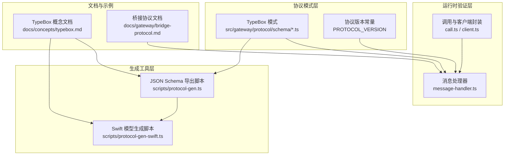
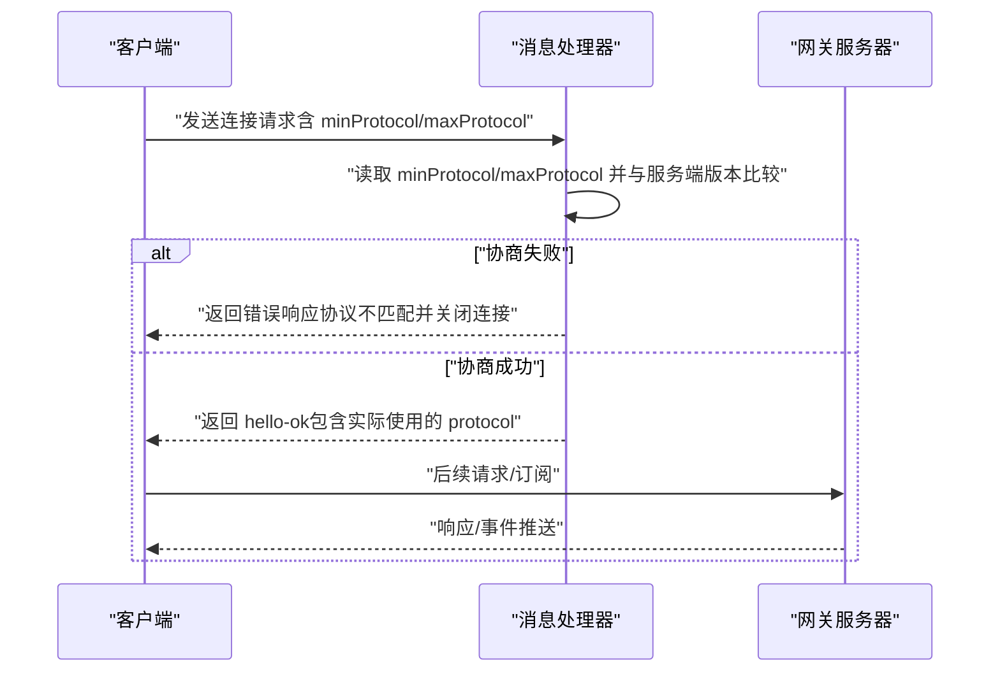
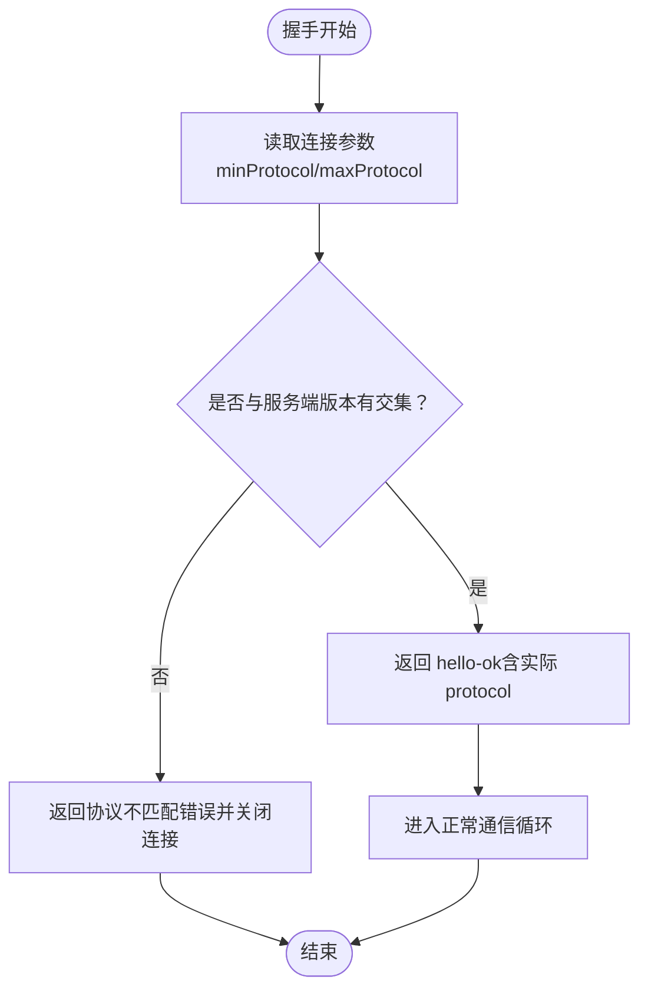
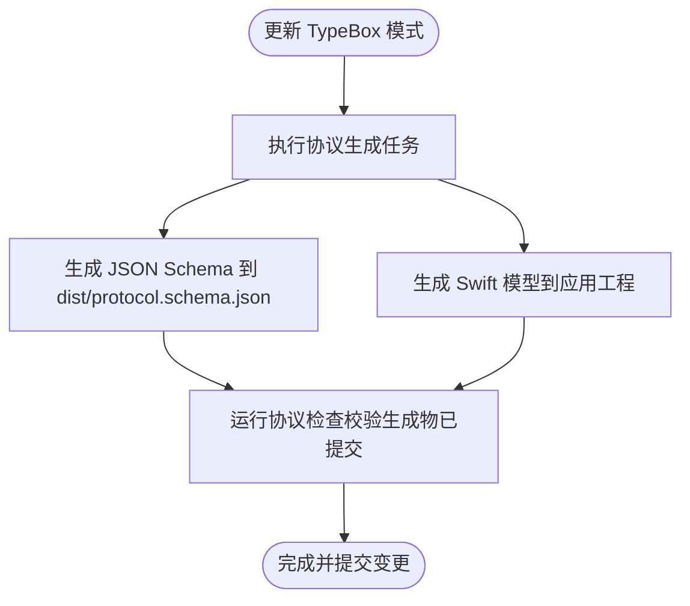
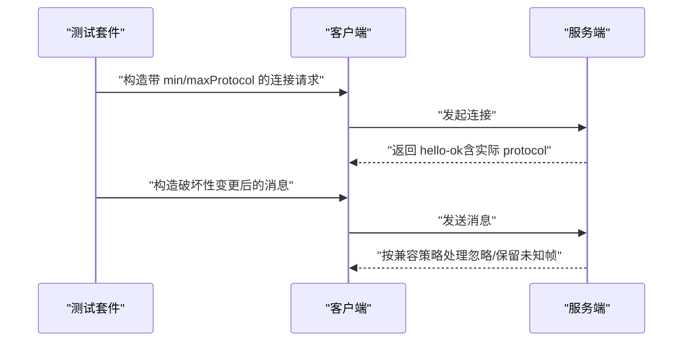
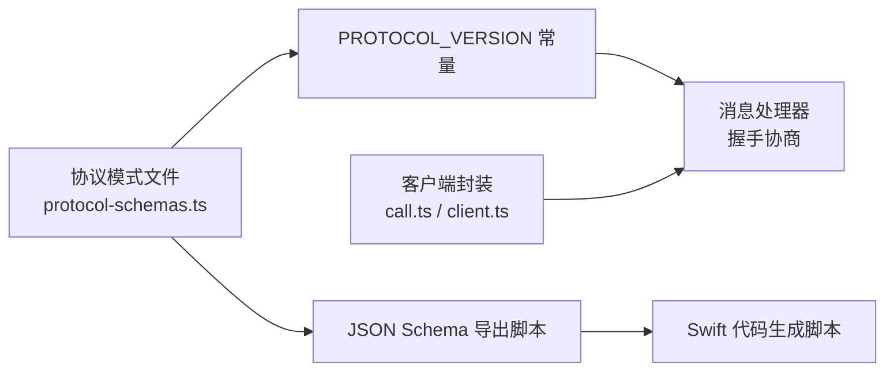

# 版本控制与兼容性

## 目录
1. [引言](#引言)
2. [项目结构](#项目结构)
3. [核心组件](#核心组件)
4. [架构总览](#架构总览)
5. [详细组件分析](#详细组件分析)
6. [依赖关系分析](#依赖关系分析)
7. [性能考量](#性能考量)
8. [故障排查指南](#故障排查指南)
9. [结论](#结论)
10. [附录](#附录)

## 引言
本文件系统化阐述 OpenClaw 的协议版本控制与兼容性机制，覆盖协议版本号管理、最小/最大协议版本协商、向后兼容策略、版本升级与回滚流程、TypeBox 模式生成、Swift 代码生成与一致性校验、版本冲突处理、客户端适配与测试策略，以及协议演进最佳实践与注意事项。目标是帮助开发者在不破坏现有客户端的前提下安全地推进协议演进。

## 项目结构
OpenClaw 将“协议即代码”的理念贯穿到类型定义、运行时验证、JSON Schema 导出与 Swift 模型生成的全链路中。核心结构如下：
- 协议模式层：TypeBox 定义的协议模式，集中于协议模式目录，统一导出当前协议版本常量。
- 运行时验证层：基于 AJV 的参数与帧验证，确保消息结构与版本约束一致。
- 生成工具层：将 TypeBox 模式导出为 JSON Schema，并生成 Swift 类型模型。
- 文档与示例：通过概念文档说明协议行为、协商流程与兼容策略；桥接协议文档记录历史版本形态。

图表来源
- [src/gateway/protocol/schema/protocol-schemas.ts](file://src/gateway/protocol/schema/protocol-schemas.ts#L301-L301)
- [src/gateway/protocol/schema/frames.ts](file://src/gateway/protocol/schema/frames.ts#L20-L69)
- [src/gateway/server/ws-connection/message-handler.ts](file://src/gateway/server/ws-connection/message-handler.ts#L462-L478)
- [scripts/protocol-gen.ts](file://scripts/protocol-gen.ts#L9-L42)
- [scripts/protocol-gen-swift.ts](file://scripts/protocol-gen-swift.ts#L84-L156)
- [docs/concepts/typebox.md](file://docs/concepts/typebox.md#L65-L73)

章节来源
- [docs/concepts/typebox.md](file://docs/concepts/typebox.md#L1-L292)
- [docs/gateway/bridge-protocol.md](file://docs/gateway/bridge-protocol.md#L88-L92)

## 核心组件
- 协议版本常量与模式导出
  - 协议版本常量由协议模式文件统一导出，作为服务端与客户端的单一事实来源。
  - 协议模式文件聚合所有方法/事件/帧的 TypeBox 定义，并导出协议版本号。
- 连接协商与拒绝逻辑
  - 服务端在握手阶段读取客户端的最小/最大协议版本，与服务端当前版本进行范围匹配，不满足则拒绝连接并返回错误。
- 生成与一致性校验
  - JSON Schema 导出脚本将 TypeBox 模式转为标准 JSON Schema，供外部工具与文档使用。
  - Swift 代码生成脚本从 JSON Schema 或 TypeBox 模式生成强类型模型，支持未知帧保留以实现向前兼容。
  - “协议检查”任务要求生成物提交，确保模式变更与生成物同步。
- 版本解析与比较
  - 提供通用的版本解析与比较函数，用于配置层面的版本比对与策略选择。

章节来源
- [src/gateway/protocol/schema/protocol-schemas.ts](file://src/gateway/protocol/schema/protocol-schemas.ts#L301-L301)
- [src/gateway/protocol/schema/frames.ts](file://src/gateway/protocol/schema/frames.ts#L20-L69)
- [src/gateway/server/ws-connection/message-handler.ts](file://src/gateway/server/ws-connection/message-handler.ts#L462-L478)
- [scripts/protocol-gen.ts](file://scripts/protocol-gen.ts#L9-L42)
- [scripts/protocol-gen-swift.ts](file://scripts/protocol-gen-swift.ts#L84-L156)
- [docs/concepts/typebox.md](file://docs/concepts/typebox.md#L287-L292)
- [src/config/version.ts](file://src/config/version.ts#L10-L49)

## 架构总览
下图展示了协议版本协商与兼容性在端到端交互中的位置与作用：

图表来源
- [src/gateway/server/ws-connection/message-handler.ts](file://src/gateway/server/ws-connection/message-handler.ts#L462-L478)
- [src/gateway/protocol/schema/frames.ts](file://src/gateway/protocol/schema/frames.ts#L20-L69)
- [src/gateway/protocol/schema/protocol-schemas.ts](file://src/gateway/protocol/schema/protocol-schemas.ts#L301-L301)

## 详细组件分析

### 组件A：协议版本号管理与最小/最大协商
- 协议版本常量
  - 服务端与客户端共享的协议版本常量，作为协商的“期望值”。
- 连接参数与帧
  - 连接参数包含最小/最大协议版本字段，用于双向协商。
  - 响应帧包含实际采用的协议版本，便于客户端记录与后续行为决策。
- 协商逻辑
  - 服务端在握手阶段对 min/max 与服务端版本进行范围匹配，若无交集则拒绝连接并返回错误。
- 兼容策略
  - 采用“未知帧保留”策略，允许新旧客户端共存，避免因新增帧导致旧客户端崩溃。

图表来源
- [src/gateway/server/ws-connection/message-handler.ts](file://src/gateway/server/ws-connection/message-handler.ts#L462-L478)
- [src/gateway/protocol/schema/frames.ts](file://src/gateway/protocol/schema/frames.ts#L20-L69)
- [src/gateway/protocol/schema/protocol-schemas.ts](file://src/gateway/protocol/schema/protocol-schemas.ts#L301-L301)

章节来源
- [src/gateway/protocol/schema/protocol-schemas.ts](file://src/gateway/protocol/schema/protocol-schemas.ts#L301-L301)
- [src/gateway/protocol/schema/frames.ts](file://src/gateway/protocol/schema/frames.ts#L20-L69)
- [src/gateway/server/ws-connection/message-handler.ts](file://src/gateway/server/ws-connection/message-handler.ts#L462-L478)

### 组件B：TypeBox 模式生成与一致性检查
- 模式来源
  - 所有协议方法、事件、帧均以 TypeBox 模式定义，统一作为“单一事实来源”。
- JSON Schema 导出
  - 导出脚本将模式聚合为根 Schema，并写入 dist 目录，供文档与工具链使用。
- Swift 代码生成
  - 生成器根据模式生成 Swift 结构体与枚举，保留未知帧以增强向前兼容。
- 一致性检查
  - “协议检查”任务会触发生成并校验生成物已提交，防止模式变更与生成物不同步。

图表来源
- [scripts/protocol-gen.ts](file://scripts/protocol-gen.ts#L9-L42)
- [scripts/protocol-gen-swift.ts](file://scripts/protocol-gen-swift.ts#L84-L156)
- [docs/concepts/typebox.md](file://docs/concepts/typebox.md#L65-L73)
- [docs/concepts/typebox.md](file://docs/concepts/typebox.md#L287-L292)

章节来源
- [scripts/protocol-gen.ts](file://scripts/protocol-gen.ts#L1-L52)
- [scripts/protocol-gen-swift.ts](file://scripts/protocol-gen-swift.ts#L36-L156)
- [docs/concepts/typebox.md](file://docs/concepts/typebox.md#L65-L73)
- [docs/concepts/typebox.md](file://docs/concepts/typebox.md#L287-L292)

### 组件C：版本升级流程与回滚机制
- 升级流程
  - 新增或修改 TypeBox 模式后，执行协议生成与检查，确保 JSON Schema 与 Swift 模型更新并提交。
  - 服务端发布新版本，客户端在连接时携带新的 min/max 协议版本。
- 回滚机制
  - 若新版本存在严重问题，可通过降低服务端默认 minProtocol 或临时放宽兼容策略的方式回滚。
  - 客户端可降级至旧版本，只要其 maxProtocol 覆盖旧版本即可继续通信。
- 风险控制
  - 对破坏性变更引入“显式版本字段”，并在文档中标注升级注意事项。

章节来源
- [docs/concepts/typebox.md](file://docs/concepts/typebox.md#L287-L292)
- [src/gateway/server/ws-connection/message-handler.ts](file://src/gateway/server/ws-connection/message-handler.ts#L462-L478)

### 组件D：客户端适配与测试策略
- 客户端适配
  - 客户端在连接时设置 minProtocol/maxProtocol，确保与服务端版本范围有交集。
  - 对于历史遗留协议（如桥接协议），采用隐式版本与向前兼容策略。
- 测试策略
  - 协议检查任务强制生成与提交，避免遗漏。
  - 针对协议版本的单元测试与集成测试覆盖协商失败与成功路径。
  - 针对特定模块（如密钥解析）的测试覆盖不同 protocolVersion 场景。

图表来源
- [src/gateway/call.ts](file://src/gateway/call.ts#L53-L54)
- [src/gateway/call.ts](file://src/gateway/call.ts#L821-L822)
- [src/gateway/client.ts](file://src/gateway/client.ts#L64-L65)
- [src/gateway/client.ts](file://src/gateway/client.ts#L303-L303)
- [src/gateway/server/ws-connection/message-handler.ts](file://src/gateway/server/ws-connection/message-handler.ts#L462-L478)

章节来源
- [src/gateway/call.ts](file://src/gateway/call.ts#L53-L54)
- [src/gateway/call.ts](file://src/gateway/call.ts#L821-L822)
- [src/gateway/client.ts](file://src/gateway/client.ts#L64-L65)
- [src/gateway/client.ts](file://src/gateway/client.ts#L303-L303)
- [src/gateway/server/ws-connection/message-handler.ts](file://src/gateway/server/ws-connection/message-handler.ts#L462-L478)
- [src/browser/extension-relay.ts](file://src/browser/extension-relay.ts#L472-L472)
- [src/secrets/plan.ts](file://src/secrets/plan.ts#L49-L49)
- [src/secrets/plan.ts](file://src/secrets/plan.ts#L112-L112)
- [src/secrets/resolve.test.ts](file://src/secrets/resolve.test.ts#L105-L105)
- [src/secrets/resolve.test.ts](file://src/secrets/resolve.test.ts#L120-L120)
- [src/secrets/resolve.test.ts](file://src/secrets/resolve.test.ts#L127-L127)
- [src/cli/secrets-cli.test.ts](file://src/cli/secrets-cli.test.ts#L107-L107)
- [src/cli/secrets-cli.test.ts](file://src/cli/secrets-cli.test.ts#L162-L162)

### 组件E：版本冲突处理与向后兼容策略
- 冲突处理
  - 当 min/max 与服务端版本无交集时，服务端拒绝连接并返回错误，避免跨版本误用。
- 向后兼容
  - 保留未知帧类型，允许新客户端接收旧协议未定义的帧而不崩溃。
  - Swift 模型保留未知帧，减少客户端升级压力。
- 历史协议兼容
  - 桥接协议采用隐式 v1，建议在引入破坏性变更前显式添加版本字段。

章节来源
- [src/gateway/server/ws-connection/message-handler.ts](file://src/gateway/server/ws-connection/message-handler.ts#L462-L478)
- [docs/concepts/typebox.md](file://docs/concepts/typebox.md#L262-L269)
- [docs/gateway/bridge-protocol.md](file://docs/gateway/bridge-protocol.md#L88-L92)

### 组件F：版本号解析与比较（配置与策略）
- 版本解析
  - 支持语义化版本字符串解析，提取主/次/补丁/修订号。
- 版本比较
  - 提供稳定的比较函数，用于配置层面的版本策略判断（例如最低支持版本、功能开关等）。

章节来源
- [src/config/version.ts](file://src/config/version.ts#L10-L49)

## 依赖关系分析
- 协议模式与运行时验证
  - 协议模式文件导出 PROTOCOL_VERSION，消息处理器在握手阶段直接使用该常量进行协商。
- 生成工具与文档
  - 导出脚本依赖协议模式文件聚合的定义；Swift 生成器依赖导出的 JSON Schema 或 TypeBox 模式。
- 客户端与服务端
  - 客户端在连接时携带 min/max 协议版本；服务端据此决定是否接受连接。

图表来源
- [src/gateway/protocol/schema/protocol-schemas.ts](file://src/gateway/protocol/schema/protocol-schemas.ts#L301-L301)
- [src/gateway/server/ws-connection/message-handler.ts](file://src/gateway/server/ws-connection/message-handler.ts#L462-L478)
- [scripts/protocol-gen.ts](file://scripts/protocol-gen.ts#L9-L42)
- [scripts/protocol-gen-swift.ts](file://scripts/protocol-gen-swift.ts#L84-L156)
- [src/gateway/call.ts](file://src/gateway/call.ts#L53-L54)
- [src/gateway/call.ts](file://src/gateway/call.ts#L821-L822)

章节来源
- [src/gateway/protocol/schema/protocol-schemas.ts](file://src/gateway/protocol/schema/protocol-schemas.ts#L301-L301)
- [src/gateway/server/ws-connection/message-handler.ts](file://src/gateway/server/ws-connection/message-handler.ts#L462-L478)
- [scripts/protocol-gen.ts](file://scripts/protocol-gen.ts#L9-L42)
- [scripts/protocol-gen-swift.ts](file://scripts/protocol-gen-swift.ts#L84-L156)
- [src/gateway/call.ts](file://src/gateway/call.ts#L53-L54)
- [src/gateway/call.ts](file://src/gateway/call.ts#L821-L822)

## 性能考量
- 协商开销
  - 握手阶段的版本协商为常数时间复杂度，对整体性能影响可忽略。
- 兼容性成本
  - 未知帧保留与 Swift 模型扩展会增加少量内存占用，但显著提升长期维护效率。
- 生成与缓存
  - JSON Schema 与 Swift 模型生成应纳入 CI 缓存策略，避免重复构建。

## 故障排查指南
- 协议不匹配
  - 现象：连接被拒绝且返回协议不匹配错误。
  - 排查：确认客户端 min/max 是否与服务端版本存在交集；必要时调整客户端版本或服务端默认策略。
- 生成物未提交
  - 现象：协议检查任务失败。
  - 排查：执行协议生成与检查任务，确保 JSON Schema 与 Swift 模型已提交。
- 历史协议异常
  - 现象：桥接协议客户端无法通信。
  - 排查：确认桥接协议隐式版本策略与兼容性设置；必要时引入显式版本字段。

章节来源
- [src/gateway/server/ws-connection/message-handler.ts](file://src/gateway/server/ws-connection/message-handler.ts#L462-L478)
- [docs/concepts/typebox.md](file://docs/concepts/typebox.md#L287-L292)
- [docs/gateway/bridge-protocol.md](file://docs/gateway/bridge-protocol.md#L88-L92)

## 结论
OpenClaw 通过“协议即代码”的方式，将协议版本管理、运行时验证、生成工具与文档统一起来，形成闭环的版本控制与兼容性保障体系。最小/最大协议版本协商确保了跨版本互操作的安全边界；TypeBox 模式与生成工具保证了多语言实现的一致性；向前兼容策略与历史协议处理降低了升级风险。遵循本文档的流程与最佳实践，可在保证稳定性的同时持续演进协议能力。

## 附录
- 协议演进最佳实践
  - 破坏性变更必须引入显式版本字段并在文档中标注升级步骤。
  - 任何破坏性变更前，先提供过渡期的双版本支持与兼容策略。
  - 在 CI 中强制执行“协议检查”，确保模式变更与生成物同步。
- 注意事项
  - 避免在未声明破坏性的情况下修改已有字段的语义。
  - 对客户端进行充分的回归测试，特别是针对未知帧与兼容性场景。
  - 记录每次版本升级的影响面与回滚预案。