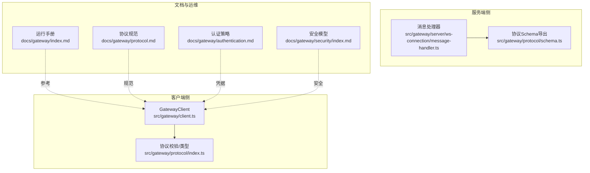
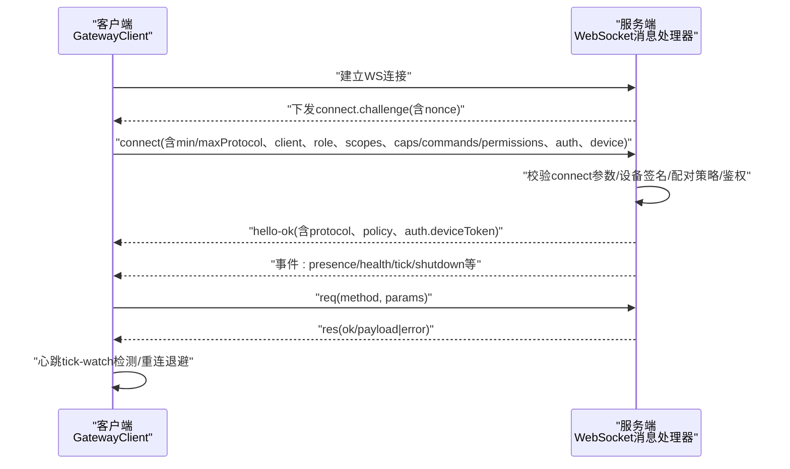
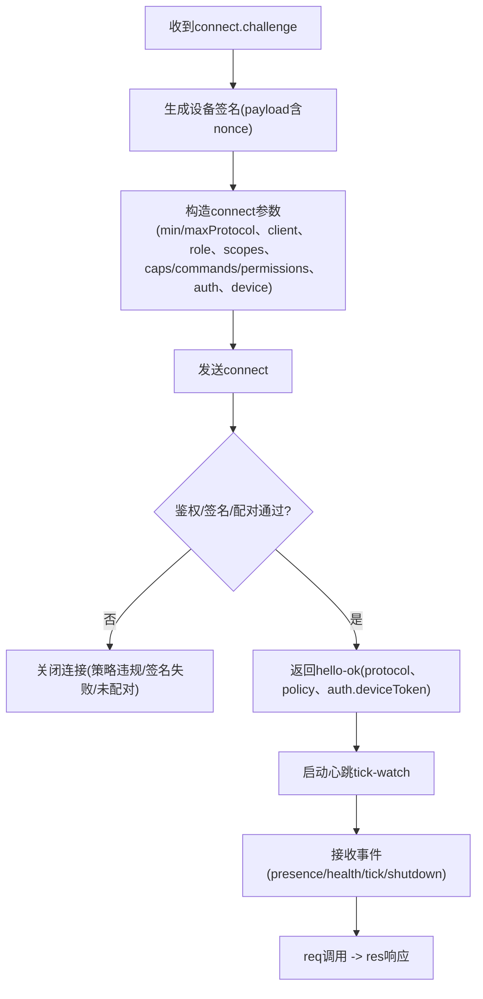
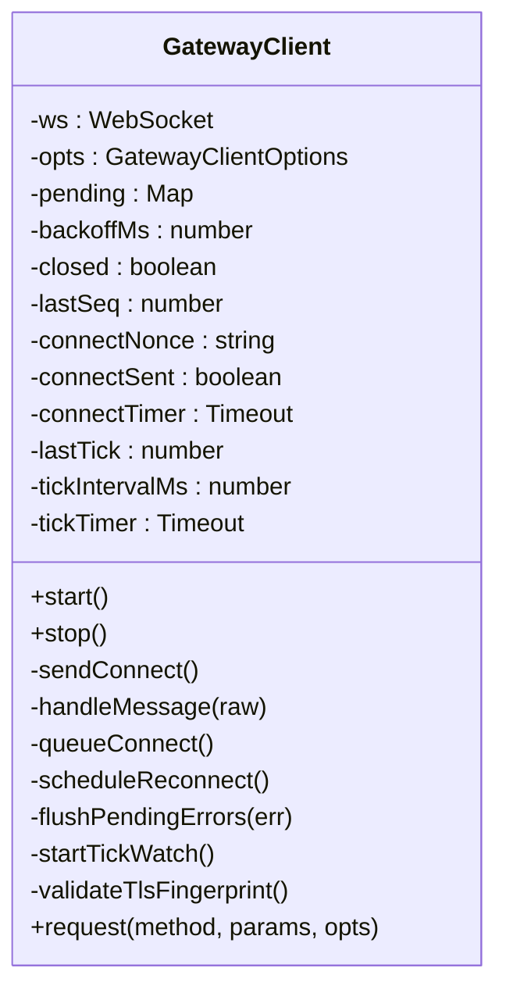
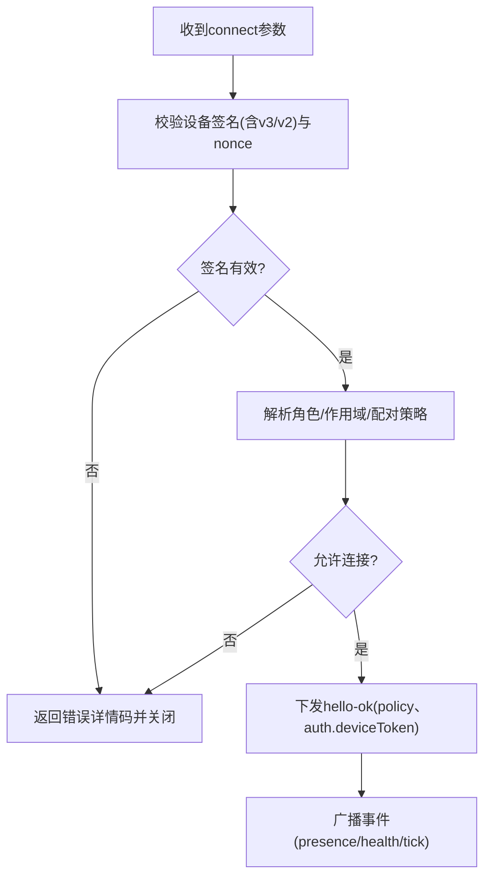
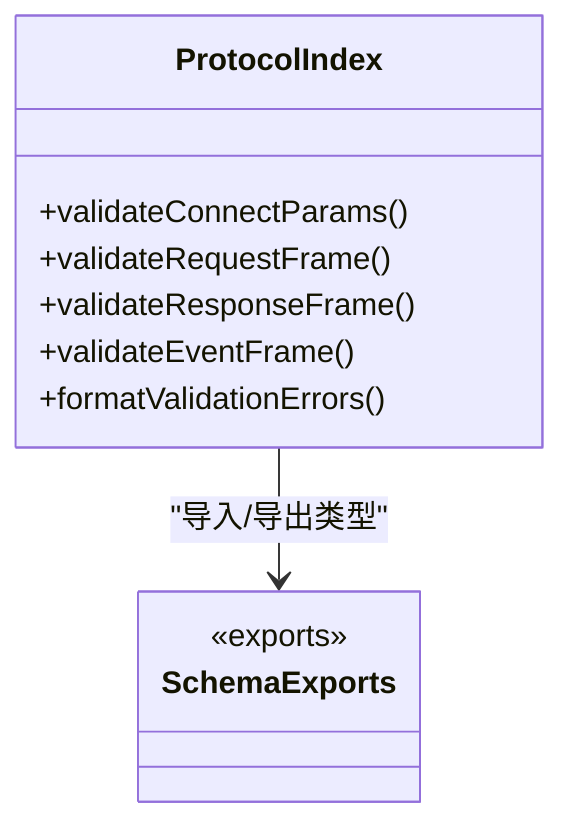
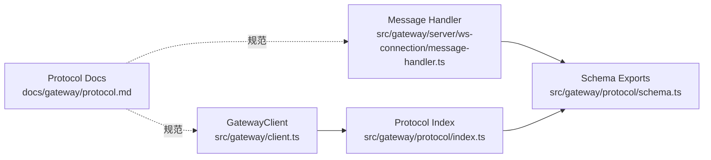

# 网关协议和通信

## 目录
1. [简介](#简介)
2. [项目结构](#项目结构)
3. [核心组件](#核心组件)
4. [架构总览](#架构总览)
5. [详细组件分析](#详细组件分析)
6. [依赖关系分析](#依赖关系分析)
7. [性能考量](#性能考量)
8. [故障排查指南](#故障排查指南)
9. [结论](#结论)
10. [附录](#附录)

## 简介
本文件系统化阐述 OpenClaw 的网关协议与通信机制，覆盖 WebSocket 控制平面协议设计、握手与认证、帧格式、事件类型、会话状态管理、工具调用与事件分发、安全与鉴权、消息路由与负载均衡等主题。文档同时提供协议规范要点、客户端实现指引与调试工具使用建议，并说明网关与各组件（通道、节点、工具、模型）的集成与通信模式。

## 项目结构
围绕网关协议与通信的关键目录与文件：
- 协议与客户端
  - 客户端实现：src/gateway/client.ts
  - 协议校验与类型：src/gateway/protocol/index.ts、src/gateway/protocol/schema.ts
- 服务端接入与处理
  - WebSocket 连接与握手处理：src/gateway/server/ws-connection/message-handler.ts
- 文档与运行指南
  - 网关运行手册：docs/gateway/index.md
  - 协议规范：docs/gateway/protocol.md
  - 认证与凭据：docs/gateway/authentication.md
  - 安全与风险模型：docs/gateway/security/index.md
- 平台测试参考
  - Swift 客户端测试用例：apps/shared/OpenClawKit/Tests/OpenClawKitTests/GatewayNodeSessionTests.swift

图表来源
- [src/gateway/client.ts](file://src/gateway/client.ts#L1-L531)
- [src/gateway/protocol/index.ts](file://src/gateway/protocol/index.ts#L1-L673)
- [src/gateway/protocol/schema.ts](file://src/gateway/protocol/schema.ts#L1-L19)
- [src/gateway/server/ws-connection/message-handler.ts](file://src/gateway/server/ws-connection/message-handler.ts#L1-L200)
- [docs/gateway/index.md](file://docs/gateway/index.md#L1-L262)
- [docs/gateway/protocol.md](file://docs/gateway/protocol.md#L1-L261)
- [docs/gateway/authentication.md](file://docs/gateway/authentication.md#L1-L180)
- [docs/gateway/security/index.md](file://docs/gateway/security/index.md#L1-L800)

章节来源
- [docs/gateway/index.md](file://docs/gateway/index.md#L1-L262)
- [docs/gateway/protocol.md](file://docs/gateway/protocol.md#L1-L261)
- [docs/gateway/authentication.md](file://docs/gateway/authentication.md#L1-L180)
- [docs/gateway/security/index.md](file://docs/gateway/security/index.md#L1-L800)
- [src/gateway/client.ts](file://src/gateway/client.ts#L1-L531)
- [src/gateway/protocol/index.ts](file://src/gateway/protocol/index.ts#L1-L673)
- [src/gateway/protocol/schema.ts](file://src/gateway/protocol/schema.ts#L1-L19)
- [src/gateway/server/ws-connection/message-handler.ts](file://src/gateway/server/ws-connection/message-handler.ts#L1-L200)

## 核心组件
- 网关客户端（GatewayClient）
  - 负责建立 WebSocket 连接、发送 connect 握手、处理事件帧、请求/响应编排、重连退避、心跳检测、TLS 指纹校验、设备身份签名与持久化等。
  - 关键能力：握手挑战、设备签名、序列号跟踪、gap 检测、心跳超时、错误回调与关闭码描述。
- 协议层（协议校验与类型）
  - 基于 Ajv 的严格校验器，定义并验证 connect、req/res、event 等帧格式；导出所有方法参数/返回类型与错误码。
- 服务端消息处理器（WebSocket）
  - 处理握手挑战下发、设备签名验证、角色/作用域解析、配对策略、鉴权决策、事件广播、健康快照与策略下发等。
- 文档与策略
  - 运行手册、协议规范、认证与凭据、安全模型，为客户端实现与运维提供权威依据。

章节来源
- [src/gateway/client.ts](file://src/gateway/client.ts#L86-L531)
- [src/gateway/protocol/index.ts](file://src/gateway/protocol/index.ts#L253-L458)
- [src/gateway/server/ws-connection/message-handler.ts](file://src/gateway/server/ws-connection/message-handler.ts#L1-L200)
- [docs/gateway/protocol.md](file://docs/gateway/protocol.md#L1-L261)
- [docs/gateway/authentication.md](file://docs/gateway/authentication.md#L1-L180)
- [docs/gateway/security/index.md](file://docs/gateway/security/index.md#L1-L800)

## 架构总览
下图展示从客户端到服务端的典型交互路径：握手挑战、设备签名、鉴权与策略下发、事件与心跳、请求/响应与工具调用。

图表来源
- [src/gateway/client.ts](file://src/gateway/client.ts#L108-L358)
- [src/gateway/server/ws-connection/message-handler.ts](file://src/gateway/server/ws-connection/message-handler.ts#L269-L303)
- [docs/gateway/protocol.md](file://docs/gateway/protocol.md#L22-L90)

章节来源
- [src/gateway/client.ts](file://src/gateway/client.ts#L108-L358)
- [src/gateway/server/ws-connection/message-handler.ts](file://src/gateway/server/ws-connection/message-handler.ts#L1-L200)
- [docs/gateway/protocol.md](file://docs/gateway/protocol.md#L22-L90)

## 详细组件分析

### WebSocket 网关协议设计与实现
- 传输与帧格式
  - 文本帧 JSON，首帧必须是 connect 请求；后续支持 req/res 与 event 事件帧。
- 握手流程
  - 服务端先下发 connect.challenge（含 nonce），客户端收到后完成设备签名与 connect 参数组装，再发起 connect。
  - 服务端校验设备签名、角色/作用域、配对策略与鉴权，通过后返回 hello-ok，其中包含协议版本与策略（如 tickIntervalMs）。
- 事件与状态
  - 服务端周期性下发 tick 事件用于心跳检测；presence/health/snapshot 等状态随 hello-ok 返回或事件推送。
- 请求/响应
  - 客户端以 req(method, params) 发起调用，服务端以 res(id, ok/payload|error) 回应；部分方法支持“最终完成”语义，需等待 status 从 accepted 到 ok/error。

图表来源
- [src/gateway/client.ts](file://src/gateway/client.ts#L235-L358)
- [src/gateway/server/ws-connection/message-handler.ts](file://src/gateway/server/ws-connection/message-handler.ts#L165-L200)
- [docs/gateway/protocol.md](file://docs/gateway/protocol.md#L22-L90)

章节来源
- [docs/gateway/protocol.md](file://docs/gateway/protocol.md#L127-L134)
- [src/gateway/client.ts](file://src/gateway/client.ts#L360-L411)
- [src/gateway/server/ws-connection/message-handler.ts](file://src/gateway/server/ws-connection/message-handler.ts#L1-L200)

### 客户端实现要点（GatewayClient）
- 连接与安全
  - 仅允许 wss:// 或受信任私有网络（通过环境变量开关）的 ws://；支持 TLS 指纹校验，防止中间人攻击。
  - 设备身份与签名：基于设备公钥对 v3/v2 签名负载进行校验，确保 connect.challenge 的 nonce 一致性。
- 握手与认证
  - 支持共享令牌/密码与设备令牌两种认证路径；设备令牌成功后持久化，后续可自动复用。
  - 若无显式共享凭据，优先使用已存储的设备令牌；否则回退到共享凭据。
- 帧处理与状态
  - 解析 event 帧，记录事件序列号 seq，检测 gap 并触发 onGap 回调；收到 tick 事件更新 lastTick。
  - 对 res 帧按 id 匹配 pending 请求，区分“接受”与“最终完成”，避免过早 resolve。
- 心跳与重连
  - 启动 tick-watch 定时器，若 gap 超过阈值则主动关闭；断线后指数退避重连，最大上限控制。
- 错误与关闭码
  - 提供关闭码描述映射，便于诊断异常关闭原因（如策略违规、服务重启、异常断开）。

图表来源
- [src/gateway/client.ts](file://src/gateway/client.ts#L86-L531)

章节来源
- [src/gateway/client.ts](file://src/gateway/client.ts#L108-L531)

### 服务端握手与鉴权（WebSocket）
- 设备签名与身份
  - 服务端根据设备公钥与签名负载（v3/v2）校验 connect.challenge 的 nonce 与时间戳偏差；不匹配则返回错误详情码。
- 鉴权与配对策略
  - 解析角色/作用域，结合本地/代理/受信代理策略决定是否允许连接；本地直连（loopback/tailnet）可自动批准新设备。
- 策略与快照
  - 成功握手后下发 hello-ok，包含协议版本、策略（如 tickIntervalMs）、可选设备令牌；同时构建健康快照与状态版本。
- 事件与广播
  - 周期性下发 tick；在关键事件（如 shutdown）前广播通知。

图表来源
- [src/gateway/server/ws-connection/message-handler.ts](file://src/gateway/server/ws-connection/message-handler.ts#L165-L200)
- [docs/gateway/protocol.md](file://docs/gateway/protocol.md#L200-L223)

章节来源
- [src/gateway/server/ws-connection/message-handler.ts](file://src/gateway/server/ws-connection/message-handler.ts#L1-L200)
- [docs/gateway/protocol.md](file://docs/gateway/protocol.md#L200-L223)

### 协议校验与类型系统
- 类型与校验
  - 使用 Ajv 编译各类参数/帧的校验器，统一 formatValidationErrors 输出，保证客户端与服务端一致的契约。
- Schema 导出
  - schema.ts 统一导出所有协议相关类型与错误码，供客户端和服务端共享。

图表来源
- [src/gateway/protocol/index.ts](file://src/gateway/protocol/index.ts#L253-L458)
- [src/gateway/protocol/schema.ts](file://src/gateway/protocol/schema.ts#L1-L19)

章节来源
- [src/gateway/protocol/index.ts](file://src/gateway/protocol/index.ts#L253-L458)
- [src/gateway/protocol/schema.ts](file://src/gateway/protocol/schema.ts#L1-L19)

### 会话状态管理与事件分发
- 序列号与 gap 检测
  - 客户端维护 lastSeq，当事件 seq 出现 gap 时触发 onGap 回调，提示刷新健康/系统存在状态。
- 心跳与静默检测
  - 服务端周期性下发 tick；客户端记录 lastTick，若超过两倍 tick 间隔未收到，主动关闭，防止静默 stall。
- 事件类型
  - 常见事件：connect.challenge、agent、chat、presence、tick、health、heartbeat、shutdown 等。

章节来源
- [src/gateway/client.ts](file://src/gateway/client.ts#L377-L387)
- [src/gateway/client.ts](file://src/gateway/client.ts#L453-L475)
- [docs/gateway/index.md](file://docs/gateway/index.md#L207-L214)

### 工具调用与事件分发机制
- 方法调用
  - 客户端以 req(method, params) 调用，服务端以 res(id, ok/payload|error) 回应；部分方法（如 agent.run）采用“接受-最终完成”的两阶段模式。
- 事件分发
  - 服务端在执行过程中或状态变化时广播事件（如 agent、chat、presence、health），客户端按事件类型更新 UI 或内部状态。

章节来源
- [docs/gateway/index.md](file://docs/gateway/index.md#L209-L214)
- [src/gateway/client.ts](file://src/gateway/client.ts#L390-L407)

### 协议安全性、认证与设备身份
- 认证方式
  - 支持共享令牌/密码与设备令牌；设备令牌可在 hello-ok 中返回并持久化，后续自动复用。
- 设备身份与签名
  - 客户端在 connect.challenge 下发后，使用设备私钥对 v3/v2 签名负载进行签名，服务端校验签名与时间戳偏差。
- 安全边界
  - 默认要求鉴权；非 loopback 绑定需配合强口令/令牌；支持受信代理透传身份；mDNS 广播可配置最小化以降低信息泄露风险。

章节来源
- [docs/gateway/authentication.md](file://docs/gateway/authentication.md#L1-L180)
- [docs/gateway/protocol.md](file://docs/gateway/protocol.md#L200-L223)
- [docs/gateway/security/index.md](file://docs/gateway/security/index.md#L728-L775)

### 客户端实现指南与调试工具
- 客户端实现要点
  - 首帧必须是 connect；正确处理 connect.challenge 与设备签名；保存并复用设备令牌；实现心跳与 gap 检测；合理处理重连与错误码。
- 调试与诊断
  - 运行手册提供健康检查命令与日志跟踪；协议文档给出常见失败签名与迁移诊断；安全文档提供审计清单与加固基线。

章节来源
- [docs/gateway/index.md](file://docs/gateway/index.md#L216-L244)
- [docs/gateway/protocol.md](file://docs/gateway/protocol.md#L224-L249)
- [docs/gateway/security/index.md](file://docs/gateway/security/index.md#L26-L37)

### 与其他组件的集成与通信模式
- 通道（Channels）
  - 通过网关协议与各渠道（WhatsApp、Telegram、Discord 等）对接，受控于配置中的 DM/群组策略与提及门控。
- 节点（Nodes）
  - 节点作为能力宿主，声明 caps/commands/permissions，经服务端策略校验后授权远程调用。
- 工具与模型
  - 工具目录与模型选择通过配置与协议方法暴露，工具调用受工具策略与沙箱限制约束。

章节来源
- [docs/gateway/protocol.md](file://docs/gateway/protocol.md#L156-L184)
- [docs/gateway/configuration.md](file://docs/gateway/configuration.md#L74-L347)

## 依赖关系分析
- 客户端依赖
  - 依赖协议校验模块进行帧格式与参数校验；依赖设备身份与配对模块进行设备签名与令牌持久化。
- 服务端依赖
  - 依赖协议校验模块进行入站帧校验；依赖设备身份与配对模块进行签名验证与配对策略；依赖健康状态模块生成快照与版本。
- 文档与实现耦合
  - 协议规范与客户端实现保持一致，错误码与迁移诊断在文档中明确，便于客户端兼容升级。

图表来源
- [src/gateway/client.ts](file://src/gateway/client.ts#L1-L531)
- [src/gateway/protocol/index.ts](file://src/gateway/protocol/index.ts#L1-L673)
- [src/gateway/protocol/schema.ts](file://src/gateway/protocol/schema.ts#L1-L19)
- [src/gateway/server/ws-connection/message-handler.ts](file://src/gateway/server/ws-connection/message-handler.ts#L1-L200)
- [docs/gateway/protocol.md](file://docs/gateway/protocol.md#L1-L261)

章节来源
- [src/gateway/client.ts](file://src/gateway/client.ts#L1-L531)
- [src/gateway/protocol/index.ts](file://src/gateway/protocol/index.ts#L1-L673)
- [src/gateway/protocol/schema.ts](file://src/gateway/protocol/schema.ts#L1-L19)
- [src/gateway/server/ws-connection/message-handler.ts](file://src/gateway/server/ws-connection/message-handler.ts#L1-L200)
- [docs/gateway/protocol.md](file://docs/gateway/protocol.md#L1-L261)

## 性能考量
- 心跳与静默检测
  - 通过 tickIntervalMs 控制心跳频率，客户端在 gap 超阈值时主动关闭，避免资源占用与数据陈旧。
- 负载与缓冲
  - 客户端默认放宽 WebSocket 负载上限以支持节点大响应；服务端对事件与快照进行版本化管理，减少重复传输。
- 重连退避
  - 断线后指数退避，上限控制，避免雪崩效应。

章节来源
- [src/gateway/client.ts](file://src/gateway/client.ts#L96-L99)
- [src/gateway/client.ts](file://src/gateway/client.ts#L453-L475)
- [src/gateway/client.ts](file://src/gateway/client.ts#L144-L146)

## 故障排查指南
- 常见失败签名与修复
  - 设备签名相关错误（nonce 缺失/不匹配、签名无效/过期、公钥无效、设备ID不匹配）均有稳定错误码与原因，便于定位迁移问题。
- 运行手册与审计
  - 提供健康检查命令、日志跟踪、端口与绑定优先级、多实例隔离清单与安全审计清单。
- 安全审计
  - 包含网络暴露、工具策略、浏览器控制面、权限与插件等维度的检查项与修复建议。

章节来源
- [docs/gateway/protocol.md](file://docs/gateway/protocol.md#L224-L249)
- [docs/gateway/index.md](file://docs/gateway/index.md#L235-L244)
- [docs/gateway/security/index.md](file://docs/gateway/security/index.md#L183-L261)

## 结论
OpenClaw 的网关协议以 WebSocket 为核心，通过严格的握手、设备签名与鉴权机制保障安全；以 req/res 与事件驱动实现控制平面与节点传输一体化；配合心跳与 gap 检测、重连退避与 TLS 指纹校验，形成稳健的实时交互基础。协议规范、认证策略与安全模型共同构成可操作的实现与运维指南，适用于个人助理与团队协作场景的安全基线。

## 附录
- 协议快速参考（操作者视角）
  - 首帧必须是 connect；hello-ok 返回快照与策略；请求为 req(method, params) → res(ok/payload|error)；常见事件包括 connect.challenge、agent、chat、presence、tick、health、heartbeat、shutdown。
- 平台测试参考
  - Swift 客户端测试用例展示了 hello-ok 与 connect 流程的数据结构示例，可用于验证协议实现的一致性。

章节来源
- [docs/gateway/index.md](file://docs/gateway/index.md#L202-L214)
- [apps/shared/OpenClawKit/Tests/OpenClawKitTests/GatewayNodeSessionTests.swift](file://apps/shared/OpenClawKit/Tests/OpenClawKitTests/GatewayNodeSessionTests.swift#L104-L138)