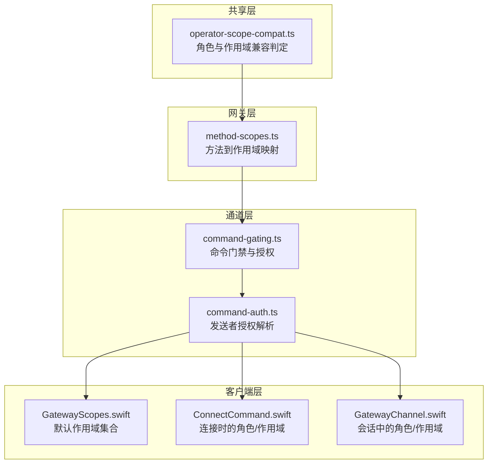
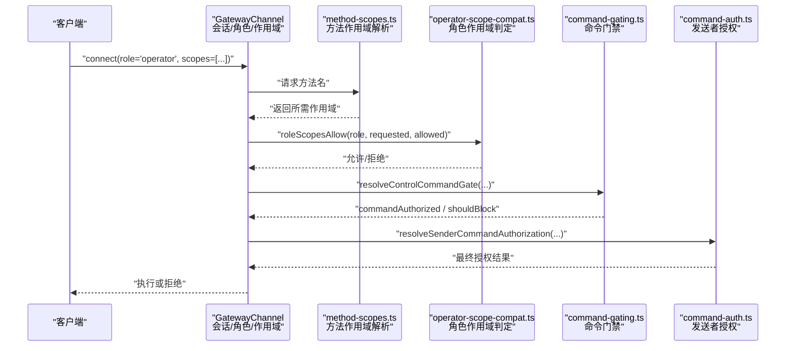
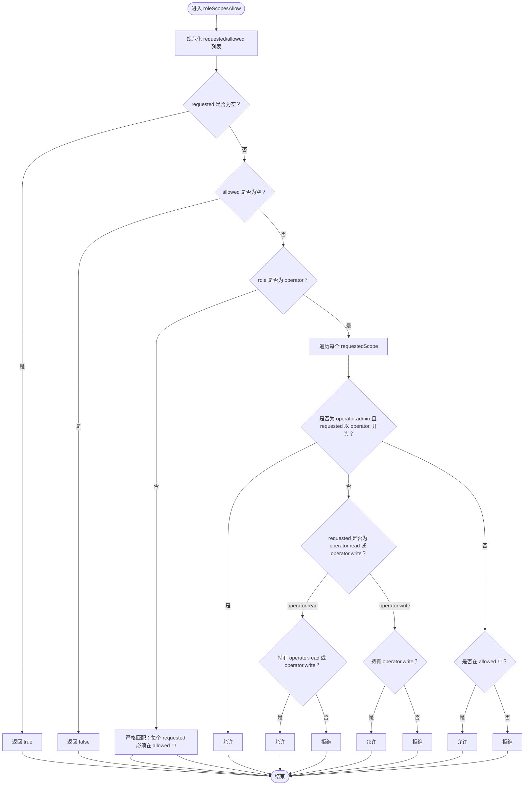
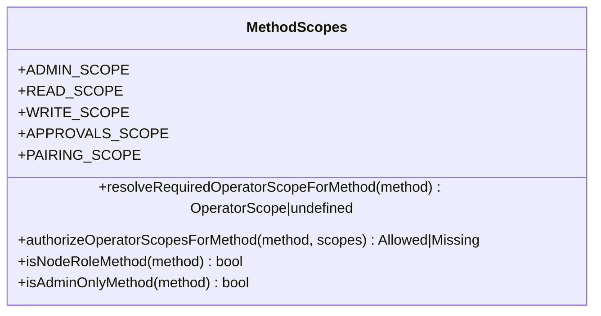
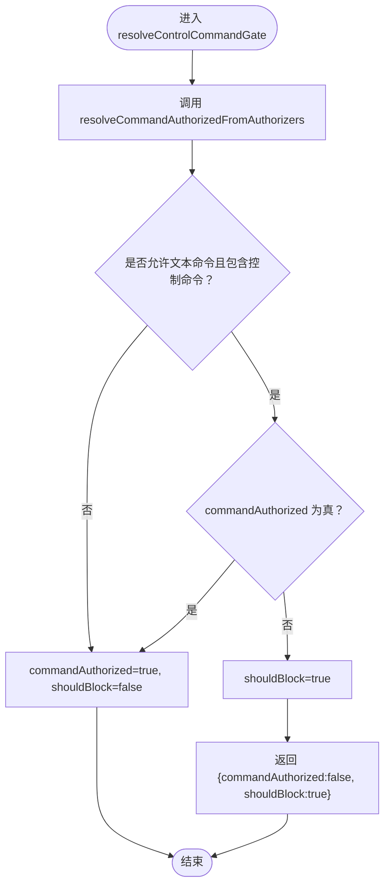
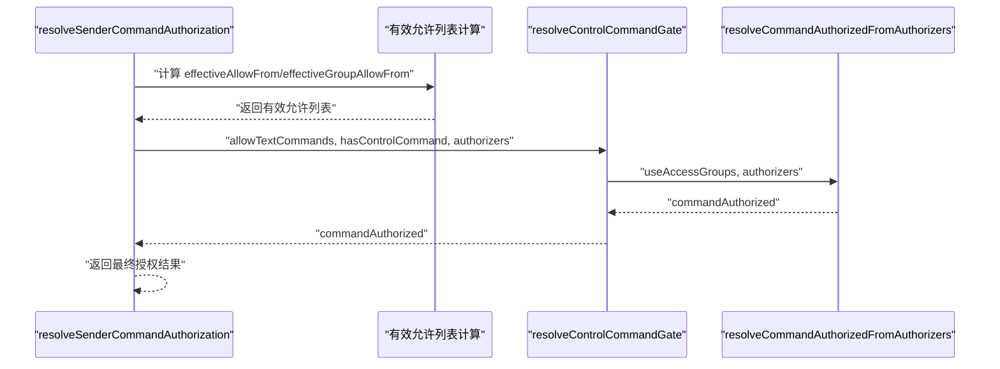
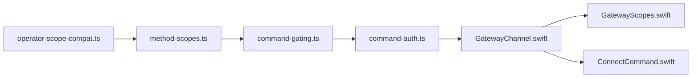

# 角色与作用域

## 目录
1. [简介](#简介)
2. [项目结构](#项目结构)
3. [核心组件](#核心组件)
4. [架构总览](#架构总览)
5. [详细组件分析](#详细组件分析)
6. [依赖关系分析](#依赖关系分析)
7. [性能考量](#性能考量)
8. [故障排查指南](#故障排查指南)
9. [结论](#结论)

## 简介
本篇文档围绕 OpenClaw 的“角色与作用域”体系，系统阐述两类角色：操作员（operator）与节点（node），以及与之配套的作用域（scopes）授权模型。重点覆盖以下方面：
- 操作员与节点的角色定义与权限边界
- 作用域 operators.read、operators.write、operators.admin、operators.approvals、operators.pairing 的权限语义与使用场景
- 能力声明（caps）、命令白名单（commands）与权限开关（permissions）的管理机制
- 角色切换、权限继承与动态授权在客户端与网关侧的实现细节

## 项目结构
OpenClaw 将“角色与作用域”的核心逻辑分布在多个层次：
- 共享层：统一的角色与作用域判定与兼容逻辑
- 网关层：方法级作用域映射、最小权限计算与授权判定
- 通道层：基于访问组与白名单的命令门禁与授权决策
- 客户端层：默认作用域集合、连接参数中的角色与作用域传递

图表来源
- [operator-scope-compat.ts](file://src/shared/operator-scope-compat.ts#L1-L50)
- [method-scopes.ts](file://src/gateway/method-scopes.ts#L1-L217)
- [command-gating.ts](file://src/channels/command-gating.ts#L1-L46)
- [command-auth.ts](file://src/plugin-sdk/command-auth.ts#L1-L115)
- [GatewayScopes.swift](file://apps/macos/Sources/OpenClawMacCLI/GatewayScopes.swift#L1-L7)
- [ConnectCommand.swift](file://apps/macos/Sources/OpenClawMacCLI/ConnectCommand.swift#L1-L120)
- [GatewayChannel.swift](file://apps/shared/OpenClawKit/Sources/OpenClawKit/GatewayChannel.swift#L1-L400)

章节来源
- [operator-scope-compat.ts](file://src/shared/operator-scope-compat.ts#L1-L50)
- [method-scopes.ts](file://src/gateway/method-scopes.ts#L1-L217)
- [command-gating.ts](file://src/channels/command-gating.ts#L1-L46)
- [command-auth.ts](file://src/plugin-sdk/command-auth.ts#L1-L115)
- [GatewayScopes.swift](file://apps/macos/Sources/OpenClawMacCLI/GatewayScopes.swift#L1-L7)
- [ConnectCommand.swift](file://apps/macos/Sources/OpenClawMacCLI/ConnectCommand.swift#L1-L120)
- [GatewayChannel.swift](file://apps/shared/OpenClawKit/Sources/OpenClawKit/GatewayChannel.swift#L1-L400)

## 核心组件
- 角色与作用域兼容判定（共享层）
  - 支持 operator 与非 operator 的差异化匹配策略；operator.admin 可满足所有以 operator. 前缀的作用域；operator.read 可被 operator.write 或 operator.admin 满足；operator.write 需要 operator.write 或 operator.admin。
- 方法到作用域映射（网关层）
  - 将具体方法名映射到最小作用域（read/write/admin/approvals/pairing），并提供“是否节点专用方法”“是否仅管理员方法”等判定工具。
- 命令门禁与授权（通道层）
  - 基于 useAccessGroups 与 authorizers 的组合策略，决定是否放行控制类命令；支持“当未启用访问组时”的三种模式（允许/拒绝/取决于配置）。
- 发送者授权解析（通道层）
  - 综合配置的 allowFrom、群组 allowFrom、存储的允许列表与运行时判定函数，计算有效允许列表，并调用门禁策略得出最终授权结果。
- 客户端默认作用域与连接参数（客户端层）
  - macOS CLI 默认携带 operator.admin、operator.read、operator.write、operator.approvals、operator.pairing；连接命令支持覆盖 role 与作用域；SDK 层在会话中传递 role/scopes。

章节来源
- [operator-scope-compat.ts](file://src/shared/operator-scope-compat.ts#L1-L50)
- [method-scopes.ts](file://src/gateway/method-scopes.ts#L1-L217)
- [command-gating.ts](file://src/channels/command-gating.ts#L1-L46)
- [command-auth.ts](file://src/plugin-sdk/command-auth.ts#L1-L115)
- [GatewayScopes.swift](file://apps/macos/Sources/OpenClawMacCLI/GatewayScopes.swift#L1-L7)
- [ConnectCommand.swift](file://apps/macos/Sources/OpenClawMacCLI/ConnectCommand.swift#L1-L120)
- [GatewayChannel.swift](file://apps/shared/OpenClawKit/Sources/OpenClawKit/GatewayChannel.swift#L1-L400)

## 架构总览
下图展示从客户端发起请求到网关侧进行“角色与作用域”判定的整体流程，包括方法级作用域解析、命令门禁与授权、以及客户端默认作用域注入。

图表来源
- [method-scopes.ts](file://src/gateway/method-scopes.ts#L178-L217)
- [operator-scope-compat.ts](file://src/shared/operator-scope-compat.ts#L31-L49)
- [command-gating.ts](file://src/channels/command-gating.ts#L31-L46)
- [command-auth.ts](file://src/plugin-sdk/command-auth.ts#L63-L114)
- [GatewayChannel.swift](file://apps/shared/OpenClawKit/Sources/OpenClawKit/GatewayChannel.swift#L1-L400)

## 详细组件分析

### 角色与作用域兼容判定（共享层）
- 角色区分
  - 当 role 为 operator 时，采用宽松的 operator.admin 继承规则与层级满足规则；当 role 非 operator 时，严格要求 requested 必须完全包含于 allowed。
- operator.admin 的继承特性
  - 对于以 operator. 前缀的作用域，只要持有 operator.admin 即视为满足；对 operator.read 可由 operator.write 或 operator.admin 满足；对 operator.write 仅能由 operator.write 或 operator.admin 满足。
- 测试验证
  - 包含 operator.read 与 operator.write 的继承关系测试、operator.admin 对 operator.approvals/operator.pairing 的满足测试、以及非 operator 角色的严格匹配测试。

图表来源
- [operator-scope-compat.ts](file://src/shared/operator-scope-compat.ts#L7-L49)
- [operator-scope-compat.test.ts](file://src/shared/operator-scope-compat.test.ts#L1-L90)

章节来源
- [operator-scope-compat.ts](file://src/shared/operator-scope-compat.ts#L1-L50)
- [operator-scope-compat.test.ts](file://src/shared/operator-scope-compat.test.ts#L1-L90)

### 方法到作用域映射（网关层）
- 作用域常量与分组
  - 定义 operator.admin、operator.read、operator.write、operator.approvals、operator.pairing 五类作用域。
  - 将方法按作用域分组：审批、配对、只读查询、写入操作、管理员操作等。
- 最小权限与前缀匹配
  - 提供“解析所需作用域”“最小权限集合”“授权判定”等工具；未知方法默认按管理员授权。
- 节点专用方法与管理员方法
  - 区分 node.* 与 exec.config.* 等管理员前缀方法，便于在不同角色下限制访问。

图表来源
- [method-scopes.ts](file://src/gateway/method-scopes.ts#L1-L217)

章节来源
- [method-scopes.ts](file://src/gateway/method-scopes.ts#L1-L217)
- [method-scopes.test.ts](file://src/gateway/method-scopes.test.ts#L1-L80)

### 命令门禁与授权（通道层）
- 门禁策略
  - useAccessGroups 为真时，需至少一个已配置且允许的 authorizer 才放行；为假时根据 modeWhenAccessGroupsOff 决定（allow/deny/configured）。
- 控制命令拦截
  - 当允许文本命令且消息包含控制命令但未通过授权时，应阻断该消息。

图表来源
- [command-gating.ts](file://src/channels/command-gating.ts#L31-L46)

章节来源
- [command-gating.ts](file://src/channels/command-gating.ts#L1-L46)
- [command-control.test.ts](file://src/auto-reply/command-control.test.ts#L420-L461)

### 发送者授权解析（通道层）
- 有效允许列表计算
  - 综合配置的 allowFrom、群组 allowFrom、存储的允许列表与 DM 策略，得到有效允许列表。
- 授权决策
  - 使用运行时 shouldComputeCommandAuthorized 与 resolveCommandAuthorizedFromAuthorizers，结合 useAccessGroups 与 authorizers 得出最终授权。
- 测试验证
  - 包含内部 operator.admin 会话下 senderIsOwner 为真、群组控制命令授权等场景。

图表来源
- [command-auth.ts](file://src/plugin-sdk/command-auth.ts#L63-L114)
- [command-gating.ts](file://src/channels/command-gating.ts#L31-L46)

章节来源
- [command-auth.ts](file://src/plugin-sdk/command-auth.ts#L1-L115)
- [command-auth.owner-default.test.ts](file://src/auto-reply/command-auth.owner-default.test.ts#L106-L139)

### 客户端默认作用域与连接参数（客户端层）
- 默认作用域集合
  - macOS CLI 默认携带 operator.admin、operator.read、operator.write、operator.approvals、operator.pairing。
- 连接参数
  - connect 命令支持覆盖 role（默认 operator）与作用域；SDK 在会话中传递 role/scopes。
- 实际应用
  - 控制 UI、CLI、移动端等均以相同 role/scopes 语义接入网关。

章节来源
- [GatewayScopes.swift](file://apps/macos/Sources/OpenClawMacCLI/GatewayScopes.swift#L1-L7)
- [ConnectCommand.swift](file://apps/macos/Sources/OpenClawMacCLI/ConnectCommand.swift#L1-L120)
- [GatewayChannel.swift](file://apps/shared/OpenClawKit/Sources/OpenClawKit/GatewayChannel.swift#L1-L400)

### 能力声明（caps）、命令白名单（commands）与权限开关（permissions）
- 能力声明（caps）
  - 节点侧通过 node.describe/advertise 暴露能力与权限映射；客户端据此决定可执行的操作与提示用户授权。
- 命令白名单（commands）
  - 通过 allowFrom/groupAllowFrom 等配置形成“发送者白名单”，结合 useAccessGroups 决定是否放行控制命令。
- 权限开关（permissions）
  - 各通道（如 Mattermost、Google Chat、Discord、IRC）提供针对具体动作的权限开关与匹配策略，确保在未授权情况下不执行高危操作。

章节来源
- [monitor.authz.test.ts](file://extensions/mattermost/src/mattermost/monitor.authz.test.ts#L71-L143)
- [monitor-access.ts](file://extensions/googlechat/src/monitor-access.ts#L258-L271)
- [allow-list.ts](file://src/discord/monitor/allow-list.ts#L274-L323)
- [inbound.ts](file://extensions/irc/src/inbound.ts#L151-L185)
- [format.ts](file://src/cli/nodes-cli/format.ts#L1-L16)

### 角色切换、权限继承与动态授权
- 角色切换
  - 客户端 connect 时可显式指定 role；默认为 operator；在不同场景（如 UI、CLI、Node Host）可复用相同 role/scopes 语义。
- 权限继承
  - operator.admin 自动继承 operator.* 前缀作用域；operator.read 可由 operator.write 或 operator.admin 满足；operator.write 仅能由自身或 admin 满足。
- 动态授权
  - 通道层通过 useAccessGroups 与 authorizers 动态决定是否放行；支持“当未启用访问组时”的多种模式；同时结合 DM/群组策略与存储的允许列表，形成灵活的门禁。

章节来源
- [ConnectCommand.swift](file://apps/macos/Sources/OpenClawMacCLI/ConnectCommand.swift#L1-L120)
- [operator-scope-compat.ts](file://src/shared/operator-scope-compat.ts#L18-L29)
- [command-gating.ts](file://src/channels/command-gating.ts#L8-L29)
- [command-auth.ts](file://src/plugin-sdk/command-auth.ts#L90-L114)

## 依赖关系分析
- 共享层依赖网关层提供的方法作用域映射，用于判定最小权限与授权。
- 通道层依赖共享层的角色作用域判定与网关层的方法作用域映射，形成端到端的授权闭环。
- 客户端层负责将默认作用域与连接参数注入到会话中，保证一致的授权语义。

图表来源
- [operator-scope-compat.ts](file://src/shared/operator-scope-compat.ts#L1-L50)
- [method-scopes.ts](file://src/gateway/method-scopes.ts#L1-L217)
- [command-gating.ts](file://src/channels/command-gating.ts#L1-L46)
- [command-auth.ts](file://src/plugin-sdk/command-auth.ts#L1-L115)
- [GatewayChannel.swift](file://apps/shared/OpenClawKit/Sources/OpenClawKit/GatewayChannel.swift#L1-L400)
- [GatewayScopes.swift](file://apps/macos/Sources/OpenClawMacCLI/GatewayScopes.swift#L1-L7)
- [ConnectCommand.swift](file://apps/macos/Sources/OpenClawMacCLI/ConnectCommand.swift#L1-L120)

章节来源
- [operator-scope-compat.ts](file://src/shared/operator-scope-compat.ts#L1-L50)
- [method-scopes.ts](file://src/gateway/method-scopes.ts#L1-L217)
- [command-gating.ts](file://src/channels/command-gating.ts#L1-L46)
- [command-auth.ts](file://src/plugin-sdk/command-auth.ts#L1-L115)
- [GatewayChannel.swift](file://apps/shared/OpenClawKit/Sources/OpenClawKit/GatewayChannel.swift#L1-L400)
- [GatewayScopes.swift](file://apps/macos/Sources/OpenClawMacCLI/GatewayScopes.swift#L1-L7)
- [ConnectCommand.swift](file://apps/macos/Sources/OpenClawMacCLI/ConnectCommand.swift#L1-L120)

## 性能考量
- 角色与作用域判定为纯内存操作，时间复杂度近似 O(n)，其中 n 为 requested/allowed 列表长度；整体开销极低。
- 方法作用域映射采用预构建的 Map/Set 结构，查找为 O(1)；未知方法默认拒绝，避免额外分支。
- 命令门禁与授权在通道层按需计算，避免对非控制命令的无谓开销。

## 故障排查指南
- 常见问题
  - 控制命令被误拦截：检查 useAccessGroups 与 authorizers 配置，确认 sender 是否在有效允许列表内。
  - operator.admin 未生效：确认客户端是否正确传递 operator.admin，以及网关侧 roleScopesAllow 的匹配逻辑。
  - 节点能力未显示：检查节点侧 capabilities 与权限映射是否正确暴露。
- 关键定位点
  - 命令门禁与授权：参考命令门禁与发送者授权解析的实现与测试用例。
  - 方法作用域授权：参考方法作用域授权工具与分类测试。
  - 角色作用域兼容：参考角色作用域兼容测试用例。

章节来源
- [command-gating.ts](file://src/channels/command-gating.ts#L1-L46)
- [command-auth.ts](file://src/plugin-sdk/command-auth.ts#L1-L115)
- [method-scopes.test.ts](file://src/gateway/method-scopes.test.ts#L1-L80)
- [operator-scope-compat.test.ts](file://src/shared/operator-scope-compat.test.ts#L1-L90)

## 结论
OpenClaw 的“角色与作用域”体系通过“共享层兼容判定 + 网关层方法映射 + 通道层门禁授权 + 客户端默认作用域”的协同，实现了：
- 明确的角色边界与权限继承
- 精细到方法级别的最小权限控制
- 基于访问组与白名单的动态授权
- 跨客户端与通道的一致授权体验

该体系既满足日常运维与自动化场景的高效需求，又为安全敏感操作提供了可审计、可回退的门禁保障。