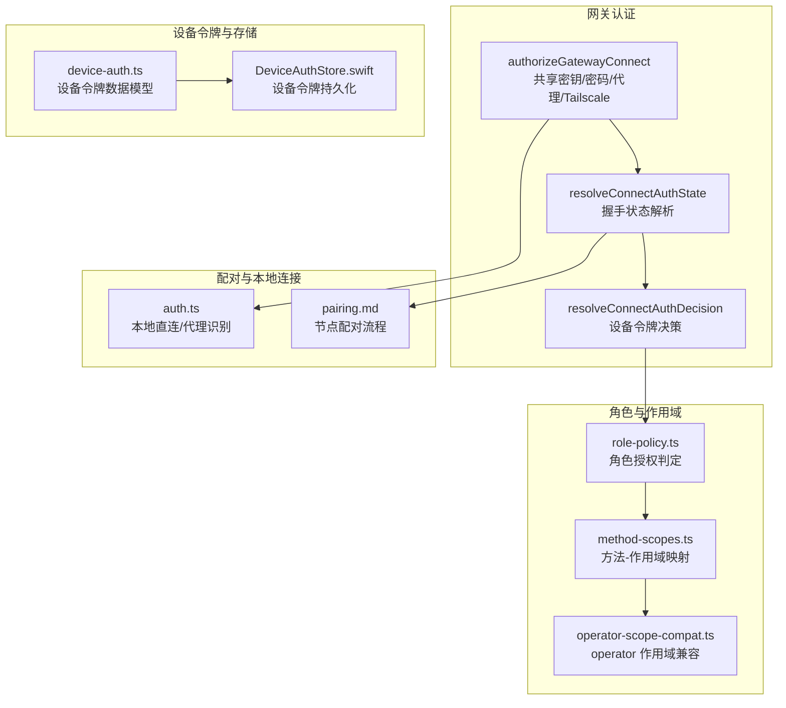
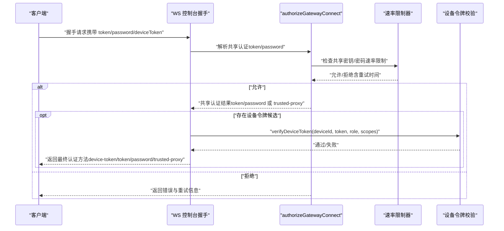
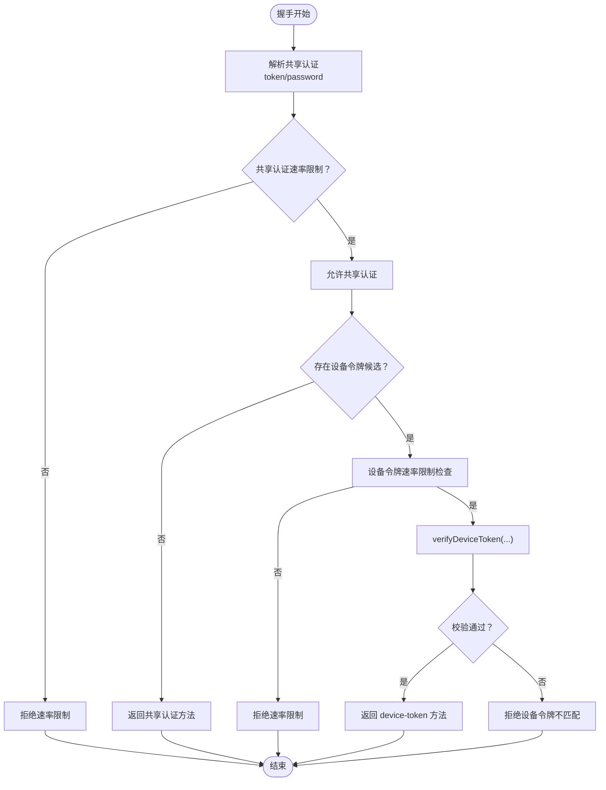
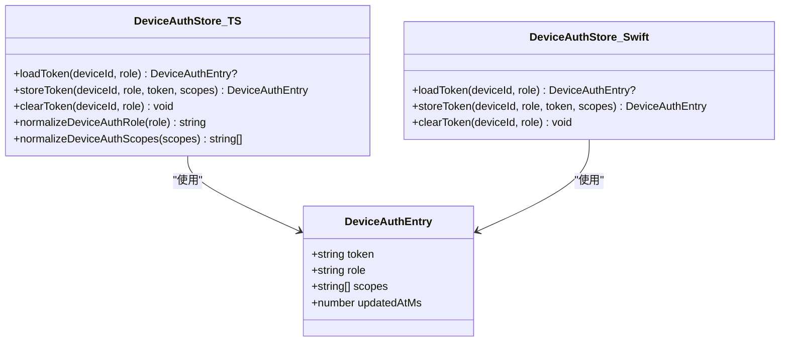
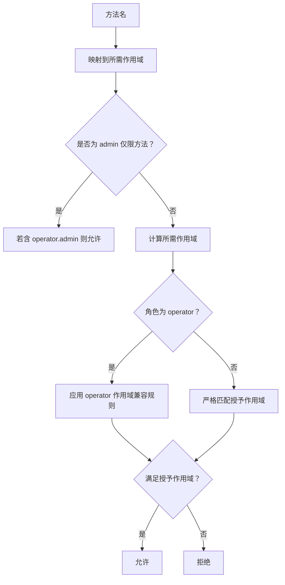
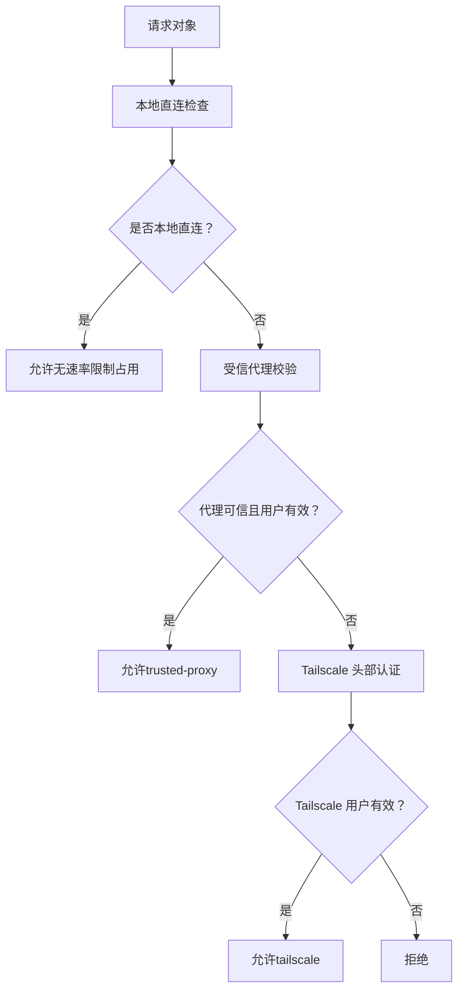
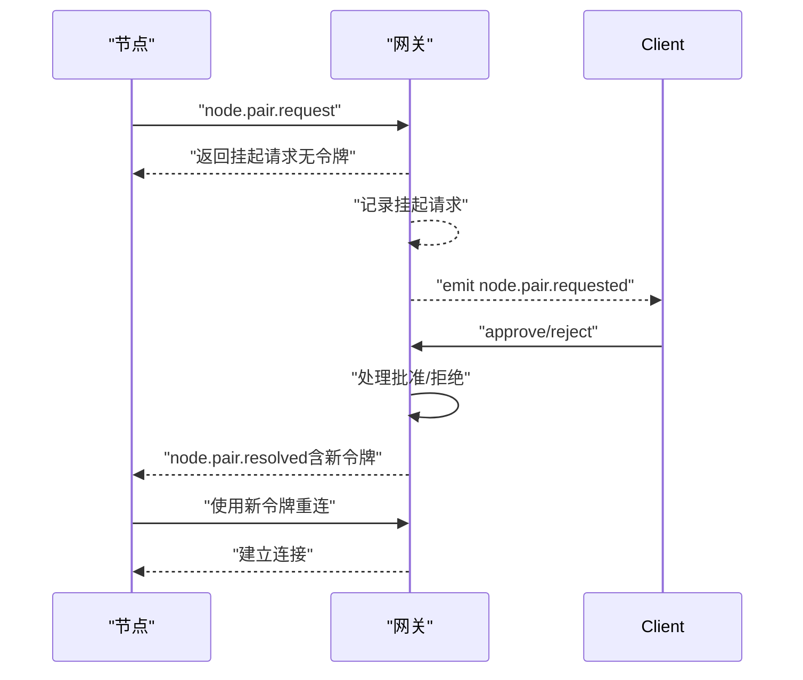
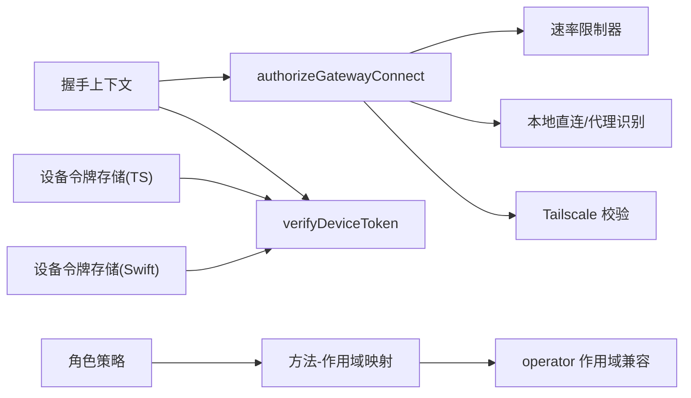

# 认证与授权

## 目录
1. [简介](#简介)
2. [项目结构](#项目结构)
3. [核心组件](#核心组件)
4. [架构总览](#架构总览)
5. [组件详解](#组件详解)
6. [依赖关系分析](#依赖关系分析)
7. [性能考量](#性能考量)
8. [故障排除指南](#故障排除指南)
9. [结论](#结论)
10. [附录](#附录)

## 简介
本文件系统化阐述 OpenClaw 的认证与授权机制，覆盖设备身份验证、令牌管理、角色与作用域控制、连接握手流程、配对与本地连接处理等。重点包括：
- 设备身份验证：共享密钥（token/password）、可信代理（trusted-proxy）、Tailscale 头部认证、设备令牌（device-token）校验与速率限制。
- 令牌管理：设备侧令牌存储与归一化、令牌轮换与失效处理、OAuth 与 API Key 的凭证管理与轮转策略。
- 角色与权限：操作员（operator）与节点（node）角色的授权边界、方法级作用域（operator.read/write/admin、pairing、approvals）与最小权限判定。
- 配对机制：网关托管式节点配对（gateway-owned pairing），请求生命周期、令牌轮换与存储位置。
- 安全策略：速率限制、防重放与防爆破、跨层信任边界与本地直连识别。

## 项目结构
围绕认证与授权的关键代码分布在以下模块：
- 网关认证与握手：共享密钥/密码/代理/Tailscale 校验、速率限制、WS 控制台握手上下文。
- 方法级作用域与角色策略：方法到作用域映射、角色授权判定、operator 作用域兼容规则。
- 设备令牌与存储：设备端令牌条目结构、归一化、存储读写（Swift/TypeScript）。
- 配对与本地连接：节点配对流程、事件与方法、本地直连识别与信任代理。
- 凭证与轮转：OAuth 与 API Key 的存储布局、轮转行为与多键回退策略。

**图表来源**
- [src/gateway/auth.ts](file://src/gateway/auth.ts#L378-L504)
- [src/gateway/server/ws-connection/auth-context.ts](file://src/gateway/server/ws-connection/auth-context.ts#L75-L154)
- [src/gateway/role-policy.ts](file://src/gateway/role-policy.ts#L1-L23)
- [src/gateway/method-scopes.ts](file://src/gateway/method-scopes.ts#L1-L216)
- [src/shared/operator-scope-compat.ts](file://src/shared/operator-scope-compat.ts#L1-L49)
- [src/shared/device-auth.ts](file://src/shared/device-auth.ts#L1-L31)
- [apps/shared/OpenClawKit/Sources/OpenClawKit/DeviceAuthStore.swift](file://apps/shared/OpenClawKit/Sources/OpenClawKit/DeviceAuthStore.swift#L1-L69)
- [docs/gateway/pairing.md](file://docs/gateway/pairing.md#L1-L100)

**章节来源**
- [src/gateway/auth.ts](file://src/gateway/auth.ts#L1-L504)
- [src/gateway/server/ws-connection/auth-context.ts](file://src/gateway/server/ws-connection/auth-context.ts#L1-L219)
- [src/gateway/role-policy.ts](file://src/gateway/role-policy.ts#L1-L23)
- [src/gateway/method-scopes.ts](file://src/gateway/method-scopes.ts#L1-L216)
- [src/shared/operator-scope-compat.ts](file://src/shared/operator-scope-compat.ts#L1-L49)
- [src/shared/device-auth.ts](file://src/shared/device-auth.ts#L1-L31)
- [apps/shared/OpenClawKit/Sources/OpenClawKit/DeviceAuthStore.swift](file://apps/shared/OpenClawKit/Sources/OpenClawKit/DeviceAuthStore.swift#L1-L69)
- [docs/gateway/pairing.md](file://docs/gateway/pairing.md#L1-L100)

## 核心组件
- 共享密钥/密码/代理/Tailscale 授权器：负责 HTTP/WS 控制台的统一认证入口，支持速率限制、本地直连识别、可信代理头部校验、Tailscale 用户身份核验。
- 握手上下文解析：将握手阶段的 token/password/deviceToken 合并为可执行的认证决策，区分显式设备令牌与共享令牌回退路径，并在设备令牌存在时进行速率限制与校验。
- 角色与方法作用域：基于方法名映射到 operator.read/write/admin/pairing/approvals 等作用域，结合角色（operator/node）进行最小权限判定。
- 设备令牌存储：定义设备令牌条目结构与归一化逻辑；提供 Swift 与 TypeScript 的存储实现，确保跨平台一致的令牌管理。
- 节点配对：网关托管式配对流程，支持挂起请求、批准/拒绝、令牌轮换与过期回收；事件与方法用于前端与 CLI 协作。
- 凭证与轮转：OAuth 与 API Key 的存储布局与轮转策略，支持多键回退与按需刷新。

**章节来源**
- [src/gateway/auth.ts](file://src/gateway/auth.ts#L378-L504)
- [src/gateway/server/ws-connection/auth-context.ts](file://src/gateway/server/ws-connection/auth-context.ts#L75-L219)
- [src/gateway/role-policy.ts](file://src/gateway/role-policy.ts#L1-L23)
- [src/gateway/method-scopes.ts](file://src/gateway/method-scopes.ts#L1-L216)
- [src/shared/device-auth.ts](file://src/shared/device-auth.ts#L1-L31)
- [apps/shared/OpenClawKit/Sources/OpenClawKit/DeviceAuthStore.swift](file://apps/shared/OpenClawKit/Sources/OpenClawKit/DeviceAuthStore.swift#L1-L69)
- [docs/gateway/pairing.md](file://docs/gateway/pairing.md#L1-L100)
- [docs/concepts/oauth.md](file://docs/concepts/oauth.md#L1-L159)
- [docs/gateway/authentication.md](file://docs/gateway/authentication.md#L1-L180)

## 架构总览
下图展示从客户端发起连接到完成认证与授权的整体流程，包括共享密钥/密码/代理/Tailscale 的优先级、设备令牌回退与速率限制、以及角色与作用域的最终判定。

**图表来源**
- [src/gateway/auth.ts](file://src/gateway/auth.ts#L378-L504)
- [src/gateway/server/ws-connection/auth-context.ts](file://src/gateway/server/ws-connection/auth-context.ts#L75-L219)

## 组件详解

### 设备身份验证与握手上下文
- 共享认证优先：当存在显式共享 token/password 时，优先走共享认证路径；若允许且非本地直连，尝试 Tailscale 头部认证；否则退回共享认证。
- 设备令牌回退：当具备设备身份（deviceId）且存在设备令牌候选时，进入设备令牌校验；若共享认证已通过但使用了 token/password，则对共享认证路径进行速率限制重置或记录失败。
- 速率限制：共享密钥与设备令牌分别有独立速率限制作用域；失败会记录并返回重试时间，成功则重置计数。

**图表来源**
- [src/gateway/server/ws-connection/auth-context.ts](file://src/gateway/server/ws-connection/auth-context.ts#L75-L219)
- [src/gateway/auth.ts](file://src/gateway/auth.ts#L415-L484)

**章节来源**
- [src/gateway/server/ws-connection/auth-context.ts](file://src/gateway/server/ws-connection/auth-context.ts#L1-L219)
- [src/gateway/auth.ts](file://src/gateway/auth.ts#L378-L504)

### 令牌管理与轮换
- 设备令牌存储：设备令牌以条目形式保存，包含 token、角色、作用域集合与更新时间；支持归一化角色与作用域，避免重复与大小写问题。
- 设备令牌持久化：Swift 实现提供加载、存储、清理能力，确保同一 deviceId 下按角色隔离存储。
- 令牌轮换：在配对流程中，批准配对会签发新令牌，旧令牌失效；建议在配对状态变更后重新连接以使用最新令牌。

**图表来源**
- [src/shared/device-auth.ts](file://src/shared/device-auth.ts#L1-L31)
- [apps/shared/OpenClawKit/Sources/OpenClawKit/DeviceAuthStore.swift](file://apps/shared/OpenClawKit/Sources/OpenClawKit/DeviceAuthStore.swift#L1-L69)

**章节来源**
- [src/shared/device-auth.ts](file://src/shared/device-auth.ts#L1-L31)
- [apps/shared/OpenClawKit/Sources/OpenClawKit/DeviceAuthStore.swift](file://apps/shared/OpenClawKit/Sources/OpenClawKit/DeviceAuthStore.swift#L1-L69)

### 角色权限与方法级访问控制
- 角色：operator 与 node 两类角色，分别对应不同的方法授权范围。
- 方法-作用域映射：将具体方法映射到 operator.read/write/admin、pairing、approvals 等作用域；未分类方法默认拒绝。
- 最小权限判定：operator.admin 可豁免所有方法；否则按所需作用域与授予作用域进行严格匹配；operator 特殊规则允许 admin 满足 operator.* 前缀范围。
- 作用域兼容：提供 operator 作用域兼容判断，确保 operator.read 可由 write/admin 满足，operator.write 可由 admin 满足。

**图表来源**
- [src/gateway/method-scopes.ts](file://src/gateway/method-scopes.ts#L1-L216)
- [src/shared/operator-scope-compat.ts](file://src/shared/operator-scope-compat.ts#L1-L49)
- [src/gateway/role-policy.ts](file://src/gateway/role-policy.ts#L1-L23)

**章节来源**
- [src/gateway/role-policy.ts](file://src/gateway/role-policy.ts#L1-L23)
- [src/gateway/method-scopes.ts](file://src/gateway/method-scopes.ts#L1-L216)
- [src/shared/operator-scope-compat.ts](file://src/shared/operator-scope-compat.ts#L1-L49)

### 连接挑战响应与本地连接处理
- 本地直连识别：通过本地回环地址、主机头与转发头组合判断是否为本地直连；支持受信任代理回退。
- 受信代理：当配置了 trusted-proxy 时，校验代理必须提供的必要头部与用户标识，支持白名单用户过滤。
- Tailscale 头部认证：在 WS 控制台场景允许启用 Tailscale 头部认证，通过 whois 校验用户身份一致性。

**图表来源**
- [src/gateway/auth.ts](file://src/gateway/auth.ts#L125-L215)

**章节来源**
- [src/gateway/auth.ts](file://src/gateway/auth.ts#L125-L215)

### 配对机制与令牌轮换
- 流程：节点发起配对请求，网关记录挂起请求并发出事件；管理员批准后签发新令牌，节点使用新令牌重连。
- 存储：配对状态与挂起请求存储于网关状态目录；令牌作为敏感信息妥善保管。
- 令牌轮换：批准配对总是生成新令牌，旧令牌立即失效；如需恢复，可通过删除节点条目或重新批准。

**图表来源**
- [docs/gateway/pairing.md](file://docs/gateway/pairing.md#L27-L71)

**章节来源**
- [docs/gateway/pairing.md](file://docs/gateway/pairing.md#L1-L100)

### 凭证与令牌轮转策略（OAuth 与 API Key）
- OAuth 存储：凭据按代理隔离存储，支持多账户与多配置文件；提供“令牌水槽”设计减少刷新令牌冲突。
- API Key 轮转：支持多键回退与按错误类型重试；优先级顺序明确，仅在限流等特定错误时自动切换备用键。
- 令牌轮询与检查：提供自动化脚本与命令行工具用于探测与告警，便于运维监控。

**章节来源**
- [docs/concepts/oauth.md](file://docs/concepts/oauth.md#L1-L159)
- [docs/gateway/authentication.md](file://docs/gateway/authentication.md#L123-L139)

## 依赖关系分析
- 认证入口依赖：authorizeGatewayConnect 是 HTTP/WS 控制台的统一入口，内部协调速率限制、本地直连、代理与 Tailscale。
- 握手上下文依赖：resolveConnectAuthState/resolveConnectAuthDecision 将握手参数与设备令牌校验串联，形成“共享认证优先 + 设备令牌回退”的双轨策略。
- 授权判定依赖：role-policy 与 method-scopes 决定角色与方法的授权边界；operator-scope-compat 提供 operator 作用域的兼容性规则。
- 存储依赖：设备令牌存储在两端实现，确保跨平台一致的令牌生命周期管理。

**图表来源**
- [src/gateway/auth.ts](file://src/gateway/auth.ts#L378-L504)
- [src/gateway/server/ws-connection/auth-context.ts](file://src/gateway/server/ws-connection/auth-context.ts#L75-L219)
- [src/gateway/role-policy.ts](file://src/gateway/role-policy.ts#L1-L23)
- [src/gateway/method-scopes.ts](file://src/gateway/method-scopes.ts#L1-L216)
- [src/shared/operator-scope-compat.ts](file://src/shared/operator-scope-compat.ts#L1-L49)
- [src/shared/device-auth.ts](file://src/shared/device-auth.ts#L1-L31)
- [apps/shared/OpenClawKit/Sources/OpenClawKit/DeviceAuthStore.swift](file://apps/shared/OpenClawKit/Sources/OpenClawKit/DeviceAuthStore.swift#L1-L69)

**章节来源**
- [src/gateway/auth.ts](file://src/gateway/auth.ts#L1-L504)
- [src/gateway/server/ws-connection/auth-context.ts](file://src/gateway/server/ws-connection/auth-context.ts#L1-L219)
- [src/gateway/role-policy.ts](file://src/gateway/role-policy.ts#L1-L23)
- [src/gateway/method-scopes.ts](file://src/gateway/method-scopes.ts#L1-L216)
- [src/shared/operator-scope-compat.ts](file://src/shared/operator-scope-compat.ts#L1-L49)
- [src/shared/device-auth.ts](file://src/shared/device-auth.ts#L1-L31)
- [apps/shared/OpenClawKit/Sources/OpenClawKit/DeviceAuthStore.swift](file://apps/shared/OpenClawKit/Sources/OpenClawKit/DeviceAuthStore.swift#L1-L69)

## 性能考量
- 速率限制：共享密钥/密码与设备令牌分别采用独立作用域的速率限制，避免单一入口成为瓶颈；成功认证后重置计数，失败记录以便限流。
- 本地直连优化：本地直连请求不计入速率限制槽位，降低本地 UI/CLI 的误伤概率。
- Tailscale 头部认证：仅在 WS 控制台场景启用，避免对 HTTP 接口造成额外开销。
- 方法级作用域判定：通过预构建映射表与前缀匹配，保证授权判定的常数时间复杂度。

[本节为通用指导，无需列出具体文件来源]

## 故障排除指南
- 速率限制触发
  - 现象：返回 rate_limited 并提示重试时间。
  - 处理：等待重试时间后重试；检查是否存在异常扫描或暴力尝试。
  - 参考：共享密钥/密码与设备令牌的速率限制检查与记录。
- 设备令牌不匹配
  - 现象：显式设备令牌与设备身份不匹配导致拒绝。
  - 处理：确认设备身份与令牌归属；重新配对获取新令牌。
  - 参考：设备令牌候选来源与校验流程。
- 受信代理配置错误
  - 现象：trusted-proxy 缺少必要头部或用户不在白名单。
  - 处理：补充 requiredHeaders 与 allowUsers；确保代理正确注入用户标识。
  - 参考：受信代理校验逻辑。
- Tailscale 用户不一致
  - 现象：Tailscale 头部用户与 whois 结果不一致。
  - 处理：检查代理链与网络拓扑；确保头部来源可信。
  - 参考：Tailscale 用户校验流程。
- OAuth/API Key 异常
  - 现象：凭据缺失、过期或轮转失败。
  - 处理：使用状态命令检查；按文档流程更新凭据或轮转备用键。
  - 参考：OAuth 存储与 API Key 轮转策略。

**章节来源**
- [src/gateway/auth.ts](file://src/gateway/auth.ts#L378-L504)
- [src/gateway/server/ws-connection/auth-context.ts](file://src/gateway/server/ws-connection/auth-context.ts#L180-L218)
- [docs/concepts/oauth.md](file://docs/concepts/oauth.md#L1-L159)
- [docs/gateway/authentication.md](file://docs/gateway/authentication.md#L160-L180)

## 结论
OpenClaw 的认证与授权体系以“共享认证优先 + 设备令牌回退”为核心，结合角色与方法级作用域实现最小权限控制；通过速率限制、本地直连识别与受信代理/Tailscale 支持，兼顾易用性与安全性。配对机制确保节点侧令牌的可控轮换，配合凭证轮转策略与可观测性工具，形成完整的运维闭环。

[本节为总结性内容，无需列出具体文件来源]

## 附录
- 角色与方法授权速查
  - operator：可调用所有方法，除非明确限定为 node-only。
  - node：仅允许节点相关方法（如 node.invoke.result、node.event 等）。
- 作用域与方法映射
  - operator.read：读取类方法通常需要该作用域或更高权限。
  - operator.write：写入类方法通常需要该作用域或更高权限。
  - operator.admin：最高权限，可豁免所有方法。
  - operator.pairing/operator.approvals：配对与审批相关方法。
- 设备令牌最佳实践
  - 严格保管 paired.json 与设备令牌；批准配对即轮换令牌。
  - 使用标准化角色与作用域，避免冗余与歧义。

[本节为概念性内容，无需列出具体文件来源]