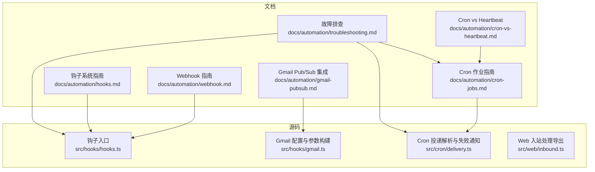
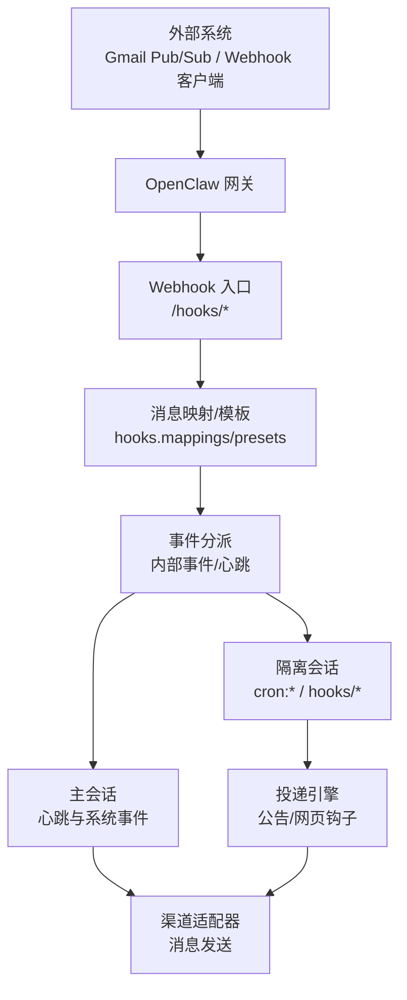
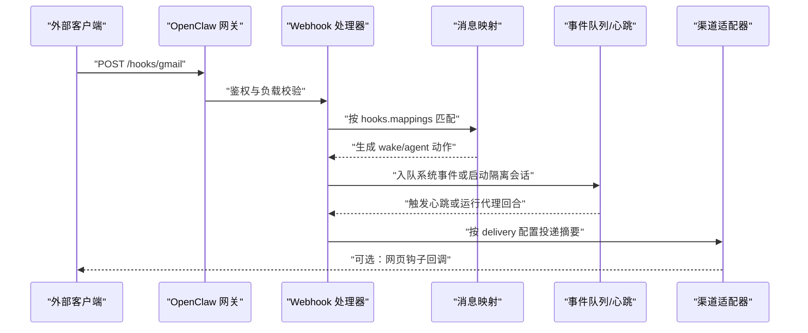
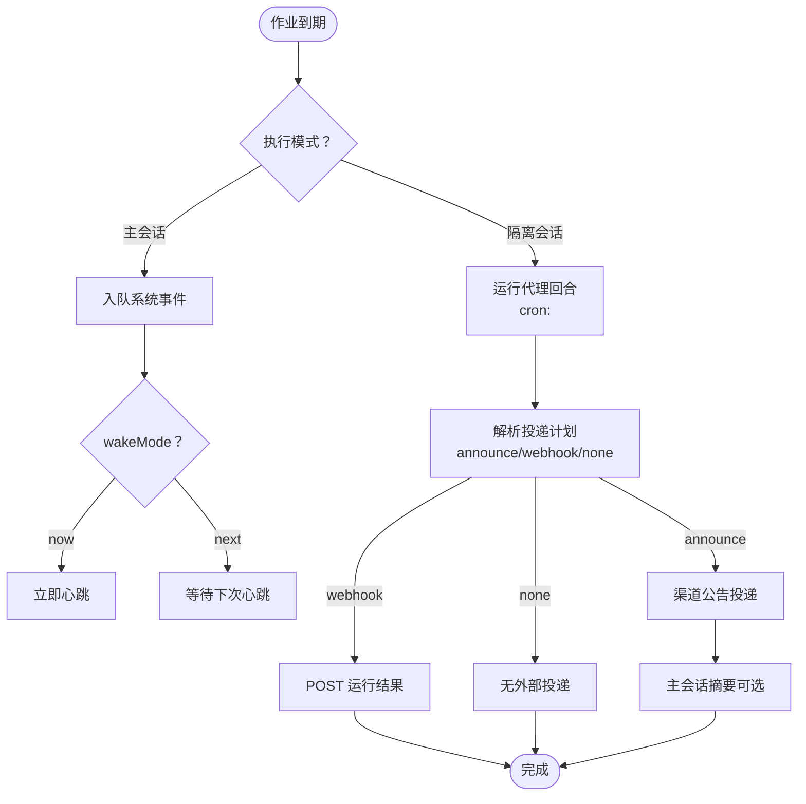
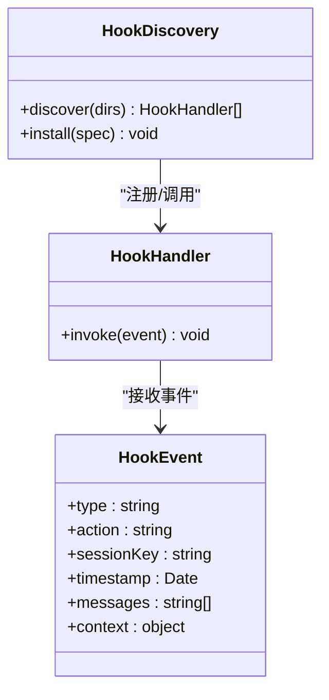
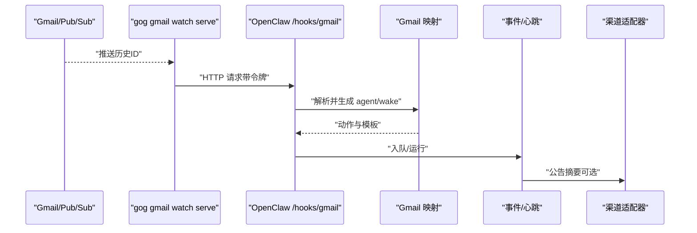
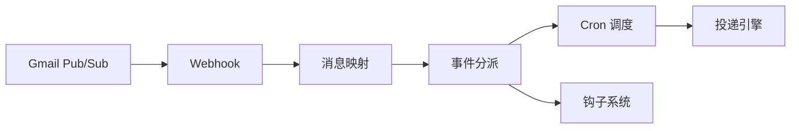

# 自动化和集成能力

## 目录
1. [引言](#引言)
2. [项目结构](#项目结构)
3. [核心组件](#核心组件)
4. [架构总览](#架构总览)
5. [详细组件分析](#详细组件分析)
6. [依赖关系分析](#依赖关系分析)
7. [性能考量](#性能考量)
8. [故障排查指南](#故障排查指南)
9. [结论](#结论)
10. [附录](#附录)

## 引言
本文件系统性阐述 OpenClaw 的自动化与集成能力，覆盖以下主题：
- Webhook 触发器：外部系统通过 HTTP 推送触发 OpenClaw 内部事件或独立会话运行，并支持消息映射与安全策略。
- Cron 作业调度：在网关内置调度器中持久化计划任务，支持主会话与隔离会话执行、公告/网页钩子投递、重试与维护策略。
- 钩子系统（Hooks）：事件驱动的自动化扩展点，支持目录发现、插件打包、消息映射与错误处理。
- 外部服务集成：以 Gmail Pub/Sub 为例，展示从推送事件到 OpenClaw 钩子的完整链路。

目标是帮助读者理解自动化工作流的设计与实现、状态管理、监控与日志、故障恢复，并提供可操作的配置示例、集成指南与最佳实践。

## 项目结构
OpenClaw 将自动化与集成能力分为三类文档与源码模块：
- 文档层：位于 docs/automation 下，提供面向用户的使用指南与参考。
- 源码层：位于 src/ 下，包含钩子系统、Cron 调度与投递、Web 入站处理等实现。
- 扩展与插件：位于 extensions/ 与 scripts/ 等目录，提供通道与工具扩展。

图表来源
- [docs/automation/webhook.md](file://docs/automation/webhook.md#L1-L216)
- [docs/automation/cron-jobs.md](file://docs/automation/cron-jobs.md#L1-L686)
- [docs/automation/hooks.md](file://docs/automation/hooks.md#L1-L800)
- [docs/automation/gmail-pubsub.md](file://docs/automation/gmail-pubsub.md#L1-L257)
- [src/hooks/hooks.ts](file://src/hooks/hooks.ts#L1-L15)
- [src/hooks/gmail.ts](file://src/hooks/gmail.ts#L1-L272)
- [src/cron/delivery.ts](file://src/cron/delivery.ts#L1-L302)
- [src/web/inbound.ts](file://src/web/inbound.ts#L1-L5)

章节来源
- [docs/automation/webhook.md](file://docs/automation/webhook.md#L1-L216)
- [docs/automation/cron-jobs.md](file://docs/automation/cron-jobs.md#L1-L686)
- [docs/automation/hooks.md](file://docs/automation/hooks.md#L1-L800)
- [docs/automation/gmail-pubsub.md](file://docs/automation/gmail-pubsub.md#L1-L257)
- [src/hooks/hooks.ts](file://src/hooks/hooks.ts#L1-L15)
- [src/hooks/gmail.ts](file://src/hooks/gmail.ts#L1-L272)
- [src/cron/delivery.ts](file://src/cron/delivery.ts#L1-L302)
- [src/web/inbound.ts](file://src/web/inbound.ts#L1-L5)

## 核心组件
- Webhook 触发器
  - 支持启用/鉴权/端点路径与会话键策略；提供 wake 与 agent 两类动作；支持自定义映射与模板。
  - 参考：[Webhook 指南](file://docs/automation/webhook.md#L13-L167)
- Cron 作业调度
  - 内置调度器，持久化存储于本地 JSON；支持主会话系统事件与隔离会话代理回合；支持公告/网页钩子投递、模型与思考层级覆盖、轻量引导上下文。
  - 参考：[Cron 作业指南](file://docs/automation/cron-jobs.md#L10-L480)
- 钩子系统（Hooks）
  - 事件驱动扩展，自动发现目录与插件包；支持命令、会话、代理、网关、消息等事件类型；提供消息映射与错误处理建议。
  - 参考：[钩子系统指南](file://docs/automation/hooks.md#L1-L800)
- 外部服务集成（Gmail Pub/Sub）
  - 通过 gogcli 启动 watch 与 serve，借助 Tailscale Funnel 提供公网 HTTPS；配置预设映射与消息投递。
  - 参考：[Gmail Pub/Sub 集成](file://docs/automation/gmail-pubsub.md#L1-L257)

章节来源
- [docs/automation/webhook.md](file://docs/automation/webhook.md#L13-L167)
- [docs/automation/cron-jobs.md](file://docs/automation/cron-jobs.md#L10-L480)
- [docs/automation/hooks.md](file://docs/automation/hooks.md#L1-L800)
- [docs/automation/gmail-pubsub.md](file://docs/automation/gmail-pubsub.md#L1-L257)

## 架构总览
下图展示了从外部系统到 OpenClaw 内部自动化执行的关键路径与交互：

图表来源
- [docs/automation/webhook.md](file://docs/automation/webhook.md#L42-L158)
- [docs/automation/gmail-pubsub.md](file://docs/automation/gmail-pubsub.md#L9-L120)
- [docs/automation/cron-jobs.md](file://docs/automation/cron-jobs.md#L135-L222)

## 详细组件分析

### Webhook 触发器
- 功能要点
  - 启用与鉴权：需要共享密钥令牌，支持头部 Authorization 或自定义头；拒绝查询串令牌。
  - 端点与动作：
    - POST /hooks/wake：入队系统事件，可选择立即心跳或等待下次心跳。
    - POST /hooks/agent：独立会话运行，支持路由到指定代理、会话键、交付目标与模型/思考层级覆盖。
    - POST /hooks/&lt;name&gt;：基于映射表将任意负载转换为 wake/agent 行为。
  - 会话键策略：默认禁止请求级覆盖，推荐固定 defaultSessionKey 并限制前缀。
  - 响应与安全：返回码语义明确；对重复鉴权失败进行限流；建议仅对可信内网/隧道暴露。
- 配置与映射
  - hooks.presets 开启内置 Gmail 映射；hooks.mappings 定义匹配规则与动作；hooks.transformsDir 支持 TS/JS 转换模块。
  - deliver、channel、to 等字段控制回复投递；allowUnsafeExternalContent 危险开关仅限受信内部来源。
- 示例与最佳实践
  - 使用 curl 测试端点；为不同代理设置专用模型；限制允许的 agentId 与会话键前缀。

图表来源
- [docs/automation/webhook.md](file://docs/automation/webhook.md#L42-L158)
- [docs/automation/gmail-pubsub.md](file://docs/automation/gmail-pubsub.md#L35-L92)

章节来源
- [docs/automation/webhook.md](file://docs/automation/webhook.md#L13-L167)
- [docs/automation/gmail-pubsub.md](file://docs/automation/gmail-pubsub.md#L22-L120)

### Cron 作业调度
- 执行模式
  - 主会话：入队系统事件，由心跳统一处理，可立即唤醒或等待下次心跳。
  - 隔离会话：在 cron:&lt;jobId&gt; 中独立运行，可直接公告摘要或通过网页钩子投递，避免污染主会话历史。
- 计划与调度
  - 支持 at（一次性）、every（固定间隔）、cron（5/6 位表达式，含 IANA 时区）；对整点表达式施加确定性抖动窗口。
  - 支持显式抖动窗口与精确时间；单次任务成功后默认删除（可禁用）。
- 投递与失败处理
  - delivery.mode 支持 announce/webhook/none；announce 模式直接通过渠道适配器投递；webhook 模式 POST 至指定 URL。
  - 失败目的地可全局或作业级配置；当与主投递相同则忽略；Webhook 模式需提供有效 URL。
- 存储与维护
  - 作业存储 jobs.json；运行历史 runs/&lt;jobId&gt;.jsonl；隔离会话保留周期可配置；运行日志大小与行数上限可裁剪。
- 重试策略
  - 单次任务对瞬时错误（限流/过载/网络/服务器错误）最多重试 3 次；永久错误（鉴权/配置错误）立即禁用。
  - 周期任务每次失败后指数退避，成功后重置。

图表来源
- [docs/automation/cron-jobs.md](file://docs/automation/cron-jobs.md#L135-L222)
- [src/cron/delivery.ts](file://src/cron/delivery.ts#L50-L102)

章节来源
- [docs/automation/cron-jobs.md](file://docs/automation/cron-jobs.md#L10-L480)
- [src/cron/delivery.ts](file://src/cron/delivery.ts#L1-L302)

### 钩子系统（Hooks）
- 发现与管理
  - 自动发现顺序：工作空间钩子 > 用户安装钩子 > 内置钩子；支持 npm 包形式的钩子包。
  - CLI：list/check/info/enable/disable；支持按条件过滤与 JSON 输出。
- 事件类型
  - 命令事件：/new、/reset、/stop；会话事件：压缩前后；代理事件：引导注入；网关事件：启动；消息事件：接收/转录/预处理/发送。
- 结构与元数据
  - HOOK.md 前言包含名称、描述、事件列表、二进制/环境要求等；handler.ts 导出 HookHandler 函数。
- 最佳实践
  - 保持处理器轻量、错误优雅处理、尽早过滤无关事件、优先使用具体事件键；必要时异步后台处理。

图表来源
- [docs/automation/hooks.md](file://docs/automation/hooks.md#L134-L238)
- [src/hooks/hooks.ts](file://src/hooks/hooks.ts#L1-L15)

章节来源
- [docs/automation/hooks.md](file://docs/automation/hooks.md#L1-L800)
- [src/hooks/hooks.ts](file://src/hooks/hooks.ts#L1-L15)

### 外部服务集成：Gmail Pub/Sub
- 目标与流程
  - Gmail watch -> Pub/Sub 推送 -> gog gmail watch serve -> OpenClaw /hooks/gmail -> 映射为 wake/agent -> 主会话摘要。
- 前置条件
  - gcloud/gogcli/tailscale 安装与登录；启用 Gmail/Pub/Sub API；创建 Topic 并赋予发布权限。
- 配置与映射
  - hooks.presets: ["gmail"] 启用内置映射；可覆盖 deliver/channel/to 与模型/思考层级；支持 hooks.gmail.* 默认值。
  - 支持 hooks.mappings 与 transformsDir 自定义处理；Tailscale Funnel 作为公网入口。
- 运行与测试
  - openclaw webhooks gmail setup/wizard；openclaw webhooks gmail run；gog gmail watch start/status/history；测试邮件验证。
- 安全与合规
  - 仅对可信来源关闭外部内容安全包装；避免在日志中记录敏感原始负载。

图表来源
- [docs/automation/gmail-pubsub.md](file://docs/automation/gmail-pubsub.md#L9-L120)
- [src/hooks/gmail.ts](file://src/hooks/gmail.ts#L100-L206)

章节来源
- [docs/automation/gmail-pubsub.md](file://docs/automation/gmail-pubsub.md#L1-L257)
- [src/hooks/gmail.ts](file://src/hooks/gmail.ts#L1-L272)

## 依赖关系分析
- 组件耦合
  - Webhook 与钩子系统共享事件分派与消息映射能力；Cron 与投递引擎解耦，通过 delivery 配置与失败目的地实现灵活投递。
  - Gmail Pub/Sub 通过 gogcli 与 OpenClaw 钩子集成，形成端到端自动化闭环。
- 外部依赖
  - Google Cloud APIs（Gmail/Pub/Sub）、Tailscale（Funnel）、gogcli 工具链。
- 潜在循环依赖
  - 文档与源码之间为单向依赖（文档引用源码），未见循环。

图表来源
- [docs/automation/webhook.md](file://docs/automation/webhook.md#L132-L158)
- [docs/automation/cron-jobs.md](file://docs/automation/cron-jobs.md#L182-L222)
- [docs/automation/hooks.md](file://docs/automation/hooks.md#L1-L800)
- [docs/automation/gmail-pubsub.md](file://docs/automation/gmail-pubsub.md#L1-L257)

章节来源
- [docs/automation/webhook.md](file://docs/automation/webhook.md#L132-L158)
- [docs/automation/cron-jobs.md](file://docs/automation/cron-jobs.md#L182-L222)
- [docs/automation/hooks.md](file://docs/automation/hooks.md#L1-L800)
- [docs/automation/gmail-pubsub.md](file://docs/automation/gmail-pubsub.md#L1-L257)

## 性能考量
- Cron 高频场景
  - 隔离会话与运行日志体量可能增大，建议缩短 sessionRetention、限制 runLog.maxBytes/keepLines、将噪声任务置于隔离模式并合理投递。
- 心跳与 Cron 的权衡
  - 将可批量检查的任务放入心跳，减少 API 调用与上下文切换成本；对精确时间与独立上下文需求使用 Cron。
- 投递与并发
  - announce 模式直接走渠道适配器，避免额外往返；webhook 模式需考虑外部服务可用性与超时控制。

[本节为通用指导，不直接分析具体文件]

## 故障排查指南
- 命令排查阶梯
  - openclaw status/gateway status/logs --follow/doctor/channels status --probe；随后检查 cron status/list/system heartbeat last。
- 常见问题定位
  - Cron 未触发：确认 cron.enabled 与环境变量、主机时区、activeHours；查看 runs 输出与日志栈。
  - Cron 触发但未投递：检查 delivery.mode/channel/to 是否正确；探测渠道认证/权限；确认 announce 与 webhook 的 URL 与令牌。
  - 心跳被抑制：检查 activeHours、quiet-hours、requests-in-flight、空心跳文件与可见性设置。
- 时间与时区
  - cron at 未带时区按 UTC 处理；cron 未指定时区使用网关主机时区；heartbeat activeHours 使用用户/本地/IANA 解析；变更主机时区可能导致错峰。

章节来源
- [docs/automation/troubleshooting.md](file://docs/automation/troubleshooting.md#L1-L123)
- [docs/automation/cron-jobs.md](file://docs/automation/cron-jobs.md#L367-L480)
- [docs/automation/cron-vs-heartbeat.md](file://docs/automation/cron-vs-heartbeat.md#L95-L123)

## 结论
OpenClaw 的自动化与集成体系以事件驱动为核心，结合 Webhook、Cron 与钩子系统，实现了从外部服务到内部代理执行的完整链路。通过会话隔离、消息映射、投递策略与失败目的地配置，系统在灵活性与可控性之间取得平衡。配合心跳与 Cron 的协同，既能高效批处理日常检查，又能满足精确时间与独立上下文的复杂任务。建议在生产环境中严格控制令牌与会话键策略、启用失败目的地与运行日志裁剪，并根据业务场景选择心跳或 Cron 的执行模式。

[本节为总结性内容，不直接分析具体文件]

## 附录
- 实战场景示例
  - Gmail 新邮件即刻摘要：启用 hooks.presets: ["gmail"]，映射 deliver/channel/to，设置 hooks.gmail.model/thinking，通过 openclaw webhooks gmail run 启动 watch 与 serve。
  - 每日早间简报：使用 cron add 创建隔离任务，设置 announce 投递至 WhatsApp/Telegram 等；对深度分析任务使用更高算力模型与思考层级。
  - 一次性提醒：使用 --at 创建单次任务，session main 并 wake now，确保在心跳中即时处理。
- 最佳实践清单
  - 为 Webhook 与 Cron 分配专用令牌；限制 hooks.allowedAgentIds 与 hooks.allowedSessionKeyPrefixes；对高频率 Cron 设置合理的 sessionRetention 与 runLog 限额；在心跳中聚合相似检查任务；为失败任务配置失败目的地；对公网暴露使用受控隧道（如 Tailscale Funnel）。

章节来源
- [docs/automation/gmail-pubsub.md](file://docs/automation/gmail-pubsub.md#L93-L134)
- [docs/automation/cron-jobs.md](file://docs/automation/cron-jobs.md#L524-L652)
- [docs/automation/webhook.md](file://docs/automation/webhook.md#L105-L131)