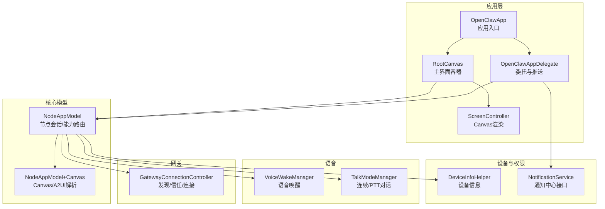
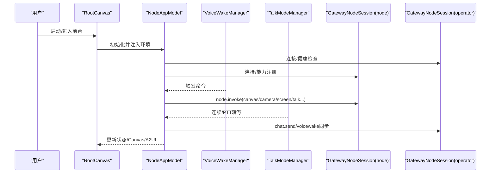
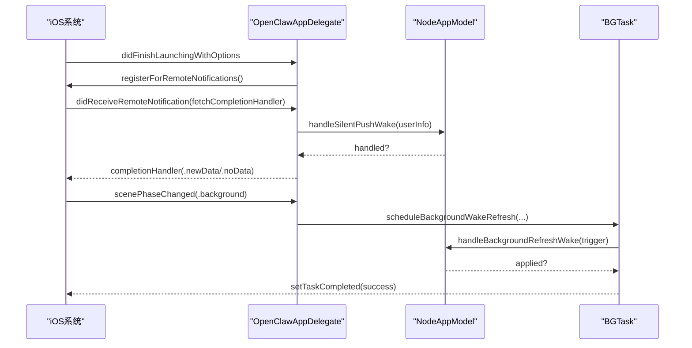
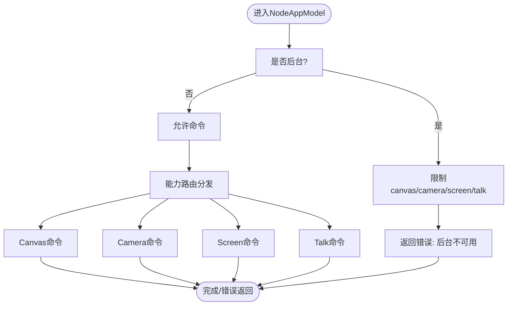
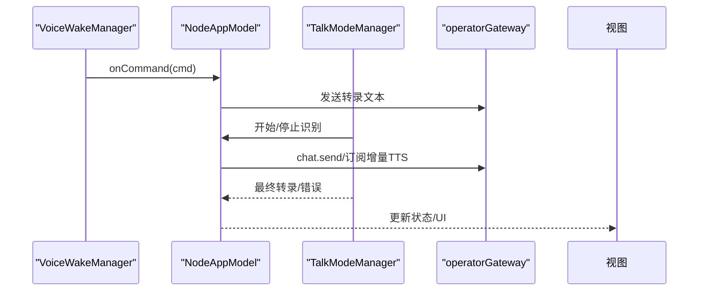
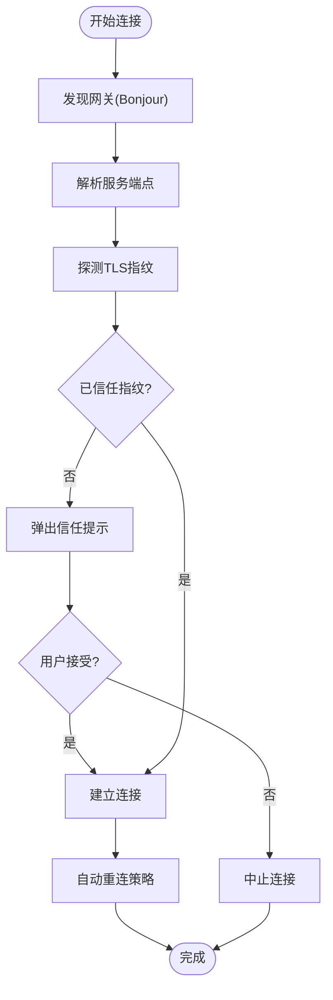
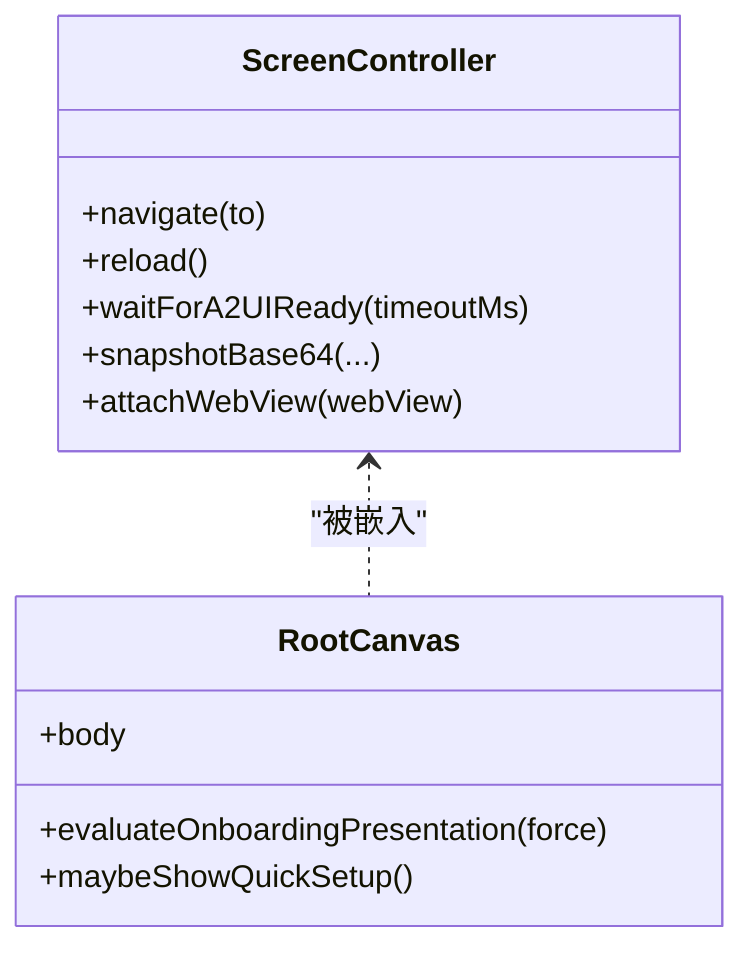
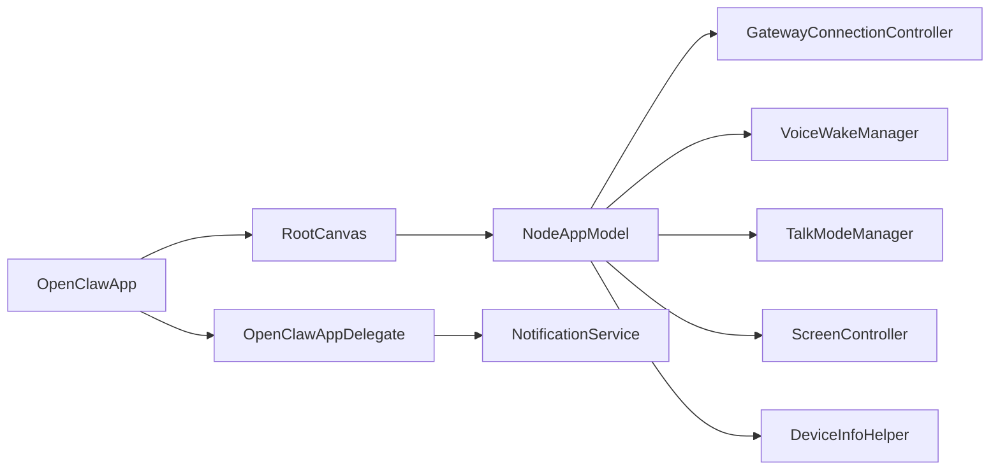

# iOS节点应用

## 目录
1. [简介](#简介)
2. [项目结构](#项目结构)
3. [核心组件](#核心组件)
4. [架构总览](#架构总览)
5. [详细组件分析](#详细组件分析)
6. [依赖关系分析](#依赖关系分析)
7. [性能考虑](#性能考虑)
8. [故障排除指南](#故障排除指南)
9. [结论](#结论)
10. [附录](#附录)

## 简介
本文件面向OpenClaw iOS节点应用（内部超Alpha版本），系统性阐述其在iOS平台上的功能特性与实现方式，涵盖节点模式、Canvas表面、语音触发转发、设备配对与网关连接、远程控制、后台任务与推送通知、设备传感器集成以及本地存储管理等。文档同时提供安装配置、权限设置、网络连接与数据同步机制说明，并给出使用指南、配置参数说明、故障排除与电池优化建议。

## 项目结构
iOS节点应用位于apps/ios目录，采用SwiftUI与Swift构建，核心模块包括：
- 应用入口与生命周期：OpenClawApp.swift、OpenClawAppDelegate
- 核心业务模型：NodeAppModel及其Canvas扩展
- 语音能力：VoiceWakeManager、TalkModeManager
- 网关连接：GatewayConnectionController、GatewayDiscoveryModel、GatewaySettingsStore
- 屏幕与Canvas：ScreenController、RootCanvas
- 设备信息与权限：DeviceInfoHelper、NotificationService
- 其他：设备传感器服务（位置、相机、屏幕录制、照片、联系人、日历、提醒、运动）、手表消息桥接、活动与小组件等

图表来源
- [OpenClawApp.swift](file://apps/ios/Sources/OpenClawApp.swift#L492-L526)
- [OpenClawAppDelegate.swift](file://apps/ios/Sources/OpenClawApp.swift#L16-L263)
- [RootCanvas.swift](file://apps/ios/Sources/RootCanvas.swift#L4-L465)
- [ScreenController.swift](file://apps/ios/Sources/Screen/ScreenController.swift#L6-L268)
- [NodeAppModel.swift](file://apps/ios/Sources/Model/NodeAppModel.swift#L48-L220)
- [NodeAppModel+Canvas.swift](file://apps/ios/Sources/Model/NodeAppModel+Canvas.swift#L11-L101)
- [VoiceWakeManager.swift](file://apps/ios/Sources/Voice/VoiceWakeManager.swift#L82-L144)
- [TalkModeManager.swift](file://apps/ios/Sources/Voice/TalkModeManager.swift#L31-L164)
- [GatewayConnectionController.swift](file://apps/ios/Sources/Gateway/GatewayConnectionController.swift#L20-L81)

章节来源
- [README.md](file://apps/ios/README.md#L1-L142)

## 核心组件
- 应用入口与生命周期
  - OpenClawApp：初始化NodeAppModel与GatewayConnectionController，注入环境变量，处理深链与场景状态变化，安装未捕获异常记录器。
  - OpenClawAppDelegate：注册APNs、处理静默推送唤醒、调度后台刷新任务、路由手表提示动作到NodeAppModel。
- 节点模型与Canvas
  - NodeAppModel：维护节点/操作者双会话、健康监测、背景重连抑制与宽限、A2UI/Canvas解析、代理深链、语音唤醒与Talk模式协调、设备能力路由。
  - NodeAppModel+Canvas：解析Canvas/A2UI主机地址、自动打开Canvas、A2UI就绪探测、TCP探测前置检查。
- 语音能力
  - VoiceWakeManager：麦克风与语音识别权限请求、实时音频采集与转写、触发词匹配、暂停/恢复策略。
  - TalkModeManager：连续/PTT模式、静音检测、增量TTS、聊天订阅、音频会话管理、错误自愈与降级。
- 网关连接
  - GatewayConnectionController：零conf/Bonjour发现、服务解析、TLS指纹验证、自动/手动连接、信任提示、自动重连策略。
- 屏幕与Canvas
  - ScreenController：WKWebView承载Canvas/A2UI、快照、等待就绪、调试状态注入、本地网络URL校验。
- 设备信息与权限
  - DeviceInfoHelper：平台版本、设备型号、应用版本字符串。
  - NotificationService：通知授权状态抽象与请求封装。

章节来源
- [OpenClawApp.swift](file://apps/ios/Sources/OpenClawApp.swift#L16-L263)
- [NodeAppModel.swift](file://apps/ios/Sources/Model/NodeAppModel.swift#L48-L220)
- [NodeAppModel+Canvas.swift](file://apps/ios/Sources/Model/NodeAppModel+Canvas.swift#L11-L101)
- [VoiceWakeManager.swift](file://apps/ios/Sources/Voice/VoiceWakeManager.swift#L82-L144)
- [TalkModeManager.swift](file://apps/ios/Sources/Voice/TalkModeManager.swift#L31-L164)
- [GatewayConnectionController.swift](file://apps/ios/Sources/Gateway/GatewayConnectionController.swift#L20-L81)
- [ScreenController.swift](file://apps/ios/Sources/Screen/ScreenController.swift#L6-L268)
- [DeviceInfoHelper.swift](file://apps/ios/Sources/Device/DeviceInfoHelper.swift#L7-L73)
- [NotificationService.swift](file://apps/ios/Sources/Services/NotificationService.swift#L12-L58)

## 架构总览
iOS节点以“节点模式（role: node）”接入OpenClaw网关，通过双会话分离职责：
- 节点会话（nodeGateway）：执行设备能力调用（camera、screen、canvas、talk等）与node.invoke请求。
- 操作者会话（operatorGateway）：负责聊天、语音唤醒、Talk模式同步、配置获取与健康监测。

图表来源
- [OpenClawApp.swift](file://apps/ios/Sources/OpenClawApp.swift#L492-L526)
- [NodeAppModel.swift](file://apps/ios/Sources/Model/NodeAppModel.swift#L98-L143)
- [VoiceWakeManager.swift](file://apps/ios/Sources/Voice/VoiceWakeManager.swift#L133-L144)
- [TalkModeManager.swift](file://apps/ios/Sources/Voice/TalkModeManager.swift#L155-L164)

## 详细组件分析

### 应用入口与生命周期（OpenClawApp/OpenClawAppDelegate）
- 注册APNs并在启动时调用注册；深链处理通过RootCanvas传递给NodeAppModel。
- 场景状态变化（active/inactive/background）驱动后台刷新任务调度与健康监测启停。
- 静默推送到达时尝试唤醒节点并返回fetch结果；手表提示动作解析后路由至NodeAppModel。

图表来源
- [OpenClawApp.swift](file://apps/ios/Sources/OpenClawApp.swift#L50-L156)
- [OpenClawApp.swift](file://apps/ios/Sources/OpenClawApp.swift#L232-L262)

章节来源
- [OpenClawApp.swift](file://apps/ios/Sources/OpenClawApp.swift#L16-L263)

### 节点模型与Canvas（NodeAppModel/NodeAppModel+Canvas）
- 双会话与健康监测：独立维护节点/操作者会话，周期性健康检查失败则断开并重连。
- 背景限制与重连抑制：后台时限制canvas/camera/screen/talk命令；通过“宽限期+租约”避免频繁断连。
- Canvas/A2UI：解析Canvas/A2UI主机URL，前置TCP探测，自动打开Canvas或回退默认画布；支持A2UI动作回调。
- 代理深链：从Canvas点击或A2UI按钮触发Agent深链，格式化消息上下文并发送。

图表来源
- [NodeAppModel.swift](file://apps/ios/Sources/Model/NodeAppModel.swift#L722-L768)
- [NodeAppModel+Canvas.swift](file://apps/ios/Sources/Model/NodeAppModel+Canvas.swift#L52-L82)

章节来源
- [NodeAppModel.swift](file://apps/ios/Sources/Model/NodeAppModel.swift#L70-L150)
- [NodeAppModel+Canvas.swift](file://apps/ios/Sources/Model/NodeAppModel+Canvas.swift#L11-L101)

### 语音触发与对话（VoiceWakeManager/TalkModeManager）
- 语音唤醒：请求麦克风与语音识别权限，实时音频采集与转写，触发词匹配后回调NodeAppModel发送转录文本。
- Talk模式：连续/PTT两种模式，静音检测与超时自动结束，增量TTS与聊天订阅，音频会话管理与错误自愈。
- 协调策略：VoiceWake与Talk互斥占用麦克风，Talk启用时暂停唤醒，Talk结束恢复唤醒。

图表来源
- [VoiceWakeManager.swift](file://apps/ios/Sources/Voice/VoiceWakeManager.swift#L133-L144)
- [TalkModeManager.swift](file://apps/ios/Sources/Voice/TalkModeManager.swift#L155-L164)
- [NodeAppModel.swift](file://apps/ios/Sources/Model/NodeAppModel.swift#L187-L195)

章节来源
- [VoiceWakeManager.swift](file://apps/ios/Sources/Voice/VoiceWakeManager.swift#L82-L144)
- [TalkModeManager.swift](file://apps/ios/Sources/Voice/TalkModeManager.swift#L31-L164)

### 网关连接与配对（GatewayConnectionController）
- 发现与解析：Bonjour服务解析，主机端口提取，TLS指纹探测与信任提示。
- 自动连接：基于上次连接、首选稳定ID或单个发现目标进行自动连接；仅对已信任的TLS指纹执行自动连接。
- 手动连接：支持手动输入主机/端口/是否TLS，必要时弹出信任提示。
- 安全策略：LAN发现拒绝明文连接；首次TLS指纹必须由用户确认后才建立连接。

图表来源
- [GatewayConnectionController.swift](file://apps/ios/Sources/Gateway/GatewayConnectionController.swift#L95-L156)
- [GatewayConnectionController.swift](file://apps/ios/Sources/Gateway/GatewayConnectionController.swift#L162-L207)
- [GatewayConnectionController.swift](file://apps/ios/Sources/Gateway/GatewayConnectionController.swift#L242-L278)

章节来源
- [GatewayConnectionController.swift](file://apps/ios/Sources/Gateway/GatewayConnectionController.swift#L20-L81)

### 屏幕与Canvas（ScreenController/RootCanvas）
- ScreenController：承载WKWebView，支持本地scaffold与远端URL加载，调试状态注入，A2UI就绪等待，截图与快照。
- RootCanvas：主界面容器，聚合状态栏、聊天/设置/网关操作按钮、Talk模式覆盖层、语音唤醒提示与相机闪光效果。

图表来源
- [ScreenController.swift](file://apps/ios/Sources/Screen/ScreenController.swift#L6-L268)
- [RootCanvas.swift](file://apps/ios/Sources/RootCanvas.swift#L4-L465)

章节来源
- [ScreenController.swift](file://apps/ios/Sources/Screen/ScreenController.swift#L6-L268)
- [RootCanvas.swift](file://apps/ios/Sources/RootCanvas.swift#L4-L465)

### 设备信息与权限（DeviceInfoHelper/NotificationService）
- DeviceInfoHelper：平台版本、设备家族、机型标识、应用版本字符串。
- NotificationService：统一的通知授权状态查询与请求封装，用于手表提示与本地通知。

章节来源
- [DeviceInfoHelper.swift](file://apps/ios/Sources/Device/DeviceInfoHelper.swift#L7-L73)
- [NotificationService.swift](file://apps/ios/Sources/Services/NotificationService.swift#L12-L58)

## 依赖关系分析
- 组件耦合
  - OpenClawApp与OpenClawAppDelegate强关联，AppDelegate持有NodeAppModel引用以便在模型可用时处理APNs与手表提示。
  - NodeAppModel依赖多个服务（相机、屏幕录制、位置、设备状态、照片、联系人、日历、提醒、运动、手表消息），并通过能力路由统一调度。
  - GatewayConnectionController与NodeAppModel双向协作：前者负责连接与信任，后者负责能力注册与会话管理。
- 外部依赖
  - 网络与安全：Bonjour、DNS解析、TLS指纹校验、WebSocket连接。
  - 系统框架：AVFoundation（音频/视频）、Speech（语音识别）、UserNotifications（推送）、WebKit（Canvas/A2UI）。
- 循环依赖
  - 通过弱引用与延迟初始化避免循环依赖；AppDelegate对NodeAppModel的引用在模型可用时才建立。

图表来源
- [OpenClawApp.swift](file://apps/ios/Sources/OpenClawApp.swift#L492-L526)
- [NodeAppModel.swift](file://apps/ios/Sources/Model/NodeAppModel.swift#L48-L220)
- [GatewayConnectionController.swift](file://apps/ios/Sources/Gateway/GatewayConnectionController.swift#L20-L81)
- [VoiceWakeManager.swift](file://apps/ios/Sources/Voice/VoiceWakeManager.swift#L82-L144)
- [TalkModeManager.swift](file://apps/ios/Sources/Voice/TalkModeManager.swift#L31-L164)
- [ScreenController.swift](file://apps/ios/Sources/Screen/ScreenController.swift#L6-L268)
- [OpenClawAppDelegate.swift](file://apps/ios/Sources/OpenClawApp.swift#L16-L263)
- [NotificationService.swift](file://apps/ios/Sources/Services/NotificationService.swift#L12-L58)
- [DeviceInfoHelper.swift](file://apps/ios/Sources/Device/DeviceInfoHelper.swift#L7-L73)

章节来源
- [OpenClawApp.swift](file://apps/ios/Sources/OpenClawApp.swift#L16-L263)
- [NodeAppModel.swift](file://apps/ios/Sources/Model/NodeAppModel.swift#L48-L220)

## 性能考虑
- 后台限制：iOS后台限制严格，canvas/camera/screen/talk在后台被阻断，避免耗电与系统回收。
- 背景重连抑制：通过“宽限期+租约”减少后台频繁断连；前台恢复时优先健康检查，必要时强制重启连接。
- 语音资源竞争：VoiceWake与Talk共享麦克风，Talk启用时暂停唤醒，避免冲突与资源争用。
- Canvas/A2UI：前置TCP探测与A2UI就绪等待，降低首帧失败概率；截图与快照按需生成，避免过度编码。
- 通知与后台任务：静默推送唤醒与后台刷新任务结合，尽量在低功耗窗口内完成唤醒与重连。

## 故障排除指南
- 安装与签名
  - 使用Xcode 16+、pnpm、xcodegen；确保Apple Development签名配置正确；个人团队签名失败时使用LocalSigning.xcconfig示例调整Bundle ID。
- 推送通知（APNs）
  - Debug构建注册沙盒环境，Release注册生产环境；若推送能力或Provisioning不匹配，运行时会记录“APNs registration failed”，请检查推送能力与主题配置。
- 网关连接
  - 若发现不稳定，开启“Discovery Debug Logs”查看日志；手动连接时若无TLS指纹，需先信任指纹；LAN发现默认拒绝明文连接。
- 权限问题
  - 语音唤醒需麦克风与语音识别权限；Talk模式需麦克风与语音识别权限；位置权限需选择“始终”才能在后台接收位置事件。
- 背景行为
  - 前台优先为可靠模式；后台命令受限；如遇反复断连，先在前台复现，再测试后台切换与恢复后的重连。
- 调试日志
  - 在Xcode控制台按子系统/类别过滤：ai.openclaw.ios、GatewayDiag、APNs registration failed。

章节来源
- [README.md](file://apps/ios/README.md#L21-L60)
- [README.md](file://apps/ios/README.md#L120-L142)
- [OpenClawApp.swift](file://apps/ios/Sources/OpenClawApp.swift#L72-L74)

## 结论
iOS节点应用以清晰的双会话架构、严格的后台限制与权限管理、完善的网关发现与信任流程，实现了在iOS平台上的节点模式接入与远程控制能力。语音唤醒与Talk模式协同工作，Canvas/A2UI提供直观的人机交互界面。通过后台刷新任务与静默推送唤醒，应用在保持低功耗的同时维持稳定的网关连接。建议在实际部署前完善权限与后台行为的加固，并持续优化语音与Canvas的交互体验。

## 附录

### 使用指南
- 安装与启动
  - 使用脚本生成工程并打开Xcode，选择OpenClaw方案与iPhone目标，Debug构建运行。
- 首次配对
  - 通过Telegram执行/pair与/pair approve；完成后在设置中查看网关状态。
- 连接网关
  - 使用快速设置或手动输入主机/端口/是否TLS；首次TLS指纹需用户确认。
- Canvas/A2UI
  - 连接成功后自动打开Canvas；也可在设置中选择A2UI主机URL。
- 语音唤醒与Talk
  - 在设置中启用语音唤醒或Talk模式；Talk启用时暂停唤醒，结束时恢复。

章节来源
- [README.md](file://apps/ios/README.md#L21-L69)
- [RootCanvas.swift](file://apps/ios/Sources/RootCanvas.swift#L86-L194)

### 配置参数说明
- 通用
  - gateway.autoconnect：是否自动连接
  - gateway.manual.enabled/host/port/tls：手动连接配置
  - gateway.preferredStableID/gateway.lastDiscoveredStableID：偏好与最近发现的网关稳定ID
  - node.displayName/node.instanceId：节点显示名与实例ID
  - screen.preventSleep：防止休眠
  - canvas.debugStatusEnabled：Canvas调试状态
- 语音
  - voiceWake.enabled：语音唤醒开关
  - talk.enabled：Talk模式开关
  - talk.background.enabled：后台保持Talk活跃
  - talk.button.enabled：显示Talk按钮
- 位置
  - location.enabledMode：位置权限模式（off/whenInUse/always）

章节来源
- [RootCanvas.swift](file://apps/ios/Sources/RootCanvas.swift#L10-L25)
- [NodeAppModel.swift](file://apps/ios/Sources/Model/NodeAppModel.swift#L197-L203)
- [GatewayConnectionController.swift](file://apps/ios/Sources/Gateway/GatewayConnectionController.swift#L732-L800)

### 电池优化建议
- 尽量在前台使用高耗能功能（相机/屏幕录制/语音），避免后台执行。
- 合理设置位置权限为“始终”但注意后台位置事件的触发频率，避免频繁移动事件导致的唤醒风暴。
- 关闭不必要的通知与后台任务，减少静默推送唤醒频率。
- 在不需要时关闭Talk模式与语音唤醒，释放麦克风资源。

章节来源
- [README.md](file://apps/ios/README.md#L70-L99)
- [NodeAppModel.swift](file://apps/ios/Sources/Model/NodeAppModel.swift#L300-L382)