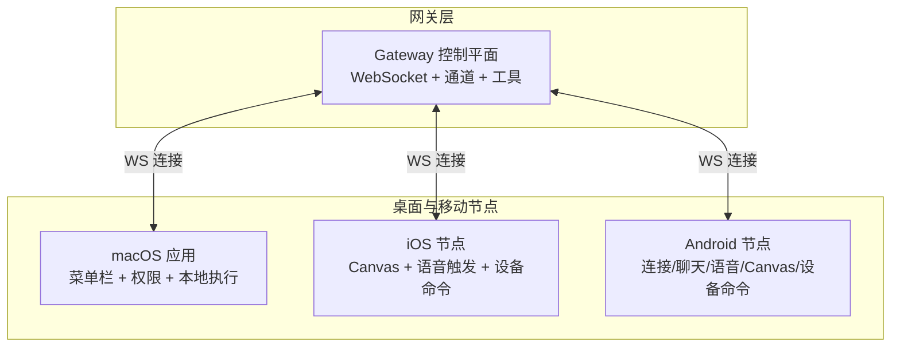
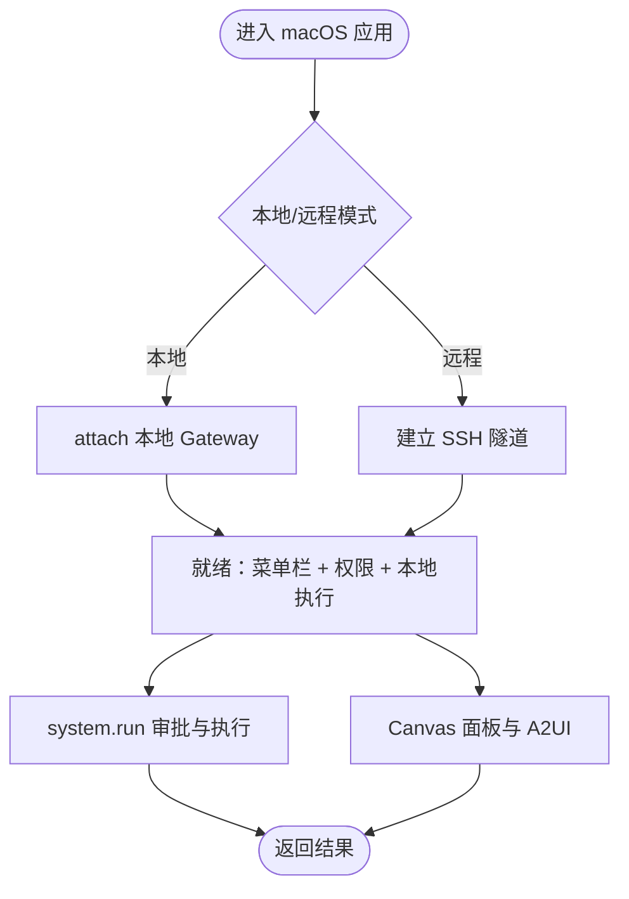
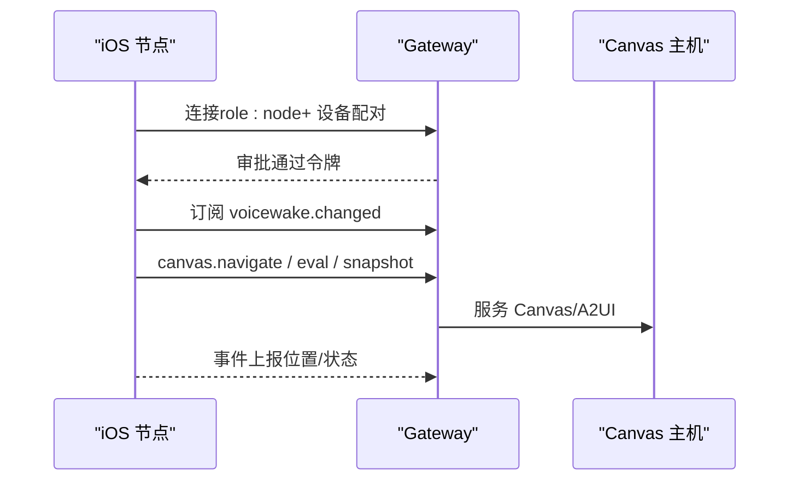
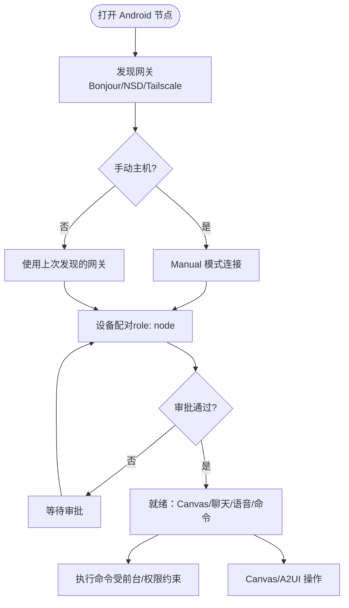
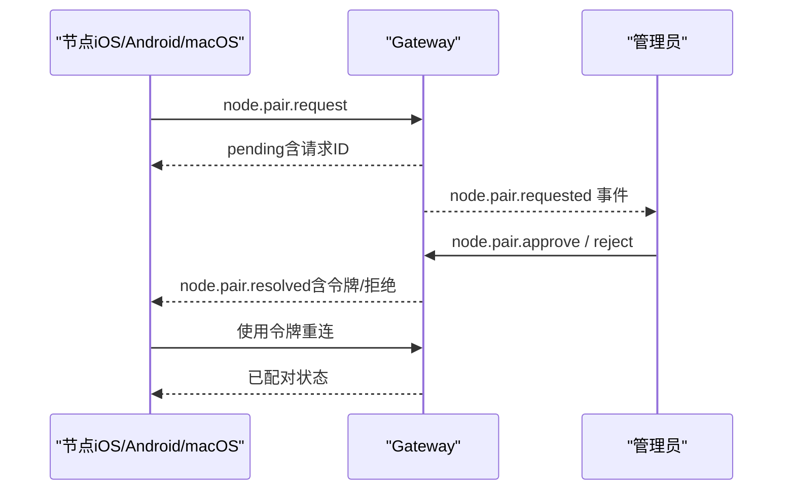
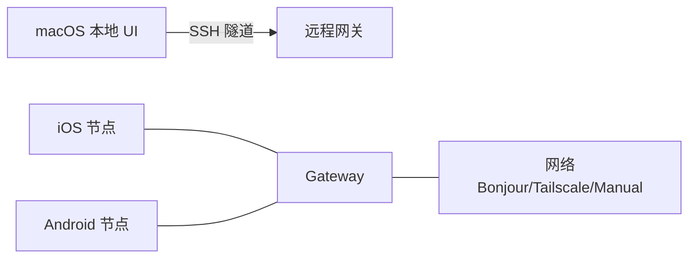
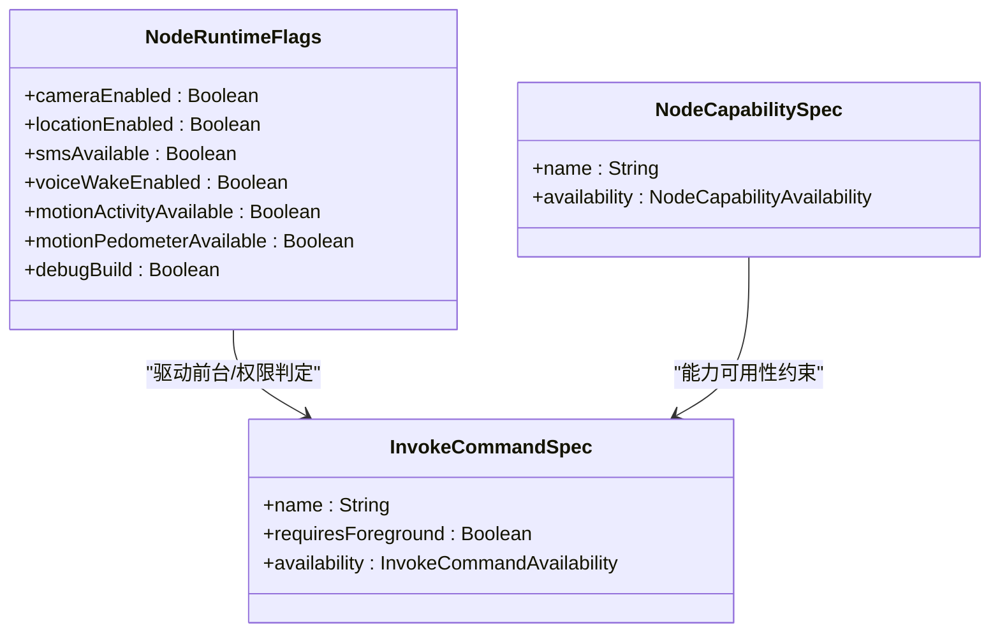
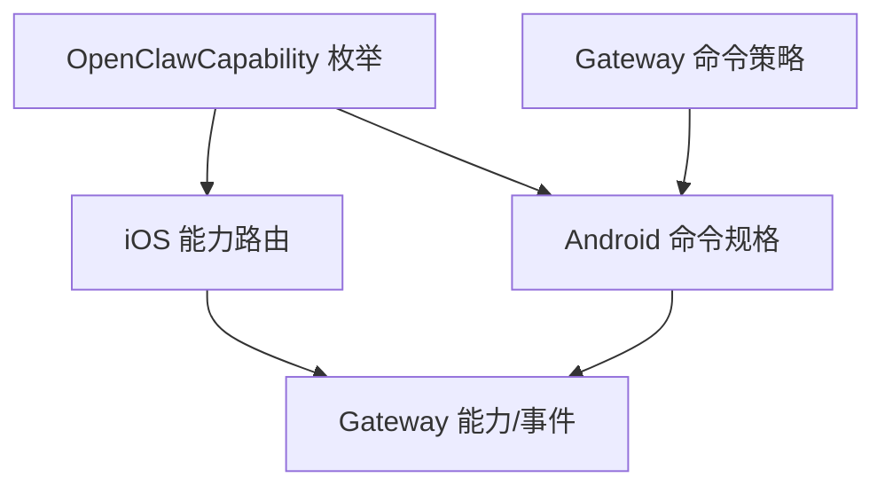

# 跨平台应用支持


## 目录
1. [简介](#简介)
2. [项目结构](#项目结构)
3. [核心组件](#核心组件)
4. [架构总览](#架构总览)
5. [详细组件分析](#详细组件分析)
6. [依赖关系分析](#依赖关系分析)
7. [性能考量](#性能考量)
8. [故障排除指南](#故障排除指南)
9. [结论](#结论)
10. [附录](#附录)

## 简介
本文件系统性阐述 OpenClaw 的跨平台应用支持，聚焦三端能力：macOS 菜单栏应用、iOS 节点与 Android 节点。内容涵盖设备配对流程、远程访问机制、权限管理、本地操作执行，以及各平台特性（macOS 语音唤醒与 Canvas 集成、iOS 节点模式与 Canvas 表面、Android 连接标签与聊天界面等）。文档同时提供平台特定配置、排障建议与最佳实践，帮助开发者与用户高效落地。

## 项目结构
OpenClaw 采用多平台并行的“网关控制平面 + 多节点客户端”的架构。网关负责会话、通道、工具与事件的统一控制；macOS/iOS/Android 作为节点，通过 WebSocket 与网关交互，实现设备本地能力的代理调用与远程协作。



图示来源
- [README.md](file://README.md#L185-L212)

章节来源
- [README.md](file://README.md#L185-L212)

## 核心组件
- 网关（Gateway）：统一的 WebSocket 控制平面，承载会话、通道、工具与事件；提供节点配对、能力描述与命令路由。
- macOS 应用：菜单栏常驻，负责权限管理、本地执行审批、远程网关控制与 Canvas 集成。
- iOS 节点：以“节点”角色连接网关，提供 Canvas 表面、语音触发转发与设备命令。
- Android 节点：以“节点”角色连接网关，提供连接标签、聊天界面、语音标签与设备命令。

章节来源
- [docs/platforms/macos.md](file://docs/platforms/macos.md#L9-L25)
- [docs/platforms/ios.md](file://docs/platforms/ios.md#L10-L19)
- [docs/platforms/android.md](file://docs/platforms/android.md#L10-L19)

## 架构总览
下图展示三端与网关的交互路径、配对与远程访问机制：

```mermaid
sequenceDiagram
participant User as "用户"
participant MAC as "macOS 应用"
participant IOS as "iOS 节点"
participant AND as "Android 节点"
participant GW as "Gateway"
User->>MAC : 启动并完成权限检查
MAC->>GW : attach/启动本地网关或连接远程网关
User->>IOS : 打开应用并连接网关
User->>AND : 打开应用并连接网关
IOS->>GW : 设备配对请求role : node
AND->>GW : 设备配对请求role : node
GW-->>IOS : 审批结果令牌/拒绝
GW-->>AND : 审批结果令牌/拒绝
IOS->>GW : 连接携带令牌
AND->>GW : 连接携带令牌
GW-->>IOS : 能力列表 + 事件推送
GW-->>AND : 能力列表 + 事件推送
MAC->>GW : 本地执行审批system.run
GW-->>MAC : 执行结果
```

图示来源
- [docs/channels/pairing.md](file://docs/channels/pairing.md#L57-L98)
- [docs/gateway/pairing.md](file://docs/gateway/pairing.md#L27-L71)
- [docs/platforms/macos.md](file://docs/platforms/macos.md#L75-L111)

## 详细组件分析

### macOS 菜单栏应用
- 角色与职责
  - 菜单栏状态与通知、TCC 权限提示与管理、本地/远程网关运行与连接、暴露 macOS 专属工具（Canvas、Camera、Screen、system.run）。
  - 支持本地模式（attach 本地网关）与远程模式（通过 SSH 隧道与远程网关通信）。
- 本地执行审批（system.run）
  - 通过本地 Unix Socket 与 macOS 应用交互，执行 UI/TCC 上下文中的命令；审批策略存储于本地 JSON 文件，支持安全策略、询问与白名单。
- Canvas 集成
  - 本地 Canvas 面板通过自定义 URL Scheme 提供 HTML/CSS/JS 可视化工作区，支持 A2UI 推送与快照。
- 深度链接
  - 支持 openclaw://agent 触发网关代理请求，带消息、会话键、思考模式、投递目标与超时参数。



图示来源
- [docs/platforms/macos.md](file://docs/platforms/macos.md#L26-L65)
- [docs/platforms/macos.md](file://docs/platforms/macos.md#L75-L111)
- [docs/platforms/mac/canvas.md](file://docs/platforms/mac/canvas.md#L10-L43)

章节来源
- [docs/platforms/macos.md](file://docs/platforms/macos.md#L9-L65)
- [docs/platforms/macos.md](file://docs/platforms/macos.md#L75-L111)
- [docs/platforms/mac/canvas.md](file://docs/platforms/mac/canvas.md#L10-L43)

### iOS 节点
- 角色与职责
  - 以“节点”连接网关，提供 Canvas 表面、屏幕截图、相机抓拍/录制、位置、通话/语音模式、语音唤醒。
  - 支持 Bonjour 与尾网（Tailscale）发现，手动主机端口回退。
- Canvas 与 A2UI
  - iOS 节点内置 WKWebView 渲染 Canvas；网关 Canvas 主机提供 A2UI 推送与数据模型更新。
- 语音唤醒与通话模式
  - 全局唤醒词由网关维护并通过广播同步；iOS 本地保持启用/禁用开关与权限处理；通话模式与语音唤醒互斥。
- 限制与注意事项
  - 背景状态下部分命令受限（如 Canvas、Camera、Screen、Talk），需前台执行；配对失败会暂停重连直至人工修复。



图示来源
- [docs/platforms/ios.md](file://docs/platforms/ios.md#L14-L19)
- [docs/platforms/ios.md](file://docs/platforms/ios.md#L67-L91)
- [docs/nodes/voicewake.md](file://docs/nodes/voicewake.md#L9-L49)

章节来源
- [docs/platforms/ios.md](file://docs/platforms/ios.md#L14-L91)
- [docs/nodes/voicewake.md](file://docs/nodes/voicewake.md#L9-L49)

### Android 节点
- 角色与职责
  - 以“节点”连接网关，提供连接标签（Setup Code/Manual）、聊天界面（与 WebChat 历史共享）、语音标签、Canvas、摄像头/屏幕录制、设备命令（通知、联系人、日历、运动、照片等）。
- 连接与配对
  - 支持 mDNS/NSD 发现、尾网（unicast DNS-SD）与手动主机端口；首次配对后自动重连。
- Canvas 与 A2UI
  - Canvas 通过独立端口的 Canvas 主机提供，支持 eval/snapshot/navigate 与 A2UI 推送。
- 权限与命令可用性
  - 命令可用性与前台状态、权限开关相关；危险命令（如 camera.snap/camera.clip、screen.record）需要前台与权限。



图示来源
- [docs/platforms/android.md](file://docs/platforms/android.md#L24-L86)
- [docs/platforms/android.md](file://docs/platforms/android.md#L121-L165)
- [apps/android/app/src/main/java/ai/openclaw/app/node/InvokeCommandRegistry.kt](file://apps/android/app/src/main/java/ai/openclaw/app/node/InvokeCommandRegistry.kt#L27-L55)

章节来源
- [docs/platforms/android.md](file://docs/platforms/android.md#L24-L86)
- [docs/platforms/android.md](file://docs/platforms/android.md#L121-L165)
- [apps/android/app/src/main/java/ai/openclaw/app/node/InvokeCommandRegistry.kt](file://apps/android/app/src/main/java/ai/openclaw/app/node/InvokeCommandRegistry.kt#L27-L55)

### 设备配对流程
- 通用流程
  - 节点发起配对请求（role: node），网关生成待审批请求并广播事件；管理员在网关侧批准/拒绝；批准后颁发新令牌，节点使用令牌重连。
- 平台差异
  - macOS：可通过“静默审批”在满足条件时自动批准（依赖 SSH 连通性）。
  - iOS/Android：通过 Telegram 等渠道进行 Setup Code 流程，随后在节点侧连接并审批。



图示来源
- [docs/gateway/pairing.md](file://docs/gateway/pairing.md#L27-L71)
- [docs/channels/pairing.md](file://docs/channels/pairing.md#L62-L85)

章节来源
- [docs/gateway/pairing.md](file://docs/gateway/pairing.md#L27-L71)
- [docs/channels/pairing.md](file://docs/channels/pairing.md#L62-L85)

### 远程访问机制
- macOS 远程模式
  - 通过 SSH 隧道将本地端口映射到远程网关，使本地 UI 组件如同访问本地网关一般；隧道复用健康检查与控制平面调用。
- iOS/Android
  - 通过 Bonjour、尾网（Tailscale unicast DNS-SD）或手动主机端口连接网关；支持 TLS 信任提示与令牌认证。



图示来源
- [docs/platforms/macos.md](file://docs/platforms/macos.md#L200-L220)
- [docs/platforms/ios.md](file://docs/platforms/ios.md#L52-L66)
- [docs/platforms/android.md](file://docs/platforms/android.md#L39-L72)

章节来源
- [docs/platforms/macos.md](file://docs/platforms/macos.md#L200-L220)
- [docs/platforms/ios.md](file://docs/platforms/ios.md#L52-L66)
- [docs/platforms/android.md](file://docs/platforms/android.md#L39-L72)

### 权限管理与本地操作执行
- macOS
  - system.run 通过本地审批策略与 UI/TCC 上下文执行；环境变量过滤与允许列表合并；支持“始终允许”持久化。
- iOS/Android
  - Canvas、Camera、Screen、Location 等命令受前台状态与权限影响；危险命令（如 camera.snap/camera.clip、screen.record）需前台与权限。
- 命令可用性与前台要求
  - Android 命令注册表定义了前台必需与按能力可用的命令集合；iOS 节点根据能力与权限动态生成当前命令集。



图示来源
- [apps/android/app/src/main/java/ai/openclaw/app/node/InvokeCommandRegistry.kt](file://apps/android/app/src/main/java/ai/openclaw/app/node/InvokeCommandRegistry.kt#L17-L55)
- [src/gateway/node-command-policy.ts](file://src/gateway/node-command-policy.ts#L10-L44)

章节来源
- [docs/platforms/macos.md](file://docs/platforms/macos.md#L75-L111)
- [src/gateway/node-command-policy.ts](file://src/gateway/node-command-policy.ts#L10-L44)
- [apps/android/app/src/main/java/ai/openclaw/app/node/InvokeCommandRegistry.kt](file://apps/android/app/src/main/java/ai/openclaw/app/node/InvokeCommandRegistry.kt#L27-L55)

### 平台特性概览
- macOS
  - 语音唤醒（全局唤醒词同步）、Canvas 面板与 A2UI、深度链接触发代理运行、菜单栏状态与通知。
- iOS
  - Canvas 表面、语音触发转发、节点模式（Canvas/Screen/Camera/Location/Talk/Voice Wake）。
- Android
  - 连接标签（Setup Code/Manual）、聊天界面（历史共享）、语音标签、Canvas/A2UI、设备命令族（通知/联系人/日历/运动/照片等）。

章节来源
- [docs/platforms/macos.md](file://docs/platforms/macos.md#L15-L25)
- [docs/platforms/ios.md](file://docs/platforms/ios.md#L14-L19)
- [docs/platforms/android.md](file://docs/platforms/android.md#L121-L165)

## 依赖关系分析
- 能力枚举与命令路由
  - 共享能力枚举（OpenClawCapability）定义 Canvas、Camera、Screen、VoiceWake、Location 等能力；iOS 节点基于能力构建路由处理器。
- 命令可用性与前台要求
  - Android 命令注册表定义命令是否需要前台、按能力可用（如 Camera/Location/SMS/VoiceWake/Motion）；Gateway 端策略文件列出各类命令集合与危险命令。



图示来源
- [apps/shared/OpenClawKit/Sources/OpenClawKit/Capabilities.swift](file://apps/shared/OpenClawKit/Sources/OpenClawKit/Capabilities.swift#L3-L17)
- [apps/ios/Sources/Model/NodeAppModel.swift](file://apps/ios/Sources/Model/NodeAppModel.swift#L1379-L1402)
- [apps/android/app/src/main/java/ai/openclaw/app/node/InvokeCommandRegistry.kt](file://apps/android/app/src/main/java/ai/openclaw/app/node/InvokeCommandRegistry.kt#L27-L55)
- [src/gateway/node-command-policy.ts](file://src/gateway/node-command-policy.ts#L10-L44)

章节来源
- [apps/shared/OpenClawKit/Sources/OpenClawKit/Capabilities.swift](file://apps/shared/OpenClawKit/Sources/OpenClawKit/Capabilities.swift#L3-L17)
- [apps/ios/Sources/Model/NodeAppModel.swift](file://apps/ios/Sources/Model/NodeAppModel.swift#L1379-L1402)
- [apps/android/app/src/main/java/ai/openclaw/app/node/InvokeCommandRegistry.kt](file://apps/android/app/src/main/java/ai/openclaw/app/node/InvokeCommandRegistry.kt#L27-L55)
- [src/gateway/node-command-policy.ts](file://src/gateway/node-command-policy.ts#L10-L44)

## 性能考量
- 启动与迭代
  - Android 支持冷启动宏基准与热点提取，便于低噪声测量与对比；iOS/Android 建议使用 Live Edit/Apply Changes 快速迭代。
- Canvas 加载与 A2UI
  - macOS Canvas 与 iOS/Android Canvas/A2UI 均强调前台状态与权限，避免后台限制导致的性能抖动与资源占用。
- 网络与隧道
  - macOS 远程模式使用稳定本地端口复用隧道，减少频繁重建带来的握手延迟；iOS/Android 建议优先使用 Bonjour/Tailscale，必要时再降级到手动主机端口。

章节来源
- [apps/android/README.md](file://apps/android/README.md#L134-L142)
- [apps/macos/README.md](file://apps/macos/README.md#L165-L170)
- [docs/platforms/macos.md](file://docs/platforms/macos.md#L200-L220)

## 故障排除指南
- macOS
  - 开发签名与权限持久化问题：可选择 Ad-hoc 签名或调整签名标识；库验证绕过仅限开发；Team ID 审核不匹配时需统一团队 ID。
  - 诊断连接：使用 macOS CLI 对等比较发现与握手逻辑，定位差异。
- iOS
  - APNs 注册失败：确认推送能力与配置文件匹配；调试日志中搜索相关关键字；前台优先，背景命令受限。
  - 常见错误：NODE_BACKGROUND_UNAVAILABLE（需前台）、A2UI_HOST_NOT_CONFIGURED（网关未广告 Canvas 主机）。
- Android
  - 首次配对失败：在网关侧批准最新请求；Canvas 主机不可达：确保 Canvas 主机运行且可达，保持应用在 Screen 标签页。
  - 命令不可用：检查前台状态与权限；危险命令需前台与权限。

章节来源
- [apps/macos/README.md](file://apps/macos/README.md#L25-L65)
- [docs/platforms/macos.md](file://docs/platforms/macos.md#L171-L199)
- [apps/ios/README.md](file://apps/ios/README.md#L53-L61)
- [apps/ios/README.md](file://apps/ios/README.md#L101-L110)
- [apps/android/README.md](file://apps/android/README.md#L165-L224)

## 结论
OpenClaw 的跨平台应用支持以“网关控制平面 + 多节点客户端”为核心，通过统一的设备配对与命令策略，实现 macOS/iOS/Android 的协同与本地能力代理。平台特性互补：macOS 强化本地执行与 Canvas 集成，iOS 提供节点模式与语音触发，Android 提供丰富的连接与聊天体验。遵循本文档的配对流程、权限管理与故障排除建议，可显著提升部署与运维效率。

## 附录
- 平台运行与打包
  - macOS：本地 Swift 构建与打包脚本；iOS：Xcode 生成工程与手动部署流程；Android：Gradle 构建与测试脚本。
- Canvas 与 A2UI
  - macOS 本地 Canvas 面板与 A2UI；iOS/Android Canvas/A2UI 通过网关 Canvas 主机提供。
- 语音唤醒
  - 全局唤醒词由网关维护并通过广播同步，各端保持本地开关与权限处理。

章节来源
- [apps/macos/README.md](file://apps/macos/README.md#L1-L65)
- [apps/ios/README.md](file://apps/ios/README.md#L21-L52)
- [apps/android/README.md](file://apps/android/README.md#L22-L56)
- [docs/platforms/mac/canvas.md](file://docs/platforms/mac/canvas.md#L67-L100)
- [docs/nodes/voicewake.md](file://docs/nodes/voicewake.md#L30-L67)