# 社区生态

## 目录
1. [简介](#简介)
2. [项目结构](#项目结构)
3. [核心组件](#核心组件)
4. [架构总览](#架构总览)
5. [详细组件分析](#详细组件分析)
6. [依赖关系分析](#依赖关系分析)
7. [性能考量](#性能考量)
8. [故障排查指南](#故障排查指南)
9. [结论](#结论)
10. [附录](#附录)

## 简介
OpenClaw 是一个面向个人用户的自托管 AI 助手网关，支持多通道消息接入与多代理路由，强调本地运行、隐私与安全。社区围绕开源协作、文档完善、技能生态与安全治理展开，提供 Discord、GitHub Discussions 等交流渠道，以及 ClawHub 技能注册中心与赞助支持路径。

## 项目结构
- 贡献与治理
  - 贡献指南、维护者名单、PR 模板、标签器与自动响应工作流
  - 安全策略与漏洞上报流程
- 文档与帮助
  - 官方文档索引、快速开始、帮助入口与常见问题
- 生态与工具
  - ClawHub 技能注册中心与 CLI 工作流
  - 多平台应用与节点（macOS、iOS、Android）
- 交流与协作
  - Discord 频道、GitHub Discussions、社交媒体账号
  - 资助与赞助渠道

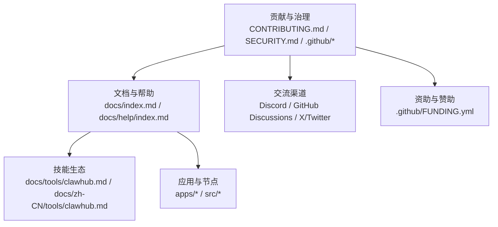

**图表来源**
- [CONTRIBUTING.md](file://CONTRIBUTING.md#L1-L187)
- [README.md](file://README.md#L1-L560)
- [.github/FUNDING.yml](file://.github/FUNDING.yml#L1-L2)
- [docs/index.md](file://docs/index.md#L1-L193)
- [docs/help/index.md](file://docs/help/index.md#L1-L22)
- [docs/tools/clawhub.md](file://docs/tools/clawhub.md#L1-L44)
- [docs/zh-CN/tools/clawhub.md](file://docs/zh-CN/tools/clawhub.md#L1-L158)

**章节来源**
- [CONTRIBUTING.md](file://CONTRIBUTING.md#L1-L187)
- [README.md](file://README.md#L1-L560)
- [.github/FUNDING.yml](file://.github/FUNDING.yml#L1-L2)
- [docs/index.md](file://docs/index.md#L1-L193)
- [docs/help/index.md](file://docs/help/index.md#L1-L22)

## 核心组件
- 维护者与治理
  - 明确的维护者角色与职责，欢迎积极贡献者加入维护团队
  - 提供 PR 流程、测试要求、审查对话责任与 AI 协作规范
- 安全与信任模型
  - 私有漏洞上报渠道与严格报告清单
  - 信任模型与边界说明，强调“个人助理”而非多租户场景
- 社区与交流
  - Discord 频道、GitHub Discussions、社交媒体账号
  - 资助与赞助链接
- 技能生态
  - ClawHub 公共技能注册中心，支持搜索、安装、更新与发布
  - 工作区优先加载策略与版本管理

**章节来源**
- [CONTRIBUTING.md](file://CONTRIBUTING.md#L12-L187)
- [SECURITY.md](file://SECURITY.md#L1-L286)
- [VISION.md](file://VISION.md#L1-L111)
- [docs/tools/clawhub.md](file://docs/tools/clawhub.md#L1-L44)
- [docs/zh-CN/tools/clawhub.md](file://docs/zh-CN/tools/clawhub.md#L1-L158)

## 架构总览
OpenClaw 社区生态以“贡献—文档—技能—安全—交流”为主线，形成闭环协作：

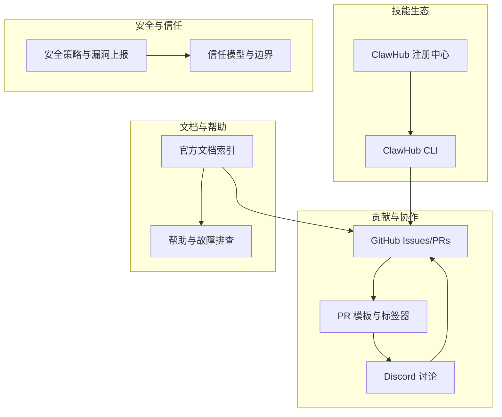

**图表来源**
- [.github/pull_request_template.md](file://.github/pull_request_template.md#L1-L116)
- [.github/labeler.yml](file://.github/labeler.yml#L1-L259)
- [docs/index.md](file://docs/index.md#L1-L193)
- [docs/help/index.md](file://docs/help/index.md#L1-L22)
- [docs/tools/clawhub.md](file://docs/tools/clawhub.md#L1-L44)
- [SECURITY.md](file://SECURITY.md#L1-L286)
- [VISION.md](file://VISION.md#L1-L111)

## 详细组件分析

### 贡献与 PR 流程
- 贡献入口
  - 小修小补直接开 PR；重大特性先在 GitHub Discussions 或 Discord 讨论
  - 问题咨询可前往 Discord #help 或 #users-helping-users
- PR 准备与规范
  - 本地测试、运行检查、CI 通过
  - 保持 PR 聚焦、描述“做了什么/为什么做”
  - 审查对话作者负责跟进与解决
- AI 协作
  - 使用 AI 辅助编码需标注并提供测试与提示记录
- 当前重点与路线图
  - 稳定性、UX、技能生态、性能优化
  - 通过 Issues 的“good first issue”标签识别入门任务

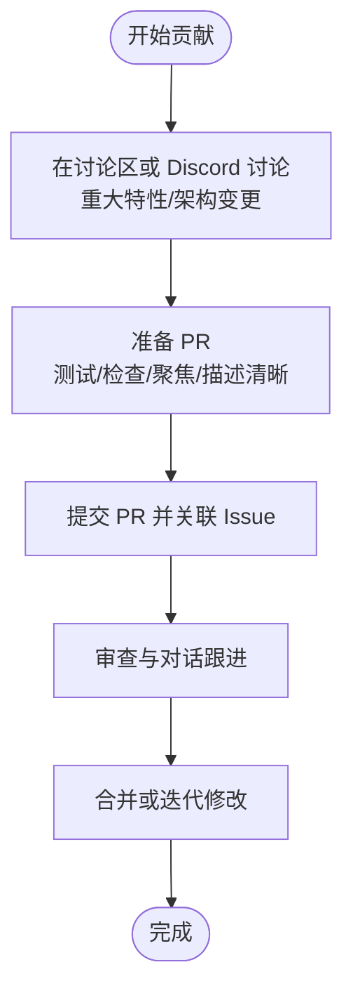

**图表来源**
- [CONTRIBUTING.md](file://CONTRIBUTING.md#L76-L141)
- [.github/pull_request_template.md](file://.github/pull_request_template.md#L1-L116)

**章节来源**
- [CONTRIBUTING.md](file://CONTRIBUTING.md#L76-L141)
- [.github/pull_request_template.md](file://.github/pull_request_template.md#L1-L116)

### 维护者与决策流程
- 维护者角色与职责
  - 明确维护者名单与职责范围
  - 维护者需积极参与问题分类、PR 审查与项目推进
- 申请成为维护者
  - 需要过往贡献链接、个人背景与可投入时间
  - 申请邮箱与所需材料清单

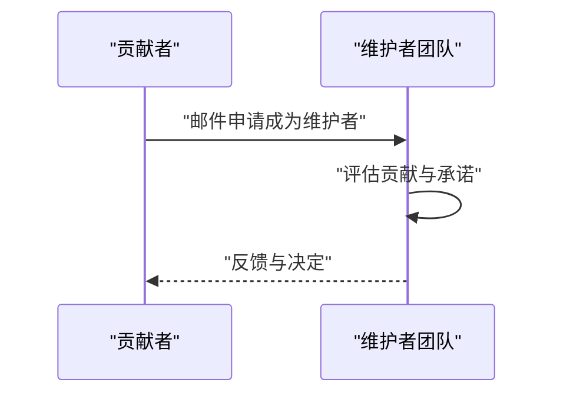

**图表来源**
- [CONTRIBUTING.md](file://CONTRIBUTING.md#L142-L160)

**章节来源**
- [CONTRIBUTING.md](file://CONTRIBUTING.md#L142-L160)

### 安全与漏洞上报
- 上报渠道
  - 按模块归属仓库直接上报，或通过安全邮箱汇总
- 报告清单
  - 标题、严重性、影响、受影响组件、技术复现、演示影响、环境、修复建议
- 报告验收门槛
  - 包含精确路径、受测版本、可复现 PoC、边界越界证明、范围说明等
- 信任模型与边界
  - 强调“个人助理”信任模型，明确边界与推荐部署方式
- 运维与扫描
  - 安全审计、工具硬核与 Docker 最小化运行建议

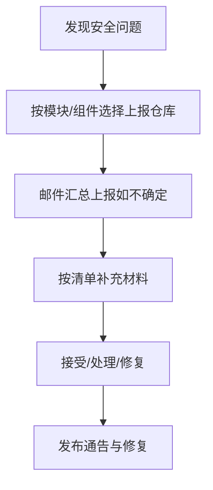

**图表来源**
- [SECURITY.md](file://SECURITY.md#L5-L46)
- [CONTRIBUTING.md](file://CONTRIBUTING.md#L162-L173)

**章节来源**
- [SECURITY.md](file://SECURITY.md#L1-L286)
- [CONTRIBUTING.md](file://CONTRIBUTING.md#L162-L173)

### 技能生态与 ClawHub
- 角色定位
  - ClawHub 是 OpenClaw 的公共技能注册中心，提供搜索、安装、更新与发布能力
- 工作流
  - CLI 登录、搜索、安装、更新、同步与发布
  - 工作区优先加载策略，支持版本与标签管理
- 国际化
  - 提供英文与中文文档，覆盖 CLI 选项与工作流

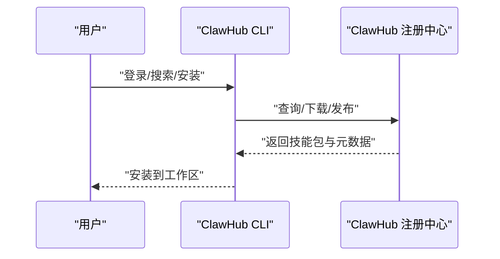

**图表来源**
- [docs/tools/clawhub.md](file://docs/tools/clawhub.md#L1-L44)
- [docs/zh-CN/tools/clawhub.md](file://docs/zh-CN/tools/clawhub.md#L1-L158)

**章节来源**
- [docs/tools/clawhub.md](file://docs/tools/clawhub.md#L1-L44)
- [docs/zh-CN/tools/clawhub.md](file://docs/zh-CN/tools/clawhub.md#L1-L158)

### 交流渠道与社区活动
- 主要渠道
  - Discord：提供帮助与互助频道
  - GitHub Discussions：重大议题与设计讨论
  - X/Twitter：项目动态与维护者发声
- 平台与生态
  - 多平台应用与节点（macOS、iOS、Android），便于社区分享与反馈
  - 文档与帮助入口，降低上手成本

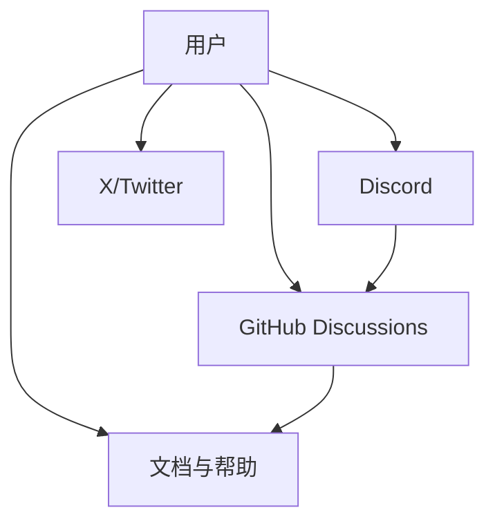

**图表来源**
- [CONTRIBUTING.md](file://CONTRIBUTING.md#L5-L11)
- [README.md](file://README.md#L26-L495)
- [docs/help/index.md](file://docs/help/index.md#L1-L22)

**章节来源**
- [CONTRIBUTING.md](file://CONTRIBUTING.md#L5-L11)
- [README.md](file://README.md#L26-L495)
- [docs/help/index.md](file://docs/help/index.md#L1-L22)

### 文档与帮助体系
- 文档索引
  - 官方文档首页提供功能概览、快速开始与导航卡片
- 帮助入口
  - 故障排查、安装健康检查、日志与修复工具
- 常见问题
  - FAQ 与概念性问题入口

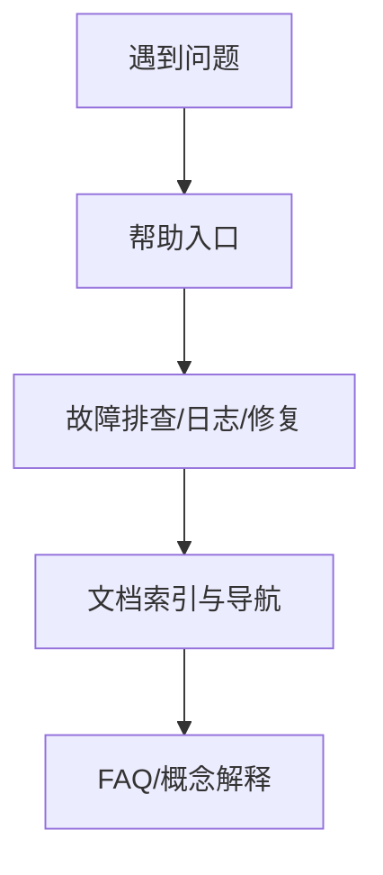

**图表来源**
- [docs/index.md](file://docs/index.md#L1-L193)
- [docs/help/index.md](file://docs/help/index.md#L1-L22)

**章节来源**
- [docs/index.md](file://docs/index.md#L1-L193)
- [docs/help/index.md](file://docs/help/index.md#L1-L22)

### 治理与自动化
- 自动化标签与权限
  - 通过标签器自动为不同模块打标签，简化分类与路由
  - 自动响应工作流识别维护者与特权作者，提升处理效率
- 依赖更新策略
  - Dependabot 配置跨生态（npm、GitHub Actions、Swift、Gradle、Docker）每日/每周更新策略与限制

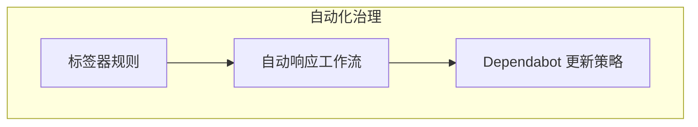

**图表来源**
- [.github/labeler.yml](file://.github/labeler.yml#L1-L259)
- [.github/dependabot.yml](file://.github/dependabot.yml#L1-L128)

**章节来源**
- [.github/labeler.yml](file://.github/labeler.yml#L1-L259)
- [.github/dependabot.yml](file://.github/dependabot.yml#L1-L128)

### Discord 子系统与访问控制
- 配置与策略
  - 通过配置项控制 DM 策略、提及要求、角色/用户白名单、线程与组件等
- 工具与动作
  - 支持线程创建、列出、删除等动作，结合工具策略启用/禁用
- UI 与组件
  - 支持按钮、下拉、模态表单等组件，便于交互式操作

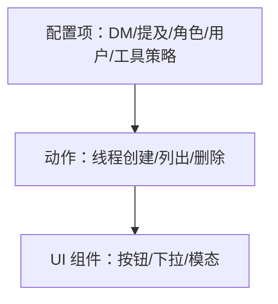

**图表来源**
- [src/config/zod-schema.providers-core.ts](file://src/config/zod-schema.providers-core.ts#L373-L421)
- [src/agents/tools/discord-actions-messaging.ts](file://src/agents/tools/discord-actions-messaging.ts#L355-L390)
- [docs/channels/discord.md](file://docs/channels/discord.md#L314-L373)

**章节来源**
- [src/config/zod-schema.providers-core.ts](file://src/config/zod-schema.providers-core.ts#L373-L421)
- [src/agents/tools/discord-actions-messaging.ts](file://src/agents/tools/discord-actions-messaging.ts#L355-L390)
- [docs/channels/discord.md](file://docs/channels/discord.md#L314-L373)

## 依赖关系分析
- 贡献与文档
  - 贡献指南驱动 PR 流程与标签器，文档索引支撑帮助入口
- 技能生态
  - ClawHub CLI 与注册中心联动，工作区加载策略确保一致性
- 安全与信任
  - 安全策略与信任模型共同指导部署与运维实践
- 交流与协作
  - Discord 与 GitHub Discussions 形成互补，社交媒体扩大影响力

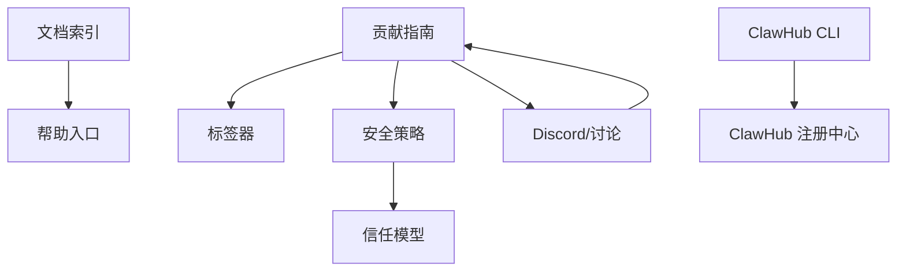

**图表来源**
- [CONTRIBUTING.md](file://CONTRIBUTING.md#L76-L141)
- [.github/labeler.yml](file://.github/labeler.yml#L1-L259)
- [SECURITY.md](file://SECURITY.md#L1-L286)
- [docs/index.md](file://docs/index.md#L1-L193)
- [docs/help/index.md](file://docs/help/index.md#L1-L22)
- [docs/tools/clawhub.md](file://docs/tools/clawhub.md#L1-L44)

**章节来源**
- [CONTRIBUTING.md](file://CONTRIBUTING.md#L76-L141)
- [.github/labeler.yml](file://.github/labeler.yml#L1-L259)
- [SECURITY.md](file://SECURITY.md#L1-L286)
- [docs/index.md](file://docs/index.md#L1-L193)
- [docs/help/index.md](file://docs/help/index.md#L1-L22)
- [docs/tools/clawhub.md](file://docs/tools/clawhub.md#L1-L44)

## 性能考量
- 项目当前优先级涵盖稳定性、UX、技能生态与性能优化，建议贡献者关注与这些方向一致的改进点
- 通过文档与帮助入口获取最新指南与最佳实践

[本节为通用建议，无需特定文件引用]

## 故障排查指南
- 快速入口
  - 故障排查、安装健康检查、日志与修复工具
- 常见问题
  - FAQ 与概念性问题入口，适合非“具体故障”类问题

**章节来源**
- [docs/help/index.md](file://docs/help/index.md#L1-L22)

## 结论
OpenClaw 社区生态以“安全可信、文档完善、技能丰富、协作高效”为核心目标。通过明确的贡献流程、安全策略与交流渠道，以及 ClawHub 技能生态与资助支持，鼓励开发者与用户共同参与，推动项目持续演进。

[本节为总结，无需特定文件引用]

## 附录
- 资助与赞助
  - 通过 GitHub Sponsors 链接支持项目
- 交流与参与
  - GitHub Issues/PRs、Discord、GitHub Discussions、X/Twitter
  - 维护者申请与职责说明

**章节来源**
- [.github/FUNDING.yml](file://.github/FUNDING.yml#L1-L2)
- [CONTRIBUTING.md](file://CONTRIBUTING.md#L5-L11)
- [CONTRIBUTING.md](file://CONTRIBUTING.md#L142-L160)